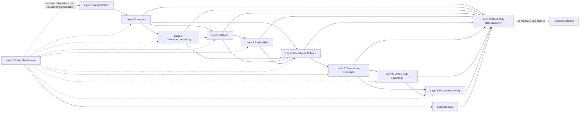

<!--
SYNCHRONIZED_DISTRIBUTION_SNAPSHOT
canonical_source_path: docs/authorities/08_implementation_build_book/Master_Implementation_Build_Book_R6_Phase_0_No_External_CI_Gate.md
source_sha256: 6820bdedbe8498ad485ccdfd8deb30945a8ea67554424ca2658dfee488f46ea3
authority_status: AUTHORITATIVE_CURRENT_SOURCE
supersession_status: CURRENT
body_after_this_comment_matches_canonical_source: true
-->

---
document_id: "IHARQ-IBB-R6-P00-NO-EXTERNAL-CI-GATE"
revision: "R6"
status: "CURRENT_CONTROLLING_PHASE0_IMPLEMENTATION_AUTHORITY"
supersedes: "Master Implementation Build Book R5 for P00 workflow-gate interpretation"
---

# Master Implementation Build Book R6 — Phase 0 No-External-CI-Gate Successor

This controlled successor preserves the complete R5 body below and replaces only the Phase 0 workflow-gate interpretation. GitHub CI is outside P00 scope, is not a gate, was not executed, and is not required for publication, P0-GATE-18, Phase 0 closure, or Phase 1 authorization. Local deterministic validation and clean reproduction remain mandatory. `P0-GATE-17_LOCAL` passes. Historical GitHub-CI-gated records remain superseded provenance.

---

---
title: "IHARQ BenchGuard Stretch C — Master Implementation Build Book R5, Phase 0 Whole-Stack Synchronization Successor"
document_id: "IHARQ-IBB-R5-P00-WHOLE-STACK-SYNC"
revision: "R5"
date: "2026-08-03"
status: "ADVANCED_INTERNAL_REPOSITORY_FINAL_AUDIT_PASS_READY_FOR_PUBLICATION_AND_CLOSURE"
supersedes: "IHARQ-IBB-R4-P00-INTEGRATED for current Phase 0 status surfaces only"
---

# R5 Current-State Synchronization Cover

This R5 successor preserves the complete R4 implementation authority below and updates only the implementation-owned current-state surfaces that became stale after Protocol v1.0, the registered Phase 0 execution and analysis release, final Layer 0 disposition, accepted Phase 0 Evidence Map, the basic Phase 0 Layer 10 package, and their independent audits were completed.

## Current Phase 0 implementation and closure-readiness state

```yaml
phase_id: P00
phase_name: Repository, Configuration, and Record Schema
implementation_status: PHASE_0_LOCAL_IMPLEMENTATION_FINALIZED_WITH_NONBLOCKING_LIMITATIONS
protocol_master: IHARQ-PROTOCOL-V1-MASTER-R2
protocol_p00_annex: IHARQ-PROTOCOL-V1-P00-ANNEX-R2
protocol_timing_mode: B
execution_release: P00-EXECUTION-RELEASE-R2
analysis_release: P00-ANALYSIS-RELEASE-R2
analysis_report: IHARQ-P00-PHASE-ANALYSIS-REPORT-R3-LAYER0-CORRECTED
layer0_release: P00-LAYER0-RELEASE-R2
evidence_map_release: P00-EVIDENCE-MAP-RELEASE-R2
layer10_package: P00-BASIC-LAYER10-PACKAGE-R2
p0_gate_01_to_15: PASS
p0_gate_16_implementation: PASS_WITH_NONBLOCKING_LIMITATIONS
p0_gate_17_local: PASS
p0_gate_18: READY_TO_PASS_AFTER_PUBLICATION
phase0_closure: FINAL_AUDIT_PASS_NOT_YET_CLOSED
phase1: READY_BUT_NOT_AUTHORIZED
publication_state: NOT_PERFORMED_BY_THIS_PROMPT
github_ci: NOT_APPLICABLE_BY_ACCEPTED_WORKFLOW_STRATEGY
kaggle: NOT_REQUIRED_FOR_P00
```

## R5 precedence and no-loss rule

1. R4 remains the complete implementation design and historical implementation-finalization authority.
2. This R5 cover supersedes R4 statements that Protocol v1.0, Phase Analysis, Layer 0, the Evidence Map, or the basic P00 Layer 10 package are still pending.
3. No R4 architecture, Registry, scientific method, algorithm, schema, execution result, finding, claim disposition, or evidence record is altered by this status synchronization.
4. Governance V4 requires immutable publication before the downstream phase handoff. Because publication is expressly outside the current prompt, P0-GATE-18 is ready to pass after the governed one-batch publication; Phase 0 is not yet formally closed and Phase 1 is ready but not authorized.
5. The complete R4 body follows verbatim for no-loss review and rollback.

---

# Preserved R4 Body

---
title: "IHARQ BenchGuard Stretch C — Master Implementation Build Book R4, Phase 0 Integrated Successor"
subtitle: "Golden Implementation Baseline with the Accepted Phase 0 Local-First Implementation and Readiness State Integrated"
author: "Prepared from the governed IHARQ authority stack"
date: "2026-08-03"
lang: en
---

# Document Navigation

- Front Matter
- R4 Integration Control — Current Phase 0 State, Precedence, and Execution Boundary
- Part I — Executive Implementation Contract
- Part II — Project Identity, Scope, and Immutable Boundaries
- Part III — Source Intake, Authority, and Requirement Extraction
- Part IV — Current Implementation Baseline
- Part V — System-Wide Implementation Principles and Invariants
- Part VI — Physical Software Architecture
- Part VII — Reusable Layer Implementation Dossiers
- Part VIII — Phase-Oriented Implementation and Execution Profiles
- Part IX — Ablation Implementation Binding
- Part X — Orchestration, Commands, and Notebooks
- Part XI — Verification, Testing, and Evidence Gates
- Part XII — Error Handling, Repair, Migration, Invalidation, and Rollback
- Part XIII — Protocol v1.0 and Phase Analysis Integration
- Part XIV — Layer 0, Evidence Map, and Layer 10 Closure
- Part XV — GitHub, Kaggle, Hugging Face, CI/CD, and Release
- Part XVI — Performance, Resources, Observability, and Cost
- Part XVII — Risk, Technical Debt, and Open Decisions
- Part XVIII — Sequenced Implementation Roadmap
- Part XIX — Acceptance, Freeze, Reproduction, and Handoff
- Part XX — Advanced Assurance, Standards Alignment, and Independent Re-Audit
- Part XXI — Mandatory Appendices
- Final Governing Statement
- Appendix V — Incorporated Phase 0 Local-First Finalization Annex R5

> **Document status:** [IMPLEMENTED — PHASE 0 FOUNDATION] [LOCAL-FIRST FINALIZATION COMPLETE] [PASS WITH NONBLOCKING PORTABILITY LIMITATIONS] [P01–P15 CONTRACT-READY] [PROTOCOL v1.0 PENDING] [NO EMPIRICAL SCIENTIFIC RUN CLAIMS] [PHASE 0 NOT CLOSED]

> **Interpretive rule:** This document is the implementation authority defined by Governance V4. It is not the Architecture, Canonical Registry, Method Selection, Nuts-and-Bolts, Protocol, findings, claim, or publication authority.

> **Completion rule:** Every unavailable physical fact is explicitly marked [NOT-PROVIDED], [OWNER-DECISION-REQUIRED], [UPSTREAM-CHANGE-REQUEST], or [DEFERRED-TO-PROTOCOL-V1.0]. No missing repository, run, empirical result, or scientific constant is invented.

# R4 Integration Control — Current Phase 0 State, Precedence, and Execution Boundary

## R4.1 Purpose of this successor

This R4 document is the integrated successor to:

- `IHARQ-IBB-R3` — the project-wide Master Implementation Build Book R3; and
- `IHARQ-IBB-R3-P00-LOCAL-FIRST-ANNEX-R5` — the accepted Phase 0 Local-First Finalization Annex R5.

R4 preserves the complete reusable implementation authority of R3, incorporates the complete R5 annex, and updates only the implementation-owned surfaces whose factual status changed after the Phase 0 local-first implementation and readiness workflow.

## R4.2 Precedence rule

Within this integrated successor:

1. The seven core authorities and Governance V4 retain their original domain ownership.
2. R4 controls the current physical implementation, local execution, environment, test, package, and Phase 0 readiness status.
3. Any R3 statement saying that the Phase 0 repository, code, schemas, configs, fixtures, tests, manifests, local execution, or handoff was not provided is historical and is superseded by the R4 current-state sections and incorporated R5 annex.
4. R3 statements concerning later empirical phases remain planning/implementation obligations unless a later accepted phase annex supersedes them.
5. Protocol v1.0, Phase Analysis, the Phase Evidence Report, final Layer 0 disposition, the accepted Evidence Map, final Layer 10 package, final release, Phase 0 closure, and Phase 1 authorization remain deferred.

## R4.3 Current controlling Phase 0 status

```yaml
phase_id: P00
phase_name: Repository, Configuration, and Record Schema
implementation_status: PHASE_0_LOCAL_IMPLEMENTATION_FINALIZED_WITH_NONBLOCKING_LIMITATIONS
review_mode: LLM_ONLY
human_review_used: false
workflow_strategy: LOCAL_FIRST_SINGLE_FUTURE_GITHUB_PUBLICATION
github_writes_performed: false
github_ci_required: false
github_ci_status: NOT_APPLICABLE_BY_ACCEPTED_WORKFLOW_STRATEGY
verified_runtime: Python 3.13.5
exact_local_lock: REQUIREMENTS-LOCK-LOCAL-EXACT-R3
portable_uv_lock_status: COMPLETE_UV_LOCK_DEFERRED_ENVIRONMENTALLY
python_3_11: LOCAL_COMPATIBILITY_VERSION_UNAVAILABLE
python_3_12: LOCAL_COMPATIBILITY_VERSION_UNAVAILABLE
python_3_13: PASS
deterministic_tests: 68/68 PASS
valid_integrated_bundles: 19/19 PASS
malformed_fixture_categories: 178/178 REJECTED
local_ci_equivalent_steps: 12/12 PASS
clean_reproduction_steps: 10/10 PASS
phase_contracts: P00 FOUNDATION_IMPLEMENTED; P01-P15 CONTRACT_READY
layer_foundations: L0-L10 PHASE_0_FOUNDATION_COMPLETE
ablations: A0-A13 FOUNDATION/HOOK READY; A14 REJECTED
P0_GATE_17_LOCAL: PASS
P0_GATE_18: DEFERRED_TO_LATER_GOVERNED_PHASE0_CLOSURE
source_package_sha256: bcbf5c70e4b0ca09caa73c3f0963d8cc1bc0adbc0741fad60ef6cd936ca66c95
```

## R4.4 What was executed in Phase 0

The Build Book itself is not an executable program. Its Phase 0 obligations were realized through the implementation package and local commands/tests. The completed execution scope includes:

- authority and source intake;
- repository/package structure;
- schema and record-family foundations;
- configuration profiles;
- typed identity, canonical serialization, hashing, and seed handling;
- lineage, lifecycle, manifest, and invalidation foundations;
- positive and malformed fixture suites;
- validators and deterministic tests;
- L0–L10 foundation integration;
- A0–A13 readiness and A14 rejection;
- local CI-equivalent execution;
- exact local environment capture;
- clean extraction reproduction;
- package-manifest and SHA-256 closure;
- readiness packages for the remaining Phase 0 documents.

No Kaggle run, model training, scientific ablation, stress experiment, policy learning, simulator experiment, or embodiment experiment was required for this non-empirical Phase 0 implementation scope.

## R4.5 What remains to be executed

The next governed sequence is:

```text
Protocol v1.0 Master and P00 Annex
→ timing Mode B/C audit and any registered post-freeze P00 rerun
→ Phase Analysis
→ Phase Evidence, Results, and Interpretation Report
→ final Layer 0 disposition
→ accepted Evidence Map Phase 0 annex
→ final Layer 10 Phase 0 package
→ final consistency/reproduction review
→ one owner-authorized GitHub publication batch
→ Phase 0 closure and Phase 1 handoff
```

This remaining sequence is not evidence that the Phase 0 implementation foundation is incomplete. It is the documentary, analytical, claim-governance, presentation, and release closure workflow required after implementation readiness.


# Front Matter

## Document Control

| Field | Resolved value |
|---|---|
| Document ID | IHARQ-IBB-R4-P00-INTEGRATED |
| Official title | IHARQ BenchGuard Stretch C — Master Implementation Build Book |
| Operational subtitle | Golden Implementation Baseline |
| Document number in stack | 08 |
| Current revision | R4 |
| Status | [PHASE 0 FOUNDATION IMPLEMENTED] [LOCAL-FIRST FINALIZATION COMPLETE] [PROTOCOL v1.0 PENDING] [PHASE 0 NOT CLOSED] |
| Prepared date | 2026-08-03 |
| Prepared by | OpenAI research-engineering drafting agent, under user instruction |
| Reviewed by | Five-pass LLM-only review plus deterministic source, schema, fixture, test, gate, manifest, hash, package, and clean-reproduction validation |
| Approved by | Project-owner workflow directive implemented through `P00-LOCAL-FIRST-SINGLE-PUBLICATION-R1`; no human scientific or institutional approval is implied |
| Governing guide | IHARQ Document Stack Governance and Creation Guide V4 |
| Compatible source set | Exact source identities and SHA-256 hashes in Compatibility Manifest |
| Source repository | Local repository-ready package `IHARQ_Phase_0_Local_First_Finalization_and_Readiness_COMPLETE_R1`; future GitHub publication deferred |
| Source commit | [NOT APPLICABLE AT LOCAL-FIRST INTERMEDIATE STAGE — exact local package SHA-256 controls identity] |
| Build Book file hash | Recorded externally in PACKAGE_MANIFEST_SHA256.txt after final serialization |
| Supersedes | IHARQ-IBB-R3 plus Phase 0 Annexes R2–R5 as separate-reading surfaces; R5 is incorporated without loss |
| Superseded by | None at R4 preparation |
| Freeze state | PHASE 0 IMPLEMENTATION FOUNDATION LOCALLY FINALIZED; Protocol/analysis/closure surfaces remain unfrozen |
| Confidentiality/access | PRIVATE WORKING AUTHORITY until project owner approves release |

## Maturity Labels Used

```text
[SKELETON] [RESEARCH-IN-PROGRESS] [CANDIDATE-DECISIONS]
[PROVISIONALLY-SELECTED] [ACCEPTED] [DESIGN-COMPLETE]
[IMPLEMENTATION-READY] [IMPLEMENTED] [REAL-RUN-EXECUTED]
[SMOKE-VERIFIED] [EVIDENCE-GATE-PASS] [EXPLORATORY]
[REGISTERED-DIAGNOSTIC] [CONFIRMATORY] [DIAGNOSTIC-ONLY]
[INTERFACE-STABLE] [PHASE-CLOSED] [SUPERSEDED]
[INVALIDATED] [FROZEN] [BLOCKED] [NOT-PROVIDED]
```

## Resolution and Proposal Convention

| Marker | Binding meaning |
|---|---|
| [SOURCE-RESOLVED] | Directly supported by the named governed source. |
| [IMPLEMENTATION-PROPOSAL] | A Build Book-owned physical realization proposed for owner acceptance; not a canonical Registry rename or scientific selection. |
| [OWNER-DECISION-REQUIRED] | A decision must be made by the named authority owner before the affected scope can be accepted. |
| [DEFERRED-TO-PROTOCOL-V1.0] | Exact scientific run/analysis constants remain outside Build Book authority. |
| [UPSTREAM-CHANGE-REQUEST] | A governed source must be revised or profiled before the implementation interface can become stable. |
| [NOT-PROVIDED] | The physical repository, code, run, artifact, credential, or empirical evidence was not supplied and is not fabricated. |
| [NOT-APPLICABLE — REASON] | The field is lawfully irrelevant for the identified scope. |

## Revision History

| Revision | Date | Change class | Summary | Trigger | Compatibility effect | Migration/invalidation | Approver |
|---|---|---|---|---|---|---|---|
| R4 | 2026-08-03 | PHASE 0 INTEGRATED / LOCAL-FIRST FINALIZATION SUCCESSOR | Integrates the accepted Phase 0 R5 annex, replaces stale P00 physical-state declarations, records the completed local tests/reproduction/package evidence, adopts the LLM-only and local-first decisions, and preserves all R3 reusable implementation obligations. | Completion of the Phase 0 local-first implementation and next-document readiness workflow. | Corrective and status-updating within Build Book authority; no architecture, Registry, scientific method, Protocol constant, observed result, or claim authority is changed. | R3 remains the historical implementation-ready baseline; R5 is incorporated; current P00 readers use R4. | Project-owner workflow directive / LLM-only governance record |
| R3 | 2026-08-02 | FRESH ACCEPTANCE / MARKDOWN SUCCESSOR | Re-runs the executable acceptance audit, reconciles source inventories and crosswalks, updates current external assurance statuses, and delivers a Markdown-primary successor. | Owner instruction to double-check all seven authorities, improve the framework lawfully, and omit PDF/DOCX. | Corrective and additive within Build Book authority; no scientific or canonical authority changed. | R2 superseded as documentary baseline; no empirical artifacts invalidated because none were supplied. | [OWNER-DECISION-REQUIRED] |
| R2 | 2026-08-02 | CORRECTIVE / ASSURANCE ENHANCEMENT | Corrects traceability semantics and machine-readable source identity; adds exact decision-to-design crosswalk, source-section consolidation, tested schema fixtures, portable paths, supply-chain provenance, research-object archive, and accessibility controls. | Independent re-audit and owner instruction to improve the framework. | Additive and corrective; no scientific method, canonical record, phase obligation, or Protocol constant is changed. | R1 is superseded as the delivery baseline; no empirical artifact invalidated because none was supplied. | [OWNER-DECISION-REQUIRED] |
| R1 | 2026-08-02 | INITIAL / IMPLEMENTATION BASELINE | Creates Document 08 from Governance V4, seven completed core authorities, the supplied master prompt, and project-specialized template; R2 adds independent re-audit corrections and non-authoritative assurance enhancements. | Project-owner request to execute the creation prompt. | No existing Build Book superseded; defines proposed physical realization and explicit owner gates. | No empirical artifacts invalidated; future implementation MUST bind to this revision or accepted successor. | [OWNER-DECISION-REQUIRED] |

## Compatibility Manifest

| ID | Authority/asset | Revision | SHA-256 | Status | Size/Build Book consequence |
|---|---|---|---|---|---|
| GOV | IHARQ BenchGuard Stretch C — Document Stack Governance and Creation Guide V4 | V4 | 81092849f03dfe2bc31b63dd3aeeac47b741860bedf8baa4d2f915b7bcc18c26 | ACCEPTED — GOVERNING GUIDE | 1,787 lines / 64,834 bytes |
| ARCH | Master Architecture Specification | T29 Layout-Corrected Final Successor R1 | ae374c9de061bc5179c9223e7d646c70cf0d98c414007ab6baf95cd68c814f9b | ACCEPTED — ACTIVE; documentary/logical | 40,053 extracted text lines / 2,695,349-byte governing PDF |
| REG | Canonical Artifact, Record, and Interface Registry | Final R44 Layer 10 Synchronized | bdb309f76b9b525ea89cfa56c79a9b7989348e3509febac9ae9fffe7858d1f87 | ACCEPTED — ACTIVE; physical schemas pending validation | 16,729 lines / 2,250,836 bytes |
| PLAN | Execution and Evidence Plan | Final R41 Layer 10 Synchronized | f31de3453b331d909a8cccbf951a2df61ef7ca38b71df4bde8be95040095da82 | ACCEPTED — ACTIVE; evidence generation pending | 25,326 lines / 2,209,626 bytes |
| PROT0 | Experiment, Ablation, and Evaluation Protocol v0.1 authority | Final R42 Layer 10 Synchronized | 8b7a393b860bd49a34a794db5c2b80af7f127bc318a112bc7ed3c375ce704813 | ACCEPTED — ACTIVE; exact v1.0 contract pending | 18,617 lines / 1,650,906 bytes |
| PLAY | Complete Phase Execution Playbook | Final R41 Layer 10 Synchronized | 176f46950b86db8cd5c23789893955336c818a6fcd10ed36d6c66e096faccc87 | ACCEPTED — ACTIVE; execution pending | 22,815 lines / 2,300,203 bytes |
| MSEL | Integrated Layers 0–10 Method Selection and Design Rationale Register | Final Merged R2 | b036b02ac65b3bc2595513f4ca8a8137a6273f914e46e1cf6180515e57726749 | MERGED MASTER AUTHORITY; controlled physical/evidence gaps | 105,820 lines / 10,716,865 bytes |
| NB | Integrated Layers 0–10 Detailed Design / Nuts-and-Bolts Specification | Final Merged R2 | 4f47c6f511e646b2127cc79f14a5f632b00f5112582a049b46c735e78ded638c | IMPLEMENTATION-READY AT LOGICAL CONTRACT LEVEL; controlled physical/evidence gaps | 92,177 lines / 9,251,125 bytes |
| TPL | Implementation Build Book Template | Project-specialized master template | 7c57d02b4fdf5afc376dea505c1cc4848b3ade581a50525ddf8284ebe9a7ba02 | INPUT SPECIFICATION | 2,023 lines / 84,582 bytes |
| PROMPT | Implementation Build Book Creation Prompt | Master prompt | f8b09878243acfb663d4c313a11deb28d7d30f44d81e145c4628756ce70f184c | EXECUTION SPECIFICATION | 644 lines / 30,182 bytes |
| PROT1 | Experiment, Ablation, and Evaluation Protocol v1.0 | [NOT YET CREATED] | — | Next governed document; complete readiness package exists | Master/P00-annex hooks and readiness package complete |
| EVIDENCE-MAP | Paper and Thesis Evidence Map | [NOT YET CREATED / NOT PROVIDED] | — | Required before final Layer 10 claim-bearing package | Interface skeleton only |
| CODE | Local repository-ready Phase 0 implementation package | `IHARQ_Phase_0_Local_First_Finalization_and_Readiness_COMPLETE_R1` / `bcbf5c70e4b0ca09caa73c3f0963d8cc1bc0adbc0741fad60ef6cd936ca66c95` | ACCEPTED LOCAL IMPLEMENTATION EVIDENCE | Physical P00 foundation implemented and locally reproduced; no GitHub commit required at this stage | Future one-batch publication deferred |
| RUNS | Phase 0 local engineering/conformance executions | Local CI-equivalent, fixture, audit, manifest, and clean-reproduction records in the final package | ACCEPTED ENGINEERING-FOUNDATION EVIDENCE | No empirical scientific run or phase-closure claim | Official Protocol-governed analysis/closure remains deferred |

## Executive Status Declaration

The project-wide implementation authority remains valid, and the Phase 0 physical foundation has now been realized locally. The final package contains the repository structure, source modules, schemas, configurations, record profiles, fixtures, validators, tests, manifests, local execution records, environment evidence, clean-reproduction evidence, and six next-document readiness packages required for the current stage.

The current truthful status is:

```text
PHASE_0_LOCAL_IMPLEMENTATION_FINALIZED_WITH_NONBLOCKING_LIMITATIONS
```

The two bounded limitations are portability-related rather than P00 implementation failures:

1. the complete registry-resolved portable `uv.lock` could not be produced in the available offline environment, while the exact verified 22-distribution local lock is preserved; and
2. Python 3.11 and 3.12 were unavailable locally, while Python 3.13.5 passed the complete suite.

The implementation foundation may therefore proceed to Protocol v1.0. No empirical scientific result, final Phase Analysis, final Phase Evidence Report, Layer 0 claim disposition, accepted Evidence Map, final Layer 10 package, Phase 0 closure, or Phase 1 authorization is asserted by this document.

### R4 Phase 0 integration corrections

R4 corrects the factual status surfaces that became stale after R3:

1. replaces `PHYSICAL IMPLEMENTATION NOT PROVIDED` for P00 with the exact local package identity and current implementation status;
2. records 68/68 deterministic tests, 19/19 valid/integrated bundles, and 178/178 intentionally malformed fixture categories rejected;
3. records the 12-step local CI-equivalent and 10-step clean-reproduction results;
4. adopts the controlled local-first gate profile and `P0-GATE-17_LOCAL`;
5. records GitHub CI as not applicable to the intermediate local-finalization stage rather than a missing mandatory gate;
6. integrates LLM-only review and removes human-quorum dependence for the project-local workflow;
7. records all L0–L10 foundations as complete within Phase 0 scope and P01–P15 contracts as ready;
8. incorporates the full R5 annex and its scope boundary; and
9. preserves all later-phase implementation and empirical obligations without prematurely promoting them.

### R3 Fresh Acceptance Audit Corrections

### R3 Fresh Acceptance Audit Corrections

R3 was produced from a new acceptance audit that reran the executable validator against the files actually present in the delivered R2 directory. The first rerun failed 13 checks, so R2 was not merely reaffirmed. R3 corrects the following package-state defects:

1. regenerates A0 from 22,109 to **23,994** raw observations by explicitly indexing the creation prompt and template as controlled inputs;
2. regenerates A1 from 6,356 to **6,598** consolidated source-section dispositions;
3. regenerates A2 from 387 to **405** accepted decision mappings, including all 18 official Layer 9 `MS-L9-*` decisions;
4. resolves all 405 Method Selection decisions to exact Nuts-and-Bolts locations—129 through structured rows and 276 through exact full-text line-and-heading matches;
5. replaces unresolved `G-RELEASE` references with the accepted `G-PUBLISH`/source-specific gate vocabulary and verifies every A0–A2 test/gate reference;
6. restores nonzero source-utilization evidence for the supplied creation prompt and template;
7. revalidates the 90-work-package dependency graph, all schemas, source hashes, portable paths, and machine-readable parity; and
8. updates non-authoritative external assurance guidance while preserving strict owner-gating and project-authority precedence.

The corrected R3 state passes the complete Markdown/machine-readable validation suite.

### R2 Historical Re-Audit Corrections

R2 corrects four material weaknesses found during independent re-audit of R1:

1. the original 22,109-row extraction was explicitly reframed as a **raw source-observation inventory** and is superseded by the 23,994-row R3 inventory, not a falsely finalized requirement catalog;
2. a consolidated source-section control matrix and an exact Method Selection → Nuts-and-Bolts → implementation crosswalk are added;
3. machine-readable source entries use portable logical paths and preserve the governing Architecture PDF hash, while the text-extraction hash is recorded only as a derived indexing aid;
4. current external engineering standards are incorporated as non-authoritative assurance profiles for software supply-chain provenance, SBOM/AI-BOM, research-object archiving, interoperable provenance, secure development, FAIR release quality, and Layer 10 accessibility.

These corrections do not change any scientific method, canonical record, architecture topology, phase evidence obligation, Protocol-owned constant, empirical result, or claim authority.


# Part I — Executive Implementation Contract

## 1. Purpose

This Build Book converts the accepted IHARQ BenchGuard Stretch C architecture, records, phase obligations, scientific decisions, and detailed designs into a coherent physical implementation contract. It governs how reusable layer capabilities, phase profiles, runtime environments, commands, tests, evidence gates, immutable artifacts, repair flows, and reproducibility releases are built and operated.

### 1.1 Primary outcomes

- One implementation map for Layers 0–10, with stable reusable cores and phase-selected configurations.
- Executable profiles for Phases 0–15, including entry state, reuse/rerun/extension decisions, real-run-first execution, conditional smoke, analysis, and evidence closure.
- Distinct implementation bindings for A0–A13 without changing their scientific identities.
- Physical package, configuration, environment, CLI, storage, manifest, test, evidence-gate, repair, invalidation, release, and archival contracts.
- Exact traceability from authority requirement to implementation unit, test, gate, artifact, phase handoff, Layer 0, Evidence Map, Layer 10, and thesis-facing evidence.
- Machine-readable companion artifacts suitable for controlled implementation by engineers or coding agents.

## 2. Golden-Baseline Interpretation

### 2.1 What this document controls

| Implementation surface | Authority level | Control |
|---|---|---|
| Repository and package structure | Primary | Paths, ownership, dependency direction, optional adapters, code/non-code separation. |
| Module/class/function realization | Primary | Stable implementation IDs, public interfaces, reusable core boundaries, implementation-only wrappers. |
| Configuration and runtime resolution | Primary | Precedence, validation, semantic hashing, Protocol lock, secret handling. |
| Environments and dependency locks | Primary | Platform profiles, lock strategy, runtime verification, clean reproduction. |
| Commands, workflows, orchestration | Primary | Layer/phase commands, DAG, retry/transaction semantics, repair and closure. |
| Tests, fixtures, validators, evidence gates | Primary | Required test classes, blocking rules, promotion evidence, semantic audits. |
| Artifact paths, manifests, publication transactions | Primary | Immutable bundles, hashes, pointers, storage plane, release and archive. |
| Reusable layer work packages and phase profiles | Primary | Implementation sequence, reuse, extension, rerun, and downstream handoff. |

### 2.2 What this document does not control

| Non-authority | Owning source | Build Book behavior |
|---|---|---|
| System topology and scientific scope | Master Architecture | Reflects exact relationships; never silently simplifies or adds topology. |
| Canonical records, fields, interfaces, lifecycle | Canonical Registry | Physically realizes accepted identities; unresolved identities are owner-routed. |
| Phase evidence obligations and exit criteria | Execution and Evidence Plan | Implements gates and outputs; does not weaken definition of done. |
| Scientific method/platform choice | Method Selection Register | Implements accepted choices; new choices require upstream decision. |
| Algorithms, formulas, invariants, fallback semantics | Nuts-and-Bolts | Maps to code/validators; does not replace technical authority. |
| Exact run matrix, seeds, budgets, metrics, estimands, exclusions, analysis | Protocol v1.0 | Provides machine hooks and lock enforcement; defers exact values. |
| Observed results and interpretations | Phase Evidence Report | Provides generation/analysis infrastructure only. |
| Claim sufficiency and approved wording | Layer 0 | Provides read-only review interface; does not approve claims. |
| Claim-to-evidence-to-manuscript mapping | Evidence Map | Produces and consumes exact handoff schemas. |
| Primary scientific truth | Never Layer 10 | Layer 10 renders governed evidence read-only. |

### 2.3 Non-Duplication Rule

```yaml
source_authority: <document identity>
source_revision: <exact revision/hash>
source_section_or_decision_id: <exact source reference>
authority_status: reflected_not_reowned
implementation_consequence: <code/config/test/gate behavior>
```

Any source summary in this document is an implementation reflection. The full source remains controlling.

## 3. Intended Users

| User | Authorized use | Prohibited use |
|---|---|---|
| Project owner | Approve implementation proposals, owner gates, repositories, resources, and freeze. | Unrecorded override of scientific or canonical authority. |
| Research/software engineer | Implement reusable layer packages and tests. | Invent scientific constants or omit failed evidence. |
| ML engineer | Execute training/evaluation under frozen profiles. | Use evaluation data for fitting or alter Protocol cells post hoc. |
| Reproducibility/MLOps engineer | Create environments, manifests, releases, CI, archives. | Overwrite accepted evidence or publish unresolved artifacts. |
| Scientific reviewer | Audit Protocol, matching, leakage, analyses, and limitations. | Treat code existence as empirical validation. |
| Thesis author | Trace implementation and evidence to governed claims. | Write stronger claims than Layer 0/Evidence Map permit. |
| Coding agent | Execute bounded work packages with machine-readable inputs and gates. | Make owner decisions or silently patch upstream authority. |

## 4. Definition of Build Book Success

1. All implementation-relevant source obligations are represented in the traceability catalog or explicitly owner-routed/deferred.
2. Every layer has a reusable-core dossier with inputs, outputs, interfaces, configs, tests, gates, failures, artifacts, reuse, invalidation, and handoff.
3. Every phase has a profile with dependency order, reuse/rerun/extension decisions, Protocol timing, real/smoke commands, outputs, closure, and status.
4. A0–A13 retain separate selectors, source records, code paths, guards, outputs, and Protocol hooks.
5. Physical implementation cannot bypass authority, split/chronology, matching, negative-result, Layer 0, or Layer 10 boundaries.
6. Clean reproduction can resolve authority, code, environment, config, seeds, input IDs/hashes, outputs, gate decisions, analysis release, and publication pointers.
7. Unavailable physical or scientific details remain explicit owner gates rather than fabricated facts.

# Part II — Project Identity, Scope, and Immutable Boundaries

## 5. System Identity

| Field | Source-resolved project value |
|---|---|
| System | IHARQ BenchGuard Stretch C |
| Research character | Layered reliability architecture for low-calibration neural intent readiness. |
| Primary empirical anchor | Public EEG motor-imagery datasets; exact physical revisions remain OD-014/Protocol v1.0. |
| Evidence modes | Public-data benchmark; calibration/selective prediction; IHARQ verification; temporal trust; adaptive policy; bounded simulation; controlled stress; embodiment proxy. |
| Embodiment scope | Simulation-only assistive-action proof of concept. |
| Clinical status | Not clinical validation; not a medical-device or real FES-control system. |
| Implementation style | Record-first functional graph; reusable layer capabilities; phase profiles; immutable identity-based reuse. |
| Evidence lifecycle | Real-run-first with conditional smoke, evidence gates, Phase Report, Layer 0, Evidence Map, Layer 10, immutable release. |

## 6. Non-Negotiable Claim and Scope Boundaries

- Public-data and proxy limitations MUST be represented in manifests, reports, claims, views, cards, and exports.
- Layer 7, A10, and A11 outcomes MUST remain simulation-only.
- Layer 8/A12 outcomes MUST remain controlled-stress evidence and MUST NOT be described as physiological stress evidence.
- Layer 9/A13 outputs MUST remain embodiment-proxy, simulation-only, non-clinical evidence.
- The system MUST NOT make patient-safety, rehabilitation-efficacy, medical-device readiness, real FES-control, or deployment-readiness claims.
- RegimeRisk MUST be described as a computational trust/regime mechanism, not a diagnosis.
- Missing evidence MUST remain missing/unknown; it MUST NOT be converted into adverse evidence.
- Negative, null, failed, blocked, skipped, unmatched, partial, superseded, and invalid outcomes MUST remain discoverable.
- Layer 0 MUST NOT alter measurements. Layer 10 MUST NOT fit, retune, exclude, repair, or strengthen scientific evidence.

## 7. Official Layer Register

| Layer | Official identity | Proposed package | Implementation status | Primary gate |
|---|---|---|---|---|
| 0 | Claim-Safety and Scope Governance | src/iharq/layer0_claim_governance | [PLANNED] [IMPLEMENTATION-READY SPECIFICATION] [CODE NOT PROVIDED] | G-L0 |
| 1 | Public-Data and Protocol Anchor | src/iharq/layer1_data_protocol | [PLANNED] [IMPLEMENTATION-READY SPECIFICATION] [CODE NOT PROVIDED] | G-L1 |
| 2 | Decoder and Baseline Measurement Spine | src/iharq/layer2_decoders | [PLANNED] [IMPLEMENTATION-READY SPECIFICATION] [CODE NOT PROVIDED] | G-L2 |
| 3 | Calibration, Uncertainty, and Selective Prediction | src/iharq/layer3_calibration_uncertainty | [PLANNED] [IMPLEMENTATION-READY SPECIFICATION] [CODE NOT PROVIDED] | G-L3 |
| 4 | IHARQ Evidence Verification | src/iharq/layer4_iharq | [PLANNED] [IMPLEMENTATION-READY SPECIFICATION] [CODE NOT PROVIDED] | G-L4 |
| 5 | RegimeRisk Temporal Trust Monitoring | src/iharq/layer5_regimerisk | [PLANNED] [IMPLEMENTATION-READY SPECIFICATION] [CODE NOT PROVIDED] | G-L5 |
| 6 | Adaptive Readiness Policy Layer | src/iharq/layer6_readiness_policy | [PLANNED] [IMPLEMENTATION-READY SPECIFICATION] [CODE NOT PROVIDED] | G-L6 |
| 7 | Simulated Closed-Loop Readiness Environment | src/iharq/layer7_closed_loop | [PLANNED] [IMPLEMENTATION-READY SPECIFICATION] [CODE NOT PROVIDED] | G-L7 |
| 8 | StressForge-Lite Stress Generator | src/iharq/layer8_stressforge | [PLANNED] [IMPLEMENTATION-READY SPECIFICATION] [CODE NOT PROVIDED] | G-L8 |
| 9 | MyoSuite/OpenSim Embodiment Demo | src/iharq/layer9_embodiment | [PLANNED] [IMPLEMENTATION-READY SPECIFICATION] [CODE NOT PROVIDED] | G-L9 |
| 10 | Dashboard, Cards, and Reproducibility Layer | src/iharq/layer10_reproducibility | [PLANNED] [IMPLEMENTATION-READY SPECIFICATION] [CODE NOT PROVIDED] | G-L10 |

## 8. Official Phase Register

| Phase | Official identity | Participating layers | Ablations | Status |
|---|---|---|---|---|
| P00 | Repository, Configuration, and Record Schema | L0, L1, L2, L3, L4, L5, L6, L7, L8, L9, L10 | Foundation/no direct global ablation | [FOUNDATION IMPLEMENTED] [LOCAL-FIRST FINALIZED WITH NONBLOCKING LIMITATIONS] [PROTOCOL/ANALYSIS/CLOSURE PENDING] |
| P01 | Public Data and Split Protocol | L0, L1, L10 | Foundation/no direct global ablation | [PLANNED] [NOT-PROVIDED — no physical phase evidence supplied] |
| P02 | Baseline Decoders | L0, L1, L2, L10 | A0, A4 | [PLANNED] [NOT-PROVIDED — no physical phase evidence supplied] |
| P03 | Calibration and Uncertainty | L0, L1, L2, L3, L10 | A1, A2, A3 | [PLANNED] [NOT-PROVIDED — no physical phase evidence supplied] |
| P04 | IHARQ-lite Evidence Verification | L0, L1, L2, L3, L4, L10 | A5 | [PLANNED] [NOT-PROVIDED — no physical phase evidence supplied] |
| P05 | RegimeRisk Temporal Trust | L0, L1, L2, L3, L4, L5, L10 | A7 | [PLANNED] [NOT-PROVIDED — no physical phase evidence supplied] |
| P06 | Evidence-Quality Estimator and Supervised Adaptive-IHARQ | L0, L1, L2, L3, L4, L5, L6, L10 | A6, A9 | [PLANNED] [NOT-PROVIDED — no physical phase evidence supplied] |
| P07 | Learning-to-Defer | L0, L1, L2, L3, L4, L5, L6, L10 | A8 | [PLANNED] [NOT-PROVIDED — no physical phase evidence supplied] |
| P08 | Simulated Closed-Loop Readiness | L0, L1, L2, L3, L4, L5, L6, L7, L10 | A9 | [PLANNED] [NOT-PROVIDED — no physical phase evidence supplied] |
| P09 | StressForge-Lite | L0, L1, L2, L3, L4, L5, L6, L7, L8, L10 | A12 | [PLANNED] [NOT-PROVIDED — no physical phase evidence supplied] |
| P10 | Contextual Bandit | L0, L1, L2, L3, L4, L5, L6, L7, L10 | A10 | [PLANNED] [NOT-PROVIDED — no physical phase evidence supplied] |
| P11 | Reinforcement-Learning Policy | L0, L1, L2, L3, L4, L5, L6, L7, L10 | A11 | [PLANNED] [NOT-PROVIDED — no physical phase evidence supplied] |
| P12 | MyoSuite Embodiment Demo | L0, L1, L2, L3, L4, L5, L6, L7, L8, L9, L10 | A13 | [PLANNED] [NOT-PROVIDED — no physical phase evidence supplied] |
| P13 | OpenSim Replay or Optional Comparison | L0, L1, L2, L3, L4, L5, L6, L7, L8, L9, L10 | A13 | [PLANNED] [NOT-PROVIDED — no physical phase evidence supplied] |
| P14 | Dashboard and Cards | L0, L10 | A0, A1, A2, A3, A4, A5, A6, A7, A8, A9, A10, A11, A12, A13 | [PLANNED] [NOT-PROVIDED — no physical phase evidence supplied] |
| P15 | Final Thesis Integration | L0, L1, L2, L3, L4, L5, L6, L7, L8, L9, L10 | A0, A1, A2, A3, A4, A5, A6, A7, A8, A9, A10, A11, A12, A13 | [PLANNED] [NOT-PROVIDED — no physical phase evidence supplied] |

## 9. Official Ablation Register

| ID | Official normalized identity | Layers | Phases | Implementation status |
|---|---|---|---|---|
| A0 | Raw Decoder / Accept-All Raw Decoder Reference | L1, L2 | P02 | Binding specified; exact run cells deferred to Protocol v1.0 |
| A1 | Calibrated Decoder / Calibration Visibility | L1, L2, L3 | P03 | Binding specified; exact run cells deferred to Protocol v1.0 |
| A2 | Simple Registered Threshold / Confidence-Threshold Baseline | L1, L2, L3 | P03 | Binding specified; exact run cells deferred to Protocol v1.0 |
| A3 | Uncertainty and Selective Prediction | L1, L2, L3 | P03 | Binding specified; exact run cells deferred to Protocol v1.0 |
| A4 | Longer-Window, Multi-Window Voting/Averaging, and Ordinary Ensemble Controls | L1, L2 | P02 | Binding specified; exact run cells deferred to Protocol v1.0 |
| A5 | IHARQ-lite / Rule-Based Evidence Verification | L1, L2, L3, L4 | P04 | Binding specified; exact run cells deferred to Protocol v1.0 |
| A6 | IHARQ + Evidence-Quality Estimator | L1, L2, L3, L4, L6 | P06 | Binding specified; exact run cells deferred to Protocol v1.0 |
| A7 | IHARQ + RegimeRisk Temporal Trust | L1, L2, L3, L4, L5 | P05 | Binding specified; exact run cells deferred to Protocol v1.0 |
| A8 | Learning-to-Defer / Deferral Comparison | L1, L2, L3, L4, L5, L6 | P07 | Binding specified; exact run cells deferred to Protocol v1.0 |
| A9 | Supervised Adaptive-IHARQ / Adaptive Readiness Policy | L1, L2, L3, L4, L5, L6, L7 | P06, P08 | Binding specified; exact run cells deferred to Protocol v1.0 |
| A10 | Contextual Bandit / Simulation-Bounded Immediate-Reward Adaptation | L1, L2, L3, L4, L5, L6, L7 | P10 | Binding specified; exact run cells deferred to Protocol v1.0 |
| A11 | Reinforcement-Learning Policy / Simulation-Bounded Sequential Policy Learning | L1, L2, L3, L4, L5, L6, L7 | P11 | Binding specified; exact run cells deferred to Protocol v1.0 |
| A12 | StressForge Stress Tests / Controlled Stress Robustness | L1, L2, L3, L4, L5, L6, L7, L8 | P09 | Binding specified; exact run cells deferred to Protocol v1.0 |
| A13 | MyoSuite/OpenSim/Static-Replay Embodiment Demo / Simulated Embodiment Consequence | L1, L2, L3, L4, L5, L6, L7, L8, L9 | P12, P13 | Binding specified; exact run cells deferred to Protocol v1.0 |

# Part III — Source Intake, Authority, and Requirement Extraction

## 10. Source Intake Audit

All required documentary sources were readable. No source repository, physical codebase, environment lock, run bundle, model artifact, Protocol v1.0 annex, Phase Evidence Report, final Layer 0 disposition, Evidence Map, or Layer 10 release was supplied.

| Source | Revision | Read status | SHA-256 | Lines | Implementation consequence |
|---|---|---|---|---|---|
| GOV — IHARQ BenchGuard Stretch C — Document Stack Governance and Creation Guide V4 | V4 | PASS | 81092849f03dfe2bc31b63dd3aeeac47b741860bedf8baa4d2f915b7bcc18c26 | 1,787 | ACCEPTED — GOVERNING GUIDE |
| ARCH — Master Architecture Specification | T29 Layout-Corrected Final Successor R1 | PASS | ae374c9de061bc5179c9223e7d646c70cf0d98c414007ab6baf95cd68c814f9b | 39,289 | ACCEPTED — ACTIVE; documentary/logical |
| REG — Canonical Artifact, Record, and Interface Registry | Final R44 Layer 10 Synchronized | PASS | bdb309f76b9b525ea89cfa56c79a9b7989348e3509febac9ae9fffe7858d1f87 | 16,729 | ACCEPTED — ACTIVE; physical schemas pending validation |
| PLAN — Execution and Evidence Plan | Final R41 Layer 10 Synchronized | PASS | f31de3453b331d909a8cccbf951a2df61ef7ca38b71df4bde8be95040095da82 | 25,326 | ACCEPTED — ACTIVE; evidence generation pending |
| PROT0 — Experiment, Ablation, and Evaluation Protocol v0.1 authority | Final R42 Layer 10 Synchronized | PASS | 8b7a393b860bd49a34a794db5c2b80af7f127bc318a112bc7ed3c375ce704813 | 18,617 | ACCEPTED — ACTIVE; exact v1.0 contract pending |
| PLAY — Complete Phase Execution Playbook | Final R41 Layer 10 Synchronized | PASS | 176f46950b86db8cd5c23789893955336c818a6fcd10ed36d6c66e096faccc87 | 22,815 | ACCEPTED — ACTIVE; execution pending |
| MSEL — Integrated Layers 0–10 Method Selection and Design Rationale Register | Final Merged R2 | PASS | b036b02ac65b3bc2595513f4ca8a8137a6273f914e46e1cf6180515e57726749 | 105,820 | MERGED MASTER AUTHORITY; controlled physical/evidence gaps |
| NB — Integrated Layers 0–10 Detailed Design / Nuts-and-Bolts Specification | Final Merged R2 | PASS | 4f47c6f511e646b2127cc79f14a5f632b00f5112582a049b46c735e78ded638c | 92,177 | IMPLEMENTATION-READY AT LOGICAL CONTRACT LEVEL; controlled physical/evidence gaps |
| TPL — Implementation Build Book Template | Project-specialized master template | PASS | 7c57d02b4fdf5afc376dea505c1cc4848b3ade581a50525ddf8284ebe9a7ba02 | 2,023 | INPUT SPECIFICATION |
| PROMPT — Implementation Build Book Creation Prompt | Master prompt | PASS | f8b09878243acfb663d4c313a11deb28d7d30f44d81e145c4628756ce70f184c | 644 | EXECUTION SPECIFICATION |

> **Architecture hash:** The Architecture compatibility hash records the supplied governing PDF identity; text extraction was used for machine-assisted requirement indexing. The PDF remains the visual/layout authority.

> **R3 traceability result:** Appendix A0 preserves the 23,994 raw source observations as an exhaustive indexing aid; Appendix A1 consolidates them by source section with explicit implementation, test, gate, artifact, and handoff mappings; Appendix A2 binds accepted Method Selection decision IDs to Nuts-and-Bolts design references and physical implementation surfaces; Appendix A3 reports source utilization. Raw observations are not misrepresented as finalized normative requirements, and source wording remains controlling.

## 11. Domain Ownership and Precedence

### 11.1 Authority Matrix

| Question/domain | Controlling authority | Implementation response |
|---|---|---|
| System identity, topology, ownership, boundaries | Architecture | Reflect in dependency graph and package ownership; escalate topology conflicts. |
| Canonical records/artifacts/interfaces/status/lifecycle | Registry | Realize exact identity/profile; local wrapper marked noncanonical. |
| Phase purpose, outputs, gates, completion | Execution Plan | Implement phase profile and closure; no omission. |
| Fairness, leakage, matching, ablation/baseline identity | Protocol v0.1; exact cells in v1.0 | Build guards and hooks; do not freeze missing scientific constants. |
| Ordered execution, rollback, re-entry, handoff | Playbook | Implement orchestration and repair sequence. |
| Accepted method/dataset/platform/strategy | Method Selection | Map accepted decisions to work packages; no silent reselection. |
| Algorithms, formulas, validators, fallback | Nuts-and-Bolts | Map into modules/tests; exact source remains technical authority. |
| Physical packages/configs/commands/environments/tests/gates | Build Book | Primary authority, subject to accepted owner decisions. |
| Claim-bearing run/analysis contract | Protocol v1.0 | Machine lock and amendment interface; no post-hoc upgrade. |
| Observed results | Phase Evidence Report | Generated after run/analysis; never invented here. |
| Claim disposition | Layer 0 | Read-only source evidence, authorized review, explicit decision. |
| Claim/evidence/manuscript linkage | Evidence Map | Required before Layer 10 claim-bearing views. |
| Presentation/reproduction | Layer 10 | Read-only deterministic rendering from governed evidence. |

### 11.2 Nested Revision Interpretation

1. Use the newest accepted revision within the same authority lineage.
2. Treat preserved predecessor bodies as historical context unless the active cover/addendum expressly retains them.
3. Do not let a newer document in another authority domain overwrite the rightful owner.
4. Record aliases, activated changes, or successor relationships in the authority manifest and source-to-section catalog.
5. Where a merged R2 preserves multiple layer revisions, implementation MUST resolve the active final decision/technical section and retain the full source reference.
6. Any unresolved same-domain contradiction becomes an owner-routed conflict; unaffected work may proceed provisionally without claiming interface stability.

### 11.3 Conflict Register

| Conflict/decision | Owner | Provisional handling | Affected scope | Status |
|---|---|---|---|---|
| ClaimEvidenceMatrix versus ClaimEvidenceManifest | Registry + Layer 0 | Use local closure wrapper containing explicit source identity; no canonical rename. | L0/Evidence Map/L10 | OD-004 OPEN |
| TrialRecord lineage identity | Registry + Layer 1 | Retain source_trial_id in local adapter; block canonical schema freeze. | P01 | OD-005 OPEN |
| EnsembleControlRecord status | Registry + Layer 2 | Persist as local profile with manifest until resolution. | A4/P02 | OD-006 OPEN |
| EvidenceQualityRecord producer variants | Registry + Layers 4/6 | Require producer_variant and separate code paths; block interface-stable status. | A5/A6/P04/P06 | OD-007 OPEN |
| UnsafeEventRecord versus SafetyEventRecord | Registry + Layers 4/7/9 | Keep distinct event domains and explicit mapping. | P04/P08/P12 | OD-008 OPEN |
| Layer 10 dashboard record profiles | Registry + Layer 10 | Use noncanonical read-model wrappers; no scientific aggregation authority. | P14 | OD-009 OPEN |

## 12. Requirement Classification and ID System

### 12.1 Requirement Classes

```text
ARCH-REQ   REG-REQ    PLAN-REQ   PROT0-REQ
PLAY-REQ   MSEL-REQ   NB-REQ     L0-REQ
L10-REQ    IBB-REQ    OWNER-GATE PROT1-DEFERRED
```

### 12.2 Requirement Catalog

| Source | Extracted candidates | Primary disposition |
|---|---|---|
| GOV | 82 | Mapped to owning layer/phase/cross-cutting section; machine extraction retained verbatim with source line. |
| ARCH | 1,624 | Mapped to owning layer/phase/cross-cutting section; machine extraction retained verbatim with source line. |
| REG | 1,574 | Mapped to owning layer/phase/cross-cutting section; machine extraction retained verbatim with source line. |
| PLAN | 2,681 | Mapped to owning layer/phase/cross-cutting section; machine extraction retained verbatim with source line. |
| PROT0 | 2,274 | Mapped to owning layer/phase/cross-cutting section; machine extraction retained verbatim with source line. |
| PLAY | 2,393 | Mapped to owning layer/phase/cross-cutting section; machine extraction retained verbatim with source line. |
| MSEL | 6,546 | Mapped to owning layer/phase/cross-cutting section; machine extraction retained verbatim with source line. |
| NB | 4,935 | Mapped to owning layer/phase/cross-cutting section; machine extraction retained verbatim with source line. |

| Requirement class | Count |
|---|---|
| ARCH-REQ | 1,380 |
| IBB-REQ | 75 |
| L0-REQ | 4,001 |
| L10-REQ | 2,047 |
| MSEL-REQ | 4,875 |
| NB-REQ | 3,957 |
| PLAN-REQ | 1,649 |
| PLAY-REQ | 1,276 |
| PROT0-REQ | 1,418 |
| REG-REQ | 1,431 |

The exhaustive extraction is externalized as **Appendix_A0_Raw_Source_Observation_Inventory.csv** and **.jsonl**. It is explicitly a raw source-observation inventory, not a claim that every source line is an independent normative requirement. Semantic control is provided by **Appendix A1**, which consolidates exact source headings and line ranges into implementation dispositions, and **Appendix A2**, which maps accepted Method Selection decision identities to Nuts-and-Bolts design locations, implementation packages, tests, and gates. Every A0 observation retains exact source wording, line, heading, inferred scope, and a documentary or executable control disposition.

## 13. Owner Decision and Upstream Change Register

| ID | Type | Decision/change | Owner | Blocking scope | Required by | Status |
|---|---|---|---|---|---|---|
| OD-001 | LLM-ONLY IMPLEMENTATION DECISION | JSON Schema Draft 2020-12 wire profiles plus Pydantic v2 runtime envelopes/adapters; JSON Lines for append-only streams; Arrow/Parquet deferred until large/tabular artifacts exist. | Registry/implementation authority under accepted LLM-only workflow | P00 schema implementation and validation | Resolved for Phase 0 implementation profile | LLM_DECISION_ACCEPTED |
| OD-002 | WORKFLOW DECISION | GitHub remains the eventual source/small-artifact control plane, but all intermediate work is local and publication occurs once after the remaining Phase 0 documents. | Project-owner local-first strategy | Intermediate publication and platform synchronization | Final publication stage | ACCEPTED — NOT BLOCKING P00 LOCAL FINALIZATION |
| OD-003 | PROTOCOL-V1 | Freeze phase-specific Protocol v1.0 annexes: datasets/revisions, seeds, run counts, budgets, metrics, estimands, operat… | Protocol v1.0 authority / project owner | Confirmatory status for claim-bearing runs | Per-phase claim-bearing execution | OPEN-BLOCKING-FOR-CONFIRMATORY |
| OD-004 | LLM-ONLY IMPLEMENTATION DECISION | ClaimEvidenceMatrix is the relational governance object; ClaimEvidenceManifest is its serialized distribution/index view. | Registry + Layer 0 implementation profile | Layer 0/Evidence Map/Layer 10 foundation | Resolved for Phase 0 implementation profile | LLM_DECISION_ACCEPTED |
| OD-005 | UPSTREAM-CHANGE | Resolve TrialRecord canonical status and its relationship to WindowRecord, source trial IDs, and dataset-specific metad… | Canonical Registry + Layer 1 owner | P01 schema freeze | Before P01 implementation freeze | OPEN-BLOCKING |
| OD-006 | UPSTREAM-CHANGE | Resolve EnsembleControlRecord as canonical record, profile, artifact, or local implementation object. | Canonical Registry + Layer 2 owner | A4 persisted outputs | Before P02 A4 production | OPEN-BLOCKING |
| OD-007 | UPSTREAM-CHANGE | Freeze producer-variant semantics for EvidenceQualityRecord (Layer 4 rule-derived versus Layer 6 learned). | Canonical Registry + Layers 4/6 owners | Layer 4/6 interface stability | Before P04/P06 interface freeze | OPEN-BLOCKING |
| OD-008 | UPSTREAM-CHANGE | Reconcile UnsafeEventRecord and SafetyEventRecord vocabularies, ownership, aliases, and cross-layer use. | Canonical Registry + Layers 4/7/9 owners | Cross-layer safety-event catalog | Before P04/P08/P12 schema freeze | OPEN-BLOCKING |
| OD-009 | UPSTREAM-CHANGE | Freeze DashboardMetricRecord and DashboardViewRecord canonical profiles and authorized aggregation fields. | Canonical Registry + Layer 10 owner | P14 interface and read-only enforcement | Before P14 implementation freeze | OPEN-BLOCKING |
| OD-010 | OWNER-DECISION | Approve MetricDictionary profiles, golden vectors, and numerical-tolerance policy. | Protocol/analysis owner + Registry owner | Metric engine acceptance and reproduction tests | Before first claim-bearing metric release | OPEN-BLOCKING |
| OD-011 | OWNER-DECISION | Verify MyoSuite runtime, simulator version, assets, tasks, redistribution license, and bounded compute profile. | Layer 9 technical owner + project owner | P12 real run | Before P12 implementation execution | OPEN-BLOCKING |
| OD-012 | OWNER-GATE | Determine OpenSim Phase 13 eligibility and branch role. | Project owner + Protocol v1.0 + Layer 9 owner | P13 activation | P13 entry gate | OPEN-CONDITIONAL |
| OD-013 | OWNER-DECISION | Approve per-phase compute, runtime, storage, and cost ceilings. | Project owner + Protocol v1.0 + infrastructure owner | Run scheduling and resource gates | Before phase planning | OPEN-BLOCKING-FOR-RUNS |
| OD-014 | OWNER-DECISION | Freeze public dataset revisions, mirrors, checksums, licenses, and permitted redistribution. | Layer 1 owner + project owner | P01 real run and public release | Before P01 real run | OPEN-BLOCKING |
| OD-015 | PROTOCOL-V1 | Freeze matched-comparison keys, denominator/attrition accounting, invalid/unmatched treatment, and exclusion rules. | Protocol v1.0 authority | Confirmatory evaluation releases | Before claim-bearing analysis | OPEN-BLOCKING-FOR-CONFIRMATORY |
| OD-016 | LLM-ONLY GOVERNANCE DECISION | Layer 0 uses three role-separated LLM passes—Evidence Sufficiency, Claim Safety, and Adversarial Claim—with deterministic evidence precedence and fail-closed 3/3 agreement. | Layer 0 project-local workflow | Final claim disposition workflow | Foundation resolved; final dispositions remain future | LLM_DECISION_ACCEPTED |
| OD-017 | OWNER-DECISION | Select long-term archival target, retention periods, public/private split, and preservation packaging. | Project owner / institutional repository owner | P15 final freeze/archive | Before P15 freeze | OPEN-NONBLOCKING-UNTIL-P15 |
| OD-018 | LLM-ONLY IMPLEMENTATION DECISION | `uv` is the package manager; Python 3.12 is the preferred frozen target; 3.11–3.13 are compatibility targets; exact local execution is verified on Python 3.13.5. | Implementation/reproducibility workflow | P00 environment and reproduction | Resolved with bounded portability limitation | LLM_DECISION_ACCEPTED_WITH_LOCAL_EXECUTION_LIMITATION |
| OD-019 | LLM-ONLY IMPLEMENTATION DECISION | Typer CLI, YAML authoring, JSON machine snapshots, strict Pydantic validation, unknown-key rejection, and versioned command contracts. | Implementation authority | CLI/config orchestration foundation | Resolved for Phase 0 | LLM_DECISION_ACCEPTED |
| OD-020 | UPSTREAM-CHANGE | Freeze the exact record/profile identities for Layer 8 stressed views, clean/stressed pairs, stress metrics, cards, and… | Canonical Registry + Layer 8 owner | P09 persistent interface stability | Before P09 production | OPEN-BLOCKING |
| OD-021 | UPSTREAM-CHANGE | Freeze policy artifact, policy registry, and policy evaluation record profiles across supervised, defer, bandit, and RL… | Canonical Registry + Layer 6 owner | P06/P07/P10/P11 interface stability | Before policy training production | OPEN-BLOCKING |
| OD-022 | LLM-ONLY IMPLEMENTATION DECISION | Restricted RFC 8785/JCS-compatible serialization with UTF-16 property ordering, UTF-8 bytes, SHA-256, safe-number constraints, no Unicode normalization, governed decimal strings, and nonfinite/negative-zero rejection. | Registry/reproducibility implementation profile | P00 identity and hashing | Resolved for Phase 0 | LLM_DECISION_ACCEPTED |

The full register, options, rationale, and status is provided in **Blocking_Owner_Decision_Register.csv** and **Appendix_N_Owner_Decisions.yaml**.

# Part IV — Current Implementation Baseline

## 14. Repository and Asset Inventory — R4 Current State

### 14.1 Repository inventory

| Asset | Current identity/evidence | Status | Current action |
|---|---|---|---|
| Source/repository package | `IHARQ_Phase_0_Local_First_Finalization_and_Readiness_COMPLETE_R1` / SHA-256 `bcbf5c70e4b0ca09caa73c3f0963d8cc1bc0adbc0741fad60ef6cd936ca66c95` | LOCAL REPOSITORY-READY SUCCESSOR | Use as the exact input snapshot for Protocol v1.0; publish later in one batch. |
| Source code and package | `src/iharq`, schemas, configs, fixtures, tests, manifests, reports, catalogs, and handoffs in the package | PHASE 0 FOUNDATION IMPLEMENTED LOCALLY | Preserve immutable identity; no further P00 implementation cycle required unless Protocol audit finds a defect. |
| Artifact/model repository | No large empirical artifacts exist at P00 | NOT APPLICABLE TO CURRENT NON-EMPIRICAL PHASE | Activate external artifact storage only when later phases produce large artifacts. |
| Compute notebooks/jobs | P00 local execution and test runners exist; no Kaggle scientific run required | P00 LOCAL EXECUTION COMPLETE | Create later phase-specific Kaggle jobs only when empirical phases require them. |
| Protocol v1.0 package | Dedicated readiness package exists; final Master/P00 Annex not yet created | READY FOR NEXT GOVERNED STEP | Create Protocol v1.0 using the accepted template and creation prompt. |
| Phase Analysis and Phase Evidence Report | Dedicated readiness packages exist | DEFERRED / READY | Create after Protocol freeze and any required registered P00 rerun. |
| Layer 0, Evidence Map, Layer 10 | Dedicated readiness packages exist | DEFERRED / READY | Apply in Governance V4 closure order after the Phase Evidence Report. |
| GitHub/release/archive | No intermediate GitHub writes; one-batch publication checklist exists | DEFERRED BY ACCEPTED STRATEGY | Publish after remaining Phase 0 documents and final consistency review. |

### 14.2 Code, package, schema, configuration, and test inventory

| Scope | Current verified status | Evidence |
|---|---|---|
| Core authority/config/schema/lineage services | FOUNDATION IMPLEMENTED | Source modules, schemas, configs, manifests, validators, and tests in the final package. |
| Layers 0–10 | PHASE 0 FOUNDATION COMPLETE | 11/11 layer foundation profiles, interfaces, fixtures, validators, tests, and handoff hooks. |
| Phase contracts | P00 FOUNDATION IMPLEMENTED; P01–P15 CONTRACT READY | 16/16 phase-contract families. |
| Ablation preparation | A0–A13 READY; A14 REJECTED | Config/schema/validator/test hooks; no empirical P00 activation. |
| JSON Schemas | 85 | Final schema catalog and parsing/validation checks. |
| Configuration profiles | 35 | Final config catalog with strict validation and unknown-key rejection. |
| Record-family profiles | 79 | Final record-family coverage catalog. |
| Valid/integrated bundles | 19/19 PASS | Positive and integration fixture execution. |
| Malformed categories | 178/178 REJECTED | Intentional negative/fail-closed validation evidence. |
| Deterministic tests | 68/68 PASS | Complete current P00 test suite. |
| Local CI-equivalent | 12/12 PASS | Fresh-process-per-step local execution transaction. |
| Clean reproduction | 10/10 PASS | Isolated extraction and reproduction workflow. |

### 14.3 Environment and dependency inventory

| Environment surface | Current status | Interpretation |
|---|---|---|
| Verified runtime | Python 3.13.5 | Complete suite passed locally. |
| Exact local lock | `REQUIREMENTS-LOCK-LOCAL-EXACT-R3`, 22 verified distributions | Authoritative for the recorded local execution. |
| Portable `uv.lock` | `COMPLETE_UV_LOCK_DEFERRED_ENVIRONMENTALLY` | Incomplete and fail-closed; not represented as a portable pass. |
| Python 3.11 | `LOCAL_COMPATIBILITY_VERSION_UNAVAILABLE` | Unverified, not failed. |
| Python 3.12 | `LOCAL_COMPATIBILITY_VERSION_UNAVAILABLE` | Unverified, not failed. |
| GitHub CI | `NOT_APPLICABLE_BY_ACCEPTED_WORKFLOW_STRATEGY` | Not a current P00 evidence gate. |
| Kaggle | Not required for the non-empirical P00 implementation foundation | Later empirical phases may use Kaggle as a compute plane. |

### 14.4 Run and evidence inventory

The package contains engineering/foundation evidence rather than empirical scientific evidence:

- static and parsing checks;
- valid-fixture acceptance;
- malformed-fixture rejection;
- deterministic tests;
- three official layer-audit regressions;
- implementation and local-first finalization audits;
- local CI-equivalent execution;
- environment and lock evidence;
- clean extraction reproduction;
- manifest and SHA-256 package verification;
- six next-document readiness packages.

No model checkpoint, empirical dataset result, calibration result, scientific ablation result, policy result, stress result, simulator result, embodiment result, or approved scientific claim is asserted for P00.

## 15. Implementation-State Matrix — R4 Current State

| Scope | Phase 0 foundation | Empirical/later-phase implementation | Current limitation or next owner |
|---|---|---|---|
| L0 | COMPLETE | Final claim dispositions not yet performed | Protocol/Phase Report required first |
| L1 | COMPLETE | Public dataset execution begins in P01 | Dataset revisions/licenses remain future Protocol/phase decisions |
| L2 | COMPLETE | Decoder training/evaluation begins in P02 | No P00 model result |
| L3 | COMPLETE | Calibration/uncertainty execution begins in P03 | No P00 threshold or calibration result |
| L4 | COMPLETE | IHARQ evaluation begins in P04 | No P00 effectiveness result |
| L5 | COMPLETE | Temporal trust evaluation begins in P05 | No P00 temporal result |
| L6 | COMPLETE | Learned quality/policy work begins in P06/P07/P10/P11 | No P00 policy result |
| L7 | COMPLETE | Closed-loop simulation begins in P08 | No P00 simulator result |
| L8 | COMPLETE | Stress execution begins in P09 | No P00 robustness result |
| L9 | COMPLETE | Embodiment-proxy execution begins in P12/P13 | No P00 embodiment result |
| L10 | COMPLETE | Final P00 read-only package follows Evidence Map | No P00 final presentation package yet |

`COMPLETE` in this table means `PHASE_0_FOUNDATION_COMPLETE`, not complete scientific execution of the layer.

## 16. Completed-Phase and Reusable-Artifact Matrix — R4 Current State

| Phase | Implementation foundation | Protocol annex | Official analysis/report | L0 disposition | Evidence Map | L10 package | Closure |
|---|---|---|---|---|---|---|---|
| P00 | `FOUNDATION_IMPLEMENTED` | NOT YET CREATED; readiness complete | NOT YET CREATED; readiness complete | NOT YET CREATED; readiness complete | NOT YET CREATED; readiness complete | NOT YET CREATED; readiness complete | NOT CLOSED |
| P01–P15 | `CONTRACT_READY` | FUTURE PHASE-OWNED | FUTURE | FUTURE | FUTURE | FUTURE | NOT EXECUTED |

### 16.1 Reusable Phase 0 artifacts

The following are reusable inputs for Protocol v1.0 and later phases:

- authority and source manifests;
- final requirement ledger and source-utilization matrix;
- taxonomy/status and supersession registries;
- schema, configuration, record-family, fixture, validator, test, and error-code catalogs;
- typed identity/JCS/hash foundations and golden vectors;
- layer and phase foundation contracts;
- gate profile and gate decisions;
- exact local environment and lock evidence;
- local CI-equivalent and clean-reproduction reports;
- package-content manifest and SHA-256 identities;
- Protocol, Phase Analysis, Phase Evidence Report, Layer 0, Evidence Map, and Layer 10 readiness packages.

> **Reuse rule:** Later phases must resolve these artifacts by exact identity and must not regenerate them merely because a new phase begins. Regenerate only when the owning authority or scientific/implementation condition changes.

# Part V — System-Wide Implementation Principles and Invariants

# Part V — System-Wide Implementation Principles and Invariants

## 17. Core Principles

1. Record-first persistent state: persisted scientific state uses canonical Registry identities or explicit local wrappers with owner path.
2. Reusable layer core plus phase profile: phase-specific behavior is configuration/orchestration unless the accepted scientific method changes.
3. Reuse by immutable identity: no copying, approximate matching, or undocumented regeneration.
4. Minimal rerun: invalidate and rerun only changed scientific conditions and topological descendants.
5. Raw immutability: accepted raw outputs and prior releases are never overwritten.
6. Authority separation: implementation convenience cannot create hidden schema, method, Protocol, or claim decisions.
7. Split/chronology safety: role separation and decision-visible fields are structurally enforced.
8. Negative-result completeness: every terminal status remains discoverable and included in attrition/denominator accounting.
9. Determinism where promised: exact code, config, environment, input, seed hierarchy, and output hashes are captured.
10. Semantic validation: schema-valid but scientifically incoherent evidence cannot pass.
11. Layer 0 noninterference and Layer 10 read-only enforcement are technical controls, not prose-only promises.
12. Protocol timing transparency: evidence status follows Mode A/B/C and cannot be upgraded by a successful run.
13. Notebooks are orchestration/diagnostic surfaces, never the sole implementation of authority-bearing logic.
14. Traceability closure: thesis-facing output resolves to exact evidence, analysis, limitations, code, and reproduction assets.

## 18. System-Wide Invariants

| ID | Invariant | Enforcement | Test/gate | Failure | Repair owner |
|---|---|---|---|---|---|
| INV-001 | Canonical ID uniqueness and immutable accepted identity | identity service + storage | T-COM-008 / G-PUBLISH | BLOCK | Core identity owner |
| INV-002 | Config semantic-hash stability | config service | T-COM-003 / G-CONFIG | BLOCK | Config owner |
| INV-003 | Source-to-derived lineage closure | lineage service | T-COM-002 / G-INPUT | BLOCK | Lineage owner |
| INV-004 | Schema/profile compatibility | schema service | T-COM-001 / G-INPUT | BLOCK | Registry/implementation owner |
| INV-005 | No unauthorized split overlap or leakage | data/model/calibration/policy services | T-COM-004 | BLOCK | Owning scientific layer |
| INV-006 | Temporal causality and future-field exclusion | Layers 5–7 | T-COM-005 | BLOCK | Temporal/policy owner |
| INV-007 | Matched-comparison completeness and attrition ledger | analysis service | T-COM-006 | BLOCK or explicit diagnostic | Protocol/analysis owner |
| INV-008 | Class-order and score-type consistency | Layers 2–4 | Layer tests | BLOCK | Decoder/calibration owner |
| INV-009 | Training/update mode separated from frozen evaluation | Layers 6–7 | Layer 6/7 tests | BLOCK | Policy owner |
| INV-010 | Clean/stressed pair identity and clean nonmutation | Layer 8 | Layer 8 tests | BLOCK | Stress owner |
| INV-011 | Simulation/stress/embodiment limitations propagate | Layers 0,7–10 | semantic audit | BLOCK | Layer 0 + source layer |
| INV-012 | Metric dictionary and golden vectors resolve | analysis/Layer 10 | OD-010 + tests | BLOCK | Protocol/Registry owner |
| INV-013 | Negative/invalid outcomes preserved | all | T-COM-007 | BLOCK | Phase owner |
| INV-014 | Layer 10 source models are read-only | Layer 10 | Layer 10 tests | BLOCK | Layer 10 owner |
| INV-015 | Claim text cannot influence scientific computation | analysis/L0/L10 boundary | semantic and dependency test | BLOCK | Architecture/Layer 0 owner |
| INV-016 | One committed Layer 7 TransitionRecord per successful transaction | Layer 7 | transaction tests | BLOCK | Layer 7 owner |
| INV-017 | No real-actuator endpoint in Layer 9 | Layer 9 | network/adapter negative tests | BLOCK | Layer 9 owner |

# Part VI — Physical Software Architecture

## 19. Logical-to-Physical Mapping

### 19.1 Implementation Planes

| Plane | Responsibility | Proposed packages | Owned scope | Prohibited behavior |
|---|---|---|---|---|
| Governance/identity | Authority, config, identity, lifecycle, owner gates | src/iharq/core/authority, identity, config | Cross-cutting/L0 hooks | Alter scientific results. |
| Data/record | Schemas, validation, lineage, manifests, storage | src/iharq/core/schemas, validation, lineage, storage | L1–L10 records | Unversioned mutation. |
| Scientific computation | Decoders, calibration, IHARQ, temporal trust, policy | layer2–layer6 | L2–L6 | Post-hoc Protocol changes. |
| Simulation/stress/embodiment | Transactions, stress, simulator adapters | layer7–layer9 | L7–L9 | Real-control/clinical interpretation. |
| Evaluation/analysis | Metric dictionaries, matching, statistics, release builder | src/iharq/analysis | Cross-phase | Invent metric/estimand definitions. |
| Reproducibility/publication | Cards, dashboards, exports, manifests | layer10 | L10 | Recompute or strengthen evidence. |
| Orchestration | DAG, phase state, gates, repair, closure | src/iharq/orchestration | Cross-cutting | Bypass authority/gates. |

### 19.2 Dependency Graph



> **Architecture reflection:** The diagram is a navigational implementation reflection, not a replacement for the complete Architecture functional graph. Every implementation work package MUST reconcile its actual edge set against the exact Architecture revision before interface-stable promotion.

## 20. Proposed Repository Structure

```text
<repository_root>/
├── README.md
├── LICENSES/
├── pyproject.toml
├── lockfiles/
├── .github/workflows/
├── docs/
│   ├── authorities/
│   ├── phase_packages/
│   ├── decisions/
│   ├── migrations/
│   ├── synthesis/
│   └── release/
├── src/iharq/
│   ├── core/{authority,identity,config,schemas,validation,lineage,manifests,logging,metrics,matching,storage}
│   ├── layer0_claim_governance/
│   ├── layer1_data_protocol/
│   ├── layer2_decoders/
│   ├── layer3_calibration_uncertainty/
│   ├── layer4_iharq/
│   ├── layer5_regimerisk/
│   ├── layer6_readiness_policy/
│   ├── layer7_closed_loop/
│   ├── layer8_stressforge/
│   ├── layer9_embodiment/
│   ├── layer10_reproducibility/
│   ├── analysis/
│   ├── orchestration/
│   ├── adapters/
│   └── cli/
├── schemas/{canonical,local,migrations,fixtures}/
├── configs/{global,environments,layers,phases,protocols,ablations,datasets,models,stress,simulation,embodiment}/
├── protocol_v1_0/{master_protocol.md,phases,machine_readable}/
├── notebooks/phase_00 ... phase_15/
├── tests/{unit,schema,contract,integration,end_to_end,leakage,determinism,negative,performance,reproduction}/
├── workflows/
├── fixtures/
├── manifests/
├── reports/
├── pointers/
└── release/
```

Every path has an explicit owner, mutability, versioning, test, and release policy in the machine-readable companion. Large raw outputs and checkpoints MUST NOT be committed to ordinary Git history.

## 21. Package and Dependency Rules

- Core packages MUST NOT import phase orchestration or notebooks.
- Layer packages MUST access other layers only through declared contracts and canonical/local record profiles.
- Layer 10 MUST consume governed read models and MUST NOT import training/fitting/update modules.
- Layer 0 MUST consume immutable evidence/metadata and MUST NOT import mutation paths for metrics/predictions.
- Optional simulator or platform dependencies MUST be isolated through extras, adapters, and separate environment locks.
- Circular imports, undocumented global state, implicit filesystem discovery, and hidden notebook state are prohibited.
- Dependencies MUST be locked for every accepted environment; source code MUST record compatibility and license metadata.

## 22. Configuration Architecture

### 22.1 Precedence

```text
immutable authority defaults
< accepted project-global profile
< environment profile
< layer profile
< phase profile
< Protocol v1.0 run cell
< explicit administrative CLI override
```

A CLI override that changes a frozen scientific field MUST be rejected unless an authorized Protocol amendment identity is supplied. Precedence affects resolution, not authority: a lower-level config cannot legally override a higher-authority scientific constraint.

### 22.2 Configuration Identity

| Class | ID pattern | Hash scope | Mutability | Owner |
|---|---|---|---|---|
| Global | CFG-GLOBAL-* | All semantic non-secret fields | Versioned, never edited after freeze | Build Book/project owner |
| Environment | ENV-<PLATFORM>-<REV> | Runtime, locks, image/device capabilities | Versioned | Reproducibility owner |
| Layer | CFG-L<n>-<REV> | Method/profile/interface behavior | Versioned | Layer + source authority |
| Phase | CFG-P<nn>-<REV> | Participating layers, reuse, orchestration, closure | Versioned | Playbook/Build Book |
| Protocol cell | PROT1-<PHASE>-<CELL> | Exact scientific run and analysis fields | Frozen/amended only | Protocol v1.0 |
| Secret reference | SECRET-REF-* | Reference only; secret value excluded | Rotatable | Platform owner |

### 22.3 Required Config Validation

- Schema/type validation and unknown-key rejection.
- Semantic range and cross-field compatibility checks.
- Authority/decision/profile resolution.
- Protocol-cell lock and amendment verification.
- Deterministic serialization and semantic hash.
- Secret redaction and access separation.
- Complete snapshot in every run bundle.

## 23. Environment and Compute Profiles

| Profile | Purpose | Proposed realization | Status | Blocking decision |
|---|---|---|---|---|
| LOCAL-DEV | Development/unit/schema/contract tests | Python 3.12 core + accepted lock strategy | PROPOSED | OD-018 |
| LOCAL-REPRO | Clean offline/container reproduction | Pinned lock/container; read-only inputs | PROPOSED | OD-018 |
| KAGGLE-RUN | Training/evaluation/phase analysis | Notebook imports exact package commit and config | PROPOSED | OD-002/OD-013 |
| CI | Automated fast checks | GitHub Actions CPU fixtures; optional bounded integration jobs | PROPOSED | OD-002/OD-018 |
| POLICY-SIM | Layer 6/7 bandit/RL simulation | Separated optional dependency lock | PROPOSED | OD-013 |
| MYOSUITE | P12 embodiment proxy | Dedicated simulator lock and assets | BLOCKED | OD-011 |
| OPENSIM | P13 optional branch | Dedicated environment/adapter/assets | CONDITIONAL/BLOCKED | OD-012 |
| HF-SPACE | Optional Layer 10 read-only view | Read-only release source | OPTIONAL | OD-002/OD-009 |

> **Version rule:** Exact runtime/package versions MUST be verified and locked during implementation. This Build Book does not assert that proposed third-party combinations are currently installed or tested.

## 24. Storage and Artifact Lifecycle

### 24.1 Canonical Layout

```text
runs/<run_id>/
  authority_manifest.json
  environment_manifest.json
  config_snapshot/
  inputs/
  records/
  raw_outputs/
  metrics/
  diagnostics/
  logs/
  checkpoints/
  manifests/
  layer0_handoff/
  evidence_map_handoff/
  layer10_source_bundle/
  gate_decision.json

evaluations/<evaluation_release_id>/
  protocol_snapshot/
  included_runs.json
  excluded_runs.json
  metric_records/
  matched_comparisons/
  ablation_tables/
  statistical_results/
  negative_results/
  diagnostic_only_results/
  figure_source_data/
  table_source_data/
  phase_report/
  layer0_disposition/
  evidence_map_annex/
  layer10_package/
  reproducibility_manifest.json
```

### 24.2 Lifecycle States

| State | Entry | Permitted | Prohibited | Exit |
|---|---|---|---|---|
| CREATED | Transactional writer initialized | Write within isolated transaction | Downstream scientific reuse | Validation |
| VALIDATED | Schema/semantic/lineage tests pass | Gate review; diagnostics | Claim-bearing use before acceptance | Acceptance/diagnostic/block |
| ACCEPTED | Evidence gate pass and immutable publication | Read, reuse, derive, analyze under Protocol | Mutation/overwrite | Supersession/invalidation |
| DIAGNOSTIC-ONLY | Valid run with restricted evidence status | Preserve, inspect, report with warning | Confirmatory claim | Supersession or authorized rerun |
| BLOCKED | Required condition absent/failure unresolved | Preserve reason and repair plan | Pretend success; downstream scientific use | Repair and new attempt |
| SUPERSEDED | Accepted successor exists | Historical read/trace | Default new use | Archive |
| INVALIDATED | Lineage traversal reaches changed root | Preserve/trace; regenerate descendants | Scientific reuse | New accepted successor |

# Part VII — Reusable Layer Implementation Dossiers

## 25. Standard Layer Dossier Contract

Each layer specialization in Sections 26–36 MUST be implemented as a reusable core plus phase profiles. A work package cannot promote to `[INTERFACE-STABLE]` until all fields below are source-resolved, owner-gated, implemented, tested, and evidenced.

| Dossier field | Mandatory content |
|---|---|
| Identity | Official layer name, package/version/status, source revisions, phases, ablations. |
| Authority boundary | Owned responsibilities, consumed/produced records, non-authorities, escalation conditions. |
| Reusable core | Stable capabilities, phase selectors, optional extensions, reimplementation triggers. |
| Contracts | Canonical/local inputs and outputs, lifecycle, identity, producer/consumer, compatibility. |
| Realization | Submodules, algorithms/validators, public interfaces, config, dependencies. |
| Execution | Real-run command, smoke triggers/fixture, resource ceiling, completion signal. |
| Verification | Unit/schema/contract/integration/e2e/leakage/negative/reproduction tests and evidence gate. |
| Failure | Registered code, immediate safe behavior, status, repair owner, rerun scope. |
| Evidence | Logs, manifests, immutable bundle, reuse key, invalidation triggers, downstream handoff. |
| Governance | Security, privacy, licenses, owner gates, definition of done. |

```python
class LayerCapability(Protocol):
    def plan(self, authority: AuthorityContext, phase: PhaseProfile) -> LayerExecutionPlan: ...
    def execute(self, plan: LayerExecutionPlan) -> RunBundleReference: ...
    def validate(self, bundle: RunBundleReference) -> GateDecision: ...
    def handoff(self, bundle: RunBundleReference, gate: GateDecision) -> LayerHandoff: ...

# Canonical scientific payload names MUST come from the Registry.
# These wrapper names are implementation proposals and do not create new canonical records.
```

## 26. Layer 0 Dossier — Claim-Safety and Scope Governance

### 26.1 Identity and Authority

| Field | Resolved specification |
|---|---|
| Layer | L0 — Claim-Safety and Scope Governance |
| Proposed package | src/iharq/layer0_claim_governance |
| Implementation version | [NOT-PROVIDED — first implementation SHALL use semantic version and source commit] |
| Current status | [IMPLEMENTATION-READY SPECIFICATION] [CODE/TEST/RUN NOT PROVIDED] |
| Architecture/Registry/Plan/Playbook refs | [SOURCE-RESOLVED — Appendix A1 source-section rows for Layer 0 active sections; exact source-line candidates in Appendix A] |
| Method/Nuts-and-Bolts refs | [SOURCE-RESOLVED — Appendix A2 accepted-decision/design rows for Layer 0; exact source lines/design IDs retained] |
| Participating phases | 0–15 (continuous governance; formal closure after every phase) |
| Related ablations | All A0–A13 as claim-bearing or limitation-bearing evidence |

**Mission.** Govern evidence status, sufficiency, scope labels, wording constraints, lifecycle, and final claim disposition without changing measurements or scientific outputs.

**Owns.** The implementation behavior required to realize this mission, including the package boundary, configuration, runtime, tests, gate, immutable bundle, and handoff.

**MUST NOT.** Re-own architecture, canonical identity, method selection, technical formula authority, Protocol v1.0 constants, observed findings, or final claim wording.

**Escalation rule.** Any source ambiguity affecting scientific identity, canonical persistence, fairness, or claim scope becomes an owner decision/upstream change; code may proceed only with an explicit local/provisional profile.

### 26.2 Reusable-Core Boundary

| Capability | Stable core | Phase-configurable behavior | Extension/reimplementation trigger |
|---|---|---|---|
| L0-01 | Claim taxonomy and status parser | Input identities, accepted profile, resource mode, output destination, Protocol cell. | New accepted scientific method, changed canonical contract, incompatible simulator/platform, or broken interface. |
| L0-02 | Claim-boundary checker | Input identities, accepted profile, resource mode, output destination, Protocol cell. | New accepted scientific method, changed canonical contract, incompatible simulator/platform, or broken interface. |
| L0-03 | Evidence provenance resolver | Input identities, accepted profile, resource mode, output destination, Protocol cell. | New accepted scientific method, changed canonical contract, incompatible simulator/platform, or broken interface. |
| L0-04 | Evidence-sufficiency evaluator | Input identities, accepted profile, resource mode, output destination, Protocol cell. | New accepted scientific method, changed canonical contract, incompatible simulator/platform, or broken interface. |
| L0-05 | Scope and limitation labeler | Input identities, accepted profile, resource mode, output destination, Protocol cell. | New accepted scientific method, changed canonical contract, incompatible simulator/platform, or broken interface. |
| L0-06 | Clinical non-claim guard | Input identities, accepted profile, resource mode, output destination, Protocol cell. | New accepted scientific method, changed canonical contract, incompatible simulator/platform, or broken interface. |
| L0-07 | Policy-learning safety guard | Input identities, accepted profile, resource mode, output destination, Protocol cell. | New accepted scientific method, changed canonical contract, incompatible simulator/platform, or broken interface. |
| L0-08 | Embodiment-proxy safety guard | Input identities, accepted profile, resource mode, output destination, Protocol cell. | New accepted scientific method, changed canonical contract, incompatible simulator/platform, or broken interface. |
| L0-09 | Reviewer override and provenance service | Input identities, accepted profile, resource mode, output destination, Protocol cell. | New accepted scientific method, changed canonical contract, incompatible simulator/platform, or broken interface. |
| L0-10 | Disposition lifecycle and supersession service | Input identities, accepted profile, resource mode, output destination, Protocol cell. | New accepted scientific method, changed canonical contract, incompatible simulator/platform, or broken interface. |

### 26.3 Canonical Inputs and Outputs

| Direction | Record/artifact family | Contract rule | Failure behavior |
|---|---|---|---|
| Input | Phase Evidence Report source bundle | Resolve exact schema/profile, identity, hash, validity, lifecycle, access/license, and lineage before use. | Ineligible input is blocked or explicitly optional; never silently substituted. |
| Input | Protocol timing/status metadata | Resolve exact schema/profile, identity, hash, validity, lifecycle, access/license, and lineage before use. | Ineligible input is blocked or explicitly optional; never silently substituted. |
| Input | Run and evaluation manifests | Resolve exact schema/profile, identity, hash, validity, lifecycle, access/license, and lineage before use. | Ineligible input is blocked or explicitly optional; never silently substituted. |
| Input | Metric and comparison records | Resolve exact schema/profile, identity, hash, validity, lifecycle, access/license, and lineage before use. | Ineligible input is blocked or explicitly optional; never silently substituted. |
| Input | Limitation/status vocabularies | Resolve exact schema/profile, identity, hash, validity, lifecycle, access/license, and lineage before use. | Ineligible input is blocked or explicitly optional; never silently substituted. |
| Input | Candidate claims | Resolve exact schema/profile, identity, hash, validity, lifecycle, access/license, and lineage before use. | Ineligible input is blocked or explicitly optional; never silently substituted. |
| Input | Evidence-map draft handoff | Resolve exact schema/profile, identity, hash, validity, lifecycle, access/license, and lineage before use. | Ineligible input is blocked or explicitly optional; never silently substituted. |

| Direction | Record/artifact family | Identity/lifecycle | Negative/invalid representation |
|---|---|---|---|
| Output | ClaimAuditRecord | Producer variant, source IDs/hashes, code/config/environment/Protocol status, immutable artifact ID. | Explicit terminal status and reason; preserve in manifests and downstream views. |
| Output | ClaimBoundaryDecision | Producer variant, source IDs/hashes, code/config/environment/Protocol status, immutable artifact ID. | Explicit terminal status and reason; preserve in manifests and downstream views. |
| Output | EvidenceSufficiencyStatus | Producer variant, source IDs/hashes, code/config/environment/Protocol status, immutable artifact ID. | Explicit terminal status and reason; preserve in manifests and downstream views. |
| Output | Layer0DispositionRecord (local profile pending Registry resolution) | Producer variant, source IDs/hashes, code/config/environment/Protocol status, immutable artifact ID. | Explicit terminal status and reason; preserve in manifests and downstream views. |
| Output | Evidence Map reviewed-claim handoff | Producer variant, source IDs/hashes, code/config/environment/Protocol status, immutable artifact ID. | Explicit terminal status and reason; preserve in manifests and downstream views. |
| Output | Layer 10 authorized-claim projection | Producer variant, source IDs/hashes, code/config/environment/Protocol status, immutable artifact ID. | Explicit terminal status and reason; preserve in manifests and downstream views. |

### 26.4 Submodule Realization

| ID | Accepted function | Proposed module | Public responsibility | Minimum tests |
|---|---|---|---|---|
| L0-01 | Claim taxonomy and status parser | iharq.layer0_claim_governance.claim_taxonomy_and_status_parser | Implement only claim taxonomy and status parser under source-resolved contracts. | T-L0-* + schema/contract/negative tests |
| L0-02 | Claim-boundary checker | iharq.layer0_claim_governance.claim_boundary_checker | Implement only claim-boundary checker under source-resolved contracts. | T-L0-* + schema/contract/negative tests |
| L0-03 | Evidence provenance resolver | iharq.layer0_claim_governance.evidence_provenance_resolver | Implement only evidence provenance resolver under source-resolved contracts. | T-L0-* + schema/contract/negative tests |
| L0-04 | Evidence-sufficiency evaluator | iharq.layer0_claim_governance.evidence_sufficiency_evaluator | Implement only evidence-sufficiency evaluator under source-resolved contracts. | T-L0-* + schema/contract/negative tests |
| L0-05 | Scope and limitation labeler | iharq.layer0_claim_governance.scope_and_limitation_labeler | Implement only scope and limitation labeler under source-resolved contracts. | T-L0-* + schema/contract/negative tests |
| L0-06 | Clinical non-claim guard | iharq.layer0_claim_governance.clinical_non_claim_guard | Implement only clinical non-claim guard under source-resolved contracts. | T-L0-* + schema/contract/negative tests |
| L0-07 | Policy-learning safety guard | iharq.layer0_claim_governance.policy_learning_safety_guard | Implement only policy-learning safety guard under source-resolved contracts. | T-L0-* + schema/contract/negative tests |
| L0-08 | Embodiment-proxy safety guard | iharq.layer0_claim_governance.embodiment_proxy_safety_guard | Implement only embodiment-proxy safety guard under source-resolved contracts. | T-L0-* + schema/contract/negative tests |
| L0-09 | Reviewer override and provenance service | iharq.layer0_claim_governance.reviewer_override_and_provenance_service | Implement only reviewer override and provenance service under source-resolved contracts. | T-L0-* + schema/contract/negative tests |
| L0-10 | Disposition lifecycle and supersession service | iharq.layer0_claim_governance.disposition_lifecycle_and_supersession_service | Implement only disposition lifecycle and supersession service under source-resolved contracts. | T-L0-* + schema/contract/negative tests |

### 26.5 Algorithms, Validators, and Invariants

- **1.** Measurement-bearing records are read-only and hash-verified.
- **2.** Every disposition resolves to exact source findings, runs, analysis release, protocol status, and limitation tags.
- **3.** Approval, qualification, downgrade, or block is explicit; absence of approval is not approval.
- **4.** Public-data, simulation-only, stress-only, diagnostic-only, and embodiment-proxy labels propagate to all authorized wording.
- **5.** Layer 0 never edits metrics, exclusions, denominators, predictions, or run outputs.

| Implementation object | Source rule | Exact values | Validator/failure |
|---|---|---|---|
| Layer0ConfigResolver | Accepted Method Selection/Nuts-and-Bolts profile | Source-resolved; Protocol-owned values deferred | Unknown/unaccepted profile → BLOCK. |
| Layer0SemanticValidator | Layer-specific invariants listed above | No hidden defaults | Violation → registered failure and no accepted handoff. |
| Layer0LineageWriter | Registry lifecycle and producer/consumer contracts | Exact artifact/run IDs and hashes | Broken lineage → BLOCK. |
| Layer0GateEvaluator | L0-GATE: all candidate claims have source closure, evidence status, limitation tags, approved/qualified/blocked wording, reviewer provenance, and immutable source hashes. | Gate thresholds/status rules from authority/Protocol | Outputs GateDecision; cannot self-waive. |

### 26.6 Public Interfaces

```python
# [IMPLEMENTATION-PROPOSAL] wrapper interfaces
plan_layer_0(authority_context, phase_profile) -> LayerExecutionPlan
run_layer_0(plan) -> RunBundleReference
validate_layer_0(bundle) -> GateDecision
build_layer_0_handoff(bundle, gate) -> LayerHandoff

# Scientific payloads:
inputs  = ["Phase Evidence Report source bundle", "Protocol timing/status metadata", "Run and evaluation manifests", "Metric and comparison records", "Limitation/status vocabularies", "Candidate claims", "Evidence-map draft handoff"]
outputs = ["ClaimAuditRecord", "ClaimBoundaryDecision", "EvidenceSufficiencyStatus", "Layer0DispositionRecord (local profile pending Registry resolution)", "Evidence Map reviewed-claim handoff", "Layer 10 authorized-claim projection"]
```

The complete API catalog is in **Appendix_C_Interface_and_API_Catalog.csv**. Interface wrappers are local implementation objects; scientific payload identities remain Registry-governed.

### 26.7 Configuration Profile

```yaml
layer_id: L0
implementation_version: NOT_PROVIDED
source_authorities:
- ARCH
- REG
- PLAN
- PLAY
- MSEL
- NB
phase_profile: <P00-P15 accepted profile>
protocol_cell: <required for claim-bearing scientific fields>
keys:
  claim_taxonomy_revision: SOURCE_RESOLUTION_OR_PROTOCOL_REQUIRED
  status_vocabulary_revision: SOURCE_RESOLUTION_OR_PROTOCOL_REQUIRED
  sufficiency_policy_profile: SOURCE_RESOLUTION_OR_PROTOCOL_REQUIRED
  mandatory_limitations: SOURCE_RESOLUTION_OR_PROTOCOL_REQUIRED
  review_mode: SOURCE_RESOLUTION_OR_PROTOCOL_REQUIRED
  authorized_reviewer_roles: SOURCE_RESOLUTION_OR_PROTOCOL_REQUIRED
  override_policy: SOURCE_RESOLUTION_OR_PROTOCOL_REQUIRED
  prohibited_wording_rules: SOURCE_RESOLUTION_OR_PROTOCOL_REQUIRED
execution_mode: real|smoke|repair|reproduction
outputs:
  artifact_store: <approved immutable target>
  overwrite: false

```

Unknown keys MUST be rejected. All scientific fields participate in semantic hashing. Secret values MUST be indirect references and excluded from public snapshots.

### 26.8 Environment and Dependencies

| Dependency class | Requirement | Status |
|---|---|---|
| Core runtime | Accepted Python/runtime lock with schema/config/manifest support. | OD-018; NOT IMPLEMENTED |
| Layer scientific dependencies | Only accepted method/platform libraries, exact versions locked per environment. | Resolve in work package; no unpinned production run. |
| Optional dependencies | Isolated extra/adapter; absence yields explicit branch ineligibility. | No silent fallback to another scientific branch. |
| Licenses | Library/model/data/simulator license recorded in environment and release manifests. | Required before publication. |

### 26.9 Real-Run Entry Point

```bash
iharq layer run --layer 0 --phase <PHASE_ID> --config configs/phases/<PHASE_ID>/layer0.yaml --input-evaluation <EVALUATION_RELEASE_ID>
```

| Item | Requirement |
|---|---|
| Entry | G-AUTH, G-CONFIG, G-INPUT pass; owner gates required by the selected scope resolved. |
| Authority/config resolution | Exact source hashes, code commit, environment ID, config snapshot/hash, Protocol status. |
| Expected outputs | Every mandatory output above or explicit failed/blocked/invalid terminal record. |
| Resource ceiling | [OWNER-DECISION-REQUIRED — OD-013 / Protocol v1.0]. |
| Completion signal | G-L0 decision plus immutable Layer 0 handoff. |

### 26.10 Conditional Smoke Path

Evaluate synthetic candidate claims against valid, invalid, exploratory, simulation-only, and unsupported fixtures; confirm exact dispositions and read-only hashes.

| Activate when | Fixture | Pass criteria | Relation to real run |
|---|---|---|---|
| New dependency/device/simulator/schema; expensive or stateful run; ambiguous direct-run failure; destructive publication risk. | fixtures/layer0/minimal_valid + malformed + negative | Required layer tests and contract expectations pass within bounded resources. | Smoke proves plumbing/contract behavior only; it never substitutes for claim-bearing real-run evidence. |

### 26.11 Test Catalog and Evidence Gate

| Test family | Layer-specific obligations |
|---|---|
| Unit/algorithm | claim provenance closure; measurement immutability; limitation propagation |
| Schema/contract | Input/output profiles, required fields, producer/consumer and lifecycle. |
| Integration/end-to-end | prohibited wording detection; override provenance; disposition supersession |
| Negative/failure | negative-result visibility |
| Reproduction | Same accepted input/config/code/environment yields expected artifacts/hashes or Protocol-defined tolerance. |

> **Gate:** L0-GATE: all candidate claims have source closure, evidence status, limitation tags, approved/qualified/blocked wording, reviewer provenance, and immutable source hashes.

### 26.12 Failure, Fallback, and Repair

**Safe behavior:** Fail closed: unsupported claims remain blocked; unresolved evidence remains insufficient; no source measurement is altered.

| Failure class | Immediate action | Status | Repair owner | Rerun scope |
|---|---|---|---|---|
| Authority/canonical conflict | Stop affected interface; preserve conflict evidence. | BLOCKED | Owning upstream authority | Only affected work package after accepted revision. |
| Input/lineage invalidity | Quarantine input and descendants. | INVALID/BLOCKED | Layer 0 + producer owner | Invalidation root and descendants. |
| Algorithm/runtime failure | Commit failed attempt diagnostics; do not overwrite/relabel. | FAILED/DIAGNOSTIC | Layer implementation owner | Affected run/cell. |
| Scientific/Protocol mismatch | Reject config/run as claim-bearing. | BLOCKED or EXPLORATORY | Protocol owner | Rerun under frozen cell. |
| Optional branch unavailable | Record branch ineligibility with reason. | NOT ACTIVATED/BLOCKED | Project/branch owner | No substitute branch without owner decision. |

### 26.13 Logging, Observability, and Bundle

| Artifact | Required fields |
|---|---|
| Structured events | timestamp; run/phase/layer/work-package; event code; status; artifact references; no secrets. |
| Resource profile | runtime, CPU/GPU/device, peak memory/storage, library/runtime IDs, failure point. |
| Run manifest | authority, commit, environment, config hash, Protocol status, inputs/outputs, seeds, terminal state. |
| Validation/test reports | test IDs, fixtures, assertions, versions, pass/fail/warn, evidence paths. |
| Gate decision | check list, decision, owner decisions, limitations, downstream eligibility. |
| Handoff | implementation version, input/output IDs/hashes, validity/evidence status, limitations, compatibility. |

### 26.14 Reuse and Invalidation

**Reuse identity.** Review logic is reusable by policy revision; dispositions are reusable only for the exact evidence release, claim text, authority set, and policy profile.

**Invalidation triggers.** Any changed source finding, analysis release, protocol status, limitation, claim wording, or Layer 0 policy revision invalidates affected dispositions.

Reuse requires exact, non-superseded source identity and evidence status. A derived output must point to its unchanged source rather than copy and rename it. Invalidation preserves historical evidence and regenerates only affected descendants.

### 26.15 Phase Profiles and Downstream Handoff

**Phase participation.** 0–15 (continuous governance; formal closure after every phase)

**Handoff.** Machine-readable disposition bundle to Evidence Map, followed by an authorized read model for Layer 10.

Every phase profile explicitly selects `REUSE`, `RERUN`, `EXTEND`, `IMPLEMENT`, `BLOCK`, or `N/A` for this layer. The next consumer resolves the handoff by artifact pointer and hash, never by prose reconstruction.

### 26.16 Security, Privacy, Licensing, and Owner Gates

**Controls.** Role-based reviewer authorization; audit log; candidate claims may be private until publication.

| Open issue / gate | Disposition |
|---|---|
| final reviewer-role and override policy | [OWNER-DECISION-REQUIRED or DEFERRED] — tracked in Part XVII/Appendix N; affected scope cannot reach final acceptance. |
| canonical identity/profile for final disposition record | [OWNER-DECISION-REQUIRED or DEFERRED] — tracked in Part XVII/Appendix N; affected scope cannot reach final acceptance. |
| Evidence Map schema not yet frozen | [OWNER-DECISION-REQUIRED or DEFERRED] — tracked in Part XVII/Appendix N; affected scope cannot reach final acceptance. |

### 26.17 Definition of Done

- All exact source obligations for the layer are semantically consolidated and mapped to code/config/test/gate IDs.
- All required owner/upstream decisions affecting the selected scope are resolved or the scope is explicitly blocked/optional.
- Reusable core and accepted phase profiles are implemented in importable modules.
- Canonical/local schemas, interfaces, migrations, configs, dependency locks, and fixtures are versioned.
- Unit, schema, contract, integration, negative, leakage/causality where applicable, and reproduction tests pass.
- Direct real-run path executes or produces a lawful blocked/diagnostic disposition; smoke is executed when triggers apply.
- L0-GATE: all candidate claims have source closure, evidence status, limitation tags, approved/qualified/blocked wording, reviewer provenance, and immutable source hashes.
- Immutable bundle and downstream handoff publish with reconciled hashes; no result/claim authority is implied by code completion.

## 27. Layer 1 Dossier — Public-Data and Protocol Anchor

### 27.1 Identity and Authority

| Field | Resolved specification |
|---|---|
| Layer | L1 — Public-Data and Protocol Anchor |
| Proposed package | src/iharq/layer1_data_protocol |
| Implementation version | [NOT-PROVIDED — first implementation SHALL use semantic version and source commit] |
| Current status | [IMPLEMENTATION-READY SPECIFICATION] [CODE/TEST/RUN NOT PROVIDED] |
| Architecture/Registry/Plan/Playbook refs | [SOURCE-RESOLVED — Appendix A1 source-section rows for Layer 1 active sections; exact source-line candidates in Appendix A] |
| Method/Nuts-and-Bolts refs | [SOURCE-RESOLVED — Appendix A2 accepted-decision/design rows for Layer 1; exact source lines/design IDs retained] |
| Participating phases | 1 primarily; reused by 2–15 |
| Related ablations | Source anchor for A0–A13 |

**Mission.** Ingest, normalize, quality-check, split, window, and manifest public EEG motor-imagery data under leakage-safe and protocol-visible controls.

**Owns.** The implementation behavior required to realize this mission, including the package boundary, configuration, runtime, tests, gate, immutable bundle, and handoff.

**MUST NOT.** Re-own architecture, canonical identity, method selection, technical formula authority, Protocol v1.0 constants, observed findings, or final claim wording.

**Escalation rule.** Any source ambiguity affecting scientific identity, canonical persistence, fairness, or claim scope becomes an owner decision/upstream change; code may proceed only with an explicit local/provisional profile.

### 27.2 Reusable-Core Boundary

| Capability | Stable core | Phase-configurable behavior | Extension/reimplementation trigger |
|---|---|---|---|
| L1-01 | Dataset registry and revision resolver | Input identities, accepted profile, resource mode, output destination, Protocol cell. | New accepted scientific method, changed canonical contract, incompatible simulator/platform, or broken interface. |
| L1-02 | Dataset loader/adapters | Input identities, accepted profile, resource mode, output destination, Protocol cell. | New accepted scientific method, changed canonical contract, incompatible simulator/platform, or broken interface. |
| L1-03 | Metadata normalizer | Input identities, accepted profile, resource mode, output destination, Protocol cell. | New accepted scientific method, changed canonical contract, incompatible simulator/platform, or broken interface. |
| L1-04 | Intent-label ontology mapper | Input identities, accepted profile, resource mode, output destination, Protocol cell. | New accepted scientific method, changed canonical contract, incompatible simulator/platform, or broken interface. |
| L1-05 | Preprocessing registry and executor | Input identities, accepted profile, resource mode, output destination, Protocol cell. | New accepted scientific method, changed canonical contract, incompatible simulator/platform, or broken interface. |
| L1-06 | Signal/data-quality annotator | Input identities, accepted profile, resource mode, output destination, Protocol cell. | New accepted scientific method, changed canonical contract, incompatible simulator/platform, or broken interface. |
| L1-07 | Split manager | Input identities, accepted profile, resource mode, output destination, Protocol cell. | New accepted scientific method, changed canonical contract, incompatible simulator/platform, or broken interface. |
| L1-08 | Window generator | Input identities, accepted profile, resource mode, output destination, Protocol cell. | New accepted scientific method, changed canonical contract, incompatible simulator/platform, or broken interface. |
| L1-09 | Leakage and chronology auditor | Input identities, accepted profile, resource mode, output destination, Protocol cell. | New accepted scientific method, changed canonical contract, incompatible simulator/platform, or broken interface. |
| L1-10 | Card and manifest builder | Input identities, accepted profile, resource mode, output destination, Protocol cell. | New accepted scientific method, changed canonical contract, incompatible simulator/platform, or broken interface. |

### 27.3 Canonical Inputs and Outputs

| Direction | Record/artifact family | Contract rule | Failure behavior |
|---|---|---|---|
| Input | Public dataset source revisions and licenses | Resolve exact schema/profile, identity, hash, validity, lifecycle, access/license, and lineage before use. | Ineligible input is blocked or explicitly optional; never silently substituted. |
| Input | Dataset-specific metadata | Resolve exact schema/profile, identity, hash, validity, lifecycle, access/license, and lineage before use. | Ineligible input is blocked or explicitly optional; never silently substituted. |
| Input | Accepted ontology and preprocessing decisions | Resolve exact schema/profile, identity, hash, validity, lifecycle, access/license, and lineage before use. | Ineligible input is blocked or explicitly optional; never silently substituted. |
| Input | Protocol split/window requirements when frozen | Resolve exact schema/profile, identity, hash, validity, lifecycle, access/license, and lineage before use. | Ineligible input is blocked or explicitly optional; never silently substituted. |

| Direction | Record/artifact family | Identity/lifecycle | Negative/invalid representation |
|---|---|---|---|
| Output | DatasetRecord | Producer variant, source IDs/hashes, code/config/environment/Protocol status, immutable artifact ID. | Explicit terminal status and reason; preserve in manifests and downstream views. |
| Output | WindowRecord | Producer variant, source IDs/hashes, code/config/environment/Protocol status, immutable artifact ID. | Explicit terminal status and reason; preserve in manifests and downstream views. |
| Output | SplitRecord | Producer variant, source IDs/hashes, code/config/environment/Protocol status, immutable artifact ID. | Explicit terminal status and reason; preserve in manifests and downstream views. |
| Output | PreprocessingRecord | Producer variant, source IDs/hashes, code/config/environment/Protocol status, immutable artifact ID. | Explicit terminal status and reason; preserve in manifests and downstream views. |
| Output | LabelMapRecord | Producer variant, source IDs/hashes, code/config/environment/Protocol status, immutable artifact ID. | Explicit terminal status and reason; preserve in manifests and downstream views. |
| Output | ArtifactFlagRecord | Producer variant, source IDs/hashes, code/config/environment/Protocol status, immutable artifact ID. | Explicit terminal status and reason; preserve in manifests and downstream views. |
| Output | ValidationReport | Producer variant, source IDs/hashes, code/config/environment/Protocol status, immutable artifact ID. | Explicit terminal status and reason; preserve in manifests and downstream views. |
| Output | Layer1Manifest | Producer variant, source IDs/hashes, code/config/environment/Protocol status, immutable artifact ID. | Explicit terminal status and reason; preserve in manifests and downstream views. |
| Output | DatasetCard | Producer variant, source IDs/hashes, code/config/environment/Protocol status, immutable artifact ID. | Explicit terminal status and reason; preserve in manifests and downstream views. |
| Output | ProtocolCard | Producer variant, source IDs/hashes, code/config/environment/Protocol status, immutable artifact ID. | Explicit terminal status and reason; preserve in manifests and downstream views. |

### 27.4 Submodule Realization

| ID | Accepted function | Proposed module | Public responsibility | Minimum tests |
|---|---|---|---|---|
| L1-01 | Dataset registry and revision resolver | iharq.layer1_data_protocol.dataset_registry_and_revision_resolver | Implement only dataset registry and revision resolver under source-resolved contracts. | T-L1-* + schema/contract/negative tests |
| L1-02 | Dataset loader/adapters | iharq.layer1_data_protocol.dataset_loader_adapters | Implement only dataset loader/adapters under source-resolved contracts. | T-L1-* + schema/contract/negative tests |
| L1-03 | Metadata normalizer | iharq.layer1_data_protocol.metadata_normalizer | Implement only metadata normalizer under source-resolved contracts. | T-L1-* + schema/contract/negative tests |
| L1-04 | Intent-label ontology mapper | iharq.layer1_data_protocol.intent_label_ontology_mapper | Implement only intent-label ontology mapper under source-resolved contracts. | T-L1-* + schema/contract/negative tests |
| L1-05 | Preprocessing registry and executor | iharq.layer1_data_protocol.preprocessing_registry_and_executor | Implement only preprocessing registry and executor under source-resolved contracts. | T-L1-* + schema/contract/negative tests |
| L1-06 | Signal/data-quality annotator | iharq.layer1_data_protocol.signal_data_quality_annotator | Implement only signal/data-quality annotator under source-resolved contracts. | T-L1-* + schema/contract/negative tests |
| L1-07 | Split manager | iharq.layer1_data_protocol.split_manager | Implement only split manager under source-resolved contracts. | T-L1-* + schema/contract/negative tests |
| L1-08 | Window generator | iharq.layer1_data_protocol.window_generator | Implement only window generator under source-resolved contracts. | T-L1-* + schema/contract/negative tests |
| L1-09 | Leakage and chronology auditor | iharq.layer1_data_protocol.leakage_and_chronology_auditor | Implement only leakage and chronology auditor under source-resolved contracts. | T-L1-* + schema/contract/negative tests |
| L1-10 | Card and manifest builder | iharq.layer1_data_protocol.card_and_manifest_builder | Implement only card and manifest builder under source-resolved contracts. | T-L1-* + schema/contract/negative tests |

### 27.5 Algorithms, Validators, and Invariants

- **1.** Subject-independent and chronology constraints are structurally represented, not inferred from filenames.
- **2.** Fit-only, tuning-only, calibration-only, policy-training, and evaluation roles are disjoint where required.
- **3.** Raw public source bytes and source checksums remain immutable.
- **4.** Every window resolves to source dataset, subject/session/trial lineage, preprocessing identity, and split role.
- **5.** No derived artifact is accepted when dataset license, revision, or source checksum is unresolved.

| Implementation object | Source rule | Exact values | Validator/failure |
|---|---|---|---|
| Layer1ConfigResolver | Accepted Method Selection/Nuts-and-Bolts profile | Source-resolved; Protocol-owned values deferred | Unknown/unaccepted profile → BLOCK. |
| Layer1SemanticValidator | Layer-specific invariants listed above | No hidden defaults | Violation → registered failure and no accepted handoff. |
| Layer1LineageWriter | Registry lifecycle and producer/consumer contracts | Exact artifact/run IDs and hashes | Broken lineage → BLOCK. |
| Layer1GateEvaluator | L1-GATE: source, license, ontology, preprocessing, split, window, quality, lineage, and manifest checks pass with no unresolved leakage. | Gate thresholds/status rules from authority/Protocol | Outputs GateDecision; cannot self-waive. |

### 27.6 Public Interfaces

```python
# [IMPLEMENTATION-PROPOSAL] wrapper interfaces
plan_layer_1(authority_context, phase_profile) -> LayerExecutionPlan
run_layer_1(plan) -> RunBundleReference
validate_layer_1(bundle) -> GateDecision
build_layer_1_handoff(bundle, gate) -> LayerHandoff

# Scientific payloads:
inputs  = ["Public dataset source revisions and licenses", "Dataset-specific metadata", "Accepted ontology and preprocessing decisions", "Protocol split/window requirements when frozen"]
outputs = ["DatasetRecord", "WindowRecord", "SplitRecord", "PreprocessingRecord", "LabelMapRecord", "ArtifactFlagRecord", "ValidationReport", "Layer1Manifest", "DatasetCard", "ProtocolCard"]
```

The complete API catalog is in **Appendix_C_Interface_and_API_Catalog.csv**. Interface wrappers are local implementation objects; scientific payload identities remain Registry-governed.

### 27.7 Configuration Profile

```yaml
layer_id: L1
implementation_version: NOT_PROVIDED
source_authorities:
- ARCH
- REG
- PLAN
- PLAY
- MSEL
- NB
phase_profile: <P00-P15 accepted profile>
protocol_cell: <required for claim-bearing scientific fields>
keys:
  dataset_id: SOURCE_RESOLUTION_OR_PROTOCOL_REQUIRED
  dataset_revision: SOURCE_RESOLUTION_OR_PROTOCOL_REQUIRED
  download_source: SOURCE_RESOLUTION_OR_PROTOCOL_REQUIRED
  license_id: SOURCE_RESOLUTION_OR_PROTOCOL_REQUIRED
  channel_mapping: SOURCE_RESOLUTION_OR_PROTOCOL_REQUIRED
  label_mapping: SOURCE_RESOLUTION_OR_PROTOCOL_REQUIRED
  preprocessing_profile: SOURCE_RESOLUTION_OR_PROTOCOL_REQUIRED
  split_profile: SOURCE_RESOLUTION_OR_PROTOCOL_REQUIRED
  window_profile: SOURCE_RESOLUTION_OR_PROTOCOL_REQUIRED
  quality_profile: SOURCE_RESOLUTION_OR_PROTOCOL_REQUIRED
execution_mode: real|smoke|repair|reproduction
outputs:
  artifact_store: <approved immutable target>
  overwrite: false

```

Unknown keys MUST be rejected. All scientific fields participate in semantic hashing. Secret values MUST be indirect references and excluded from public snapshots.

### 27.8 Environment and Dependencies

| Dependency class | Requirement | Status |
|---|---|---|
| Core runtime | Accepted Python/runtime lock with schema/config/manifest support. | OD-018; NOT IMPLEMENTED |
| Layer scientific dependencies | Only accepted method/platform libraries, exact versions locked per environment. | Resolve in work package; no unpinned production run. |
| Optional dependencies | Isolated extra/adapter; absence yields explicit branch ineligibility. | No silent fallback to another scientific branch. |
| Licenses | Library/model/data/simulator license recorded in environment and release manifests. | Required before publication. |

### 27.9 Real-Run Entry Point

```bash
iharq layer run --layer 1 --phase P01 --config configs/phases/p01/layer1.yaml
```

| Item | Requirement |
|---|---|
| Entry | G-AUTH, G-CONFIG, G-INPUT pass; owner gates required by the selected scope resolved. |
| Authority/config resolution | Exact source hashes, code commit, environment ID, config snapshot/hash, Protocol status. |
| Expected outputs | Every mandatory output above or explicit failed/blocked/invalid terminal record. |
| Resource ceiling | [OWNER-DECISION-REQUIRED — OD-013 / Protocol v1.0]. |
| Completion signal | G-L1 decision plus immutable Layer 1 handoff. |

### 27.10 Conditional Smoke Path

Load a bounded public-data fixture, generate all record families, and intentionally test subject leakage, unknown labels, malformed metadata, and checksum mismatch.

| Activate when | Fixture | Pass criteria | Relation to real run |
|---|---|---|---|
| New dependency/device/simulator/schema; expensive or stateful run; ambiguous direct-run failure; destructive publication risk. | fixtures/layer1/minimal_valid + malformed + negative | Required layer tests and contract expectations pass within bounded resources. | Smoke proves plumbing/contract behavior only; it never substitutes for claim-bearing real-run evidence. |

### 27.11 Test Catalog and Evidence Gate

| Test family | Layer-specific obligations |
|---|---|
| Unit/algorithm | source checksum; license resolution; schema validation |
| Schema/contract | Input/output profiles, required fields, producer/consumer and lifecycle. |
| Integration/end-to-end | label-map closure; subject leakage; chronology leakage |
| Negative/failure | window lineage; preprocessing determinism; split reproducibility |
| Reproduction | Same accepted input/config/code/environment yields expected artifacts/hashes or Protocol-defined tolerance. |

> **Gate:** L1-GATE: source, license, ontology, preprocessing, split, window, quality, lineage, and manifest checks pass with no unresolved leakage.

### 27.12 Failure, Fallback, and Repair

**Safe behavior:** Quarantine malformed or license-ambiguous inputs; block downstream scientific use rather than silently dropping subjects/trials.

| Failure class | Immediate action | Status | Repair owner | Rerun scope |
|---|---|---|---|---|
| Authority/canonical conflict | Stop affected interface; preserve conflict evidence. | BLOCKED | Owning upstream authority | Only affected work package after accepted revision. |
| Input/lineage invalidity | Quarantine input and descendants. | INVALID/BLOCKED | Layer 1 + producer owner | Invalidation root and descendants. |
| Algorithm/runtime failure | Commit failed attempt diagnostics; do not overwrite/relabel. | FAILED/DIAGNOSTIC | Layer implementation owner | Affected run/cell. |
| Scientific/Protocol mismatch | Reject config/run as claim-bearing. | BLOCKED or EXPLORATORY | Protocol owner | Rerun under frozen cell. |
| Optional branch unavailable | Record branch ineligibility with reason. | NOT ACTIVATED/BLOCKED | Project/branch owner | No substitute branch without owner decision. |

### 27.13 Logging, Observability, and Bundle

| Artifact | Required fields |
|---|---|
| Structured events | timestamp; run/phase/layer/work-package; event code; status; artifact references; no secrets. |
| Resource profile | runtime, CPU/GPU/device, peak memory/storage, library/runtime IDs, failure point. |
| Run manifest | authority, commit, environment, config hash, Protocol status, inputs/outputs, seeds, terminal state. |
| Validation/test reports | test IDs, fixtures, assertions, versions, pass/fail/warn, evidence paths. |
| Gate decision | check list, decision, owner decisions, limitations, downstream eligibility. |
| Handoff | implementation version, input/output IDs/hashes, validity/evidence status, limitations, compatibility. |

### 27.14 Reuse and Invalidation

**Reuse identity.** Accepted immutable Layer 1 artifacts are reusable when source revision, ontology, preprocessing, split, and window identities match exactly.

**Invalidation triggers.** Dataset revision, checksum, label ontology, preprocessing, split, window, or quality-rule change invalidates affected descendants.

Reuse requires exact, non-superseded source identity and evidence status. A derived output must point to its unchanged source rather than copy and rename it. Invalidation preserves historical evidence and regenerates only affected descendants.

### 27.15 Phase Profiles and Downstream Handoff

**Phase participation.** 1 primarily; reused by 2–15

**Handoff.** Layer1Manifest plus immutable dataset/split/window records and validation reports to Layer 2 and later consumers.

Every phase profile explicitly selects `REUSE`, `RERUN`, `EXTEND`, `IMPLEMENT`, `BLOCK`, or `N/A` for this layer. The next consumer resolves the handoff by artifact pointer and hash, never by prose reconstruction.

### 27.16 Security, Privacy, Licensing, and Owner Gates

**Controls.** Public-data license and redistribution restrictions are encoded in manifests; no unapproved redistribution.

| Open issue / gate | Disposition |
|---|---|
| exact public dataset revisions and access URLs | [OWNER-DECISION-REQUIRED or DEFERRED] — tracked in Part XVII/Appendix N; affected scope cannot reach final acceptance. |
| license and redistribution decisions | [OWNER-DECISION-REQUIRED or DEFERRED] — tracked in Part XVII/Appendix N; affected scope cannot reach final acceptance. |
| physical schema stack acceptance | [OWNER-DECISION-REQUIRED or DEFERRED] — tracked in Part XVII/Appendix N; affected scope cannot reach final acceptance. |
| Protocol v1.0 split/window constants | [OWNER-DECISION-REQUIRED or DEFERRED] — tracked in Part XVII/Appendix N; affected scope cannot reach final acceptance. |

### 27.17 Definition of Done

- All exact source obligations for the layer are semantically consolidated and mapped to code/config/test/gate IDs.
- All required owner/upstream decisions affecting the selected scope are resolved or the scope is explicitly blocked/optional.
- Reusable core and accepted phase profiles are implemented in importable modules.
- Canonical/local schemas, interfaces, migrations, configs, dependency locks, and fixtures are versioned.
- Unit, schema, contract, integration, negative, leakage/causality where applicable, and reproduction tests pass.
- Direct real-run path executes or produces a lawful blocked/diagnostic disposition; smoke is executed when triggers apply.
- L1-GATE: source, license, ontology, preprocessing, split, window, quality, lineage, and manifest checks pass with no unresolved leakage.
- Immutable bundle and downstream handoff publish with reconciled hashes; no result/claim authority is implied by code completion.

## 28. Layer 2 Dossier — Decoder and Baseline Measurement Spine

### 28.1 Identity and Authority

| Field | Resolved specification |
|---|---|
| Layer | L2 — Decoder and Baseline Measurement Spine |
| Proposed package | src/iharq/layer2_decoders |
| Implementation version | [NOT-PROVIDED — first implementation SHALL use semantic version and source commit] |
| Current status | [IMPLEMENTATION-READY SPECIFICATION] [CODE/TEST/RUN NOT PROVIDED] |
| Architecture/Registry/Plan/Playbook refs | [SOURCE-RESOLVED — Appendix A1 source-section rows for Layer 2 active sections; exact source-line candidates in Appendix A] |
| Method/Nuts-and-Bolts refs | [SOURCE-RESOLVED — Appendix A2 accepted-decision/design rows for Layer 2; exact source lines/design IDs retained] |
| Participating phases | 2 primarily; reused by 3–15 |
| Related ablations | A0 and A4; source predictions for A1–A13 |

**Mission.** Train and evaluate accepted decoder baselines, preserve raw prediction evidence, quantify low-calibration behavior, and create stable prediction bundles for downstream reliability layers.

**Owns.** The implementation behavior required to realize this mission, including the package boundary, configuration, runtime, tests, gate, immutable bundle, and handoff.

**MUST NOT.** Re-own architecture, canonical identity, method selection, technical formula authority, Protocol v1.0 constants, observed findings, or final claim wording.

**Escalation rule.** Any source ambiguity affecting scientific identity, canonical persistence, fairness, or claim scope becomes an owner decision/upstream change; code may proceed only with an explicit local/provisional profile.

### 28.2 Reusable-Core Boundary

| Capability | Stable core | Phase-configurable behavior | Extension/reimplementation trigger |
|---|---|---|---|
| L2-01 | Baseline model registry | Input identities, accepted profile, resource mode, output destination, Protocol cell. | New accepted scientific method, changed canonical contract, incompatible simulator/platform, or broken interface. |
| L2-02 | Training executor | Input identities, accepted profile, resource mode, output destination, Protocol cell. | New accepted scientific method, changed canonical contract, incompatible simulator/platform, or broken interface. |
| L2-03 | Checkpoint and model-card writer | Input identities, accepted profile, resource mode, output destination, Protocol cell. | New accepted scientific method, changed canonical contract, incompatible simulator/platform, or broken interface. |
| L2-04 | Prediction logger | Input identities, accepted profile, resource mode, output destination, Protocol cell. | New accepted scientific method, changed canonical contract, incompatible simulator/platform, or broken interface. |
| L2-05 | Baseline metric engine | Input identities, accepted profile, resource mode, output destination, Protocol cell. | New accepted scientific method, changed canonical contract, incompatible simulator/platform, or broken interface. |
| L2-06 | Low-calibration curve builder | Input identities, accepted profile, resource mode, output destination, Protocol cell. | New accepted scientific method, changed canonical contract, incompatible simulator/platform, or broken interface. |
| L2-07 | Subject-profile builder | Input identities, accepted profile, resource mode, output destination, Protocol cell. | New accepted scientific method, changed canonical contract, incompatible simulator/platform, or broken interface. |
| L2-08 | Longer-window and ensemble controls | Input identities, accepted profile, resource mode, output destination, Protocol cell. | New accepted scientific method, changed canonical contract, incompatible simulator/platform, or broken interface. |
| L2-09 | Compact SSL branch adapter | Input identities, accepted profile, resource mode, output destination, Protocol cell. | New accepted scientific method, changed canonical contract, incompatible simulator/platform, or broken interface. |
| L2-10 | Readiness and failure-index validator | Input identities, accepted profile, resource mode, output destination, Protocol cell. | New accepted scientific method, changed canonical contract, incompatible simulator/platform, or broken interface. |

### 28.3 Canonical Inputs and Outputs

| Direction | Record/artifact family | Contract rule | Failure behavior |
|---|---|---|---|
| Input | Accepted Layer1Manifest and split/window records | Resolve exact schema/profile, identity, hash, validity, lifecycle, access/license, and lineage before use. | Ineligible input is blocked or explicitly optional; never silently substituted. |
| Input | Model and training decisions | Resolve exact schema/profile, identity, hash, validity, lifecycle, access/license, and lineage before use. | Ineligible input is blocked or explicitly optional; never silently substituted. |
| Input | Protocol run cells for seeds/budgets when frozen | Resolve exact schema/profile, identity, hash, validity, lifecycle, access/license, and lineage before use. | Ineligible input is blocked or explicitly optional; never silently substituted. |

| Direction | Record/artifact family | Identity/lifecycle | Negative/invalid representation |
|---|---|---|---|
| Output | PredictionRecord | Producer variant, source IDs/hashes, code/config/environment/Protocol status, immutable artifact ID. | Explicit terminal status and reason; preserve in manifests and downstream views. |
| Output | ModelRegistryRecord | Producer variant, source IDs/hashes, code/config/environment/Protocol status, immutable artifact ID. | Explicit terminal status and reason; preserve in manifests and downstream views. |
| Output | BaselineMetricRecord | Producer variant, source IDs/hashes, code/config/environment/Protocol status, immutable artifact ID. | Explicit terminal status and reason; preserve in manifests and downstream views. |
| Output | LowCalibrationCurveRecord | Producer variant, source IDs/hashes, code/config/environment/Protocol status, immutable artifact ID. | Explicit terminal status and reason; preserve in manifests and downstream views. |
| Output | SubjectProfileRecord | Producer variant, source IDs/hashes, code/config/environment/Protocol status, immutable artifact ID. | Explicit terminal status and reason; preserve in manifests and downstream views. |
| Output | EnsembleControlRecord profile/candidate | Producer variant, source IDs/hashes, code/config/environment/Protocol status, immutable artifact ID. | Explicit terminal status and reason; preserve in manifests and downstream views. |
| Output | FailureCaseIndex | Producer variant, source IDs/hashes, code/config/environment/Protocol status, immutable artifact ID. | Explicit terminal status and reason; preserve in manifests and downstream views. |
| Output | Layer2Manifest | Producer variant, source IDs/hashes, code/config/environment/Protocol status, immutable artifact ID. | Explicit terminal status and reason; preserve in manifests and downstream views. |

### 28.4 Submodule Realization

| ID | Accepted function | Proposed module | Public responsibility | Minimum tests |
|---|---|---|---|---|
| L2-01 | Baseline model registry | iharq.layer2_decoders.baseline_model_registry | Implement only baseline model registry under source-resolved contracts. | T-L2-* + schema/contract/negative tests |
| L2-02 | Training executor | iharq.layer2_decoders.training_executor | Implement only training executor under source-resolved contracts. | T-L2-* + schema/contract/negative tests |
| L2-03 | Checkpoint and model-card writer | iharq.layer2_decoders.checkpoint_and_model_card_writer | Implement only checkpoint and model-card writer under source-resolved contracts. | T-L2-* + schema/contract/negative tests |
| L2-04 | Prediction logger | iharq.layer2_decoders.prediction_logger | Implement only prediction logger under source-resolved contracts. | T-L2-* + schema/contract/negative tests |
| L2-05 | Baseline metric engine | iharq.layer2_decoders.baseline_metric_engine | Implement only baseline metric engine under source-resolved contracts. | T-L2-* + schema/contract/negative tests |
| L2-06 | Low-calibration curve builder | iharq.layer2_decoders.low_calibration_curve_builder | Implement only low-calibration curve builder under source-resolved contracts. | T-L2-* + schema/contract/negative tests |
| L2-07 | Subject-profile builder | iharq.layer2_decoders.subject_profile_builder | Implement only subject-profile builder under source-resolved contracts. | T-L2-* + schema/contract/negative tests |
| L2-08 | Longer-window and ensemble controls | iharq.layer2_decoders.longer_window_and_ensemble_controls | Implement only longer-window and ensemble controls under source-resolved contracts. | T-L2-* + schema/contract/negative tests |
| L2-09 | Compact SSL branch adapter | iharq.layer2_decoders.compact_ssl_branch_adapter | Implement only compact ssl branch adapter under source-resolved contracts. | T-L2-* + schema/contract/negative tests |
| L2-10 | Readiness and failure-index validator | iharq.layer2_decoders.readiness_and_failure_index_validator | Implement only readiness and failure-index validator under source-resolved contracts. | T-L2-* + schema/contract/negative tests |

### 28.5 Algorithms, Validators, and Invariants

- **1.** Raw logits/probabilities, class order, target identity, split role, model identity, and checkpoint identity are preserved.
- **2.** Evaluation examples are never used for training, hyperparameter fitting, or model selection.
- **3.** A0 raw/accept-all evidence remains distinct from A4 window/ensemble controls.
- **4.** Prediction bundles are immutable and can be shared downstream by exact identity.
- **5.** Failed, nonconvergent, or incomplete runs remain registered.

| Implementation object | Source rule | Exact values | Validator/failure |
|---|---|---|---|
| Layer2ConfigResolver | Accepted Method Selection/Nuts-and-Bolts profile | Source-resolved; Protocol-owned values deferred | Unknown/unaccepted profile → BLOCK. |
| Layer2SemanticValidator | Layer-specific invariants listed above | No hidden defaults | Violation → registered failure and no accepted handoff. |
| Layer2LineageWriter | Registry lifecycle and producer/consumer contracts | Exact artifact/run IDs and hashes | Broken lineage → BLOCK. |
| Layer2GateEvaluator | L2-GATE: each accepted run has frozen inputs, model/config/seed identity, checkpoint, complete predictions, metrics, diagnostics, and validity disposition. | Gate thresholds/status rules from authority/Protocol | Outputs GateDecision; cannot self-waive. |

### 28.6 Public Interfaces

```python
# [IMPLEMENTATION-PROPOSAL] wrapper interfaces
plan_layer_2(authority_context, phase_profile) -> LayerExecutionPlan
run_layer_2(plan) -> RunBundleReference
validate_layer_2(bundle) -> GateDecision
build_layer_2_handoff(bundle, gate) -> LayerHandoff

# Scientific payloads:
inputs  = ["Accepted Layer1Manifest and split/window records", "Model and training decisions", "Protocol run cells for seeds/budgets when frozen"]
outputs = ["PredictionRecord", "ModelRegistryRecord", "BaselineMetricRecord", "LowCalibrationCurveRecord", "SubjectProfileRecord", "EnsembleControlRecord profile/candidate", "FailureCaseIndex", "Layer2Manifest"]
```

The complete API catalog is in **Appendix_C_Interface_and_API_Catalog.csv**. Interface wrappers are local implementation objects; scientific payload identities remain Registry-governed.

### 28.7 Configuration Profile

```yaml
layer_id: L2
implementation_version: NOT_PROVIDED
source_authorities:
- ARCH
- REG
- PLAN
- PLAY
- MSEL
- NB
phase_profile: <P00-P15 accepted profile>
protocol_cell: <required for claim-bearing scientific fields>
keys:
  model_profile: SOURCE_RESOLUTION_OR_PROTOCOL_REQUIRED
  training_profile: SOURCE_RESOLUTION_OR_PROTOCOL_REQUIRED
  optimizer_profile: SOURCE_RESOLUTION_OR_PROTOCOL_REQUIRED
  seed: SOURCE_RESOLUTION_OR_PROTOCOL_REQUIRED
  checkpoint_policy: SOURCE_RESOLUTION_OR_PROTOCOL_REQUIRED
  prediction_score_type: SOURCE_RESOLUTION_OR_PROTOCOL_REQUIRED
  class_order: SOURCE_RESOLUTION_OR_PROTOCOL_REQUIRED
  window_control_profile: SOURCE_RESOLUTION_OR_PROTOCOL_REQUIRED
  ensemble_profile: SOURCE_RESOLUTION_OR_PROTOCOL_REQUIRED
  ssl_profile: SOURCE_RESOLUTION_OR_PROTOCOL_REQUIRED
execution_mode: real|smoke|repair|reproduction
outputs:
  artifact_store: <approved immutable target>
  overwrite: false

```

Unknown keys MUST be rejected. All scientific fields participate in semantic hashing. Secret values MUST be indirect references and excluded from public snapshots.

### 28.8 Environment and Dependencies

| Dependency class | Requirement | Status |
|---|---|---|
| Core runtime | Accepted Python/runtime lock with schema/config/manifest support. | OD-018; NOT IMPLEMENTED |
| Layer scientific dependencies | Only accepted method/platform libraries, exact versions locked per environment. | Resolve in work package; no unpinned production run. |
| Optional dependencies | Isolated extra/adapter; absence yields explicit branch ineligibility. | No silent fallback to another scientific branch. |
| Licenses | Library/model/data/simulator license recorded in environment and release manifests. | Required before publication. |

### 28.9 Real-Run Entry Point

```bash
iharq layer run --layer 2 --phase P02 --protocol-cell <CELL_ID> --config configs/phases/p02/layer2.yaml
```

| Item | Requirement |
|---|---|
| Entry | G-AUTH, G-CONFIG, G-INPUT pass; owner gates required by the selected scope resolved. |
| Authority/config resolution | Exact source hashes, code commit, environment ID, config snapshot/hash, Protocol status. |
| Expected outputs | Every mandatory output above or explicit failed/blocked/invalid terminal record. |
| Resource ceiling | [OWNER-DECISION-REQUIRED — OD-013 / Protocol v1.0]. |
| Completion signal | G-L2 decision plus immutable Layer 2 handoff. |

### 28.10 Conditional Smoke Path

Train and infer on a bounded subject-safe fixture; verify checkpoint reload, class-order consistency, prediction reproducibility, and deliberate nonconvergence handling.

| Activate when | Fixture | Pass criteria | Relation to real run |
|---|---|---|---|
| New dependency/device/simulator/schema; expensive or stateful run; ambiguous direct-run failure; destructive publication risk. | fixtures/layer2/minimal_valid + malformed + negative | Required layer tests and contract expectations pass within bounded resources. | Smoke proves plumbing/contract behavior only; it never substitutes for claim-bearing real-run evidence. |

### 28.11 Test Catalog and Evidence Gate

| Test family | Layer-specific obligations |
|---|---|
| Unit/algorithm | split-role guard; checkpoint roundtrip; class-order consistency |
| Schema/contract | Input/output profiles, required fields, producer/consumer and lifecycle. |
| Integration/end-to-end | prediction schema; seed capture; metric golden vectors |
| Negative/failure | failed-run preservation; A0/A4 no-collapse |
| Reproduction | Same accepted input/config/code/environment yields expected artifacts/hashes or Protocol-defined tolerance. |

> **Gate:** L2-GATE: each accepted run has frozen inputs, model/config/seed identity, checkpoint, complete predictions, metrics, diagnostics, and validity disposition.

### 28.12 Failure, Fallback, and Repair

**Safe behavior:** Preserve failed run bundle and diagnostics; do not fabricate missing predictions or exclude failures without Protocol-authorized handling.

| Failure class | Immediate action | Status | Repair owner | Rerun scope |
|---|---|---|---|---|
| Authority/canonical conflict | Stop affected interface; preserve conflict evidence. | BLOCKED | Owning upstream authority | Only affected work package after accepted revision. |
| Input/lineage invalidity | Quarantine input and descendants. | INVALID/BLOCKED | Layer 2 + producer owner | Invalidation root and descendants. |
| Algorithm/runtime failure | Commit failed attempt diagnostics; do not overwrite/relabel. | FAILED/DIAGNOSTIC | Layer implementation owner | Affected run/cell. |
| Scientific/Protocol mismatch | Reject config/run as claim-bearing. | BLOCKED or EXPLORATORY | Protocol owner | Rerun under frozen cell. |
| Optional branch unavailable | Record branch ineligibility with reason. | NOT ACTIVATED/BLOCKED | Project/branch owner | No substitute branch without owner decision. |

### 28.13 Logging, Observability, and Bundle

| Artifact | Required fields |
|---|---|
| Structured events | timestamp; run/phase/layer/work-package; event code; status; artifact references; no secrets. |
| Resource profile | runtime, CPU/GPU/device, peak memory/storage, library/runtime IDs, failure point. |
| Run manifest | authority, commit, environment, config hash, Protocol status, inputs/outputs, seeds, terminal state. |
| Validation/test reports | test IDs, fixtures, assertions, versions, pass/fail/warn, evidence paths. |
| Gate decision | check list, decision, owner decisions, limitations, downstream eligibility. |
| Handoff | implementation version, input/output IDs/hashes, validity/evidence status, limitations, compatibility. |

### 28.14 Reuse and Invalidation

**Reuse identity.** Checkpoint and PredictionRecord bundles are reusable only for the exact data/split/window/model/config/seed/code/environment identity.

**Invalidation triggers.** Any upstream Layer 1 identity or decoder training/inference semantic change invalidates affected predictions and descendants.

Reuse requires exact, non-superseded source identity and evidence status. A derived output must point to its unchanged source rather than copy and rename it. Invalidation preserves historical evidence and regenerates only affected descendants.

### 28.15 Phase Profiles and Downstream Handoff

**Phase participation.** 2 primarily; reused by 3–15

**Handoff.** Immutable prediction bundle, model registry entry, baseline metrics, low-calibration evidence, and failure index to Layers 3–6.

Every phase profile explicitly selects `REUSE`, `RERUN`, `EXTEND`, `IMPLEMENT`, `BLOCK`, or `N/A` for this layer. The next consumer resolves the handoff by artifact pointer and hash, never by prose reconstruction.

### 28.16 Security, Privacy, Licensing, and Owner Gates

**Controls.** Model/data licenses captured; no credential or private cache included in release.

| Open issue / gate | Disposition |
|---|---|
| exact baseline model family set and versions | [OWNER-DECISION-REQUIRED or DEFERRED] — tracked in Part XVII/Appendix N; affected scope cannot reach final acceptance. |
| compact SSL optional-branch activation | [OWNER-DECISION-REQUIRED or DEFERRED] — tracked in Part XVII/Appendix N; affected scope cannot reach final acceptance. |
| EnsembleControlRecord canonical status | [OWNER-DECISION-REQUIRED or DEFERRED] — tracked in Part XVII/Appendix N; affected scope cannot reach final acceptance. |
| Protocol seeds, budgets, and acceptance rules | [OWNER-DECISION-REQUIRED or DEFERRED] — tracked in Part XVII/Appendix N; affected scope cannot reach final acceptance. |

### 28.17 Definition of Done

- All exact source obligations for the layer are semantically consolidated and mapped to code/config/test/gate IDs.
- All required owner/upstream decisions affecting the selected scope are resolved or the scope is explicitly blocked/optional.
- Reusable core and accepted phase profiles are implemented in importable modules.
- Canonical/local schemas, interfaces, migrations, configs, dependency locks, and fixtures are versioned.
- Unit, schema, contract, integration, negative, leakage/causality where applicable, and reproduction tests pass.
- Direct real-run path executes or produces a lawful blocked/diagnostic disposition; smoke is executed when triggers apply.
- L2-GATE: each accepted run has frozen inputs, model/config/seed identity, checkpoint, complete predictions, metrics, diagnostics, and validity disposition.
- Immutable bundle and downstream handoff publish with reconciled hashes; no result/claim authority is implied by code completion.

## 29. Layer 3 Dossier — Calibration, Uncertainty, and Selective Prediction

### 29.1 Identity and Authority

| Field | Resolved specification |
|---|---|
| Layer | L3 — Calibration, Uncertainty, and Selective Prediction |
| Proposed package | src/iharq/layer3_calibration_uncertainty |
| Implementation version | [NOT-PROVIDED — first implementation SHALL use semantic version and source commit] |
| Current status | [IMPLEMENTATION-READY SPECIFICATION] [CODE/TEST/RUN NOT PROVIDED] |
| Architecture/Registry/Plan/Playbook refs | [SOURCE-RESOLVED — Appendix A1 source-section rows for Layer 3 active sections; exact source-line candidates in Appendix A] |
| Method/Nuts-and-Bolts refs | [SOURCE-RESOLVED — Appendix A2 accepted-decision/design rows for Layer 3; exact source lines/design IDs retained] |
| Participating phases | 3 primarily; reused by 4–15 |
| Related ablations | A1, A2, A3 |

**Mission.** Fit and apply accepted calibration/uncertainty methods under split-safe controls and produce distinct A1, A2, and A3 selective-prediction evidence.

**Owns.** The implementation behavior required to realize this mission, including the package boundary, configuration, runtime, tests, gate, immutable bundle, and handoff.

**MUST NOT.** Re-own architecture, canonical identity, method selection, technical formula authority, Protocol v1.0 constants, observed findings, or final claim wording.

**Escalation rule.** Any source ambiguity affecting scientific identity, canonical persistence, fairness, or claim scope becomes an owner decision/upstream change; code may proceed only with an explicit local/provisional profile.

### 29.2 Reusable-Core Boundary

| Capability | Stable core | Phase-configurable behavior | Extension/reimplementation trigger |
|---|---|---|---|
| L3-01 | Calibration split guard | Input identities, accepted profile, resource mode, output destination, Protocol cell. | New accepted scientific method, changed canonical contract, incompatible simulator/platform, or broken interface. |
| L3-02 | Calibrator fit/apply service | Input identities, accepted profile, resource mode, output destination, Protocol cell. | New accepted scientific method, changed canonical contract, incompatible simulator/platform, or broken interface. |
| L3-03 | Reliability metric engine | Input identities, accepted profile, resource mode, output destination, Protocol cell. | New accepted scientific method, changed canonical contract, incompatible simulator/platform, or broken interface. |
| L3-04 | Uncertainty estimator | Input identities, accepted profile, resource mode, output destination, Protocol cell. | New accepted scientific method, changed canonical contract, incompatible simulator/platform, or broken interface. |
| L3-05 | A2 registered-threshold baseline | Input identities, accepted profile, resource mode, output destination, Protocol cell. | New accepted scientific method, changed canonical contract, incompatible simulator/platform, or broken interface. |
| L3-06 | A3 selective-prediction engine | Input identities, accepted profile, resource mode, output destination, Protocol cell. | New accepted scientific method, changed canonical contract, incompatible simulator/platform, or broken interface. |
| L3-07 | Threshold registry | Input identities, accepted profile, resource mode, output destination, Protocol cell. | New accepted scientific method, changed canonical contract, incompatible simulator/platform, or broken interface. |
| L3-08 | Matched operating-point service | Input identities, accepted profile, resource mode, output destination, Protocol cell. | New accepted scientific method, changed canonical contract, incompatible simulator/platform, or broken interface. |
| L3-09 | High-confidence wrong-case analyzer | Input identities, accepted profile, resource mode, output destination, Protocol cell. | New accepted scientific method, changed canonical contract, incompatible simulator/platform, or broken interface. |
| L3-10 | Eligibility and handoff builder | Input identities, accepted profile, resource mode, output destination, Protocol cell. | New accepted scientific method, changed canonical contract, incompatible simulator/platform, or broken interface. |

### 29.3 Canonical Inputs and Outputs

| Direction | Record/artifact family | Contract rule | Failure behavior |
|---|---|---|---|
| Input | Immutable Layer 2 predictions | Resolve exact schema/profile, identity, hash, validity, lifecycle, access/license, and lineage before use. | Ineligible input is blocked or explicitly optional; never silently substituted. |
| Input | Calibration-fit and evaluation split roles | Resolve exact schema/profile, identity, hash, validity, lifecycle, access/license, and lineage before use. | Ineligible input is blocked or explicitly optional; never silently substituted. |
| Input | Accepted calibration and uncertainty decisions | Resolve exact schema/profile, identity, hash, validity, lifecycle, access/license, and lineage before use. | Ineligible input is blocked or explicitly optional; never silently substituted. |
| Input | Protocol operating points and metrics when frozen | Resolve exact schema/profile, identity, hash, validity, lifecycle, access/license, and lineage before use. | Ineligible input is blocked or explicitly optional; never silently substituted. |

| Direction | Record/artifact family | Identity/lifecycle | Negative/invalid representation |
|---|---|---|---|
| Output | CalibrationRecord | Producer variant, source IDs/hashes, code/config/environment/Protocol status, immutable artifact ID. | Explicit terminal status and reason; preserve in manifests and downstream views. |
| Output | UncertaintyRecord | Producer variant, source IDs/hashes, code/config/environment/Protocol status, immutable artifact ID. | Explicit terminal status and reason; preserve in manifests and downstream views. |
| Output | SelectivePredictionRecord | Producer variant, source IDs/hashes, code/config/environment/Protocol status, immutable artifact ID. | Explicit terminal status and reason; preserve in manifests and downstream views. |
| Output | ThresholdRegistryRecord | Producer variant, source IDs/hashes, code/config/environment/Protocol status, immutable artifact ID. | Explicit terminal status and reason; preserve in manifests and downstream views. |
| Output | ReliabilityAuditReport | Producer variant, source IDs/hashes, code/config/environment/Protocol status, immutable artifact ID. | Explicit terminal status and reason; preserve in manifests and downstream views. |
| Output | SplitIntegrityReport | Producer variant, source IDs/hashes, code/config/environment/Protocol status, immutable artifact ID. | Explicit terminal status and reason; preserve in manifests and downstream views. |
| Output | LeakageWarningRecord | Producer variant, source IDs/hashes, code/config/environment/Protocol status, immutable artifact ID. | Explicit terminal status and reason; preserve in manifests and downstream views. |
| Output | CalibrationEligibilityTable | Producer variant, source IDs/hashes, code/config/environment/Protocol status, immutable artifact ID. | Explicit terminal status and reason; preserve in manifests and downstream views. |
| Output | HighConfidenceWrongTable | Producer variant, source IDs/hashes, code/config/environment/Protocol status, immutable artifact ID. | Explicit terminal status and reason; preserve in manifests and downstream views. |
| Output | Layer3MatchedOperatingPointTable | Producer variant, source IDs/hashes, code/config/environment/Protocol status, immutable artifact ID. | Explicit terminal status and reason; preserve in manifests and downstream views. |
| Output | Layer3Manifest | Producer variant, source IDs/hashes, code/config/environment/Protocol status, immutable artifact ID. | Explicit terminal status and reason; preserve in manifests and downstream views. |

### 29.4 Submodule Realization

| ID | Accepted function | Proposed module | Public responsibility | Minimum tests |
|---|---|---|---|---|
| L3-01 | Calibration split guard | iharq.layer3_calibration_uncertainty.calibration_split_guard | Implement only calibration split guard under source-resolved contracts. | T-L3-* + schema/contract/negative tests |
| L3-02 | Calibrator fit/apply service | iharq.layer3_calibration_uncertainty.calibrator_fit_apply_service | Implement only calibrator fit/apply service under source-resolved contracts. | T-L3-* + schema/contract/negative tests |
| L3-03 | Reliability metric engine | iharq.layer3_calibration_uncertainty.reliability_metric_engine | Implement only reliability metric engine under source-resolved contracts. | T-L3-* + schema/contract/negative tests |
| L3-04 | Uncertainty estimator | iharq.layer3_calibration_uncertainty.uncertainty_estimator | Implement only uncertainty estimator under source-resolved contracts. | T-L3-* + schema/contract/negative tests |
| L3-05 | A2 registered-threshold baseline | iharq.layer3_calibration_uncertainty.a2_registered_threshold_baseline | Implement only a2 registered-threshold baseline under source-resolved contracts. | T-L3-* + schema/contract/negative tests |
| L3-06 | A3 selective-prediction engine | iharq.layer3_calibration_uncertainty.a3_selective_prediction_engine | Implement only a3 selective-prediction engine under source-resolved contracts. | T-L3-* + schema/contract/negative tests |
| L3-07 | Threshold registry | iharq.layer3_calibration_uncertainty.threshold_registry | Implement only threshold registry under source-resolved contracts. | T-L3-* + schema/contract/negative tests |
| L3-08 | Matched operating-point service | iharq.layer3_calibration_uncertainty.matched_operating_point_service | Implement only matched operating-point service under source-resolved contracts. | T-L3-* + schema/contract/negative tests |
| L3-09 | High-confidence wrong-case analyzer | iharq.layer3_calibration_uncertainty.high_confidence_wrong_case_analyzer | Implement only high-confidence wrong-case analyzer under source-resolved contracts. | T-L3-* + schema/contract/negative tests |
| L3-10 | Eligibility and handoff builder | iharq.layer3_calibration_uncertainty.eligibility_and_handoff_builder | Implement only eligibility and handoff builder under source-resolved contracts. | T-L3-* + schema/contract/negative tests |

### 29.5 Algorithms, Validators, and Invariants

- **1.** Calibration fitting never sees evaluation labels.
- **2.** A1 calibration visibility, A2 simple threshold, and A3 uncertainty/selective prediction retain distinct identities and code paths.
- **3.** All derived records point to unchanged source predictions.
- **4.** Score semantics and class ordering remain explicit.
- **5.** Thresholds and operating points are fit/frozen only on authorized roles.

| Implementation object | Source rule | Exact values | Validator/failure |
|---|---|---|---|
| Layer3ConfigResolver | Accepted Method Selection/Nuts-and-Bolts profile | Source-resolved; Protocol-owned values deferred | Unknown/unaccepted profile → BLOCK. |
| Layer3SemanticValidator | Layer-specific invariants listed above | No hidden defaults | Violation → registered failure and no accepted handoff. |
| Layer3LineageWriter | Registry lifecycle and producer/consumer contracts | Exact artifact/run IDs and hashes | Broken lineage → BLOCK. |
| Layer3GateEvaluator | L3-GATE: fit/evaluation separation, method identity, metric integrity, operating-point provenance, and negative-case completeness pass. | Gate thresholds/status rules from authority/Protocol | Outputs GateDecision; cannot self-waive. |

### 29.6 Public Interfaces

```python
# [IMPLEMENTATION-PROPOSAL] wrapper interfaces
plan_layer_3(authority_context, phase_profile) -> LayerExecutionPlan
run_layer_3(plan) -> RunBundleReference
validate_layer_3(bundle) -> GateDecision
build_layer_3_handoff(bundle, gate) -> LayerHandoff

# Scientific payloads:
inputs  = ["Immutable Layer 2 predictions", "Calibration-fit and evaluation split roles", "Accepted calibration and uncertainty decisions", "Protocol operating points and metrics when frozen"]
outputs = ["CalibrationRecord", "UncertaintyRecord", "SelectivePredictionRecord", "ThresholdRegistryRecord", "ReliabilityAuditReport", "SplitIntegrityReport", "LeakageWarningRecord", "CalibrationEligibilityTable", "HighConfidenceWrongTable", "Layer3MatchedOperatingPointTable", "Layer3Manifest"]
```

The complete API catalog is in **Appendix_C_Interface_and_API_Catalog.csv**. Interface wrappers are local implementation objects; scientific payload identities remain Registry-governed.

### 29.7 Configuration Profile

```yaml
layer_id: L3
implementation_version: NOT_PROVIDED
source_authorities:
- ARCH
- REG
- PLAN
- PLAY
- MSEL
- NB
phase_profile: <P00-P15 accepted profile>
protocol_cell: <required for claim-bearing scientific fields>
keys:
  calibration_method_profile: SOURCE_RESOLUTION_OR_PROTOCOL_REQUIRED
  calibration_fit_split: SOURCE_RESOLUTION_OR_PROTOCOL_REQUIRED
  uncertainty_profile: SOURCE_RESOLUTION_OR_PROTOCOL_REQUIRED
  a2_threshold_profile: SOURCE_RESOLUTION_OR_PROTOCOL_REQUIRED
  a3_selective_profile: SOURCE_RESOLUTION_OR_PROTOCOL_REQUIRED
  operating_point_profile: SOURCE_RESOLUTION_OR_PROTOCOL_REQUIRED
  reliability_bins_profile: SOURCE_RESOLUTION_OR_PROTOCOL_REQUIRED
  metric_profile: SOURCE_RESOLUTION_OR_PROTOCOL_REQUIRED
execution_mode: real|smoke|repair|reproduction
outputs:
  artifact_store: <approved immutable target>
  overwrite: false

```

Unknown keys MUST be rejected. All scientific fields participate in semantic hashing. Secret values MUST be indirect references and excluded from public snapshots.

### 29.8 Environment and Dependencies

| Dependency class | Requirement | Status |
|---|---|---|
| Core runtime | Accepted Python/runtime lock with schema/config/manifest support. | OD-018; NOT IMPLEMENTED |
| Layer scientific dependencies | Only accepted method/platform libraries, exact versions locked per environment. | Resolve in work package; no unpinned production run. |
| Optional dependencies | Isolated extra/adapter; absence yields explicit branch ineligibility. | No silent fallback to another scientific branch. |
| Licenses | Library/model/data/simulator license recorded in environment and release manifests. | Required before publication. |

### 29.9 Real-Run Entry Point

```bash
iharq layer run --layer 3 --phase P03 --protocol-cell <CELL_ID> --input-artifact <L2_PREDICTION_BUNDLE>
```

| Item | Requirement |
|---|---|
| Entry | G-AUTH, G-CONFIG, G-INPUT pass; owner gates required by the selected scope resolved. |
| Authority/config resolution | Exact source hashes, code commit, environment ID, config snapshot/hash, Protocol status. |
| Expected outputs | Every mandatory output above or explicit failed/blocked/invalid terminal record. |
| Resource ceiling | [OWNER-DECISION-REQUIRED — OD-013 / Protocol v1.0]. |
| Completion signal | G-L3 decision plus immutable Layer 3 handoff. |

### 29.10 Conditional Smoke Path

Fit on a calibration fixture and evaluate on disjoint examples; inject overlap and score-type mismatch to confirm hard failure.

| Activate when | Fixture | Pass criteria | Relation to real run |
|---|---|---|---|
| New dependency/device/simulator/schema; expensive or stateful run; ambiguous direct-run failure; destructive publication risk. | fixtures/layer3/minimal_valid + malformed + negative | Required layer tests and contract expectations pass within bounded resources. | Smoke proves plumbing/contract behavior only; it never substitutes for claim-bearing real-run evidence. |

### 29.11 Test Catalog and Evidence Gate

| Test family | Layer-specific obligations |
|---|---|
| Unit/algorithm | calibration leakage; fit/apply separation; probability normalization |
| Schema/contract | Input/output profiles, required fields, producer/consumer and lifecycle. |
| Integration/end-to-end | A1/A2/A3 no-collapse; threshold freeze; metric golden vectors |
| Negative/failure | matched operating-point integrity; high-confidence wrong retention |
| Reproduction | Same accepted input/config/code/environment yields expected artifacts/hashes or Protocol-defined tolerance. |

> **Gate:** L3-GATE: fit/evaluation separation, method identity, metric integrity, operating-point provenance, and negative-case completeness pass.

### 29.12 Failure, Fallback, and Repair

**Safe behavior:** Leakage or ambiguous score semantics blocks acceptance; degraded or null calibration remains valid evidence if the run itself is valid.

| Failure class | Immediate action | Status | Repair owner | Rerun scope |
|---|---|---|---|---|
| Authority/canonical conflict | Stop affected interface; preserve conflict evidence. | BLOCKED | Owning upstream authority | Only affected work package after accepted revision. |
| Input/lineage invalidity | Quarantine input and descendants. | INVALID/BLOCKED | Layer 3 + producer owner | Invalidation root and descendants. |
| Algorithm/runtime failure | Commit failed attempt diagnostics; do not overwrite/relabel. | FAILED/DIAGNOSTIC | Layer implementation owner | Affected run/cell. |
| Scientific/Protocol mismatch | Reject config/run as claim-bearing. | BLOCKED or EXPLORATORY | Protocol owner | Rerun under frozen cell. |
| Optional branch unavailable | Record branch ineligibility with reason. | NOT ACTIVATED/BLOCKED | Project/branch owner | No substitute branch without owner decision. |

### 29.13 Logging, Observability, and Bundle

| Artifact | Required fields |
|---|---|
| Structured events | timestamp; run/phase/layer/work-package; event code; status; artifact references; no secrets. |
| Resource profile | runtime, CPU/GPU/device, peak memory/storage, library/runtime IDs, failure point. |
| Run manifest | authority, commit, environment, config hash, Protocol status, inputs/outputs, seeds, terminal state. |
| Validation/test reports | test IDs, fixtures, assertions, versions, pass/fail/warn, evidence paths. |
| Gate decision | check list, decision, owner decisions, limitations, downstream eligibility. |
| Handoff | implementation version, input/output IDs/hashes, validity/evidence status, limitations, compatibility. |

### 29.14 Reuse and Invalidation

**Reuse identity.** Derived artifacts are reusable for exact source predictions, fit split, method, config, code, and protocol role.

**Invalidation triggers.** Prediction bundle, fit split, calibration/uncertainty method, threshold, metric definition, or protocol-cell change invalidates descendants.

Reuse requires exact, non-superseded source identity and evidence status. A derived output must point to its unchanged source rather than copy and rename it. Invalidation preserves historical evidence and regenerates only affected descendants.

### 29.15 Phase Profiles and Downstream Handoff

**Phase participation.** 3 primarily; reused by 4–15

**Handoff.** Calibrated/uncertainty/selective records, threshold registry, eligibility, leakage, and matched-operating-point reports to Layers 4–6.

Every phase profile explicitly selects `REUSE`, `RERUN`, `EXTEND`, `IMPLEMENT`, `BLOCK`, or `N/A` for this layer. The next consumer resolves the handoff by artifact pointer and hash, never by prose reconstruction.

### 29.16 Security, Privacy, Licensing, and Owner Gates

**Controls.** No evaluation labels exposed to fitting interfaces; logs redact restricted labels if required.

| Open issue / gate | Disposition |
|---|---|
| Protocol v1.0 exact thresholds/operating points/metrics | [OWNER-DECISION-REQUIRED or DEFERRED] — tracked in Part XVII/Appendix N; affected scope cannot reach final acceptance. |
| physical fit-state serialization | [OWNER-DECISION-REQUIRED or DEFERRED] — tracked in Part XVII/Appendix N; affected scope cannot reach final acceptance. |
| MetricDictionary profiles and golden vectors | [OWNER-DECISION-REQUIRED or DEFERRED] — tracked in Part XVII/Appendix N; affected scope cannot reach final acceptance. |

### 29.17 Definition of Done

- All exact source obligations for the layer are semantically consolidated and mapped to code/config/test/gate IDs.
- All required owner/upstream decisions affecting the selected scope are resolved or the scope is explicitly blocked/optional.
- Reusable core and accepted phase profiles are implemented in importable modules.
- Canonical/local schemas, interfaces, migrations, configs, dependency locks, and fixtures are versioned.
- Unit, schema, contract, integration, negative, leakage/causality where applicable, and reproduction tests pass.
- Direct real-run path executes or produces a lawful blocked/diagnostic disposition; smoke is executed when triggers apply.
- L3-GATE: fit/evaluation separation, method identity, metric integrity, operating-point provenance, and negative-case completeness pass.
- Immutable bundle and downstream handoff publish with reconciled hashes; no result/claim authority is implied by code completion.

## 30. Layer 4 Dossier — IHARQ Evidence Verification

### 30.1 Identity and Authority

| Field | Resolved specification |
|---|---|
| Layer | L4 — IHARQ Evidence Verification |
| Proposed package | src/iharq/layer4_iharq |
| Implementation version | [NOT-PROVIDED — first implementation SHALL use semantic version and source commit] |
| Current status | [IMPLEMENTATION-READY SPECIFICATION] [CODE/TEST/RUN NOT PROVIDED] |
| Architecture/Registry/Plan/Playbook refs | [SOURCE-RESOLVED — Appendix A1 source-section rows for Layer 4 active sections; exact source-line candidates in Appendix A] |
| Method/Nuts-and-Bolts refs | [SOURCE-RESOLVED — Appendix A2 accepted-decision/design rows for Layer 4; exact source lines/design IDs retained] |
| Participating phases | 4 primarily; reused by 5–15 |
| Related ablations | A5; input to A6–A13 |

**Mission.** Implement the accepted rule-based IHARQ evidence-verification logic, reason-coded decisions, evidence combinations, fallbacks, unsafe-event monitoring, and A5 evidence.

**Owns.** The implementation behavior required to realize this mission, including the package boundary, configuration, runtime, tests, gate, immutable bundle, and handoff.

**MUST NOT.** Re-own architecture, canonical identity, method selection, technical formula authority, Protocol v1.0 constants, observed findings, or final claim wording.

**Escalation rule.** Any source ambiguity affecting scientific identity, canonical persistence, fairness, or claim scope becomes an owner decision/upstream change; code may proceed only with an explicit local/provisional profile.

### 30.2 Reusable-Core Boundary

| Capability | Stable core | Phase-configurable behavior | Extension/reimplementation trigger |
|---|---|---|---|
| L4-01 | Evidence feature builder | Input identities, accepted profile, resource mode, output destination, Protocol cell. | New accepted scientific method, changed canonical contract, incompatible simulator/platform, or broken interface. |
| L4-02 | Reason-code registry | Input identities, accepted profile, resource mode, output destination, Protocol cell. | New accepted scientific method, changed canonical contract, incompatible simulator/platform, or broken interface. |
| L4-03 | IHARQ rule engine | Input identities, accepted profile, resource mode, output destination, Protocol cell. | New accepted scientific method, changed canonical contract, incompatible simulator/platform, or broken interface. |
| L4-04 | Decision trace logger | Input identities, accepted profile, resource mode, output destination, Protocol cell. | New accepted scientific method, changed canonical contract, incompatible simulator/platform, or broken interface. |
| L4-05 | Stability evidence adapter | Input identities, accepted profile, resource mode, output destination, Protocol cell. | New accepted scientific method, changed canonical contract, incompatible simulator/platform, or broken interface. |
| L4-06 | Channel evidence adapter | Input identities, accepted profile, resource mode, output destination, Protocol cell. | New accepted scientific method, changed canonical contract, incompatible simulator/platform, or broken interface. |
| L4-07 | Model-agreement adapter | Input identities, accepted profile, resource mode, output destination, Protocol cell. | New accepted scientific method, changed canonical contract, incompatible simulator/platform, or broken interface. |
| L4-08 | Evidence combiner | Input identities, accepted profile, resource mode, output destination, Protocol cell. | New accepted scientific method, changed canonical contract, incompatible simulator/platform, or broken interface. |
| L4-09 | Fallback and unsafe monitor | Input identities, accepted profile, resource mode, output destination, Protocol cell. | New accepted scientific method, changed canonical contract, incompatible simulator/platform, or broken interface. |
| L4-10 | Ablation/evaluation exporter | Input identities, accepted profile, resource mode, output destination, Protocol cell. | New accepted scientific method, changed canonical contract, incompatible simulator/platform, or broken interface. |

### 30.3 Canonical Inputs and Outputs

| Direction | Record/artifact family | Contract rule | Failure behavior |
|---|---|---|---|
| Input | Layer 2 predictions | Resolve exact schema/profile, identity, hash, validity, lifecycle, access/license, and lineage before use. | Ineligible input is blocked or explicitly optional; never silently substituted. |
| Input | Layer 3 calibration/uncertainty/selective records | Resolve exact schema/profile, identity, hash, validity, lifecycle, access/license, and lineage before use. | Ineligible input is blocked or explicitly optional; never silently substituted. |
| Input | Stability/channel/model-agreement evidence | Resolve exact schema/profile, identity, hash, validity, lifecycle, access/license, and lineage before use. | Ineligible input is blocked or explicitly optional; never silently substituted. |
| Input | Accepted IHARQ rule and reason-code design | Resolve exact schema/profile, identity, hash, validity, lifecycle, access/license, and lineage before use. | Ineligible input is blocked or explicitly optional; never silently substituted. |

| Direction | Record/artifact family | Identity/lifecycle | Negative/invalid representation |
|---|---|---|---|
| Output | IHARQDecisionRecord | Producer variant, source IDs/hashes, code/config/environment/Protocol status, immutable artifact ID. | Explicit terminal status and reason; preserve in manifests and downstream views. |
| Output | IHARQTraceRecord | Producer variant, source IDs/hashes, code/config/environment/Protocol status, immutable artifact ID. | Explicit terminal status and reason; preserve in manifests and downstream views. |
| Output | EvidenceQualityRecord (rule-derived producer variant) | Producer variant, source IDs/hashes, code/config/environment/Protocol status, immutable artifact ID. | Explicit terminal status and reason; preserve in manifests and downstream views. |
| Output | CombinedEvidenceRecord | Producer variant, source IDs/hashes, code/config/environment/Protocol status, immutable artifact ID. | Explicit terminal status and reason; preserve in manifests and downstream views. |
| Output | FallbackDecisionRecord | Producer variant, source IDs/hashes, code/config/environment/Protocol status, immutable artifact ID. | Explicit terminal status and reason; preserve in manifests and downstream views. |
| Output | UnsafeEventRecord candidate/profile | Producer variant, source IDs/hashes, code/config/environment/Protocol status, immutable artifact ID. | Explicit terminal status and reason; preserve in manifests and downstream views. |
| Output | IHARQAblationRecord | Producer variant, source IDs/hashes, code/config/environment/Protocol status, immutable artifact ID. | Explicit terminal status and reason; preserve in manifests and downstream views. |
| Output | EvaluationOutcomeRecord | Producer variant, source IDs/hashes, code/config/environment/Protocol status, immutable artifact ID. | Explicit terminal status and reason; preserve in manifests and downstream views. |
| Output | Layer4Manifest | Producer variant, source IDs/hashes, code/config/environment/Protocol status, immutable artifact ID. | Explicit terminal status and reason; preserve in manifests and downstream views. |

### 30.4 Submodule Realization

| ID | Accepted function | Proposed module | Public responsibility | Minimum tests |
|---|---|---|---|---|
| L4-01 | Evidence feature builder | iharq.layer4_iharq.evidence_feature_builder | Implement only evidence feature builder under source-resolved contracts. | T-L4-* + schema/contract/negative tests |
| L4-02 | Reason-code registry | iharq.layer4_iharq.reason_code_registry | Implement only reason-code registry under source-resolved contracts. | T-L4-* + schema/contract/negative tests |
| L4-03 | IHARQ rule engine | iharq.layer4_iharq.iharq_rule_engine | Implement only iharq rule engine under source-resolved contracts. | T-L4-* + schema/contract/negative tests |
| L4-04 | Decision trace logger | iharq.layer4_iharq.decision_trace_logger | Implement only decision trace logger under source-resolved contracts. | T-L4-* + schema/contract/negative tests |
| L4-05 | Stability evidence adapter | iharq.layer4_iharq.stability_evidence_adapter | Implement only stability evidence adapter under source-resolved contracts. | T-L4-* + schema/contract/negative tests |
| L4-06 | Channel evidence adapter | iharq.layer4_iharq.channel_evidence_adapter | Implement only channel evidence adapter under source-resolved contracts. | T-L4-* + schema/contract/negative tests |
| L4-07 | Model-agreement adapter | iharq.layer4_iharq.model_agreement_adapter | Implement only model-agreement adapter under source-resolved contracts. | T-L4-* + schema/contract/negative tests |
| L4-08 | Evidence combiner | iharq.layer4_iharq.evidence_combiner | Implement only evidence combiner under source-resolved contracts. | T-L4-* + schema/contract/negative tests |
| L4-09 | Fallback and unsafe monitor | iharq.layer4_iharq.fallback_and_unsafe_monitor | Implement only fallback and unsafe monitor under source-resolved contracts. | T-L4-* + schema/contract/negative tests |
| L4-10 | Ablation/evaluation exporter | iharq.layer4_iharq.ablation_evaluation_exporter | Implement only ablation/evaluation exporter under source-resolved contracts. | T-L4-* + schema/contract/negative tests |

### 30.5 Algorithms, Validators, and Invariants

- **1.** Every IHARQ decision has a complete, reproducible, reason-coded trace.
- **2.** Missing evidence is represented as missing/unknown, never converted to adverse evidence.
- **3.** Fallback behavior is explicit and status-bearing.
- **4.** Rule-derived evidence quality is producer-distinguishable from learned Layer 6 evidence quality.
- **5.** A5 remains rule-based and distinct from A6/A9 learned-policy branches.

| Implementation object | Source rule | Exact values | Validator/failure |
|---|---|---|---|
| Layer4ConfigResolver | Accepted Method Selection/Nuts-and-Bolts profile | Source-resolved; Protocol-owned values deferred | Unknown/unaccepted profile → BLOCK. |
| Layer4SemanticValidator | Layer-specific invariants listed above | No hidden defaults | Violation → registered failure and no accepted handoff. |
| Layer4LineageWriter | Registry lifecycle and producer/consumer contracts | Exact artifact/run IDs and hashes | Broken lineage → BLOCK. |
| Layer4GateEvaluator | L4-GATE: every decision is replayable from immutable inputs and accepted rules, all reason codes resolve, and missing/unsafe outcomes are visible. | Gate thresholds/status rules from authority/Protocol | Outputs GateDecision; cannot self-waive. |

### 30.6 Public Interfaces

```python
# [IMPLEMENTATION-PROPOSAL] wrapper interfaces
plan_layer_4(authority_context, phase_profile) -> LayerExecutionPlan
run_layer_4(plan) -> RunBundleReference
validate_layer_4(bundle) -> GateDecision
build_layer_4_handoff(bundle, gate) -> LayerHandoff

# Scientific payloads:
inputs  = ["Layer 2 predictions", "Layer 3 calibration/uncertainty/selective records", "Stability/channel/model-agreement evidence", "Accepted IHARQ rule and reason-code design"]
outputs = ["IHARQDecisionRecord", "IHARQTraceRecord", "EvidenceQualityRecord (rule-derived producer variant)", "CombinedEvidenceRecord", "FallbackDecisionRecord", "UnsafeEventRecord candidate/profile", "IHARQAblationRecord", "EvaluationOutcomeRecord", "Layer4Manifest"]
```

The complete API catalog is in **Appendix_C_Interface_and_API_Catalog.csv**. Interface wrappers are local implementation objects; scientific payload identities remain Registry-governed.

### 30.7 Configuration Profile

```yaml
layer_id: L4
implementation_version: NOT_PROVIDED
source_authorities:
- ARCH
- REG
- PLAN
- PLAY
- MSEL
- NB
phase_profile: <P00-P15 accepted profile>
protocol_cell: <required for claim-bearing scientific fields>
keys:
  iharq_rule_profile: SOURCE_RESOLUTION_OR_PROTOCOL_REQUIRED
  reason_code_revision: SOURCE_RESOLUTION_OR_PROTOCOL_REQUIRED
  evidence_feature_profile: SOURCE_RESOLUTION_OR_PROTOCOL_REQUIRED
  combination_profile: SOURCE_RESOLUTION_OR_PROTOCOL_REQUIRED
  missingness_policy: SOURCE_RESOLUTION_OR_PROTOCOL_REQUIRED
  fallback_profile: SOURCE_RESOLUTION_OR_PROTOCOL_REQUIRED
  unsafe_event_policy: SOURCE_RESOLUTION_OR_PROTOCOL_REQUIRED
  decision_operating_profile: SOURCE_RESOLUTION_OR_PROTOCOL_REQUIRED
execution_mode: real|smoke|repair|reproduction
outputs:
  artifact_store: <approved immutable target>
  overwrite: false

```

Unknown keys MUST be rejected. All scientific fields participate in semantic hashing. Secret values MUST be indirect references and excluded from public snapshots.

### 30.8 Environment and Dependencies

| Dependency class | Requirement | Status |
|---|---|---|
| Core runtime | Accepted Python/runtime lock with schema/config/manifest support. | OD-018; NOT IMPLEMENTED |
| Layer scientific dependencies | Only accepted method/platform libraries, exact versions locked per environment. | Resolve in work package; no unpinned production run. |
| Optional dependencies | Isolated extra/adapter; absence yields explicit branch ineligibility. | No silent fallback to another scientific branch. |
| Licenses | Library/model/data/simulator license recorded in environment and release manifests. | Required before publication. |

### 30.9 Real-Run Entry Point

```bash
iharq layer run --layer 4 --phase P04 --protocol-cell <CELL_ID> --input-artifacts <L2_OR_L3_BUNDLES>
```

| Item | Requirement |
|---|---|
| Entry | G-AUTH, G-CONFIG, G-INPUT pass; owner gates required by the selected scope resolved. |
| Authority/config resolution | Exact source hashes, code commit, environment ID, config snapshot/hash, Protocol status. |
| Expected outputs | Every mandatory output above or explicit failed/blocked/invalid terminal record. |
| Resource ceiling | [OWNER-DECISION-REQUIRED — OD-013 / Protocol v1.0]. |
| Completion signal | G-L4 decision plus immutable Layer 4 handoff. |

### 30.10 Conditional Smoke Path

Exercise accept/defer/reject/fallback/missing-evidence/unsafe fixtures and compare exact decision traces to golden expectations.

| Activate when | Fixture | Pass criteria | Relation to real run |
|---|---|---|---|
| New dependency/device/simulator/schema; expensive or stateful run; ambiguous direct-run failure; destructive publication risk. | fixtures/layer4/minimal_valid + malformed + negative | Required layer tests and contract expectations pass within bounded resources. | Smoke proves plumbing/contract behavior only; it never substitutes for claim-bearing real-run evidence. |

### 30.11 Test Catalog and Evidence Gate

| Test family | Layer-specific obligations |
|---|---|
| Unit/algorithm | reason-code closure; trace determinism; missingness semantics |
| Schema/contract | Input/output profiles, required fields, producer/consumer and lifecycle. |
| Integration/end-to-end | rule precedence; fallback behavior; A5/A6 separation |
| Negative/failure | source lineage; unsafe-event vocabulary mapping |
| Reproduction | Same accepted input/config/code/environment yields expected artifacts/hashes or Protocol-defined tolerance. |

> **Gate:** L4-GATE: every decision is replayable from immutable inputs and accepted rules, all reason codes resolve, and missing/unsafe outcomes are visible.

### 30.12 Failure, Fallback, and Repair

**Safe behavior:** Fail conservatively according to accepted fallback; preserve incomplete evidence status and never infer unsupported confidence.

| Failure class | Immediate action | Status | Repair owner | Rerun scope |
|---|---|---|---|---|
| Authority/canonical conflict | Stop affected interface; preserve conflict evidence. | BLOCKED | Owning upstream authority | Only affected work package after accepted revision. |
| Input/lineage invalidity | Quarantine input and descendants. | INVALID/BLOCKED | Layer 4 + producer owner | Invalidation root and descendants. |
| Algorithm/runtime failure | Commit failed attempt diagnostics; do not overwrite/relabel. | FAILED/DIAGNOSTIC | Layer implementation owner | Affected run/cell. |
| Scientific/Protocol mismatch | Reject config/run as claim-bearing. | BLOCKED or EXPLORATORY | Protocol owner | Rerun under frozen cell. |
| Optional branch unavailable | Record branch ineligibility with reason. | NOT ACTIVATED/BLOCKED | Project/branch owner | No substitute branch without owner decision. |

### 30.13 Logging, Observability, and Bundle

| Artifact | Required fields |
|---|---|
| Structured events | timestamp; run/phase/layer/work-package; event code; status; artifact references; no secrets. |
| Resource profile | runtime, CPU/GPU/device, peak memory/storage, library/runtime IDs, failure point. |
| Run manifest | authority, commit, environment, config hash, Protocol status, inputs/outputs, seeds, terminal state. |
| Validation/test reports | test IDs, fixtures, assertions, versions, pass/fail/warn, evidence paths. |
| Gate decision | check list, decision, owner decisions, limitations, downstream eligibility. |
| Handoff | implementation version, input/output IDs/hashes, validity/evidence status, limitations, compatibility. |

### 30.14 Reuse and Invalidation

**Reuse identity.** Rule engine reusable by version; decision records reusable only for exact inputs, rule profile, config, code, and authority revisions.

**Invalidation triggers.** Upstream prediction/evidence changes, rule/reason-code revision, combination/fallback policy change, or schema migration invalidates descendants.

Reuse requires exact, non-superseded source identity and evidence status. A derived output must point to its unchanged source rather than copy and rename it. Invalidation preserves historical evidence and regenerates only affected descendants.

### 30.15 Phase Profiles and Downstream Handoff

**Phase participation.** 4 primarily; reused by 5–15

**Handoff.** Decision, trace, evidence-quality, fallback, unsafe, and evaluation bundles to Layer 5, Layer 6, and simulation branches.

Every phase profile explicitly selects `REUSE`, `RERUN`, `EXTEND`, `IMPLEMENT`, `BLOCK`, or `N/A` for this layer. The next consumer resolves the handoff by artifact pointer and hash, never by prose reconstruction.

### 30.16 Security, Privacy, Licensing, and Owner Gates

**Controls.** Decision traces may expose labels/model outputs; release follows dataset/model restrictions.

| Open issue / gate | Disposition |
|---|---|
| EvidenceQualityRecord producer-variant canonicalization | [OWNER-DECISION-REQUIRED or DEFERRED] — tracked in Part XVII/Appendix N; affected scope cannot reach final acceptance. |
| UnsafeEventRecord versus SafetyEventRecord vocabulary | [OWNER-DECISION-REQUIRED or DEFERRED] — tracked in Part XVII/Appendix N; affected scope cannot reach final acceptance. |
| exact rule constants owned by accepted design/Protocol | [OWNER-DECISION-REQUIRED or DEFERRED] — tracked in Part XVII/Appendix N; affected scope cannot reach final acceptance. |

### 30.17 Definition of Done

- All exact source obligations for the layer are semantically consolidated and mapped to code/config/test/gate IDs.
- All required owner/upstream decisions affecting the selected scope are resolved or the scope is explicitly blocked/optional.
- Reusable core and accepted phase profiles are implemented in importable modules.
- Canonical/local schemas, interfaces, migrations, configs, dependency locks, and fixtures are versioned.
- Unit, schema, contract, integration, negative, leakage/causality where applicable, and reproduction tests pass.
- Direct real-run path executes or produces a lawful blocked/diagnostic disposition; smoke is executed when triggers apply.
- L4-GATE: every decision is replayable from immutable inputs and accepted rules, all reason codes resolve, and missing/unsafe outcomes are visible.
- Immutable bundle and downstream handoff publish with reconciled hashes; no result/claim authority is implied by code completion.

## 31. Layer 5 Dossier — RegimeRisk Temporal Trust Monitoring

### 31.1 Identity and Authority

| Field | Resolved specification |
|---|---|
| Layer | L5 — RegimeRisk Temporal Trust Monitoring |
| Proposed package | src/iharq/layer5_regimerisk |
| Implementation version | [NOT-PROVIDED — first implementation SHALL use semantic version and source commit] |
| Current status | [IMPLEMENTATION-READY SPECIFICATION] [CODE/TEST/RUN NOT PROVIDED] |
| Architecture/Registry/Plan/Playbook refs | [SOURCE-RESOLVED — Appendix A1 source-section rows for Layer 5 active sections; exact source-line candidates in Appendix A] |
| Method/Nuts-and-Bolts refs | [SOURCE-RESOLVED — Appendix A2 accepted-decision/design rows for Layer 5; exact source lines/design IDs retained] |
| Participating phases | 5 primarily; reused by 6–15 |
| Related ablations | A7; temporal inputs to A9–A13 |

**Mission.** Transform causal history of accepted evidence into temporal regime, trust, warning, drawdown, volatility, and stop-loss evidence without physiological interpretation.

**Owns.** The implementation behavior required to realize this mission, including the package boundary, configuration, runtime, tests, gate, immutable bundle, and handoff.

**MUST NOT.** Re-own architecture, canonical identity, method selection, technical formula authority, Protocol v1.0 constants, observed findings, or final claim wording.

**Escalation rule.** Any source ambiguity affecting scientific identity, canonical persistence, fairness, or claim scope becomes an owner decision/upstream change; code may proceed only with an explicit local/provisional profile.

### 31.2 Reusable-Core Boundary

| Capability | Stable core | Phase-configurable behavior | Extension/reimplementation trigger |
|---|---|---|---|
| L5-01 | Causal temporal feature builder | Input identities, accepted profile, resource mode, output destination, Protocol cell. | New accepted scientific method, changed canonical contract, incompatible simulator/platform, or broken interface. |
| L5-02 | Volatility estimator | Input identities, accepted profile, resource mode, output destination, Protocol cell. | New accepted scientific method, changed canonical contract, incompatible simulator/platform, or broken interface. |
| L5-03 | Drawdown monitor | Input identities, accepted profile, resource mode, output destination, Protocol cell. | New accepted scientific method, changed canonical contract, incompatible simulator/platform, or broken interface. |
| L5-04 | Regime classifier | Input identities, accepted profile, resource mode, output destination, Protocol cell. | New accepted scientific method, changed canonical contract, incompatible simulator/platform, or broken interface. |
| L5-05 | Failure-risk estimator | Input identities, accepted profile, resource mode, output destination, Protocol cell. | New accepted scientific method, changed canonical contract, incompatible simulator/platform, or broken interface. |
| L5-06 | Trust-state updater | Input identities, accepted profile, resource mode, output destination, Protocol cell. | New accepted scientific method, changed canonical contract, incompatible simulator/platform, or broken interface. |
| L5-07 | Warning and stop-loss engine | Input identities, accepted profile, resource mode, output destination, Protocol cell. | New accepted scientific method, changed canonical contract, incompatible simulator/platform, or broken interface. |
| L5-08 | Feedback/handoff adapter | Input identities, accepted profile, resource mode, output destination, Protocol cell. | New accepted scientific method, changed canonical contract, incompatible simulator/platform, or broken interface. |
| L5-09 | Timeline/report builder | Input identities, accepted profile, resource mode, output destination, Protocol cell. | New accepted scientific method, changed canonical contract, incompatible simulator/platform, or broken interface. |
| L5-10 | Temporal validity auditor | Input identities, accepted profile, resource mode, output destination, Protocol cell. | New accepted scientific method, changed canonical contract, incompatible simulator/platform, or broken interface. |

### 31.3 Canonical Inputs and Outputs

| Direction | Record/artifact family | Contract rule | Failure behavior |
|---|---|---|---|
| Input | Ordered Layer 2–4 decision/evidence records | Resolve exact schema/profile, identity, hash, validity, lifecycle, access/license, and lineage before use. | Ineligible input is blocked or explicitly optional; never silently substituted. |
| Input | Sequence/session identities | Resolve exact schema/profile, identity, hash, validity, lifecycle, access/license, and lineage before use. | Ineligible input is blocked or explicitly optional; never silently substituted. |
| Input | Accepted temporal feature, regime, trust, and stop-loss design | Resolve exact schema/profile, identity, hash, validity, lifecycle, access/license, and lineage before use. | Ineligible input is blocked or explicitly optional; never silently substituted. |

| Direction | Record/artifact family | Identity/lifecycle | Negative/invalid representation |
|---|---|---|---|
| Output | RegimeStateRecord | Producer variant, source IDs/hashes, code/config/environment/Protocol status, immutable artifact ID. | Explicit terminal status and reason; preserve in manifests and downstream views. |
| Output | TrustStateRecord | Producer variant, source IDs/hashes, code/config/environment/Protocol status, immutable artifact ID. | Explicit terminal status and reason; preserve in manifests and downstream views. |
| Output | RegimeTimelineRecord profile | Producer variant, source IDs/hashes, code/config/environment/Protocol status, immutable artifact ID. | Explicit terminal status and reason; preserve in manifests and downstream views. |
| Output | TrustTimelineRecord profile | Producer variant, source IDs/hashes, code/config/environment/Protocol status, immutable artifact ID. | Explicit terminal status and reason; preserve in manifests and downstream views. |
| Output | RegimeWarningRecord | Producer variant, source IDs/hashes, code/config/environment/Protocol status, immutable artifact ID. | Explicit terminal status and reason; preserve in manifests and downstream views. |
| Output | EvaluationOutcomeRecord | Producer variant, source IDs/hashes, code/config/environment/Protocol status, immutable artifact ID. | Explicit terminal status and reason; preserve in manifests and downstream views. |
| Output | RegimeRiskReport | Producer variant, source IDs/hashes, code/config/environment/Protocol status, immutable artifact ID. | Explicit terminal status and reason; preserve in manifests and downstream views. |
| Output | RegimeCard | Producer variant, source IDs/hashes, code/config/environment/Protocol status, immutable artifact ID. | Explicit terminal status and reason; preserve in manifests and downstream views. |
| Output | Layer5Manifest | Producer variant, source IDs/hashes, code/config/environment/Protocol status, immutable artifact ID. | Explicit terminal status and reason; preserve in manifests and downstream views. |

### 31.4 Submodule Realization

| ID | Accepted function | Proposed module | Public responsibility | Minimum tests |
|---|---|---|---|---|
| L5-01 | Causal temporal feature builder | iharq.layer5_regimerisk.causal_temporal_feature_builder | Implement only causal temporal feature builder under source-resolved contracts. | T-L5-* + schema/contract/negative tests |
| L5-02 | Volatility estimator | iharq.layer5_regimerisk.volatility_estimator | Implement only volatility estimator under source-resolved contracts. | T-L5-* + schema/contract/negative tests |
| L5-03 | Drawdown monitor | iharq.layer5_regimerisk.drawdown_monitor | Implement only drawdown monitor under source-resolved contracts. | T-L5-* + schema/contract/negative tests |
| L5-04 | Regime classifier | iharq.layer5_regimerisk.regime_classifier | Implement only regime classifier under source-resolved contracts. | T-L5-* + schema/contract/negative tests |
| L5-05 | Failure-risk estimator | iharq.layer5_regimerisk.failure_risk_estimator | Implement only failure-risk estimator under source-resolved contracts. | T-L5-* + schema/contract/negative tests |
| L5-06 | Trust-state updater | iharq.layer5_regimerisk.trust_state_updater | Implement only trust-state updater under source-resolved contracts. | T-L5-* + schema/contract/negative tests |
| L5-07 | Warning and stop-loss engine | iharq.layer5_regimerisk.warning_and_stop_loss_engine | Implement only warning and stop-loss engine under source-resolved contracts. | T-L5-* + schema/contract/negative tests |
| L5-08 | Feedback/handoff adapter | iharq.layer5_regimerisk.feedback_handoff_adapter | Implement only feedback/handoff adapter under source-resolved contracts. | T-L5-* + schema/contract/negative tests |
| L5-09 | Timeline/report builder | iharq.layer5_regimerisk.timeline_report_builder | Implement only timeline/report builder under source-resolved contracts. | T-L5-* + schema/contract/negative tests |
| L5-10 | Temporal validity auditor | iharq.layer5_regimerisk.temporal_validity_auditor | Implement only temporal validity auditor under source-resolved contracts. | T-L5-* + schema/contract/negative tests |

### 31.5 Algorithms, Validators, and Invariants

- **1.** Only decision-visible past and present fields enter each temporal state.
- **2.** Sequence boundaries and ordering are explicit; cross-session leakage is prohibited.
- **3.** RegimeRisk labels are computational trust states, not physiological or clinical diagnoses.
- **4.** Stop-loss and warning events preserve triggering evidence.
- **5.** A7 remains distinct from static A5 and learned Layer 6 policies.

| Implementation object | Source rule | Exact values | Validator/failure |
|---|---|---|---|
| Layer5ConfigResolver | Accepted Method Selection/Nuts-and-Bolts profile | Source-resolved; Protocol-owned values deferred | Unknown/unaccepted profile → BLOCK. |
| Layer5SemanticValidator | Layer-specific invariants listed above | No hidden defaults | Violation → registered failure and no accepted handoff. |
| Layer5LineageWriter | Registry lifecycle and producer/consumer contracts | Exact artifact/run IDs and hashes | Broken lineage → BLOCK. |
| Layer5GateEvaluator | L5-GATE: temporal causality, sequence integrity, state replayability, warning/stop-loss traceability, and limitation propagation pass. | Gate thresholds/status rules from authority/Protocol | Outputs GateDecision; cannot self-waive. |

### 31.6 Public Interfaces

```python
# [IMPLEMENTATION-PROPOSAL] wrapper interfaces
plan_layer_5(authority_context, phase_profile) -> LayerExecutionPlan
run_layer_5(plan) -> RunBundleReference
validate_layer_5(bundle) -> GateDecision
build_layer_5_handoff(bundle, gate) -> LayerHandoff

# Scientific payloads:
inputs  = ["Ordered Layer 2–4 decision/evidence records", "Sequence/session identities", "Accepted temporal feature, regime, trust, and stop-loss design"]
outputs = ["RegimeStateRecord", "TrustStateRecord", "RegimeTimelineRecord profile", "TrustTimelineRecord profile", "RegimeWarningRecord", "EvaluationOutcomeRecord", "RegimeRiskReport", "RegimeCard", "Layer5Manifest"]
```

The complete API catalog is in **Appendix_C_Interface_and_API_Catalog.csv**. Interface wrappers are local implementation objects; scientific payload identities remain Registry-governed.

### 31.7 Configuration Profile

```yaml
layer_id: L5
implementation_version: NOT_PROVIDED
source_authorities:
- ARCH
- REG
- PLAN
- PLAY
- MSEL
- NB
phase_profile: <P00-P15 accepted profile>
protocol_cell: <required for claim-bearing scientific fields>
keys:
  temporal_window_profile: SOURCE_RESOLUTION_OR_PROTOCOL_REQUIRED
  feature_profile: SOURCE_RESOLUTION_OR_PROTOCOL_REQUIRED
  volatility_profile: SOURCE_RESOLUTION_OR_PROTOCOL_REQUIRED
  drawdown_profile: SOURCE_RESOLUTION_OR_PROTOCOL_REQUIRED
  regime_profile: SOURCE_RESOLUTION_OR_PROTOCOL_REQUIRED
  trust_update_profile: SOURCE_RESOLUTION_OR_PROTOCOL_REQUIRED
  warning_profile: SOURCE_RESOLUTION_OR_PROTOCOL_REQUIRED
  stop_loss_profile: SOURCE_RESOLUTION_OR_PROTOCOL_REQUIRED
execution_mode: real|smoke|repair|reproduction
outputs:
  artifact_store: <approved immutable target>
  overwrite: false

```

Unknown keys MUST be rejected. All scientific fields participate in semantic hashing. Secret values MUST be indirect references and excluded from public snapshots.

### 31.8 Environment and Dependencies

| Dependency class | Requirement | Status |
|---|---|---|
| Core runtime | Accepted Python/runtime lock with schema/config/manifest support. | OD-018; NOT IMPLEMENTED |
| Layer scientific dependencies | Only accepted method/platform libraries, exact versions locked per environment. | Resolve in work package; no unpinned production run. |
| Optional dependencies | Isolated extra/adapter; absence yields explicit branch ineligibility. | No silent fallback to another scientific branch. |
| Licenses | Library/model/data/simulator license recorded in environment and release manifests. | Required before publication. |

### 31.9 Real-Run Entry Point

```bash
iharq layer run --layer 5 --phase P05 --protocol-cell <CELL_ID> --input-artifact <L4_DECISION_BUNDLE>
```

| Item | Requirement |
|---|---|
| Entry | G-AUTH, G-CONFIG, G-INPUT pass; owner gates required by the selected scope resolved. |
| Authority/config resolution | Exact source hashes, code commit, environment ID, config snapshot/hash, Protocol status. |
| Expected outputs | Every mandatory output above or explicit failed/blocked/invalid terminal record. |
| Resource ceiling | [OWNER-DECISION-REQUIRED — OD-013 / Protocol v1.0]. |
| Completion signal | G-L5 decision plus immutable Layer 5 handoff. |

### 31.10 Conditional Smoke Path

Replay causal toy sequences including stable, volatile, drawdown, recovery, missing-step, and out-of-order cases.

| Activate when | Fixture | Pass criteria | Relation to real run |
|---|---|---|---|
| New dependency/device/simulator/schema; expensive or stateful run; ambiguous direct-run failure; destructive publication risk. | fixtures/layer5/minimal_valid + malformed + negative | Required layer tests and contract expectations pass within bounded resources. | Smoke proves plumbing/contract behavior only; it never substitutes for claim-bearing real-run evidence. |

### 31.11 Test Catalog and Evidence Gate

| Test family | Layer-specific obligations |
|---|---|
| Unit/algorithm | causal field guard; sequence boundary; ordering validation |
| Schema/contract | Input/output profiles, required fields, producer/consumer and lifecycle. |
| Integration/end-to-end | state replay determinism; warning trigger; stop-loss semantics |
| Negative/failure | no physiological wording; A7 isolation |
| Reproduction | Same accepted input/config/code/environment yields expected artifacts/hashes or Protocol-defined tolerance. |

> **Gate:** L5-GATE: temporal causality, sequence integrity, state replayability, warning/stop-loss traceability, and limitation propagation pass.

### 31.12 Failure, Fallback, and Repair

**Safe behavior:** Out-of-order or lineage-ambiguous sequences are blocked/quarantined; uncertainty remains explicit rather than imputed post hoc.

| Failure class | Immediate action | Status | Repair owner | Rerun scope |
|---|---|---|---|---|
| Authority/canonical conflict | Stop affected interface; preserve conflict evidence. | BLOCKED | Owning upstream authority | Only affected work package after accepted revision. |
| Input/lineage invalidity | Quarantine input and descendants. | INVALID/BLOCKED | Layer 5 + producer owner | Invalidation root and descendants. |
| Algorithm/runtime failure | Commit failed attempt diagnostics; do not overwrite/relabel. | FAILED/DIAGNOSTIC | Layer implementation owner | Affected run/cell. |
| Scientific/Protocol mismatch | Reject config/run as claim-bearing. | BLOCKED or EXPLORATORY | Protocol owner | Rerun under frozen cell. |
| Optional branch unavailable | Record branch ineligibility with reason. | NOT ACTIVATED/BLOCKED | Project/branch owner | No substitute branch without owner decision. |

### 31.13 Logging, Observability, and Bundle

| Artifact | Required fields |
|---|---|
| Structured events | timestamp; run/phase/layer/work-package; event code; status; artifact references; no secrets. |
| Resource profile | runtime, CPU/GPU/device, peak memory/storage, library/runtime IDs, failure point. |
| Run manifest | authority, commit, environment, config hash, Protocol status, inputs/outputs, seeds, terminal state. |
| Validation/test reports | test IDs, fixtures, assertions, versions, pass/fail/warn, evidence paths. |
| Gate decision | check list, decision, owner decisions, limitations, downstream eligibility. |
| Handoff | implementation version, input/output IDs/hashes, validity/evidence status, limitations, compatibility. |

### 31.14 Reuse and Invalidation

**Reuse identity.** Temporal outputs reusable only for exact ordered source sequence, state-init policy, profile, code, and session boundary identity.

**Invalidation triggers.** Any source decision, ordering, sequence boundary, feature/window, regime/trust, or stop-loss semantic change invalidates affected suffixes and descendants.

Reuse requires exact, non-superseded source identity and evidence status. A derived output must point to its unchanged source rather than copy and rename it. Invalidation preserves historical evidence and regenerates only affected descendants.

### 31.15 Phase Profiles and Downstream Handoff

**Phase participation.** 5 primarily; reused by 6–15

**Handoff.** Causal regime/trust timelines and warnings to Layer 6 policy context and Layer 7 simulation.

Every phase profile explicitly selects `REUSE`, `RERUN`, `EXTEND`, `IMPLEMENT`, `BLOCK`, or `N/A` for this layer. The next consumer resolves the handoff by artifact pointer and hash, never by prose reconstruction.

### 31.16 Security, Privacy, Licensing, and Owner Gates

**Controls.** Temporal records may enable subject/session linkage; follow source access and minimization controls.

| Open issue / gate | Disposition |
|---|---|
| exact temporal windows and operating constants in Protocol v1.0 | [OWNER-DECISION-REQUIRED or DEFERRED] — tracked in Part XVII/Appendix N; affected scope cannot reach final acceptance. |
| canonical timeline/card profile status | [OWNER-DECISION-REQUIRED or DEFERRED] — tracked in Part XVII/Appendix N; affected scope cannot reach final acceptance. |
| allowed feedback activation conditions | [OWNER-DECISION-REQUIRED or DEFERRED] — tracked in Part XVII/Appendix N; affected scope cannot reach final acceptance. |

### 31.17 Definition of Done

- All exact source obligations for the layer are semantically consolidated and mapped to code/config/test/gate IDs.
- All required owner/upstream decisions affecting the selected scope are resolved or the scope is explicitly blocked/optional.
- Reusable core and accepted phase profiles are implemented in importable modules.
- Canonical/local schemas, interfaces, migrations, configs, dependency locks, and fixtures are versioned.
- Unit, schema, contract, integration, negative, leakage/causality where applicable, and reproduction tests pass.
- Direct real-run path executes or produces a lawful blocked/diagnostic disposition; smoke is executed when triggers apply.
- L5-GATE: temporal causality, sequence integrity, state replayability, warning/stop-loss traceability, and limitation propagation pass.
- Immutable bundle and downstream handoff publish with reconciled hashes; no result/claim authority is implied by code completion.

## 32. Layer 6 Dossier — Adaptive Readiness Policy Layer

### 32.1 Identity and Authority

| Field | Resolved specification |
|---|---|
| Layer | L6 — Adaptive Readiness Policy Layer |
| Proposed package | src/iharq/layer6_readiness_policy |
| Implementation version | [NOT-PROVIDED — first implementation SHALL use semantic version and source commit] |
| Current status | [IMPLEMENTATION-READY SPECIFICATION] [CODE/TEST/RUN NOT PROVIDED] |
| Architecture/Registry/Plan/Playbook refs | [SOURCE-RESOLVED — Appendix A1 source-section rows for Layer 6 active sections; exact source-line candidates in Appendix A] |
| Method/Nuts-and-Bolts refs | [SOURCE-RESOLVED — Appendix A2 accepted-decision/design rows for Layer 6; exact source lines/design IDs retained] |
| Participating phases | 6, 7, 10, 11 primarily; reused by 8–15 |
| Related ablations | A6, A8, A9, A10, A11 |

**Mission.** Provide supervised evidence-quality, Adaptive-IHARQ, learning-to-defer, contextual-bandit, and reinforcement-learning policy capabilities with strict branch separation, legality, update-mode, and evaluation controls.

**Owns.** The implementation behavior required to realize this mission, including the package boundary, configuration, runtime, tests, gate, immutable bundle, and handoff.

**MUST NOT.** Re-own architecture, canonical identity, method selection, technical formula authority, Protocol v1.0 constants, observed findings, or final claim wording.

**Escalation rule.** Any source ambiguity affecting scientific identity, canonical persistence, fairness, or claim scope becomes an owner decision/upstream change; code may proceed only with an explicit local/provisional profile.

### 32.2 Reusable-Core Boundary

| Capability | Stable core | Phase-configurable behavior | Extension/reimplementation trigger |
|---|---|---|---|
| L6-01 | Context assembler | Input identities, accepted profile, resource mode, output destination, Protocol cell. | New accepted scientific method, changed canonical contract, incompatible simulator/platform, or broken interface. |
| L6-02 | Evidence-quality estimator | Input identities, accepted profile, resource mode, output destination, Protocol cell. | New accepted scientific method, changed canonical contract, incompatible simulator/platform, or broken interface. |
| L6-03 | Supervised Adaptive-IHARQ policy | Input identities, accepted profile, resource mode, output destination, Protocol cell. | New accepted scientific method, changed canonical contract, incompatible simulator/platform, or broken interface. |
| L6-04 | Learning-to-defer policy | Input identities, accepted profile, resource mode, output destination, Protocol cell. | New accepted scientific method, changed canonical contract, incompatible simulator/platform, or broken interface. |
| L6-05 | Contextual-bandit policy | Input identities, accepted profile, resource mode, output destination, Protocol cell. | New accepted scientific method, changed canonical contract, incompatible simulator/platform, or broken interface. |
| L6-06 | Reinforcement-learning policy | Input identities, accepted profile, resource mode, output destination, Protocol cell. | New accepted scientific method, changed canonical contract, incompatible simulator/platform, or broken interface. |
| L6-07 | Action-legality guard | Input identities, accepted profile, resource mode, output destination, Protocol cell. | New accepted scientific method, changed canonical contract, incompatible simulator/platform, or broken interface. |
| L6-08 | Target/cost/reward adapter | Input identities, accepted profile, resource mode, output destination, Protocol cell. | New accepted scientific method, changed canonical contract, incompatible simulator/platform, or broken interface. |
| L6-09 | Update and frozen-evaluation controller | Input identities, accepted profile, resource mode, output destination, Protocol cell. | New accepted scientific method, changed canonical contract, incompatible simulator/platform, or broken interface. |
| L6-10 | Matched policy evaluator and registry | Input identities, accepted profile, resource mode, output destination, Protocol cell. | New accepted scientific method, changed canonical contract, incompatible simulator/platform, or broken interface. |

### 32.3 Canonical Inputs and Outputs

| Direction | Record/artifact family | Contract rule | Failure behavior |
|---|---|---|---|
| Input | Layer 2–5 evidence and states | Resolve exact schema/profile, identity, hash, validity, lifecycle, access/license, and lineage before use. | Ineligible input is blocked or explicitly optional; never silently substituted. |
| Input | ReadinessContextRecord inputs | Resolve exact schema/profile, identity, hash, validity, lifecycle, access/license, and lineage before use. | Ineligible input is blocked or explicitly optional; never silently substituted. |
| Input | Policy labels/targets/costs/rewards under Protocol | Resolve exact schema/profile, identity, hash, validity, lifecycle, access/license, and lineage before use. | Ineligible input is blocked or explicitly optional; never silently substituted. |
| Input | Action legality and update-mode declarations | Resolve exact schema/profile, identity, hash, validity, lifecycle, access/license, and lineage before use. | Ineligible input is blocked or explicitly optional; never silently substituted. |

| Direction | Record/artifact family | Identity/lifecycle | Negative/invalid representation |
|---|---|---|---|
| Output | ReadinessContextRecord | Producer variant, source IDs/hashes, code/config/environment/Protocol status, immutable artifact ID. | Explicit terminal status and reason; preserve in manifests and downstream views. |
| Output | EvidenceQualityRecord (learned producer variant) | Producer variant, source IDs/hashes, code/config/environment/Protocol status, immutable artifact ID. | Explicit terminal status and reason; preserve in manifests and downstream views. |
| Output | PolicyActionRecord | Producer variant, source IDs/hashes, code/config/environment/Protocol status, immutable artifact ID. | Explicit terminal status and reason; preserve in manifests and downstream views. |
| Output | DeferralRecord | Producer variant, source IDs/hashes, code/config/environment/Protocol status, immutable artifact ID. | Explicit terminal status and reason; preserve in manifests and downstream views. |
| Output | PolicyUpdateTrace | Producer variant, source IDs/hashes, code/config/environment/Protocol status, immutable artifact ID. | Explicit terminal status and reason; preserve in manifests and downstream views. |
| Output | PolicyArtifact/PolicyRegistry profile | Producer variant, source IDs/hashes, code/config/environment/Protocol status, immutable artifact ID. | Explicit terminal status and reason; preserve in manifests and downstream views. |
| Output | PolicyEvaluationRecord profile | Producer variant, source IDs/hashes, code/config/environment/Protocol status, immutable artifact ID. | Explicit terminal status and reason; preserve in manifests and downstream views. |
| Output | Layer6Manifest | Producer variant, source IDs/hashes, code/config/environment/Protocol status, immutable artifact ID. | Explicit terminal status and reason; preserve in manifests and downstream views. |

### 32.4 Submodule Realization

| ID | Accepted function | Proposed module | Public responsibility | Minimum tests |
|---|---|---|---|---|
| L6-01 | Context assembler | iharq.layer6_readiness_policy.context_assembler | Implement only context assembler under source-resolved contracts. | T-L6-* + schema/contract/negative tests |
| L6-02 | Evidence-quality estimator | iharq.layer6_readiness_policy.evidence_quality_estimator | Implement only evidence-quality estimator under source-resolved contracts. | T-L6-* + schema/contract/negative tests |
| L6-03 | Supervised Adaptive-IHARQ policy | iharq.layer6_readiness_policy.supervised_adaptive_iharq_policy | Implement only supervised adaptive-iharq policy under source-resolved contracts. | T-L6-* + schema/contract/negative tests |
| L6-04 | Learning-to-defer policy | iharq.layer6_readiness_policy.learning_to_defer_policy | Implement only learning-to-defer policy under source-resolved contracts. | T-L6-* + schema/contract/negative tests |
| L6-05 | Contextual-bandit policy | iharq.layer6_readiness_policy.contextual_bandit_policy | Implement only contextual-bandit policy under source-resolved contracts. | T-L6-* + schema/contract/negative tests |
| L6-06 | Reinforcement-learning policy | iharq.layer6_readiness_policy.reinforcement_learning_policy | Implement only reinforcement-learning policy under source-resolved contracts. | T-L6-* + schema/contract/negative tests |
| L6-07 | Action-legality guard | iharq.layer6_readiness_policy.action_legality_guard | Implement only action-legality guard under source-resolved contracts. | T-L6-* + schema/contract/negative tests |
| L6-08 | Target/cost/reward adapter | iharq.layer6_readiness_policy.target_cost_reward_adapter | Implement only target/cost/reward adapter under source-resolved contracts. | T-L6-* + schema/contract/negative tests |
| L6-09 | Update and frozen-evaluation controller | iharq.layer6_readiness_policy.update_and_frozen_evaluation_controller | Implement only update and frozen-evaluation controller under source-resolved contracts. | T-L6-* + schema/contract/negative tests |
| L6-10 | Matched policy evaluator and registry | iharq.layer6_readiness_policy.matched_policy_evaluator_and_registry | Implement only matched policy evaluator and registry under source-resolved contracts. | T-L6-* + schema/contract/negative tests |

### 32.5 Algorithms, Validators, and Invariants

- **1.** Supervised, defer, bandit, and RL branches are physically and semantically distinct.
- **2.** Decision-visible context excludes future outcomes and evaluation-only labels.
- **3.** Policy-training/adaptation and frozen evaluation cannot occur in the same undeclared mode.
- **4.** Every action is legality-checked before execution.
- **5.** Policy update traces are complete and linked to pre-update policy identity.
- **6.** A6 evidence quality, A8 deferral, A9 supervised adaptation, A10 bandit, and A11 RL are not collapsed.

| Implementation object | Source rule | Exact values | Validator/failure |
|---|---|---|---|
| Layer6ConfigResolver | Accepted Method Selection/Nuts-and-Bolts profile | Source-resolved; Protocol-owned values deferred | Unknown/unaccepted profile → BLOCK. |
| Layer6SemanticValidator | Layer-specific invariants listed above | No hidden defaults | Violation → registered failure and no accepted handoff. |
| Layer6LineageWriter | Registry lifecycle and producer/consumer contracts | Exact artifact/run IDs and hashes | Broken lineage → BLOCK. |
| Layer6GateEvaluator | L6-GATE: branch identity, context legality, training/evaluation separation, policy/update lineage, action legality, and matched-evaluation readiness pass. | Gate thresholds/status rules from authority/Protocol | Outputs GateDecision; cannot self-waive. |

### 32.6 Public Interfaces

```python
# [IMPLEMENTATION-PROPOSAL] wrapper interfaces
plan_layer_6(authority_context, phase_profile) -> LayerExecutionPlan
run_layer_6(plan) -> RunBundleReference
validate_layer_6(bundle) -> GateDecision
build_layer_6_handoff(bundle, gate) -> LayerHandoff

# Scientific payloads:
inputs  = ["Layer 2–5 evidence and states", "ReadinessContextRecord inputs", "Policy labels/targets/costs/rewards under Protocol", "Action legality and update-mode declarations"]
outputs = ["ReadinessContextRecord", "EvidenceQualityRecord (learned producer variant)", "PolicyActionRecord", "DeferralRecord", "PolicyUpdateTrace", "PolicyArtifact/PolicyRegistry profile", "PolicyEvaluationRecord profile", "Layer6Manifest"]
```

The complete API catalog is in **Appendix_C_Interface_and_API_Catalog.csv**. Interface wrappers are local implementation objects; scientific payload identities remain Registry-governed.

### 32.7 Configuration Profile

```yaml
layer_id: L6
implementation_version: NOT_PROVIDED
source_authorities:
- ARCH
- REG
- PLAN
- PLAY
- MSEL
- NB
phase_profile: <P00-P15 accepted profile>
protocol_cell: <required for claim-bearing scientific fields>
keys:
  policy_family: SOURCE_RESOLUTION_OR_PROTOCOL_REQUIRED
  context_profile: SOURCE_RESOLUTION_OR_PROTOCOL_REQUIRED
  evidence_quality_profile: SOURCE_RESOLUTION_OR_PROTOCOL_REQUIRED
  supervised_policy_profile: SOURCE_RESOLUTION_OR_PROTOCOL_REQUIRED
  defer_profile: SOURCE_RESOLUTION_OR_PROTOCOL_REQUIRED
  bandit_profile: SOURCE_RESOLUTION_OR_PROTOCOL_REQUIRED
  rl_profile: SOURCE_RESOLUTION_OR_PROTOCOL_REQUIRED
  action_space_profile: SOURCE_RESOLUTION_OR_PROTOCOL_REQUIRED
  cost_reward_profile: SOURCE_RESOLUTION_OR_PROTOCOL_REQUIRED
  update_mode: SOURCE_RESOLUTION_OR_PROTOCOL_REQUIRED
  evaluation_freeze_profile: SOURCE_RESOLUTION_OR_PROTOCOL_REQUIRED
execution_mode: real|smoke|repair|reproduction
outputs:
  artifact_store: <approved immutable target>
  overwrite: false

```

Unknown keys MUST be rejected. All scientific fields participate in semantic hashing. Secret values MUST be indirect references and excluded from public snapshots.

### 32.8 Environment and Dependencies

| Dependency class | Requirement | Status |
|---|---|---|
| Core runtime | Accepted Python/runtime lock with schema/config/manifest support. | OD-018; NOT IMPLEMENTED |
| Layer scientific dependencies | Only accepted method/platform libraries, exact versions locked per environment. | Resolve in work package; no unpinned production run. |
| Optional dependencies | Isolated extra/adapter; absence yields explicit branch ineligibility. | No silent fallback to another scientific branch. |
| Licenses | Library/model/data/simulator license recorded in environment and release manifests. | Required before publication. |

### 32.9 Real-Run Entry Point

```bash
iharq layer run --layer 6 --phase <P06|P07|P10|P11> --protocol-cell <CELL_ID> --policy-family <FAMILY>
```

| Item | Requirement |
|---|---|
| Entry | G-AUTH, G-CONFIG, G-INPUT pass; owner gates required by the selected scope resolved. |
| Authority/config resolution | Exact source hashes, code commit, environment ID, config snapshot/hash, Protocol status. |
| Expected outputs | Every mandatory output above or explicit failed/blocked/invalid terminal record. |
| Resource ceiling | [OWNER-DECISION-REQUIRED — OD-013 / Protocol v1.0]. |
| Completion signal | G-L6 decision plus immutable Layer 6 handoff. |

### 32.10 Conditional Smoke Path

Run separate branch fixtures for supervised, defer, bandit, and RL; verify future-field rejection, action legality, update logging, and frozen-evaluation protection.

| Activate when | Fixture | Pass criteria | Relation to real run |
|---|---|---|---|
| New dependency/device/simulator/schema; expensive or stateful run; ambiguous direct-run failure; destructive publication risk. | fixtures/layer6/minimal_valid + malformed + negative | Required layer tests and contract expectations pass within bounded resources. | Smoke proves plumbing/contract behavior only; it never substitutes for claim-bearing real-run evidence. |

### 32.11 Test Catalog and Evidence Gate

| Test family | Layer-specific obligations |
|---|---|
| Unit/algorithm | future-field guard; branch isolation; action legality |
| Schema/contract | Input/output profiles, required fields, producer/consumer and lifecycle. |
| Integration/end-to-end | update/freeze separation; policy serialization; context schema |
| Negative/failure | A6/A8/A9/A10/A11 no-collapse; matched evaluation keys; reward/cost provenance |
| Reproduction | Same accepted input/config/code/environment yields expected artifacts/hashes or Protocol-defined tolerance. |

> **Gate:** L6-GATE: branch identity, context legality, training/evaluation separation, policy/update lineage, action legality, and matched-evaluation readiness pass.

### 32.12 Failure, Fallback, and Repair

**Safe behavior:** Illegal actions or future-field access block the run; unsupported branch remains blocked/optional rather than silently falling back to another scientific identity.

| Failure class | Immediate action | Status | Repair owner | Rerun scope |
|---|---|---|---|---|
| Authority/canonical conflict | Stop affected interface; preserve conflict evidence. | BLOCKED | Owning upstream authority | Only affected work package after accepted revision. |
| Input/lineage invalidity | Quarantine input and descendants. | INVALID/BLOCKED | Layer 6 + producer owner | Invalidation root and descendants. |
| Algorithm/runtime failure | Commit failed attempt diagnostics; do not overwrite/relabel. | FAILED/DIAGNOSTIC | Layer implementation owner | Affected run/cell. |
| Scientific/Protocol mismatch | Reject config/run as claim-bearing. | BLOCKED or EXPLORATORY | Protocol owner | Rerun under frozen cell. |
| Optional branch unavailable | Record branch ineligibility with reason. | NOT ACTIVATED/BLOCKED | Project/branch owner | No substitute branch without owner decision. |

### 32.13 Logging, Observability, and Bundle

| Artifact | Required fields |
|---|---|
| Structured events | timestamp; run/phase/layer/work-package; event code; status; artifact references; no secrets. |
| Resource profile | runtime, CPU/GPU/device, peak memory/storage, library/runtime IDs, failure point. |
| Run manifest | authority, commit, environment, config hash, Protocol status, inputs/outputs, seeds, terminal state. |
| Validation/test reports | test IDs, fixtures, assertions, versions, pass/fail/warn, evidence paths. |
| Gate decision | check list, decision, owner decisions, limitations, downstream eligibility. |
| Handoff | implementation version, input/output IDs/hashes, validity/evidence status, limitations, compatibility. |

### 32.14 Reuse and Invalidation

**Reuse identity.** Policy code reusable by family/version; trained policy reusable only for exact training data, target/cost/reward, seed, config, code, and update history.

**Invalidation triggers.** Context schema, source evidence, target/cost/reward, action space, training data, algorithm, update mode, or policy checkpoint change invalidates affected evaluations.

Reuse requires exact, non-superseded source identity and evidence status. A derived output must point to its unchanged source rather than copy and rename it. Invalidation preserves historical evidence and regenerates only affected descendants.

### 32.15 Phase Profiles and Downstream Handoff

**Phase participation.** 6, 7, 10, 11 primarily; reused by 8–15

**Handoff.** Frozen policy artifacts, contexts, action/deferral/update records, and evaluation handoff to Layer 7 and downstream branches.

Every phase profile explicitly selects `REUSE`, `RERUN`, `EXTEND`, `IMPLEMENT`, `BLOCK`, or `N/A` for this layer. The next consumer resolves the handoff by artifact pointer and hash, never by prose reconstruction.

### 32.16 Security, Privacy, Licensing, and Owner Gates

**Controls.** No online external control; simulation-bounded policies; sensitive subject context minimized.

| Open issue / gate | Disposition |
|---|---|
| Protocol v1.0 targets/costs/rewards/budgets/seeds | [OWNER-DECISION-REQUIRED or DEFERRED] — tracked in Part XVII/Appendix N; affected scope cannot reach final acceptance. |
| policy artifact canonical profile | [OWNER-DECISION-REQUIRED or DEFERRED] — tracked in Part XVII/Appendix N; affected scope cannot reach final acceptance. |
| allowed optional branch activation | [OWNER-DECISION-REQUIRED or DEFERRED] — tracked in Part XVII/Appendix N; affected scope cannot reach final acceptance. |
| compute budget | [OWNER-DECISION-REQUIRED or DEFERRED] — tracked in Part XVII/Appendix N; affected scope cannot reach final acceptance. |

### 32.17 Definition of Done

- All exact source obligations for the layer are semantically consolidated and mapped to code/config/test/gate IDs.
- All required owner/upstream decisions affecting the selected scope are resolved or the scope is explicitly blocked/optional.
- Reusable core and accepted phase profiles are implemented in importable modules.
- Canonical/local schemas, interfaces, migrations, configs, dependency locks, and fixtures are versioned.
- Unit, schema, contract, integration, negative, leakage/causality where applicable, and reproduction tests pass.
- Direct real-run path executes or produces a lawful blocked/diagnostic disposition; smoke is executed when triggers apply.
- L6-GATE: branch identity, context legality, training/evaluation separation, policy/update lineage, action legality, and matched-evaluation readiness pass.
- Immutable bundle and downstream handoff publish with reconciled hashes; no result/claim authority is implied by code completion.

## 33. Layer 7 Dossier — Simulated Closed-Loop Readiness Environment

### 33.1 Identity and Authority

| Field | Resolved specification |
|---|---|
| Layer | L7 — Simulated Closed-Loop Readiness Environment |
| Proposed package | src/iharq/layer7_closed_loop |
| Implementation version | [NOT-PROVIDED — first implementation SHALL use semantic version and source commit] |
| Current status | [IMPLEMENTATION-READY SPECIFICATION] [CODE/TEST/RUN NOT PROVIDED] |
| Architecture/Registry/Plan/Playbook refs | [SOURCE-RESOLVED — Appendix A1 source-section rows for Layer 7 active sections; exact source-line candidates in Appendix A] |
| Method/Nuts-and-Bolts refs | [SOURCE-RESOLVED — Appendix A2 accepted-decision/design rows for Layer 7; exact source lines/design IDs retained] |
| Participating phases | 8, 10, 11 primarily; reused by 9, 12, 13 |
| Related ablations | Simulation substrate for A9, A10, A11 and stress/embodiment comparisons |

**Mission.** Execute deterministic, auditable simulated readiness transactions and trajectories over accepted policies, states, actions, consequences, rewards, costs, termination, and safety events.

**Owns.** The implementation behavior required to realize this mission, including the package boundary, configuration, runtime, tests, gate, immutable bundle, and handoff.

**MUST NOT.** Re-own architecture, canonical identity, method selection, technical formula authority, Protocol v1.0 constants, observed findings, or final claim wording.

**Escalation rule.** Any source ambiguity affecting scientific identity, canonical persistence, fairness, or claim scope becomes an owner decision/upstream change; code may proceed only with an explicit local/provisional profile.

### 33.2 Reusable-Core Boundary

| Capability | Stable core | Phase-configurable behavior | Extension/reimplementation trigger |
|---|---|---|---|
| L7-01 | Replay/input loader | Input identities, accepted profile, resource mode, output destination, Protocol cell. | New accepted scientific method, changed canonical contract, incompatible simulator/platform, or broken interface. |
| L7-02 | State builder | Input identities, accepted profile, resource mode, output destination, Protocol cell. | New accepted scientific method, changed canonical contract, incompatible simulator/platform, or broken interface. |
| L7-03 | Action-legality service | Input identities, accepted profile, resource mode, output destination, Protocol cell. | New accepted scientific method, changed canonical contract, incompatible simulator/platform, or broken interface. |
| L7-04 | Transactional transition engine | Input identities, accepted profile, resource mode, output destination, Protocol cell. | New accepted scientific method, changed canonical contract, incompatible simulator/platform, or broken interface. |
| L7-05 | Consequence-order controller | Input identities, accepted profile, resource mode, output destination, Protocol cell. | New accepted scientific method, changed canonical contract, incompatible simulator/platform, or broken interface. |
| L7-06 | Reward/cost engine | Input identities, accepted profile, resource mode, output destination, Protocol cell. | New accepted scientific method, changed canonical contract, incompatible simulator/platform, or broken interface. |
| L7-07 | Termination controller | Input identities, accepted profile, resource mode, output destination, Protocol cell. | New accepted scientific method, changed canonical contract, incompatible simulator/platform, or broken interface. |
| L7-08 | Session/episode manager | Input identities, accepted profile, resource mode, output destination, Protocol cell. | New accepted scientific method, changed canonical contract, incompatible simulator/platform, or broken interface. |
| L7-09 | Policy comparison/update-trace bridge | Input identities, accepted profile, resource mode, output destination, Protocol cell. | New accepted scientific method, changed canonical contract, incompatible simulator/platform, or broken interface. |
| L7-10 | Stress/embodiment gateway and diagnostics | Input identities, accepted profile, resource mode, output destination, Protocol cell. | New accepted scientific method, changed canonical contract, incompatible simulator/platform, or broken interface. |

### 33.3 Canonical Inputs and Outputs

| Direction | Record/artifact family | Contract rule | Failure behavior |
|---|---|---|---|
| Input | Frozen policy artifacts and actions | Resolve exact schema/profile, identity, hash, validity, lifecycle, access/license, and lineage before use. | Ineligible input is blocked or explicitly optional; never silently substituted. |
| Input | Readiness contexts | Resolve exact schema/profile, identity, hash, validity, lifecycle, access/license, and lineage before use. | Ineligible input is blocked or explicitly optional; never silently substituted. |
| Input | Replay/session inputs | Resolve exact schema/profile, identity, hash, validity, lifecycle, access/license, and lineage before use. | Ineligible input is blocked or explicitly optional; never silently substituted. |
| Input | Environment/state/action/reward design | Resolve exact schema/profile, identity, hash, validity, lifecycle, access/license, and lineage before use. | Ineligible input is blocked or explicitly optional; never silently substituted. |
| Input | Optional Layer 8 stress and Layer 9 consequence bridges | Resolve exact schema/profile, identity, hash, validity, lifecycle, access/license, and lineage before use. | Ineligible input is blocked or explicitly optional; never silently substituted. |

| Direction | Record/artifact family | Identity/lifecycle | Negative/invalid representation |
|---|---|---|---|
| Output | TransitionRecord | Producer variant, source IDs/hashes, code/config/environment/Protocol status, immutable artifact ID. | Explicit terminal status and reason; preserve in manifests and downstream views. |
| Output | ClosedLoopSessionRecord | Producer variant, source IDs/hashes, code/config/environment/Protocol status, immutable artifact ID. | Explicit terminal status and reason; preserve in manifests and downstream views. |
| Output | EpisodeSummaryRecord | Producer variant, source IDs/hashes, code/config/environment/Protocol status, immutable artifact ID. | Explicit terminal status and reason; preserve in manifests and downstream views. |
| Output | PolicyRolloutRecord | Producer variant, source IDs/hashes, code/config/environment/Protocol status, immutable artifact ID. | Explicit terminal status and reason; preserve in manifests and downstream views. |
| Output | RewardTraceRecord | Producer variant, source IDs/hashes, code/config/environment/Protocol status, immutable artifact ID. | Explicit terminal status and reason; preserve in manifests and downstream views. |
| Output | EnvironmentDiagnosticRecord | Producer variant, source IDs/hashes, code/config/environment/Protocol status, immutable artifact ID. | Explicit terminal status and reason; preserve in manifests and downstream views. |
| Output | SafetyEventRecord | Producer variant, source IDs/hashes, code/config/environment/Protocol status, immutable artifact ID. | Explicit terminal status and reason; preserve in manifests and downstream views. |
| Output | Layer7Manifest | Producer variant, source IDs/hashes, code/config/environment/Protocol status, immutable artifact ID. | Explicit terminal status and reason; preserve in manifests and downstream views. |

### 33.4 Submodule Realization

| ID | Accepted function | Proposed module | Public responsibility | Minimum tests |
|---|---|---|---|---|
| L7-01 | Replay/input loader | iharq.layer7_closed_loop.replay_input_loader | Implement only replay/input loader under source-resolved contracts. | T-L7-* + schema/contract/negative tests |
| L7-02 | State builder | iharq.layer7_closed_loop.state_builder | Implement only state builder under source-resolved contracts. | T-L7-* + schema/contract/negative tests |
| L7-03 | Action-legality service | iharq.layer7_closed_loop.action_legality_service | Implement only action-legality service under source-resolved contracts. | T-L7-* + schema/contract/negative tests |
| L7-04 | Transactional transition engine | iharq.layer7_closed_loop.transactional_transition_engine | Implement only transactional transition engine under source-resolved contracts. | T-L7-* + schema/contract/negative tests |
| L7-05 | Consequence-order controller | iharq.layer7_closed_loop.consequence_order_controller | Implement only consequence-order controller under source-resolved contracts. | T-L7-* + schema/contract/negative tests |
| L7-06 | Reward/cost engine | iharq.layer7_closed_loop.reward_cost_engine | Implement only reward/cost engine under source-resolved contracts. | T-L7-* + schema/contract/negative tests |
| L7-07 | Termination controller | iharq.layer7_closed_loop.termination_controller | Implement only termination controller under source-resolved contracts. | T-L7-* + schema/contract/negative tests |
| L7-08 | Session/episode manager | iharq.layer7_closed_loop.session_episode_manager | Implement only session/episode manager under source-resolved contracts. | T-L7-* + schema/contract/negative tests |
| L7-09 | Policy comparison/update-trace bridge | iharq.layer7_closed_loop.policy_comparison_update_trace_bridge | Implement only policy comparison/update-trace bridge under source-resolved contracts. | T-L7-* + schema/contract/negative tests |
| L7-10 | Stress/embodiment gateway and diagnostics | iharq.layer7_closed_loop.stress_embodiment_gateway_and_diagnostics | Implement only stress/embodiment gateway and diagnostics under source-resolved contracts. | T-L7-* + schema/contract/negative tests |

### 33.5 Algorithms, Validators, and Invariants

- **1.** Exactly one canonical TransitionRecord is committed per successful transaction.
- **2.** State, action, consequence, reward/cost, next state, and termination share one transaction identity.
- **3.** Training/adaptation trajectories and frozen evaluation trajectories remain separated.
- **4.** Simulation-only limitation propagates to every output and claim handoff.
- **5.** Failed or partial transactions remain diagnostic and are not silently retried as if identical.

| Implementation object | Source rule | Exact values | Validator/failure |
|---|---|---|---|
| Layer7ConfigResolver | Accepted Method Selection/Nuts-and-Bolts profile | Source-resolved; Protocol-owned values deferred | Unknown/unaccepted profile → BLOCK. |
| Layer7SemanticValidator | Layer-specific invariants listed above | No hidden defaults | Violation → registered failure and no accepted handoff. |
| Layer7LineageWriter | Registry lifecycle and producer/consumer contracts | Exact artifact/run IDs and hashes | Broken lineage → BLOCK. |
| Layer7GateEvaluator | L7-GATE: complete transaction/session lineage, deterministic replay where promised, legal actions, correct reward/cost, explicit termination, and simulation status pass. | Gate thresholds/status rules from authority/Protocol | Outputs GateDecision; cannot self-waive. |

### 33.6 Public Interfaces

```python
# [IMPLEMENTATION-PROPOSAL] wrapper interfaces
plan_layer_7(authority_context, phase_profile) -> LayerExecutionPlan
run_layer_7(plan) -> RunBundleReference
validate_layer_7(bundle) -> GateDecision
build_layer_7_handoff(bundle, gate) -> LayerHandoff

# Scientific payloads:
inputs  = ["Frozen policy artifacts and actions", "Readiness contexts", "Replay/session inputs", "Environment/state/action/reward design", "Optional Layer 8 stress and Layer 9 consequence bridges"]
outputs = ["TransitionRecord", "ClosedLoopSessionRecord", "EpisodeSummaryRecord", "PolicyRolloutRecord", "RewardTraceRecord", "EnvironmentDiagnosticRecord", "SafetyEventRecord", "Layer7Manifest"]
```

The complete API catalog is in **Appendix_C_Interface_and_API_Catalog.csv**. Interface wrappers are local implementation objects; scientific payload identities remain Registry-governed.

### 33.7 Configuration Profile

```yaml
layer_id: L7
implementation_version: NOT_PROVIDED
source_authorities:
- ARCH
- REG
- PLAN
- PLAY
- MSEL
- NB
phase_profile: <P00-P15 accepted profile>
protocol_cell: <required for claim-bearing scientific fields>
keys:
  environment_profile: SOURCE_RESOLUTION_OR_PROTOCOL_REQUIRED
  state_profile: SOURCE_RESOLUTION_OR_PROTOCOL_REQUIRED
  action_space_profile: SOURCE_RESOLUTION_OR_PROTOCOL_REQUIRED
  transition_profile: SOURCE_RESOLUTION_OR_PROTOCOL_REQUIRED
  consequence_order: SOURCE_RESOLUTION_OR_PROTOCOL_REQUIRED
  reward_cost_profile: SOURCE_RESOLUTION_OR_PROTOCOL_REQUIRED
  termination_profile: SOURCE_RESOLUTION_OR_PROTOCOL_REQUIRED
  session_profile: SOURCE_RESOLUTION_OR_PROTOCOL_REQUIRED
  seed_hierarchy: SOURCE_RESOLUTION_OR_PROTOCOL_REQUIRED
  policy_update_mode: SOURCE_RESOLUTION_OR_PROTOCOL_REQUIRED
execution_mode: real|smoke|repair|reproduction
outputs:
  artifact_store: <approved immutable target>
  overwrite: false

```

Unknown keys MUST be rejected. All scientific fields participate in semantic hashing. Secret values MUST be indirect references and excluded from public snapshots.

### 33.8 Environment and Dependencies

| Dependency class | Requirement | Status |
|---|---|---|
| Core runtime | Accepted Python/runtime lock with schema/config/manifest support. | OD-018; NOT IMPLEMENTED |
| Layer scientific dependencies | Only accepted method/platform libraries, exact versions locked per environment. | Resolve in work package; no unpinned production run. |
| Optional dependencies | Isolated extra/adapter; absence yields explicit branch ineligibility. | No silent fallback to another scientific branch. |
| Licenses | Library/model/data/simulator license recorded in environment and release manifests. | Required before publication. |

### 33.9 Real-Run Entry Point

```bash
iharq layer run --layer 7 --phase <P08|P10|P11> --protocol-cell <CELL_ID> --policy-artifact <POLICY_ID>
```

| Item | Requirement |
|---|---|
| Entry | G-AUTH, G-CONFIG, G-INPUT pass; owner gates required by the selected scope resolved. |
| Authority/config resolution | Exact source hashes, code commit, environment ID, config snapshot/hash, Protocol status. |
| Expected outputs | Every mandatory output above or explicit failed/blocked/invalid terminal record. |
| Resource ceiling | [OWNER-DECISION-REQUIRED — OD-013 / Protocol v1.0]. |
| Completion signal | G-L7 decision plus immutable Layer 7 handoff. |

### 33.10 Conditional Smoke Path

Execute bounded deterministic episodes with legal/illegal actions, terminal conditions, injected failures, and update/frozen modes.

| Activate when | Fixture | Pass criteria | Relation to real run |
|---|---|---|---|
| New dependency/device/simulator/schema; expensive or stateful run; ambiguous direct-run failure; destructive publication risk. | fixtures/layer7/minimal_valid + malformed + negative | Required layer tests and contract expectations pass within bounded resources. | Smoke proves plumbing/contract behavior only; it never substitutes for claim-bearing real-run evidence. |

### 33.11 Test Catalog and Evidence Gate

| Test family | Layer-specific obligations |
|---|---|
| Unit/algorithm | transaction atomicity; one-transition-per-step; action legality |
| Schema/contract | Input/output profiles, required fields, producer/consumer and lifecycle. |
| Integration/end-to-end | reward provenance; termination determinism; seed hierarchy |
| Negative/failure | update/frozen separation; simulation limitation; stress/embodiment gateway contract |
| Reproduction | Same accepted input/config/code/environment yields expected artifacts/hashes or Protocol-defined tolerance. |

> **Gate:** L7-GATE: complete transaction/session lineage, deterministic replay where promised, legal actions, correct reward/cost, explicit termination, and simulation status pass.

### 33.12 Failure, Fallback, and Repair

**Safe behavior:** Abort or mark transaction incomplete without duplicating committed records; preserve diagnostics and affected episode status.

| Failure class | Immediate action | Status | Repair owner | Rerun scope |
|---|---|---|---|---|
| Authority/canonical conflict | Stop affected interface; preserve conflict evidence. | BLOCKED | Owning upstream authority | Only affected work package after accepted revision. |
| Input/lineage invalidity | Quarantine input and descendants. | INVALID/BLOCKED | Layer 7 + producer owner | Invalidation root and descendants. |
| Algorithm/runtime failure | Commit failed attempt diagnostics; do not overwrite/relabel. | FAILED/DIAGNOSTIC | Layer implementation owner | Affected run/cell. |
| Scientific/Protocol mismatch | Reject config/run as claim-bearing. | BLOCKED or EXPLORATORY | Protocol owner | Rerun under frozen cell. |
| Optional branch unavailable | Record branch ineligibility with reason. | NOT ACTIVATED/BLOCKED | Project/branch owner | No substitute branch without owner decision. |

### 33.13 Logging, Observability, and Bundle

| Artifact | Required fields |
|---|---|
| Structured events | timestamp; run/phase/layer/work-package; event code; status; artifact references; no secrets. |
| Resource profile | runtime, CPU/GPU/device, peak memory/storage, library/runtime IDs, failure point. |
| Run manifest | authority, commit, environment, config hash, Protocol status, inputs/outputs, seeds, terminal state. |
| Validation/test reports | test IDs, fixtures, assertions, versions, pass/fail/warn, evidence paths. |
| Gate decision | check list, decision, owner decisions, limitations, downstream eligibility. |
| Handoff | implementation version, input/output IDs/hashes, validity/evidence status, limitations, compatibility. |

### 33.14 Reuse and Invalidation

**Reuse identity.** Environment implementation reusable by version; trajectories reusable only for exact replay inputs, policy, environment, reward/cost, seed, stress, and update-mode identity.

**Invalidation triggers.** Any input sequence, state/action/transition/reward/termination semantic, policy, seed, stress schedule, or environment version change invalidates affected trajectories.

Reuse requires exact, non-superseded source identity and evidence status. A derived output must point to its unchanged source rather than copy and rename it. Invalidation preserves historical evidence and regenerates only affected descendants.

### 33.15 Phase Profiles and Downstream Handoff

**Phase participation.** 8, 10, 11 primarily; reused by 9, 12, 13

**Handoff.** Accepted sessions, transitions, rollouts, reward traces, diagnostics, and safety events to analysis and Layers 8/9/10.

Every phase profile explicitly selects `REUSE`, `RERUN`, `EXTEND`, `IMPLEMENT`, `BLOCK`, or `N/A` for this layer. The next consumer resolves the handoff by artifact pointer and hash, never by prose reconstruction.

### 33.16 Security, Privacy, Licensing, and Owner Gates

**Controls.** No real actuator control; external adapters disabled by default; simulation boundary enforced in config and manifests.

| Open issue / gate | Disposition |
|---|---|
| exact environment/reward constants in Protocol v1.0 | [OWNER-DECISION-REQUIRED or DEFERRED] — tracked in Part XVII/Appendix N; affected scope cannot reach final acceptance. |
| SafetyEventRecord/UnsafeEventRecord alignment | [OWNER-DECISION-REQUIRED or DEFERRED] — tracked in Part XVII/Appendix N; affected scope cannot reach final acceptance. |
| resource and trajectory budgets | [OWNER-DECISION-REQUIRED or DEFERRED] — tracked in Part XVII/Appendix N; affected scope cannot reach final acceptance. |

### 33.17 Definition of Done

- All exact source obligations for the layer are semantically consolidated and mapped to code/config/test/gate IDs.
- All required owner/upstream decisions affecting the selected scope are resolved or the scope is explicitly blocked/optional.
- Reusable core and accepted phase profiles are implemented in importable modules.
- Canonical/local schemas, interfaces, migrations, configs, dependency locks, and fixtures are versioned.
- Unit, schema, contract, integration, negative, leakage/causality where applicable, and reproduction tests pass.
- Direct real-run path executes or produces a lawful blocked/diagnostic disposition; smoke is executed when triggers apply.
- L7-GATE: complete transaction/session lineage, deterministic replay where promised, legal actions, correct reward/cost, explicit termination, and simulation status pass.
- Immutable bundle and downstream handoff publish with reconciled hashes; no result/claim authority is implied by code completion.

## 34. Layer 8 Dossier — StressForge-Lite Stress Generator

### 34.1 Identity and Authority

| Field | Resolved specification |
|---|---|
| Layer | L8 — StressForge-Lite Stress Generator |
| Proposed package | src/iharq/layer8_stressforge |
| Implementation version | [NOT-PROVIDED — first implementation SHALL use semantic version and source commit] |
| Current status | [IMPLEMENTATION-READY SPECIFICATION] [CODE/TEST/RUN NOT PROVIDED] |
| Architecture/Registry/Plan/Playbook refs | [SOURCE-RESOLVED — Appendix A1 source-section rows for Layer 8 active sections; exact source-line candidates in Appendix A] |
| Method/Nuts-and-Bolts refs | [SOURCE-RESOLVED — Appendix A2 accepted-decision/design rows for Layer 8; exact source lines/design IDs retained] |
| Participating phases | 9 primarily; applied to eligible later simulation/embodiment phases |
| Related ablations | A12 and sub-ablations A12.0–A12.5 |

**Mission.** Generate controlled, immutable, reproducible clean/stressed paired views and stress schedules for delay, dropout, noisy intent, weakness, drift, fatigue-like, and combined stress families.

**Owns.** The implementation behavior required to realize this mission, including the package boundary, configuration, runtime, tests, gate, immutable bundle, and handoff.

**MUST NOT.** Re-own architecture, canonical identity, method selection, technical formula authority, Protocol v1.0 constants, observed findings, or final claim wording.

**Escalation rule.** Any source ambiguity affecting scientific identity, canonical persistence, fairness, or claim scope becomes an owner decision/upstream change; code may proceed only with an explicit local/provisional profile.

### 34.2 Reusable-Core Boundary

| Capability | Stable core | Phase-configurable behavior | Extension/reimplementation trigger |
|---|---|---|---|
| L8-01 | Immutable stress-profile registry | Input identities, accepted profile, resource mode, output destination, Protocol cell. | New accepted scientific method, changed canonical contract, incompatible simulator/platform, or broken interface. |
| L8-02 | Scenario composer | Input identities, accepted profile, resource mode, output destination, Protocol cell. | New accepted scientific method, changed canonical contract, incompatible simulator/platform, or broken interface. |
| L8-03 | Schedule generator | Input identities, accepted profile, resource mode, output destination, Protocol cell. | New accepted scientific method, changed canonical contract, incompatible simulator/platform, or broken interface. |
| L8-04 | Injection engine | Input identities, accepted profile, resource mode, output destination, Protocol cell. | New accepted scientific method, changed canonical contract, incompatible simulator/platform, or broken interface. |
| L8-05 | Semantic consistency validator | Input identities, accepted profile, resource mode, output destination, Protocol cell. | New accepted scientific method, changed canonical contract, incompatible simulator/platform, or broken interface. |
| L8-06 | Clean/stressed pair orchestrator | Input identities, accepted profile, resource mode, output destination, Protocol cell. | New accepted scientific method, changed canonical contract, incompatible simulator/platform, or broken interface. |
| L8-07 | Hierarchical RNG service | Input identities, accepted profile, resource mode, output destination, Protocol cell. | New accepted scientific method, changed canonical contract, incompatible simulator/platform, or broken interface. |
| L8-08 | Stress metric engine | Input identities, accepted profile, resource mode, output destination, Protocol cell. | New accepted scientific method, changed canonical contract, incompatible simulator/platform, or broken interface. |
| L8-09 | Card/failure taxonomy builder | Input identities, accepted profile, resource mode, output destination, Protocol cell. | New accepted scientific method, changed canonical contract, incompatible simulator/platform, or broken interface. |
| L8-10 | Record-only/L7/L9 mode adapters | Input identities, accepted profile, resource mode, output destination, Protocol cell. | New accepted scientific method, changed canonical contract, incompatible simulator/platform, or broken interface. |

### 34.3 Canonical Inputs and Outputs

| Direction | Record/artifact family | Contract rule | Failure behavior |
|---|---|---|---|
| Input | Accepted source records/bundles | Resolve exact schema/profile, identity, hash, validity, lifecycle, access/license, and lineage before use. | Ineligible input is blocked or explicitly optional; never silently substituted. |
| Input | StressProfileRecord registry | Resolve exact schema/profile, identity, hash, validity, lifecycle, access/license, and lineage before use. | Ineligible input is blocked or explicitly optional; never silently substituted. |
| Input | StressScheduleRecord | Resolve exact schema/profile, identity, hash, validity, lifecycle, access/license, and lineage before use. | Ineligible input is blocked or explicitly optional; never silently substituted. |
| Input | Injection-point contract | Resolve exact schema/profile, identity, hash, validity, lifecycle, access/license, and lineage before use. | Ineligible input is blocked or explicitly optional; never silently substituted. |
| Input | Hierarchical role-labelled RNG | Resolve exact schema/profile, identity, hash, validity, lifecycle, access/license, and lineage before use. | Ineligible input is blocked or explicitly optional; never silently substituted. |

| Direction | Record/artifact family | Identity/lifecycle | Negative/invalid representation |
|---|---|---|---|
| Output | StressProfileRecord | Producer variant, source IDs/hashes, code/config/environment/Protocol status, immutable artifact ID. | Explicit terminal status and reason; preserve in manifests and downstream views. |
| Output | StressScheduleRecord | Producer variant, source IDs/hashes, code/config/environment/Protocol status, immutable artifact ID. | Explicit terminal status and reason; preserve in manifests and downstream views. |
| Output | StressRunManifest | Producer variant, source IDs/hashes, code/config/environment/Protocol status, immutable artifact ID. | Explicit terminal status and reason; preserve in manifests and downstream views. |
| Output | StressedViewRecord/profile | Producer variant, source IDs/hashes, code/config/environment/Protocol status, immutable artifact ID. | Explicit terminal status and reason; preserve in manifests and downstream views. |
| Output | StressValidityReport | Producer variant, source IDs/hashes, code/config/environment/Protocol status, immutable artifact ID. | Explicit terminal status and reason; preserve in manifests and downstream views. |
| Output | CleanStressedPairRecord/profile | Producer variant, source IDs/hashes, code/config/environment/Protocol status, immutable artifact ID. | Explicit terminal status and reason; preserve in manifests and downstream views. |
| Output | StressMetricRecord/profile | Producer variant, source IDs/hashes, code/config/environment/Protocol status, immutable artifact ID. | Explicit terminal status and reason; preserve in manifests and downstream views. |
| Output | StressCard | Producer variant, source IDs/hashes, code/config/environment/Protocol status, immutable artifact ID. | Explicit terminal status and reason; preserve in manifests and downstream views. |
| Output | FailureTaxonomyRecord/profile | Producer variant, source IDs/hashes, code/config/environment/Protocol status, immutable artifact ID. | Explicit terminal status and reason; preserve in manifests and downstream views. |
| Output | Layer8Manifest | Producer variant, source IDs/hashes, code/config/environment/Protocol status, immutable artifact ID. | Explicit terminal status and reason; preserve in manifests and downstream views. |

### 34.4 Submodule Realization

| ID | Accepted function | Proposed module | Public responsibility | Minimum tests |
|---|---|---|---|---|
| L8-01 | Immutable stress-profile registry | iharq.layer8_stressforge.immutable_stress_profile_registry | Implement only immutable stress-profile registry under source-resolved contracts. | T-L8-* + schema/contract/negative tests |
| L8-02 | Scenario composer | iharq.layer8_stressforge.scenario_composer | Implement only scenario composer under source-resolved contracts. | T-L8-* + schema/contract/negative tests |
| L8-03 | Schedule generator | iharq.layer8_stressforge.schedule_generator | Implement only schedule generator under source-resolved contracts. | T-L8-* + schema/contract/negative tests |
| L8-04 | Injection engine | iharq.layer8_stressforge.injection_engine | Implement only injection engine under source-resolved contracts. | T-L8-* + schema/contract/negative tests |
| L8-05 | Semantic consistency validator | iharq.layer8_stressforge.semantic_consistency_validator | Implement only semantic consistency validator under source-resolved contracts. | T-L8-* + schema/contract/negative tests |
| L8-06 | Clean/stressed pair orchestrator | iharq.layer8_stressforge.clean_stressed_pair_orchestrator | Implement only clean/stressed pair orchestrator under source-resolved contracts. | T-L8-* + schema/contract/negative tests |
| L8-07 | Hierarchical RNG service | iharq.layer8_stressforge.hierarchical_rng_service | Implement only hierarchical rng service under source-resolved contracts. | T-L8-* + schema/contract/negative tests |
| L8-08 | Stress metric engine | iharq.layer8_stressforge.stress_metric_engine | Implement only stress metric engine under source-resolved contracts. | T-L8-* + schema/contract/negative tests |
| L8-09 | Card/failure taxonomy builder | iharq.layer8_stressforge.card_failure_taxonomy_builder | Implement only card/failure taxonomy builder under source-resolved contracts. | T-L8-* + schema/contract/negative tests |
| L8-10 | Record-only/L7/L9 mode adapters | iharq.layer8_stressforge.record_only_l7_l9_mode_adapters | Implement only record-only/l7/l9 mode adapters under source-resolved contracts. | T-L8-* + schema/contract/negative tests |

### 34.5 Algorithms, Validators, and Invariants

- **1.** Accepted families are exactly delay, dropout, noisy_intent, weakness, drift, fatigue_like, and combined.
- **2.** Intensity has both declared label (clean/mild/moderate/severe/declared_extreme) and numeric coordinate.
- **3.** Stress never mutates the clean source artifact; it creates independently identified derived views.
- **4.** Role-labelled RNG streams are deterministic and non-overlapping by declared hierarchy.
- **5.** Clean/stressed pairs match all non-stress scientific identities.
- **6.** Stress evidence is not physiological-stress evidence.

| Implementation object | Source rule | Exact values | Validator/failure |
|---|---|---|---|
| Layer8ConfigResolver | Accepted Method Selection/Nuts-and-Bolts profile | Source-resolved; Protocol-owned values deferred | Unknown/unaccepted profile → BLOCK. |
| Layer8SemanticValidator | Layer-specific invariants listed above | No hidden defaults | Violation → registered failure and no accepted handoff. |
| Layer8LineageWriter | Registry lifecycle and producer/consumer contracts | Exact artifact/run IDs and hashes | Broken lineage → BLOCK. |
| Layer8GateEvaluator | L8-GATE: profile/schedule identity, deterministic RNG, nonmutation, semantic validity, exact pairing, complete failures, and stress-only scope pass. | Gate thresholds/status rules from authority/Protocol | Outputs GateDecision; cannot self-waive. |

### 34.6 Public Interfaces

```python
# [IMPLEMENTATION-PROPOSAL] wrapper interfaces
plan_layer_8(authority_context, phase_profile) -> LayerExecutionPlan
run_layer_8(plan) -> RunBundleReference
validate_layer_8(bundle) -> GateDecision
build_layer_8_handoff(bundle, gate) -> LayerHandoff

# Scientific payloads:
inputs  = ["Accepted source records/bundles", "StressProfileRecord registry", "StressScheduleRecord", "Injection-point contract", "Hierarchical role-labelled RNG"]
outputs = ["StressProfileRecord", "StressScheduleRecord", "StressRunManifest", "StressedViewRecord/profile", "StressValidityReport", "CleanStressedPairRecord/profile", "StressMetricRecord/profile", "StressCard", "FailureTaxonomyRecord/profile", "Layer8Manifest"]
```

The complete API catalog is in **Appendix_C_Interface_and_API_Catalog.csv**. Interface wrappers are local implementation objects; scientific payload identities remain Registry-governed.

### 34.7 Configuration Profile

```yaml
layer_id: L8
implementation_version: NOT_PROVIDED
source_authorities:
- ARCH
- REG
- PLAN
- PLAY
- MSEL
- NB
phase_profile: <P00-P15 accepted profile>
protocol_cell: <required for claim-bearing scientific fields>
keys:
  stress_family: SOURCE_RESOLUTION_OR_PROTOCOL_REQUIRED
  stress_profile_id: SOURCE_RESOLUTION_OR_PROTOCOL_REQUIRED
  intensity_label: SOURCE_RESOLUTION_OR_PROTOCOL_REQUIRED
  intensity_coordinate: SOURCE_RESOLUTION_OR_PROTOCOL_REQUIRED
  schedule_profile: SOURCE_RESOLUTION_OR_PROTOCOL_REQUIRED
  injection_point: SOURCE_RESOLUTION_OR_PROTOCOL_REQUIRED
  rng_namespace: SOURCE_RESOLUTION_OR_PROTOCOL_REQUIRED
  application_mode: SOURCE_RESOLUTION_OR_PROTOCOL_REQUIRED
  pairing_profile: SOURCE_RESOLUTION_OR_PROTOCOL_REQUIRED
  validity_profile: SOURCE_RESOLUTION_OR_PROTOCOL_REQUIRED
execution_mode: real|smoke|repair|reproduction
outputs:
  artifact_store: <approved immutable target>
  overwrite: false

```

Unknown keys MUST be rejected. All scientific fields participate in semantic hashing. Secret values MUST be indirect references and excluded from public snapshots.

### 34.8 Environment and Dependencies

| Dependency class | Requirement | Status |
|---|---|---|
| Core runtime | Accepted Python/runtime lock with schema/config/manifest support. | OD-018; NOT IMPLEMENTED |
| Layer scientific dependencies | Only accepted method/platform libraries, exact versions locked per environment. | Resolve in work package; no unpinned production run. |
| Optional dependencies | Isolated extra/adapter; absence yields explicit branch ineligibility. | No silent fallback to another scientific branch. |
| Licenses | Library/model/data/simulator license recorded in environment and release manifests. | Required before publication. |

### 34.9 Real-Run Entry Point

```bash
iharq layer run --layer 8 --phase P09 --protocol-cell <CELL_ID> --stress-profile <PROFILE_ID> --source-artifact <SOURCE_ID>
```

| Item | Requirement |
|---|---|
| Entry | G-AUTH, G-CONFIG, G-INPUT pass; owner gates required by the selected scope resolved. |
| Authority/config resolution | Exact source hashes, code commit, environment ID, config snapshot/hash, Protocol status. |
| Expected outputs | Every mandatory output above or explicit failed/blocked/invalid terminal record. |
| Resource ceiling | [OWNER-DECISION-REQUIRED — OD-013 / Protocol v1.0]. |
| Completion signal | G-L8 decision plus immutable Layer 8 handoff. |

### 34.10 Conditional Smoke Path

Apply every family at bounded intensity to synthetic record fixtures; verify clean immutability, deterministic schedules, semantic validity, and pair-key equality.

| Activate when | Fixture | Pass criteria | Relation to real run |
|---|---|---|---|
| New dependency/device/simulator/schema; expensive or stateful run; ambiguous direct-run failure; destructive publication risk. | fixtures/layer8/minimal_valid + malformed + negative | Required layer tests and contract expectations pass within bounded resources. | Smoke proves plumbing/contract behavior only; it never substitutes for claim-bearing real-run evidence. |

### 34.11 Test Catalog and Evidence Gate

| Test family | Layer-specific obligations |
|---|---|
| Unit/algorithm | family vocabulary; intensity dual representation; profile immutability |
| Schema/contract | Input/output profiles, required fields, producer/consumer and lifecycle. |
| Integration/end-to-end | RNG hierarchy; clean-source immutability; pair matching |
| Negative/failure | injection-point contract; combined composition; stress-only limitation |
| Reproduction | Same accepted input/config/code/environment yields expected artifacts/hashes or Protocol-defined tolerance. |

> **Gate:** L8-GATE: profile/schedule identity, deterministic RNG, nonmutation, semantic validity, exact pairing, complete failures, and stress-only scope pass.

### 34.12 Failure, Fallback, and Repair

**Safe behavior:** Invalid stress transformations remain diagnostic/invalid and are never substituted with milder unregistered stress.

| Failure class | Immediate action | Status | Repair owner | Rerun scope |
|---|---|---|---|---|
| Authority/canonical conflict | Stop affected interface; preserve conflict evidence. | BLOCKED | Owning upstream authority | Only affected work package after accepted revision. |
| Input/lineage invalidity | Quarantine input and descendants. | INVALID/BLOCKED | Layer 8 + producer owner | Invalidation root and descendants. |
| Algorithm/runtime failure | Commit failed attempt diagnostics; do not overwrite/relabel. | FAILED/DIAGNOSTIC | Layer implementation owner | Affected run/cell. |
| Scientific/Protocol mismatch | Reject config/run as claim-bearing. | BLOCKED or EXPLORATORY | Protocol owner | Rerun under frozen cell. |
| Optional branch unavailable | Record branch ineligibility with reason. | NOT ACTIVATED/BLOCKED | Project/branch owner | No substitute branch without owner decision. |

### 34.13 Logging, Observability, and Bundle

| Artifact | Required fields |
|---|---|
| Structured events | timestamp; run/phase/layer/work-package; event code; status; artifact references; no secrets. |
| Resource profile | runtime, CPU/GPU/device, peak memory/storage, library/runtime IDs, failure point. |
| Run manifest | authority, commit, environment, config hash, Protocol status, inputs/outputs, seeds, terminal state. |
| Validation/test reports | test IDs, fixtures, assertions, versions, pass/fail/warn, evidence paths. |
| Gate decision | check list, decision, owner decisions, limitations, downstream eligibility. |
| Handoff | implementation version, input/output IDs/hashes, validity/evidence status, limitations, compatibility. |

### 34.14 Reuse and Invalidation

**Reuse identity.** Profiles and schedules reusable by immutable identity; stressed outputs reusable only for exact source, family, intensity, schedule, seed namespace, injection point, and mode.

**Invalidation triggers.** Source artifact, profile/schedule, family/intensity, injection, RNG semantics, or mode change invalidates stressed views and descendants.

Reuse requires exact, non-superseded source identity and evidence status. A derived output must point to its unchanged source rather than copy and rename it. Invalidation preserves historical evidence and regenerates only affected descendants.

### 34.15 Phase Profiles and Downstream Handoff

**Phase participation.** 9 primarily; applied to eligible later simulation/embodiment phases

**Handoff.** Paired clean/stressed manifests, validity, metrics, failures, and cards to phase analysis, Layer 7/9, and Layer 10.

Every phase profile explicitly selects `REUSE`, `RERUN`, `EXTEND`, `IMPLEMENT`, `BLOCK`, or `N/A` for this layer. The next consumer resolves the handoff by artifact pointer and hash, never by prose reconstruction.

### 34.16 Security, Privacy, Licensing, and Owner Gates

**Controls.** No claim of human stress; license constraints of source artifacts propagate to derived views.

| Open issue / gate | Disposition |
|---|---|
| exact A12 cells/intensities/seeds in Protocol v1.0 | [OWNER-DECISION-REQUIRED or DEFERRED] — tracked in Part XVII/Appendix N; affected scope cannot reach final acceptance. |
| canonical identities for stressed views/pairs/metrics/cards | [OWNER-DECISION-REQUIRED or DEFERRED] — tracked in Part XVII/Appendix N; affected scope cannot reach final acceptance. |
| combined-family composition rules | [OWNER-DECISION-REQUIRED or DEFERRED] — tracked in Part XVII/Appendix N; affected scope cannot reach final acceptance. |

### 34.17 Definition of Done

- All exact source obligations for the layer are semantically consolidated and mapped to code/config/test/gate IDs.
- All required owner/upstream decisions affecting the selected scope are resolved or the scope is explicitly blocked/optional.
- Reusable core and accepted phase profiles are implemented in importable modules.
- Canonical/local schemas, interfaces, migrations, configs, dependency locks, and fixtures are versioned.
- Unit, schema, contract, integration, negative, leakage/causality where applicable, and reproduction tests pass.
- Direct real-run path executes or produces a lawful blocked/diagnostic disposition; smoke is executed when triggers apply.
- L8-GATE: profile/schedule identity, deterministic RNG, nonmutation, semantic validity, exact pairing, complete failures, and stress-only scope pass.
- Immutable bundle and downstream handoff publish with reconciled hashes; no result/claim authority is implied by code completion.

## 35. Layer 9 Dossier — MyoSuite/OpenSim Embodiment Demo

### 35.1 Identity and Authority

| Field | Resolved specification |
|---|---|
| Layer | L9 — MyoSuite/OpenSim Embodiment Demo |
| Proposed package | src/iharq/layer9_embodiment |
| Implementation version | [NOT-PROVIDED — first implementation SHALL use semantic version and source commit] |
| Current status | [IMPLEMENTATION-READY SPECIFICATION] [CODE/TEST/RUN NOT PROVIDED] |
| Architecture/Registry/Plan/Playbook refs | [SOURCE-RESOLVED — Appendix A1 source-section rows for Layer 9 active sections; exact source-line candidates in Appendix A] |
| Method/Nuts-and-Bolts refs | [SOURCE-RESOLVED — Appendix A2 accepted-decision/design rows for Layer 9; exact source lines/design IDs retained] |
| Participating phases | 12 MyoSuite; 13 OpenSim/static replay optional |
| Related ablations | A13 |

**Mission.** Map accepted simulated readiness actions to bounded proxy commands and execute simulation-only/static-replay embodiment consequences through validated adapters and safety gates.

**Owns.** The implementation behavior required to realize this mission, including the package boundary, configuration, runtime, tests, gate, immutable bundle, and handoff.

**MUST NOT.** Re-own architecture, canonical identity, method selection, technical formula authority, Protocol v1.0 constants, observed findings, or final claim wording.

**Escalation rule.** Any source ambiguity affecting scientific identity, canonical persistence, fairness, or claim scope becomes an owner decision/upstream change; code may proceed only with an explicit local/provisional profile.

### 35.2 Reusable-Core Boundary

| Capability | Stable core | Phase-configurable behavior | Extension/reimplementation trigger |
|---|---|---|---|
| L9-01 | Session controller | Input identities, accepted profile, resource mode, output destination, Protocol cell. | New accepted scientific method, changed canonical contract, incompatible simulator/platform, or broken interface. |
| L9-02 | Intake validator | Input identities, accepted profile, resource mode, output destination, Protocol cell. | New accepted scientific method, changed canonical contract, incompatible simulator/platform, or broken interface. |
| L9-03 | Context assembler | Input identities, accepted profile, resource mode, output destination, Protocol cell. | New accepted scientific method, changed canonical contract, incompatible simulator/platform, or broken interface. |
| L9-04 | Proxy command mapper | Input identities, accepted profile, resource mode, output destination, Protocol cell. | New accepted scientific method, changed canonical contract, incompatible simulator/platform, or broken interface. |
| L9-05 | Safety gate | Input identities, accepted profile, resource mode, output destination, Protocol cell. | New accepted scientific method, changed canonical contract, incompatible simulator/platform, or broken interface. |
| L9-06 | Adapter interface | Input identities, accepted profile, resource mode, output destination, Protocol cell. | New accepted scientific method, changed canonical contract, incompatible simulator/platform, or broken interface. |
| L9-07 | Static replay adapter | Input identities, accepted profile, resource mode, output destination, Protocol cell. | New accepted scientific method, changed canonical contract, incompatible simulator/platform, or broken interface. |
| L9-08 | MyoSuite adapter | Input identities, accepted profile, resource mode, output destination, Protocol cell. | New accepted scientific method, changed canonical contract, incompatible simulator/platform, or broken interface. |
| L9-09 | OpenSim adapter | Input identities, accepted profile, resource mode, output destination, Protocol cell. | New accepted scientific method, changed canonical contract, incompatible simulator/platform, or broken interface. |
| L9-10 | Stress injector bridge | Input identities, accepted profile, resource mode, output destination, Protocol cell. | New accepted scientific method, changed canonical contract, incompatible simulator/platform, or broken interface. |
| L9-11 | Outcome/reward bridge | Input identities, accepted profile, resource mode, output destination, Protocol cell. | New accepted scientific method, changed canonical contract, incompatible simulator/platform, or broken interface. |
| L9-12 | Transition/safety logger | Input identities, accepted profile, resource mode, output destination, Protocol cell. | New accepted scientific method, changed canonical contract, incompatible simulator/platform, or broken interface. |
| L9-13 | Packaging and manifest builder | Input identities, accepted profile, resource mode, output destination, Protocol cell. | New accepted scientific method, changed canonical contract, incompatible simulator/platform, or broken interface. |

### 35.3 Canonical Inputs and Outputs

| Direction | Record/artifact family | Contract rule | Failure behavior |
|---|---|---|---|
| Input | Accepted Layer 7 sessions/actions/transitions | Resolve exact schema/profile, identity, hash, validity, lifecycle, access/license, and lineage before use. | Ineligible input is blocked or explicitly optional; never silently substituted. |
| Input | Optional Layer 8 stress profiles | Resolve exact schema/profile, identity, hash, validity, lifecycle, access/license, and lineage before use. | Ineligible input is blocked or explicitly optional; never silently substituted. |
| Input | Proxy command mapping | Resolve exact schema/profile, identity, hash, validity, lifecycle, access/license, and lineage before use. | Ineligible input is blocked or explicitly optional; never silently substituted. |
| Input | Simulation assets and adapter configs | Resolve exact schema/profile, identity, hash, validity, lifecycle, access/license, and lineage before use. | Ineligible input is blocked or explicitly optional; never silently substituted. |
| Input | Embodiment safety policy | Resolve exact schema/profile, identity, hash, validity, lifecycle, access/license, and lineage before use. | Ineligible input is blocked or explicitly optional; never silently substituted. |

| Direction | Record/artifact family | Identity/lifecycle | Negative/invalid representation |
|---|---|---|---|
| Output | EmbodimentStateRecord | Producer variant, source IDs/hashes, code/config/environment/Protocol status, immutable artifact ID. | Explicit terminal status and reason; preserve in manifests and downstream views. |
| Output | EmbodimentOutcomeRecord | Producer variant, source IDs/hashes, code/config/environment/Protocol status, immutable artifact ID. | Explicit terminal status and reason; preserve in manifests and downstream views. |
| Output | SafetyEventRecord | Producer variant, source IDs/hashes, code/config/environment/Protocol status, immutable artifact ID. | Explicit terminal status and reason; preserve in manifests and downstream views. |
| Output | Layer9RewardTrace | Producer variant, source IDs/hashes, code/config/environment/Protocol status, immutable artifact ID. | Explicit terminal status and reason; preserve in manifests and downstream views. |
| Output | Layer9EmbodimentDemoManifest | Producer variant, source IDs/hashes, code/config/environment/Protocol status, immutable artifact ID. | Explicit terminal status and reason; preserve in manifests and downstream views. |
| Output | CommandTimeline profile | Producer variant, source IDs/hashes, code/config/environment/Protocol status, immutable artifact ID. | Explicit terminal status and reason; preserve in manifests and downstream views. |
| Output | EndpointErrorCurve profile | Producer variant, source IDs/hashes, code/config/environment/Protocol status, immutable artifact ID. | Explicit terminal status and reason; preserve in manifests and downstream views. |
| Output | Layer9Manifest | Producer variant, source IDs/hashes, code/config/environment/Protocol status, immutable artifact ID. | Explicit terminal status and reason; preserve in manifests and downstream views. |

### 35.4 Submodule Realization

| ID | Accepted function | Proposed module | Public responsibility | Minimum tests |
|---|---|---|---|---|
| L9-01 | Session controller | iharq.layer9_embodiment.session_controller | Implement only session controller under source-resolved contracts. | T-L9-* + schema/contract/negative tests |
| L9-02 | Intake validator | iharq.layer9_embodiment.intake_validator | Implement only intake validator under source-resolved contracts. | T-L9-* + schema/contract/negative tests |
| L9-03 | Context assembler | iharq.layer9_embodiment.context_assembler | Implement only context assembler under source-resolved contracts. | T-L9-* + schema/contract/negative tests |
| L9-04 | Proxy command mapper | iharq.layer9_embodiment.proxy_command_mapper | Implement only proxy command mapper under source-resolved contracts. | T-L9-* + schema/contract/negative tests |
| L9-05 | Safety gate | iharq.layer9_embodiment.safety_gate | Implement only safety gate under source-resolved contracts. | T-L9-* + schema/contract/negative tests |
| L9-06 | Adapter interface | iharq.layer9_embodiment.adapter_interface | Implement only adapter interface under source-resolved contracts. | T-L9-* + schema/contract/negative tests |
| L9-07 | Static replay adapter | iharq.layer9_embodiment.static_replay_adapter | Implement only static replay adapter under source-resolved contracts. | T-L9-* + schema/contract/negative tests |
| L9-08 | MyoSuite adapter | iharq.layer9_embodiment.myosuite_adapter | Implement only myosuite adapter under source-resolved contracts. | T-L9-* + schema/contract/negative tests |
| L9-09 | OpenSim adapter | iharq.layer9_embodiment.opensim_adapter | Implement only opensim adapter under source-resolved contracts. | T-L9-* + schema/contract/negative tests |
| L9-10 | Stress injector bridge | iharq.layer9_embodiment.stress_injector_bridge | Implement only stress injector bridge under source-resolved contracts. | T-L9-* + schema/contract/negative tests |
| L9-11 | Outcome/reward bridge | iharq.layer9_embodiment.outcome_reward_bridge | Implement only outcome/reward bridge under source-resolved contracts. | T-L9-* + schema/contract/negative tests |
| L9-12 | Transition/safety logger | iharq.layer9_embodiment.transition_safety_logger | Implement only transition/safety logger under source-resolved contracts. | T-L9-* + schema/contract/negative tests |
| L9-13 | Packaging and manifest builder | iharq.layer9_embodiment.packaging_and_manifest_builder | Implement only packaging and manifest builder under source-resolved contracts. | T-L9-* + schema/contract/negative tests |

### 35.5 Algorithms, Validators, and Invariants

- **1.** All outputs are labelled simulation-only and embodiment-proxy/non-clinical.
- **2.** Proxy command mapping and safety gate execute before adapter action.
- **3.** EmbodimentCommandRecord is not treated as canonical unless the Registry is revised.
- **4.** Adapter-specific states/outcomes map into canonical profiles without losing raw simulator evidence.
- **5.** MyoSuite, OpenSim, and static replay remain distinguishable branches.
- **6.** Layer 9 never controls a real actuator or patient.

| Implementation object | Source rule | Exact values | Validator/failure |
|---|---|---|---|
| Layer9ConfigResolver | Accepted Method Selection/Nuts-and-Bolts profile | Source-resolved; Protocol-owned values deferred | Unknown/unaccepted profile → BLOCK. |
| Layer9SemanticValidator | Layer-specific invariants listed above | No hidden defaults | Violation → registered failure and no accepted handoff. |
| Layer9LineageWriter | Registry lifecycle and producer/consumer contracts | Exact artifact/run IDs and hashes | Broken lineage → BLOCK. |
| Layer9GateEvaluator | L9-GATE: asset/adapter identity, intake, safety gate, bounded execution, raw and canonical outcomes, safety events, limitations, and reproducibility manifest pass. | Gate thresholds/status rules from authority/Protocol | Outputs GateDecision; cannot self-waive. |

### 35.6 Public Interfaces

```python
# [IMPLEMENTATION-PROPOSAL] wrapper interfaces
plan_layer_9(authority_context, phase_profile) -> LayerExecutionPlan
run_layer_9(plan) -> RunBundleReference
validate_layer_9(bundle) -> GateDecision
build_layer_9_handoff(bundle, gate) -> LayerHandoff

# Scientific payloads:
inputs  = ["Accepted Layer 7 sessions/actions/transitions", "Optional Layer 8 stress profiles", "Proxy command mapping", "Simulation assets and adapter configs", "Embodiment safety policy"]
outputs = ["EmbodimentStateRecord", "EmbodimentOutcomeRecord", "SafetyEventRecord", "Layer9RewardTrace", "Layer9EmbodimentDemoManifest", "CommandTimeline profile", "EndpointErrorCurve profile", "Layer9Manifest"]
```

The complete API catalog is in **Appendix_C_Interface_and_API_Catalog.csv**. Interface wrappers are local implementation objects; scientific payload identities remain Registry-governed.

### 35.7 Configuration Profile

```yaml
layer_id: L9
implementation_version: NOT_PROVIDED
source_authorities:
- ARCH
- REG
- PLAN
- PLAY
- MSEL
- NB
phase_profile: <P00-P15 accepted profile>
protocol_cell: <required for claim-bearing scientific fields>
keys:
  embodiment_branch: SOURCE_RESOLUTION_OR_PROTOCOL_REQUIRED
  asset_revision: SOURCE_RESOLUTION_OR_PROTOCOL_REQUIRED
  command_mapping_profile: SOURCE_RESOLUTION_OR_PROTOCOL_REQUIRED
  safety_gate_profile: SOURCE_RESOLUTION_OR_PROTOCOL_REQUIRED
  adapter_profile: SOURCE_RESOLUTION_OR_PROTOCOL_REQUIRED
  simulator_timestep: SOURCE_RESOLUTION_OR_PROTOCOL_REQUIRED
  seed: SOURCE_RESOLUTION_OR_PROTOCOL_REQUIRED
  stress_bridge_profile: SOURCE_RESOLUTION_OR_PROTOCOL_REQUIRED
  outcome_profile: SOURCE_RESOLUTION_OR_PROTOCOL_REQUIRED
  reward_bridge_profile: SOURCE_RESOLUTION_OR_PROTOCOL_REQUIRED
execution_mode: real|smoke|repair|reproduction
outputs:
  artifact_store: <approved immutable target>
  overwrite: false

```

Unknown keys MUST be rejected. All scientific fields participate in semantic hashing. Secret values MUST be indirect references and excluded from public snapshots.

### 35.8 Environment and Dependencies

| Dependency class | Requirement | Status |
|---|---|---|
| Core runtime | Accepted Python/runtime lock with schema/config/manifest support. | OD-018; NOT IMPLEMENTED |
| Layer scientific dependencies | Only accepted method/platform libraries, exact versions locked per environment. | Resolve in work package; no unpinned production run. |
| Optional dependencies | Isolated extra/adapter; absence yields explicit branch ineligibility. | No silent fallback to another scientific branch. |
| Licenses | Library/model/data/simulator license recorded in environment and release manifests. | Required before publication. |

### 35.9 Real-Run Entry Point

```bash
iharq layer run --layer 9 --phase <P12|P13> --protocol-cell <CELL_ID> --embodiment-branch <myosuite|opensim|static_replay>
```

| Item | Requirement |
|---|---|
| Entry | G-AUTH, G-CONFIG, G-INPUT pass; owner gates required by the selected scope resolved. |
| Authority/config resolution | Exact source hashes, code commit, environment ID, config snapshot/hash, Protocol status. |
| Expected outputs | Every mandatory output above or explicit failed/blocked/invalid terminal record. |
| Resource ceiling | [OWNER-DECISION-REQUIRED — OD-013 / Protocol v1.0]. |
| Completion signal | G-L9 decision plus immutable Layer 9 handoff. |

### 35.10 Conditional Smoke Path

Instantiate each eligible adapter on a minimal asset, map safe/unsafe commands, run bounded steps, and verify outcome/safety/manifest records.

| Activate when | Fixture | Pass criteria | Relation to real run |
|---|---|---|---|
| New dependency/device/simulator/schema; expensive or stateful run; ambiguous direct-run failure; destructive publication risk. | fixtures/layer9/minimal_valid + malformed + negative | Required layer tests and contract expectations pass within bounded resources. | Smoke proves plumbing/contract behavior only; it never substitutes for claim-bearing real-run evidence. |

### 35.11 Test Catalog and Evidence Gate

| Test family | Layer-specific obligations |
|---|---|
| Unit/algorithm | branch isolation; command mapping; safety gate |
| Schema/contract | Input/output profiles, required fields, producer/consumer and lifecycle. |
| Integration/end-to-end | adapter contract; state/outcome schema; simulation limitation |
| Negative/failure | asset revision capture; deterministic bounded replay; reward bridge; no real-control endpoint |
| Reproduction | Same accepted input/config/code/environment yields expected artifacts/hashes or Protocol-defined tolerance. |

> **Gate:** L9-GATE: asset/adapter identity, intake, safety gate, bounded execution, raw and canonical outcomes, safety events, limitations, and reproducibility manifest pass.

### 35.12 Failure, Fallback, and Repair

**Safe behavior:** Unsafe or unsupported command is blocked and logged; simulator failure produces diagnostic evidence, not a substituted successful trajectory.

| Failure class | Immediate action | Status | Repair owner | Rerun scope |
|---|---|---|---|---|
| Authority/canonical conflict | Stop affected interface; preserve conflict evidence. | BLOCKED | Owning upstream authority | Only affected work package after accepted revision. |
| Input/lineage invalidity | Quarantine input and descendants. | INVALID/BLOCKED | Layer 9 + producer owner | Invalidation root and descendants. |
| Algorithm/runtime failure | Commit failed attempt diagnostics; do not overwrite/relabel. | FAILED/DIAGNOSTIC | Layer implementation owner | Affected run/cell. |
| Scientific/Protocol mismatch | Reject config/run as claim-bearing. | BLOCKED or EXPLORATORY | Protocol owner | Rerun under frozen cell. |
| Optional branch unavailable | Record branch ineligibility with reason. | NOT ACTIVATED/BLOCKED | Project/branch owner | No substitute branch without owner decision. |

### 35.13 Logging, Observability, and Bundle

| Artifact | Required fields |
|---|---|
| Structured events | timestamp; run/phase/layer/work-package; event code; status; artifact references; no secrets. |
| Resource profile | runtime, CPU/GPU/device, peak memory/storage, library/runtime IDs, failure point. |
| Run manifest | authority, commit, environment, config hash, Protocol status, inputs/outputs, seeds, terminal state. |
| Validation/test reports | test IDs, fixtures, assertions, versions, pass/fail/warn, evidence paths. |
| Gate decision | check list, decision, owner decisions, limitations, downstream eligibility. |
| Handoff | implementation version, input/output IDs/hashes, validity/evidence status, limitations, compatibility. |

### 35.14 Reuse and Invalidation

**Reuse identity.** Adapters/mappings reusable by version; executions reusable only for exact source session, branch, asset, command/safety config, seed, stress, and simulator environment.

**Invalidation triggers.** Source trajectory, mapping, safety policy, adapter, asset, simulator version, branch, seed, or stress change invalidates affected executions.

Reuse requires exact, non-superseded source identity and evidence status. A derived output must point to its unchanged source rather than copy and rename it. Invalidation preserves historical evidence and regenerates only affected descendants.

### 35.15 Phase Profiles and Downstream Handoff

**Phase participation.** 12 MyoSuite; 13 OpenSim/static replay optional

**Handoff.** Embodiment outcomes, safety events, reward traces, timelines/curves, and manifests to phase analysis, Layer 0, Evidence Map, and Layer 10.

Every phase profile explicitly selects `REUSE`, `RERUN`, `EXTEND`, `IMPLEMENT`, `BLOCK`, or `N/A` for this layer. The next consumer resolves the handoff by artifact pointer and hash, never by prose reconstruction.

### 35.16 Security, Privacy, Licensing, and Owner Gates

**Controls.** Simulation-only; no actuator/network endpoint; simulator/model licenses and redistribution restrictions captured.

| Open issue / gate | Disposition |
|---|---|
| MyoSuite runtime and asset verification | [OWNER-DECISION-REQUIRED or DEFERRED] — tracked in Part XVII/Appendix N; affected scope cannot reach final acceptance. |
| OpenSim branch eligibility and assets | [OWNER-DECISION-REQUIRED or DEFERRED] — tracked in Part XVII/Appendix N; affected scope cannot reach final acceptance. |
| exact compatible environment locks | [OWNER-DECISION-REQUIRED or DEFERRED] — tracked in Part XVII/Appendix N; affected scope cannot reach final acceptance. |
| A13 Protocol cells and outcome metrics | [OWNER-DECISION-REQUIRED or DEFERRED] — tracked in Part XVII/Appendix N; affected scope cannot reach final acceptance. |

### 35.17 Definition of Done

- All exact source obligations for the layer are semantically consolidated and mapped to code/config/test/gate IDs.
- All required owner/upstream decisions affecting the selected scope are resolved or the scope is explicitly blocked/optional.
- Reusable core and accepted phase profiles are implemented in importable modules.
- Canonical/local schemas, interfaces, migrations, configs, dependency locks, and fixtures are versioned.
- Unit, schema, contract, integration, negative, leakage/causality where applicable, and reproduction tests pass.
- Direct real-run path executes or produces a lawful blocked/diagnostic disposition; smoke is executed when triggers apply.
- L9-GATE: asset/adapter identity, intake, safety gate, bounded execution, raw and canonical outcomes, safety events, limitations, and reproducibility manifest pass.
- Immutable bundle and downstream handoff publish with reconciled hashes; no result/claim authority is implied by code completion.

## 36. Layer 10 Dossier — Dashboard, Cards, and Reproducibility Layer

### 36.1 Identity and Authority

| Field | Resolved specification |
|---|---|
| Layer | L10 — Dashboard, Cards, and Reproducibility Layer |
| Proposed package | src/iharq/layer10_reproducibility |
| Implementation version | [NOT-PROVIDED — first implementation SHALL use semantic version and source commit] |
| Current status | [IMPLEMENTATION-READY SPECIFICATION] [CODE/TEST/RUN NOT PROVIDED] |
| Architecture/Registry/Plan/Playbook refs | [SOURCE-RESOLVED — Appendix A1 source-section rows for Layer 10 active sections; exact source-line candidates in Appendix A] |
| Method/Nuts-and-Bolts refs | [SOURCE-RESOLVED — Appendix A2 accepted-decision/design rows for Layer 10; exact source lines/design IDs retained] |
| Participating phases | 14 primarily; phase-local closure after every phase; final integration in 15 |
| Related ablations | Read-only presentation of A0–A13 |

**Mission.** Validate and render already governed evidence into deterministic dashboards, cards, figures, tables, provenance views, exports, manifests, and release packages without recomputing scientific truth.

**Owns.** The implementation behavior required to realize this mission, including the package boundary, configuration, runtime, tests, gate, immutable bundle, and handoff.

**MUST NOT.** Re-own architecture, canonical identity, method selection, technical formula authority, Protocol v1.0 constants, observed findings, or final claim wording.

**Escalation rule.** Any source ambiguity affecting scientific identity, canonical persistence, fairness, or claim scope becomes an owner decision/upstream change; code may proceed only with an explicit local/provisional profile.

### 36.2 Reusable-Core Boundary

| Capability | Stable core | Phase-configurable behavior | Extension/reimplementation trigger |
|---|---|---|---|
| L10-01 | Governed bundle loader | Input identities, accepted profile, resource mode, output destination, Protocol cell. | New accepted scientific method, changed canonical contract, incompatible simulator/platform, or broken interface. |
| L10-02 | Schema/semantic validator | Input identities, accepted profile, resource mode, output destination, Protocol cell. | New accepted scientific method, changed canonical contract, incompatible simulator/platform, or broken interface. |
| L10-03 | Evidence index and lineage resolver | Input identities, accepted profile, resource mode, output destination, Protocol cell. | New accepted scientific method, changed canonical contract, incompatible simulator/platform, or broken interface. |
| L10-04 | Authorized metric summarizer | Input identities, accepted profile, resource mode, output destination, Protocol cell. | New accepted scientific method, changed canonical contract, incompatible simulator/platform, or broken interface. |
| L10-05 | View builder | Input identities, accepted profile, resource mode, output destination, Protocol cell. | New accepted scientific method, changed canonical contract, incompatible simulator/platform, or broken interface. |
| L10-06 | Card generator | Input identities, accepted profile, resource mode, output destination, Protocol cell. | New accepted scientific method, changed canonical contract, incompatible simulator/platform, or broken interface. |
| L10-07 | Figure/table/export renderer | Input identities, accepted profile, resource mode, output destination, Protocol cell. | New accepted scientific method, changed canonical contract, incompatible simulator/platform, or broken interface. |
| L10-08 | Reproducibility manifest builder | Input identities, accepted profile, resource mode, output destination, Protocol cell. | New accepted scientific method, changed canonical contract, incompatible simulator/platform, or broken interface. |
| L10-09 | Warning and claim gate | Input identities, accepted profile, resource mode, output destination, Protocol cell. | New accepted scientific method, changed canonical contract, incompatible simulator/platform, or broken interface. |
| L10-10 | Audit and artifact registry | Input identities, accepted profile, resource mode, output destination, Protocol cell. | New accepted scientific method, changed canonical contract, incompatible simulator/platform, or broken interface. |

### 36.3 Canonical Inputs and Outputs

| Direction | Record/artifact family | Contract rule | Failure behavior |
|---|---|---|---|
| Input | Accepted evaluation release | Resolve exact schema/profile, identity, hash, validity, lifecycle, access/license, and lineage before use. | Ineligible input is blocked or explicitly optional; never silently substituted. |
| Input | Phase Evidence Report | Resolve exact schema/profile, identity, hash, validity, lifecycle, access/license, and lineage before use. | Ineligible input is blocked or explicitly optional; never silently substituted. |
| Input | Layer 0 disposition bundle | Resolve exact schema/profile, identity, hash, validity, lifecycle, access/license, and lineage before use. | Ineligible input is blocked or explicitly optional; never silently substituted. |
| Input | Evidence Map annex | Resolve exact schema/profile, identity, hash, validity, lifecycle, access/license, and lineage before use. | Ineligible input is blocked or explicitly optional; never silently substituted. |
| Input | Canonical metrics/records | Resolve exact schema/profile, identity, hash, validity, lifecycle, access/license, and lineage before use. | Ineligible input is blocked or explicitly optional; never silently substituted. |
| Input | Figure/table source data | Resolve exact schema/profile, identity, hash, validity, lifecycle, access/license, and lineage before use. | Ineligible input is blocked or explicitly optional; never silently substituted. |
| Input | Reproduction metadata | Resolve exact schema/profile, identity, hash, validity, lifecycle, access/license, and lineage before use. | Ineligible input is blocked or explicitly optional; never silently substituted. |

| Direction | Record/artifact family | Identity/lifecycle | Negative/invalid representation |
|---|---|---|---|
| Output | DashboardMetricRecord | Producer variant, source IDs/hashes, code/config/environment/Protocol status, immutable artifact ID. | Explicit terminal status and reason; preserve in manifests and downstream views. |
| Output | DashboardViewRecord | Producer variant, source IDs/hashes, code/config/environment/Protocol status, immutable artifact ID. | Explicit terminal status and reason; preserve in manifests and downstream views. |
| Output | CardRecord | Producer variant, source IDs/hashes, code/config/environment/Protocol status, immutable artifact ID. | Explicit terminal status and reason; preserve in manifests and downstream views. |
| Output | FigureTableManifest | Producer variant, source IDs/hashes, code/config/environment/Protocol status, immutable artifact ID. | Explicit terminal status and reason; preserve in manifests and downstream views. |
| Output | ReproducibilityManifest | Producer variant, source IDs/hashes, code/config/environment/Protocol status, immutable artifact ID. | Explicit terminal status and reason; preserve in manifests and downstream views. |
| Output | StaticExportManifest profile | Producer variant, source IDs/hashes, code/config/environment/Protocol status, immutable artifact ID. | Explicit terminal status and reason; preserve in manifests and downstream views. |
| Output | Layer10PackageManifest | Producer variant, source IDs/hashes, code/config/environment/Protocol status, immutable artifact ID. | Explicit terminal status and reason; preserve in manifests and downstream views. |
| Output | Layer10AuditRecord/profile | Producer variant, source IDs/hashes, code/config/environment/Protocol status, immutable artifact ID. | Explicit terminal status and reason; preserve in manifests and downstream views. |

### 36.4 Submodule Realization

| ID | Accepted function | Proposed module | Public responsibility | Minimum tests |
|---|---|---|---|---|
| L10-01 | Governed bundle loader | iharq.layer10_reproducibility.governed_bundle_loader | Implement only governed bundle loader under source-resolved contracts. | T-L10-* + schema/contract/negative tests |
| L10-02 | Schema/semantic validator | iharq.layer10_reproducibility.schema_semantic_validator | Implement only schema/semantic validator under source-resolved contracts. | T-L10-* + schema/contract/negative tests |
| L10-03 | Evidence index and lineage resolver | iharq.layer10_reproducibility.evidence_index_and_lineage_resolver | Implement only evidence index and lineage resolver under source-resolved contracts. | T-L10-* + schema/contract/negative tests |
| L10-04 | Authorized metric summarizer | iharq.layer10_reproducibility.authorized_metric_summarizer | Implement only authorized metric summarizer under source-resolved contracts. | T-L10-* + schema/contract/negative tests |
| L10-05 | View builder | iharq.layer10_reproducibility.view_builder | Implement only view builder under source-resolved contracts. | T-L10-* + schema/contract/negative tests |
| L10-06 | Card generator | iharq.layer10_reproducibility.card_generator | Implement only card generator under source-resolved contracts. | T-L10-* + schema/contract/negative tests |
| L10-07 | Figure/table/export renderer | iharq.layer10_reproducibility.figure_table_export_renderer | Implement only figure/table/export renderer under source-resolved contracts. | T-L10-* + schema/contract/negative tests |
| L10-08 | Reproducibility manifest builder | iharq.layer10_reproducibility.reproducibility_manifest_builder | Implement only reproducibility manifest builder under source-resolved contracts. | T-L10-* + schema/contract/negative tests |
| L10-09 | Warning and claim gate | iharq.layer10_reproducibility.warning_and_claim_gate | Implement only warning and claim gate under source-resolved contracts. | T-L10-* + schema/contract/negative tests |
| L10-10 | Audit and artifact registry | iharq.layer10_reproducibility.audit_and_artifact_registry | Implement only audit and artifact registry under source-resolved contracts. | T-L10-* + schema/contract/negative tests |

### 36.5 Algorithms, Validators, and Invariants

- **1.** Layer 10 consumes immutable governed evidence and has no training, fitting, threshold-selection, exclusion, or primary-metric recomputation authority.
- **2.** Every claim-bearing view resolves to a Layer 0 disposition and Evidence Map entry.
- **3.** Negative, null, invalid, blocked, unmatched, and diagnostic-only outcomes remain visible.
- **4.** Exports are deterministic from exact source release and rendering config.
- **5.** Manifest hashing uses constrained canonicalization and SHA-256; optional packaging standards do not replace canonical identities.

| Implementation object | Source rule | Exact values | Validator/failure |
|---|---|---|---|
| Layer10ConfigResolver | Accepted Method Selection/Nuts-and-Bolts profile | Source-resolved; Protocol-owned values deferred | Unknown/unaccepted profile → BLOCK. |
| Layer10SemanticValidator | Layer-specific invariants listed above | No hidden defaults | Violation → registered failure and no accepted handoff. |
| Layer10LineageWriter | Registry lifecycle and producer/consumer contracts | Exact artifact/run IDs and hashes | Broken lineage → BLOCK. |
| Layer10GateEvaluator | L10-GATE: all views/cards/figures/tables resolve to governed sources and limitations, exports are deterministic, and no scientific recomputation path exists. | Gate thresholds/status rules from authority/Protocol | Outputs GateDecision; cannot self-waive. |

### 36.6 Public Interfaces

```python
# [IMPLEMENTATION-PROPOSAL] wrapper interfaces
plan_layer_10(authority_context, phase_profile) -> LayerExecutionPlan
run_layer_10(plan) -> RunBundleReference
validate_layer_10(bundle) -> GateDecision
build_layer_10_handoff(bundle, gate) -> LayerHandoff

# Scientific payloads:
inputs  = ["Accepted evaluation release", "Phase Evidence Report", "Layer 0 disposition bundle", "Evidence Map annex", "Canonical metrics/records", "Figure/table source data", "Reproduction metadata"]
outputs = ["DashboardMetricRecord", "DashboardViewRecord", "CardRecord", "FigureTableManifest", "ReproducibilityManifest", "StaticExportManifest profile", "Layer10PackageManifest", "Layer10AuditRecord/profile"]
```

The complete API catalog is in **Appendix_C_Interface_and_API_Catalog.csv**. Interface wrappers are local implementation objects; scientific payload identities remain Registry-governed.

### 36.7 Configuration Profile

```yaml
layer_id: L10
implementation_version: NOT_PROVIDED
source_authorities:
- ARCH
- REG
- PLAN
- PLAY
- MSEL
- NB
phase_profile: <P00-P15 accepted profile>
protocol_cell: <required for claim-bearing scientific fields>
keys:
  source_evaluation_release: SOURCE_RESOLUTION_OR_PROTOCOL_REQUIRED
  evidence_map_revision: SOURCE_RESOLUTION_OR_PROTOCOL_REQUIRED
  layer0_disposition_revision: SOURCE_RESOLUTION_OR_PROTOCOL_REQUIRED
  view_profile: SOURCE_RESOLUTION_OR_PROTOCOL_REQUIRED
  card_profile: SOURCE_RESOLUTION_OR_PROTOCOL_REQUIRED
  export_profile: SOURCE_RESOLUTION_OR_PROTOCOL_REQUIRED
  canonicalization_profile: SOURCE_RESOLUTION_OR_PROTOCOL_REQUIRED
  warning_policy: SOURCE_RESOLUTION_OR_PROTOCOL_REQUIRED
  publication_target: SOURCE_RESOLUTION_OR_PROTOCOL_REQUIRED
  access_profile: SOURCE_RESOLUTION_OR_PROTOCOL_REQUIRED
execution_mode: real|smoke|repair|reproduction
outputs:
  artifact_store: <approved immutable target>
  overwrite: false

```

Unknown keys MUST be rejected. All scientific fields participate in semantic hashing. Secret values MUST be indirect references and excluded from public snapshots.

### 36.8 Environment and Dependencies

| Dependency class | Requirement | Status |
|---|---|---|
| Core runtime | Accepted Python/runtime lock with schema/config/manifest support. | OD-018; NOT IMPLEMENTED |
| Layer scientific dependencies | Only accepted method/platform libraries, exact versions locked per environment. | Resolve in work package; no unpinned production run. |
| Optional dependencies | Isolated extra/adapter; absence yields explicit branch ineligibility. | No silent fallback to another scientific branch. |
| Licenses | Library/model/data/simulator license recorded in environment and release manifests. | Required before publication. |

### 36.9 Real-Run Entry Point

```bash
iharq layer run --layer 10 --phase <PHASE_ID|P14|P15> --source-evaluation <EVALUATION_RELEASE_ID> --evidence-map <MAP_REVISION>
```

| Item | Requirement |
|---|---|
| Entry | G-AUTH, G-CONFIG, G-INPUT pass; owner gates required by the selected scope resolved. |
| Authority/config resolution | Exact source hashes, code commit, environment ID, config snapshot/hash, Protocol status. |
| Expected outputs | Every mandatory output above or explicit failed/blocked/invalid terminal record. |
| Resource ceiling | [OWNER-DECISION-REQUIRED — OD-013 / Protocol v1.0]. |
| Completion signal | G-L10 decision plus immutable Layer 10 handoff. |

### 36.10 Conditional Smoke Path

Render a fixture containing positive, null, negative, invalid, diagnostic-only, and blocked claims; verify deterministic hashes and rejection of unauthorized recomputation.

| Activate when | Fixture | Pass criteria | Relation to real run |
|---|---|---|---|
| New dependency/device/simulator/schema; expensive or stateful run; ambiguous direct-run failure; destructive publication risk. | fixtures/layer10/minimal_valid + malformed + negative | Required layer tests and contract expectations pass within bounded resources. | Smoke proves plumbing/contract behavior only; it never substitutes for claim-bearing real-run evidence. |

### 36.11 Test Catalog and Evidence Gate

| Test family | Layer-specific obligations |
|---|---|
| Unit/algorithm | read-only filesystem/API; source hash verification; claim authorization |
| Schema/contract | Input/output profiles, required fields, producer/consumer and lifecycle. |
| Integration/end-to-end | negative-result visibility; deterministic export; figure/table lineage |
| Negative/failure | warning propagation; canonicalization golden vectors; reproduction manifest closure |
| Reproduction | Same accepted input/config/code/environment yields expected artifacts/hashes or Protocol-defined tolerance. |

> **Gate:** L10-GATE: all views/cards/figures/tables resolve to governed sources and limitations, exports are deterministic, and no scientific recomputation path exists.

### 36.12 Failure, Fallback, and Repair

**Safe behavior:** Reject unauthorized or lineage-incomplete inputs; preserve a diagnostic package rather than producing a misleading publication view.

| Failure class | Immediate action | Status | Repair owner | Rerun scope |
|---|---|---|---|---|
| Authority/canonical conflict | Stop affected interface; preserve conflict evidence. | BLOCKED | Owning upstream authority | Only affected work package after accepted revision. |
| Input/lineage invalidity | Quarantine input and descendants. | INVALID/BLOCKED | Layer 10 + producer owner | Invalidation root and descendants. |
| Algorithm/runtime failure | Commit failed attempt diagnostics; do not overwrite/relabel. | FAILED/DIAGNOSTIC | Layer implementation owner | Affected run/cell. |
| Scientific/Protocol mismatch | Reject config/run as claim-bearing. | BLOCKED or EXPLORATORY | Protocol owner | Rerun under frozen cell. |
| Optional branch unavailable | Record branch ineligibility with reason. | NOT ACTIVATED/BLOCKED | Project/branch owner | No substitute branch without owner decision. |

### 36.13 Logging, Observability, and Bundle

| Artifact | Required fields |
|---|---|
| Structured events | timestamp; run/phase/layer/work-package; event code; status; artifact references; no secrets. |
| Resource profile | runtime, CPU/GPU/device, peak memory/storage, library/runtime IDs, failure point. |
| Run manifest | authority, commit, environment, config hash, Protocol status, inputs/outputs, seeds, terminal state. |
| Validation/test reports | test IDs, fixtures, assertions, versions, pass/fail/warn, evidence paths. |
| Gate decision | check list, decision, owner decisions, limitations, downstream eligibility. |
| Handoff | implementation version, input/output IDs/hashes, validity/evidence status, limitations, compatibility. |

### 36.14 Reuse and Invalidation

**Reuse identity.** Renderer/core reusable by version; packages reusable only for exact evaluation release, dispositions, Evidence Map, configs, code, environment, and source hashes.

**Invalidation triggers.** Any source evidence, report, Layer 0 disposition, Evidence Map, rendering rule, metric dictionary, or canonicalization change invalidates affected package.

Reuse requires exact, non-superseded source identity and evidence status. A derived output must point to its unchanged source rather than copy and rename it. Invalidation preserves historical evidence and regenerates only affected descendants.

### 36.15 Phase Profiles and Downstream Handoff

**Phase participation.** 14 primarily; phase-local closure after every phase; final integration in 15

**Handoff.** Immutable publication/reproduction package and exact GitHub/Hugging Face pointers to downstream thesis/paper and final archive.

Every phase profile explicitly selects `REUSE`, `RERUN`, `EXTEND`, `IMPLEMENT`, `BLOCK`, or `N/A` for this layer. The next consumer resolves the handoff by artifact pointer and hash, never by prose reconstruction.

### 36.16 Security, Privacy, Licensing, and Owner Gates

**Controls.** Read-only credentials; public/private/restricted release separation; no secret inclusion; license/access labels propagate.

| Open issue / gate | Disposition |
|---|---|
| canonical profiles for DashboardMetric/View records | [OWNER-DECISION-REQUIRED or DEFERRED] — tracked in Part XVII/Appendix N; affected scope cannot reach final acceptance. |
| final Evidence Map schema | [OWNER-DECISION-REQUIRED or DEFERRED] — tracked in Part XVII/Appendix N; affected scope cannot reach final acceptance. |
| publication/archival target | [OWNER-DECISION-REQUIRED or DEFERRED] — tracked in Part XVII/Appendix N; affected scope cannot reach final acceptance. |
| optional RO-Crate/BagIt/in-toto activation | [OWNER-DECISION-REQUIRED or DEFERRED] — tracked in Part XVII/Appendix N; affected scope cannot reach final acceptance. |

### 36.17 Definition of Done

- All exact source obligations for the layer are semantically consolidated and mapped to code/config/test/gate IDs.
- All required owner/upstream decisions affecting the selected scope are resolved or the scope is explicitly blocked/optional.
- Reusable core and accepted phase profiles are implemented in importable modules.
- Canonical/local schemas, interfaces, migrations, configs, dependency locks, and fixtures are versioned.
- Unit, schema, contract, integration, negative, leakage/causality where applicable, and reproduction tests pass.
- Direct real-run path executes or produces a lawful blocked/diagnostic disposition; smoke is executed when triggers apply.
- L10-GATE: all views/cards/figures/tables resolve to governed sources and limitations, exports are deterministic, and no scientific recomputation path exists.
- Immutable bundle and downstream handoff publish with reconciled hashes; no result/claim authority is implied by code completion.

# Part VIII — Phase-Oriented Implementation and Execution Profiles

## 37. Standard Phase Profile Contract

A phase profile binds reusable layer capabilities to one governed evidence objective. It does not recreate every participating layer. The orchestrator MUST inspect accepted implementations and artifacts first, then select `REUSE`, `RERUN`, `EXTEND`, `IMPLEMENT`, `BLOCK`, or `N/A` for each required capability.

| Profile field | Mandatory behavior |
|---|---|
| Identity/state | Target phase, objective, completed phases, implemented layers, valid artifacts, known invalidations. |
| Dependency graph | Producer-consumer order from Architecture/Playbook; no circular or hidden dependency. |
| Reuse matrix | Exact artifact/code/config/seed/evidence identity and lawful reuse decision. |
| Protocol timing | Mode A/B/C selected with consequences; exact cells locked when claim-bearing. |
| Execution | Real-run-first; conditional smoke triggers; commands and resource profile. |
| Outputs/gates | Every Plan-required output or explicit terminal status; gate and repair routing. |
| Analysis | Registered or explicitly exploratory analysis; included/excluded/unmatched/negative ledger. |
| Closure | Phase Report → Layer 0 → Evidence Map → Layer 10 → immutable publication. |
| Handoff | Machine-readable phase closure and downstream readiness/invalidation. |

```yaml
target_phase: PNN
phase_objective: <source-resolved objective>
execution_mode: real
protocol_timing_mode: A|B|C
completed_phases: [<exact phase closure IDs>]
implemented_layers: [<exact layer versions>]
validated_artifacts: [<artifact IDs and hashes>]
known_invalidations: [<root IDs/reasons>]
reuse_decisions:
  - layer: Lx
    decision: REUSE|RERUN|EXTEND|IMPLEMENT|BLOCK|N/A
    artifact_ids: [...]
protocol_cells: [...]
closure_profile: phase_report->layer0->evidence_map->layer10->publish
```

## 38. Complete Phase Profiles — Phases 0–15

Sections 38.P00–38.P15 are the complete implementation/execution profiles required by Governance V4, the Execution and Evidence Plan, and the Phase Execution Playbook. Each profile selects reusable layer capabilities by exact identity, preserves Protocol timing and evidence-status consequences, and closes through Phase Report → Layer 0 → Evidence Map → Layer 10 → immutable publication.

## 38.P00 — Phase 0: Repository, Configuration, and Record Schema

### 38.P00.1 Identity, Purpose, and Current State

| Field | Current integrated specification |
|---|---|
| Phase ID | P00 |
| Official name | Repository, Configuration, and Record Schema |
| Purpose | Establish the authority, repository/package, schema/profile, configuration, identity/hashing, validation, test, evidence-gate, environment, orchestration, storage, reproducibility, and handoff foundations required by all later phases. |
| Current implementation state | `PHASE_0_LOCAL_IMPLEMENTATION_FINALIZED_WITH_NONBLOCKING_LIMITATIONS` |
| Review mode | `LLM_ONLY`; deterministic evidence has precedence; no human review used |
| Publication mode | `LOCAL_FIRST_SINGLE_FUTURE_GITHUB_PUBLICATION` |
| Protocol timing | To be independently adjudicated as Mode B or Mode C by Protocol v1.0; P00 is an administrative-foundation phase with no empirical claim-bearing cell. |
| Scientific claim status | None; engineering/foundation conformance only. |
| Closure state | Not closed; Protocol, analysis/report, L0, Evidence Map, L10, and final release remain. |

### 38.P00.2 Entry Conditions and Non-Scope

Completed entry conditions:

- all seven core authorities and Governance V4 were read, hashed, and mapped;
- the physical local repository-ready package was provided and verified;
- the local-first publication strategy and LLM-only review mode were recorded;
- Phase 0 implementation requirements and test/gate contracts were executed locally.

**Non-scope.** P00 does not train or compare models, fit calibration, select scientific thresholds, run IHARQ effectiveness tests, train policies, execute scientific simulations, run stress experiments, produce embodiment outcomes, approve claims, or permit Layer 10 to repair evidence.

### 38.P00.3 Participating Layers and Foundation Result

| Layer | P00 role | Current result |
|---|---|---|
| L0 | Claim-safety and scope-governance interfaces | `PHASE_0_FOUNDATION_COMPLETE` |
| L1 | Data/protocol record and split-safety interfaces | `PHASE_0_FOUNDATION_COMPLETE` |
| L2 | Decoder/prediction record interfaces | `PHASE_0_FOUNDATION_COMPLETE` |
| L3 | Calibration/uncertainty interfaces | `PHASE_0_FOUNDATION_COMPLETE` |
| L4 | IHARQ evidence-verification interfaces | `PHASE_0_FOUNDATION_COMPLETE` |
| L5 | Temporal/regime/trust interfaces | `PHASE_0_FOUNDATION_COMPLETE` |
| L6 | Evidence-quality/policy/deferral interfaces | `PHASE_0_FOUNDATION_COMPLETE` |
| L7 | Transition/simulation interfaces | `PHASE_0_FOUNDATION_COMPLETE` |
| L8 | Stress lineage and profile interfaces | `PHASE_0_FOUNDATION_COMPLETE` |
| L9 | Embodiment-proxy and safety interfaces | `PHASE_0_FOUNDATION_COMPLETE` |
| L10 | Read-only rendering/reproducibility interfaces | `PHASE_0_FOUNDATION_COMPLETE` |

### 38.P00.4 Reuse, Rerun, Extension, and Invalidation Decision

| Decision | Current P00 treatment |
|---|---|
| REUSE | Reuse the final repository-ready package and all accepted catalogs, manifests, tests, reports, gates, and readiness packages by exact ID/hash. |
| RERUN | Rerun the affected local P00 conformance subset only when Protocol timing requires a clean post-freeze run or when an owning source/implementation condition changes. |
| EXTEND | Add Protocol and later closure artifacts through governed successor documents; do not mutate accepted raw evidence. |
| IMPLEMENT | No further general Phase 0 implementation cycle is required. Implement only defects found by the Protocol audit or later governed closure steps. |
| BLOCK | Block unsupported portability, cross-version, empirical, or scientific claims; do not block Protocol creation merely because Python 3.11/3.12 or a portable lock remain unverified. |
| N/A | Kaggle scientific execution, GitHub CI, model training, and empirical ablations are not applicable to the current P00 implementation foundation. |

### 38.P00.5 Work-Package Disposition

| Work package | Current disposition |
|---|---|
| WP-P00-01 / WP-00-01–05 | Foundation implementation, authority intake, schema/config/identity, environment, CLI/orchestration, tests/gates, manifests, and readiness handoffs completed locally. |
| Layer foundation packages L0–L10 | P00 contracts, schemas/configs, fixtures, validators, tests, integration hooks, and future-phase handoffs complete. |
| WP-P00-02 | Local engineering/conformance execution complete; Protocol-governed analysis classification or a post-freeze rerun remains to be registered. |
| WP-P00-03 | Not yet complete: Phase Evidence Report, final L0 disposition, Evidence Map, L10 package, publication, and closure remain. |

### 38.P00.6 Current Configuration and Identity Snapshot

```yaml
phase_id: P00
official_name: Repository, Configuration, and Record Schema
protocol_subtype: ADMINISTRATIVE_FOUNDATION
participating_layers: [L0, L1, L2, L3, L4, L5, L6, L7, L8, L9, L10]
active_empirical_ablations: []
a0_to_a13_status: READINESS_ONLY_NOT_ACTIVATED
a14_status: REJECTED
implementation_snapshot: IHARQ_Phase_0_Local_First_Finalization_and_Readiness_COMPLETE_R1
implementation_snapshot_sha256: bcbf5c70e4b0ca09caa73c3f0963d8cc1bc0adbc0741fad60ef6cd936ca66c95
verified_runtime: Python 3.13.5
exact_local_lock_id: REQUIREMENTS-LOCK-LOCAL-EXACT-R3
portable_uv_lock_status: COMPLETE_UV_LOCK_DEFERRED_ENVIRONMENTALLY
github_ci: NOT_APPLICABLE_BY_ACCEPTED_WORKFLOW_STRATEGY
review_mode: LLM_ONLY
required_next_document: Protocol v1.0 Master and P00 Annex
closure_profile: protocol->analysis->phase_report->layer0->evidence_map->layer10->publish
```

### 38.P00.7 Executed Local Workflow

The final accepted P00 implementation evidence consists of:

```text
static parsing/schema/path/secret checks: PASS
deterministic tests: 68/68 PASS
valid and integrated bundles: 19/19 PASS
malformed fixture categories: 178/178 REJECTED
official layer audit regressions: 3/3 PASS
local CI-equivalent steps: 12/12 PASS
isolated clean-reproduction steps: 10/10 PASS
manifest-listed files: 771/771 SHA-256 VERIFIED
ZIP entries: 772 including self-excluded package manifest
P0-GATE-17_LOCAL: PASS
```

The malformed fixtures are intentionally invalid inputs. Their rejection is positive fail-closed evidence, not a defect count.

### 38.P00.8 Current Gate Decision

```text
P0-GATE-01 through P0-GATE-15: PASS
P0-GATE-16_IMPLEMENTATION: PASS_WITH_NONBLOCKING_LIMITATIONS
P0-GATE-17_LOCAL: PASS
P0-GATE-18: DEFERRED_TO_LATER_GOVERNED_PHASE0_CLOSURE
GITHUB_CI: NOT_APPLICABLE_BY_ACCEPTED_WORKFLOW_STRATEGY
```

The two nonblocking limitations are the unavailable complete portable registry-resolved `uv.lock` and unavailable local Python 3.11/3.12 runtimes. They restrict portability claims but do not invalidate the verified Python 3.13.5 P00 foundation or block Protocol v1.0 creation.

### 38.P00.9 Remaining Analysis and Evidence Closure

The current next steps are:

1. create and independently audit the Protocol v1.0 Master and P00 annex;
2. determine timing Mode B/C and execute a clean post-freeze P00 conformance rerun if required;
3. create the Phase Analysis;
4. create the Phase Evidence, Results, and Interpretation Report;
5. submit candidate infrastructure statements and limitations to final Layer 0 review;
6. create the accepted Phase 0 Evidence Map annex;
7. create the final read-only Layer 10 Phase 0 package;
8. perform final consistency, package, and reproduction review;
9. publish the complete Phase 0 body to GitHub in one authorized batch;
10. decide P0-GATE-18, Phase 0 closure, and Phase 1 handoff.

### 38.P00.10 Repair, Exit, and Allowed Maturity

Only the owning surface may be repaired. Implementation defects require an implementation successor and affected local rerun. Protocol defects require a Protocol amendment and affected rerun/status decision. Analysis, Layer 0, Evidence Map, and Layer 10 defects must be corrected in their own documents without changing measurements.

**Current maturity:** `[IMPLEMENTED — PHASE 0 FOUNDATION] [LOCAL REPRODUCTION PASS] [REMAINING DOCUMENTS READY] [PHASE NOT CLOSED]`.

**Final P00 exit criteria:** Protocol status resolved; required P00 execution/analysis registered; Phase Evidence Report complete; Layer 0 disposition complete; Evidence Map annex accepted; Layer 10 package complete; immutable package/pointers reconcile; final limitations preserved; P0-GATE-18 decided.

### 38.P00.11 Open Limitations and Self-Audit

Current nonblocking limitations:

- complete portable registry-resolved `uv.lock` deferred environmentally;
- Python 3.11 and 3.12 compatibility not locally executed.

Current blocking implementation defects: none.

Self-audit result:

- authority/revision/hash resolution complete;
- P00 package identity and local environment explicit;
- all L0–L10 foundations complete within P00 scope;
- P01–P15 contract families ready;
- A0–A13 readiness hooks complete and A14 rejected;
- valid fixtures accepted and malformed fixtures rejected;
- local tests, audits, manifests, and clean reproduction pass;
- local-first/GitHub strategy explicit;
- Protocol/Phase Report/Layer 0/Evidence Map/Layer 10 boundaries preserved;
- no scientific or clinical claim introduced.

## 38.P01 — Phase 1: Public Data and Split Protocol

## 38.P01 — Phase 1: Public Data and Split Protocol

### 38.P01.1 Identity, Purpose, and Current State

| Field | Specification |
|---|---|
| Phase ID | P01 |
| Official name | Public Data and Split Protocol |
| Purpose | Create a lawful public-data anchor with verified source revisions, licenses, normalized metadata, ontology, preprocessing, subject-safe splits, windows, quality evidence, and immutable Layer 1 manifests. |
| Current execution state | [PLANNED] [NOT-PROVIDED — no physical phase evidence supplied] |
| Protocol timing | Mode A preferred for thesis-bearing split/data evidence; administrative source metadata may be completed under Mode C. |
| Claim status possible before closure | None; implementation/run success alone is not claim approval. |

### 38.P01.2 Entry Conditions and Non-Scope

- P00 foundation gate pass
- Dataset choices have accepted Method Selection references
- Source access and licensing resolvable

**Non-scope.** The phase MUST NOT absorb another phase’s scientific identity, create unstated ablation cells, alter upstream records, approve claims, or let Layer 10 repair evidence.

### 38.P01.3 Participating Layers and Dependency Order

L0 → L1 → L10

| Layer | Role in this phase | Baseline decision |
|---|---|---|
| L0 | Claim-Safety and Scope Governance | REUSE Layer 0 core; execute a new phase-specific disposition after analysis |
| L1 | Public-Data and Protocol Anchor | IMPLEMENT if not previously accepted; otherwise REUSE exact core/artifacts or RERUN only changed scientific condition |
| L10 | Dashboard, Cards, and Reproducibility Layer | REUSE Layer 10 core; create a new phase-specific package after Evidence Map update |

### 38.P01.4 Reuse, Rerun, Extension, and Invalidation Decision

| Decision | Use when | Evidence required |
|---|---|---|
| REUSE | Exact implementation/artifact scientific identity, validity, limitation, lineage, and non-superseded status match. | Accepted handoff ID, code/config/environment identity, artifact IDs/hashes, evidence status. |
| RERUN | Scientific condition changes: data/split/model/seed/method/policy/stress/environment/branch/Protocol role. | New run identity; old evidence preserved; affected descendants invalidated. |
| EXTEND | Accepted reusable core exists but a genuinely new accepted adapter/profile/method branch is required. | Accepted source decision, versioned extension, compatibility/migration tests. |
| IMPLEMENT | No accepted physical implementation exists. | Complete layer work package and gate. |
| BLOCK | Required owner/source/resource/input condition unresolved. | Blocking reason, owner, required action, downstream effect. |
| N/A | Layer is not required by the phase. | Source-backed reason; no hidden functionality. |

> **Current baseline:** No physical implementation or accepted artifact was provided. First execution depends on applicable foundation/layer work packages; future runs MUST re-evaluate reuse rather than assume reimplementation.

### 38.P01.5 Sequential Work Packages

1. WP-P01-01 — intake, authority, project state, reuse/invalidation, Protocol timing, and frozen phase profile.
2. Required layer contract/core/handoff work packages in producer-consumer order: WP-L1-01/02/03
3. WP-P01-02 — real run(s), tests, evidence gates, registered/exploratory analysis, and evaluation release.
4. WP-P01-03 — Phase Evidence Report, L0 disposition, Evidence Map annex, L10 package, immutable publication, downstream handoff.

### 38.P01.6 Phase Configuration and Protocol Lock

```yaml
phase_id: P01
official_name: Public Data and Split Protocol
participating_layers:
- L0
- L1
- L10
ablation_bindings: []
protocol_timing_mode: A|B|C
execution_mode: real
reuse_decisions:
- layer: L0
  decision: RESOLVE_AT_PHASE_INTAKE
- layer: L1
  decision: RESOLVE_AT_PHASE_INTAKE
- layer: L10
  decision: RESOLVE_AT_PHASE_INTAKE
required_outputs:
- Layer1Manifest
- dataset/split/window/preprocessing/label records
- validation and leakage reports
- DatasetCard
- ProtocolCard
- P01 evidence release
closure_profile: phase_report->layer0->evidence_map->layer10->publish

```

The resolved phase config MUST include exact authority manifest, code commit, environment, semantic config hash, Protocol cell/status, input artifact IDs/hashes, seed hierarchy, resource ceiling, output store, and limitation profile.

### 38.P01.7 Real-Run-First and Conditional Smoke Workflow

```bash
iharq phase plan --phase P01 --state manifests/project_state.yaml
iharq phase validate-inputs --phase P01 --profile configs/phases/p01.yaml
iharq phase run --phase P01 --protocol-cell <CELL_ID_OR_STATUS> --mode real
iharq phase run --phase P01 --mode smoke --fixture fixtures/phases/p01
iharq phase gate --phase P01 --run <RUN_ID>
iharq phase analyze --phase P01 --evaluation <EVALUATION_RELEASE_ID>
iharq phase close --phase P01 --evaluation <EVALUATION_RELEASE_ID>
```

Smoke is activated for new/high-risk dependencies, expensive or long runs, stateful late-failure risk, schema/interface change, plausible leakage, destructive publication, or fault isolation after a failed direct run. A skipped smoke path never skips validation or evidence gates.

### 38.P01.8 Required Outputs and Phase Evidence Gate

- Layer1Manifest
- dataset/split/window/preprocessing/label records
- validation and leakage reports
- DatasetCard
- ProtocolCard
- P01 evidence release

> **Phase gate:** G-P01 passes only when all mandatory outputs exist or have explicit failed/blocked/invalid status, all layer handoffs are eligible, Protocol/evidence status is explicit, matching/attrition/negative inventories are complete, and the closure chain is auditable.

### 38.P01.9 Analysis and Evidence Closure

1. Resolve the analysis contract and evidence status (registered, exploratory, diagnostic-only, or blocked).
2. Build included, excluded, failed, invalid, unmatched, and negative/null run ledgers.
3. Execute only authorized metric, matching, statistical, subgroup, robustness, temporal, policy, stress, or embodiment analyses.
4. Create immutable figure/table source data and the Phase Evidence, Results, and Interpretation Report.
5. Submit candidate claims and limitations to Layer 0; no claim is approved by analysis code.
6. Update the Paper and Thesis Evidence Map with reviewed claim text, exact evidence, limitations, and manuscript locations.
7. Run Layer 10 read-only packaging after the Evidence Map update.
8. Publish immutable evaluation/closure bundles and exact repository pointers.

| Closure object | Minimum identity/content |
|---|---|
| Evaluation release | Protocol snapshot/status; included/excluded runs; records; metrics; matching; statistics; negative/diagnostic inventories; hashes. |
| Phase Evidence Report | What ran; what failed; findings; interpretations; hypotheses labelled; candidate claims; limitations; downstream readiness. |
| Layer 0 disposition | Claim ID; source finding/run/release; sufficiency; wording; qualifiers; prohibited wording; reviewer provenance. |
| Evidence Map annex | Reviewed claim; phase/cells/runs/records; figure/table/card IDs; limitations; manuscript/reproduction mappings. |
| Layer 10 package | Governed read model; views/cards/figures/tables; negative panels; provenance; reproducibility manifest; warnings. |
| Downstream handoff | Closure IDs/hashes; reusable artifacts; validity/status; limitations; invalidation roots; compatibility. |

### 38.P01.10 Repair, Exit, and Allowed Maturity

| Defect owner | Examples | Action |
|---|---|---|
| Architecture | Missing/incorrect responsibility or edge | Issue upstream change; block affected topology. |
| Registry | Record/field/status/interface conflict | Versioned revision/migration; invalidate descendants. |
| Plan/Playbook | Missing output/gate/procedure/handoff | Revise owning authority; update profile. |
| Method/Nuts-and-Bolts | Scientific option or algorithm/validator ambiguity | Owner decision; no coding improvisation. |
| Build Book/code | Path/class/config/command/test/runtime defect | Patch implementation; rerun affected scope. |
| Protocol v1.0 | Run/matching/metric/exclusion/analysis ambiguity | Freeze/amend annex; status/rerun explicit. |
| Layer 0/Evidence Map/Layer 10 | Claim, mapping, or rendering defect | Repair owning closure surface without changing measurements. |

**Exit criteria.** Required outputs are present or lawfully terminal; G-P01 is recorded; closure order verified; immutable pointers reconcile; downstream reuse/invalidation declared.

**Allowed maturity.** `[PHASE-CLOSED]` may coexist with `[DIAGNOSTIC-ONLY]`, `[EXPLORATORY]`, or `[BLOCKED]` when limitations are preserved. `[CONFIRMATORY]` requires Protocol-valid claim-bearing execution.

### 38.P01.11 Open Issues and Self-Audit

- OD-005: Resolve TrialRecord canonical status and its relationship to WindowRecord, source trial IDs, and dataset-specific metadata. — OPEN-BLOCKING
- OD-014: Freeze public dataset revisions, mirrors, checksums, licenses, and permitted redistribution. — OPEN-BLOCKING

- Authority/revision/hash resolution complete.
- Each participating layer has explicit reuse/rerun/extension/implement/block/N/A.
- Required records/artifacts and terminal statuses are accounted for.
- Protocol mode and evidence consequence explicit.
- Real/smoke logic, tests, gates, failure routing, and resources resolved.
- Analysis preserves matching, attrition, negative, invalid, and diagnostic evidence.
- Phase Report → Layer 0 → Evidence Map → Layer 10 → publication ordering verified.
- No stronger claim or scientific identity is introduced by code or presentation.

## 38.P02 — Phase 2: Baseline Decoders

### 38.P02.1 Identity, Purpose, and Current State

| Field | Specification |
|---|---|
| Phase ID | P02 |
| Official name | Baseline Decoders |
| Purpose | Produce accepted baseline decoder implementations, checkpoints, immutable prediction bundles, baseline metrics, low-calibration evidence, A0 raw/accept-all reference, and A4 window/ensemble controls. |
| Current execution state | [PLANNED] [NOT-PROVIDED — no physical phase evidence supplied] |
| Protocol timing | Mode A preferred for claim-bearing production; Mode B allowed for engineering/feasibility with explicit exploratory status; Mode C allowed only when all scientific rules are frozen pre-run. |
| Claim status possible before closure | None; implementation/run success alone is not claim approval. |

### 38.P02.2 Entry Conditions and Non-Scope

- Accepted Layer 1 handoff
- Model/training decisions resolved
- Protocol timing mode declared

**Non-scope.** The phase MUST NOT absorb another phase’s scientific identity, create unstated ablation cells, alter upstream records, approve claims, or let Layer 10 repair evidence.

### 38.P02.3 Participating Layers and Dependency Order

L0 → L1 → L2 → L10

| Layer | Role in this phase | Baseline decision |
|---|---|---|
| L0 | Claim-Safety and Scope Governance | REUSE Layer 0 core; execute a new phase-specific disposition after analysis |
| L1 | Public-Data and Protocol Anchor | IMPLEMENT if not previously accepted; otherwise REUSE exact core/artifacts or RERUN only changed scientific condition |
| L2 | Decoder and Baseline Measurement Spine | IMPLEMENT if not previously accepted; otherwise REUSE exact core/artifacts or RERUN only changed scientific condition |
| L10 | Dashboard, Cards, and Reproducibility Layer | REUSE Layer 10 core; create a new phase-specific package after Evidence Map update |

### 38.P02.4 Reuse, Rerun, Extension, and Invalidation Decision

| Decision | Use when | Evidence required |
|---|---|---|
| REUSE | Exact implementation/artifact scientific identity, validity, limitation, lineage, and non-superseded status match. | Accepted handoff ID, code/config/environment identity, artifact IDs/hashes, evidence status. |
| RERUN | Scientific condition changes: data/split/model/seed/method/policy/stress/environment/branch/Protocol role. | New run identity; old evidence preserved; affected descendants invalidated. |
| EXTEND | Accepted reusable core exists but a genuinely new accepted adapter/profile/method branch is required. | Accepted source decision, versioned extension, compatibility/migration tests. |
| IMPLEMENT | No accepted physical implementation exists. | Complete layer work package and gate. |
| BLOCK | Required owner/source/resource/input condition unresolved. | Blocking reason, owner, required action, downstream effect. |
| N/A | Layer is not required by the phase. | Source-backed reason; no hidden functionality. |

> **Current baseline:** No physical implementation or accepted artifact was provided. First execution depends on applicable foundation/layer work packages; future runs MUST re-evaluate reuse rather than assume reimplementation.

### 38.P02.5 Sequential Work Packages

1. WP-P02-01 — intake, authority, project state, reuse/invalidation, Protocol timing, and frozen phase profile.
2. Required layer contract/core/handoff work packages in producer-consumer order: WP-L1-01/02/03, WP-L2-01/02/03
3. WP-P02-02 — real run(s), tests, evidence gates, registered/exploratory analysis, and evaluation release.
4. WP-P02-03 — Phase Evidence Report, L0 disposition, Evidence Map annex, L10 package, immutable publication, downstream handoff.

### 38.P02.6 Phase Configuration and Protocol Lock

```yaml
phase_id: P02
official_name: Baseline Decoders
participating_layers:
- L0
- L1
- L2
- L10
ablation_bindings:
- A0
- A4
protocol_timing_mode: A|B|C
execution_mode: real
reuse_decisions:
- layer: L0
  decision: RESOLVE_AT_PHASE_INTAKE
- layer: L1
  decision: RESOLVE_AT_PHASE_INTAKE
- layer: L2
  decision: RESOLVE_AT_PHASE_INTAKE
- layer: L10
  decision: RESOLVE_AT_PHASE_INTAKE
required_outputs:
- model checkpoints/cards
- PredictionRecord bundle
- baseline/low-calibration metrics
- A0/A4 outputs
- failure index
- P02 evidence release
closure_profile: phase_report->layer0->evidence_map->layer10->publish

```

The resolved phase config MUST include exact authority manifest, code commit, environment, semantic config hash, Protocol cell/status, input artifact IDs/hashes, seed hierarchy, resource ceiling, output store, and limitation profile.

### 38.P02.7 Real-Run-First and Conditional Smoke Workflow

```bash
iharq phase plan --phase P02 --state manifests/project_state.yaml
iharq phase validate-inputs --phase P02 --profile configs/phases/p02.yaml
iharq phase run --phase P02 --protocol-cell <CELL_ID_OR_STATUS> --mode real
iharq phase run --phase P02 --mode smoke --fixture fixtures/phases/p02
iharq phase gate --phase P02 --run <RUN_ID>
iharq phase analyze --phase P02 --evaluation <EVALUATION_RELEASE_ID>
iharq phase close --phase P02 --evaluation <EVALUATION_RELEASE_ID>
```

Smoke is activated for new/high-risk dependencies, expensive or long runs, stateful late-failure risk, schema/interface change, plausible leakage, destructive publication, or fault isolation after a failed direct run. A skipped smoke path never skips validation or evidence gates.

### 38.P02.8 Required Outputs and Phase Evidence Gate

- model checkpoints/cards
- PredictionRecord bundle
- baseline/low-calibration metrics
- A0/A4 outputs
- failure index
- P02 evidence release

> **Phase gate:** G-P02 passes only when all mandatory outputs exist or have explicit failed/blocked/invalid status, all layer handoffs are eligible, Protocol/evidence status is explicit, matching/attrition/negative inventories are complete, and the closure chain is auditable.

### 38.P02.9 Analysis and Evidence Closure

1. Resolve the analysis contract and evidence status (registered, exploratory, diagnostic-only, or blocked).
2. Build included, excluded, failed, invalid, unmatched, and negative/null run ledgers.
3. Execute only authorized metric, matching, statistical, subgroup, robustness, temporal, policy, stress, or embodiment analyses.
4. Create immutable figure/table source data and the Phase Evidence, Results, and Interpretation Report.
5. Submit candidate claims and limitations to Layer 0; no claim is approved by analysis code.
6. Update the Paper and Thesis Evidence Map with reviewed claim text, exact evidence, limitations, and manuscript locations.
7. Run Layer 10 read-only packaging after the Evidence Map update.
8. Publish immutable evaluation/closure bundles and exact repository pointers.

| Closure object | Minimum identity/content |
|---|---|
| Evaluation release | Protocol snapshot/status; included/excluded runs; records; metrics; matching; statistics; negative/diagnostic inventories; hashes. |
| Phase Evidence Report | What ran; what failed; findings; interpretations; hypotheses labelled; candidate claims; limitations; downstream readiness. |
| Layer 0 disposition | Claim ID; source finding/run/release; sufficiency; wording; qualifiers; prohibited wording; reviewer provenance. |
| Evidence Map annex | Reviewed claim; phase/cells/runs/records; figure/table/card IDs; limitations; manuscript/reproduction mappings. |
| Layer 10 package | Governed read model; views/cards/figures/tables; negative panels; provenance; reproducibility manifest; warnings. |
| Downstream handoff | Closure IDs/hashes; reusable artifacts; validity/status; limitations; invalidation roots; compatibility. |

### 38.P02.10 Repair, Exit, and Allowed Maturity

| Defect owner | Examples | Action |
|---|---|---|
| Architecture | Missing/incorrect responsibility or edge | Issue upstream change; block affected topology. |
| Registry | Record/field/status/interface conflict | Versioned revision/migration; invalidate descendants. |
| Plan/Playbook | Missing output/gate/procedure/handoff | Revise owning authority; update profile. |
| Method/Nuts-and-Bolts | Scientific option or algorithm/validator ambiguity | Owner decision; no coding improvisation. |
| Build Book/code | Path/class/config/command/test/runtime defect | Patch implementation; rerun affected scope. |
| Protocol v1.0 | Run/matching/metric/exclusion/analysis ambiguity | Freeze/amend annex; status/rerun explicit. |
| Layer 0/Evidence Map/Layer 10 | Claim, mapping, or rendering defect | Repair owning closure surface without changing measurements. |

**Exit criteria.** Required outputs are present or lawfully terminal; G-P02 is recorded; closure order verified; immutable pointers reconcile; downstream reuse/invalidation declared.

**Allowed maturity.** `[PHASE-CLOSED]` may coexist with `[DIAGNOSTIC-ONLY]`, `[EXPLORATORY]`, or `[BLOCKED]` when limitations are preserved. `[CONFIRMATORY]` requires Protocol-valid claim-bearing execution.

### 38.P02.11 Open Issues and Self-Audit

No phase-exclusive owner gate beyond project-wide Protocol, repository, schema, resource, metric, and reviewer decisions.

- Authority/revision/hash resolution complete.
- Each participating layer has explicit reuse/rerun/extension/implement/block/N/A.
- Required records/artifacts and terminal statuses are accounted for.
- Protocol mode and evidence consequence explicit.
- Real/smoke logic, tests, gates, failure routing, and resources resolved.
- Analysis preserves matching, attrition, negative, invalid, and diagnostic evidence.
- Phase Report → Layer 0 → Evidence Map → Layer 10 → publication ordering verified.
- No stronger claim or scientific identity is introduced by code or presentation.

## 38.P03 — Phase 3: Calibration and Uncertainty

### 38.P03.1 Identity, Purpose, and Current State

| Field | Specification |
|---|---|
| Phase ID | P03 |
| Official name | Calibration and Uncertainty |
| Purpose | Produce split-safe calibration, uncertainty, threshold, and selective-prediction evidence while preserving distinct A1, A2, and A3 identities and matched operating points. |
| Current execution state | [PLANNED] [NOT-PROVIDED — no physical phase evidence supplied] |
| Protocol timing | Mode A preferred for claim-bearing production; Mode B allowed for engineering/feasibility with explicit exploratory status; Mode C allowed only when all scientific rules are frozen pre-run. |
| Claim status possible before closure | None; implementation/run success alone is not claim approval. |

### 38.P03.2 Entry Conditions and Non-Scope

- Accepted immutable Layer 2 prediction bundle
- Calibration/uncertainty decisions resolved
- Fit/evaluation roles resolvable

**Non-scope.** The phase MUST NOT absorb another phase’s scientific identity, create unstated ablation cells, alter upstream records, approve claims, or let Layer 10 repair evidence.

### 38.P03.3 Participating Layers and Dependency Order

L0 → L1 → L2 → L3 → L10

| Layer | Role in this phase | Baseline decision |
|---|---|---|
| L0 | Claim-Safety and Scope Governance | REUSE Layer 0 core; execute a new phase-specific disposition after analysis |
| L1 | Public-Data and Protocol Anchor | IMPLEMENT if not previously accepted; otherwise REUSE exact core/artifacts or RERUN only changed scientific condition |
| L2 | Decoder and Baseline Measurement Spine | IMPLEMENT if not previously accepted; otherwise REUSE exact core/artifacts or RERUN only changed scientific condition |
| L3 | Calibration, Uncertainty, and Selective Prediction | IMPLEMENT if not previously accepted; otherwise REUSE exact core/artifacts or RERUN only changed scientific condition |
| L10 | Dashboard, Cards, and Reproducibility Layer | REUSE Layer 10 core; create a new phase-specific package after Evidence Map update |

### 38.P03.4 Reuse, Rerun, Extension, and Invalidation Decision

| Decision | Use when | Evidence required |
|---|---|---|
| REUSE | Exact implementation/artifact scientific identity, validity, limitation, lineage, and non-superseded status match. | Accepted handoff ID, code/config/environment identity, artifact IDs/hashes, evidence status. |
| RERUN | Scientific condition changes: data/split/model/seed/method/policy/stress/environment/branch/Protocol role. | New run identity; old evidence preserved; affected descendants invalidated. |
| EXTEND | Accepted reusable core exists but a genuinely new accepted adapter/profile/method branch is required. | Accepted source decision, versioned extension, compatibility/migration tests. |
| IMPLEMENT | No accepted physical implementation exists. | Complete layer work package and gate. |
| BLOCK | Required owner/source/resource/input condition unresolved. | Blocking reason, owner, required action, downstream effect. |
| N/A | Layer is not required by the phase. | Source-backed reason; no hidden functionality. |

> **Current baseline:** No physical implementation or accepted artifact was provided. First execution depends on applicable foundation/layer work packages; future runs MUST re-evaluate reuse rather than assume reimplementation.

### 38.P03.5 Sequential Work Packages

1. WP-P03-01 — intake, authority, project state, reuse/invalidation, Protocol timing, and frozen phase profile.
2. Required layer contract/core/handoff work packages in producer-consumer order: WP-L1-01/02/03, WP-L2-01/02/03, WP-L3-01/02/03
3. WP-P03-02 — real run(s), tests, evidence gates, registered/exploratory analysis, and evaluation release.
4. WP-P03-03 — Phase Evidence Report, L0 disposition, Evidence Map annex, L10 package, immutable publication, downstream handoff.

### 38.P03.6 Phase Configuration and Protocol Lock

```yaml
phase_id: P03
official_name: Calibration and Uncertainty
participating_layers:
- L0
- L1
- L2
- L3
- L10
ablation_bindings:
- A1
- A2
- A3
protocol_timing_mode: A|B|C
execution_mode: real
reuse_decisions:
- layer: L0
  decision: RESOLVE_AT_PHASE_INTAKE
- layer: L1
  decision: RESOLVE_AT_PHASE_INTAKE
- layer: L2
  decision: RESOLVE_AT_PHASE_INTAKE
- layer: L3
  decision: RESOLVE_AT_PHASE_INTAKE
- layer: L10
  decision: RESOLVE_AT_PHASE_INTAKE
required_outputs:
- calibration/uncertainty/selective records
- threshold registry
- reliability and leakage reports
- A1/A2/A3 matched outputs
- P03 evidence release
closure_profile: phase_report->layer0->evidence_map->layer10->publish

```

The resolved phase config MUST include exact authority manifest, code commit, environment, semantic config hash, Protocol cell/status, input artifact IDs/hashes, seed hierarchy, resource ceiling, output store, and limitation profile.

### 38.P03.7 Real-Run-First and Conditional Smoke Workflow

```bash
iharq phase plan --phase P03 --state manifests/project_state.yaml
iharq phase validate-inputs --phase P03 --profile configs/phases/p03.yaml
iharq phase run --phase P03 --protocol-cell <CELL_ID_OR_STATUS> --mode real
iharq phase run --phase P03 --mode smoke --fixture fixtures/phases/p03
iharq phase gate --phase P03 --run <RUN_ID>
iharq phase analyze --phase P03 --evaluation <EVALUATION_RELEASE_ID>
iharq phase close --phase P03 --evaluation <EVALUATION_RELEASE_ID>
```

Smoke is activated for new/high-risk dependencies, expensive or long runs, stateful late-failure risk, schema/interface change, plausible leakage, destructive publication, or fault isolation after a failed direct run. A skipped smoke path never skips validation or evidence gates.

### 38.P03.8 Required Outputs and Phase Evidence Gate

- calibration/uncertainty/selective records
- threshold registry
- reliability and leakage reports
- A1/A2/A3 matched outputs
- P03 evidence release

> **Phase gate:** G-P03 passes only when all mandatory outputs exist or have explicit failed/blocked/invalid status, all layer handoffs are eligible, Protocol/evidence status is explicit, matching/attrition/negative inventories are complete, and the closure chain is auditable.

### 38.P03.9 Analysis and Evidence Closure

1. Resolve the analysis contract and evidence status (registered, exploratory, diagnostic-only, or blocked).
2. Build included, excluded, failed, invalid, unmatched, and negative/null run ledgers.
3. Execute only authorized metric, matching, statistical, subgroup, robustness, temporal, policy, stress, or embodiment analyses.
4. Create immutable figure/table source data and the Phase Evidence, Results, and Interpretation Report.
5. Submit candidate claims and limitations to Layer 0; no claim is approved by analysis code.
6. Update the Paper and Thesis Evidence Map with reviewed claim text, exact evidence, limitations, and manuscript locations.
7. Run Layer 10 read-only packaging after the Evidence Map update.
8. Publish immutable evaluation/closure bundles and exact repository pointers.

| Closure object | Minimum identity/content |
|---|---|
| Evaluation release | Protocol snapshot/status; included/excluded runs; records; metrics; matching; statistics; negative/diagnostic inventories; hashes. |
| Phase Evidence Report | What ran; what failed; findings; interpretations; hypotheses labelled; candidate claims; limitations; downstream readiness. |
| Layer 0 disposition | Claim ID; source finding/run/release; sufficiency; wording; qualifiers; prohibited wording; reviewer provenance. |
| Evidence Map annex | Reviewed claim; phase/cells/runs/records; figure/table/card IDs; limitations; manuscript/reproduction mappings. |
| Layer 10 package | Governed read model; views/cards/figures/tables; negative panels; provenance; reproducibility manifest; warnings. |
| Downstream handoff | Closure IDs/hashes; reusable artifacts; validity/status; limitations; invalidation roots; compatibility. |

### 38.P03.10 Repair, Exit, and Allowed Maturity

| Defect owner | Examples | Action |
|---|---|---|
| Architecture | Missing/incorrect responsibility or edge | Issue upstream change; block affected topology. |
| Registry | Record/field/status/interface conflict | Versioned revision/migration; invalidate descendants. |
| Plan/Playbook | Missing output/gate/procedure/handoff | Revise owning authority; update profile. |
| Method/Nuts-and-Bolts | Scientific option or algorithm/validator ambiguity | Owner decision; no coding improvisation. |
| Build Book/code | Path/class/config/command/test/runtime defect | Patch implementation; rerun affected scope. |
| Protocol v1.0 | Run/matching/metric/exclusion/analysis ambiguity | Freeze/amend annex; status/rerun explicit. |
| Layer 0/Evidence Map/Layer 10 | Claim, mapping, or rendering defect | Repair owning closure surface without changing measurements. |

**Exit criteria.** Required outputs are present or lawfully terminal; G-P03 is recorded; closure order verified; immutable pointers reconcile; downstream reuse/invalidation declared.

**Allowed maturity.** `[PHASE-CLOSED]` may coexist with `[DIAGNOSTIC-ONLY]`, `[EXPLORATORY]`, or `[BLOCKED]` when limitations are preserved. `[CONFIRMATORY]` requires Protocol-valid claim-bearing execution.

### 38.P03.11 Open Issues and Self-Audit

No phase-exclusive owner gate beyond project-wide Protocol, repository, schema, resource, metric, and reviewer decisions.

- Authority/revision/hash resolution complete.
- Each participating layer has explicit reuse/rerun/extension/implement/block/N/A.
- Required records/artifacts and terminal statuses are accounted for.
- Protocol mode and evidence consequence explicit.
- Real/smoke logic, tests, gates, failure routing, and resources resolved.
- Analysis preserves matching, attrition, negative, invalid, and diagnostic evidence.
- Phase Report → Layer 0 → Evidence Map → Layer 10 → publication ordering verified.
- No stronger claim or scientific identity is introduced by code or presentation.

## 38.P04 — Phase 4: IHARQ-lite Evidence Verification

### 38.P04.1 Identity, Purpose, and Current State

| Field | Specification |
|---|---|
| Phase ID | P04 |
| Official name | IHARQ-lite Evidence Verification |
| Purpose | Produce transparent rule-based IHARQ-lite decisions, traces, evidence-quality combinations, fallbacks, unsafe events, and A5 evaluation evidence. |
| Current execution state | [PLANNED] [NOT-PROVIDED — no physical phase evidence supplied] |
| Protocol timing | Mode A preferred for claim-bearing production; Mode B allowed for engineering/feasibility with explicit exploratory status; Mode C allowed only when all scientific rules are frozen pre-run. |
| Claim status possible before closure | None; implementation/run success alone is not claim approval. |

### 38.P04.2 Entry Conditions and Non-Scope

- Accepted Layer 2/3 evidence
- IHARQ rules/reasons/fallback design resolved
- A5 protocol hook available

**Non-scope.** The phase MUST NOT absorb another phase’s scientific identity, create unstated ablation cells, alter upstream records, approve claims, or let Layer 10 repair evidence.

### 38.P04.3 Participating Layers and Dependency Order

L0 → L1 → L2 → L3 → L4 → L10

| Layer | Role in this phase | Baseline decision |
|---|---|---|
| L0 | Claim-Safety and Scope Governance | REUSE Layer 0 core; execute a new phase-specific disposition after analysis |
| L1 | Public-Data and Protocol Anchor | IMPLEMENT if not previously accepted; otherwise REUSE exact core/artifacts or RERUN only changed scientific condition |
| L2 | Decoder and Baseline Measurement Spine | IMPLEMENT if not previously accepted; otherwise REUSE exact core/artifacts or RERUN only changed scientific condition |
| L3 | Calibration, Uncertainty, and Selective Prediction | IMPLEMENT if not previously accepted; otherwise REUSE exact core/artifacts or RERUN only changed scientific condition |
| L4 | IHARQ Evidence Verification | IMPLEMENT if not previously accepted; otherwise REUSE exact core/artifacts or RERUN only changed scientific condition |
| L10 | Dashboard, Cards, and Reproducibility Layer | REUSE Layer 10 core; create a new phase-specific package after Evidence Map update |

### 38.P04.4 Reuse, Rerun, Extension, and Invalidation Decision

| Decision | Use when | Evidence required |
|---|---|---|
| REUSE | Exact implementation/artifact scientific identity, validity, limitation, lineage, and non-superseded status match. | Accepted handoff ID, code/config/environment identity, artifact IDs/hashes, evidence status. |
| RERUN | Scientific condition changes: data/split/model/seed/method/policy/stress/environment/branch/Protocol role. | New run identity; old evidence preserved; affected descendants invalidated. |
| EXTEND | Accepted reusable core exists but a genuinely new accepted adapter/profile/method branch is required. | Accepted source decision, versioned extension, compatibility/migration tests. |
| IMPLEMENT | No accepted physical implementation exists. | Complete layer work package and gate. |
| BLOCK | Required owner/source/resource/input condition unresolved. | Blocking reason, owner, required action, downstream effect. |
| N/A | Layer is not required by the phase. | Source-backed reason; no hidden functionality. |

> **Current baseline:** No physical implementation or accepted artifact was provided. First execution depends on applicable foundation/layer work packages; future runs MUST re-evaluate reuse rather than assume reimplementation.

### 38.P04.5 Sequential Work Packages

1. WP-P04-01 — intake, authority, project state, reuse/invalidation, Protocol timing, and frozen phase profile.
2. Required layer contract/core/handoff work packages in producer-consumer order: WP-L1-01/02/03, WP-L2-01/02/03, WP-L3-01/02/03, WP-L4-01/02/03
3. WP-P04-02 — real run(s), tests, evidence gates, registered/exploratory analysis, and evaluation release.
4. WP-P04-03 — Phase Evidence Report, L0 disposition, Evidence Map annex, L10 package, immutable publication, downstream handoff.

### 38.P04.6 Phase Configuration and Protocol Lock

```yaml
phase_id: P04
official_name: IHARQ-lite Evidence Verification
participating_layers:
- L0
- L1
- L2
- L3
- L4
- L10
ablation_bindings:
- A5
protocol_timing_mode: A|B|C
execution_mode: real
reuse_decisions:
- layer: L0
  decision: RESOLVE_AT_PHASE_INTAKE
- layer: L1
  decision: RESOLVE_AT_PHASE_INTAKE
- layer: L2
  decision: RESOLVE_AT_PHASE_INTAKE
- layer: L3
  decision: RESOLVE_AT_PHASE_INTAKE
- layer: L4
  decision: RESOLVE_AT_PHASE_INTAKE
- layer: L10
  decision: RESOLVE_AT_PHASE_INTAKE
required_outputs:
- IHARQ decisions/traces
- rule evidence-quality/combined/fallback records
- unsafe-event evidence
- A5 outputs
- P04 evidence release
closure_profile: phase_report->layer0->evidence_map->layer10->publish

```

The resolved phase config MUST include exact authority manifest, code commit, environment, semantic config hash, Protocol cell/status, input artifact IDs/hashes, seed hierarchy, resource ceiling, output store, and limitation profile.

### 38.P04.7 Real-Run-First and Conditional Smoke Workflow

```bash
iharq phase plan --phase P04 --state manifests/project_state.yaml
iharq phase validate-inputs --phase P04 --profile configs/phases/p04.yaml
iharq phase run --phase P04 --protocol-cell <CELL_ID_OR_STATUS> --mode real
iharq phase run --phase P04 --mode smoke --fixture fixtures/phases/p04
iharq phase gate --phase P04 --run <RUN_ID>
iharq phase analyze --phase P04 --evaluation <EVALUATION_RELEASE_ID>
iharq phase close --phase P04 --evaluation <EVALUATION_RELEASE_ID>
```

Smoke is activated for new/high-risk dependencies, expensive or long runs, stateful late-failure risk, schema/interface change, plausible leakage, destructive publication, or fault isolation after a failed direct run. A skipped smoke path never skips validation or evidence gates.

### 38.P04.8 Required Outputs and Phase Evidence Gate

- IHARQ decisions/traces
- rule evidence-quality/combined/fallback records
- unsafe-event evidence
- A5 outputs
- P04 evidence release

> **Phase gate:** G-P04 passes only when all mandatory outputs exist or have explicit failed/blocked/invalid status, all layer handoffs are eligible, Protocol/evidence status is explicit, matching/attrition/negative inventories are complete, and the closure chain is auditable.

### 38.P04.9 Analysis and Evidence Closure

1. Resolve the analysis contract and evidence status (registered, exploratory, diagnostic-only, or blocked).
2. Build included, excluded, failed, invalid, unmatched, and negative/null run ledgers.
3. Execute only authorized metric, matching, statistical, subgroup, robustness, temporal, policy, stress, or embodiment analyses.
4. Create immutable figure/table source data and the Phase Evidence, Results, and Interpretation Report.
5. Submit candidate claims and limitations to Layer 0; no claim is approved by analysis code.
6. Update the Paper and Thesis Evidence Map with reviewed claim text, exact evidence, limitations, and manuscript locations.
7. Run Layer 10 read-only packaging after the Evidence Map update.
8. Publish immutable evaluation/closure bundles and exact repository pointers.

| Closure object | Minimum identity/content |
|---|---|
| Evaluation release | Protocol snapshot/status; included/excluded runs; records; metrics; matching; statistics; negative/diagnostic inventories; hashes. |
| Phase Evidence Report | What ran; what failed; findings; interpretations; hypotheses labelled; candidate claims; limitations; downstream readiness. |
| Layer 0 disposition | Claim ID; source finding/run/release; sufficiency; wording; qualifiers; prohibited wording; reviewer provenance. |
| Evidence Map annex | Reviewed claim; phase/cells/runs/records; figure/table/card IDs; limitations; manuscript/reproduction mappings. |
| Layer 10 package | Governed read model; views/cards/figures/tables; negative panels; provenance; reproducibility manifest; warnings. |
| Downstream handoff | Closure IDs/hashes; reusable artifacts; validity/status; limitations; invalidation roots; compatibility. |

### 38.P04.10 Repair, Exit, and Allowed Maturity

| Defect owner | Examples | Action |
|---|---|---|
| Architecture | Missing/incorrect responsibility or edge | Issue upstream change; block affected topology. |
| Registry | Record/field/status/interface conflict | Versioned revision/migration; invalidate descendants. |
| Plan/Playbook | Missing output/gate/procedure/handoff | Revise owning authority; update profile. |
| Method/Nuts-and-Bolts | Scientific option or algorithm/validator ambiguity | Owner decision; no coding improvisation. |
| Build Book/code | Path/class/config/command/test/runtime defect | Patch implementation; rerun affected scope. |
| Protocol v1.0 | Run/matching/metric/exclusion/analysis ambiguity | Freeze/amend annex; status/rerun explicit. |
| Layer 0/Evidence Map/Layer 10 | Claim, mapping, or rendering defect | Repair owning closure surface without changing measurements. |

**Exit criteria.** Required outputs are present or lawfully terminal; G-P04 is recorded; closure order verified; immutable pointers reconcile; downstream reuse/invalidation declared.

**Allowed maturity.** `[PHASE-CLOSED]` may coexist with `[DIAGNOSTIC-ONLY]`, `[EXPLORATORY]`, or `[BLOCKED]` when limitations are preserved. `[CONFIRMATORY]` requires Protocol-valid claim-bearing execution.

### 38.P04.11 Open Issues and Self-Audit

No phase-exclusive owner gate beyond project-wide Protocol, repository, schema, resource, metric, and reviewer decisions.

- Authority/revision/hash resolution complete.
- Each participating layer has explicit reuse/rerun/extension/implement/block/N/A.
- Required records/artifacts and terminal statuses are accounted for.
- Protocol mode and evidence consequence explicit.
- Real/smoke logic, tests, gates, failure routing, and resources resolved.
- Analysis preserves matching, attrition, negative, invalid, and diagnostic evidence.
- Phase Report → Layer 0 → Evidence Map → Layer 10 → publication ordering verified.
- No stronger claim or scientific identity is introduced by code or presentation.

## 38.P05 — Phase 5: RegimeRisk Temporal Trust

### 38.P05.1 Identity, Purpose, and Current State

| Field | Specification |
|---|---|
| Phase ID | P05 |
| Official name | RegimeRisk Temporal Trust |
| Purpose | Produce causal RegimeRisk/temporal-trust states, timelines, warnings, drawdown/volatility evidence, stop-loss events, and A7 comparisons. |
| Current execution state | [PLANNED] [NOT-PROVIDED — no physical phase evidence supplied] |
| Protocol timing | Mode A preferred for claim-bearing production; Mode B allowed for engineering/feasibility with explicit exploratory status; Mode C allowed only when all scientific rules are frozen pre-run. |
| Claim status possible before closure | None; implementation/run success alone is not claim approval. |

### 38.P05.2 Entry Conditions and Non-Scope

- Accepted ordered Layer 4 bundle
- Temporal boundaries and causal fields resolved
- A7 protocol hook available

**Non-scope.** The phase MUST NOT absorb another phase’s scientific identity, create unstated ablation cells, alter upstream records, approve claims, or let Layer 10 repair evidence.

### 38.P05.3 Participating Layers and Dependency Order

L0 → L1 → L2 → L3 → L4 → L5 → L10

| Layer | Role in this phase | Baseline decision |
|---|---|---|
| L0 | Claim-Safety and Scope Governance | REUSE Layer 0 core; execute a new phase-specific disposition after analysis |
| L1 | Public-Data and Protocol Anchor | IMPLEMENT if not previously accepted; otherwise REUSE exact core/artifacts or RERUN only changed scientific condition |
| L2 | Decoder and Baseline Measurement Spine | IMPLEMENT if not previously accepted; otherwise REUSE exact core/artifacts or RERUN only changed scientific condition |
| L3 | Calibration, Uncertainty, and Selective Prediction | IMPLEMENT if not previously accepted; otherwise REUSE exact core/artifacts or RERUN only changed scientific condition |
| L4 | IHARQ Evidence Verification | IMPLEMENT if not previously accepted; otherwise REUSE exact core/artifacts or RERUN only changed scientific condition |
| L5 | RegimeRisk Temporal Trust Monitoring | IMPLEMENT if not previously accepted; otherwise REUSE exact core/artifacts or RERUN only changed scientific condition |
| L10 | Dashboard, Cards, and Reproducibility Layer | REUSE Layer 10 core; create a new phase-specific package after Evidence Map update |

### 38.P05.4 Reuse, Rerun, Extension, and Invalidation Decision

| Decision | Use when | Evidence required |
|---|---|---|
| REUSE | Exact implementation/artifact scientific identity, validity, limitation, lineage, and non-superseded status match. | Accepted handoff ID, code/config/environment identity, artifact IDs/hashes, evidence status. |
| RERUN | Scientific condition changes: data/split/model/seed/method/policy/stress/environment/branch/Protocol role. | New run identity; old evidence preserved; affected descendants invalidated. |
| EXTEND | Accepted reusable core exists but a genuinely new accepted adapter/profile/method branch is required. | Accepted source decision, versioned extension, compatibility/migration tests. |
| IMPLEMENT | No accepted physical implementation exists. | Complete layer work package and gate. |
| BLOCK | Required owner/source/resource/input condition unresolved. | Blocking reason, owner, required action, downstream effect. |
| N/A | Layer is not required by the phase. | Source-backed reason; no hidden functionality. |

> **Current baseline:** No physical implementation or accepted artifact was provided. First execution depends on applicable foundation/layer work packages; future runs MUST re-evaluate reuse rather than assume reimplementation.

### 38.P05.5 Sequential Work Packages

1. WP-P05-01 — intake, authority, project state, reuse/invalidation, Protocol timing, and frozen phase profile.
2. Required layer contract/core/handoff work packages in producer-consumer order: WP-L1-01/02/03, WP-L2-01/02/03, WP-L3-01/02/03, WP-L4-01/02/03, WP-L5-01/02/03
3. WP-P05-02 — real run(s), tests, evidence gates, registered/exploratory analysis, and evaluation release.
4. WP-P05-03 — Phase Evidence Report, L0 disposition, Evidence Map annex, L10 package, immutable publication, downstream handoff.

### 38.P05.6 Phase Configuration and Protocol Lock

```yaml
phase_id: P05
official_name: RegimeRisk Temporal Trust
participating_layers:
- L0
- L1
- L2
- L3
- L4
- L5
- L10
ablation_bindings:
- A7
protocol_timing_mode: A|B|C
execution_mode: real
reuse_decisions:
- layer: L0
  decision: RESOLVE_AT_PHASE_INTAKE
- layer: L1
  decision: RESOLVE_AT_PHASE_INTAKE
- layer: L2
  decision: RESOLVE_AT_PHASE_INTAKE
- layer: L3
  decision: RESOLVE_AT_PHASE_INTAKE
- layer: L4
  decision: RESOLVE_AT_PHASE_INTAKE
- layer: L5
  decision: RESOLVE_AT_PHASE_INTAKE
- layer: L10
  decision: RESOLVE_AT_PHASE_INTAKE
required_outputs:
- regime/trust states and timelines
- warnings/stop-loss events
- A7 outputs
- RegimeRisk report/card
- P05 evidence release
closure_profile: phase_report->layer0->evidence_map->layer10->publish

```

The resolved phase config MUST include exact authority manifest, code commit, environment, semantic config hash, Protocol cell/status, input artifact IDs/hashes, seed hierarchy, resource ceiling, output store, and limitation profile.

### 38.P05.7 Real-Run-First and Conditional Smoke Workflow

```bash
iharq phase plan --phase P05 --state manifests/project_state.yaml
iharq phase validate-inputs --phase P05 --profile configs/phases/p05.yaml
iharq phase run --phase P05 --protocol-cell <CELL_ID_OR_STATUS> --mode real
iharq phase run --phase P05 --mode smoke --fixture fixtures/phases/p05
iharq phase gate --phase P05 --run <RUN_ID>
iharq phase analyze --phase P05 --evaluation <EVALUATION_RELEASE_ID>
iharq phase close --phase P05 --evaluation <EVALUATION_RELEASE_ID>
```

Smoke is activated for new/high-risk dependencies, expensive or long runs, stateful late-failure risk, schema/interface change, plausible leakage, destructive publication, or fault isolation after a failed direct run. A skipped smoke path never skips validation or evidence gates.

### 38.P05.8 Required Outputs and Phase Evidence Gate

- regime/trust states and timelines
- warnings/stop-loss events
- A7 outputs
- RegimeRisk report/card
- P05 evidence release

> **Phase gate:** G-P05 passes only when all mandatory outputs exist or have explicit failed/blocked/invalid status, all layer handoffs are eligible, Protocol/evidence status is explicit, matching/attrition/negative inventories are complete, and the closure chain is auditable.

### 38.P05.9 Analysis and Evidence Closure

1. Resolve the analysis contract and evidence status (registered, exploratory, diagnostic-only, or blocked).
2. Build included, excluded, failed, invalid, unmatched, and negative/null run ledgers.
3. Execute only authorized metric, matching, statistical, subgroup, robustness, temporal, policy, stress, or embodiment analyses.
4. Create immutable figure/table source data and the Phase Evidence, Results, and Interpretation Report.
5. Submit candidate claims and limitations to Layer 0; no claim is approved by analysis code.
6. Update the Paper and Thesis Evidence Map with reviewed claim text, exact evidence, limitations, and manuscript locations.
7. Run Layer 10 read-only packaging after the Evidence Map update.
8. Publish immutable evaluation/closure bundles and exact repository pointers.

| Closure object | Minimum identity/content |
|---|---|
| Evaluation release | Protocol snapshot/status; included/excluded runs; records; metrics; matching; statistics; negative/diagnostic inventories; hashes. |
| Phase Evidence Report | What ran; what failed; findings; interpretations; hypotheses labelled; candidate claims; limitations; downstream readiness. |
| Layer 0 disposition | Claim ID; source finding/run/release; sufficiency; wording; qualifiers; prohibited wording; reviewer provenance. |
| Evidence Map annex | Reviewed claim; phase/cells/runs/records; figure/table/card IDs; limitations; manuscript/reproduction mappings. |
| Layer 10 package | Governed read model; views/cards/figures/tables; negative panels; provenance; reproducibility manifest; warnings. |
| Downstream handoff | Closure IDs/hashes; reusable artifacts; validity/status; limitations; invalidation roots; compatibility. |

### 38.P05.10 Repair, Exit, and Allowed Maturity

| Defect owner | Examples | Action |
|---|---|---|
| Architecture | Missing/incorrect responsibility or edge | Issue upstream change; block affected topology. |
| Registry | Record/field/status/interface conflict | Versioned revision/migration; invalidate descendants. |
| Plan/Playbook | Missing output/gate/procedure/handoff | Revise owning authority; update profile. |
| Method/Nuts-and-Bolts | Scientific option or algorithm/validator ambiguity | Owner decision; no coding improvisation. |
| Build Book/code | Path/class/config/command/test/runtime defect | Patch implementation; rerun affected scope. |
| Protocol v1.0 | Run/matching/metric/exclusion/analysis ambiguity | Freeze/amend annex; status/rerun explicit. |
| Layer 0/Evidence Map/Layer 10 | Claim, mapping, or rendering defect | Repair owning closure surface without changing measurements. |

**Exit criteria.** Required outputs are present or lawfully terminal; G-P05 is recorded; closure order verified; immutable pointers reconcile; downstream reuse/invalidation declared.

**Allowed maturity.** `[PHASE-CLOSED]` may coexist with `[DIAGNOSTIC-ONLY]`, `[EXPLORATORY]`, or `[BLOCKED]` when limitations are preserved. `[CONFIRMATORY]` requires Protocol-valid claim-bearing execution.

### 38.P05.11 Open Issues and Self-Audit

No phase-exclusive owner gate beyond project-wide Protocol, repository, schema, resource, metric, and reviewer decisions.

- Authority/revision/hash resolution complete.
- Each participating layer has explicit reuse/rerun/extension/implement/block/N/A.
- Required records/artifacts and terminal statuses are accounted for.
- Protocol mode and evidence consequence explicit.
- Real/smoke logic, tests, gates, failure routing, and resources resolved.
- Analysis preserves matching, attrition, negative, invalid, and diagnostic evidence.
- Phase Report → Layer 0 → Evidence Map → Layer 10 → publication ordering verified.
- No stronger claim or scientific identity is introduced by code or presentation.

## 38.P06 — Phase 6: Evidence-Quality Estimator and Supervised Adaptive-IHARQ

### 38.P06.1 Identity, Purpose, and Current State

| Field | Specification |
|---|---|
| Phase ID | P06 |
| Official name | Evidence-Quality Estimator and Supervised Adaptive-IHARQ |
| Purpose | Train and freeze the accepted learned evidence-quality and supervised Adaptive-IHARQ branches, producing A6 and A9 policy evidence without future-field leakage. |
| Current execution state | [PLANNED] [NOT-PROVIDED — no physical phase evidence supplied] |
| Protocol timing | Mode A preferred for claim-bearing production; Mode B allowed for engineering/feasibility with explicit exploratory status; Mode C allowed only when all scientific rules are frozen pre-run. |
| Claim status possible before closure | None; implementation/run success alone is not claim approval. |

### 38.P06.2 Entry Conditions and Non-Scope

- Accepted Layer 2–5 source bundle
- Context/target/action definitions resolved
- Training/evaluation roles disjoint

**Non-scope.** The phase MUST NOT absorb another phase’s scientific identity, create unstated ablation cells, alter upstream records, approve claims, or let Layer 10 repair evidence.

### 38.P06.3 Participating Layers and Dependency Order

L0 → L1 → L2 → L3 → L4 → L5 → L6 → L10

| Layer | Role in this phase | Baseline decision |
|---|---|---|
| L0 | Claim-Safety and Scope Governance | REUSE Layer 0 core; execute a new phase-specific disposition after analysis |
| L1 | Public-Data and Protocol Anchor | IMPLEMENT if not previously accepted; otherwise REUSE exact core/artifacts or RERUN only changed scientific condition |
| L2 | Decoder and Baseline Measurement Spine | IMPLEMENT if not previously accepted; otherwise REUSE exact core/artifacts or RERUN only changed scientific condition |
| L3 | Calibration, Uncertainty, and Selective Prediction | IMPLEMENT if not previously accepted; otherwise REUSE exact core/artifacts or RERUN only changed scientific condition |
| L4 | IHARQ Evidence Verification | IMPLEMENT if not previously accepted; otherwise REUSE exact core/artifacts or RERUN only changed scientific condition |
| L5 | RegimeRisk Temporal Trust Monitoring | IMPLEMENT if not previously accepted; otherwise REUSE exact core/artifacts or RERUN only changed scientific condition |
| L6 | Adaptive Readiness Policy Layer | IMPLEMENT if not previously accepted; otherwise REUSE exact core/artifacts or RERUN only changed scientific condition |
| L10 | Dashboard, Cards, and Reproducibility Layer | REUSE Layer 10 core; create a new phase-specific package after Evidence Map update |

### 38.P06.4 Reuse, Rerun, Extension, and Invalidation Decision

| Decision | Use when | Evidence required |
|---|---|---|
| REUSE | Exact implementation/artifact scientific identity, validity, limitation, lineage, and non-superseded status match. | Accepted handoff ID, code/config/environment identity, artifact IDs/hashes, evidence status. |
| RERUN | Scientific condition changes: data/split/model/seed/method/policy/stress/environment/branch/Protocol role. | New run identity; old evidence preserved; affected descendants invalidated. |
| EXTEND | Accepted reusable core exists but a genuinely new accepted adapter/profile/method branch is required. | Accepted source decision, versioned extension, compatibility/migration tests. |
| IMPLEMENT | No accepted physical implementation exists. | Complete layer work package and gate. |
| BLOCK | Required owner/source/resource/input condition unresolved. | Blocking reason, owner, required action, downstream effect. |
| N/A | Layer is not required by the phase. | Source-backed reason; no hidden functionality. |

> **Current baseline:** No physical implementation or accepted artifact was provided. First execution depends on applicable foundation/layer work packages; future runs MUST re-evaluate reuse rather than assume reimplementation.

### 38.P06.5 Sequential Work Packages

1. WP-P06-01 — intake, authority, project state, reuse/invalidation, Protocol timing, and frozen phase profile.
2. Required layer contract/core/handoff work packages in producer-consumer order: WP-L1-01/02/03, WP-L2-01/02/03, WP-L3-01/02/03, WP-L4-01/02/03, WP-L5-01/02/03, WP-L6-01/02/03
3. WP-P06-02 — real run(s), tests, evidence gates, registered/exploratory analysis, and evaluation release.
4. WP-P06-03 — Phase Evidence Report, L0 disposition, Evidence Map annex, L10 package, immutable publication, downstream handoff.

### 38.P06.6 Phase Configuration and Protocol Lock

```yaml
phase_id: P06
official_name: Evidence-Quality Estimator and Supervised Adaptive-IHARQ
participating_layers:
- L0
- L1
- L2
- L3
- L4
- L5
- L6
- L10
ablation_bindings:
- A6
- A9
protocol_timing_mode: A|B|C
execution_mode: real
reuse_decisions:
- layer: L0
  decision: RESOLVE_AT_PHASE_INTAKE
- layer: L1
  decision: RESOLVE_AT_PHASE_INTAKE
- layer: L2
  decision: RESOLVE_AT_PHASE_INTAKE
- layer: L3
  decision: RESOLVE_AT_PHASE_INTAKE
- layer: L4
  decision: RESOLVE_AT_PHASE_INTAKE
- layer: L5
  decision: RESOLVE_AT_PHASE_INTAKE
- layer: L6
  decision: RESOLVE_AT_PHASE_INTAKE
- layer: L10
  decision: RESOLVE_AT_PHASE_INTAKE
required_outputs:
- learned evidence-quality model/records
- supervised Adaptive-IHARQ policy
- contexts/actions/update traces
- A6/A9 outputs
- P06 evidence release
closure_profile: phase_report->layer0->evidence_map->layer10->publish

```

The resolved phase config MUST include exact authority manifest, code commit, environment, semantic config hash, Protocol cell/status, input artifact IDs/hashes, seed hierarchy, resource ceiling, output store, and limitation profile.

### 38.P06.7 Real-Run-First and Conditional Smoke Workflow

```bash
iharq phase plan --phase P06 --state manifests/project_state.yaml
iharq phase validate-inputs --phase P06 --profile configs/phases/p06.yaml
iharq phase run --phase P06 --protocol-cell <CELL_ID_OR_STATUS> --mode real
iharq phase run --phase P06 --mode smoke --fixture fixtures/phases/p06
iharq phase gate --phase P06 --run <RUN_ID>
iharq phase analyze --phase P06 --evaluation <EVALUATION_RELEASE_ID>
iharq phase close --phase P06 --evaluation <EVALUATION_RELEASE_ID>
```

Smoke is activated for new/high-risk dependencies, expensive or long runs, stateful late-failure risk, schema/interface change, plausible leakage, destructive publication, or fault isolation after a failed direct run. A skipped smoke path never skips validation or evidence gates.

### 38.P06.8 Required Outputs and Phase Evidence Gate

- learned evidence-quality model/records
- supervised Adaptive-IHARQ policy
- contexts/actions/update traces
- A6/A9 outputs
- P06 evidence release

> **Phase gate:** G-P06 passes only when all mandatory outputs exist or have explicit failed/blocked/invalid status, all layer handoffs are eligible, Protocol/evidence status is explicit, matching/attrition/negative inventories are complete, and the closure chain is auditable.

### 38.P06.9 Analysis and Evidence Closure

1. Resolve the analysis contract and evidence status (registered, exploratory, diagnostic-only, or blocked).
2. Build included, excluded, failed, invalid, unmatched, and negative/null run ledgers.
3. Execute only authorized metric, matching, statistical, subgroup, robustness, temporal, policy, stress, or embodiment analyses.
4. Create immutable figure/table source data and the Phase Evidence, Results, and Interpretation Report.
5. Submit candidate claims and limitations to Layer 0; no claim is approved by analysis code.
6. Update the Paper and Thesis Evidence Map with reviewed claim text, exact evidence, limitations, and manuscript locations.
7. Run Layer 10 read-only packaging after the Evidence Map update.
8. Publish immutable evaluation/closure bundles and exact repository pointers.

| Closure object | Minimum identity/content |
|---|---|
| Evaluation release | Protocol snapshot/status; included/excluded runs; records; metrics; matching; statistics; negative/diagnostic inventories; hashes. |
| Phase Evidence Report | What ran; what failed; findings; interpretations; hypotheses labelled; candidate claims; limitations; downstream readiness. |
| Layer 0 disposition | Claim ID; source finding/run/release; sufficiency; wording; qualifiers; prohibited wording; reviewer provenance. |
| Evidence Map annex | Reviewed claim; phase/cells/runs/records; figure/table/card IDs; limitations; manuscript/reproduction mappings. |
| Layer 10 package | Governed read model; views/cards/figures/tables; negative panels; provenance; reproducibility manifest; warnings. |
| Downstream handoff | Closure IDs/hashes; reusable artifacts; validity/status; limitations; invalidation roots; compatibility. |

### 38.P06.10 Repair, Exit, and Allowed Maturity

| Defect owner | Examples | Action |
|---|---|---|
| Architecture | Missing/incorrect responsibility or edge | Issue upstream change; block affected topology. |
| Registry | Record/field/status/interface conflict | Versioned revision/migration; invalidate descendants. |
| Plan/Playbook | Missing output/gate/procedure/handoff | Revise owning authority; update profile. |
| Method/Nuts-and-Bolts | Scientific option or algorithm/validator ambiguity | Owner decision; no coding improvisation. |
| Build Book/code | Path/class/config/command/test/runtime defect | Patch implementation; rerun affected scope. |
| Protocol v1.0 | Run/matching/metric/exclusion/analysis ambiguity | Freeze/amend annex; status/rerun explicit. |
| Layer 0/Evidence Map/Layer 10 | Claim, mapping, or rendering defect | Repair owning closure surface without changing measurements. |

**Exit criteria.** Required outputs are present or lawfully terminal; G-P06 is recorded; closure order verified; immutable pointers reconcile; downstream reuse/invalidation declared.

**Allowed maturity.** `[PHASE-CLOSED]` may coexist with `[DIAGNOSTIC-ONLY]`, `[EXPLORATORY]`, or `[BLOCKED]` when limitations are preserved. `[CONFIRMATORY]` requires Protocol-valid claim-bearing execution.

### 38.P06.11 Open Issues and Self-Audit

- OD-021: Freeze policy artifact, policy registry, and policy evaluation record profiles across supervised, defer, bandit, and RL branches. — OPEN-BLOCKING

- Authority/revision/hash resolution complete.
- Each participating layer has explicit reuse/rerun/extension/implement/block/N/A.
- Required records/artifacts and terminal statuses are accounted for.
- Protocol mode and evidence consequence explicit.
- Real/smoke logic, tests, gates, failure routing, and resources resolved.
- Analysis preserves matching, attrition, negative, invalid, and diagnostic evidence.
- Phase Report → Layer 0 → Evidence Map → Layer 10 → publication ordering verified.
- No stronger claim or scientific identity is introduced by code or presentation.

## 38.P07 — Phase 7: Learning-to-Defer

### 38.P07.1 Identity, Purpose, and Current State

| Field | Specification |
|---|---|
| Phase ID | P07 |
| Official name | Learning-to-Defer |
| Purpose | Implement, train, freeze, and evaluate the learning-to-defer branch as A8, with explicit costs, defer semantics, and matched comparisons. |
| Current execution state | [PLANNED] [NOT-PROVIDED — no physical phase evidence supplied] |
| Protocol timing | Mode A preferred for claim-bearing production; Mode B allowed for engineering/feasibility with explicit exploratory status; Mode C allowed only when all scientific rules are frozen pre-run. |
| Claim status possible before closure | None; implementation/run success alone is not claim approval. |

### 38.P07.2 Entry Conditions and Non-Scope

- Accepted Layer 2–5 source bundle
- Defer action and cost semantics resolved
- A8 protocol hook available

**Non-scope.** The phase MUST NOT absorb another phase’s scientific identity, create unstated ablation cells, alter upstream records, approve claims, or let Layer 10 repair evidence.

### 38.P07.3 Participating Layers and Dependency Order

L0 → L1 → L2 → L3 → L4 → L5 → L6 → L10

| Layer | Role in this phase | Baseline decision |
|---|---|---|
| L0 | Claim-Safety and Scope Governance | REUSE Layer 0 core; execute a new phase-specific disposition after analysis |
| L1 | Public-Data and Protocol Anchor | IMPLEMENT if not previously accepted; otherwise REUSE exact core/artifacts or RERUN only changed scientific condition |
| L2 | Decoder and Baseline Measurement Spine | IMPLEMENT if not previously accepted; otherwise REUSE exact core/artifacts or RERUN only changed scientific condition |
| L3 | Calibration, Uncertainty, and Selective Prediction | IMPLEMENT if not previously accepted; otherwise REUSE exact core/artifacts or RERUN only changed scientific condition |
| L4 | IHARQ Evidence Verification | IMPLEMENT if not previously accepted; otherwise REUSE exact core/artifacts or RERUN only changed scientific condition |
| L5 | RegimeRisk Temporal Trust Monitoring | IMPLEMENT if not previously accepted; otherwise REUSE exact core/artifacts or RERUN only changed scientific condition |
| L6 | Adaptive Readiness Policy Layer | IMPLEMENT if not previously accepted; otherwise REUSE exact core/artifacts or RERUN only changed scientific condition |
| L10 | Dashboard, Cards, and Reproducibility Layer | REUSE Layer 10 core; create a new phase-specific package after Evidence Map update |

### 38.P07.4 Reuse, Rerun, Extension, and Invalidation Decision

| Decision | Use when | Evidence required |
|---|---|---|
| REUSE | Exact implementation/artifact scientific identity, validity, limitation, lineage, and non-superseded status match. | Accepted handoff ID, code/config/environment identity, artifact IDs/hashes, evidence status. |
| RERUN | Scientific condition changes: data/split/model/seed/method/policy/stress/environment/branch/Protocol role. | New run identity; old evidence preserved; affected descendants invalidated. |
| EXTEND | Accepted reusable core exists but a genuinely new accepted adapter/profile/method branch is required. | Accepted source decision, versioned extension, compatibility/migration tests. |
| IMPLEMENT | No accepted physical implementation exists. | Complete layer work package and gate. |
| BLOCK | Required owner/source/resource/input condition unresolved. | Blocking reason, owner, required action, downstream effect. |
| N/A | Layer is not required by the phase. | Source-backed reason; no hidden functionality. |

> **Current baseline:** No physical implementation or accepted artifact was provided. First execution depends on applicable foundation/layer work packages; future runs MUST re-evaluate reuse rather than assume reimplementation.

### 38.P07.5 Sequential Work Packages

1. WP-P07-01 — intake, authority, project state, reuse/invalidation, Protocol timing, and frozen phase profile.
2. Required layer contract/core/handoff work packages in producer-consumer order: WP-L1-01/02/03, WP-L2-01/02/03, WP-L3-01/02/03, WP-L4-01/02/03, WP-L5-01/02/03, WP-L6-01/02/03
3. WP-P07-02 — real run(s), tests, evidence gates, registered/exploratory analysis, and evaluation release.
4. WP-P07-03 — Phase Evidence Report, L0 disposition, Evidence Map annex, L10 package, immutable publication, downstream handoff.

### 38.P07.6 Phase Configuration and Protocol Lock

```yaml
phase_id: P07
official_name: Learning-to-Defer
participating_layers:
- L0
- L1
- L2
- L3
- L4
- L5
- L6
- L10
ablation_bindings:
- A8
protocol_timing_mode: A|B|C
execution_mode: real
reuse_decisions:
- layer: L0
  decision: RESOLVE_AT_PHASE_INTAKE
- layer: L1
  decision: RESOLVE_AT_PHASE_INTAKE
- layer: L2
  decision: RESOLVE_AT_PHASE_INTAKE
- layer: L3
  decision: RESOLVE_AT_PHASE_INTAKE
- layer: L4
  decision: RESOLVE_AT_PHASE_INTAKE
- layer: L5
  decision: RESOLVE_AT_PHASE_INTAKE
- layer: L6
  decision: RESOLVE_AT_PHASE_INTAKE
- layer: L10
  decision: RESOLVE_AT_PHASE_INTAKE
required_outputs:
- learning-to-defer policy
- DeferralRecord bundle
- cost/coverage/error comparisons
- A8 outputs
- P07 evidence release
closure_profile: phase_report->layer0->evidence_map->layer10->publish

```

The resolved phase config MUST include exact authority manifest, code commit, environment, semantic config hash, Protocol cell/status, input artifact IDs/hashes, seed hierarchy, resource ceiling, output store, and limitation profile.

### 38.P07.7 Real-Run-First and Conditional Smoke Workflow

```bash
iharq phase plan --phase P07 --state manifests/project_state.yaml
iharq phase validate-inputs --phase P07 --profile configs/phases/p07.yaml
iharq phase run --phase P07 --protocol-cell <CELL_ID_OR_STATUS> --mode real
iharq phase run --phase P07 --mode smoke --fixture fixtures/phases/p07
iharq phase gate --phase P07 --run <RUN_ID>
iharq phase analyze --phase P07 --evaluation <EVALUATION_RELEASE_ID>
iharq phase close --phase P07 --evaluation <EVALUATION_RELEASE_ID>
```

Smoke is activated for new/high-risk dependencies, expensive or long runs, stateful late-failure risk, schema/interface change, plausible leakage, destructive publication, or fault isolation after a failed direct run. A skipped smoke path never skips validation or evidence gates.

### 38.P07.8 Required Outputs and Phase Evidence Gate

- learning-to-defer policy
- DeferralRecord bundle
- cost/coverage/error comparisons
- A8 outputs
- P07 evidence release

> **Phase gate:** G-P07 passes only when all mandatory outputs exist or have explicit failed/blocked/invalid status, all layer handoffs are eligible, Protocol/evidence status is explicit, matching/attrition/negative inventories are complete, and the closure chain is auditable.

### 38.P07.9 Analysis and Evidence Closure

1. Resolve the analysis contract and evidence status (registered, exploratory, diagnostic-only, or blocked).
2. Build included, excluded, failed, invalid, unmatched, and negative/null run ledgers.
3. Execute only authorized metric, matching, statistical, subgroup, robustness, temporal, policy, stress, or embodiment analyses.
4. Create immutable figure/table source data and the Phase Evidence, Results, and Interpretation Report.
5. Submit candidate claims and limitations to Layer 0; no claim is approved by analysis code.
6. Update the Paper and Thesis Evidence Map with reviewed claim text, exact evidence, limitations, and manuscript locations.
7. Run Layer 10 read-only packaging after the Evidence Map update.
8. Publish immutable evaluation/closure bundles and exact repository pointers.

| Closure object | Minimum identity/content |
|---|---|
| Evaluation release | Protocol snapshot/status; included/excluded runs; records; metrics; matching; statistics; negative/diagnostic inventories; hashes. |
| Phase Evidence Report | What ran; what failed; findings; interpretations; hypotheses labelled; candidate claims; limitations; downstream readiness. |
| Layer 0 disposition | Claim ID; source finding/run/release; sufficiency; wording; qualifiers; prohibited wording; reviewer provenance. |
| Evidence Map annex | Reviewed claim; phase/cells/runs/records; figure/table/card IDs; limitations; manuscript/reproduction mappings. |
| Layer 10 package | Governed read model; views/cards/figures/tables; negative panels; provenance; reproducibility manifest; warnings. |
| Downstream handoff | Closure IDs/hashes; reusable artifacts; validity/status; limitations; invalidation roots; compatibility. |

### 38.P07.10 Repair, Exit, and Allowed Maturity

| Defect owner | Examples | Action |
|---|---|---|
| Architecture | Missing/incorrect responsibility or edge | Issue upstream change; block affected topology. |
| Registry | Record/field/status/interface conflict | Versioned revision/migration; invalidate descendants. |
| Plan/Playbook | Missing output/gate/procedure/handoff | Revise owning authority; update profile. |
| Method/Nuts-and-Bolts | Scientific option or algorithm/validator ambiguity | Owner decision; no coding improvisation. |
| Build Book/code | Path/class/config/command/test/runtime defect | Patch implementation; rerun affected scope. |
| Protocol v1.0 | Run/matching/metric/exclusion/analysis ambiguity | Freeze/amend annex; status/rerun explicit. |
| Layer 0/Evidence Map/Layer 10 | Claim, mapping, or rendering defect | Repair owning closure surface without changing measurements. |

**Exit criteria.** Required outputs are present or lawfully terminal; G-P07 is recorded; closure order verified; immutable pointers reconcile; downstream reuse/invalidation declared.

**Allowed maturity.** `[PHASE-CLOSED]` may coexist with `[DIAGNOSTIC-ONLY]`, `[EXPLORATORY]`, or `[BLOCKED]` when limitations are preserved. `[CONFIRMATORY]` requires Protocol-valid claim-bearing execution.

### 38.P07.11 Open Issues and Self-Audit

- OD-021: Freeze policy artifact, policy registry, and policy evaluation record profiles across supervised, defer, bandit, and RL branches. — OPEN-BLOCKING

- Authority/revision/hash resolution complete.
- Each participating layer has explicit reuse/rerun/extension/implement/block/N/A.
- Required records/artifacts and terminal statuses are accounted for.
- Protocol mode and evidence consequence explicit.
- Real/smoke logic, tests, gates, failure routing, and resources resolved.
- Analysis preserves matching, attrition, negative, invalid, and diagnostic evidence.
- Phase Report → Layer 0 → Evidence Map → Layer 10 → publication ordering verified.
- No stronger claim or scientific identity is introduced by code or presentation.

## 38.P08 — Phase 8: Simulated Closed-Loop Readiness

### 38.P08.1 Identity, Purpose, and Current State

| Field | Specification |
|---|---|
| Phase ID | P08 |
| Official name | Simulated Closed-Loop Readiness |
| Purpose | Execute the bounded simulated closed-loop readiness environment and produce complete trajectory, consequence, reward/cost, safety, and episode evidence. |
| Current execution state | [PLANNED] [NOT-PROVIDED — no physical phase evidence supplied] |
| Protocol timing | Mode A preferred for claim-bearing production; Mode B allowed for engineering/feasibility with explicit exploratory status; Mode C allowed only when all scientific rules are frozen pre-run. |
| Claim status possible before closure | None; implementation/run success alone is not claim approval. |

### 38.P08.2 Entry Conditions and Non-Scope

- Accepted frozen policy/reference branches
- Environment/state/action/reward/termination design resolved
- Simulation limitation active

**Non-scope.** The phase MUST NOT absorb another phase’s scientific identity, create unstated ablation cells, alter upstream records, approve claims, or let Layer 10 repair evidence.

### 38.P08.3 Participating Layers and Dependency Order

L0 → L1 → L2 → L3 → L4 → L5 → L6 → L7 → L10

| Layer | Role in this phase | Baseline decision |
|---|---|---|
| L0 | Claim-Safety and Scope Governance | REUSE Layer 0 core; execute a new phase-specific disposition after analysis |
| L1 | Public-Data and Protocol Anchor | IMPLEMENT if not previously accepted; otherwise REUSE exact core/artifacts or RERUN only changed scientific condition |
| L2 | Decoder and Baseline Measurement Spine | IMPLEMENT if not previously accepted; otherwise REUSE exact core/artifacts or RERUN only changed scientific condition |
| L3 | Calibration, Uncertainty, and Selective Prediction | IMPLEMENT if not previously accepted; otherwise REUSE exact core/artifacts or RERUN only changed scientific condition |
| L4 | IHARQ Evidence Verification | IMPLEMENT if not previously accepted; otherwise REUSE exact core/artifacts or RERUN only changed scientific condition |
| L5 | RegimeRisk Temporal Trust Monitoring | IMPLEMENT if not previously accepted; otherwise REUSE exact core/artifacts or RERUN only changed scientific condition |
| L6 | Adaptive Readiness Policy Layer | IMPLEMENT if not previously accepted; otherwise REUSE exact core/artifacts or RERUN only changed scientific condition |
| L7 | Simulated Closed-Loop Readiness Environment | IMPLEMENT if not previously accepted; otherwise REUSE exact core/artifacts or RERUN only changed scientific condition |
| L10 | Dashboard, Cards, and Reproducibility Layer | REUSE Layer 10 core; create a new phase-specific package after Evidence Map update |

### 38.P08.4 Reuse, Rerun, Extension, and Invalidation Decision

| Decision | Use when | Evidence required |
|---|---|---|
| REUSE | Exact implementation/artifact scientific identity, validity, limitation, lineage, and non-superseded status match. | Accepted handoff ID, code/config/environment identity, artifact IDs/hashes, evidence status. |
| RERUN | Scientific condition changes: data/split/model/seed/method/policy/stress/environment/branch/Protocol role. | New run identity; old evidence preserved; affected descendants invalidated. |
| EXTEND | Accepted reusable core exists but a genuinely new accepted adapter/profile/method branch is required. | Accepted source decision, versioned extension, compatibility/migration tests. |
| IMPLEMENT | No accepted physical implementation exists. | Complete layer work package and gate. |
| BLOCK | Required owner/source/resource/input condition unresolved. | Blocking reason, owner, required action, downstream effect. |
| N/A | Layer is not required by the phase. | Source-backed reason; no hidden functionality. |

> **Current baseline:** No physical implementation or accepted artifact was provided. First execution depends on applicable foundation/layer work packages; future runs MUST re-evaluate reuse rather than assume reimplementation.

### 38.P08.5 Sequential Work Packages

1. WP-P08-01 — intake, authority, project state, reuse/invalidation, Protocol timing, and frozen phase profile.
2. Required layer contract/core/handoff work packages in producer-consumer order: WP-L1-01/02/03, WP-L2-01/02/03, WP-L3-01/02/03, WP-L4-01/02/03, WP-L5-01/02/03, WP-L6-01/02/03, WP-L7-01/02/03
3. WP-P08-02 — real run(s), tests, evidence gates, registered/exploratory analysis, and evaluation release.
4. WP-P08-03 — Phase Evidence Report, L0 disposition, Evidence Map annex, L10 package, immutable publication, downstream handoff.

### 38.P08.6 Phase Configuration and Protocol Lock

```yaml
phase_id: P08
official_name: Simulated Closed-Loop Readiness
participating_layers:
- L0
- L1
- L2
- L3
- L4
- L5
- L6
- L7
- L10
ablation_bindings:
- A9
protocol_timing_mode: A|B|C
execution_mode: real
reuse_decisions:
- layer: L0
  decision: RESOLVE_AT_PHASE_INTAKE
- layer: L1
  decision: RESOLVE_AT_PHASE_INTAKE
- layer: L2
  decision: RESOLVE_AT_PHASE_INTAKE
- layer: L3
  decision: RESOLVE_AT_PHASE_INTAKE
- layer: L4
  decision: RESOLVE_AT_PHASE_INTAKE
- layer: L5
  decision: RESOLVE_AT_PHASE_INTAKE
- layer: L6
  decision: RESOLVE_AT_PHASE_INTAKE
- layer: L7
  decision: RESOLVE_AT_PHASE_INTAKE
- layer: L10
  decision: RESOLVE_AT_PHASE_INTAKE
required_outputs:
- closed-loop sessions/transitions/episodes/rollouts
- reward/cost traces
- diagnostics/safety events
- P08 evidence release
closure_profile: phase_report->layer0->evidence_map->layer10->publish

```

The resolved phase config MUST include exact authority manifest, code commit, environment, semantic config hash, Protocol cell/status, input artifact IDs/hashes, seed hierarchy, resource ceiling, output store, and limitation profile.

### 38.P08.7 Real-Run-First and Conditional Smoke Workflow

```bash
iharq phase plan --phase P08 --state manifests/project_state.yaml
iharq phase validate-inputs --phase P08 --profile configs/phases/p08.yaml
iharq phase run --phase P08 --protocol-cell <CELL_ID_OR_STATUS> --mode real
iharq phase run --phase P08 --mode smoke --fixture fixtures/phases/p08
iharq phase gate --phase P08 --run <RUN_ID>
iharq phase analyze --phase P08 --evaluation <EVALUATION_RELEASE_ID>
iharq phase close --phase P08 --evaluation <EVALUATION_RELEASE_ID>
```

Smoke is activated for new/high-risk dependencies, expensive or long runs, stateful late-failure risk, schema/interface change, plausible leakage, destructive publication, or fault isolation after a failed direct run. A skipped smoke path never skips validation or evidence gates.

### 38.P08.8 Required Outputs and Phase Evidence Gate

- closed-loop sessions/transitions/episodes/rollouts
- reward/cost traces
- diagnostics/safety events
- P08 evidence release

> **Phase gate:** G-P08 passes only when all mandatory outputs exist or have explicit failed/blocked/invalid status, all layer handoffs are eligible, Protocol/evidence status is explicit, matching/attrition/negative inventories are complete, and the closure chain is auditable.

### 38.P08.9 Analysis and Evidence Closure

1. Resolve the analysis contract and evidence status (registered, exploratory, diagnostic-only, or blocked).
2. Build included, excluded, failed, invalid, unmatched, and negative/null run ledgers.
3. Execute only authorized metric, matching, statistical, subgroup, robustness, temporal, policy, stress, or embodiment analyses.
4. Create immutable figure/table source data and the Phase Evidence, Results, and Interpretation Report.
5. Submit candidate claims and limitations to Layer 0; no claim is approved by analysis code.
6. Update the Paper and Thesis Evidence Map with reviewed claim text, exact evidence, limitations, and manuscript locations.
7. Run Layer 10 read-only packaging after the Evidence Map update.
8. Publish immutable evaluation/closure bundles and exact repository pointers.

| Closure object | Minimum identity/content |
|---|---|
| Evaluation release | Protocol snapshot/status; included/excluded runs; records; metrics; matching; statistics; negative/diagnostic inventories; hashes. |
| Phase Evidence Report | What ran; what failed; findings; interpretations; hypotheses labelled; candidate claims; limitations; downstream readiness. |
| Layer 0 disposition | Claim ID; source finding/run/release; sufficiency; wording; qualifiers; prohibited wording; reviewer provenance. |
| Evidence Map annex | Reviewed claim; phase/cells/runs/records; figure/table/card IDs; limitations; manuscript/reproduction mappings. |
| Layer 10 package | Governed read model; views/cards/figures/tables; negative panels; provenance; reproducibility manifest; warnings. |
| Downstream handoff | Closure IDs/hashes; reusable artifacts; validity/status; limitations; invalidation roots; compatibility. |

### 38.P08.10 Repair, Exit, and Allowed Maturity

| Defect owner | Examples | Action |
|---|---|---|
| Architecture | Missing/incorrect responsibility or edge | Issue upstream change; block affected topology. |
| Registry | Record/field/status/interface conflict | Versioned revision/migration; invalidate descendants. |
| Plan/Playbook | Missing output/gate/procedure/handoff | Revise owning authority; update profile. |
| Method/Nuts-and-Bolts | Scientific option or algorithm/validator ambiguity | Owner decision; no coding improvisation. |
| Build Book/code | Path/class/config/command/test/runtime defect | Patch implementation; rerun affected scope. |
| Protocol v1.0 | Run/matching/metric/exclusion/analysis ambiguity | Freeze/amend annex; status/rerun explicit. |
| Layer 0/Evidence Map/Layer 10 | Claim, mapping, or rendering defect | Repair owning closure surface without changing measurements. |

**Exit criteria.** Required outputs are present or lawfully terminal; G-P08 is recorded; closure order verified; immutable pointers reconcile; downstream reuse/invalidation declared.

**Allowed maturity.** `[PHASE-CLOSED]` may coexist with `[DIAGNOSTIC-ONLY]`, `[EXPLORATORY]`, or `[BLOCKED]` when limitations are preserved. `[CONFIRMATORY]` requires Protocol-valid claim-bearing execution.

### 38.P08.11 Open Issues and Self-Audit

No phase-exclusive owner gate beyond project-wide Protocol, repository, schema, resource, metric, and reviewer decisions.

- Authority/revision/hash resolution complete.
- Each participating layer has explicit reuse/rerun/extension/implement/block/N/A.
- Required records/artifacts and terminal statuses are accounted for.
- Protocol mode and evidence consequence explicit.
- Real/smoke logic, tests, gates, failure routing, and resources resolved.
- Analysis preserves matching, attrition, negative, invalid, and diagnostic evidence.
- Phase Report → Layer 0 → Evidence Map → Layer 10 → publication ordering verified.
- No stronger claim or scientific identity is introduced by code or presentation.

## 38.P09 — Phase 9: StressForge-Lite

### 38.P09.1 Identity, Purpose, and Current State

| Field | Specification |
|---|---|
| Phase ID | P09 |
| Official name | StressForge-Lite |
| Purpose | Create reproducible clean/stressed paired evidence under StressForge-Lite for A12 families, intensities, schedules, and eligible execution modes. |
| Current execution state | [PLANNED] [NOT-PROVIDED — no physical phase evidence supplied] |
| Protocol timing | Mode A preferred for claim-bearing production; Mode B allowed for engineering/feasibility with explicit exploratory status; Mode C allowed only when all scientific rules are frozen pre-run. |
| Claim status possible before closure | None; implementation/run success alone is not claim approval. |

### 38.P09.2 Entry Conditions and Non-Scope

- Eligible accepted source bundles
- Stress profiles/schedules/injection points resolved
- Clean/stressed matching rules available

**Non-scope.** The phase MUST NOT absorb another phase’s scientific identity, create unstated ablation cells, alter upstream records, approve claims, or let Layer 10 repair evidence.

### 38.P09.3 Participating Layers and Dependency Order

L0 → L1 → L2 → L3 → L4 → L5 → L6 → L7 → L8 → L10

| Layer | Role in this phase | Baseline decision |
|---|---|---|
| L0 | Claim-Safety and Scope Governance | REUSE Layer 0 core; execute a new phase-specific disposition after analysis |
| L1 | Public-Data and Protocol Anchor | IMPLEMENT if not previously accepted; otherwise REUSE exact core/artifacts or RERUN only changed scientific condition |
| L2 | Decoder and Baseline Measurement Spine | IMPLEMENT if not previously accepted; otherwise REUSE exact core/artifacts or RERUN only changed scientific condition |
| L3 | Calibration, Uncertainty, and Selective Prediction | IMPLEMENT if not previously accepted; otherwise REUSE exact core/artifacts or RERUN only changed scientific condition |
| L4 | IHARQ Evidence Verification | IMPLEMENT if not previously accepted; otherwise REUSE exact core/artifacts or RERUN only changed scientific condition |
| L5 | RegimeRisk Temporal Trust Monitoring | IMPLEMENT if not previously accepted; otherwise REUSE exact core/artifacts or RERUN only changed scientific condition |
| L6 | Adaptive Readiness Policy Layer | IMPLEMENT if not previously accepted; otherwise REUSE exact core/artifacts or RERUN only changed scientific condition |
| L7 | Simulated Closed-Loop Readiness Environment | IMPLEMENT if not previously accepted; otherwise REUSE exact core/artifacts or RERUN only changed scientific condition |
| L8 | StressForge-Lite Stress Generator | IMPLEMENT if not previously accepted; otherwise REUSE exact core/artifacts or RERUN only changed scientific condition |
| L10 | Dashboard, Cards, and Reproducibility Layer | REUSE Layer 10 core; create a new phase-specific package after Evidence Map update |

### 38.P09.4 Reuse, Rerun, Extension, and Invalidation Decision

| Decision | Use when | Evidence required |
|---|---|---|
| REUSE | Exact implementation/artifact scientific identity, validity, limitation, lineage, and non-superseded status match. | Accepted handoff ID, code/config/environment identity, artifact IDs/hashes, evidence status. |
| RERUN | Scientific condition changes: data/split/model/seed/method/policy/stress/environment/branch/Protocol role. | New run identity; old evidence preserved; affected descendants invalidated. |
| EXTEND | Accepted reusable core exists but a genuinely new accepted adapter/profile/method branch is required. | Accepted source decision, versioned extension, compatibility/migration tests. |
| IMPLEMENT | No accepted physical implementation exists. | Complete layer work package and gate. |
| BLOCK | Required owner/source/resource/input condition unresolved. | Blocking reason, owner, required action, downstream effect. |
| N/A | Layer is not required by the phase. | Source-backed reason; no hidden functionality. |

> **Current baseline:** No physical implementation or accepted artifact was provided. First execution depends on applicable foundation/layer work packages; future runs MUST re-evaluate reuse rather than assume reimplementation.

### 38.P09.5 Sequential Work Packages

1. WP-P09-01 — intake, authority, project state, reuse/invalidation, Protocol timing, and frozen phase profile.
2. Required layer contract/core/handoff work packages in producer-consumer order: WP-L1-01/02/03, WP-L2-01/02/03, WP-L3-01/02/03, WP-L4-01/02/03, WP-L5-01/02/03, WP-L6-01/02/03, WP-L7-01/02/03, WP-L8-01/02/03
3. WP-P09-02 — real run(s), tests, evidence gates, registered/exploratory analysis, and evaluation release.
4. WP-P09-03 — Phase Evidence Report, L0 disposition, Evidence Map annex, L10 package, immutable publication, downstream handoff.

### 38.P09.6 Phase Configuration and Protocol Lock

```yaml
phase_id: P09
official_name: StressForge-Lite
participating_layers:
- L0
- L1
- L2
- L3
- L4
- L5
- L6
- L7
- L8
- L10
ablation_bindings:
- A12
protocol_timing_mode: A|B|C
execution_mode: real
reuse_decisions:
- layer: L0
  decision: RESOLVE_AT_PHASE_INTAKE
- layer: L1
  decision: RESOLVE_AT_PHASE_INTAKE
- layer: L2
  decision: RESOLVE_AT_PHASE_INTAKE
- layer: L3
  decision: RESOLVE_AT_PHASE_INTAKE
- layer: L4
  decision: RESOLVE_AT_PHASE_INTAKE
- layer: L5
  decision: RESOLVE_AT_PHASE_INTAKE
- layer: L6
  decision: RESOLVE_AT_PHASE_INTAKE
- layer: L7
  decision: RESOLVE_AT_PHASE_INTAKE
- layer: L8
  decision: RESOLVE_AT_PHASE_INTAKE
- layer: L10
  decision: RESOLVE_AT_PHASE_INTAKE
required_outputs:
- stress profiles/schedules/manifests
- clean/stressed pairs
- validity reports
- A12 metrics/cards/failure taxonomy
- P09 evidence release
closure_profile: phase_report->layer0->evidence_map->layer10->publish

```

The resolved phase config MUST include exact authority manifest, code commit, environment, semantic config hash, Protocol cell/status, input artifact IDs/hashes, seed hierarchy, resource ceiling, output store, and limitation profile.

### 38.P09.7 Real-Run-First and Conditional Smoke Workflow

```bash
iharq phase plan --phase P09 --state manifests/project_state.yaml
iharq phase validate-inputs --phase P09 --profile configs/phases/p09.yaml
iharq phase run --phase P09 --protocol-cell <CELL_ID_OR_STATUS> --mode real
iharq phase run --phase P09 --mode smoke --fixture fixtures/phases/p09
iharq phase gate --phase P09 --run <RUN_ID>
iharq phase analyze --phase P09 --evaluation <EVALUATION_RELEASE_ID>
iharq phase close --phase P09 --evaluation <EVALUATION_RELEASE_ID>
```

Smoke is activated for new/high-risk dependencies, expensive or long runs, stateful late-failure risk, schema/interface change, plausible leakage, destructive publication, or fault isolation after a failed direct run. A skipped smoke path never skips validation or evidence gates.

### 38.P09.8 Required Outputs and Phase Evidence Gate

- stress profiles/schedules/manifests
- clean/stressed pairs
- validity reports
- A12 metrics/cards/failure taxonomy
- P09 evidence release

> **Phase gate:** G-P09 passes only when all mandatory outputs exist or have explicit failed/blocked/invalid status, all layer handoffs are eligible, Protocol/evidence status is explicit, matching/attrition/negative inventories are complete, and the closure chain is auditable.

### 38.P09.9 Analysis and Evidence Closure

1. Resolve the analysis contract and evidence status (registered, exploratory, diagnostic-only, or blocked).
2. Build included, excluded, failed, invalid, unmatched, and negative/null run ledgers.
3. Execute only authorized metric, matching, statistical, subgroup, robustness, temporal, policy, stress, or embodiment analyses.
4. Create immutable figure/table source data and the Phase Evidence, Results, and Interpretation Report.
5. Submit candidate claims and limitations to Layer 0; no claim is approved by analysis code.
6. Update the Paper and Thesis Evidence Map with reviewed claim text, exact evidence, limitations, and manuscript locations.
7. Run Layer 10 read-only packaging after the Evidence Map update.
8. Publish immutable evaluation/closure bundles and exact repository pointers.

| Closure object | Minimum identity/content |
|---|---|
| Evaluation release | Protocol snapshot/status; included/excluded runs; records; metrics; matching; statistics; negative/diagnostic inventories; hashes. |
| Phase Evidence Report | What ran; what failed; findings; interpretations; hypotheses labelled; candidate claims; limitations; downstream readiness. |
| Layer 0 disposition | Claim ID; source finding/run/release; sufficiency; wording; qualifiers; prohibited wording; reviewer provenance. |
| Evidence Map annex | Reviewed claim; phase/cells/runs/records; figure/table/card IDs; limitations; manuscript/reproduction mappings. |
| Layer 10 package | Governed read model; views/cards/figures/tables; negative panels; provenance; reproducibility manifest; warnings. |
| Downstream handoff | Closure IDs/hashes; reusable artifacts; validity/status; limitations; invalidation roots; compatibility. |

### 38.P09.10 Repair, Exit, and Allowed Maturity

| Defect owner | Examples | Action |
|---|---|---|
| Architecture | Missing/incorrect responsibility or edge | Issue upstream change; block affected topology. |
| Registry | Record/field/status/interface conflict | Versioned revision/migration; invalidate descendants. |
| Plan/Playbook | Missing output/gate/procedure/handoff | Revise owning authority; update profile. |
| Method/Nuts-and-Bolts | Scientific option or algorithm/validator ambiguity | Owner decision; no coding improvisation. |
| Build Book/code | Path/class/config/command/test/runtime defect | Patch implementation; rerun affected scope. |
| Protocol v1.0 | Run/matching/metric/exclusion/analysis ambiguity | Freeze/amend annex; status/rerun explicit. |
| Layer 0/Evidence Map/Layer 10 | Claim, mapping, or rendering defect | Repair owning closure surface without changing measurements. |

**Exit criteria.** Required outputs are present or lawfully terminal; G-P09 is recorded; closure order verified; immutable pointers reconcile; downstream reuse/invalidation declared.

**Allowed maturity.** `[PHASE-CLOSED]` may coexist with `[DIAGNOSTIC-ONLY]`, `[EXPLORATORY]`, or `[BLOCKED]` when limitations are preserved. `[CONFIRMATORY]` requires Protocol-valid claim-bearing execution.

### 38.P09.11 Open Issues and Self-Audit

- OD-020: Freeze the exact record/profile identities for Layer 8 stressed views, clean/stressed pairs, stress metrics, cards, and failure taxonomy. — OPEN-BLOCKING

- Authority/revision/hash resolution complete.
- Each participating layer has explicit reuse/rerun/extension/implement/block/N/A.
- Required records/artifacts and terminal statuses are accounted for.
- Protocol mode and evidence consequence explicit.
- Real/smoke logic, tests, gates, failure routing, and resources resolved.
- Analysis preserves matching, attrition, negative, invalid, and diagnostic evidence.
- Phase Report → Layer 0 → Evidence Map → Layer 10 → publication ordering verified.
- No stronger claim or scientific identity is introduced by code or presentation.

## 38.P10 — Phase 10: Contextual Bandit

### 38.P10.1 Identity, Purpose, and Current State

| Field | Specification |
|---|---|
| Phase ID | P10 |
| Official name | Contextual Bandit |
| Purpose | Train/evaluate the simulation-bounded contextual-bandit branch as A10 using explicit context, action, reward, update, and frozen-evaluation controls. |
| Current execution state | [PLANNED] [NOT-PROVIDED — no physical phase evidence supplied] |
| Protocol timing | Mode A preferred for claim-bearing production; Mode B allowed for engineering/feasibility with explicit exploratory status; Mode C allowed only when all scientific rules are frozen pre-run. |
| Claim status possible before closure | None; implementation/run success alone is not claim approval. |

### 38.P10.2 Entry Conditions and Non-Scope

- Accepted Layer 6 bandit implementation and Layer 7 environment
- Reward/update/freeze rules resolved
- A10 protocol cell frozen or status declared

**Non-scope.** The phase MUST NOT absorb another phase’s scientific identity, create unstated ablation cells, alter upstream records, approve claims, or let Layer 10 repair evidence.

### 38.P10.3 Participating Layers and Dependency Order

L0 → L1 → L2 → L3 → L4 → L5 → L6 → L7 → L10

| Layer | Role in this phase | Baseline decision |
|---|---|---|
| L0 | Claim-Safety and Scope Governance | REUSE Layer 0 core; execute a new phase-specific disposition after analysis |
| L1 | Public-Data and Protocol Anchor | IMPLEMENT if not previously accepted; otherwise REUSE exact core/artifacts or RERUN only changed scientific condition |
| L2 | Decoder and Baseline Measurement Spine | IMPLEMENT if not previously accepted; otherwise REUSE exact core/artifacts or RERUN only changed scientific condition |
| L3 | Calibration, Uncertainty, and Selective Prediction | IMPLEMENT if not previously accepted; otherwise REUSE exact core/artifacts or RERUN only changed scientific condition |
| L4 | IHARQ Evidence Verification | IMPLEMENT if not previously accepted; otherwise REUSE exact core/artifacts or RERUN only changed scientific condition |
| L5 | RegimeRisk Temporal Trust Monitoring | IMPLEMENT if not previously accepted; otherwise REUSE exact core/artifacts or RERUN only changed scientific condition |
| L6 | Adaptive Readiness Policy Layer | IMPLEMENT if not previously accepted; otherwise REUSE exact core/artifacts or RERUN only changed scientific condition |
| L7 | Simulated Closed-Loop Readiness Environment | IMPLEMENT if not previously accepted; otherwise REUSE exact core/artifacts or RERUN only changed scientific condition |
| L10 | Dashboard, Cards, and Reproducibility Layer | REUSE Layer 10 core; create a new phase-specific package after Evidence Map update |

### 38.P10.4 Reuse, Rerun, Extension, and Invalidation Decision

| Decision | Use when | Evidence required |
|---|---|---|
| REUSE | Exact implementation/artifact scientific identity, validity, limitation, lineage, and non-superseded status match. | Accepted handoff ID, code/config/environment identity, artifact IDs/hashes, evidence status. |
| RERUN | Scientific condition changes: data/split/model/seed/method/policy/stress/environment/branch/Protocol role. | New run identity; old evidence preserved; affected descendants invalidated. |
| EXTEND | Accepted reusable core exists but a genuinely new accepted adapter/profile/method branch is required. | Accepted source decision, versioned extension, compatibility/migration tests. |
| IMPLEMENT | No accepted physical implementation exists. | Complete layer work package and gate. |
| BLOCK | Required owner/source/resource/input condition unresolved. | Blocking reason, owner, required action, downstream effect. |
| N/A | Layer is not required by the phase. | Source-backed reason; no hidden functionality. |

> **Current baseline:** No physical implementation or accepted artifact was provided. First execution depends on applicable foundation/layer work packages; future runs MUST re-evaluate reuse rather than assume reimplementation.

### 38.P10.5 Sequential Work Packages

1. WP-P10-01 — intake, authority, project state, reuse/invalidation, Protocol timing, and frozen phase profile.
2. Required layer contract/core/handoff work packages in producer-consumer order: WP-L1-01/02/03, WP-L2-01/02/03, WP-L3-01/02/03, WP-L4-01/02/03, WP-L5-01/02/03, WP-L6-01/02/03, WP-L7-01/02/03
3. WP-P10-02 — real run(s), tests, evidence gates, registered/exploratory analysis, and evaluation release.
4. WP-P10-03 — Phase Evidence Report, L0 disposition, Evidence Map annex, L10 package, immutable publication, downstream handoff.

### 38.P10.6 Phase Configuration and Protocol Lock

```yaml
phase_id: P10
official_name: Contextual Bandit
participating_layers:
- L0
- L1
- L2
- L3
- L4
- L5
- L6
- L7
- L10
ablation_bindings:
- A10
protocol_timing_mode: A|B|C
execution_mode: real
reuse_decisions:
- layer: L0
  decision: RESOLVE_AT_PHASE_INTAKE
- layer: L1
  decision: RESOLVE_AT_PHASE_INTAKE
- layer: L2
  decision: RESOLVE_AT_PHASE_INTAKE
- layer: L3
  decision: RESOLVE_AT_PHASE_INTAKE
- layer: L4
  decision: RESOLVE_AT_PHASE_INTAKE
- layer: L5
  decision: RESOLVE_AT_PHASE_INTAKE
- layer: L6
  decision: RESOLVE_AT_PHASE_INTAKE
- layer: L7
  decision: RESOLVE_AT_PHASE_INTAKE
- layer: L10
  decision: RESOLVE_AT_PHASE_INTAKE
required_outputs:
- frozen contextual-bandit policy
- contexts/actions/update traces
- closed-loop rollouts
- A10 matched outputs
- P10 evidence release
closure_profile: phase_report->layer0->evidence_map->layer10->publish

```

The resolved phase config MUST include exact authority manifest, code commit, environment, semantic config hash, Protocol cell/status, input artifact IDs/hashes, seed hierarchy, resource ceiling, output store, and limitation profile.

### 38.P10.7 Real-Run-First and Conditional Smoke Workflow

```bash
iharq phase plan --phase P10 --state manifests/project_state.yaml
iharq phase validate-inputs --phase P10 --profile configs/phases/p10.yaml
iharq phase run --phase P10 --protocol-cell <CELL_ID_OR_STATUS> --mode real
iharq phase run --phase P10 --mode smoke --fixture fixtures/phases/p10
iharq phase gate --phase P10 --run <RUN_ID>
iharq phase analyze --phase P10 --evaluation <EVALUATION_RELEASE_ID>
iharq phase close --phase P10 --evaluation <EVALUATION_RELEASE_ID>
```

Smoke is activated for new/high-risk dependencies, expensive or long runs, stateful late-failure risk, schema/interface change, plausible leakage, destructive publication, or fault isolation after a failed direct run. A skipped smoke path never skips validation or evidence gates.

### 38.P10.8 Required Outputs and Phase Evidence Gate

- frozen contextual-bandit policy
- contexts/actions/update traces
- closed-loop rollouts
- A10 matched outputs
- P10 evidence release

> **Phase gate:** G-P10 passes only when all mandatory outputs exist or have explicit failed/blocked/invalid status, all layer handoffs are eligible, Protocol/evidence status is explicit, matching/attrition/negative inventories are complete, and the closure chain is auditable.

### 38.P10.9 Analysis and Evidence Closure

1. Resolve the analysis contract and evidence status (registered, exploratory, diagnostic-only, or blocked).
2. Build included, excluded, failed, invalid, unmatched, and negative/null run ledgers.
3. Execute only authorized metric, matching, statistical, subgroup, robustness, temporal, policy, stress, or embodiment analyses.
4. Create immutable figure/table source data and the Phase Evidence, Results, and Interpretation Report.
5. Submit candidate claims and limitations to Layer 0; no claim is approved by analysis code.
6. Update the Paper and Thesis Evidence Map with reviewed claim text, exact evidence, limitations, and manuscript locations.
7. Run Layer 10 read-only packaging after the Evidence Map update.
8. Publish immutable evaluation/closure bundles and exact repository pointers.

| Closure object | Minimum identity/content |
|---|---|
| Evaluation release | Protocol snapshot/status; included/excluded runs; records; metrics; matching; statistics; negative/diagnostic inventories; hashes. |
| Phase Evidence Report | What ran; what failed; findings; interpretations; hypotheses labelled; candidate claims; limitations; downstream readiness. |
| Layer 0 disposition | Claim ID; source finding/run/release; sufficiency; wording; qualifiers; prohibited wording; reviewer provenance. |
| Evidence Map annex | Reviewed claim; phase/cells/runs/records; figure/table/card IDs; limitations; manuscript/reproduction mappings. |
| Layer 10 package | Governed read model; views/cards/figures/tables; negative panels; provenance; reproducibility manifest; warnings. |
| Downstream handoff | Closure IDs/hashes; reusable artifacts; validity/status; limitations; invalidation roots; compatibility. |

### 38.P10.10 Repair, Exit, and Allowed Maturity

| Defect owner | Examples | Action |
|---|---|---|
| Architecture | Missing/incorrect responsibility or edge | Issue upstream change; block affected topology. |
| Registry | Record/field/status/interface conflict | Versioned revision/migration; invalidate descendants. |
| Plan/Playbook | Missing output/gate/procedure/handoff | Revise owning authority; update profile. |
| Method/Nuts-and-Bolts | Scientific option or algorithm/validator ambiguity | Owner decision; no coding improvisation. |
| Build Book/code | Path/class/config/command/test/runtime defect | Patch implementation; rerun affected scope. |
| Protocol v1.0 | Run/matching/metric/exclusion/analysis ambiguity | Freeze/amend annex; status/rerun explicit. |
| Layer 0/Evidence Map/Layer 10 | Claim, mapping, or rendering defect | Repair owning closure surface without changing measurements. |

**Exit criteria.** Required outputs are present or lawfully terminal; G-P10 is recorded; closure order verified; immutable pointers reconcile; downstream reuse/invalidation declared.

**Allowed maturity.** `[PHASE-CLOSED]` may coexist with `[DIAGNOSTIC-ONLY]`, `[EXPLORATORY]`, or `[BLOCKED]` when limitations are preserved. `[CONFIRMATORY]` requires Protocol-valid claim-bearing execution.

### 38.P10.11 Open Issues and Self-Audit

- OD-021: Freeze policy artifact, policy registry, and policy evaluation record profiles across supervised, defer, bandit, and RL branches. — OPEN-BLOCKING

- Authority/revision/hash resolution complete.
- Each participating layer has explicit reuse/rerun/extension/implement/block/N/A.
- Required records/artifacts and terminal statuses are accounted for.
- Protocol mode and evidence consequence explicit.
- Real/smoke logic, tests, gates, failure routing, and resources resolved.
- Analysis preserves matching, attrition, negative, invalid, and diagnostic evidence.
- Phase Report → Layer 0 → Evidence Map → Layer 10 → publication ordering verified.
- No stronger claim or scientific identity is introduced by code or presentation.

## 38.P11 — Phase 11: Reinforcement-Learning Policy

### 38.P11.1 Identity, Purpose, and Current State

| Field | Specification |
|---|---|
| Phase ID | P11 |
| Official name | Reinforcement-Learning Policy |
| Purpose | Train/evaluate the simulation-bounded sequential RL branch as A11 using explicit environment, reward/cost, update, and frozen-evaluation controls. |
| Current execution state | [PLANNED] [NOT-PROVIDED — no physical phase evidence supplied] |
| Protocol timing | Mode A preferred for claim-bearing production; Mode B allowed for engineering/feasibility with explicit exploratory status; Mode C allowed only when all scientific rules are frozen pre-run. |
| Claim status possible before closure | None; implementation/run success alone is not claim approval. |

### 38.P11.2 Entry Conditions and Non-Scope

- Accepted Layer 6 RL implementation and Layer 7 environment
- Sequential reward/update/freeze rules resolved
- A11 protocol cell frozen or status declared

**Non-scope.** The phase MUST NOT absorb another phase’s scientific identity, create unstated ablation cells, alter upstream records, approve claims, or let Layer 10 repair evidence.

### 38.P11.3 Participating Layers and Dependency Order

L0 → L1 → L2 → L3 → L4 → L5 → L6 → L7 → L10

| Layer | Role in this phase | Baseline decision |
|---|---|---|
| L0 | Claim-Safety and Scope Governance | REUSE Layer 0 core; execute a new phase-specific disposition after analysis |
| L1 | Public-Data and Protocol Anchor | IMPLEMENT if not previously accepted; otherwise REUSE exact core/artifacts or RERUN only changed scientific condition |
| L2 | Decoder and Baseline Measurement Spine | IMPLEMENT if not previously accepted; otherwise REUSE exact core/artifacts or RERUN only changed scientific condition |
| L3 | Calibration, Uncertainty, and Selective Prediction | IMPLEMENT if not previously accepted; otherwise REUSE exact core/artifacts or RERUN only changed scientific condition |
| L4 | IHARQ Evidence Verification | IMPLEMENT if not previously accepted; otherwise REUSE exact core/artifacts or RERUN only changed scientific condition |
| L5 | RegimeRisk Temporal Trust Monitoring | IMPLEMENT if not previously accepted; otherwise REUSE exact core/artifacts or RERUN only changed scientific condition |
| L6 | Adaptive Readiness Policy Layer | IMPLEMENT if not previously accepted; otherwise REUSE exact core/artifacts or RERUN only changed scientific condition |
| L7 | Simulated Closed-Loop Readiness Environment | IMPLEMENT if not previously accepted; otherwise REUSE exact core/artifacts or RERUN only changed scientific condition |
| L10 | Dashboard, Cards, and Reproducibility Layer | REUSE Layer 10 core; create a new phase-specific package after Evidence Map update |

### 38.P11.4 Reuse, Rerun, Extension, and Invalidation Decision

| Decision | Use when | Evidence required |
|---|---|---|
| REUSE | Exact implementation/artifact scientific identity, validity, limitation, lineage, and non-superseded status match. | Accepted handoff ID, code/config/environment identity, artifact IDs/hashes, evidence status. |
| RERUN | Scientific condition changes: data/split/model/seed/method/policy/stress/environment/branch/Protocol role. | New run identity; old evidence preserved; affected descendants invalidated. |
| EXTEND | Accepted reusable core exists but a genuinely new accepted adapter/profile/method branch is required. | Accepted source decision, versioned extension, compatibility/migration tests. |
| IMPLEMENT | No accepted physical implementation exists. | Complete layer work package and gate. |
| BLOCK | Required owner/source/resource/input condition unresolved. | Blocking reason, owner, required action, downstream effect. |
| N/A | Layer is not required by the phase. | Source-backed reason; no hidden functionality. |

> **Current baseline:** No physical implementation or accepted artifact was provided. First execution depends on applicable foundation/layer work packages; future runs MUST re-evaluate reuse rather than assume reimplementation.

### 38.P11.5 Sequential Work Packages

1. WP-P11-01 — intake, authority, project state, reuse/invalidation, Protocol timing, and frozen phase profile.
2. Required layer contract/core/handoff work packages in producer-consumer order: WP-L1-01/02/03, WP-L2-01/02/03, WP-L3-01/02/03, WP-L4-01/02/03, WP-L5-01/02/03, WP-L6-01/02/03, WP-L7-01/02/03
3. WP-P11-02 — real run(s), tests, evidence gates, registered/exploratory analysis, and evaluation release.
4. WP-P11-03 — Phase Evidence Report, L0 disposition, Evidence Map annex, L10 package, immutable publication, downstream handoff.

### 38.P11.6 Phase Configuration and Protocol Lock

```yaml
phase_id: P11
official_name: Reinforcement-Learning Policy
participating_layers:
- L0
- L1
- L2
- L3
- L4
- L5
- L6
- L7
- L10
ablation_bindings:
- A11
protocol_timing_mode: A|B|C
execution_mode: real
reuse_decisions:
- layer: L0
  decision: RESOLVE_AT_PHASE_INTAKE
- layer: L1
  decision: RESOLVE_AT_PHASE_INTAKE
- layer: L2
  decision: RESOLVE_AT_PHASE_INTAKE
- layer: L3
  decision: RESOLVE_AT_PHASE_INTAKE
- layer: L4
  decision: RESOLVE_AT_PHASE_INTAKE
- layer: L5
  decision: RESOLVE_AT_PHASE_INTAKE
- layer: L6
  decision: RESOLVE_AT_PHASE_INTAKE
- layer: L7
  decision: RESOLVE_AT_PHASE_INTAKE
- layer: L10
  decision: RESOLVE_AT_PHASE_INTAKE
required_outputs:
- frozen RL policy
- training diagnostics
- evaluation rollouts
- A11 matched outputs
- P11 evidence release
closure_profile: phase_report->layer0->evidence_map->layer10->publish

```

The resolved phase config MUST include exact authority manifest, code commit, environment, semantic config hash, Protocol cell/status, input artifact IDs/hashes, seed hierarchy, resource ceiling, output store, and limitation profile.

### 38.P11.7 Real-Run-First and Conditional Smoke Workflow

```bash
iharq phase plan --phase P11 --state manifests/project_state.yaml
iharq phase validate-inputs --phase P11 --profile configs/phases/p11.yaml
iharq phase run --phase P11 --protocol-cell <CELL_ID_OR_STATUS> --mode real
iharq phase run --phase P11 --mode smoke --fixture fixtures/phases/p11
iharq phase gate --phase P11 --run <RUN_ID>
iharq phase analyze --phase P11 --evaluation <EVALUATION_RELEASE_ID>
iharq phase close --phase P11 --evaluation <EVALUATION_RELEASE_ID>
```

Smoke is activated for new/high-risk dependencies, expensive or long runs, stateful late-failure risk, schema/interface change, plausible leakage, destructive publication, or fault isolation after a failed direct run. A skipped smoke path never skips validation or evidence gates.

### 38.P11.8 Required Outputs and Phase Evidence Gate

- frozen RL policy
- training diagnostics
- evaluation rollouts
- A11 matched outputs
- P11 evidence release

> **Phase gate:** G-P11 passes only when all mandatory outputs exist or have explicit failed/blocked/invalid status, all layer handoffs are eligible, Protocol/evidence status is explicit, matching/attrition/negative inventories are complete, and the closure chain is auditable.

### 38.P11.9 Analysis and Evidence Closure

1. Resolve the analysis contract and evidence status (registered, exploratory, diagnostic-only, or blocked).
2. Build included, excluded, failed, invalid, unmatched, and negative/null run ledgers.
3. Execute only authorized metric, matching, statistical, subgroup, robustness, temporal, policy, stress, or embodiment analyses.
4. Create immutable figure/table source data and the Phase Evidence, Results, and Interpretation Report.
5. Submit candidate claims and limitations to Layer 0; no claim is approved by analysis code.
6. Update the Paper and Thesis Evidence Map with reviewed claim text, exact evidence, limitations, and manuscript locations.
7. Run Layer 10 read-only packaging after the Evidence Map update.
8. Publish immutable evaluation/closure bundles and exact repository pointers.

| Closure object | Minimum identity/content |
|---|---|
| Evaluation release | Protocol snapshot/status; included/excluded runs; records; metrics; matching; statistics; negative/diagnostic inventories; hashes. |
| Phase Evidence Report | What ran; what failed; findings; interpretations; hypotheses labelled; candidate claims; limitations; downstream readiness. |
| Layer 0 disposition | Claim ID; source finding/run/release; sufficiency; wording; qualifiers; prohibited wording; reviewer provenance. |
| Evidence Map annex | Reviewed claim; phase/cells/runs/records; figure/table/card IDs; limitations; manuscript/reproduction mappings. |
| Layer 10 package | Governed read model; views/cards/figures/tables; negative panels; provenance; reproducibility manifest; warnings. |
| Downstream handoff | Closure IDs/hashes; reusable artifacts; validity/status; limitations; invalidation roots; compatibility. |

### 38.P11.10 Repair, Exit, and Allowed Maturity

| Defect owner | Examples | Action |
|---|---|---|
| Architecture | Missing/incorrect responsibility or edge | Issue upstream change; block affected topology. |
| Registry | Record/field/status/interface conflict | Versioned revision/migration; invalidate descendants. |
| Plan/Playbook | Missing output/gate/procedure/handoff | Revise owning authority; update profile. |
| Method/Nuts-and-Bolts | Scientific option or algorithm/validator ambiguity | Owner decision; no coding improvisation. |
| Build Book/code | Path/class/config/command/test/runtime defect | Patch implementation; rerun affected scope. |
| Protocol v1.0 | Run/matching/metric/exclusion/analysis ambiguity | Freeze/amend annex; status/rerun explicit. |
| Layer 0/Evidence Map/Layer 10 | Claim, mapping, or rendering defect | Repair owning closure surface without changing measurements. |

**Exit criteria.** Required outputs are present or lawfully terminal; G-P11 is recorded; closure order verified; immutable pointers reconcile; downstream reuse/invalidation declared.

**Allowed maturity.** `[PHASE-CLOSED]` may coexist with `[DIAGNOSTIC-ONLY]`, `[EXPLORATORY]`, or `[BLOCKED]` when limitations are preserved. `[CONFIRMATORY]` requires Protocol-valid claim-bearing execution.

### 38.P11.11 Open Issues and Self-Audit

- OD-021: Freeze policy artifact, policy registry, and policy evaluation record profiles across supervised, defer, bandit, and RL branches. — OPEN-BLOCKING

- Authority/revision/hash resolution complete.
- Each participating layer has explicit reuse/rerun/extension/implement/block/N/A.
- Required records/artifacts and terminal statuses are accounted for.
- Protocol mode and evidence consequence explicit.
- Real/smoke logic, tests, gates, failure routing, and resources resolved.
- Analysis preserves matching, attrition, negative, invalid, and diagnostic evidence.
- Phase Report → Layer 0 → Evidence Map → Layer 10 → publication ordering verified.
- No stronger claim or scientific identity is introduced by code or presentation.

## 38.P12 — Phase 12: MyoSuite Embodiment Demo

### 38.P12.1 Identity, Purpose, and Current State

| Field | Specification |
|---|---|
| Phase ID | P12 |
| Official name | MyoSuite Embodiment Demo |
| Purpose | Execute the MyoSuite embodiment-proxy demonstration for A13 under proxy command mapping, safety gates, bounded simulator execution, and non-clinical limitations. |
| Current execution state | [PLANNED] [NOT-PROVIDED — no physical phase evidence supplied] |
| Protocol timing | Mode A preferred for claim-bearing production; Mode B allowed for engineering/feasibility with explicit exploratory status; Mode C allowed only when all scientific rules are frozen pre-run. |
| Claim status possible before closure | None; implementation/run success alone is not claim approval. |

### 38.P12.2 Entry Conditions and Non-Scope

- Accepted source trajectories/policies
- MyoSuite environment and assets verified
- Proxy mapping and safety gate accepted

**Non-scope.** The phase MUST NOT absorb another phase’s scientific identity, create unstated ablation cells, alter upstream records, approve claims, or let Layer 10 repair evidence.

### 38.P12.3 Participating Layers and Dependency Order

L0 → L1 → L2 → L3 → L4 → L5 → L6 → L7 → L8 → L9 → L10

| Layer | Role in this phase | Baseline decision |
|---|---|---|
| L0 | Claim-Safety and Scope Governance | REUSE Layer 0 core; execute a new phase-specific disposition after analysis |
| L1 | Public-Data and Protocol Anchor | IMPLEMENT if not previously accepted; otherwise REUSE exact core/artifacts or RERUN only changed scientific condition |
| L2 | Decoder and Baseline Measurement Spine | IMPLEMENT if not previously accepted; otherwise REUSE exact core/artifacts or RERUN only changed scientific condition |
| L3 | Calibration, Uncertainty, and Selective Prediction | IMPLEMENT if not previously accepted; otherwise REUSE exact core/artifacts or RERUN only changed scientific condition |
| L4 | IHARQ Evidence Verification | IMPLEMENT if not previously accepted; otherwise REUSE exact core/artifacts or RERUN only changed scientific condition |
| L5 | RegimeRisk Temporal Trust Monitoring | IMPLEMENT if not previously accepted; otherwise REUSE exact core/artifacts or RERUN only changed scientific condition |
| L6 | Adaptive Readiness Policy Layer | IMPLEMENT if not previously accepted; otherwise REUSE exact core/artifacts or RERUN only changed scientific condition |
| L7 | Simulated Closed-Loop Readiness Environment | IMPLEMENT if not previously accepted; otherwise REUSE exact core/artifacts or RERUN only changed scientific condition |
| L8 | StressForge-Lite Stress Generator | IMPLEMENT if not previously accepted; otherwise REUSE exact core/artifacts or RERUN only changed scientific condition |
| L9 | MyoSuite/OpenSim Embodiment Demo | IMPLEMENT if not previously accepted; otherwise REUSE exact core/artifacts or RERUN only changed scientific condition |
| L10 | Dashboard, Cards, and Reproducibility Layer | REUSE Layer 10 core; create a new phase-specific package after Evidence Map update |

### 38.P12.4 Reuse, Rerun, Extension, and Invalidation Decision

| Decision | Use when | Evidence required |
|---|---|---|
| REUSE | Exact implementation/artifact scientific identity, validity, limitation, lineage, and non-superseded status match. | Accepted handoff ID, code/config/environment identity, artifact IDs/hashes, evidence status. |
| RERUN | Scientific condition changes: data/split/model/seed/method/policy/stress/environment/branch/Protocol role. | New run identity; old evidence preserved; affected descendants invalidated. |
| EXTEND | Accepted reusable core exists but a genuinely new accepted adapter/profile/method branch is required. | Accepted source decision, versioned extension, compatibility/migration tests. |
| IMPLEMENT | No accepted physical implementation exists. | Complete layer work package and gate. |
| BLOCK | Required owner/source/resource/input condition unresolved. | Blocking reason, owner, required action, downstream effect. |
| N/A | Layer is not required by the phase. | Source-backed reason; no hidden functionality. |

> **Current baseline:** No physical implementation or accepted artifact was provided. First execution depends on applicable foundation/layer work packages; future runs MUST re-evaluate reuse rather than assume reimplementation.

### 38.P12.5 Sequential Work Packages

1. WP-P12-01 — intake, authority, project state, reuse/invalidation, Protocol timing, and frozen phase profile.
2. Required layer contract/core/handoff work packages in producer-consumer order: WP-L1-01/02/03, WP-L2-01/02/03, WP-L3-01/02/03, WP-L4-01/02/03, WP-L5-01/02/03, WP-L6-01/02/03, WP-L7-01/02/03, WP-L8-01/02/03, WP-L9-01/02/03
3. WP-P12-02 — real run(s), tests, evidence gates, registered/exploratory analysis, and evaluation release.
4. WP-P12-03 — Phase Evidence Report, L0 disposition, Evidence Map annex, L10 package, immutable publication, downstream handoff.

### 38.P12.6 Phase Configuration and Protocol Lock

```yaml
phase_id: P12
official_name: MyoSuite Embodiment Demo
participating_layers:
- L0
- L1
- L2
- L3
- L4
- L5
- L6
- L7
- L8
- L9
- L10
ablation_bindings:
- A13
protocol_timing_mode: A|B|C
execution_mode: real
reuse_decisions:
- layer: L0
  decision: RESOLVE_AT_PHASE_INTAKE
- layer: L1
  decision: RESOLVE_AT_PHASE_INTAKE
- layer: L2
  decision: RESOLVE_AT_PHASE_INTAKE
- layer: L3
  decision: RESOLVE_AT_PHASE_INTAKE
- layer: L4
  decision: RESOLVE_AT_PHASE_INTAKE
- layer: L5
  decision: RESOLVE_AT_PHASE_INTAKE
- layer: L6
  decision: RESOLVE_AT_PHASE_INTAKE
- layer: L7
  decision: RESOLVE_AT_PHASE_INTAKE
- layer: L8
  decision: RESOLVE_AT_PHASE_INTAKE
- layer: L9
  decision: RESOLVE_AT_PHASE_INTAKE
- layer: L10
  decision: RESOLVE_AT_PHASE_INTAKE
required_outputs:
- MyoSuite states/outcomes/safety/reward evidence
- command timeline/endpoint curves
- A13 MyoSuite manifest
- P12 evidence release
closure_profile: phase_report->layer0->evidence_map->layer10->publish

```

The resolved phase config MUST include exact authority manifest, code commit, environment, semantic config hash, Protocol cell/status, input artifact IDs/hashes, seed hierarchy, resource ceiling, output store, and limitation profile.

### 38.P12.7 Real-Run-First and Conditional Smoke Workflow

```bash
iharq phase plan --phase P12 --state manifests/project_state.yaml
iharq phase validate-inputs --phase P12 --profile configs/phases/p12.yaml
iharq phase run --phase P12 --protocol-cell <CELL_ID_OR_STATUS> --mode real
iharq phase run --phase P12 --mode smoke --fixture fixtures/phases/p12
iharq phase gate --phase P12 --run <RUN_ID>
iharq phase analyze --phase P12 --evaluation <EVALUATION_RELEASE_ID>
iharq phase close --phase P12 --evaluation <EVALUATION_RELEASE_ID>
```

Smoke is activated for new/high-risk dependencies, expensive or long runs, stateful late-failure risk, schema/interface change, plausible leakage, destructive publication, or fault isolation after a failed direct run. A skipped smoke path never skips validation or evidence gates.

### 38.P12.8 Required Outputs and Phase Evidence Gate

- MyoSuite states/outcomes/safety/reward evidence
- command timeline/endpoint curves
- A13 MyoSuite manifest
- P12 evidence release

> **Phase gate:** G-P12 passes only when all mandatory outputs exist or have explicit failed/blocked/invalid status, all layer handoffs are eligible, Protocol/evidence status is explicit, matching/attrition/negative inventories are complete, and the closure chain is auditable.

### 38.P12.9 Analysis and Evidence Closure

1. Resolve the analysis contract and evidence status (registered, exploratory, diagnostic-only, or blocked).
2. Build included, excluded, failed, invalid, unmatched, and negative/null run ledgers.
3. Execute only authorized metric, matching, statistical, subgroup, robustness, temporal, policy, stress, or embodiment analyses.
4. Create immutable figure/table source data and the Phase Evidence, Results, and Interpretation Report.
5. Submit candidate claims and limitations to Layer 0; no claim is approved by analysis code.
6. Update the Paper and Thesis Evidence Map with reviewed claim text, exact evidence, limitations, and manuscript locations.
7. Run Layer 10 read-only packaging after the Evidence Map update.
8. Publish immutable evaluation/closure bundles and exact repository pointers.

| Closure object | Minimum identity/content |
|---|---|
| Evaluation release | Protocol snapshot/status; included/excluded runs; records; metrics; matching; statistics; negative/diagnostic inventories; hashes. |
| Phase Evidence Report | What ran; what failed; findings; interpretations; hypotheses labelled; candidate claims; limitations; downstream readiness. |
| Layer 0 disposition | Claim ID; source finding/run/release; sufficiency; wording; qualifiers; prohibited wording; reviewer provenance. |
| Evidence Map annex | Reviewed claim; phase/cells/runs/records; figure/table/card IDs; limitations; manuscript/reproduction mappings. |
| Layer 10 package | Governed read model; views/cards/figures/tables; negative panels; provenance; reproducibility manifest; warnings. |
| Downstream handoff | Closure IDs/hashes; reusable artifacts; validity/status; limitations; invalidation roots; compatibility. |

### 38.P12.10 Repair, Exit, and Allowed Maturity

| Defect owner | Examples | Action |
|---|---|---|
| Architecture | Missing/incorrect responsibility or edge | Issue upstream change; block affected topology. |
| Registry | Record/field/status/interface conflict | Versioned revision/migration; invalidate descendants. |
| Plan/Playbook | Missing output/gate/procedure/handoff | Revise owning authority; update profile. |
| Method/Nuts-and-Bolts | Scientific option or algorithm/validator ambiguity | Owner decision; no coding improvisation. |
| Build Book/code | Path/class/config/command/test/runtime defect | Patch implementation; rerun affected scope. |
| Protocol v1.0 | Run/matching/metric/exclusion/analysis ambiguity | Freeze/amend annex; status/rerun explicit. |
| Layer 0/Evidence Map/Layer 10 | Claim, mapping, or rendering defect | Repair owning closure surface without changing measurements. |

**Exit criteria.** Required outputs are present or lawfully terminal; G-P12 is recorded; closure order verified; immutable pointers reconcile; downstream reuse/invalidation declared.

**Allowed maturity.** `[PHASE-CLOSED]` may coexist with `[DIAGNOSTIC-ONLY]`, `[EXPLORATORY]`, or `[BLOCKED]` when limitations are preserved. `[CONFIRMATORY]` requires Protocol-valid claim-bearing execution.

### 38.P12.11 Open Issues and Self-Audit

- OD-011: Verify MyoSuite runtime, simulator version, assets, tasks, redistribution license, and bounded compute profile. — OPEN-BLOCKING

- Authority/revision/hash resolution complete.
- Each participating layer has explicit reuse/rerun/extension/implement/block/N/A.
- Required records/artifacts and terminal statuses are accounted for.
- Protocol mode and evidence consequence explicit.
- Real/smoke logic, tests, gates, failure routing, and resources resolved.
- Analysis preserves matching, attrition, negative, invalid, and diagnostic evidence.
- Phase Report → Layer 0 → Evidence Map → Layer 10 → publication ordering verified.
- No stronger claim or scientific identity is introduced by code or presentation.

## 38.P13 — Phase 13: OpenSim Replay or Optional Comparison

### 38.P13.1 Identity, Purpose, and Current State

| Field | Specification |
|---|---|
| Phase ID | P13 |
| Official name | OpenSim Replay or Optional Comparison |
| Purpose | Execute an eligible OpenSim or static-replay comparison for A13 only when assets, environment, mapping, and protocol gates are satisfied; otherwise close as optional/not activated with evidence. |
| Current execution state | [PLANNED] [NOT-PROVIDED — no physical phase evidence supplied] |
| Protocol timing | Mode A preferred for claim-bearing production; Mode B allowed for engineering/feasibility with explicit exploratory status; Mode C allowed only when all scientific rules are frozen pre-run. |
| Claim status possible before closure | None; implementation/run success alone is not claim approval. |

### 38.P13.2 Entry Conditions and Non-Scope

- P13 eligibility gate passes
- OpenSim/static-replay assets and environment verified
- A13 comparison role declared

**Non-scope.** The phase MUST NOT absorb another phase’s scientific identity, create unstated ablation cells, alter upstream records, approve claims, or let Layer 10 repair evidence.

### 38.P13.3 Participating Layers and Dependency Order

L0 → L1 → L2 → L3 → L4 → L5 → L6 → L7 → L8 → L9 → L10

| Layer | Role in this phase | Baseline decision |
|---|---|---|
| L0 | Claim-Safety and Scope Governance | REUSE Layer 0 core; execute a new phase-specific disposition after analysis |
| L1 | Public-Data and Protocol Anchor | IMPLEMENT if not previously accepted; otherwise REUSE exact core/artifacts or RERUN only changed scientific condition |
| L2 | Decoder and Baseline Measurement Spine | IMPLEMENT if not previously accepted; otherwise REUSE exact core/artifacts or RERUN only changed scientific condition |
| L3 | Calibration, Uncertainty, and Selective Prediction | IMPLEMENT if not previously accepted; otherwise REUSE exact core/artifacts or RERUN only changed scientific condition |
| L4 | IHARQ Evidence Verification | IMPLEMENT if not previously accepted; otherwise REUSE exact core/artifacts or RERUN only changed scientific condition |
| L5 | RegimeRisk Temporal Trust Monitoring | IMPLEMENT if not previously accepted; otherwise REUSE exact core/artifacts or RERUN only changed scientific condition |
| L6 | Adaptive Readiness Policy Layer | IMPLEMENT if not previously accepted; otherwise REUSE exact core/artifacts or RERUN only changed scientific condition |
| L7 | Simulated Closed-Loop Readiness Environment | IMPLEMENT if not previously accepted; otherwise REUSE exact core/artifacts or RERUN only changed scientific condition |
| L8 | StressForge-Lite Stress Generator | IMPLEMENT if not previously accepted; otherwise REUSE exact core/artifacts or RERUN only changed scientific condition |
| L9 | MyoSuite/OpenSim Embodiment Demo | IMPLEMENT if not previously accepted; otherwise REUSE exact core/artifacts or RERUN only changed scientific condition |
| L10 | Dashboard, Cards, and Reproducibility Layer | REUSE Layer 10 core; create a new phase-specific package after Evidence Map update |

### 38.P13.4 Reuse, Rerun, Extension, and Invalidation Decision

| Decision | Use when | Evidence required |
|---|---|---|
| REUSE | Exact implementation/artifact scientific identity, validity, limitation, lineage, and non-superseded status match. | Accepted handoff ID, code/config/environment identity, artifact IDs/hashes, evidence status. |
| RERUN | Scientific condition changes: data/split/model/seed/method/policy/stress/environment/branch/Protocol role. | New run identity; old evidence preserved; affected descendants invalidated. |
| EXTEND | Accepted reusable core exists but a genuinely new accepted adapter/profile/method branch is required. | Accepted source decision, versioned extension, compatibility/migration tests. |
| IMPLEMENT | No accepted physical implementation exists. | Complete layer work package and gate. |
| BLOCK | Required owner/source/resource/input condition unresolved. | Blocking reason, owner, required action, downstream effect. |
| N/A | Layer is not required by the phase. | Source-backed reason; no hidden functionality. |

> **Current baseline:** No physical implementation or accepted artifact was provided. First execution depends on applicable foundation/layer work packages; future runs MUST re-evaluate reuse rather than assume reimplementation.

### 38.P13.5 Sequential Work Packages

1. WP-P13-01 — intake, authority, project state, reuse/invalidation, Protocol timing, and frozen phase profile.
2. Required layer contract/core/handoff work packages in producer-consumer order: WP-L1-01/02/03, WP-L2-01/02/03, WP-L3-01/02/03, WP-L4-01/02/03, WP-L5-01/02/03, WP-L6-01/02/03, WP-L7-01/02/03, WP-L8-01/02/03, WP-L9-01/02/03
3. WP-P13-02 — real run(s), tests, evidence gates, registered/exploratory analysis, and evaluation release.
4. WP-P13-03 — Phase Evidence Report, L0 disposition, Evidence Map annex, L10 package, immutable publication, downstream handoff.

### 38.P13.6 Phase Configuration and Protocol Lock

```yaml
phase_id: P13
official_name: OpenSim Replay or Optional Comparison
participating_layers:
- L0
- L1
- L2
- L3
- L4
- L5
- L6
- L7
- L8
- L9
- L10
ablation_bindings:
- A13
protocol_timing_mode: A|B|C
execution_mode: real
reuse_decisions:
- layer: L0
  decision: RESOLVE_AT_PHASE_INTAKE
- layer: L1
  decision: RESOLVE_AT_PHASE_INTAKE
- layer: L2
  decision: RESOLVE_AT_PHASE_INTAKE
- layer: L3
  decision: RESOLVE_AT_PHASE_INTAKE
- layer: L4
  decision: RESOLVE_AT_PHASE_INTAKE
- layer: L5
  decision: RESOLVE_AT_PHASE_INTAKE
- layer: L6
  decision: RESOLVE_AT_PHASE_INTAKE
- layer: L7
  decision: RESOLVE_AT_PHASE_INTAKE
- layer: L8
  decision: RESOLVE_AT_PHASE_INTAKE
- layer: L9
  decision: RESOLVE_AT_PHASE_INTAKE
- layer: L10
  decision: RESOLVE_AT_PHASE_INTAKE
required_outputs:
- OpenSim/static-replay states/outcomes/safety/reward evidence or documented ineligibility
- A13 comparison manifest
- P13 evidence release
closure_profile: phase_report->layer0->evidence_map->layer10->publish

```

The resolved phase config MUST include exact authority manifest, code commit, environment, semantic config hash, Protocol cell/status, input artifact IDs/hashes, seed hierarchy, resource ceiling, output store, and limitation profile.

### 38.P13.7 Real-Run-First and Conditional Smoke Workflow

```bash
iharq phase plan --phase P13 --state manifests/project_state.yaml
iharq phase validate-inputs --phase P13 --profile configs/phases/p13.yaml
iharq phase run --phase P13 --protocol-cell <CELL_ID_OR_STATUS> --mode real
iharq phase run --phase P13 --mode smoke --fixture fixtures/phases/p13
iharq phase gate --phase P13 --run <RUN_ID>
iharq phase analyze --phase P13 --evaluation <EVALUATION_RELEASE_ID>
iharq phase close --phase P13 --evaluation <EVALUATION_RELEASE_ID>
```

Smoke is activated for new/high-risk dependencies, expensive or long runs, stateful late-failure risk, schema/interface change, plausible leakage, destructive publication, or fault isolation after a failed direct run. A skipped smoke path never skips validation or evidence gates.

### 38.P13.8 Required Outputs and Phase Evidence Gate

- OpenSim/static-replay states/outcomes/safety/reward evidence or documented ineligibility
- A13 comparison manifest
- P13 evidence release

> **Phase gate:** G-P13 passes only when all mandatory outputs exist or have explicit failed/blocked/invalid status, all layer handoffs are eligible, Protocol/evidence status is explicit, matching/attrition/negative inventories are complete, and the closure chain is auditable.

### 38.P13.9 Analysis and Evidence Closure

1. Resolve the analysis contract and evidence status (registered, exploratory, diagnostic-only, or blocked).
2. Build included, excluded, failed, invalid, unmatched, and negative/null run ledgers.
3. Execute only authorized metric, matching, statistical, subgroup, robustness, temporal, policy, stress, or embodiment analyses.
4. Create immutable figure/table source data and the Phase Evidence, Results, and Interpretation Report.
5. Submit candidate claims and limitations to Layer 0; no claim is approved by analysis code.
6. Update the Paper and Thesis Evidence Map with reviewed claim text, exact evidence, limitations, and manuscript locations.
7. Run Layer 10 read-only packaging after the Evidence Map update.
8. Publish immutable evaluation/closure bundles and exact repository pointers.

| Closure object | Minimum identity/content |
|---|---|
| Evaluation release | Protocol snapshot/status; included/excluded runs; records; metrics; matching; statistics; negative/diagnostic inventories; hashes. |
| Phase Evidence Report | What ran; what failed; findings; interpretations; hypotheses labelled; candidate claims; limitations; downstream readiness. |
| Layer 0 disposition | Claim ID; source finding/run/release; sufficiency; wording; qualifiers; prohibited wording; reviewer provenance. |
| Evidence Map annex | Reviewed claim; phase/cells/runs/records; figure/table/card IDs; limitations; manuscript/reproduction mappings. |
| Layer 10 package | Governed read model; views/cards/figures/tables; negative panels; provenance; reproducibility manifest; warnings. |
| Downstream handoff | Closure IDs/hashes; reusable artifacts; validity/status; limitations; invalidation roots; compatibility. |

### 38.P13.10 Repair, Exit, and Allowed Maturity

| Defect owner | Examples | Action |
|---|---|---|
| Architecture | Missing/incorrect responsibility or edge | Issue upstream change; block affected topology. |
| Registry | Record/field/status/interface conflict | Versioned revision/migration; invalidate descendants. |
| Plan/Playbook | Missing output/gate/procedure/handoff | Revise owning authority; update profile. |
| Method/Nuts-and-Bolts | Scientific option or algorithm/validator ambiguity | Owner decision; no coding improvisation. |
| Build Book/code | Path/class/config/command/test/runtime defect | Patch implementation; rerun affected scope. |
| Protocol v1.0 | Run/matching/metric/exclusion/analysis ambiguity | Freeze/amend annex; status/rerun explicit. |
| Layer 0/Evidence Map/Layer 10 | Claim, mapping, or rendering defect | Repair owning closure surface without changing measurements. |

**Exit criteria.** Required outputs are present or lawfully terminal; G-P13 is recorded; closure order verified; immutable pointers reconcile; downstream reuse/invalidation declared.

**Allowed maturity.** `[PHASE-CLOSED]` may coexist with `[DIAGNOSTIC-ONLY]`, `[EXPLORATORY]`, or `[BLOCKED]` when limitations are preserved. `[CONFIRMATORY]` requires Protocol-valid claim-bearing execution.

### 38.P13.11 Open Issues and Self-Audit

- OD-012: Determine OpenSim Phase 13 eligibility and branch role. — OPEN-CONDITIONAL

- Authority/revision/hash resolution complete.
- Each participating layer has explicit reuse/rerun/extension/implement/block/N/A.
- Required records/artifacts and terminal statuses are accounted for.
- Protocol mode and evidence consequence explicit.
- Real/smoke logic, tests, gates, failure routing, and resources resolved.
- Analysis preserves matching, attrition, negative, invalid, and diagnostic evidence.
- Phase Report → Layer 0 → Evidence Map → Layer 10 → publication ordering verified.
- No stronger claim or scientific identity is introduced by code or presentation.

## 38.P14 — Phase 14: Dashboard and Cards

### 38.P14.1 Identity, Purpose, and Current State

| Field | Specification |
|---|---|
| Phase ID | P14 |
| Official name | Dashboard and Cards |
| Purpose | Create read-only governed dashboards, cards, figures, tables, provenance views, and reproduction packages from already reviewed evidence. |
| Current execution state | [PLANNED] [NOT-PROVIDED — no physical phase evidence supplied] |
| Protocol timing | Consumes existing protocol status; Layer 10 cannot upgrade evidence status. |
| Claim status possible before closure | None; implementation/run success alone is not claim approval. |

### 38.P14.2 Entry Conditions and Non-Scope

- At least one phase evidence release, Layer 0 disposition, and Evidence Map annex accepted
- Layer 10 read-only implementation gate pass

**Non-scope.** The phase MUST NOT absorb another phase’s scientific identity, create unstated ablation cells, alter upstream records, approve claims, or let Layer 10 repair evidence.

### 38.P14.3 Participating Layers and Dependency Order

L0 → L10

| Layer | Role in this phase | Baseline decision |
|---|---|---|
| L0 | Claim-Safety and Scope Governance | REUSE Layer 0 core; execute a new phase-specific disposition after analysis |
| L10 | Dashboard, Cards, and Reproducibility Layer | REUSE Layer 10 core; create a new phase-specific package after Evidence Map update |

### 38.P14.4 Reuse, Rerun, Extension, and Invalidation Decision

| Decision | Use when | Evidence required |
|---|---|---|
| REUSE | Exact implementation/artifact scientific identity, validity, limitation, lineage, and non-superseded status match. | Accepted handoff ID, code/config/environment identity, artifact IDs/hashes, evidence status. |
| RERUN | Scientific condition changes: data/split/model/seed/method/policy/stress/environment/branch/Protocol role. | New run identity; old evidence preserved; affected descendants invalidated. |
| EXTEND | Accepted reusable core exists but a genuinely new accepted adapter/profile/method branch is required. | Accepted source decision, versioned extension, compatibility/migration tests. |
| IMPLEMENT | No accepted physical implementation exists. | Complete layer work package and gate. |
| BLOCK | Required owner/source/resource/input condition unresolved. | Blocking reason, owner, required action, downstream effect. |
| N/A | Layer is not required by the phase. | Source-backed reason; no hidden functionality. |

> **Current baseline:** No physical implementation or accepted artifact was provided. First execution depends on applicable foundation/layer work packages; future runs MUST re-evaluate reuse rather than assume reimplementation.

### 38.P14.5 Sequential Work Packages

1. WP-P14-01 — intake, authority, project state, reuse/invalidation, Protocol timing, and frozen phase profile.
2. Required layer contract/core/handoff work packages in producer-consumer order: 
3. WP-P14-02 — real run(s), tests, evidence gates, registered/exploratory analysis, and evaluation release.
4. WP-P14-03 — Phase Evidence Report, L0 disposition, Evidence Map annex, L10 package, immutable publication, downstream handoff.

### 38.P14.6 Phase Configuration and Protocol Lock

```yaml
phase_id: P14
official_name: Dashboard and Cards
participating_layers:
- L0
- L10
ablation_bindings:
- A0
- A1
- A2
- A3
- A4
- A5
- A6
- A7
- A8
- A9
- A10
- A11
- A12
- A13
protocol_timing_mode: A|B|C
execution_mode: real
reuse_decisions:
- layer: L0
  decision: RESOLVE_AT_PHASE_INTAKE
- layer: L10
  decision: RESOLVE_AT_PHASE_INTAKE
required_outputs:
- DashboardMetric/View/Card records
- figures/tables
- provenance and negative-result views
- ReproducibilityManifest
- Layer10 package
closure_profile: phase_report->layer0->evidence_map->layer10->publish

```

The resolved phase config MUST include exact authority manifest, code commit, environment, semantic config hash, Protocol cell/status, input artifact IDs/hashes, seed hierarchy, resource ceiling, output store, and limitation profile.

### 38.P14.7 Real-Run-First and Conditional Smoke Workflow

```bash
iharq phase plan --phase P14 --state manifests/project_state.yaml
iharq phase validate-inputs --phase P14 --profile configs/phases/p14.yaml
iharq phase run --phase P14 --protocol-cell <CELL_ID_OR_STATUS> --mode real
iharq phase run --phase P14 --mode smoke --fixture fixtures/phases/p14
iharq phase gate --phase P14 --run <RUN_ID>
iharq phase analyze --phase P14 --evaluation <EVALUATION_RELEASE_ID>
iharq phase close --phase P14 --evaluation <EVALUATION_RELEASE_ID>
```

Smoke is activated for new/high-risk dependencies, expensive or long runs, stateful late-failure risk, schema/interface change, plausible leakage, destructive publication, or fault isolation after a failed direct run. A skipped smoke path never skips validation or evidence gates.

### 38.P14.8 Required Outputs and Phase Evidence Gate

- DashboardMetric/View/Card records
- figures/tables
- provenance and negative-result views
- ReproducibilityManifest
- Layer10 package

> **Phase gate:** G-P14 passes only when all mandatory outputs exist or have explicit failed/blocked/invalid status, all layer handoffs are eligible, Protocol/evidence status is explicit, matching/attrition/negative inventories are complete, and the closure chain is auditable.

### 38.P14.9 Analysis and Evidence Closure

1. Resolve the analysis contract and evidence status (registered, exploratory, diagnostic-only, or blocked).
2. Build included, excluded, failed, invalid, unmatched, and negative/null run ledgers.
3. Execute only authorized metric, matching, statistical, subgroup, robustness, temporal, policy, stress, or embodiment analyses.
4. Create immutable figure/table source data and the Phase Evidence, Results, and Interpretation Report.
5. Submit candidate claims and limitations to Layer 0; no claim is approved by analysis code.
6. Update the Paper and Thesis Evidence Map with reviewed claim text, exact evidence, limitations, and manuscript locations.
7. Run Layer 10 read-only packaging after the Evidence Map update.
8. Publish immutable evaluation/closure bundles and exact repository pointers.

| Closure object | Minimum identity/content |
|---|---|
| Evaluation release | Protocol snapshot/status; included/excluded runs; records; metrics; matching; statistics; negative/diagnostic inventories; hashes. |
| Phase Evidence Report | What ran; what failed; findings; interpretations; hypotheses labelled; candidate claims; limitations; downstream readiness. |
| Layer 0 disposition | Claim ID; source finding/run/release; sufficiency; wording; qualifiers; prohibited wording; reviewer provenance. |
| Evidence Map annex | Reviewed claim; phase/cells/runs/records; figure/table/card IDs; limitations; manuscript/reproduction mappings. |
| Layer 10 package | Governed read model; views/cards/figures/tables; negative panels; provenance; reproducibility manifest; warnings. |
| Downstream handoff | Closure IDs/hashes; reusable artifacts; validity/status; limitations; invalidation roots; compatibility. |

### 38.P14.10 Repair, Exit, and Allowed Maturity

| Defect owner | Examples | Action |
|---|---|---|
| Architecture | Missing/incorrect responsibility or edge | Issue upstream change; block affected topology. |
| Registry | Record/field/status/interface conflict | Versioned revision/migration; invalidate descendants. |
| Plan/Playbook | Missing output/gate/procedure/handoff | Revise owning authority; update profile. |
| Method/Nuts-and-Bolts | Scientific option or algorithm/validator ambiguity | Owner decision; no coding improvisation. |
| Build Book/code | Path/class/config/command/test/runtime defect | Patch implementation; rerun affected scope. |
| Protocol v1.0 | Run/matching/metric/exclusion/analysis ambiguity | Freeze/amend annex; status/rerun explicit. |
| Layer 0/Evidence Map/Layer 10 | Claim, mapping, or rendering defect | Repair owning closure surface without changing measurements. |

**Exit criteria.** Required outputs are present or lawfully terminal; G-P14 is recorded; closure order verified; immutable pointers reconcile; downstream reuse/invalidation declared.

**Allowed maturity.** `[PHASE-CLOSED]` may coexist with `[DIAGNOSTIC-ONLY]`, `[EXPLORATORY]`, or `[BLOCKED]` when limitations are preserved. `[CONFIRMATORY]` requires Protocol-valid claim-bearing execution.

### 38.P14.11 Open Issues and Self-Audit

- OD-009: Freeze DashboardMetricRecord and DashboardViewRecord canonical profiles and authorized aggregation fields. — OPEN-BLOCKING

- Authority/revision/hash resolution complete.
- Each participating layer has explicit reuse/rerun/extension/implement/block/N/A.
- Required records/artifacts and terminal statuses are accounted for.
- Protocol mode and evidence consequence explicit.
- Real/smoke logic, tests, gates, failure routing, and resources resolved.
- Analysis preserves matching, attrition, negative, invalid, and diagnostic evidence.
- Phase Report → Layer 0 → Evidence Map → Layer 10 → publication ordering verified.
- No stronger claim or scientific identity is introduced by code or presentation.

## 38.P15 — Phase 15: Final Thesis Integration

### 38.P15.1 Identity, Purpose, and Current State

| Field | Specification |
|---|---|
| Phase ID | P15 |
| Official name | Final Thesis Integration |
| Purpose | Synthesize all valid phase evidence, complete final Layer 0 review and Evidence Map, generate final Layer 10 and reproduction releases, perform clean reproduction, and freeze thesis-facing implementation evidence. |
| Current execution state | [PLANNED] [NOT-PROVIDED — no physical phase evidence supplied] |
| Protocol timing | No new scientific rules after synthesis begins; all contribution claims inherit source protocol status. |
| Claim status possible before closure | None; implementation/run success alone is not claim approval. |

### 38.P15.2 Entry Conditions and Non-Scope

- Required phases closed or explicitly waived/blocked
- Cross-phase evidence and limitation inventory complete
- Clean reproduction plan and archive target resolved

**Non-scope.** The phase MUST NOT absorb another phase’s scientific identity, create unstated ablation cells, alter upstream records, approve claims, or let Layer 10 repair evidence.

### 38.P15.3 Participating Layers and Dependency Order

L0 → L1 → L2 → L3 → L4 → L5 → L6 → L7 → L8 → L9 → L10

| Layer | Role in this phase | Baseline decision |
|---|---|---|
| L0 | Claim-Safety and Scope Governance | REUSE Layer 0 core; execute a new phase-specific disposition after analysis |
| L1 | Public-Data and Protocol Anchor | IMPLEMENT if not previously accepted; otherwise REUSE exact core/artifacts or RERUN only changed scientific condition |
| L2 | Decoder and Baseline Measurement Spine | IMPLEMENT if not previously accepted; otherwise REUSE exact core/artifacts or RERUN only changed scientific condition |
| L3 | Calibration, Uncertainty, and Selective Prediction | IMPLEMENT if not previously accepted; otherwise REUSE exact core/artifacts or RERUN only changed scientific condition |
| L4 | IHARQ Evidence Verification | IMPLEMENT if not previously accepted; otherwise REUSE exact core/artifacts or RERUN only changed scientific condition |
| L5 | RegimeRisk Temporal Trust Monitoring | IMPLEMENT if not previously accepted; otherwise REUSE exact core/artifacts or RERUN only changed scientific condition |
| L6 | Adaptive Readiness Policy Layer | IMPLEMENT if not previously accepted; otherwise REUSE exact core/artifacts or RERUN only changed scientific condition |
| L7 | Simulated Closed-Loop Readiness Environment | IMPLEMENT if not previously accepted; otherwise REUSE exact core/artifacts or RERUN only changed scientific condition |
| L8 | StressForge-Lite Stress Generator | IMPLEMENT if not previously accepted; otherwise REUSE exact core/artifacts or RERUN only changed scientific condition |
| L9 | MyoSuite/OpenSim Embodiment Demo | IMPLEMENT if not previously accepted; otherwise REUSE exact core/artifacts or RERUN only changed scientific condition |
| L10 | Dashboard, Cards, and Reproducibility Layer | REUSE Layer 10 core; create a new phase-specific package after Evidence Map update |

### 38.P15.4 Reuse, Rerun, Extension, and Invalidation Decision

| Decision | Use when | Evidence required |
|---|---|---|
| REUSE | Exact implementation/artifact scientific identity, validity, limitation, lineage, and non-superseded status match. | Accepted handoff ID, code/config/environment identity, artifact IDs/hashes, evidence status. |
| RERUN | Scientific condition changes: data/split/model/seed/method/policy/stress/environment/branch/Protocol role. | New run identity; old evidence preserved; affected descendants invalidated. |
| EXTEND | Accepted reusable core exists but a genuinely new accepted adapter/profile/method branch is required. | Accepted source decision, versioned extension, compatibility/migration tests. |
| IMPLEMENT | No accepted physical implementation exists. | Complete layer work package and gate. |
| BLOCK | Required owner/source/resource/input condition unresolved. | Blocking reason, owner, required action, downstream effect. |
| N/A | Layer is not required by the phase. | Source-backed reason; no hidden functionality. |

> **Current baseline:** No physical implementation or accepted artifact was provided. First execution depends on applicable foundation/layer work packages; future runs MUST re-evaluate reuse rather than assume reimplementation.

### 38.P15.5 Sequential Work Packages

1. WP-P15-01 — intake, authority, project state, reuse/invalidation, Protocol timing, and frozen phase profile.
2. Required layer contract/core/handoff work packages in producer-consumer order: WP-L1-01/02/03, WP-L2-01/02/03, WP-L3-01/02/03, WP-L4-01/02/03, WP-L5-01/02/03, WP-L6-01/02/03, WP-L7-01/02/03, WP-L8-01/02/03, WP-L9-01/02/03
3. WP-P15-02 — real run(s), tests, evidence gates, registered/exploratory analysis, and evaluation release.
4. WP-P15-03 — Phase Evidence Report, L0 disposition, Evidence Map annex, L10 package, immutable publication, downstream handoff.

### 38.P15.6 Phase Configuration and Protocol Lock

```yaml
phase_id: P15
official_name: Final Thesis Integration
participating_layers:
- L0
- L1
- L2
- L3
- L4
- L5
- L6
- L7
- L8
- L9
- L10
ablation_bindings:
- A0
- A1
- A2
- A3
- A4
- A5
- A6
- A7
- A8
- A9
- A10
- A11
- A12
- A13
protocol_timing_mode: A|B|C
execution_mode: real
reuse_decisions:
- layer: L0
  decision: RESOLVE_AT_PHASE_INTAKE
- layer: L1
  decision: RESOLVE_AT_PHASE_INTAKE
- layer: L2
  decision: RESOLVE_AT_PHASE_INTAKE
- layer: L3
  decision: RESOLVE_AT_PHASE_INTAKE
- layer: L4
  decision: RESOLVE_AT_PHASE_INTAKE
- layer: L5
  decision: RESOLVE_AT_PHASE_INTAKE
- layer: L6
  decision: RESOLVE_AT_PHASE_INTAKE
- layer: L7
  decision: RESOLVE_AT_PHASE_INTAKE
- layer: L8
  decision: RESOLVE_AT_PHASE_INTAKE
- layer: L9
  decision: RESOLVE_AT_PHASE_INTAKE
- layer: L10
  decision: RESOLVE_AT_PHASE_INTAKE
required_outputs:
- Final Cross-Phase Results Synthesis Report handoff
- final Layer 0 dispositions
- consolidated Evidence Map
- final Layer 10 package
- clean reproduction report
- release/archive manifest
- frozen Build Book successor metadata
closure_profile: phase_report->layer0->evidence_map->layer10->publish

```

The resolved phase config MUST include exact authority manifest, code commit, environment, semantic config hash, Protocol cell/status, input artifact IDs/hashes, seed hierarchy, resource ceiling, output store, and limitation profile.

### 38.P15.7 Real-Run-First and Conditional Smoke Workflow

```bash
iharq phase plan --phase P15 --state manifests/project_state.yaml
iharq phase validate-inputs --phase P15 --profile configs/phases/p15.yaml
iharq phase run --phase P15 --protocol-cell <CELL_ID_OR_STATUS> --mode real
iharq phase run --phase P15 --mode smoke --fixture fixtures/phases/p15
iharq phase gate --phase P15 --run <RUN_ID>
iharq phase analyze --phase P15 --evaluation <EVALUATION_RELEASE_ID>
iharq phase close --phase P15 --evaluation <EVALUATION_RELEASE_ID>
```

Smoke is activated for new/high-risk dependencies, expensive or long runs, stateful late-failure risk, schema/interface change, plausible leakage, destructive publication, or fault isolation after a failed direct run. A skipped smoke path never skips validation or evidence gates.

### 38.P15.8 Required Outputs and Phase Evidence Gate

- Final Cross-Phase Results Synthesis Report handoff
- final Layer 0 dispositions
- consolidated Evidence Map
- final Layer 10 package
- clean reproduction report
- release/archive manifest
- frozen Build Book successor metadata

> **Phase gate:** G-P15 passes only when all mandatory outputs exist or have explicit failed/blocked/invalid status, all layer handoffs are eligible, Protocol/evidence status is explicit, matching/attrition/negative inventories are complete, and the closure chain is auditable.

### 38.P15.9 Analysis and Evidence Closure

1. Resolve the analysis contract and evidence status (registered, exploratory, diagnostic-only, or blocked).
2. Build included, excluded, failed, invalid, unmatched, and negative/null run ledgers.
3. Execute only authorized metric, matching, statistical, subgroup, robustness, temporal, policy, stress, or embodiment analyses.
4. Create immutable figure/table source data and the Phase Evidence, Results, and Interpretation Report.
5. Submit candidate claims and limitations to Layer 0; no claim is approved by analysis code.
6. Update the Paper and Thesis Evidence Map with reviewed claim text, exact evidence, limitations, and manuscript locations.
7. Run Layer 10 read-only packaging after the Evidence Map update.
8. Publish immutable evaluation/closure bundles and exact repository pointers.

| Closure object | Minimum identity/content |
|---|---|
| Evaluation release | Protocol snapshot/status; included/excluded runs; records; metrics; matching; statistics; negative/diagnostic inventories; hashes. |
| Phase Evidence Report | What ran; what failed; findings; interpretations; hypotheses labelled; candidate claims; limitations; downstream readiness. |
| Layer 0 disposition | Claim ID; source finding/run/release; sufficiency; wording; qualifiers; prohibited wording; reviewer provenance. |
| Evidence Map annex | Reviewed claim; phase/cells/runs/records; figure/table/card IDs; limitations; manuscript/reproduction mappings. |
| Layer 10 package | Governed read model; views/cards/figures/tables; negative panels; provenance; reproducibility manifest; warnings. |
| Downstream handoff | Closure IDs/hashes; reusable artifacts; validity/status; limitations; invalidation roots; compatibility. |

### 38.P15.10 Repair, Exit, and Allowed Maturity

| Defect owner | Examples | Action |
|---|---|---|
| Architecture | Missing/incorrect responsibility or edge | Issue upstream change; block affected topology. |
| Registry | Record/field/status/interface conflict | Versioned revision/migration; invalidate descendants. |
| Plan/Playbook | Missing output/gate/procedure/handoff | Revise owning authority; update profile. |
| Method/Nuts-and-Bolts | Scientific option or algorithm/validator ambiguity | Owner decision; no coding improvisation. |
| Build Book/code | Path/class/config/command/test/runtime defect | Patch implementation; rerun affected scope. |
| Protocol v1.0 | Run/matching/metric/exclusion/analysis ambiguity | Freeze/amend annex; status/rerun explicit. |
| Layer 0/Evidence Map/Layer 10 | Claim, mapping, or rendering defect | Repair owning closure surface without changing measurements. |

**Exit criteria.** Required outputs are present or lawfully terminal; G-P15 is recorded; closure order verified; immutable pointers reconcile; downstream reuse/invalidation declared.

**Allowed maturity.** `[PHASE-CLOSED]` may coexist with `[DIAGNOSTIC-ONLY]`, `[EXPLORATORY]`, or `[BLOCKED]` when limitations are preserved. `[CONFIRMATORY]` requires Protocol-valid claim-bearing execution.

### 38.P15.11 Open Issues and Self-Audit

- OD-017: Select long-term archival target, retention periods, public/private split, and preservation packaging. — OPEN-NONBLOCKING-UNTIL-P15

- Authority/revision/hash resolution complete.
- Each participating layer has explicit reuse/rerun/extension/implement/block/N/A.
- Required records/artifacts and terminal statuses are accounted for.
- Protocol mode and evidence consequence explicit.
- Real/smoke logic, tests, gates, failure routing, and resources resolved.
- Analysis preserves matching, attrition, negative, invalid, and diagnostic evidence.
- Phase Report → Layer 0 → Evidence Map → Layer 10 → publication ordering verified.
- No stronger claim or scientific identity is introduced by code or presentation.

## 38.17 Phase-Specific Mandatory Emphases

| Phase | Mandatory implementation emphasis |
|---|---|
| P00 | Physical schema/profile choice, authority/config/identity core, migrations, environment locks, tests/gates, repository/release control. |
| P01 | Public source revision/license/checksum, ontology, subject-safe split/window lineage, leakage gate. |
| P02 | Raw prediction preservation, class/score semantics, A0/A4 no-collapse, failed-run visibility. |
| P03 | Calibration fit/evaluation separation, A1/A2/A3 distinct paths, matched operating points. |
| P04 | Reason-coded IHARQ replayability, missing-evidence semantics, rule/learned separation. |
| P05 | Causal sequence fields, regime/trust replay, no physiological interpretation. |
| P06 | Learned evidence quality and supervised Adaptive-IHARQ branch/target/freeze separation. |
| P07 | Defer action/cost semantics and matched A8 comparison. |
| P08 | Transactional one-record-per-step closed loop, simulation-only limits. |
| P09 | Immutable stress profiles/schedules, hierarchical RNG, clean/stressed pairing and nonmutation. |
| P10 | Immediate-reward contextual-bandit update/evaluation separation. |
| P11 | Sequential RL environment/reward/update/frozen-evaluation integrity. |
| P12 | MyoSuite environment/assets, proxy mapping, safety gate, non-clinical outcome package. |
| P13 | Optional eligibility; no forced branch activation or substitution. |
| P14 | Evidence Map before Layer 10, read-only source model, negative-result visibility, deterministic exports. |
| P15 | Cross-phase synthesis, final Layer 0/Evidence Map/L10, clean reproduction, archive, freeze. |

# Part IX — Ablation Implementation Binding

## 39. A0–A13 Implementation Matrix

| ID | Official identity | Layers / phases | Implementation selector | Source records | Outputs | Protocol status |
|---|---|---|---|---|---|---|
| A0 | Raw Decoder / Accept-All Raw Decoder Reference | L1, L2 / P02 | ablation=A0; decision_mode=accept_all_raw | PredictionRecord; SplitRecord | A0 evaluation cells; raw decoder metrics; error/failure index | Exact cells [DEFERRED-TO-PROTOCOL-V1.0] |
| A1 | Calibrated Decoder / Calibration Visibility | L1, L2, L3 / P03 | ablation=A1; calibration_visibility=true | PredictionRecord; CalibrationRecord | calibrated prediction metrics; reliability tables | Exact cells [DEFERRED-TO-PROTOCOL-V1.0] |
| A2 | Simple Registered Threshold / Confidence-Threshold Baseline | L1, L2, L3 / P03 | ablation=A2; policy=simple_registered_threshold | PredictionRecord; CalibrationRecord; ThresholdRegistryRecord | threshold decisions; coverage/error/utility cells | Exact cells [DEFERRED-TO-PROTOCOL-V1.0] |
| A3 | Uncertainty and Selective Prediction | L1, L2, L3 / P03 | ablation=A3; policy=uncertainty_selective | PredictionRecord; UncertaintyRecord; SelectivePredictionRecord | selective prediction curves; uncertainty metrics | Exact cells [DEFERRED-TO-PROTOCOL-V1.0] |
| A4 | Longer-Window, Multi-Window Voting/Averaging, and Ordinary Ensemble Controls | L1, L2 / P02 | ablation=A4; control=<long_window\|multi_window\|ordinary_ensemble> | WindowRecord; PredictionRecord; EnsembleControlRecord profile | control predictions; matched baseline metrics | Exact cells [DEFERRED-TO-PROTOCOL-V1.0] |
| A5 | IHARQ-lite / Rule-Based Evidence Verification | L1, L2, L3, L4 / P04 | ablation=A5; iharq_mode=rule_based | PredictionRecord; CalibrationRecord; UncertaintyRecord | IHARQDecisionRecord; IHARQTraceRecord; A5 metrics | Exact cells [DEFERRED-TO-PROTOCOL-V1.0] |
| A6 | IHARQ + Evidence-Quality Estimator | L1, L2, L3, L4, L6 / P06 | ablation=A6; evidence_quality=learned; policy=iharq | IHARQTraceRecord; ReadinessContextRecord; EvidenceQualityRecord learned | learned quality estimates; A6 decisions/metrics | Exact cells [DEFERRED-TO-PROTOCOL-V1.0] |
| A7 | IHARQ + RegimeRisk Temporal Trust | L1, L2, L3, L4, L5 / P05 | ablation=A7; temporal_trust=regimerisk | IHARQDecisionRecord; RegimeStateRecord; TrustStateRecord | temporal decisions/warnings; A7 metrics | Exact cells [DEFERRED-TO-PROTOCOL-V1.0] |
| A8 | Learning-to-Defer / Deferral Comparison | L1, L2, L3, L4, L5, L6 / P07 | ablation=A8; policy_family=learning_to_defer | ReadinessContextRecord; DeferralRecord; PolicyArtifact profile | defer/error/coverage/cost metrics | Exact cells [DEFERRED-TO-PROTOCOL-V1.0] |
| A9 | Supervised Adaptive-IHARQ / Adaptive Readiness Policy | L1, L2, L3, L4, L5, L6, L7 / P06, P08 | ablation=A9; policy_family=supervised_adaptive_iharq | ReadinessContextRecord; PolicyActionRecord; PolicyRolloutRecord | supervised policy metrics; closed-loop rollouts | Exact cells [DEFERRED-TO-PROTOCOL-V1.0] |
| A10 | Contextual Bandit / Simulation-Bounded Immediate-Reward Adaptation | L1, L2, L3, L4, L5, L6, L7 / P10 | ablation=A10; policy_family=contextual_bandit | ReadinessContextRecord; PolicyUpdateTrace; PolicyRolloutRecord | bandit learning/evaluation metrics | Exact cells [DEFERRED-TO-PROTOCOL-V1.0] |
| A11 | Reinforcement-Learning Policy / Simulation-Bounded Sequential Policy Learning | L1, L2, L3, L4, L5, L6, L7 / P11 | ablation=A11; policy_family=reinforcement_learning | ReadinessContextRecord; TransitionRecord; RewardTraceRecord; PolicyUpdateTrace | sequential policy metrics; episode/rollout evidence | Exact cells [DEFERRED-TO-PROTOCOL-V1.0] |
| A12 | StressForge Stress Tests / Controlled Stress Robustness | L1, L2, L3, L4, L5, L6, L7, L8 / P09 | ablation=A12; stress_family/intensity/schedule=<PROTOCOL_CELL> | StressProfileRecord; StressScheduleRecord; CleanStressedPairRecord profile | paired stress metrics; validity/failure/card evidence | Exact cells [DEFERRED-TO-PROTOCOL-V1.0] |
| A13 | MyoSuite/OpenSim/Static-Replay Embodiment Demo / Simulated Embodiment Consequence | L1, L2, L3, L4, L5, L6, L7, L8, L9 / P12, P13 | ablation=A13; embodiment_branch=<myosuite\|opensim\|static_replay> | TransitionRecord; EmbodimentStateRecord; EmbodimentOutcomeRecord; SafetyEventRecord | embodiment proxy outcomes; command timelines; endpoint curves; safety evidence | Exact cells [DEFERRED-TO-PROTOCOL-V1.0] |

### 39.1 A0 — Implementation Binding

**Official identity:** Raw Decoder / Accept-All Raw Decoder Reference

**Selector:** `ablation=A0; decision_mode=accept_all_raw`

**Producing/evaluating scope:** layers 1, 2; phases P02.

**Required source records:** PredictionRecord; SplitRecord.

**Expected output families:** A0 evaluation cells; raw decoder metrics; error/failure index.

**No-collapse/matching guards:**

- no calibration
- no threshold/defer
- same predictions/splits/seeds as matched comparisons

Exact datasets, revisions, seeds, run counts, budgets, metrics, estimands, thresholds, matching keys, exclusions, intervals, and statistical analyses are Protocol v1.0-owned. The Build Book binds the code/config/test surfaces only.

### 39.2 A1 — Implementation Binding

**Official identity:** Calibrated Decoder / Calibration Visibility

**Selector:** `ablation=A1; calibration_visibility=true`

**Producing/evaluating scope:** layers 1, 2, 3; phases P03.

**Required source records:** PredictionRecord; CalibrationRecord.

**Expected output families:** calibrated prediction metrics; reliability tables.

**No-collapse/matching guards:**

- calibration fit/eval separation
- no A2/A3 decision policy collapse

Exact datasets, revisions, seeds, run counts, budgets, metrics, estimands, thresholds, matching keys, exclusions, intervals, and statistical analyses are Protocol v1.0-owned. The Build Book binds the code/config/test surfaces only.

### 39.3 A2 — Implementation Binding

**Official identity:** Simple Registered Threshold / Confidence-Threshold Baseline

**Selector:** `ablation=A2; policy=simple_registered_threshold`

**Producing/evaluating scope:** layers 1, 2, 3; phases P03.

**Required source records:** PredictionRecord; CalibrationRecord; ThresholdRegistryRecord.

**Expected output families:** threshold decisions; coverage/error/utility cells.

**No-collapse/matching guards:**

- registered threshold only
- matched operating point
- distinct from uncertainty model

Exact datasets, revisions, seeds, run counts, budgets, metrics, estimands, thresholds, matching keys, exclusions, intervals, and statistical analyses are Protocol v1.0-owned. The Build Book binds the code/config/test surfaces only.

### 39.4 A3 — Implementation Binding

**Official identity:** Uncertainty and Selective Prediction

**Selector:** `ablation=A3; policy=uncertainty_selective`

**Producing/evaluating scope:** layers 1, 2, 3; phases P03.

**Required source records:** PredictionRecord; UncertaintyRecord; SelectivePredictionRecord.

**Expected output families:** selective prediction curves; uncertainty metrics.

**No-collapse/matching guards:**

- uncertainty identity explicit
- same source predictions
- distinct from A2

Exact datasets, revisions, seeds, run counts, budgets, metrics, estimands, thresholds, matching keys, exclusions, intervals, and statistical analyses are Protocol v1.0-owned. The Build Book binds the code/config/test surfaces only.

### 39.5 A4 — Implementation Binding

**Official identity:** Longer-Window, Multi-Window Voting/Averaging, and Ordinary Ensemble Controls

**Selector:** `ablation=A4; control=<long_window|multi_window|ordinary_ensemble>`

**Producing/evaluating scope:** layers 1, 2; phases P02.

**Required source records:** WindowRecord; PredictionRecord; EnsembleControlRecord profile.

**Expected output families:** control predictions; matched baseline metrics.

**No-collapse/matching guards:**

- ordinary control only
- no IHARQ evidence
- same split/source budget rules

Exact datasets, revisions, seeds, run counts, budgets, metrics, estimands, thresholds, matching keys, exclusions, intervals, and statistical analyses are Protocol v1.0-owned. The Build Book binds the code/config/test surfaces only.

### 39.6 A5 — Implementation Binding

**Official identity:** IHARQ-lite / Rule-Based Evidence Verification

**Selector:** `ablation=A5; iharq_mode=rule_based`

**Producing/evaluating scope:** layers 1, 2, 3, 4; phases P04.

**Required source records:** PredictionRecord; CalibrationRecord; UncertaintyRecord.

**Expected output families:** IHARQDecisionRecord; IHARQTraceRecord; A5 metrics.

**No-collapse/matching guards:**

- rule-based only
- reason trace complete
- no learned evidence-quality

Exact datasets, revisions, seeds, run counts, budgets, metrics, estimands, thresholds, matching keys, exclusions, intervals, and statistical analyses are Protocol v1.0-owned. The Build Book binds the code/config/test surfaces only.

### 39.7 A6 — Implementation Binding

**Official identity:** IHARQ + Evidence-Quality Estimator

**Selector:** `ablation=A6; evidence_quality=learned; policy=iharq`

**Producing/evaluating scope:** layers 1, 2, 3, 4, 6; phases P06.

**Required source records:** IHARQTraceRecord; ReadinessContextRecord; EvidenceQualityRecord learned.

**Expected output families:** learned quality estimates; A6 decisions/metrics.

**No-collapse/matching guards:**

- producer variant distinct
- training/eval separation
- no supervised adaptive action-policy collapse

Exact datasets, revisions, seeds, run counts, budgets, metrics, estimands, thresholds, matching keys, exclusions, intervals, and statistical analyses are Protocol v1.0-owned. The Build Book binds the code/config/test surfaces only.

### 39.8 A7 — Implementation Binding

**Official identity:** IHARQ + RegimeRisk Temporal Trust

**Selector:** `ablation=A7; temporal_trust=regimerisk`

**Producing/evaluating scope:** layers 1, 2, 3, 4, 5; phases P05.

**Required source records:** IHARQDecisionRecord; RegimeStateRecord; TrustStateRecord.

**Expected output families:** temporal decisions/warnings; A7 metrics.

**No-collapse/matching guards:**

- causal history only
- no physiology claim
- same non-temporal source conditions

Exact datasets, revisions, seeds, run counts, budgets, metrics, estimands, thresholds, matching keys, exclusions, intervals, and statistical analyses are Protocol v1.0-owned. The Build Book binds the code/config/test surfaces only.

### 39.9 A8 — Implementation Binding

**Official identity:** Learning-to-Defer / Deferral Comparison

**Selector:** `ablation=A8; policy_family=learning_to_defer`

**Producing/evaluating scope:** layers 1, 2, 3, 4, 5, 6; phases P07.

**Required source records:** ReadinessContextRecord; DeferralRecord; PolicyArtifact profile.

**Expected output families:** defer/error/coverage/cost metrics.

**No-collapse/matching guards:**

- defer semantics explicit
- cost frozen before evaluation
- distinct from A9

Exact datasets, revisions, seeds, run counts, budgets, metrics, estimands, thresholds, matching keys, exclusions, intervals, and statistical analyses are Protocol v1.0-owned. The Build Book binds the code/config/test surfaces only.

### 39.10 A9 — Implementation Binding

**Official identity:** Supervised Adaptive-IHARQ / Adaptive Readiness Policy

**Selector:** `ablation=A9; policy_family=supervised_adaptive_iharq`

**Producing/evaluating scope:** layers 1, 2, 3, 4, 5, 6, 7; phases P06, P08.

**Required source records:** ReadinessContextRecord; PolicyActionRecord; PolicyRolloutRecord.

**Expected output families:** supervised policy metrics; closed-loop rollouts.

**No-collapse/matching guards:**

- supervised target provenance
- frozen evaluation
- distinct from bandit/RL

Exact datasets, revisions, seeds, run counts, budgets, metrics, estimands, thresholds, matching keys, exclusions, intervals, and statistical analyses are Protocol v1.0-owned. The Build Book binds the code/config/test surfaces only.

### 39.11 A10 — Implementation Binding

**Official identity:** Contextual Bandit / Simulation-Bounded Immediate-Reward Adaptation

**Selector:** `ablation=A10; policy_family=contextual_bandit`

**Producing/evaluating scope:** layers 1, 2, 3, 4, 5, 6, 7; phases P10.

**Required source records:** ReadinessContextRecord; PolicyUpdateTrace; PolicyRolloutRecord.

**Expected output families:** bandit learning/evaluation metrics.

**No-collapse/matching guards:**

- immediate reward identity
- update/frozen separation
- simulation-only

Exact datasets, revisions, seeds, run counts, budgets, metrics, estimands, thresholds, matching keys, exclusions, intervals, and statistical analyses are Protocol v1.0-owned. The Build Book binds the code/config/test surfaces only.

### 39.12 A11 — Implementation Binding

**Official identity:** Reinforcement-Learning Policy / Simulation-Bounded Sequential Policy Learning

**Selector:** `ablation=A11; policy_family=reinforcement_learning`

**Producing/evaluating scope:** layers 1, 2, 3, 4, 5, 6, 7; phases P11.

**Required source records:** ReadinessContextRecord; TransitionRecord; RewardTraceRecord; PolicyUpdateTrace.

**Expected output families:** sequential policy metrics; episode/rollout evidence.

**No-collapse/matching guards:**

- sequential environment identity
- update/frozen separation
- simulation-only

Exact datasets, revisions, seeds, run counts, budgets, metrics, estimands, thresholds, matching keys, exclusions, intervals, and statistical analyses are Protocol v1.0-owned. The Build Book binds the code/config/test surfaces only.

### 39.13 A12 — Implementation Binding

**Official identity:** StressForge Stress Tests / Controlled Stress Robustness

**Selector:** `ablation=A12; stress_family/intensity/schedule=<PROTOCOL_CELL>`

**Producing/evaluating scope:** layers 1, 2, 3, 4, 5, 6, 7, 8; phases P09.

**Required source records:** StressProfileRecord; StressScheduleRecord; CleanStressedPairRecord profile.

**Expected output families:** paired stress metrics; validity/failure/card evidence.

**No-collapse/matching guards:**

- clean/stressed exact matching
- nonmutation
- stress-only scope
- family/sub-ablation identity

Exact datasets, revisions, seeds, run counts, budgets, metrics, estimands, thresholds, matching keys, exclusions, intervals, and statistical analyses are Protocol v1.0-owned. The Build Book binds the code/config/test surfaces only.

### 39.14 A13 — Implementation Binding

**Official identity:** MyoSuite/OpenSim/Static-Replay Embodiment Demo / Simulated Embodiment Consequence

**Selector:** `ablation=A13; embodiment_branch=<myosuite|opensim|static_replay>`

**Producing/evaluating scope:** layers 1, 2, 3, 4, 5, 6, 7, 8, 9; phases P12, P13.

**Required source records:** TransitionRecord; EmbodimentStateRecord; EmbodimentOutcomeRecord; SafetyEventRecord.

**Expected output families:** embodiment proxy outcomes; command timelines; endpoint curves; safety evidence.

**No-collapse/matching guards:**

- simulation-only/non-clinical
- branch identity
- proxy safety gate
- no real control

Exact datasets, revisions, seeds, run counts, budgets, metrics, estimands, thresholds, matching keys, exclusions, intervals, and statistical analyses are Protocol v1.0-owned. The Build Book binds the code/config/test surfaces only.

## 40. No-Collapse and Contamination Tests

| Test family | Required assertion | Failure |
|---|---|---|
| Selector exclusivity | Each A-ID resolves to one official selector and cannot activate forbidden branch features. | BLOCK; cell invalid. |
| Source identity matching | Matched variants use the required identical source examples/predictions/splits/seeds/conditions. | BLOCK or unmatched ledger; never silent drop. |
| Feature contamination | A simpler ablation cannot consume evidence/features reserved for a later ablation. | BLOCK; scientific identity violated. |
| Training/evaluation separation | No ablation uses evaluation outcomes for fitting, tuning, thresholding, policy updating, or selection. | BLOCK; invalidate descendants. |
| Protocol lock | Scientific selectors/values match frozen cell or explicit amendment. | Exploratory/blocked; confirmatory status prohibited. |
| Branch isolation | A9 supervised, A10 bandit, A11 RL; A5 rule-based, A6 learned quality; A2 threshold, A3 uncertainty remain distinct. | BLOCK; no relabeling. |
| Scope labels | A10/A11 simulation-only, A12 stress-only, A13 embodiment-proxy/non-clinical limitations propagate. | BLOCK publication/claim-bearing use. |
| Negative completeness | All failed/invalid/unmatched/null/negative cells remain listed. | BLOCK release if omitted. |

# Part X — Orchestration, Commands, and Notebooks

## 41. Orchestrator Responsibilities

1. Resolve the exact authority manifest and reject unreadable, incompatible, or unresolved governing sources.
2. Load project state: completed phases, accepted layer versions, artifact IDs/hashes, Protocol annexes, reports, dispositions, Evidence Map, Layer 10 packages, invalidations.
3. Construct the target-phase dependency graph from Architecture, Plan, Playbook, and accepted layer contracts.
4. Evaluate reuse identity before creating work; select REUSE/RERUN/EXTEND/IMPLEMENT/BLOCK/N/A per layer.
5. Resolve configuration precedence and Protocol lock; reject scientific CLI overrides without amendment.
6. Execute producer-consumer work packages transactionally and publish immutable handoffs.
7. Run machine tests, schema/lineage checks, scientific semantic audits, and owner gates.
8. Route defects to the owning authority/code surface and trigger topological invalidation/minimal rerun.
9. Build evaluation releases and execute only registered or explicitly exploratory analysis.
10. Enforce Phase Report → Layer 0 → Evidence Map → Layer 10 → publication order.
11. Write project-state successor only after immutable pointers and hashes reconcile.

```python
phase_state = resolve_project_state(authority_manifest, repository_pointers)
plan = plan_phase(target_phase, phase_state)
for node in plan.topological_order:
    decision = resolve_reuse_rerun_extension(node, phase_state)
    if decision.requires_work:
        bundle = execute_transactionally(node, decision)
        gate = validate_and_gate(bundle)
        if gate.blocked:
            repair_or_dispose(node, gate)
        publish_handoff(bundle, gate)
evaluation = build_evaluation_release(plan)
report = execute_analysis_and_phase_report(evaluation)
dispositions = run_layer0_review(report)
evidence_map = update_evidence_map(dispositions)
package = run_layer10_read_only(evaluation, dispositions, evidence_map)
publish_phase_closure(package)
```

## 42. Proposed CLI Contract

| Command | Purpose | Required behavior |
|---|---|---|
| iharq authority audit | Hash/read/resolve authorities and conflicts. | No run planning if required authority unresolved. |
| iharq project state | Build/read current phase/layer/artifact/invalidation state. | References immutable handoffs; no prose-only reconstruction. |
| iharq layer plan/run/gate/handoff | Operate one reusable layer work package. | Source-backed profile; transactional writes; exact handoff. |
| iharq phase plan/validate-inputs/run/gate | Operate one target phase. | Reuse-first; Protocol timing/status explicit. |
| iharq phase analyze/report/close | Build evaluation release, report, and ordered closure. | Cannot approve claims or bypass Evidence Map. |
| iharq protocol validate/lock/amend | Validate machine-readable v1.0 cells and amendments. | Scientific changes require new identity/status. |
| iharq artifact verify/publish/invalidate | Hash, publish, resolve, and topologically invalidate artifacts. | Never overwrite accepted evidence. |
| iharq reproduce run/evaluation/release | Clean reproduction from exact manifest. | Reports hash/tolerance reconciliation and differences. |
| iharq layer10 render | Create read-only views/exports from governed read model. | No fitting, retuning, exclusion, or metric redefinition. |

```bash
# Representative proposed invocations
iharq authority audit --manifest manifests/authority_manifest.yaml
iharq phase plan --phase P03 --state manifests/project_state.yaml
iharq phase run --phase P03 --protocol-cell P03-A1-CELL-001 --mode real
iharq artifact verify --pointer pointers/evaluations/P03-EVAL-001.json
iharq reproduce evaluation --manifest evaluations/P03-EVAL-001/reproducibility_manifest.json
```

## 43. Notebook Policy

- Each notebook MUST run from a clean kernel and import exact versioned project packages.
- Notebooks MUST load frozen config/Protocol cells; they MUST NOT contain hidden scientific constants or sole implementations of algorithms.
- Cell order MUST be linear/restartable; notebook execution metadata and environment identity MUST be captured.
- Large outputs MUST be written to the governed run/evaluation bundle, not retained only in notebook cells.
- Notebook parameters MUST be validated through the same config service as CLI/jobs.
- Failures MUST remain visible; notebooks MUST NOT catch exceptions and emit apparent success.
- Release notebooks SHOULD be rendered/noninteractive and accompanied by the importable command equivalent.

# Part XI — Verification, Testing, and Evidence Gates

## 44. Test Strategy

| Level | Purpose | Mandatory examples | Execution point |
|---|---|---|---|
| Static/lint/type | Detect syntax, import, type, forbidden dependency, and read-only boundary errors. | type checking; import graph; Layer 10 no-training-import; secret scan. | CI/PR |
| Unit | Verify isolated algorithms, transforms, reason codes, states, rewards, and serializers. | Layer-specific T-L* tests. | Local/CI |
| Schema | Verify canonical/local records, required fields, vocabularies, compatibility. | T-COM-001 and migrations. | CI/run intake |
| Contract | Verify producer-consumer interfaces and handoff payloads. | Appendix C interfaces. | CI/integration |
| Integration | Verify multi-module/layer flows with fixtures. | L1→L2→L3; L4→L5→L6; L6→L7; L7→L8/L9; closure. | CI/bounded smoke |
| End-to-end | Verify complete phase profile and bundle/closure paths. | T-Pxx-*. | Smoke/real run |
| Leakage/chronology | Detect split overlap, future fields, post-outcome access, update/evaluation contamination. | T-COM-004/005. | Pre-run/gate |
| Negative/failure | Verify malformed, missing, unsupported, failed, invalid, blocked, and optional paths. | All layer/phase negative fixtures. | CI/gate |
| Determinism/reproduction | Verify semantic hashes, seeded behavior, checkpoint reload, deterministic exports. | T-COM-003/009; layer tests. | CI/release |
| Performance/resource | Verify ceilings, scaling, memory/storage, timeouts, graceful failure. | Protocol/resource profiles. | Preproduction/real run |

## 45. Test Catalog

The external catalog contains **174 planned tests**: 12 cross-cutting tests, layer-specific tests for all eleven layers, three phase-level tests per phase, and one identity/no-collapse test for every A0–A13 binding. It is stored in **Appendix_E_Test_Catalog.csv**.

| ID | Scope | Requirement | Failure severity |
|---|---|---|---|
| T-COM-001 | cross | All persisted/exchanged objects validate against exact schema/profile revisions. | BLOCK |
| T-COM-002 | cross | Every derived artifact resolves transitively to immutable source identities. | BLOCK |
| T-COM-003 | cross | Canonical config serialization and semantic hash are stable. | BLOCK |
| T-COM-004 | cross | Fit/training/tuning/calibration/evaluation roles are disjoint as required. | BLOCK |
| T-COM-005 | cross | Decision-visible inputs exclude future/outcome-only fields. | BLOCK |
| T-COM-006 | cross | Matched comparison keys and attrition ledgers are complete. | BLOCK/DIAGNOSTIC |
| T-COM-007 | cross | Failed, invalid, blocked, null, negative, skipped, and unmatched outcomes remain discoverable. | BLOCK |
| T-COM-008 | cross | Accepted raw/source/run artifacts cannot be overwritten. | BLOCK |
| T-COM-009 | cross | Clean run from exact manifest reproduces expected hashes/tolerances. | BLOCK |
| T-COM-010 | cross | Code/config cannot resolve an unknown/contradictory authority revision as accepted. | BLOCK |
| T-COM-011 | cross | Lifecycle transitions obey Registry vocabulary and promotion rules. | BLOCK |
| T-COM-012 | cross | Secrets and restricted paths are absent from public manifests/logs. | BLOCK |
| T-L0-01 | layer | claim provenance closure | BLOCK unless explicitly diagnostic-only |
| T-L0-02 | layer | measurement immutability | BLOCK unless explicitly diagnostic-only |
| T-L0-03 | layer | limitation propagation | BLOCK unless explicitly diagnostic-only |
| T-L0-04 | layer | prohibited wording detection | BLOCK unless explicitly diagnostic-only |
| T-L0-05 | layer | override provenance | BLOCK unless explicitly diagnostic-only |
| T-L0-06 | layer | disposition supersession | BLOCK unless explicitly diagnostic-only |
| T-L0-07 | layer | negative-result visibility | BLOCK unless explicitly diagnostic-only |
| T-L1-01 | layer | source checksum | BLOCK unless explicitly diagnostic-only |

> **Catalog rule:** The catalog is a baseline, not a cap. Every source requirement semantically consolidated during a work package MUST map to one or more concrete assertions before the affected implementation can become accepted.

## 46. Evidence-Gate Pipeline

```text
authority/config gate
→ input eligibility and lineage gate
→ required tests
→ runtime/artifact closure
→ semantic scientific audit
→ owner disposition where authority is implicated
→ layer/phase gate decision
→ immutable publication transaction
→ downstream handoff eligibility
```

| Gate | Purpose | Cannot be waived by |
|---|---|---|
| G-AUTH | Exact readable authority and conflict resolution. | Implementation convenience. |
| G-CONFIG | Validated config, semantic hash, Protocol lock, secret redaction. | CLI override. |
| G-INPUT | Eligibility, lineage, validity, lifecycle, license, split/chronology. | Downstream consumer. |
| G-TEST | Blocking automated tests. | Successful-looking output. |
| G-SEMANTIC | Scientific identity, no-collapse, limitations, negative completeness. | Schema validity alone. |
| G-L0…G-L10 | Layer-specific evidence closure. | Layer implementation owner alone. |
| G-P00…G-P15 | Phase outputs, analysis/status, closure chain. | Presentation/package success. |
| G-A0…G-A13 | Ablation identity/matching/Protocol status. | Result desirability. |
| G-PUBLISH | Atomic immutable bundle and reconciled hashes/pointers. | Notebook/local file existence. |

The full 47-gate catalog is in **Appendix_F_Evidence_Gate_Catalog.csv**.

## 47. Maturity Promotion

| From | To | Required evidence |
|---|---|---|
| PLANNED | SKELETON | Versioned package/path/config/schema skeleton and owner-gate links. |
| SKELETON | IMPLEMENTED | Importable behavior and required records/interfaces implemented. |
| IMPLEMENTED | SMOKE-VERIFIED | Conditional smoke fixtures pass where activated. |
| IMPLEMENTED/SMOKE-VERIFIED | REAL-RUN-EXECUTED | Intended real run terminates with complete manifest, including failure if applicable. |
| REAL-RUN-EXECUTED | EVIDENCE-GATE-PASS | All blocking tests, semantic audits, and gate checks pass. |
| EVIDENCE-GATE-PASS | INTERFACE-STABLE | Owner/canonical decisions resolved; compatibility/migrations tested. |
| Evaluation release | EXPLORATORY/REGISTERED-DIAGNOSTIC/CONFIRMATORY | Protocol timing and cell/status determine category. |
| Phase evidence | PHASE-CLOSED | Report, Layer 0, Evidence Map, Layer 10, publication, downstream handoff complete. |
| Accepted final state | FROZEN | Clean reproduction, archive, hashes, authorities, and owner approvals complete. |

> **Critical distinction:** `IMPLEMENTED`, `REAL-RUN-EXECUTED`, and `EVIDENCE-GATE-PASS` are not empirical claim statuses. Confirmatory status is Protocol-governed; claim approval is Layer 0-governed.

# Part XII — Error Handling, Repair, Migration, Invalidation, and Rollback

## 48. Defect Routing Matrix

| Defect | Owning surface | Required action | Invalidation consequence |
|---|---|---|---|
| Layer/module responsibility incorrect | Architecture | Controlled architecture revision; update physical graph. | Affected packages/interfaces and descendants. |
| Record/field/status/interface missing or conflicting | Registry | Revision/profile/migration/validators. | Artifacts using changed schema and descendants. |
| Phase output/gate/definition of done missing | Execution Plan | Plan revision and phase profile update. | Affected phase closure. |
| Comparison/leakage/matching/baseline obligation wrong | Protocol v0.1/v1.0 | Protocol revision/amendment; status and rerun. | Affected cells/evaluation/claims. |
| Procedure/rollback/handoff wrong | Playbook | Playbook revision and orchestration change. | Affected phase transaction/handoff. |
| Method/platform/strategy wrong | Method Selection | New accepted decision; reject hidden implementation choice. | Affected implementation and evidence. |
| Formula/validator/fallback wrong | Nuts-and-Bolts | Technical revision; tests/code update. | Affected outputs and descendants. |
| Path/class/config/command/test/runtime defect | Build Book/code | Patch implementation revision; rerun minimal scope. | Affected runs only unless semantics changed. |
| Observed result/report error | Phase Evidence Report/analysis | New evaluation/report release; preserve old. | Affected dispositions/map/views. |
| Claim wording/sufficiency error | Layer 0 | New disposition; no measurement change. | Evidence Map and Layer 10 claims. |
| Evidence/manuscript link error | Evidence Map | Correct mapping revision. | Layer 10/manuscript outputs. |
| View/card/export/reproduction defect | Layer 10 | New read-only package/release. | Presentation package only unless source issue found. |

## 49. Repair Loop

```text
detect failure
→ classify owner and affected scientific identity
→ preserve failed attempt and evidence
→ issue code patch / source change / Protocol amendment / owner decision
→ identify invalidation root
→ mark descendants stale or invalid
→ repair only owning surface
→ rerun tests and affected execution cells
→ create new artifact/evaluation/release IDs
→ repeat gates
→ update Layer 0/Evidence Map/Layer 10 if evidence changed
→ publish successor and retain prior state
```

- An LLM or coding agent MAY propose a repair but MUST NOT override deterministic failure or scientific authority.
- Retries MUST receive attempt identities; committed accepted artifacts are never mutated.
- Repair scope MUST be justified by lineage traversal, not convenience.
- A change that alters scientific identity requires a new run/cell, not a cosmetic version bump.
- Blocked/diagnostic closure is preferred to fabricated success when a dependency cannot be resolved.

## 50. Registry Migration Template

```yaml
migration_id: MIG-<RECORD>-<OLD>-TO-<NEW>
trigger_issue_or_decision: <ID>
owner: Canonical Registry
old_schema_revision: <revision>
new_schema_revision: <revision>
change_class: additive|corrective|breaking|deprecation
field_and_interface_changes: [...]
compatibility: backward|forward|none
data_migration:
  transformer: <versioned implementation>
  validation: <test IDs>
affected_artifacts: [...]
invalidation_roots: [...]
downstream_consumers: [...]
rollback: <preserve old + pointer restoration>
acceptance:
  registry_revision: <accepted identity>
  test_report: <artifact ID>
  approver: <owner>
```

## 51. Invalidation Traversal

```python
def invalidate(root_ids, reason, lineage_graph):
    affected = topological_descendants(root_ids, lineage_graph)
    for artifact in affected:
        preserve(artifact)
        mark_stale_or_invalid(artifact, reason)
    return regeneration_plan(order=topological_sort(affected),
                             reuse_unaffected=True,
                             new_ids_required=True)
```

| Root change | Minimal regeneration |
|---|---|
| Layer 1 source/split/preprocessing/window | Affected Layer 1 artifacts and all dependent predictions/evidence/policies/trajectories/analyses/views. |
| Layer 2 model/checkpoint/predictions | Dependent Layer 3–10 derived evidence; unchanged Layer 1 reused. |
| Layer 3 calibration/uncertainty/threshold | Dependent Layer 4–10 branches using it; source predictions reused. |
| Layer 4 rules/evidence | Layer 4 decisions and dependent temporal/policy/simulation/stress/embodiment/analysis/views. |
| Layer 5 temporal semantics/order | Affected sequence suffixes and downstream policies/trajectories/analyses. |
| Layer 6 policy/target/reward/update | Affected policy artifacts and Layer 7–10 executions using them. |
| Layer 7 environment/reward/termination/seed | Affected trajectories and stress/embodiment/analysis/views. |
| Layer 8 profile/schedule/injection/RNG | Affected stressed views and downstream executions/analyses. |
| Layer 9 adapter/asset/mapping/safety | Affected embodiment runs/analyses/views only. |
| Layer 0 disposition | Evidence Map and Layer 10/manuscript wording; source measurements unchanged. |
| Evidence Map/Layer 10 rendering | Layer 10/manuscript package only unless a source inconsistency is discovered. |

# Part XIII — Protocol v1.0 and Phase Analysis Integration

## 52. Protocol v1.0 Machine Interface

| Machine object | Required fields | Build Book responsibility |
|---|---|---|
| master_protocol.yaml | Protocol ID/revision/status; common datasets, roles, metric dictionaries, matching, amendments. | Validate identity and expose read-only resolution. |
| run_matrix.yaml | Phase/cell/A-ID; data/model/method/config; seeds/counts/budgets/resources; evidence mode. | Generate deterministic run plans; reject unknown fields/overrides. |
| analysis_contract.yaml | Estimands, metrics, denominators, matching keys, intervals/tests, subgroup/stress/temporal analyses, exclusions. | Execute exact analysis functions and emit complete ledgers. |
| amendment_log.yaml | Changed fields, rationale, pre/post observation status, affected cells, approver, evidence consequence. | Enforce new identity and prohibit silent post-hoc mutation. |
| protocol_lock.json | Canonical hash, frozen fields, allowed administrative completion, signatures/approvals. | Verify before claim-bearing run and analysis. |
| cell_status.json | Planned/executed/failed/invalid/excluded/diagnostic/confirmatory plus reason. | Propagate status to release, Layer 0, Evidence Map, Layer 10. |

```yaml
protocol_cell:
  cell_id: P03-A1-CELL-001
  phase_id: P03
  ablation_id: A1
  scientific_fields:
    dataset_revision: <frozen>
    split_id: <frozen>
    model_artifact_ids: [<frozen>]
    calibration_profile: <frozen>
    seeds: [<frozen>]
    metrics: [<frozen MetricDictionary IDs>]
    matching_keys: [<frozen>]
    exclusion_rules: [<frozen>]
    analysis_id: <frozen>
  administrative_fields:
    scheduled_job_id: <may be completed under Mode C>
    actual_resource_profile: <post-run factual metadata>
  canonical_hash: <sha256>
```

## 53. Protocol Lock Enforcement

| Mode | Pre-run requirement | Post-run allowance | Evidence consequence |
|---|---|---|---|
| A | Applicable scientific phase annex and cell frozen before official run. | Only factual execution metadata; amendments create new status/identity. | Preferred confirmatory route when all other gates pass. |
| B | No final annex required for operational/feasibility execution; intent/status declared. | Later annex may govern future rerun; observed run cannot be retroactively preregistered. | Engineering, exploratory, or retrospective evidence; rerun required for confirmatory use. |
| C | All scientific questions, conditions, comparisons, metrics, exclusions, and analyses frozen. | Only non-scientific administrative/resource fields completed; verification that no result-contingent change occurred. | May retain confirmatory status if verified. |

- Config resolution MUST compare every scientific field to the locked cell hash.
- Any scientific mismatch MUST block claim-bearing execution or force a versioned amendment/new cell.
- Analysis MUST use the same protocol snapshot as the run/evaluation release.
- Layer 0 and Layer 10 MUST display inherited Protocol status and amendment history.
- A successful real run cannot upgrade Mode B evidence.

## 54. Phase Analysis Implementation Boundary

| Owned by analysis implementation | Not owned by analysis implementation |
|---|---|
| Load exact governed run/evidence records. | Select new metrics/estimands after seeing results. |
| Apply frozen inclusion/exclusion/matching rules and build attrition ledger. | Silently omit failed, invalid, unmatched, null, or negative cells. |
| Compute authorized metrics, intervals, comparisons, subgroup/temporal/stress/policy/embodiment analyses. | Approve claim wording or causal/mechanistic interpretation. |
| Emit metric/comparison/statistical records and immutable figure/table source data. | Modify source predictions, labels, thresholds, policies, trajectories, or outcomes. |
| Record numerical warnings, missingness, denominator changes, and sensitivity results. | Treat visualization or dashboard values as primary evidence. |
| Generate structured findings for the Phase Evidence Report. | Change Protocol status or claim that post-hoc work was preregistered. |

The analysis engine MUST separate measured result, supported interpretation, candidate claim, and mechanism hypothesis. Mechanism hypotheses MUST be labelled and cannot be promoted by numerical improvement alone.

# Part XIV — Layer 0, Evidence Map, and Layer 10 Closure

## 55. Phase Closure Interface

```text
accepted layer outputs
→ final phase evidence gate
→ registered or explicitly exploratory analysis
→ immutable evaluation release
→ Phase Evidence, Results, and Interpretation Report
→ Layer 0 claim/limitation disposition
→ Paper and Thesis Evidence Map annex
→ Layer 10 read-only package
→ immutable publication/reproduction pointers
→ downstream handoff
```

| Interface object | Producer | Consumer | Required ordering guard |
|---|---|---|---|
| EvaluationRelease | analysis/release builder | Phase Report + Layer 0 | Gate pass/status before candidate claims. |
| PhaseReportSourceBundle | analysis/report builder | Layer 0 | Findings/interpretations/hypotheses/candidate claims separated. |
| Layer0DispositionBundle | authorized Layer 0 service/reviewer | Evidence Map | Source hashes and no measurement mutation. |
| EvidenceMapAnnex | Evidence Map authority | Layer 10/manuscript | Reviewed claims and exact support/limitations resolved. |
| GovernedReadModel | Layer 10 loader/index | Views/cards/exports | No unresolved/unauthorized claim-bearing source. |
| PhaseClosureBundle | closure orchestrator | next phase/final synthesis | Order, hashes, pointers, status, limitations verified. |

## 56. Layer 0 Enforcement Controls

- Use filesystem/object-store read-only access to evaluation inputs; no write capability to source metric/prediction/run paths.
- Verify source hashes before and after review.
- Require explicit claim ID, source finding/run/release IDs, Protocol status, limitation tags, reviewer identity, and disposition.
- Fail closed for unresolved provenance, insufficient evidence, missing limitation, or prohibited scope wording.
- Version/supersede dispositions; never edit historical decisions in place.
- Log overrides, role, rationale, conflict-of-interest/quorum status, and affected claims.
- Prohibit measurement columns or exclusion controls in the Layer 0 write schema.

## 57. Evidence Map Interface

| Field | Required meaning |
|---|---|
| claim_id / reviewed_claim_text | Exact Layer 0-reviewed claim identity and text. |
| phase_id / protocol_cell_ids / ablation_ids | Scientific scope and status. |
| run_ids / record_ids / analysis_release_id | Exact evidence lineage. |
| figure_ids / table_ids / card_ids / dashboard_view_ids | Authorized presentation mappings. |
| limitations / prohibited_wording | Mandatory scope control. |
| manuscript_sections / appendices | Intended thesis/paper placement. |
| reproduction_assets | Configs, environment, code, data/model pointers, manifests. |
| layer0_disposition_id | Required authorization and review provenance. |
| status/supersession | Candidate, approved/qualified/blocked, superseded, invalidated. |

OD-004 must resolve the final project-wide Matrix/Manifest relationship before interface-stable status. Until then, a local closure wrapper MAY transport both identities explicitly but MUST NOT be described as canonical.

## 58. Layer 10 Read-Only Controls

| Control | Implementation enforcement |
|---|---|
| Dependency boundary | Layer 10 package cannot import trainer/calibrator/threshold fitter/policy updater/stress injector/simulator mutator. |
| Storage permissions | Read-only source credentials; write only to new Layer 10 package transaction. |
| Authorized metrics | Only precomputed canonical metric records or explicitly authorized deterministic presentation aggregation. |
| Claim gate | Every claim-bearing element requires Layer 0 disposition and Evidence Map mapping. |
| Negative visibility | Required views include null/negative/invalid/failed/blocked/unmatched/diagnostic statuses. |
| Determinism | Canonicalized source manifest + rendering config + code/environment produce stable export hashes. |
| No repair | Input inconsistency blocks or yields diagnostic package; Layer 10 never edits source evidence. |
| Audit | Record source IDs/hashes, query/view spec, rendering code/config, warnings, outputs/hashes. |

# Part XV — GitHub, Kaggle, Hugging Face, CI/CD, and Release

## 59. Platform Roles

| Plane | Default role | Stores/executes | Must not become |
|---|---|---|---|
| GitHub control plane | Authorities, code, configs, tests, workflows, small manifests/reports/pointers, PR/decision history, tags. | Version-controlled control artifacts. | Large mutable raw-result store or secret store. |
| Kaggle/local/container compute plane | Training, evaluation, simulations, stress, embodiment, analysis, bundle generation. | Ephemeral compute with exact source/input revisions. | Sole evidence location or hidden notebook authority. |
| Hugging Face/equivalent artifact plane | Models, derived datasets, large run/evaluation bundles, cards, reproduction/release assets, optional read-only Space. | Versioned immutable/append-only releases and pointers. | Unversioned overwrite target. |
| Institutional archive/DOI | Long-term final preservation if selected. | Frozen documents/code/manifests/allowed artifacts. | Substitute for missing reproducibility metadata. |

## 60. Synchronization Transaction

```text
1. Resolve exact GitHub commit, authority manifest, config/Protocol hashes, and input artifact revisions.
2. Compute on Kaggle/local/container in an accepted environment.
3. Build run bundle; validate records, lineage, tests, negative inventory, and hashes.
4. Upload large immutable artifacts/evaluation release to approved artifact plane.
5. Read back and reconcile remote hashes/manifests.
6. Commit only small pointer manifest, reports, and release metadata to GitHub.
7. Run evidence gate against exact remote revisions.
8. Publish phase closure/Layer 10 package as successor release; never overwrite.
9. Update project state only after transaction commit.
```

| Transaction failure | Required behavior |
|---|---|
| Partial upload | Do not publish pointer; quarantine transaction; retry with same attempt only before acceptance. |
| Remote hash mismatch | BLOCK; preserve local/remote diagnostics; new transaction after repair. |
| Git pointer committed before artifact complete | Revert/supersede pointer with incident record; no downstream use. |
| Credential/license/access mismatch | BLOCK publication; retain private evidence if lawful; owner decision. |
| Notebook terminated after compute | Recover only from complete validated bundle; otherwise failed attempt remains visible. |

## 61. Branching, Pull Request, and Release Policy

- Protected main branch; all code/config/schema/Build Book changes through reviewed pull requests.
- PR description MUST list requirement IDs, source decisions, interfaces/schemas, tests, owner gates, migrations, invalidations, and evidence impact.
- Scientific configuration or Protocol changes require Protocol owner approval and new frozen identity.
- Canonical schema changes require Registry revision/migration evidence before merge to accepted interface.
- Release tags MUST bind Build Book, authorities, code commit, environment locks, config/Protocol snapshots, artifacts, and change-impact statement.
- Hotfixes to implementation preserve prior releases and trigger minimal rerun/invalidation analysis.
- Generated notebooks/exports are release artifacts, not authoritative source code.

## 62. CI Matrix

| CI job | Trigger | Scope | Blocking |
|---|---|---|---|
| lint-type-import | Every PR | Formatting/type/import graph/forbidden dependencies | Yes |
| schema-migration | Schema/config PR | Validate schemas, migrations, golden fixtures, compatibility | Yes |
| unit-contract | Every PR | Core/layer unit and interface contract tests | Yes |
| leakage-chronology | Scientific/data/policy PR | Split overlap, future field, update/evaluation guards | Yes |
| negative-security | Every PR/release | Failure fixtures, secret scan, access/license metadata | Yes |
| bounded-integration | Relevant PR/nightly | Layer and phase fixture flows | Yes for affected scope |
| determinism-reproduction | Release candidate | Semantic hashes, checkpoint/export/reproduction fixtures | Yes |
| optional-simulator | Adapter/environment PR or scheduled | MyoSuite/OpenSim eligibility fixtures | Yes only when branch activated |
| documentation-traceability | Authority/Build Book PR | IDs, links, catalog consistency, no unresolved blank placeholders | Yes |

## 63. Secrets, Access, Licensing, and Privacy

- Tokens/credentials MUST reside in platform secret stores; never in code, notebooks, configs, manifests, logs, or artifacts.
- Manifests contain secret references and access classifications, not secret values.
- Dataset/model/library/simulator licenses and redistribution constraints MUST be machine-readable and inherited by derived artifacts.
- Public, private, and restricted bundles MUST use separate targets/permissions; public pointers cannot expose restricted content.
- Subject/session identifiers MUST be minimized/pseudonymized according to source permissions; cross-run linkage must be purposeful and governed.
- Security/privacy/license failure blocks publication even when scientific tests pass.
- LLM/coding-agent access MUST not receive secrets or restricted data beyond approved scope.

# Part XVI — Performance, Resources, Observability, and Cost

## 64. Resource Profiles

| Resource dimension | Required declaration | Owner/status |
|---|---|---|
| CPU/GPU/device | Model, count, memory, driver/runtime, determinism capabilities. | Environment owner; NOT PROVIDED. |
| Wall-clock/job limits | Per layer/phase/cell timeout and checkpoint/restart policy. | OD-013/Protocol v1.0. |
| Memory/storage | Peak memory, local scratch, artifact size, retention, transfer ceilings. | Infrastructure owner. |
| Parallelism | Worker count, seed/cell isolation, scheduler, nondeterminism controls. | Implementation/Protocol owner. |
| Network | Allowed/blocked access, download/upload windows, offline reproduction behavior. | Platform/security owner. |
| Cost | Per job/phase budget, warning threshold, stop condition, variance reporting. | OD-013. |
| Simulator | Timestep, episode horizon, asset size, renderer/headless mode, license. | Layer 7/9 + Protocol. |
| Release | Expected bundle size, compression, checksums, upload verification, archive retention. | Reproducibility owner. |

## 65. Performance Requirements

- Performance optimization MUST NOT change scientific semantics, precision, ordering, random streams, matching, or output completeness without an accepted new identity.
- Every phase MUST define a resource ceiling and safe termination behavior before production execution.
- Long-running jobs SHOULD checkpoint only state that can be unambiguously resumed; resumed runs retain attempt lineage.
- Vectorization, batching, caching, and parallelism require equivalence/determinism tests.
- Layer 10 rendering SHOULD operate on indexes/read models and MUST not scan mutable research workspaces.
- Evidence bundle generation MUST verify free space and atomic commit before execution.
- Resource exhaustion produces explicit failed/partial evidence; no silent truncation.

## 66. Observability and Run Diagnostics

| Signal | Required labels | Use |
|---|---|---|
| Structured event log | timestamp, level, event code, authority/run/phase/layer/cell/attempt IDs | Audit and fault localization. |
| Progress counters | expected/processed/succeeded/failed/invalid/unmatched/remaining | Detect silent attrition. |
| Resource telemetry | CPU/GPU/memory/storage/runtime/network where allowed | Budget/performance/failure analysis. |
| Scientific diagnostics | loss/metric/status traces as source-authorized; no post-hoc selection | Run validity and Phase Report evidence. |
| Lineage events | input/output IDs/hashes, producer/consumer, transaction state | Reuse/invalidation/publication audit. |
| Gate events | check ID, evidence, decision, owner/action | Maturity and repair routing. |
| Warning/limitation events | diagnostic-only, simulation/stress/proxy, license/access, numerical warnings | Layer 0/Layer 10 propagation. |

# Part XVII — Risk, Technical Debt, and Open Decisions

## 67. Implementation Risk Register

| ID | Risk | Severity/Likelihood | Scope | Control |
|---|---|---|---|---|
| RISK-001 | Physical schemas/profiles not frozen | High/High | P00 and all interfaces | Resolve OD-001/004–010/020–022; local wrappers only until accepted. |
| RISK-002 | No repository/code/run evidence supplied | High/High | All physical implementation claims | Execute WP-00 and layer/phase work; preserve NOT-PROVIDED status. |
| RISK-003 | Protocol v1.0 absent | High/High | Confirmatory claims | Freeze phase annexes/cells under Mode A/C; Mode B remains exploratory. |
| RISK-004 | Dataset revisions/licenses unresolved | High/High | P01 onward | Resolve OD-014 before real data execution/publication. |
| RISK-005 | Metric/matching/attrition ambiguity | High/High | Evaluation/thesis | Resolve OD-010/015 and golden vectors before claim-bearing analysis. |
| RISK-006 | Policy branch contamination/future leakage | High/Medium | P06/P07/P10/P11 | Branch isolation, field allowlists, update/freeze gates, negative tests. |
| RISK-007 | Stateful simulation nondeterminism/partial commits | High/Medium | P08/P10/P11 | Transactional transitions, role-labelled RNG, attempt IDs, replay tests. |
| RISK-008 | Stress mutates clean source or mismatches pairs | High/Medium | P09/A12 | Copy-on-write derived views, immutable source, pair-key gate. |
| RISK-009 | Simulator/runtime/assets incompatible | High/High | P12/P13 | Dedicated environments, eligibility smoke, static replay only if authorized. |
| RISK-010 | Layer 10 recomputes or hides negative evidence | High/Medium | P14/P15 | Read-only dependency/storage controls, view authorization, negative panels. |
| RISK-011 | Layer 0 review authority underspecified | High/Medium | All claims | Resolve OD-016; fail closed. |
| RISK-012 | Artifact loss/transient notebook dependence | High/Medium | All runs | Atomic artifact publication, pointer reconciliation, no sole notebook evidence. |
| RISK-013 | Resource/cost exhaustion | Medium/High | Training/simulation | OD-013, ceilings, checkpoints, explicit failed/partial evidence. |
| RISK-014 | Document/implementation drift | High/Medium | All | Traceability CI, source hashes, PR impact statements, freeze/reproduction. |

## 68. Technical Debt Register

| Debt ID | Debt | Allowed temporary state | Retirement gate |
|---|---|---|---|
| TD-001 | Local schemas while canonical profiles unresolved | Explicit `local/noncanonical` namespace; migration owner recorded. | Accepted Registry profile + tested migration. |
| TD-002 | Proposed CLI/config stack not accepted | Prototype behind unstable interface; no interface-stable claim. | OD-019/001 accepted; contract tests. |
| TD-003 | Fixture-only integration before public data execution | Useful for plumbing only; no empirical claim. | P01/P02 real run and evidence gates. |
| TD-004 | Mode B exploratory runs before Protocol annex | Engineering/exploratory status visible. | Mode A/C rerun for confirmatory use. |
| TD-005 | Optional OpenSim branch absent | P13 not activated with explicit rationale. | Eligibility, assets, env, Protocol owner activation. |
| TD-006 | Layer 10 local read-model profiles | No canonical claim; strict read-only wrapper. | OD-009 and Registry synchronization. |
| TD-007 | Archive target unresolved | Working releases remain versioned/private. | OD-017 and P15 archive verification. |

## 69. Deferred Protocol v1.0 Register

| Field family | Why deferred | Implementation hook | Blocking effect |
|---|---|---|---|
| Dataset/run-cell mapping | Exact claim-bearing condition. | phase profile + run matrix loader | Confirmatory run blocked. |
| Seeds/run counts/budgets | Scientific power/resource contract. | seed hierarchy + scheduler | Confirmatory/statistical claims blocked. |
| Thresholds/operating points | Scientific decision policy. | frozen threshold registry/profile | A2/A3/A5+ comparisons blocked. |
| Metrics/estimands/intervals/tests | Scientific analysis contract. | MetricDictionary + analysis executor | Claim-bearing analysis blocked. |
| Matching/denominator/attrition | Fair comparison and target population. | matching service + ledgers | Comparative claim blocked. |
| Exclusions/invalid/unmatched treatment | Affects estimand and bias. | status/exclusion engine | Claim-bearing release blocked. |
| Policy costs/rewards/targets/horizons | Defines A8–A11 scientific identity. | policy/environment profiles | Policy claims blocked. |
| Stress cells/intensities/seeds | Defines A12. | StressForge selectors | A12 claim-bearing cells blocked. |
| Embodiment tasks/outcomes/budgets | Defines A13. | Layer 9 adapters/outcome engine | A13 claims blocked. |

# Part XVIII — Sequenced Implementation Roadmap

## 70. Roadmap Principles

1. Resolve authority/repository/schema/environment foundation before scientific code proliferation.
2. Implement reusable layer contracts and cores in producer-consumer order; do not create one-off phase scripts.
3. Start each phase with exact state/reuse/invalidation/Protocol analysis.
4. Attempt intended real run after lawful implementation; activate smoke objectively.
5. Do not advance on a green code test when scientific or owner gates remain blocked.
6. Publish immutable handoffs before downstream use.
7. Close each phase fully before treating it as thesis-ready evidence.
8. Keep optional P13 and stretch branches conditional, not hidden mandatory scope.
9. Perform final synthesis/reproduction/archive only after complete lineage and limitation review.

## 71. Master Work-Package Register

The machine-readable register contains **90 work packages** covering five foundation packages, three packages per layer, three packages per phase, and final synthesis/reproduction. It is stored in **Proposed_Implementation_Work_Package_Sequence.csv** and **Work_Packages.yaml**.

| ID | Title | Dependencies | Deliverables | Gate | Status |
|---|---|---|---|---|---|
| WP-00-01 | Authority, repository, and access intake | [] | authority manifest; repository/access inventory; source hashes; conflict register | G-AUTH | COMPLETE LOCALLY — authority/source baseline and local-first strategy recorded |
| WP-00-02 | Canonical schema/profile realization | ['WP-00-01'] | schema repository; code models; validators; migration scaffolding; golden fixtures | G-CONFIG + T-COM-001 | PHASE 0 FOUNDATION COMPLETE — 85 schemas and profile/fixture validation present |
| WP-00-03 | Identity, configuration, lineage, manifest, and storage core | ['WP-00-02'] | semantic hashing; config resolver; lineage graph; manifests; atomic artifact publisher | G-CONFIG + G-PUBLISH | PHASE 0 FOUNDATION COMPLETE — identity/JCS/hash/config/lineage/manifests tested locally |
| WP-00-04 | Environment, CLI, orchestration, logging, and test foundation | ['WP-00-03'] | environment locks; CLI skeleton; DAG/orchestrator; structured logs; test runner | G-TEST | COMPLETE LOCALLY WITH PORTABILITY LIMITATIONS — Python 3.13.5 verified; 3.11/3.12 and portable uv lock deferred |
| WP-00-05 | Protocol hooks, evidence gates, repair, and release control | ['WP-00-04'] | Protocol lock adapter; gate engine; invalidation/repair controller; release transactions | G-P00 | FOUNDATION COMPLETE — readiness/gates/repair/package hooks complete; final Protocol and closure documents pending |
| WP-L0-01 | Layer 0 contracts and configuration | ['WP-00-05'] | source mapping; interface/config schemas; fixtures; owner-gate resolution plan | G-AUTH + G-CONFIG + T-L0-* | PLANNED — physical implementation not supplied |
| WP-L0-02 | Layer 0 reusable core implementation | ['WP-L0-01'] | importable package; submodules; validators; failure/status logic; logging | G-L0 | PLANNED — physical implementation not supplied |
| WP-L0-03 | Layer 0 integration, smoke, real-run, and handoff | ['WP-L0-02'] | contract/integration tests; conditional smoke path; real-run entry point; immutable handoff builder | G-L0 + G-PUBLISH | PLANNED — physical implementation not supplied |
| WP-L1-01 | Layer 1 contracts and configuration | ['WP-00-05'] | source mapping; interface/config schemas; fixtures; owner-gate resolution plan | G-AUTH + G-CONFIG + T-L1-* | PLANNED — physical implementation not supplied |
| WP-L1-02 | Layer 1 reusable core implementation | ['WP-L1-01'] | importable package; submodules; validators; failure/status logic; logging | G-L1 | PLANNED — physical implementation not supplied |
| WP-L1-03 | Layer 1 integration, smoke, real-run, and handoff | ['WP-L1-02'] | contract/integration tests; conditional smoke path; real-run entry point; immutable handoff builder | G-L1 + G-PUBLISH | PLANNED — physical implementation not supplied |
| WP-L2-01 | Layer 2 contracts and configuration | ['WP-L1-03'] | source mapping; interface/config schemas; fixtures; owner-gate resolution plan | G-AUTH + G-CONFIG + T-L2-* | PLANNED — physical implementation not supplied |
| WP-L2-02 | Layer 2 reusable core implementation | ['WP-L2-01'] | importable package; submodules; validators; failure/status logic; logging | G-L2 | PLANNED — physical implementation not supplied |
| WP-L2-03 | Layer 2 integration, smoke, real-run, and handoff | ['WP-L2-02'] | contract/integration tests; conditional smoke path; real-run entry point; immutable handoff builder | G-L2 + G-PUBLISH | PLANNED — physical implementation not supplied |
| WP-L3-01 | Layer 3 contracts and configuration | ['WP-L2-03'] | source mapping; interface/config schemas; fixtures; owner-gate resolution plan | G-AUTH + G-CONFIG + T-L3-* | PLANNED — physical implementation not supplied |
| WP-L3-02 | Layer 3 reusable core implementation | ['WP-L3-01'] | importable package; submodules; validators; failure/status logic; logging | G-L3 | PLANNED — physical implementation not supplied |
| WP-L3-03 | Layer 3 integration, smoke, real-run, and handoff | ['WP-L3-02'] | contract/integration tests; conditional smoke path; real-run entry point; immutable handoff builder | G-L3 + G-PUBLISH | PLANNED — physical implementation not supplied |
| WP-L4-01 | Layer 4 contracts and configuration | ['WP-L3-03'] | source mapping; interface/config schemas; fixtures; owner-gate resolution plan | G-AUTH + G-CONFIG + T-L4-* | PLANNED — physical implementation not supplied |
| WP-L4-02 | Layer 4 reusable core implementation | ['WP-L4-01'] | importable package; submodules; validators; failure/status logic; logging | G-L4 | PLANNED — physical implementation not supplied |
| WP-L4-03 | Layer 4 integration, smoke, real-run, and handoff | ['WP-L4-02'] | contract/integration tests; conditional smoke path; real-run entry point; immutable handoff builder | G-L4 + G-PUBLISH | PLANNED — physical implementation not supplied |
| WP-L5-01 | Layer 5 contracts and configuration | ['WP-L4-03'] | source mapping; interface/config schemas; fixtures; owner-gate resolution plan | G-AUTH + G-CONFIG + T-L5-* | PLANNED — physical implementation not supplied |
| WP-L5-02 | Layer 5 reusable core implementation | ['WP-L5-01'] | importable package; submodules; validators; failure/status logic; logging | G-L5 | PLANNED — physical implementation not supplied |
| WP-L5-03 | Layer 5 integration, smoke, real-run, and handoff | ['WP-L5-02'] | contract/integration tests; conditional smoke path; real-run entry point; immutable handoff builder | G-L5 + G-PUBLISH | PLANNED — physical implementation not supplied |
| WP-L6-01 | Layer 6 contracts and configuration | ['WP-L5-03'] | source mapping; interface/config schemas; fixtures; owner-gate resolution plan | G-AUTH + G-CONFIG + T-L6-* | PLANNED — physical implementation not supplied |
| WP-L6-02 | Layer 6 reusable core implementation | ['WP-L6-01'] | importable package; submodules; validators; failure/status logic; logging | G-L6 | PLANNED — physical implementation not supplied |
| WP-L6-03 | Layer 6 integration, smoke, real-run, and handoff | ['WP-L6-02'] | contract/integration tests; conditional smoke path; real-run entry point; immutable handoff builder | G-L6 + G-PUBLISH | PLANNED — physical implementation not supplied |
| WP-L7-01 | Layer 7 contracts and configuration | ['WP-L6-03'] | source mapping; interface/config schemas; fixtures; owner-gate resolution plan | G-AUTH + G-CONFIG + T-L7-* | PLANNED — physical implementation not supplied |
| WP-L7-02 | Layer 7 reusable core implementation | ['WP-L7-01'] | importable package; submodules; validators; failure/status logic; logging | G-L7 | PLANNED — physical implementation not supplied |
| WP-L7-03 | Layer 7 integration, smoke, real-run, and handoff | ['WP-L7-02'] | contract/integration tests; conditional smoke path; real-run entry point; immutable handoff builder | G-L7 + G-PUBLISH | PLANNED — physical implementation not supplied |
| WP-L8-01 | Layer 8 contracts and configuration | ['WP-L7-03'] | source mapping; interface/config schemas; fixtures; owner-gate resolution plan | G-AUTH + G-CONFIG + T-L8-* | PLANNED — physical implementation not supplied |

> **Execution order:** Complete WP-00-01…05; implement L1→L6→L7 with cross-cutting L0/L10 cores; add L8/L9 adapters; execute phase packages in approved order, reusing accepted capabilities. The full register contains exact dependencies.

## 72. Work-Package Execution Prompt Contract

```yaml
work_package_id: <stable ID>
target_phase: <Pxx or cross-cutting>
target_layer: <Lx or cross-cutting>
authority_manifest_id: <exact accepted manifest>
source_requirement_ids: [...]
upstream_handoff_ids: [...]
reuse_decision: REUSE|RERUN|EXTEND|IMPLEMENT|BLOCK
allowed_scope: [...]
prohibited_scope: [...]
implementation_paths: [...]
config_profile: <version/hash>
protocol_cells: [...]
required_tests: [...]
evidence_gates: [...]
real_run_command: <exact>
smoke_trigger_and_command: <exact>
required_outputs: [...]
failure_codes_and_repair_owner: [...]
publication_target: <approved immutable store>
definition_of_done: [...]
downstream_handoff_contract: <schema/version>
```

- The prompt MUST include exact source and state, not ask an agent to rediscover authority from memory.
- It MUST distinguish accepted scientific design from proposed physical implementation.
- It MUST forbid new canonical names, scientific choices, post-hoc Protocol changes, evidence deletion, and claim approval.
- It MUST require tests, run/gate evidence, a change-impact report, and machine-readable handoff.
- Agent output cannot promote itself; the external evidence gate decides maturity.

## 73. Critical Path and Optional Branches

```text
Critical path:
P00 foundation
→ P01 data
→ P02 baseline predictions
→ P03 calibration/uncertainty
→ P04 IHARQ
→ P05 temporal trust
→ P06 supervised learned quality/adaptation
→ P07 defer (as scheduled)
→ P08 closed-loop environment
→ P09 stress
→ P10 bandit
→ P11 RL
→ P12 MyoSuite embodiment
→ P14 dashboard/cards and per-phase closure
→ P15 synthesis/reproduction/freeze

Conditional:
P13 OpenSim/static replay comparison — activate only after eligibility and owner/Protocol gate.
```

Layer 0 review and phase-local Layer 10 packaging are closure activities throughout the critical path, not tasks deferred solely to P14/P15.

# Part XIX — Acceptance, Freeze, Reproduction, and Handoff

## 74. Build Book Acceptance Checklist

| Check | Current R3 result | Evidence |
|---|---|---|
| Exact source identities, revisions, hashes, read status, and authority domains are recorded. | PASS at specification level | Main document + package audits |
| No required template section is omitted; unavailable fields have explicit status/owner. | PASS at specification level | Main document + package audits |
| Layers 0–10, Phases 0–15, and A0–A13 are fully represented. | PASS at specification level | Main document + package audits |
| Repository/package/config/environment/storage/CLI/test/gate/repair/release designs are specified. | PASS at specification level | Main document + package audits |
| All persisted/exchanged objects are canonical or explicitly local/proposed. | PASS at specification level | Main document + package audits |
| Protocol v1.0 fields remain deferred and machine hooks are defined. | PASS at specification level | Main document + package audits |
| Layer 0 measurement noninterference and Layer 10 read-only controls are implementable/testable. | PASS at specification level | Main document + package audits |
| Traceability, owner decision, work-package, schema, test, gate, phase, ablation, and machine companion files validate. | PASS at specification level | Main document + package audits |
| No empirical result, code completion, phase closure, claim approval, or repository existence is fabricated. | PASS at specification level | Main document + package audits |
| Independent human owner approval is recorded before accepted/frozen status. | CONDITIONAL — human approval pending | Main document + package audits |

## 75. Freeze Criteria

- All blocking owner decisions for the frozen scope resolved and recorded.
- All source conflicts/migrations closed; authority manifest accepted.
- Physical repository, code commit, environment locks, schemas/configs/interfaces, tests, and work-package handoffs exist.
- Required phases and Protocol v1.0 annexes have accepted statuses; no silent unresolved gaps.
- Layer 0, Evidence Map, Layer 10, release pointers, and archive plan are complete for frozen evidence.
- Clean reproduction succeeds within exact numerical tolerances and reconciles hashes.
- Package manifest includes every document/machine artifact and SHA-256.
- Project owner/reviewer signs the freeze and supersession policy.

> **Current R3:** This document MUST NOT be labelled `[FROZEN]` because physical implementation, Protocol v1.0, empirical execution, and owner approvals are not provided.

## 76. Clean Reproduction Acceptance

| Stage | Acceptance evidence |
|---|---|
| Authority | All exact authority files/pointers readable and hashes match. |
| Code | Exact tagged commit resolves; clean checkout; no uncommitted dependency. |
| Environment | Lock/container rebuilds; platform/device facts recorded. |
| Inputs | Exact public/derived/model artifact revisions and checksums resolve lawfully. |
| Config/Protocol | Semantic config and Protocol hashes match release. |
| Execution | Required jobs complete or reproduce authorized terminal failure; seeds/resources logged. |
| Outputs | Record counts, schemas, lineage, manifests, and artifact hashes match or explain authorized nondeterminism. |
| Metrics/analysis | Golden vectors and release metrics reproduce within frozen tolerances. |
| Closure | Phase Report, dispositions, Evidence Map, Layer 10 outputs resolve and no source mutation occurs. |
| Archive | All public/private/restricted pointers, licenses, and retention checks pass. |

## 77. Downstream Handoff

```yaml
handoff_id: IHARQ-IBB-R3-HANDOFF
document_revision: R3
document_hash: <PACKAGE MANIFEST>
authority_manifest: <accepted source set>
implementation_status: implementation_ready_specification
physical_assets_status: not_provided
owner_decisions: Blocking_Owner_Decision_Register.csv
work_packages: Proposed_Implementation_Work_Package_Sequence.csv
machine_companion: Machine_Readable_Companion.yaml
schemas: Appendix_I_Schema_Skeletons/
traceability_raw: Appendix_A0_Raw_Source_Observation_Inventory.csv
traceability_consolidated: Appendix_A1_Consolidated_Source_Section_Traceability.csv
traceability_decision_design: Appendix_A2_Decision_Design_Implementation_Crosswalk.csv
tests: Appendix_E_Test_Catalog.csv
gates: Appendix_F_Evidence_Gate_Catalog.csv
next_required_action: resolve WP-00-01 owner/repository/schema/environment gates
limitations:
  - no code or empirical run is asserted
  - Protocol v1.0 absent
  - no phase claim/evidence closure is asserted
```


# Part XX — Advanced Assurance, Standards Alignment, and Independent Re-Audit

## 78. Governing Rule for External Enhancements

External standards and current platform practices MAY strengthen implementation, preservation, security, accessibility, and interoperability only when they do not alter an authority-owned scientific or canonical decision. Every external alignment in this Part is an **[IMPLEMENTATION-PROPOSAL]** or quality criterion pending the identified owner decision. The seven core authorities remain controlling.

## 79. Source-Semantic Traceability Assurance

R3 uses four linked traceability levels:

1. **Raw observation inventory (A0):** exhaustive source-line indexing; no independent normative-status claim.
2. **Consolidated source-section matrix (A1):** semantic control surface by exact source heading and line range.
3. **Decision/design crosswalk (A2):** accepted Method Selection decision IDs linked to Nuts-and-Bolts design references and physical realization.
4. **Runtime evidence trace:** implementation requirement → test → gate → artifact → handoff → phase closure.

A release MUST fail traceability closure when an accepted decision lacks an implementation disposition, a persisted object lacks canonical/local status, a test/gate reference does not resolve, or an implementation claim cannot be traced to a governing source or explicit Build Book proposal.

## 80. Software-Supply-Chain and Secure-Development Assurance

Subject to OD-023 and OD-024, the implementation SHOULD:

- generate and verify SLSA v1.2 **Approved** Build/Source provenance for releasable artifacts at an owner-approved level;
- use the stable in-toto Attestation Framework v1.0, GitHub artifact attestations, or an equivalent signed-attestation mechanism to bind subjects, provenance, test results, and release identities where the selected platform supports them;
- verify attestations cryptographically and validate signer identity, trusted roots, subject digests, workflow/repository identity, and policy before publication;
- pin third-party CI actions to full commit SHAs, apply least-privilege workflow permissions, and use OIDC instead of long-lived external credentials where supported;
- execute dependency review, secret scanning or equivalent, static analysis/code scanning, vulnerability review, and license checks;
- use OpenSSF Scorecard or an equivalent repository-security assessment as an advisory signal and remediation input, never as the sole acceptance gate;
- produce a validated SPDX **3.0.1** or CycloneDX **1.7** SBOM/AI-BOM according to the owner-approved profile;
- preserve vulnerability findings and remediation/acceptance decisions without deleting historical release evidence.

The accepted secure-development baseline is NIST SP 800-218 SSDF **1.1 (final)**. SSDF 1.2 is currently an Initial Public Draft and MAY be tracked as a change candidate, but R3 MUST NOT claim SSDF 1.2 conformance or silently import draft requirements until a final publication is available and the owner accepts a controlled update. These controls improve engineering and release integrity; they do not promote engineering evidence to confirmatory scientific evidence.

### 80.1 AI Risk-Management Assurance Overlay

NIST AI RMF 1.0 MAY be used as a voluntary, non-authoritative implementation-risk crosswalk through its GOVERN, MAP, MEASURE, and MANAGE functions. Because NIST states that AI RMF 1.0 is being revised, the Build Book MUST record the exact version used, maintain a standards-watch entry, and treat future revisions as controlled change candidates. This overlay may strengthen risk ownership, context mapping, measurement plans, and mitigation tracking, but it MUST NOT replace Layer 0, the Canonical Registry, Protocol v1.0, or any scientific authority.

### 80.2 Standards-Status Watch

Every external assurance profile MUST record `standard_id`, `adopted_version`, `official_status`, `verified_on`, `owner`, `change_trigger`, and `authority_boundary`. A newer publication MUST NOT be adopted automatically. The owner SHALL review compatibility, migration, evidence impact, and implementation cost before changing the accepted profile. Drafts remain informational unless explicitly approved as experimental controls.

## 81. Research-Object Packaging, FAIR Quality, and Provenance Interoperability

Subject to OD-025, the final reproduction/archive package SHOULD use RO-Crate 1.3 as a packaging profile and MAY export project-native lineage to W3C PROV-DM/PROV-O. The projection MUST retain native IDs and MUST NOT replace the Canonical Registry. The archive gate MUST verify persistent identifiers or stable release pointers, rich metadata, access conditions, standard vocabularies, qualified provenance, licensing, checksums, environment identity, reconstruction instructions, and all governed evidence-closure objects.

The package SHOULD apply measurable FAIR checks to data, software, models, run bundles, and releases: findability, accessible conditions, interoperable metadata, and reusable provenance/license/environment information.

## 82. Layer 10 Accessibility Assurance

Subject to OD-026, public Layer 10 web views SHOULD target WCAG 2.2 Level AA. Claim-bearing tables, charts, cards, and dashboards MUST have accessible names, keyboard operability, visible focus, sufficient contrast, non-color-only status communication, semantic structure, and a data-equivalent table or text alternative. Accessibility failures cannot be hidden by exporting a static image.

## 83. Independent Re-Audit Disposition

R3 is accepted as a **complete implementation-ready authority** only at the documentary and machine-readable specification level. It remains conditional for physical implementation, confirmatory science, thesis evidence, and frozen release until owner decisions, Protocol v1.0, implementation, real runs, phase evidence closure, clean reproduction, security/provenance gates, and archive/accessibility gates have passed.

The R3 acceptance audit records every automated check, correction, residual blocker, source-use result, and non-authoritative external enhancement.

# Part XXI — Mandatory Appendices

## Appendix A0 — Raw Source Observation Inventory

The complete raw source index is delivered as `Appendix_A0_Raw_Source_Observation_Inventory.csv` and JSONL. It preserves all 23,994 indexed observations with exact source lines, but does not claim that every line is an independently finalized normative requirement.

## Appendix A1 — Consolidated Source-Section Traceability Matrix

`Appendix_A1_Consolidated_Source_Section_Traceability.csv` consolidates the raw observations by exact source section and binds each section to implementation units, tests, gates, artifacts, and handoffs.

## Appendix A2 — Decision-to-Design-to-Implementation Crosswalk

`Appendix_A2_Decision_Design_Implementation_Crosswalk.csv` and JSONL bind accepted Method Selection decision IDs to Nuts-and-Bolts design references, implementation packages, tests, gates, phases, and ablations.

## Appendix A3 — Source Utilization Summary

`Appendix_A3_Source_Utilization_Summary.csv` documents the verified use of every governing source and distinguishes the Architecture PDF identity from its derived text extraction.

External files: **Appendix_A0_Raw_Source_Observation_Inventory.csv/.jsonl** (23,994 raw observations), **Appendix_A1_Consolidated_Source_Section_Traceability.csv** (6,598 source-section dispositions), **Appendix_A2_Decision_Design_Implementation_Crosswalk.csv/.jsonl** (405 accepted decision identities), and **Appendix_A3_Source_Utilization_Summary.csv**. A0 preserves exhaustive extraction; A1 and A2 govern semantic traceability and implementation closure.

## Appendix B — Canonical Record and Artifact Implementation Catalog

External file: **Appendix_B_Record_and_Artifact_Implementation_Catalog.csv**. Unique source-observed record/artifact/view/profile terms: 359. Registry-observed and non-Registry source identities are distinguished; physical realization remains proposal until exact Registry context is resolved.

## Appendix C — Interface and API Catalog

External file: **Appendix_C_Interface_and_API_Catalog.csv**. Interfaces: 51, covering four wrapper contracts per layer and cross-cutting authority/config/artifact/invalidation/closure/Protocol/Layer 10 services.

## Appendix D — Configuration Catalog

External file: **Appendix_D_Configuration_Catalog.csv**. Config entries: 255, covering global, layer, and phase scopes, validation, override, hash, and ownership.

## Appendix E — Test Catalog

External file: **Appendix_E_Test_Catalog.csv**. Tests: 174. Every implementation work package MUST expand source-specific assertions and may not treat this baseline as exhaustive.

## Appendix F — Evidence-Gate Catalog

External file: **Appendix_F_Evidence_Gate_Catalog.csv**. Gates: 50, covering cross-cutting, layers, phases, and ablations.

## Appendix G — Complete Phase Profiles 0–15

External file: **Appendix_G_Complete_Phase_Profiles.yaml**. Contains all phase identities, layers, ablations, entries, outputs, commands, Protocol rules, and closure workflow.

## Appendix H — Complete Ablation Bindings A0–A13

External file: **Appendix_H_Complete_Ablation_Bindings.yaml**. Contains official identities, selectors, source records, outputs, guards, and Protocol-v1-owned fields.

## Appendix I — Run Bundle and Evaluation Release Schemas

External folder: **Appendix_I_Schema_Skeletons/** containing valid JSON Schema 2020-12 proposals for authority manifest, phase profile, layer handoff, run manifest, gate decision, evaluation release, and phase closure. They are implementation proposals, not silent canonical Registry additions.

## Appendix J — Decision and Architecture Decision Record Catalog

Use the owner-decision register plus future `docs/decisions/ADR-*.md`. Every ADR MUST cite source requirement IDs, distinguish scientific/canonical/implementation authority, list alternatives, compatibility, migration, invalidation, tests, and approval. Implementation ADRs cannot override upstream domains.

## Appendix K — Failure Code and Status Vocabulary

| Prefix | Domain | Representative codes |
|---|---|---|
| AUTH-* | Authority resolution | AUTH-MISSING; AUTH-HASH-MISMATCH; AUTH-CONFLICT |
| CFG-* | Configuration/Protocol | CFG-UNKNOWN; CFG-INCOMPATIBLE; PROT-LOCK-MISMATCH |
| DATA-* | Input/schema/lineage | DATA-SCHEMA; DATA-LICENSE; LINEAGE-BROKEN; SPLIT-LEAKAGE |
| RUN-* | Runtime/transaction | RUN-FAILED; RUN-PARTIAL; TXN-INCOMPLETE; RESOURCE-EXHAUSTED |
| SCI-* | Scientific semantics | SCORE-TYPE-MISMATCH; FUTURE-FIELD; MATCHING-INCOMPLETE; ABLATION-COLLAPSE |
| SIM-* | Simulation/stress/embodiment | ILLEGAL-ACTION; STRESS-INVALID; ADAPTER-INELIGIBLE; SAFETY-BLOCK |
| L0-* | Claim governance | CLAIM-PROVENANCE; EVIDENCE-INSUFFICIENT; WORDING-BLOCK |
| L10-* | Read-only/publication | UNAUTHORIZED-METRIC; SOURCE-HASH; NEGATIVE-OMITTED; EXPORT-NONDETERMINISTIC |
| PUB-* | Publication | UPLOAD-PARTIAL; REMOTE-HASH; ACCESS-LICENSE; POINTER-INCONSISTENT |

## Appendix L — Invalidation and Regeneration Matrix

The main matrix is in Section 51. Physical implementation MUST emit machine-readable invalidation plans listing root, reason, descendants, prior status, new status, regeneration order, reusable unaffected dependencies, and affected Layer 0/Evidence Map/Layer 10 outputs.

## Appendix M — Repository and Release Manifest Examples

```yaml
release_id: <stable immutable ID>
release_type: run|evaluation|phase_closure|layer10|final_archive
authority_manifest_id: <ID/hash>
build_book_revision: IHARQ-IBB-R3
source_commit: <full SHA>
environment_id: <lock/image hash>
config_hash: <semantic SHA-256>
protocol_snapshot: <ID/hash/status>
input_artifacts: [{id: ..., sha256: ...}]
output_artifacts: [{id: ..., sha256: ..., status: ...}]
tests: <report ID/hash>
gate_decisions: [<IDs>]
negative_invalid_unmatched_inventory: <artifact ID>
limitations: [...]
access_and_licenses: [...]
remote_pointers: [...]
publication_transaction: <ID/hash>
supersedes: <release ID or null>
```

## Appendix N — Owner Decision and Open-Issue Register

External files: **Blocking_Owner_Decision_Register.csv** and **Appendix_N_Owner_Decisions.yaml**. Open decisions/change requests: 26.

## Appendix O — Glossary and Acronyms

| Term | Controlled meaning |
|---|---|
| IHARQ | Project evidence-verification/readiness mechanism as accepted by the project authorities; not a general clinical guarantee. |
| RegimeRisk | Computational temporal trust/regime mechanism; not physiological diagnosis. |
| Build Book / IBB | Document 08 implementation authority. |
| Canonical | Owned by the Canonical Registry; physical code may reflect but not rename it. |
| Local/noncanonical | Implementation-only object explicitly prevented from masquerading as canonical. |
| Phase profile | Configuration/orchestration binding reusable layer capabilities to one phase. |
| Protocol v0.1 | Current fairness/design authority. |
| Protocol v1.0 | Exact claim-bearing run and analysis contract. |
| Real-run-first | Attempt intended execution after lawful implementation; not a guarantee of confirmatory status. |
| Smoke test | Bounded diagnostic contract/plumbing execution; not replacement for scientific run. |
| Evidence gate | Deterministic/semantic/LLM-governance decision on eligibility and maturity under the accepted project-local review mode. |
| Diagnostic-only | Validly preserved evidence restricted from stronger use. |
| Layer 0 disposition | Approved/qualified/downgraded/blocked claim and limitation decision. |
| Evidence Map | Reviewed claim-to-evidence-to-manuscript linkage authority. |
| Layer 10 | Read-only scientific infrastructure for dashboards/cards/exports/reproduction. |
| Immutable identity | Artifact/run/release identity bound to exact content and lineage hash. |
| Minimal rerun | Regenerate changed root and affected descendants only. |
| A0–A13 | Distinct global ablation identities defined by project authorities. |

## Appendix P — Final Coverage Audit

The detailed audit is delivered separately as **Coverage_and_Audit_Report_R3.md**. It evaluates source coverage, authority leakage, layer, phase, ablation, canonical contracts, reuse/invalidation, scientific integrity, operational completeness, Layer 0/10, reproducibility, thesis readiness, internal consistency, machine-readable validation, and document rendering.


## Appendix Q — External Assurance References (Non-Authoritative)

- [SLSA Specification v1.2 — Approved](https://slsa.dev/spec/v1.2/)
- [in-toto Specifications — stable v1.0](https://in-toto.io/docs/specs/)
- [GitHub Artifact Attestations](https://docs.github.com/en/actions/concepts/security/artifact-attestations)
- [GitHub Actions Secure Use](https://docs.github.com/actions/reference/security/secure-use)
- [OpenSSF Scorecard](https://openssf.org/projects/scorecard/)
- [SPDX Specification 3.0.1](https://spdx.github.io/spdx-spec/v3.0.1/)
- [CycloneDX Specification 1.7](https://cyclonedx.org/docs/1.7/)
- [NIST SP 800-218 — Secure Software Development Framework 1.1 final](https://csrc.nist.gov/pubs/sp/800/218/final)
- [NIST SP 800-218 Rev. 1 — SSDF 1.2 Initial Public Draft](https://csrc.nist.gov/pubs/sp/800/218/r1/ipd)
- [NIST AI Risk Management Framework 1.0 — revision in progress](https://www.nist.gov/itl/ai-risk-management-framework)
- [W3C PROV-DM](https://www.w3.org/TR/prov-dm/)
- [RO-Crate Specification 1.3](https://www.researchobject.org/ro-crate/specification)
- [FAIR Guiding Principles](https://www.go-fair.org/fair-principles/)
- [Hugging Face Model Cards](https://huggingface.co/docs/hub/en/model-cards)
- [W3C WCAG 2.2](https://www.w3.org/TR/WCAG22/)

These references justify implementation-quality enhancements only and do not become project scientific authorities.

# Final Governing Statement

> **Governing principle:** Proceed by phase; build reusable layer capabilities; reuse by immutable identity; rerun only changed scientific conditions; execute real runs directly when responsible; activate smoke tests when risk or diagnosis justifies them; distinguish operational from claim-bearing evidence; preserve all terminal outcomes; analyze each phase under an explicit contract; govern claims through Layer 0; update the Evidence Map before Layer 10 publication; and preserve exact code, config, artifact, analysis, limitation, and manuscript lineage.

This R4 Build Book is complete as the **current integrated implementation authority**. The Phase 0 repository, schemas, configurations, identity and lineage foundations, fixtures, validators, tests, manifests, local execution, environment evidence, clean reproduction, and next-document readiness packages are implemented and locally finalized. The document remains deliberately **not Phase-0-closed** because Protocol v1.0, any required post-freeze P00 rerun, Phase Analysis, the Phase Evidence Report, final Layer 0 disposition, the accepted Evidence Map, final Layer 10 package, final publication, and P0-GATE-18 remain pending.

# Appendix V — Incorporated Phase 0 Local-First Finalization Annex R5

## V.1 Preservation statement

The complete source annex is incorporated below without substantive deletion. Its source identity is:

```yaml
document_id: IHARQ-IBB-R3-P00-LOCAL-FIRST-ANNEX-R5
source_sha256: 3c7bcfddf2a1e8fe75ee3c04fac16cca8bbc238af9aa8dbf6cd9b016c9f1d37d
incorporation_status: VERBATIM_BODY_PRESERVED_WITHIN_R4
```

The R4 current-state sections provide the expanded integrated interpretation. Where the short R5 annex and expanded R4 wording differ in detail, they are complementary; no R5 boundary is weakened.

---

---
title: "IHARQ Phase 0 Local-First Finalization and Next-Document Readiness Annex R5"
document_id: "IHARQ-IBB-R3-P00-LOCAL-FIRST-ANNEX-R5"
status: "LOCAL_IMPLEMENTATION_FINALIZED_WITH_NONBLOCKING_LIMITATIONS / REMAINING_DOCUMENTS_READY"
strategy_decision: "P00-LOCAL-FIRST-SINGLE-PUBLICATION-R1"
---

# Phase 0 Local-First Finalization Annex R5

This successor annex preserves every historical R3 gate and repair record while applying the owner-approved local-first workflow. GitHub CI is not waived; it is **not applicable to this intermediate local-finalization stage**. The successor evidence gate is `P0-GATE-17_LOCAL`, controlled by exact local locks, deterministic tests, clean extraction reproduction, package manifests, and SHA-256 verification.

## Accepted local-finalization facts

- All seven core authority files are byte-identical to the supplied authority ZIP.
- The complete R3 implementation baseline passed its inherited 60-test suite before successor work.
- The incomplete `uv.lock` remains visibly fail-closed; a registry resolution attempt failed and no dependency data was invented.
- `requirements-lock.txt` and the installed-distribution snapshot define the exact locally verified Python 3.13.5 environment.
- Python 3.11 and 3.12 were not locally available and are recorded as bounded compatibility limitations rather than passes.
- Six dedicated readiness packages prepare Protocol v1, Phase Analysis, the Phase Evidence Report, Layer 0, the Evidence Map, and Layer 10 without creating those final documents.
- Final repository publication is deferred to one later owner-authorized batch after the remaining Phase 0 documents and reviews.

## Scope boundary

This annex finalizes the local implementation and readiness package only. It does not create Protocol v1.0, perform official Phase 0 execution, create final analysis/results, issue final Layer 0 or Layer 10 dispositions, create the accepted Evidence Map, publish a final release, close Phase 0, or authorize Phase 1.

# R4 Final Governing Statement

This integrated successor preserves the reusable implementation authority and full documentary content of Master Build Book R3, incorporates the complete Phase 0 R5 annex, and establishes the current Phase 0 implementation state without claiming empirical science or phase closure. Future work must use this R4 document as the current Build Book surface for P00 and must continue to use the seven core authorities, Governance V4, and future Protocol/analysis/closure documents according to their domain ownership.

