# IHARQ BenchGuard Stretch C
# Cumulative Phase Evidence, Results, and Interpretation Report Through P02
## Final R1 — P00 Foundation → P01 Layer-1 Data Contract → P02 Layer-2 Decoder Evidence

**Coverage:** Phase 00 through Phase 02 only. No Phase 03 result is asserted or inferred.  
**Document role:** definitive longitudinal scientific analysis and paper/thesis analytical memory through the end of P02.  
**Execution authority:** finalized cumulative Protocol v1.0 through P02.  
**Phase-analysis authorities:** P00 current analysis (`P00-ANALYSIS-RELEASE-R2`, claim-facing R3 Layer-0-corrected report), finalized cumulative P01 analysis, and finalized P02 Phase Analysis `P02-PHASE-ANALYSIS-FINAL-R2`.  
**Claim governance:** historical P00/P01 Layer 0 dispositions are preserved where already governed; new cumulative claims and P02 claims remain pending Layer 0 review.  
**Evidence boundary:** public benchmark/research EEG, binary left/right motor-imagery branch, non-clinical and non-deployment evidence through P02.

# Executive Scientific Synthesis

Across P00→P02, IHARQ does not progress by repeatedly re-solving the same scientific question. The evidence role changes phase by phase. **P00** asks whether the registered project foundation exists, validates, fails closed, and can be reproduced in its exact bounded environment. **P01** uses that foundation to establish the empirical data contract: exact public EEG source identities, whole-subject split roles, leakage checks, preprocessing/window identities, the conserved 12,910-event core denominator, deterministic low-label populations, A0–A13 readiness, and the matched A4 R2 substrate. **P02** then makes the first broad decoder-level empirical questions answerable: how classical, Riemannian, compact/deep, sequence and foundation-model branches behave on the frozen substrate; how behavior changes under label scarcity; how the A4 controls behave; how training-policy fidelity affects apparent model viability; and which failures and null findings must constrain downstream interpretation.

The central longitudinal result is therefore not a single accuracy number. It is the construction of an increasingly evidence-rich chain in which later measurements remain traceable to earlier frozen identities. P02 can expose dataset-dependent decoder rankings, participant heterogeneity, low-label instability, architecture-specific optimization sensitivity and mixed/null A4 effects precisely because P01 already fixed the data/split/window denominator and because P00 already fixed the records/interfaces needed to preserve those identities.

Several cumulative conclusions materially change what the project can responsibly say at the end of P02:

1. **Data integrity/readiness and decoder effectiveness are distinct evidence layers.** P01 proved that the data substrate is frozen, disjoint under the implemented checks, denominator-conserving and retrievable; P02 shows that this does not imply homogeneous or universally high decoder performance.
2. **Multi-dataset evidence weakens universal model-ranking narratives.** Full-training leaders differ across datasets, PhysioNetMI shows omnibus decoder heterogeneity without a Holm-significant alternative-versus-CSP-LDA pairwise winner, and participant distributions remain broad.
3. **Low-label readiness became low-label evidence, and the evidence is difficult rather than cleanly monotonic.** The exact P01 budget identities allow the P02 stress test, but one frozen subset per budget and rank-changing trajectories prevent a universal sample-efficiency claim.
4. **A4 evolved from a data-feasibility question into an effectiveness question.** P01's +4.0 s feasibility failure led to the matched +3.5 s R2 substrate. P02 then executed A4 and found no raw p≤0.05 among 756 governed C1–C3 role-control rows; the sole Holm-significant C4/C5 result was a negative hard-vote ensemble comparison. Stage 18S further shows repeat/budget sign sensitivity. The evidence therefore answers the P01-deferred effectiveness question with a bounded, heterogeneous/null result—not with a generic performance benefit.
5. **Training fidelity is part of fair architecture evaluation.** With upstream data identities stable, Stage 11/12 corrections are localized to model-training policy. The before/after diagnostics support optimization sensitivity as a methodological concern while not licensing a universal claim that source-aligned recipes always improve held-out performance.
6. **Negative evidence is cumulative scientific information.** P00 malformed-fixture rejection, P01 fail-closed stage repairs and the P01 A4 feasibility failure, and P02 failed/skipped/incompatible/diagnostic model evidence all reduce ambiguity about what was actually established.
7. **The evidence ceiling expanded but did not become clinical.** Through P02 the project has moved from foundation conformance to data integrity to empirical decoder/ablation evidence, yet it still does not establish clinical effectiveness, deployment safety, calibrated uncertainty/abstention, temporal/stress robustness or embodiment.

The report therefore ends with a project state that is **scientifically richer and more qualified**, not merely more positive: upstream foundations are validated, the Layer-1 data contract is frozen and consumed, Layer-2 decoder evidence is complete for its governed scope, important negative findings are explicit, and the remaining uncertainties are precisely localized for Layer 0, Evidence Map, Layer 10 and P03.

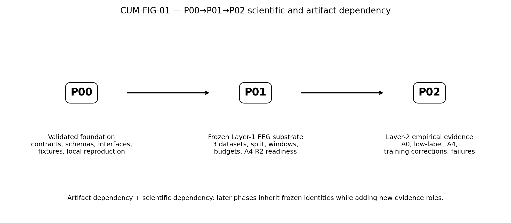

# Part I — Project and Analytical Context

## 1. Cumulative Scope Through P02

This report covers only completed phases P00, P01 and P02. It preserves the phase-local analytical record and adds new inter-phase scientific synthesis. It does not invent P03 results, retroactively apply P02 methods to earlier phases, or create unauthorized cross-phase confirmatory statistics. Cross-phase numerical comparison is used only when metric, population and semantics are genuinely comparable; otherwise the relationship is treated conceptually.

## 2. Architecture and Phase Progression

| Phase | Scientific objective | Inherited evidence | New work | Primary output | Downstream consequence |
| --- | --- | --- | --- | --- | --- |
| P00 | Foundation conformance and reproducibility | None | Engineering/fixture/contract validation | Validated reusable document/schema/record/interface foundation | Makes governed P01 execution possible |
| P01 | Layer-1 public EEG data/split/window contract | P00 foundation | Provenance, split/leakage, preprocessing/window materialization, low-label identities, A4 R2 substrate | Frozen P02-consumable data contract | Makes controlled P02 decoder/A4 evaluation possible |
| P02 | Layer-2 decoder and baseline measurement | P00/P01 contracts and P01 data substrate | Multi-family A0, low-label, A4 controls, training-policy correction, failure/statistical evidence | Canonical predictions/checkpoints/metrics/failure states and downstream readiness | Supports Layer0/Evidence Map/Layer10/P03 handoff |

The artifact dependency and the scientific dependency are related but not identical. P01 **artifacts** depend on P00 schemas/records/interfaces; P01 **interpretation** also depends on the validity of the P00 foundation process. P02 **artifacts** depend on P01 dataset/split/window/budget/A4 identities; P02 **scientific interpretation** depends on those upstream identities remaining fixed so that observed decoder differences are not confounded by silent data-contract changes.

## 3. Analytical Authorities and Evidence Hierarchy

The cumulative Protocol v1.0 through P02 controls what execution is canonical and what analyses are authorized. The phase analyses control the interpretation of the governed evidence. Layer 0 dispositions control claim approval where already completed; therefore P00 and P01 reviewed claims retain their governed statuses, while P02 and new cumulative candidate claims remain pending Layer 0.

The hierarchy used here is: **canonical execution evidence → phase-specific quantitative result → phase-specific finding → inter-phase relationship → cumulative finding → cumulative candidate claim → limitation/claim ceiling**. External literature contextualizes this chain but does not overwrite project evidence.

## 4. Cross-Phase Research Questions

**CRQ1 — Validity chain.** Did the project preserve a traceable path from foundation conformance to empirical decoder evidence without silently redefining upstream identities?  
**CRQ2 — Scientific evolution.** What questions became answerable only after each successive phase?  
**CRQ3 — Qualification.** Which earlier readiness or expectation statements became strengthened, narrowed, contradicted, or replaced by later empirical evidence?  
**CRQ4 — Reproducibility.** How did evidence provenance mature, and which reproducibility limitations remain?  
**CRQ5 — Claim readiness.** Which phase-local and project-level candidate claims are now sufficiently evidence-bounded for Layer 0 review?

## 5. Cumulative Evidence and Dependency Model

| Theme | P00 | P01 | P02 | Evolution |
| --- | --- | --- | --- | --- |
| Foundation validity | P00 validates schemas/configs/interfaces/fixtures and local reproduction. | P01 instantiates governed EEG dataset/split/window records. | P02 relies on frozen inputs rather than redefining them. | STRENGTHENED: foundation becomes empirically consequential without being reinterpreted as effectiveness. |
| Data provenance and denominator | Readiness contracts only. | 3 datasets; 172 subject groups; 12,910 accepted events -> 12,910 core windows; split/leakage checks PASS. | Same frozen substrate underlies A0/A4 decoder evidence. | STRENGTHENED and ACTIVATED. |
| Low-label | No empirical evidence. | 18 exact budget rows frozen (3 datasets x 6 budgets). | Low-label decoding near chance/non-monotonic with rank changes. | READINESS -> EMPIRICAL STRESS RESULT; universal efficiency claim not supported. |
| Ablation | A0-A13 hooks; A14 rejected. | A0-A13 foundations; A4 R2 matched substrate after +4.0 s infeasibility. | A0 and A4 executed; others downstream; A14 prohibited. | READINESS -> SELECTIVE ACTIVATION; A4 generic benefit not supported. |
| Training/reproduction | Local foundation reproduction. | Actual runtime amendments recorded while data contract preserved. | Stage11/12 source-informed training corrections expose architecture-specific optimization sensitivity. | REFINED: reproducibility must include model-specific training policy, not just data/code identity. |
| Failure evidence | Malformed fixtures rejected. | Material stage failures block and reenter only after repair. | Failed/skipped/incompatible/diagnostic model evidence preserved. | EXTENDED: fail-closed process becomes part of scientific interpretation. |
| Evidence ceiling | Engineering/readiness only. | Data integrity/readiness only; no decoder/clinical claims. | Decoder/A4 empirical evidence, still no clinical/deployment/calibration/safety claims. | EXPANDED but bounded. |

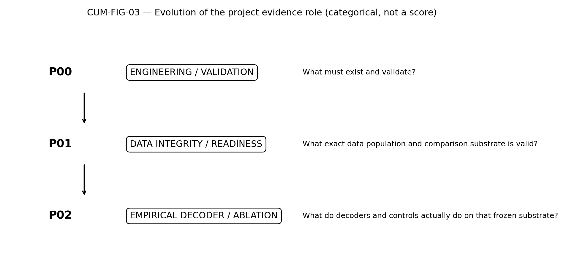

# Part II — Phase 00 Intra-Phase Analysis

## 6. P00 Scientific Role

P00 is intentionally non-empirical. Its scientific importance is foundational: it validates the project structures required for later phases to preserve identities, fail closed, reproduce bounded executions, and route claims/evidence. It must not be judged by P02's decoder-performance criteria. The P00 evidence ceiling remains engineering/foundation conformance, deterministic validation and local reproducibility.

### 6.1 P00 direct finding register

| Finding | Measured result | Evidence ceiling | Limitation |
| --- | --- | --- | --- |
| P00-F-001 | 19/19 registered P00 engineering cells passed with terminal PASS | ENGINEERING_FOUNDATION_CONFORMANCE | non-empirical; Mode B |
| P00-F-002 | 102/102 deterministic tests passed | ENGINEERING_FOUNDATION_CONFORMANCE | Python 3.13.5 verified local environment; cross-version portability not established |
| P00-F-003 | 19/19 valid or integrated bundles accepted; false rejections 0 | VALIDATION_EVIDENCE | synthetic/non-empirical fixtures |
| P00-F-004 | 178/178 intentionally malformed categories rejected; false acceptances 0 | NEGATIVE_VALIDATION | validator behavior, not scientific performance |
| P00-F-005 | all registered foundation inventories present and validated | ARTIFACT_CLOSURE | foundation readiness only |
| P00-F-006 | 11/11 Layer 0–10 foundation interfaces passed registered P00 integration scope | FOUNDATION_INTEGRATION | no scientific layer execution claimed |
| P00-F-007 | P00 implemented; P01–P15 reusable contract surfaces prepared | CONTRACT_READINESS | future empirical outputs not executed by P00 |
| P00-F-008 | 8/8 bounded reproduction steps passed under exact local snapshot | LOCAL_REPRODUCIBILITY | portable cross-version lock incomplete |
| P00-F-009 | A0–A13 readiness hooks present; A14 rejected | READINESS_ONLY_NOT_ACTIVATED | no ablation effectiveness result exists in P00 |

## 7. Detailed P00 Analytical Record — Preserved

The following phase-local analytical material is retained at source-report depth, with headings nested under the cumulative structure. It remains historical P00 analysis; later P01/P02 evidence does not retroactively convert P00 into an empirical-effectiveness phase.

### 2. Executive Evidence Summary

#### 2.1 Phase at a glance

| Dimension | Result |
|---|---|
| Registered engineering cells | **19 expected, 19 executed, 19 passed, 0 failed/blocked/not-run** |
| Deterministic tests | **102 executed, 102 passed, 0 failed** |
| Valid/integrated bundles | **19 accepted, 0 false rejections** |
| Malformed categories | **178 rejected, 0 false acceptances** |
| Schemas / configs / record families | **85 / 35 / 79** |
| Layer foundations | **11/11 complete within Phase 0 scope** |
| Phase contracts | **16/16 have a governed disposition** |
| Clean reproduction | **PASS** |
| Package integrity | **PASS; final archive identity recorded at delivery** |
| A0–A13 | `READINESS_ONLY_NOT_ACTIVATED`; A14 `REJECTED` |
| Recommendation | **READY FOR LAYER 0 WITH NONBLOCKING LIMITATIONS** |

#### 2.2 Strongest direct finding

Under the exact frozen local snapshot and verified Python 3.13.5 environment, all registered P00 engineering cells, deterministic tests, positive fixtures, negative fixtures, integration checks, manifest checks, and clean-reproduction checks passed.

#### 2.3 Closure recommendation

This report may advance to Layer 0 review. It does not close Phase 0. Evidence Map and Layer 10 remain pending their lawful predecessors, and `P0-GATE-18` remains deferred.

### 3. Phase Identity, Scope, Objectives, and Questions

P00 establishes repository, configuration, schema, identity, lineage, lifecycle, validation, integration, reproduction, and future-contract foundations. It does not execute a real dataset, model training, calibration, threshold selection, IHARQ effectiveness evaluation, temporal inference, policy learning, scientific simulation, stress experiment, embodiment experiment, or clinical/deployment assessment.

| Question | Answer |
|---|---|
| Are all required P00 artifact families present and traceable? | YES for the registered foundation scope. |
| Do valid bundles pass and malformed categories fail closed? | YES: 19/19 accepted and 178/178 rejected. |
| Do schemas, configs, IDs, lineage, manifests, and references validate? | YES under the frozen local snapshot. |
| Does the package reproduce locally? | YES under Python 3.13.5 and the exact local distribution snapshot. |
| Are layers and later phase contracts ready without fabricated results? | YES at foundation/contract level only. |
| Are limitations propagated? | YES through the limitation register and downstream handoffs. |

### 4. Governing Authority and Reproducibility Identity

The exact authority baseline is recorded in `phase_0_source_baseline.csv`. The controlling implementation authority is Build Book R4, with the analysis status annex for post-Protocol status. The controlling execution/analysis authority is Protocol Master and P00 Annex R2. The implementation snapshot is the uploaded local package with SHA-256 `f5eb3951a1946f09a6932821edfd703645d8b4f430abd67020d81a8cba6eb431`.

Historical runs remain Mode B engineering/retrospective. This report uses a fresh post-freeze engineering execution but does not reinterpret the historical chronology as Mode C or confirmatory evidence.

### 5. Entry Readiness, Input Provenance, and Reuse Audit

All preconditions passed: Protocol Master and Annex are frozen with bounded limitations; the implementation snapshot hash resolves; the run matrix and analysis contract exist; source and package manifests resolve; and no blocking Protocol defect remains. The reuse decision was `RERUN_REGISTERED_SCOPE` for the 19 P00 cells and `DERIVE_NEW_ANALYSIS` for the immutable analysis release.

### 6. Registered Execution Coverage and Run Disposition

All 19 registered cells have terminal PASS. Exact commands, exits, logs, and dispositions appear in `phase_0_run_disposition.csv` and the execution release manifest. No mandatory cell is missing, blocked, invalid, or silently excluded.

#### 6.1 Denominator conservation

| Inventory | Expected | Executed/validated | Passed/accepted | Failed/false acceptance | Excluded/deferred |
|---|---:|---:|---:|---:|---:|
| Registered cells | 19 | 19 | 19 | 0 | 0 |
| Deterministic tests | 102 | 102 | 102 | 0 | 0 |
| Valid/integrated bundles | 19 | 19 | 19 | 0 | 0 |
| Malformed categories | 178 | 178 | 178 correctly rejected | 0 | 0 |
| Layer foundations | 11 | 11 | 11 | 0 | 0 |
| Phase contracts | 16 | 16 | 16 dispositions | 0 | 0 |

### 7. Artifact Closure, Evidence Gates, and Release Integrity

All mandatory local-first gates through `P0-GATE-17_LOCAL` pass. `P0-GATE-16_IMPLEMENTATION` passes with nonblocking portability limitations. `P0-GATE-18` is deferred by governance order. GitHub CI is not applicable at this stage.

The immutable analysis release includes source/Protocol snapshots, execution dispositions, artifact closure, gates, findings, negative evidence, repairs, limitations, candidate statements, readiness matrices, five-pass reviews, downstream handoffs, and content manifests.

### 8. Phase 0 Analysis Contract, Populations, Metrics, and Comparisons

The analysis is deterministic engineering/foundation analysis only. Registered metrics are exact coverage, valid-fixture acceptance, malformed-fixture rejection, test pass, manifest integrity, and clean reproduction. Scientific superiority, treatment effects, p-values, calibration performance, policy benefit, stress robustness, simulator effectiveness, embodiment effectiveness, and clinical outcomes are `NOT APPLICABLE — P00 NON-EMPIRICAL`.

### 9. Integrity, Eligibility, and Contamination Audit

- No empirical A-cell is active.
- A14 is absent and rejected.
- No test-selected scientific threshold or denominator exists.
- Missing items remain missing rather than zero-success.
- Historical GitHub-gate language is not used as a current result.
- Generated logs are separated from immutable source and authority files.
- Layer 0 and Layer 10 boundaries remain intact.

### 10. Descriptive Foundation Evidence

| Inventory | Verified count |
|---|---:|
| Requirement dispositions | 23,846 |
| Protocol requirement dispositions | 19,026 |
| JSON Schemas | 85 |
| Configuration profiles/files | 35 |
| Record-family profiles | 79 |
| Valid/integrated bundles | 19 |
| Malformed categories | 178 |
| Layer foundations | 11 |
| Phase contracts | 16 |
| Registered P00 cells | 19 |
| Deterministic tests | 102 |

### 11. Primary Engineering Results

The primary result is complete registered engineering execution: 19/19 cells passed. Supporting primary results are 102/102 tests passed, 19/19 valid/integrated bundles accepted, 178/178 malformed categories rejected, and clean local reproduction passed. These results support foundation-conformance statements only.

### 12. Supporting and Diagnostic Results

Audits 1–3 passed as regression checks for their layer-specific implementation contracts. Their historical GitHub-dependent terminal labels remain provenance, not current gate decisions. The final implementation and local-first audits pass under the current local-first strategy.

### 13. A0–A13 Readiness and No-A14 Analysis

A0–A13 identities and future hooks are present. Every A-cell is `READINESS_ONLY_NOT_ACTIVATED`. A14 is rejected in catalogs, validation, and configuration. No seed, threshold, comparison value, metric result, or scientific conclusion is reported for an A-cell.

### 14. Matched Comparisons, Statistical Robustness, and Subgroups

#### 14.1 Scientific matched comparisons

`NOT APPLICABLE — P00 NON-EMPIRICAL.` No scientific treatment arms, estimands, hypotheses, p-values, multiplicity procedures, or subgroup effects exist.

#### 14.2 Engineering equivalence checks

Human/machine identities, counts, hashes, gates, and dispositions were compared deterministically. Exact local reproduction and manifest reconciliation provide engineering equivalence evidence within the recorded environment.

### 15. Conditional Layer Analytical Modules

#### 15A. Layers 1–9 scientific modules

`NOT APPLICABLE — P00 NON-EMPIRICAL.` Only foundation interfaces and synthetic contract fixtures were exercised.

#### 15B. Phase 0 data/schema/protocol foundation

Applicable and passed: authority intake, schema/config/record coverage, identity/hashing, lineage/lifecycle, manifests, fixtures, validators, tests, integration, reproduction, and package integrity.

#### 15C. Layer 0 foundation/process readiness

Applicable but non-authorizing. Candidate statements and limitations are prepared; no final disposition is issued.

#### 15D. Layer 10 read-only/reproducibility foundation

Applicable and passed at contract level. Layer 10 may consume only saved, authorized evidence after Evidence Map acceptance; it may not recompute or strengthen findings.

### 16. Stability, Sensitivity, and Portability

Deterministic tests and hashes were stable in the exact Python 3.13.5 environment. Portability is bounded: Python 3.11/3.12 were unavailable, and the portable `uv.lock` is incomplete and fail-closed. No cross-version claim is made.

### 17. Failure, Repair, Safety, and Anomaly Analysis

The current analysis cycle preserved wrapper timeouts and repaired them through bounded execution without reducing scope. Stale Build Book and historical GitHub-gate language were resolved through explicit status/supersession records. No patient-safety, clinical, medical-device, real FES, deployment-readiness, or real-world effectiveness conclusion is permitted.

### 18. Mandatory Negative, Blocked, Invalid, Deferred, and Not-Run Register

The full register is machine-readable. Key entries include 178 expected malformed rejections; unavailable Python 3.11/3.12; incomplete portable lock; Mode B historical evidence; optional Kaggle not run; GitHub CI not applicable; and `P0-GATE-18` deferred. Conservation checks pass: no negative, blocked, deferred, or not-run item was converted to success or hidden.

### 19. Trade-Offs, Practical Meaning, and Scientific Meaning

The local-first strategy provides strong exact-environment evidence and one-batch publication readiness while deferring broader portability. The practical meaning is that the P00 foundation is ready for governed downstream review. The scientific meaning is deliberately narrow: no later-phase scientific effectiveness has been established.

### 20. Interpretation Hierarchy and Finding Trace

Direct deterministic results are separated from bounded interpretations and candidate statements. Each candidate statement traces to findings, execution cells, tests/gates, and limitations. Final wording remains owned by Layer 0.

### 21. Candidate Statement Register — Pending Layer 0

Seven candidate infrastructure statements are supplied in `phase_0_candidate_statement_register.csv`. Every row is `PENDING_LAYER0`; none is approved, manuscript-ready, or public-facing.

### 22. Limitations, Scope Boundaries, and Unresolved Questions

The monotonic limitation union includes exact-environment-only reproduction, incomplete portable lock, unavailable Python 3.11/3.12, Mode B historical classification, non-empirical scope, and pending Layer 0/Evidence Map/Layer 10/closure. There are no open blocking defects for the report.

### 23. Downstream Readiness, Reuse, Invalidation, and Closure Recommendation

| Consumer | Readiness | Constraint |
|---|---|---|
| Layer 0 | READY | final dispositions not yet issued |
| Evidence Map | CANDIDATE INPUT READY | waits for Layer 0 |
| Layer 10 | SOURCE-BUNDLE CONTRACT READY | waits for accepted Evidence Map |
| Phase 0 closure | NOT READY | waits for Layer 0, Evidence Map, Layer 10, final review/release |
| Phase 1 | NOT AUTHORIZED | waits for governed Phase 0 closure |

Material changes to sources, Protocol, schemas, configs, fixtures, validators, tests, environment, or package manifest invalidate affected descendants and require rerun/regeneration.

### 24. Layer 0 Claim-Review Handoff

The Layer 0 packet contains the finding register, candidate statements, exact evidence links, claim ceiling, limitations, and review protocol. It issues no final claim disposition.

### 25. Paper and Thesis Evidence Map Handoff

Candidate rows contain statement/finding/execution/test/gate/report/limitation slots and remain `PENDING_LAYER0`. The accepted Evidence Map is not created by this report.

### 26. Layer 10 Read-Only Source Bundle Handoff

The source-bundle contract identifies saved findings, negatives, gates, limitations, and reproduction evidence. Layer 10 remains read-only and unauthorized until Evidence Map acceptance.

### 27. Local Reproduction, Publication, and Archive Record

A clean isolated copy passed exact runtime-lock verification, fail-closed uv-lock verification, package installation, 92 tests, conformance, local-first audit, manifest regeneration, and manifest check. GitHub and Kaggle were not used. Final ZIP identity and file-count closure are recorded in the detached delivery manifest after archive creation.

### 28. Cross-Phase Consistency and Synthesis Input

P00 provides foundation and contract inputs for P01–P15 without claiming their execution. The report preserves official phase/layer/A-ID terminology, current local-first gate semantics, Protocol Mode B, and downstream ordering.

### 29. Final Definition of Done and Report Freeze

- [x] Protocol master/annex accepted with bounded limitations.
- [x] Timing and evidence classification resolved.
- [x] All 19 registered cells have terminal PASS.
- [x] Counts derived from the frozen release.
- [x] All valid/integrated bundles accepted.
- [x] All malformed categories rejected.
- [x] Gates resolve to exact evidence.
- [x] Human/machine outputs agree.
- [x] No empirical A-cell or A14.
- [x] Scientific modules explicitly nonapplicable.
- [x] Environment and portability limitations truthful.
- [x] Candidate statements remain pending Layer 0.

#### 29.1 Final declaration

**P00_ANALYSIS_FINAL_AUDIT_PASS_WITH_NONBLOCKING_LIMITATIONS_READY_FOR_LAYER0:** The registered Phase 0 engineering/foundation scope has been executed and analyzed against the frozen local Protocol R2 and exact implementation snapshot. All registered cells and mandatory deterministic checks pass, all expected negative validation cases remain visible, the analysis release reproduces locally, and the package is ready for Layer 0 review subject to the explicitly bounded portability, timing, and downstream-governance limitations.

This declaration does not mean that final Layer 0 disposition, the accepted Evidence Map, final Layer 10 package, Phase 0 closure, final release, or Phase 1 authorization has been completed.

### 30. Final Independent Audit and R2 Successor Decision

The R1 release was independently re-audited without trusting its `PASS`, `COMPLETE`, or `READY` labels. The audit reconstructed requirements, recalculated counts, verified fixture behavior, reviewed every finding and candidate statement, scanned for overclaim and unresolved placeholders, and checked machine/human identities.

#### 30.1 Material defects repaired

| Defect | R1 condition | R2 repair | Terminal status |
|---|---|---|---|
| Package-manifest hash drift | One stale hash/size identity | Regenerated self-excluding R2 release manifest after final freeze | RESOLVED |
| Publication-asset hash drift | Three stale asset identities | Rebuilt asset manifest from final R2 bytes | RESOLVED |
| Terminal manifest-status contradiction | Appendix M recorded `FAIL` while summary/handoff said `PASS` | Preserved the R1 failed step as repair evidence and recorded a separate terminal R2 pass | RESOLVED |
| Missing final-audit requirement coverage | Independent prompt absent from source baseline/matrix | Added source, requirement matrix, validator, tests, five-pass reviews, and handoff | RESOLVED |
| README pointer invalidation | R2 status text changed README bytes | Regenerated exact byte count and SHA-256; full suite rerun | RESOLVED |

#### 30.2 Final independent decision

`P00_ANALYSIS_FINAL_AUDIT_PASS_WITH_NONBLOCKING_LIMITATIONS_READY_FOR_LAYER0`

All current counts derive from the R2 physical package and current deterministic suite. Candidate statements remain `PENDING_LAYER0`; Evidence Map remains `PENDING_LAYER0`; Layer 10 remains `PENDING_EVIDENCE_MAP`; Phase 0 is not closed and Phase 1 is not authorized.

## 11. P00 → P01 Handoff in Cumulative Context

P00's strongest downstream contribution is not a model or dataset result. It is the existence of validated reusable contract surfaces and negative-validation behavior that allow P01 to instantiate concrete dataset/split/window records while preserving fail-closed semantics. The later success of P01 does not strengthen P00 into empirical science; instead it demonstrates that the P00 foundation was *usable* for its intended downstream role.

# Part III — Phase 01 Intra-Phase Analysis

## 12. P01 Role as Consumer of P00 and Producer for P02

P01 is the bridge between abstract foundation and empirical decoder evaluation. It consumes P00's governance/record infrastructure, activates three public EEG datasets, freezes whole-subject roles and a binary left/right task, materializes the core window denominator, prepares low-label identities, and resolves A4 data feasibility before any decoder-effectiveness claim is permitted.

### 12.1 P01 direct finding register

| Finding | Measured result | Limitation |
| --- | --- | --- |
| P01-FIND-001 | P01 established exact source provenance and dataset identity for the selected public EEG portfolio. | PUBLIC_EEG_ONLY; source-license/redistribution restrictions apply. |
| P01-FIND-002 | The frozen subject-group split satisfies the implemented disjointness contract and preserves whole-subject role assignment. | This establishes contract disjointness, not universal absence of every conceivable leakage mechanism. |
| P01-FIND-003 | The official Layer-1 event/window pipeline preserved the accepted-event denominator under the frozen core window policy. | Does not imply decoder adequacy or statistical power. |
| P01-FIND-004 | The official core derived Dataset is reproducibly identifiable and retrievable under its provider version/logical revision/hash contract. | Private Kaggle access is required; source licenses continue to govern redistribution. |
| P01-FIND-005 | Quality issues were surfaced as governed annotations while hard validity criteria did not reject any official core window. | A soft flag is not proof of physiological corruption, and zero hard-invalid cases is not a claim of artifact-free EEG. |
| P01-FIND-006 | No contract leakage was detected under the implemented deterministic checks. | Bounded to implemented checks and frozen identities. |
| P01-FIND-007 | P01 prepared deterministic low-calibration population identities for later evaluation. | No calibration-performance experiment was executed in P01. |
| P01-FIND-008 | Layer 1 produced the matching/readiness foundation required by the official A0–A13 ladder without introducing A14. | Foundation readiness is not ablation effectiveness. |
| P01-FIND-009 | P01 established a fully matched A4 R2 Layer-1 substrate for future governed evaluation. | A4 effectiveness was not executed or measured in P01; R2 arose after feasibility evidence. |
| P01-FIND-010 | Padding, clipping, fabrication, or event dropping would have changed the comparison; the matched +3.5 s R2 design preserved the complete denominator. | This is a design-feasibility result, not evidence that R2 performs better than R1 or core. |
| P01-FIND-011 | Runtime compatibility/resource amendments changed execution conditions but did not alter datasets, labels, split, core preprocessing, core window, or core denominator. | Reproduction should use the recorded actual environment rather than the original Python 3.11 intent. |
| P01-FIND-012 | The accepted P01 execution lineage satisfies its deterministic execution, validation, and package-closure contract. | Execution closure does not imply model or clinical effectiveness. |
| P01-FIND-013 | The execution history demonstrates fail-closed repair/reentry rather than silent acceptance of known defects. | The repair history must remain visible; it is not evidence of scientific superiority. |
| P01-FIND-014 | P02 can consume the frozen Layer-1 data substrate without reinterpreting Layer-1 identities. | Formal phase transition still follows the documentary closure sequence. |

## 13. Detailed P01 Analytical Record — Preserved

> The following P01 section preserves the substantive content of the finalized P01 R1 report, now governed inside the single cumulative report. No P01 finding, denominator, evidence ceiling, candidate-claim status, A4 boundary or execution result is strengthened by consolidation.

### P01.1. Phase Identity and Purpose

P01 is the **Public Data and Split Protocol** phase and Layer 1 is its primary implementation owner. Architecture characterizes Phase 1 as the empirical anchor gate: public EEG must be transformed into standardized, split-safe records before downstream decoders, calibration, selective prediction, policy learning, stress evaluation, or embodiment work can be interpreted fairly. The key bottleneck is not merely data availability; it is *identity and comparability*. Without frozen source versions, task mappings, subject-group splits, event timing, preprocessing, window profiles, and lineage, a later performance number cannot be traced to a stable experimental substrate.

Layer 1 therefore owns the public-data/testbed foundation and emits canonical DatasetRecord, LabelMapRecord, SplitRecord, PreprocessingRecord, WindowRecord, quality/validation evidence, dataset/protocol cards, the Layer-1 ablation-readiness manifest, and downstream handoffs. Decoder training and effectiveness are deliberately downstream responsibilities.

### P01.2. Governing Authority Stack

| Authority | What it controls for this report | How used |
| --- | --- | --- |
| Governance V6.1 | Current workflow, source hierarchy, evidence sufficiency, repair loop, post-execution Protocol/Report sequence | Controls report timing, reuse-first policy, negative-result preservation and downstream boundaries |
| Master Architecture | P01/L1 purpose, phase/layer boundaries, A0–A13 identities, P02 dependence | Defines what P01 is allowed to claim as its own work |
| Canonical Registry R44 | Record families, fields, lifecycle/identity/lineage semantics | Used to interpret Dataset/Label/Split/Preprocessing/Window/Validation records |
| Execution & Evidence Plan R41 | Required P01 outputs, evidence/gates/completion conditions | Used to assess evidence sufficiency and closure |
| Protocol v0.1 / finalized Protocol v1.0 | Fairness, splits/leakage, denominators, ablations, exclusions, exact P01 analysis contract | Finalized v1.0 is immutable analysis authority |
| Phase Execution Playbook R41 | Operational order, failure/repair/handoff procedure | Used to interpret repair/reentry chronology |
| Method Selection R2 | Selected datasets/method/platform strategy | Used for rationale, not as proof of execution |
| Nuts-and-Bolts R2 | Technical algorithms/validators/failure behavior | Used to explain implementation behavior |
| Implementation Build Book R10 / P01 Annex R4 | Pre-run executable intent | Compared explicitly with actual execution |
| Accepted P01 execution bundle | Actual measured/executed evidence | Primary source for numerical results |
| This Report | Results synthesis, bounded interpretation, candidate claims and downstream handoffs | Does not change Protocol or approve claims |

### P01.3. Phase 0 Prior State and Reused Foundations

P00 created the engineering substrate that made a record-first P01 possible: canonical JSON schemas, typed identities, JCS/SHA-256 hashing, lineage/lifecycle rules, validation semantics, fixtures, manifests, phase/layer interfaces, the A0–A13 identity set, the no-A14 lock, and downstream document/reproducibility contracts. The direct P00 Protocol history remains Mode-B engineering/retrospective evidence with the ceiling `ENGINEERING_FOUNDATION_CONFORMANCE`; P01 does not retroactively convert that history into empirical scientific evidence.

Reuse was preferable to rebuilding because changing stable upstream identity/hashing/schema infrastructure merely for a new phase would create unnecessary invalidation and risk making P01 records incomparable with the rest of the project. P01 therefore *instantiated and extended* P00's governed record machinery with real public-data records rather than replacing it.

| Inherited surface | P00 state | P01 disposition | Classification |
| --- | --- | --- | --- |
| Canonical record schemas/IDs/hashes | Implemented and validated | Used for real Dataset/Label/Split/Preprocessing/Window records | REUSED_AND_EXTENDED |
| Lineage/lifecycle/manifest rules | Implemented and validated | Applied to P01 empirical records and external pointers | REUSED_AND_EXTENDED |
| A0–A13 identities | Readiness-only identities | Layer-1 matching/readiness rows produced for every A0–A13 | REUSED_AND_EXTENDED |
| A14 prohibition | Rejected/absent | Absence validator PASS; no selector/run/result/claim | REUSED_UNCHANGED |
| Validation/gate framework | Engineering foundation | P01-specific deterministic gates G01–G16 and execution tests | REUSED_AND_EXTENDED |
| Historical Mode-B P00 workflow classification | Historical evidence metadata | Preserved as historical only; current workflow follows Governance V6.1 | SUPERSEDED_WITH_HISTORY_PRESERVED |
| Public-data empirical records | Not produced in P00 | Materialized in P01 | NEW_IN_P01 |

### P01.4. Phase 1 Responsibilities

P01 responsibilities can be understood as a chain of controlled commitments. First, source identity must be known. Second, the supervised task must be explicit. Third, all subject/session/run/event identities must remain traceable through preprocessing. Fourth, split membership must be frozen before any downstream model fitting. Fifth, one official window representation must be materialized without denominator drift. Sixth, quality/leakage checks must determine whether the data substrate is admissible. Seventh, large tensors must be persisted with compact manifests and immutable pointers. Finally, all official A0–A13 future comparisons must have matching keys/readiness surfaces so later phases do not improvise their denominators.

### P01.5. Pre-Run Implementation Contract

The Build Book froze the scientific core before execution as follows:

| Surface | Pre-run frozen intent |
| --- | --- |
| Active datasets | PhysioNetMI; BNCI2014_001; Lee2019_MI |
| Task | binary left_hand vs right_hand; rest/feet/tongue/motor execution/technical/unlabeled online-test events excluded per source |
| Split | SUBJECT; roles train/calibration/validation/test; 0.6/0.2/0.1/0.1; seed 20260804; SHA256-ranked dataset-local subject groups |
| Low-calibration budgets | 1, 2, 4, 8, 16, 32 source events per normalized class from calibration role; nested SHA256-ranked prefixes |
| Preprocessing | EEG-only; event capture; demean; average rereference; joint polyphase event/signal resample to 160 Hz; Kaiser β=5; reflect pad; 8–32 Hz 4th-order Butterworth SOS zero-phase with odd pad/padlen 27; float32 |
| Core window | MI cue +0.5…+3.5 s; 480 samples; one per admitted event; reject OOB; no clipping |
| Quality | ANNOTATE_NOT_REPAIR; hard invalid only for nonfinite/rank/duration/lineage failures; soft warnings retained |
| Environment intent | Kaggle CPU; Python >=3.11,<3.12; exact package pins; legacy 60 GiB free-disk preflight |
| Persistence | large lossless HDF5 tensors external; compact governed metadata/manifests in project state |
| Ablation responsibility | prepare Layer-1 matching/readiness foundations A0–A13; no A14 |
| Downstream | P02 consumes exact Window/Split/Label/Preprocessing identities; no silent reinterpretation |

### P01.6. Executed Notebook and Environment

The accepted notebook lineage is the 00–26 consolidated Kaggle execution with final runtime metadata `P01-L1-KAGGLE-NOTEBOOK-R49-MATCHED-A4-R2` plus same-session integration/security repairs. The accepted environment is not identical to the original Build Book image intent. It used **Python 3.12.13**, Linux x86_64/glibc 2.35, 4 CPUs, 33,659,379,712 bytes RAM, and 20,336,979,968 bytes initial free disk (~18.94 GiB). The exact scientific packages match their required pins; `pin_mismatches` and `required_import_failures` are empty.

The environment amendment is execution-compatibility evidence, not a scientific refreeze. The scientific identity remains `P01-L1-OFFICIAL-RUN-FREEZE-R2` and the config remains `d03f0a7c869dd95a2a67e5a32edc501d52bfc3851d8e761ef56595d8bd1ff52f`.

| Package | Actual version |
| --- | --- |
| moabb | 1.5.0 |
| mne | 1.12.1 |
| numpy | 2.2.6 |
| scipy | 1.15.3 |
| pandas | 2.3.1 |
| scikit-learn | 1.7.1 |
| h5py | 3.14.0 |
| pooch | 1.8.2 |
| pyyaml | 6.0.2 |
| pydantic | 2.11.7 |
| jsonschema | 4.25.0 |
| nbformat | 5.10.4 |

### P01.7. Intended-vs-Actual Reconciliation

| Surface | Build Book / pre-run intent | Actual accepted execution | Difference / reason | Scientific consequence | Final status |
| --- | --- | --- | --- | --- | --- |
| Datasets | Three selected sources | Same three sources | None | None | MATCH |
| Labels/exclusions | Frozen binary mapping | Same validated LabelMapRecords | None | None | MATCH |
| Split | Subject-grouped 60/20/10/10 target | Same deterministic allocation with expected group counts | None | None | MATCH |
| Core preprocessing | Frozen R2 sequence | Same PreprocessingRecord | None | None | MATCH |
| Core window | +0.5…+3.5 s / 480 | Same; 12,910/12,910 valid | None | None | MATCH |
| Quality | ANNOTATE_NOT_REPAIR | 489 summaries; 20 soft flags; 0 hard invalid | Observed results only | None | PASS |
| Python | 3.11 intended | 3.12.13 actual | Kaggle runtime compatibility | No scientific values changed | DOCUMENTED_AMENDMENT |
| Disk policy | 60 GiB fixed preflight | adaptive policy; 6.0 GiB effective requirement; 18.94 GiB observed free | Kaggle resource reality | No scientific values changed | DOCUMENTED_AMENDMENT |
| Core persistence | materialize/persist official core | Verified existing exact scientific artifact adopted; no recompute/reupload | Reuse-first lawful adoption | Core bytes/manifest unchanged | PASS |
| A4 | Original proposed +0.0…+4.0 s alternative | R2 matched +0.0…+3.5 s; three registered 2 s views | One valid event cannot supply +4.0 s without fabrication/drop | Changes future A4 alternative profile only; core unchanged | R2 FROZEN FOR FUTURE USE |
| Stage execution | 00–26 expected | 00–26 final identities PASS | Material integration failures repaired | No accepted-core scientific consequence except A4 future-profile correction | PASS |
| Packaging | secret-free final export expected | Initial Stage 26 blocked; R54 clean repack | Credential serialization defect | None | PASS |

### P01.8. Analysis 1 — Source Inventory, Provenance, License, and Checksum Reconciliation

**Analysis contract:** `P01-AC-001-SOURCE-INVENTORY` — evidence ceiling: data provenance/reproducibility only.

| Dataset | Frozen source/revision | Subjects | Source files | Source events in record | Accepted binary events | Source Hz | DatasetRecord | Aggregate SHA-256 | License |
| --- | --- | --- | --- | --- | --- | --- | --- | --- | --- |
| PhysioNetMI | 1.0.0 | 109 | 327 | 9509 | 4918 | 128.0, 160.0 | IHARQ-DATASETRECORD-20260806-66309cda68771bef | 28cd2062983b6236f9a0e7fdee91fc9d8d5aad8eee3ef561cff5828ae89bf2ba | Open Data Commons Attribution License 1.0 (ODC-By-1.0) |
| BNCI2014_001 | 001-2014 provider file set A01T/A01E through A09T/A09E | 9 | 18 | 5184 | 2592 | 250.0 | IHARQ-DATASETRECORD-20260806-42c424800627b6ee | 04a5390f8f36eaadbc0c480ec9377ce1b99caf0b7ab53bad9fda12347995bc49 | Creative Commons Attribution-NoDerivatives 4.0 International (CC BY-ND 4.0) |
| Lee2019_MI | GigaDB dataset DOI 10.5524/100542; MOABB 1.5.0 Lee2019_MI wrapper; labeled offline/train MI runs only | 54 | 108 | 5400 | 5400 | 1000.0 | IHARQ-DATASETRECORD-20260806-adb91f25a65e588e | 3a07b2f302da949efd418a0712d5a9427df34dcb8b027ca553fae8e67a849f78 | GNU General Public License v3.0 as documented by the maintained MOABB source card; source terms retained in DatasetCard |

Across the three DatasetRecords there are **453 source files** and **20,093 source events recorded at source-inventory level**. The official binary task admits **12,910** events. The difference (**7,183**) is not treated as a pool of “negative labels”: it contains source events/classes outside the frozen binary task and technical/provider events according to each LabelMapRecord. This distinction is essential because treating excluded classes as negatives would change the task definition after source intake.

The three sources play complementary roles: PhysioNetMI provides the largest subject base and requires run-context semantics plus the subject-88 rate exception; BNCI provides a standard four-class MI source from which only left/right trials are admitted; Lee provides a high-rate left/right companion whose labeled offline/train branch is used after deterministic event-aware resampling. Exact aggregate hashes and source-specific licenses make the resulting DatasetRecords reproducible without pretending that all raw bytes can be freely redistributed.

**Measured result:** all three DatasetRecords are `VALIDATED`; no screened-out dataset was activated.

**Supported interpretation:** P01 established a traceable, license-aware source portfolio.

**Not supported:** any conclusion about decoder performance or clinical representativeness.

### P01.9. Analysis 2 — Subject-Group Split Allocation and Disjointness

**Analysis contract:** `P01-AC-002-SPLIT` — interpretation ceiling: split/leakage contract correctness.

| Dataset | Subjects | Train subj | Cal subj | Val subj | Test subj | Train windows | Cal windows | Val windows | Test windows |
| --- | --- | --- | --- | --- | --- | --- | --- | --- | --- |
| PhysioNetMI | 109 | 65 | 22 | 11 | 11 | 2949 | 979 | 495 | 495 |
| BNCI2014_001 | 9 | 5 | 2 | 1 | 1 | 1440 | 576 | 288 | 288 |
| Lee2019_MI | 54 | 32 | 11 | 5 | 6 | 3200 | 1100 | 500 | 600 |

| Role | Subject groups | Subject % | Core windows | Window % |
| --- | --- | --- | --- | --- |
| train | 102 | 59.30% | 7589 | 58.78% |
| calibration | 35 | 20.35% | 2655 | 20.57% |
| validation | 17 | 9.88% | 1283 | 9.94% |
| test | 18 | 10.47% | 1383 | 10.71% |

The split unit is the dataset-scoped **subject**, not the window. All sessions, runs, accepted events, and windows of a subject inherit the same role. The deterministic allocation algorithm is `SHA256_RANK_SUBJECT_GROUPS_WITH_LARGEST_REMAINDER_AND_MINIMUM_ONE_GROUP_PER_ROLE` under seed **20260804**. This produces 172 disjoint subject groups and preserves all four roles in every dataset.

Subject grouping matters in EEG because repeated observations from the same person can share stable person-specific structure. A window-level random split could allow those structures to appear in both training and held-out data even if no literal window is duplicated. P01 avoids that failure mode by splitting the subject group before downstream model fitting.

**Measured result:** disjointness `PASS`; no group intersections are reported. **Supported interpretation:** the frozen split is internally disjoint under its declared subject-group contract. **Not supported:** an absolute claim that no conceivable leakage could ever exist outside the implemented checks.

### P01.10. Analysis 3 — Accepted Event/Window Denominator Conservation

**Analysis contract:** `P01-AC-003-DENOMINATOR` — interpretation ceiling: data-materialization closure.

| Dataset | Accepted parent events | Core windows | Invalid core windows | Conservation |
| --- | --- | --- | --- | --- |
| PhysioNetMI | 4918 | 4918 | 0 | 100.00% |
| BNCI2014_001 | 2592 | 2592 | 0 | 100.00% |
| Lee2019_MI | 5400 | 5400 | 0 | 100.00% |
| TOTAL | 12910 | 12910 | 0 | 100.00% |

| Normalized label | Accepted core windows | Share |
| --- | --- | --- |
| left_hand | 6476 | 50.16% |
| right_hand | 6434 | 49.84% |

The denominator chain is:

`admitted source event → frozen split membership → returned jointly-resampled event sample → +80 integer-sample offset → 480-sample core tensor → persisted window identity`.

Every official WindowRecord is validated, all use duration 480 samples and start offset 80 samples, and 12,910 unique parent-event identities are represented. The small global left/right difference (6,476 versus 6,434) comes from the admitted PhysioNet event inventory; BNCI and Lee are exactly balanced. No balancing rule was applied post hoc to alter the denominator.

**Supported interpretation:** the core extraction process did not silently lose accepted events. **Not supported:** a claim that 12,910 events are sufficient to guarantee any later model effect or precision target.

### P01.11. Analysis 4 — Quality / Validation Closure

**Analysis contract:** `P01-AC-004-QUALITY` — interpretation ceiling: quality annotation/data validity.

| Dataset | Quality summaries | Soft/provider flags | Hard-invalid summaries |
| --- | --- | --- | --- |
| PhysioNetMI | 327 | 8 | 0 |
| BNCI2014_001 | 108 | 0 | 0 |
| Lee2019_MI | 54 | 12 | 0 |
| TOTAL | 489 | 20 | 0 |

Quality operates on a different unit from the source-file inventory. The execution contains **453 source files** but **489 quality summaries** because quality is summarized at recording/run-level units, not simply one summary per downloaded file. This is an intentional denominator difference, not an inconsistency.

The governing policy is `ANNOTATE_NOT_REPAIR`. Hard-invalid conditions include nonfinite values, wrong tensor rank, insufficient duration, and missing source-event lineage. Soft annotations include flat-channel proxies, amplitude exceedances, repeated-identical-sample proxies, and source-declared bad trial/channel metadata. P01 recorded **20** soft/provider flags (8 PhysioNetMI, 12 Lee, 0 BNCI), but **0 hard-invalid summaries** and **0/12,910 invalid official windows**.

A soft flag is not equivalent to a corrected defect and is not silently used to remove data. The defensible conclusion is that the frozen hard-validity criteria closed without invalid official windows while diagnostic annotations remain visible.

### P01.12. Analysis 5 — Leakage and Visibility

**Analysis contract:** `P01-AC-005-LEAKAGE` — interpretation ceiling: absence of detected contract leakage under implemented checks.

| Implemented check | Result |
| --- | --- |
| GROUP_DISJOINTNESS | PASS |
| DUPLICATE_SAMPLE | PASS |
| OVERLAP_GROUP | PASS |
| FIT_SCOPE | PASS |
| BUDGET_TEST_CONTAMINATION | PASS |
| Reported issues | 0 |

The leakage audit combines subject-role disjointness with event/window overlap, fit-scope, and budget/test-contamination controls. The low-calibration population is drawn from the calibration role; test visibility is false. The official preprocessing profile itself requires no fitted statistics, but fit-scope infrastructure is still audited because downstream or alternative profiles must not learn from held-out roles.

**Measured result:** the leakage report is `PASS` with no issues. **Supported interpretation:** no contract leakage was detected under the implemented checks. The report deliberately avoids the stronger, untestable statement “leakage is impossible.”

### P01.13. Analysis 6 — External Artifact Persistence and Integrity

**Analysis contract:** `P01-AC-006-EXTERNAL` — interpretation ceiling: retrieval/storage/integrity reproducibility.

| Artifact | Provider/handle | Provider rev | Logical rev | Shards | Primary count | Actual HDF5 bytes | Manifest SHA-256 | Local-copy state |
| --- | --- | --- | --- | --- | --- | --- | --- | --- |
| Official core | csthv999z/iharq-p01-l1-derived-windows-d03f0a7c869d-20260806222242-68a91473 | 2 | 1 | 172 | 12910 | 1166652764 | dc21f418e9a1add62adb346f627d5d729735a5f1ecaa1d771f6fa5cfede627e1 | SHARDS_DELETED_AFTER_VERIFIED_KAGGLE_BLOB_UPLOAD |
| A4 R2 | csthv999z/iharq-p01-l1-a4-d03f0a7c-9a7c6108 | 1 | 2 | 172 | 12910 | 1357362334 | 29124d59907610b1545e0a2b5d1811a4d4a2bf1df64cad49aa880f4721c47305 | A4_SHARDS_DELETED_AFTER_VERIFIED_KAGGLE_BLOB_UPLOAD |

P01 uses **dual persistence**: compact canonical records, indices, hashes, and pointers remain inside the execution/project state; large numerical arrays live in private, immutable/versioned Kaggle Datasets. The official core stores **1,356,625,920 logical float32 bytes (1.263 GiB)** and **1,166,652,764 actual HDF5 bytes (1.087 GiB)**. A4 stores **1,582,730,240 logical bytes (1.474 GiB)** and **1,357,362,334 actual HDF5 bytes (1.264 GiB)**.

The core pointer explicitly distinguishes **provider version 2** from **logical immutable revision 1**: provider version 1 was a historical short-title shell, while version 2 is the verified scientific artifact. This distinction is version semantics, not a conflict. After exact remote-manifest verification, local shard copies were deleted according to policy; reproducibility is preserved through the external Dataset, manifest, indexes, reader, hashes, and record lineage rather than through redundant local gigabyte copies.

### P01.14. Analysis 7 — A0–A13 Foundation Readiness and A14 Absence

**Analysis contract:** `P01-AC-007-ABLATION-READINESS` — interpretation ceiling: foundation readiness only.

| ID | Official identity | P01 readiness | Executed in P01? | Downstream | P01 result |
| --- | --- | --- | --- | --- | --- |
| A0 | Raw Decoder / Accept-All Raw Decoder Reference | FOUNDATION_READY | No | P02-P15 | Layer-1 matching foundation only |
| A1 | Calibrated Decoder / Calibration Visibility | FOUNDATION_READY | No | P02-P15 | Layer-1 matching foundation only |
| A2 | Simple Registered Threshold / Confidence-Threshold Baseline | FOUNDATION_READY | No | P02-P15 | Layer-1 matching foundation only |
| A3 | Uncertainty and Selective Prediction | FOUNDATION_READY | No | P02-P15 | Layer-1 matching foundation only |
| A4 | Longer-Window, Multi-Window Voting/Averaging and Ordinary Ensemble Controls | FOUNDATION_READY | No | P02-P15 | A4 R2 data substrate materialized; confirmatory effectiveness deferred |
| A5 | IHARQ-lite / Rule-Based Evidence Verification | FOUNDATION_READY | No | P02-P15 | Layer-1 matching foundation only |
| A6 | IHARQ + Evidence-Quality Estimator | FOUNDATION_READY | No | P02-P15 | Layer-1 matching foundation only |
| A7 | IHARQ + RegimeRisk Temporal Trust | FOUNDATION_READY | No | P02-P15 | Layer-1 matching foundation only |
| A8 | Learning-to-defer / Deferral Comparison | FOUNDATION_READY | No | P02-P15 | Layer-1 matching foundation only |
| A9 | Supervised Adaptive-IHARQ / Adaptive Readiness Policy | FOUNDATION_READY | No | P02-P15 | Layer-1 matching foundation only |
| A10 | Contextual Bandit / Simulation-Bounded Immediate-Reward Adaptation | FOUNDATION_READY | No | P02-P15 | Layer-1 matching foundation only |
| A11 | Reinforcement-Learning Policy / Simulation-Bounded Sequential Policy Learning | FOUNDATION_READY | No | P02-P15 | Layer-1 matching foundation only |
| A12 | StressForge Stress Tests / Controlled Stress Robustness | FOUNDATION_READY | No | P02-P15 | Layer-1 matching foundation only |
| A13 | Layer 9 Simulation-Only Embodiment Demo | FOUNDATION_READY | No | P02-P15 | Layer-1 matching foundation only |

Every official identity A0–A13 has a `FOUNDATION_READY` Layer-1 row, and every row has `executed_in_p01=false`. That is the correct Layer-1 result: P01 ensures downstream comparisons can reference matched dataset/split/preprocessing/label/window/config keys; it does not run the decoder, calibration, selective-prediction, IHARQ, policy, stress, or embodiment experiments themselves.

#### A14 — rejected / absent
The explicit absence audit is `PASS`: `a14_present=false`, `selector_present=false`, `run_present=false`, `result_present=false`, and `claim_present=false`. Local A12.x identities, where they exist elsewhere in the project, are not renamed into A14.

### P01.15. Analysis 8 — A4 R2 Feasibility and Protocol Synchronization

**Analysis contract:** `P01-AC-008-A4` — interpretation ceiling: future A4 substrate readiness, **not A4 effectiveness**.

| Profile/member | Timing | Samples/slice | Physical storage |
| --- | --- | --- | --- |
| A4_LONG_MATCHED_3P5S_R2 | +0.00 → +3.50 s | 560 samples | Stored once per parent event |
| A4_MULTI_3X2S_M1_R2 | +0.00 → +2.00 s | 0:320 | Virtual slice |
| A4_MULTI_3X2S_M2_R2 | +0.75 → +2.75 s | 120:440 | Virtual slice |
| A4_MULTI_3X2S_M3_R2 | +1.50 → +3.50 s | 240:560 | Virtual slice |

The original A4 R1 concept requested a +0.0 to +4.0 second, 640-sample longer tensor. Full-denominator feasibility checking found one valid core parent, `PhysioNetMI:104:0:8:event:24`, whose resampled cue sample is 16,400 and whose source ends at 16,960. The official core (+0.5…+3.5 s) ends exactly at 16,960 and is valid; a +4.0 s A4 tensor would end at 17,040 and therefore require **80 nonexistent samples (0.5 s)**. Exactly one of 12,910 parents fails the 4.0-second request; zero fail +0.0…+3.5 seconds.

The alternatives were scientifically consequential: padding would fabricate data, clipping would make duration unequal, and dropping the event would change the matched denominator. The R2 choice preserves every parent and the same +3.5 s endpoint as core while adding 0.5 s of earlier observation. The three 2-second members are registered views into the one stored 560-sample tensor, avoiding duplicate overlapping bytes.

**Measured result:** 12,910 matched stored tensors, 38,730 virtual-member records, 51,640 total A4 WindowRecords, 12,910 groups, 172 shards, 0 invalid, complete core-parent match. **Protocol state now:** the finalized Protocol has synchronized the R2 identity for future governed use.

**A4 DATA FOUNDATION: READY. A4 EFFECTIVENESS IN P01: NOT EXECUTED.** The R2 origin is retrospective feasibility repair, not prospective P01 evidence of superiority.

### P01.16. Analysis 9 — Environment and Reproducibility Amendment Reconciliation

**Analysis contract:** `P01-AC-009-ENVIRONMENT` — interpretation ceiling: execution reproducibility.

| Surface | Pre-run intent | Actual accepted execution | Classification | Scientific effect |
| --- | --- | --- | --- | --- |
| Python | 3.11 (<3.12) | 3.12.13 | EXECUTION_COMPATIBILITY_CHANGE | None documented |
| Packages | Exact listed pins | All listed pins matched; no import failures | EXECUTION_COMPATIBILITY_CHANGE | None |
| Disk | minimum free 60 GiB | adaptive effective minimum 6.0 GiB; observed free 18.94 GiB | RESOURCE_POLICY_CHANGE | None |
| Source removal | Verified cache removal allowed under pressure | automatic source removal disabled in accepted adaptive policy | RESOURCE_POLICY_CHANGE | None |
| Execution isolation | Kaggle notebook | persistent child worker with heartbeat/timeouts | IMPLEMENTATION/EXECUTION RELIABILITY | None |

The accepted resource amendment is `P01-L1-KAGGLE-ADAPTIVE-DISK-R1`. Its adaptive calculation measured fixed footprint **549,855,386 bytes**, calculated requirement **3,908,544,705 bytes**, and enforced an effective minimum of **6,442,450,944 bytes (6.0 GiB)**. Observed free disk at preflight was **18.94 GiB**, so the accepted run had a positive resource margin without pretending the obsolete 60 GiB threshold had been met.

Reproducibility consequence: a faithful reproduction should use the captured Python 3.12.13/package/runtime environment or explicitly validate a successor environment. Scientific consequence: no dataset, label map, split, core preprocessing, core window, denominator, or metric changed because of these amendments.

### P01.17. Analysis 10 — Gate Closure and Failed/Superseded Attempt Accounting

**Analysis contract:** `P01-AC-010-GATES-REPAIRS` — interpretation ceiling: execution closure/reproducibility.

| Gate | Name | Status | Primary evidence |
| --- | --- | --- | --- |
| P01-G01 | authority_phase0_intake | PASS | manifests/phase_01/test_manifest.json; authority_manifest.json |
| P01-G02 | source_provenance_license | PASS | reports/phase_01/sources/source_version_license_report.json; inputs/source_inventory.json |
| P01-G03 | schema_canonical_object | PASS | reports/phase_01/validation/; records/ |
| P01-G04 | metadata_completeness | PASS | reports/phase_01/metadata/metadata_completeness.json |
| P01-G05 | label_mapping | PASS | reports/phase_01/labels/label_map_validation.json; records/labels/ |
| P01-G06 | preprocessing_fit_scope | PASS | reports/phase_01/preprocessing/fit_scope.json; records/preprocessing/ |
| P01-G07 | split_disjointness | PASS | reports/phase_01/splits/disjointness.json; records/splits/ |
| P01-G08 | leakage_chronology | PASS | reports/phase_01/leakage/leakage_contamination.json |
| P01-G09 | low_calibration_budgets | PASS | reports/phase_01/splits/low_calibration_budgets.csv |
| P01-G10 | window_identity | PASS | reports/phase_01/windows/window_timing_overlap.json; records/windows/ |
| P01-G11 | quality_coverage | PASS | reports/phase_01/quality/quality_coverage.json; records/quality/ |
| P01-G12 | matched_keys_ablation_readiness | PASS | manifests/phase_01/layer1_ablation_readiness_l1_v1.json; reports/phase_01/readiness/matched_key_completeness.csv |
| P01-G13 | cards_limitations | PASS | docs/cards/datasets/; docs/cards/protocols/ |
| P01-G14 | manifest_path_hash_closure | PASS | manifests/phase_01/execution_bundle_manifest.json; checksums.sha256 |
| P01-G15 | phase2_compatibility | PASS | phase2_handoff/phase_01_to_phase_02.yaml |
| P01-G16 | complete_artifact_closure | PASS | manifests/phase_01/layer1_manifest.json; phase_execution_handoff.yaml |

The terminal execution state contains **27 accepted stage identities (00–26)**, **16/16 gates PASS**, **50 tests PASS**, and **0 unresolved blockers**. The final execution bundle has **13,216 ZIP members** and **13,164 checksum rows**; all 13,164 targets independently validate with zero missing or mismatched targets.

The existence of earlier failures does not invalidate the accepted lineage because the workflow was fail-closed: defects stopped affected progress, evidence was preserved, the lawful scope was repaired, and affected stages were rerun or reconstructed without silently treating a failed result as PASS. That conclusion would be invalid if the failures had been hidden or if a repair had changed science without an explicit amendment; neither condition holds in the final evidence.

#### Material repair episodes

| Episode | Affected surface | Root cause | Classification | Scientific effect? | Accepted resolution |
| --- | --- | --- | --- | --- | --- |
| R45 | Stage 14/core adoption | Dependency-order record-ID normalization needed for equivalence/adoption | CANONICALIZATION_FIX / IMPLEMENTATION_FIX | No | Existing core adopted after record equivalence + exact remote hash; no core recomputation/reupload |
| R46–R47 | Runtime/canonical serialization | Missing datetime/timezone import; hash-bearing float representation needed governed decimal strings | IMPLEMENTATION_BUG_FIX / CANONICALIZATION_FIX | No | Imports corrected; decimal-string canonicalization restored deterministic identities |
| R48 | A4 child interface/persistence | Child interface/storage identity/resumability issues | IMPLEMENTATION_FIX / PERSISTENCE_FIX | No | A4 interface, reader verification, per-subject checkpoints and exact expected-parent checks hardened |
| R49 | A4 design at Stage 14 | Original +0.0…+4.0 s control infeasible for one valid parent event | SCIENTIFIC_CONTRACT_CHANGE limited to future A4 alternative profile | Yes — A4 alternative only; core unchanged | Replaced proposed A4 R1 with matched +0.0…+3.5 s R2; 12,910/12,910 parents retained; no padding/clipping/drop |
| R50 | Stage 07 | Notebook integration retained stale revision guard | INTEGRATION_FIX | No | Same-session continuation repaired guard; successful earlier work reused |
| R51–R53 | Stage 18 | Bad module import and two recovery-cell integration defects | INTEGRATION_FIX | No | Valid shim/import tested under exact worker environment; Stage 18 rerun once to PASS |
| R54 | Stage 26 release | Live Kaggle credential was serialized into environment evidence; secret scanner correctly blocked release | SECURITY/PACKAGING_FIX | No | Contaminated failed exports deleted, environment values redacted, final ZIPs rebuilt and exact-token scan passed |

### P01.18. Source Dataset Portfolio

The portfolio is deliberately heterogeneous in subject count, sampling rate, and source event vocabulary. P01 does not erase that heterogeneity; it records it and standardizes only the parts required for the common binary branch. PhysioNet contributes 109 subjects and mixed 128/160 Hz source rates; BNCI contributes nine subjects at 250 Hz with a four-class MI vocabulary; Lee contributes 54 subjects at 1000 Hz. The common target is not “all events in all datasets,” but the frozen left/right imagery branch after source-specific exclusions.

### P01.19. Task, Labels, and Exclusions

| Dataset | Included mapping | Excluded source events/classes | LabelMapRecord / hash |
| --- | --- | --- | --- |
| PhysioNetMI | run 4/8/12 T1→left_hand; T2→right_hand | T0 rest/no-action; non-imagery runs not in official branch | IHARQ-LABELMAPRECORD-20260806-4379781a3b5f5ea9 / 4379781a3b5f5ea91f70c560e007de42d8624b4ee0e6a792921079fbd069a663 |
| BNCI2014_001 | 769→left_hand; 770→right_hand | 771 feet; 772 tongue; 276/277 baselines; 768/783/1023/1072/32766 technical/rejected markers | IHARQ-LABELMAPRECORD-20260806-587dcfff81307768 / 587dcfff813077685eaa34b9b204eae5791be7c5d25f2a500ddaff39b0348f84 |
| Lee2019_MI | left_hand→left_hand; right_hand→right_hand | online/test or unlabeled non-official branch excluded by source selection | IHARQ-LABELMAPRECORD-20260806-b551cfd20335896c / b551cfd20335896c762d508e5950c8598772b7d4c75bec5d9ddee8e177bfe105 |

The accepted label denominator is **6,476 left_hand** and **6,434 right_hand**. Excluded source events are not “missing negatives”; they are outside the supervised task by definition. Reclassifying them would change the estimand and invalidate downstream matching.

### P01.20. Split and Leakage Protocol

The split identity is `IHARQ-SPLITRECORD-20260806-e4e371d332c61e36`, protocol `P01-L1-SPLIT-OFFICIAL-R2`, seed 20260804. No final repair changed split membership. Future fitting/selection must respect role visibility; test data remain outside fitting/selection and calibration budgets are drawn only from calibration.

### P01.21. Low-Calibration Budgets

P01 freezes six per-class calibration budgets—**1, 2, 4, 8, 16, 32**—using deterministic nested SHA-256-ranked source-event subsets within the calibration role. There are 18 registered dataset/budget rows. Their existence is an infrastructure result only: P01 did not measure how performance changes with one versus 32 examples per class.

### P01.22. Preprocessing Pipeline

| Order | Operation | Frozen behavior |
| --- | --- | --- |
| 1 | Unit validation/conversion | target volts; metadata conversion required |
| 2 | Event capture | annotations/stim/provider tables; preserve original samples/onsets; fail ambiguous origin |
| 3 | EEG channel selection | EEG only; preserve original order |
| 4 | Demean | over time per continuous run after event capture |
| 5 | Average rereference | selected EEG channels |
| 6 | Joint polyphase resampling | MNE Raw.resample to 160 Hz; event array jointly returned; Kaiser β=5.0; reflect pad; n_jobs=1 |
| 7 | Band-pass | 8–32 Hz; 4th-order Butterworth SOS; scipy sosfiltfilt; zero phase; odd pad; padlen 27 |
| 8 | Cast | float32 |

Joint event/signal resampling is important because the window anchor is an event **sample index**, not merely a floating timestamp. By using the event array returned by the same resampling operation, P01 avoids separately rounding times after rate conversion. Continuous-run filtering occurs before window extraction, so each 3-second window does not suffer an artificial edge filter performed in isolation. P01 did not test whether this preprocessing improves classification; it establishes a common, traceable representation.

### P01.23. Official Core Windowing and Core Data Product Results

| Property | Final value |
| --- | --- |
| anchor | MI cue onset |
| start/stop | +0.5 s → +3.5 s |
| duration | 3.0 s |
| sampling | 160 Hz |
| start offset | 80 samples |
| duration | 480 samples |
| policy | one official window per included source event |
| bounds | reject out of bounds |
| clipping | prohibited |
| dtype | float32 |
| windows | 12,910 |
| invalid | 0 / 12,910 |
| subject shards | 172 |
| logical float32 bytes | 1,356,625,920 |
| actual HDF5 bytes | 1,166,652,764 |
| actual compression ratio | 0.8600 |

The size reduction relative to raw source inventories should not be interpreted as lossy signal compression or data deletion for convenience. The largest reduction comes from scientific extraction: only selected EEG channels, target events, a common frequency band, and one 3-second float32 tensor per accepted event are persisted. HDF5 gzip compression then provides a comparatively modest additional reduction. The output therefore remains lossless with respect to the frozen derived tensor, not a copy of the full raw recordings.

### P01.24. Quality and Validation Results

The quality result is summarized in Analysis 4. The important interpretive separation is: **soft/provider flag ≠ hard invalid ≠ invalid window**. P01 observed 20 soft/provider flags, zero hard-invalid summaries, and zero invalid official core windows. None of those numbers should be converted into a claim that the signals are artifact-free or clinically clean.

### P01.25. External Persistence and Reproducibility Results

The execution bundle is intentionally not the container for gigabytes of HDF5 tensors. Instead, it holds the identities, manifests, hashes, indices, readers, and pointers that connect the compact project state to the exact external numerical Datasets. After verified upload and remote-manifest checks, local shard copies could be removed without breaking identity because the immutable provider/version/hash contract remains. This is why the execution bundle can be complete even though the numerical tensors live externally.

### P01.26. A0–A13 Readiness

The complete readiness table is in Analysis 7 and Appendix E. The substantive result is uniform: every official A identity has the required Layer-1 foundation, but none was scientifically executed in P01. This prevents two opposite errors—omitting later controls because they are not executed yet, or falsely treating infrastructure as an effectiveness result.

### P01.27. A14 Absence

**A14: REJECTED / ABSENT.** No A14 selector, run, result, or claim exists. The absence is explicitly validated and retained for audit visibility rather than relying on silence.

### P01.28. A4 R2 Feasibility, Redesign, and Readiness

Analysis 8 provides the full chronology. The central scientific lesson is methodological: exact denominator matching can constrain an alternative design. The one boundary event made +4.0 seconds infeasible without changing the data. R2 preserves every parent, so future A4 comparisons can start from a denominator-matched substrate. This is a stronger *fairness foundation* than padding or attrition, but it is not evidence about which window performs better.

### P01.29. Environment and Resource Amendments

The actual runtime differs from original intent only on execution-owned surfaces described in Analysis 9. These differences are explicitly carried forward in reproducibility metadata rather than retroactively rewriting the Build Book. That preserves both historical intent and actual execution truth.

### P01.30. Execution Stage Results

| Stage | Purpose | Final status | Material historical note |
| --- | --- | --- | --- |
| 00 | Corrected bootstrap and persistent isolated worker | PASS | — |
| 01 | Environment | PASS | — |
| 02 | Project and input intake | PASS | — |
| 03 | Authority and configuration | PASS | — |
| 04 | Phase 0 regression | PASS | — |
| 05 | Source resolution | PASS | — |
| 06 | Dataset registry | PASS | — |
| 07 | Pass 1: verified source acquisition and bounded loading | PASS | Stale R42/R49 revision guard stopped before worker submission; R50 same-session integration repair; final Stage 07 PASS. |
| 08 | Metadata normalization | PASS | — |
| 09 | Label mapping | PASS | — |
| 10 | Preprocessing compilation | PASS | — |
| 11 | Split construction and frozen fit population | PASS | — |
| 12 | Low-calibration budgets | PASS | — |
| 13 | Pass 2A: bounded preprocessing fit | PASS | — |
| 14 | Adopt verified core and materialize matched A4 R2 | PASS | Core adoption/canonical record-ID normalization plus A4 interface/persistence hardening; R49 A4 R2 materialization; core reused unchanged. |
| 15 | Validate and commit the separate A4 R2 Dataset | PASS | Separate A4 Dataset committed after exact remote-manifest verification. |
| 16 | Record validation | PASS | — |
| 17 | Leakage audit | PASS | — |
| 18 | A0–A13 readiness | PASS | Missing module/import integration episode; R51–R53 same-session repair chain; final Stage 18 PASS. |
| 19 | Cards | PASS | — |
| 20 | Manifests | PASS | — |
| 21 | Negative register | PASS | — |
| 22 | P02 and later compatibility | PASS | — |
| 23 | Evidence sufficiency | PASS | — |
| 24 | Repair metadata | PASS | — |
| 25 | Final export preparation | PASS | — |
| 26 | Terminal decision and bundle export | PASS | Secret scan blocked contaminated package; R54 redacted/repacked without scientific rerun or duplicate Stage-26 identity; final export PASS. |

### P01.31. Failure, Repair, and Rerun Analysis

The repair history contains two fundamentally different classes. Most repairs were implementation/integration/persistence/security corrections: imports, canonical representation, a stale revision guard, worker import resolution, storage verification, and secret-safe packaging. They did not change the scientific core. The A4 R1→R2 episode is different and is explicitly classified as a scientific-contract change **to the proposed future A4 alternative profile**, because feasibility evidence changed the window definition. It did not change the official core, split, labels, or denominator.

The governing pattern was:

`failed/superseded attempt → defect isolated → failed evidence preserved → minimum lawful repair → affected scope rerun/reconstructed → gate closure`.

This pattern matters because a final PASS is credible only if failed attempts are neither hidden nor silently relabeled as accepted.

### P01.32. Gate and Test Closure

The complete G01–G16 matrix is in Analysis 10 / Appendix D. Every gate is PASS, the regression suite is 50/50, and the final blocker list is empty. These are deterministic execution/reproducibility results, not model metrics.

### P01.33. Negative / Failed / Invalid / Excluded Evidence

| Evidence class | Observed P01 outcome | Interpretive treatment |
| --- | --- | --- |
| Historical failed attempt | Stage 07 stale guard; Stage 18 import integration; Stage 26 secret scan block; earlier A4 implementation defects | Preserved as superseded evidence; not counted as accepted final stage results |
| Scientific/design constraint | Original A4 +4.0 s profile infeasible for 1/12,910 valid parents | Negative feasibility result that motivated explicit R2 future profile |
| Invalid official core window | 0 / 12,910 | No denominator attrition under final core profile |
| A4 unmatched parent | 0 / 12,910 | Full matched substrate under R2 |
| Hard-invalid quality summary | 0 / 489 | No hard validity failure under frozen checks |
| Soft/provider quality flag | 20 / 489 summaries | Diagnostic annotations remain visible; not repaired away |
| Leakage issues detected | 0 reported under implemented checks | Supports bounded contract-leakage statement only |
| Current unresolved blocker | 0 | Execution evidence sufficient for report and downstream documentation |

### P01.34. Invalid / Excluded / Unmatched Accounting

Source DatasetRecords enumerate **20,093 source events** and the official binary branch admits **12,910**. Thus **7,183 source events** are outside the accepted binary denominator according to source-specific label/exclusion rules. They are not counted as invalid windows and are not silently converted to negative labels. Core invalid windows are **0/12,910**. A4 unmatched parents are **0/12,910**. Missing or checksum-failed admitted source files are not present in the final accepted source set; source/provenance gates pass.

### P01.35. Direct Phase 1 Findings

| Finding ID | Measured evidence | Supported statement | Evidence class | Limitation |
| --- | --- | --- | --- | --- |
| P01-FIND-001 | 3 active datasets, 172 subject groups, 453 source files; all three DatasetRecords VALIDATED with frozen aggregate SHA-256 identities. | P01 established exact source provenance and dataset identity for the selected public EEG portfolio. | PROVENANCE_EVIDENCE | PUBLIC_EEG_ONLY; source-license/redistribution restrictions apply. |
| P01-FIND-002 | 172 subject groups assigned train/calibration/validation/test = 102/35/17/18; disjointness PASS with no intersections. | The frozen subject-group split satisfies the implemented disjointness contract and preserves whole-subject role assignment. | VALIDATION_EVIDENCE | This establishes contract disjointness, not universal absence of every conceivable leakage mechanism. |
| P01-FIND-003 | 12,910 accepted parent events map one-to-one to 12,910 validated core WindowRecords; 0 invalid core windows. | The official Layer-1 event/window pipeline preserved the accepted-event denominator under the frozen core window policy. | INTEGRITY_EVIDENCE | Does not imply decoder adequacy or statistical power. |
| P01-FIND-004 | 172 subject HDF5 shards, 12,910 windows, float32, 1,166,652,764 uploaded HDF5 bytes; remote manifest hash verified. | The official core derived Dataset is reproducibly identifiable and retrievable under its provider version/logical revision/hash contract. | INTEGRITY_EVIDENCE | Private Kaggle access is required; source licenses continue to govern redistribution. |
| P01-FIND-005 | 489 quality summaries; 20 soft/provider flags; 0 hard-invalid summaries; 0/12,910 invalid official windows; policy ANNOTATE_NOT_REPAIR. | Quality issues were surfaced as governed annotations while hard validity criteria did not reject any official core window. | VALIDATION_EVIDENCE | A soft flag is not proof of physiological corruption, and zero hard-invalid cases is not a claim of artifact-free EEG. |
| P01-FIND-006 | Split disjointness PASS and leakage_contamination status PASS with zero reported issues across group, duplicate, overlap, fit-scope and budget/test-contamination checks. | No contract leakage was detected under the implemented deterministic checks. | VALIDATION_EVIDENCE | Bounded to implemented checks and frozen identities. |
| P01-FIND-007 | 18 budget rows = 3 datasets × six per-class budgets {1,2,4,8,16,32}; all frozen under seed 20260804. | P01 prepared deterministic low-calibration population identities for later evaluation. | READINESS_EVIDENCE | No calibration-performance experiment was executed in P01. |
| P01-FIND-008 | Exactly 14 readiness rows A0…A13, each FOUNDATION_READY and executed_in_p01=false; A14 absence validator PASS. | Layer 1 produced the matching/readiness foundation required by the official A0–A13 ladder without introducing A14. | READINESS_EVIDENCE | Foundation readiness is not ablation effectiveness. |
| P01-FIND-009 | 12,910/12,910 matched parents; 12,910 stored 3.5 s tensors; 38,730 registered virtual 2 s members; 0 invalid; 172 shards. | P01 established a fully matched A4 R2 Layer-1 substrate for future governed evaluation. | READINESS_EVIDENCE | A4 effectiveness was not executed or measured in P01; R2 arose after feasibility evidence. |
| P01-FIND-010 | One valid released parent event (PhysioNetMI:104:0:8:event:24) had only 560 post-cue samples; the 640-sample +4.0 s proposal would require 80 nonexistent samples. | Padding, clipping, fabrication, or event dropping would have changed the comparison; the matched +3.5 s R2 design preserved the complete denominator. | NEGATIVE_EVIDENCE | This is a design-feasibility result, not evidence that R2 performs better than R1 or core. |
| P01-FIND-011 | Accepted execution used Python 3.12.13 with exact package pins and adaptive disk policy; pin mismatches and import failures were zero. | Runtime compatibility/resource amendments changed execution conditions but did not alter datasets, labels, split, core preprocessing, core window, or core denominator. | EXECUTION_EVIDENCE | Reproduction should use the recorded actual environment rather than the original Python 3.11 intent. |
| P01-FIND-012 | 27/27 accepted stages PASS; 16/16 P01 gates PASS; regression suite 50/50 PASS; 0 unresolved blockers; 13,164/13,164 execution-bundle checksum targets valid. | The accepted P01 execution lineage satisfies its deterministic execution, validation, and package-closure contract. | EXECUTION_EVIDENCE | Execution closure does not imply model or clinical effectiveness. |
| P01-FIND-013 | Stage 07, 18 and 26 failures blocked continuation/release until targeted repairs passed; earlier successful scope was reused where lawful. | The execution history demonstrates fail-closed repair/reentry rather than silent acceptance of known defects. | HISTORICAL_FAILED_EVIDENCE | The repair history must remain visible; it is not evidence of scientific superiority. |
| P01-FIND-014 | P02 handoff references the exact core/A4 pointers, split, label maps, preprocessing and profile identities with mutation/leakage prohibitions. | P02 can consume the frozen Layer-1 data substrate without reinterpreting Layer-1 identities. | READINESS_EVIDENCE | Formal phase transition still follows the documentary closure sequence. |

### P01.36. Supported Interpretations

#### P01-FIND-001 — Three-source public EEG portfolio was reconciled and validated

**Measured result.** 3 active datasets, 172 subject groups, 453 source files; all three DatasetRecords VALIDATED with frozen aggregate SHA-256 identities.

**Supported interpretation.** P01 established exact source provenance and dataset identity for the selected public EEG portfolio.

**Boundary / not supported.** PUBLIC_EEG_ONLY; source-license/redistribution restrictions apply.

#### P01-FIND-002 — Subject-grouped split is disjoint under the implemented contract

**Measured result.** 172 subject groups assigned train/calibration/validation/test = 102/35/17/18; disjointness PASS with no intersections.

**Supported interpretation.** The frozen subject-group split satisfies the implemented disjointness contract and preserves whole-subject role assignment.

**Boundary / not supported.** This establishes contract disjointness, not universal absence of every conceivable leakage mechanism.

#### P01-FIND-003 — Accepted-event denominator is conserved through core materialization

**Measured result.** 12,910 accepted parent events map one-to-one to 12,910 validated core WindowRecords; 0 invalid core windows.

**Supported interpretation.** The official Layer-1 event/window pipeline preserved the accepted-event denominator under the frozen core window policy.

**Boundary / not supported.** Does not imply decoder adequacy or statistical power.

#### P01-FIND-004 — Official core numerical product was fully materialized and externally verified

**Measured result.** 172 subject HDF5 shards, 12,910 windows, float32, 1,166,652,764 uploaded HDF5 bytes; remote manifest hash verified.

**Supported interpretation.** The official core derived Dataset is reproducibly identifiable and retrievable under its provider version/logical revision/hash contract.

**Boundary / not supported.** Private Kaggle access is required; source licenses continue to govern redistribution.

#### P01-FIND-005 — Quality coverage closed without silent repair

**Measured result.** 489 quality summaries; 20 soft/provider flags; 0 hard-invalid summaries; 0/12,910 invalid official windows; policy ANNOTATE_NOT_REPAIR.

**Supported interpretation.** Quality issues were surfaced as governed annotations while hard validity criteria did not reject any official core window.

**Boundary / not supported.** A soft flag is not proof of physiological corruption, and zero hard-invalid cases is not a claim of artifact-free EEG.

#### P01-FIND-006 — No contract leakage was detected under implemented checks

**Measured result.** Split disjointness PASS and leakage_contamination status PASS with zero reported issues across group, duplicate, overlap, fit-scope and budget/test-contamination checks.

**Supported interpretation.** No contract leakage was detected under the implemented deterministic checks.

**Boundary / not supported.** Bounded to implemented checks and frozen identities.

#### P01-FIND-007 — Low-calibration budget identities were frozen for downstream use

**Measured result.** 18 budget rows = 3 datasets × six per-class budgets {1,2,4,8,16,32}; all frozen under seed 20260804.

**Supported interpretation.** P01 prepared deterministic low-calibration population identities for later evaluation.

**Boundary / not supported.** No calibration-performance experiment was executed in P01.

#### P01-FIND-008 — A0–A13 Layer-1 foundations are present and A14 is absent

**Measured result.** Exactly 14 readiness rows A0…A13, each FOUNDATION_READY and executed_in_p01=false; A14 absence validator PASS.

**Supported interpretation.** Layer 1 produced the matching/readiness foundation required by the official A0–A13 ladder without introducing A14.

**Boundary / not supported.** Foundation readiness is not ablation effectiveness.

#### P01-FIND-009 — A4 R2 matched data substrate covers the complete core parent-event set

**Measured result.** 12,910/12,910 matched parents; 12,910 stored 3.5 s tensors; 38,730 registered virtual 2 s members; 0 invalid; 172 shards.

**Supported interpretation.** P01 established a fully matched A4 R2 Layer-1 substrate for future governed evaluation.

**Boundary / not supported.** A4 effectiveness was not executed or measured in P01; R2 arose after feasibility evidence.

#### P01-FIND-010 — A4 4.0 s proposal produced a genuine feasibility constraint result

**Measured result.** One valid released parent event (PhysioNetMI:104:0:8:event:24) had only 560 post-cue samples; the 640-sample +4.0 s proposal would require 80 nonexistent samples.

**Supported interpretation.** Padding, clipping, fabrication, or event dropping would have changed the comparison; the matched +3.5 s R2 design preserved the complete denominator.

**Boundary / not supported.** This is a design-feasibility result, not evidence that R2 performs better than R1 or core.

#### P01-FIND-011 — Execution environment amendments preserved the scientific core contract

**Measured result.** Accepted execution used Python 3.12.13 with exact package pins and adaptive disk policy; pin mismatches and import failures were zero.

**Supported interpretation.** Runtime compatibility/resource amendments changed execution conditions but did not alter datasets, labels, split, core preprocessing, core window, or core denominator.

**Boundary / not supported.** Reproduction should use the recorded actual environment rather than the original Python 3.11 intent.

#### P01-FIND-012 — Final execution and gate closure are complete

**Measured result.** 27/27 accepted stages PASS; 16/16 P01 gates PASS; regression suite 50/50 PASS; 0 unresolved blockers; 13,164/13,164 execution-bundle checksum targets valid.

**Supported interpretation.** The accepted P01 execution lineage satisfies its deterministic execution, validation, and package-closure contract.

**Boundary / not supported.** Execution closure does not imply model or clinical effectiveness.

#### P01-FIND-013 — Material failure episodes were fail-closed and superseded explicitly

**Measured result.** Stage 07, 18 and 26 failures blocked continuation/release until targeted repairs passed; earlier successful scope was reused where lawful.

**Supported interpretation.** The execution history demonstrates fail-closed repair/reentry rather than silent acceptance of known defects.

**Boundary / not supported.** The repair history must remain visible; it is not evidence of scientific superiority.

#### P01-FIND-014 — P01 provides a technically usable P02 data contract

**Measured result.** P02 handoff references the exact core/A4 pointers, split, label maps, preprocessing and profile identities with mutation/leakage prohibitions.

**Supported interpretation.** P02 can consume the frozen Layer-1 data substrate without reinterpreting Layer-1 identities.

**Boundary / not supported.** Formal phase transition still follows the documentary closure sequence.

### P01.37. Candidate Claims for Layer 0

These are **candidates**, not approved claims. Layer 0 owns final disposition and wording.

| Candidate ID | Proposed wording | Findings | Evidence class | Support | Limitations | Ceiling | Status | Priority |
| --- | --- | --- | --- | --- | --- | --- | --- | --- |
| P01-CLAIM-CAND-001 | Phase 1 established a checksum-bound, provenance-traceable three-dataset public EEG foundation for the IHARQ binary motor-imagery branch. | P01-FIND-001 | PROVENANCE_EVIDENCE | DIRECT | PUBLIC_EEG_ONLY, NON_CLINICAL | Data provenance and reproducibility only | CANDIDATE_FOR_LAYER0_REVIEW | HIGH |
| P01-CLAIM-CAND-002 | The frozen P01 split is subject-grouped and passed the implemented disjointness and leakage checks. | P01-FIND-002, P01-FIND-006 | VALIDATION_EVIDENCE | DIRECT_BOUNDED | IMPLEMENTED_CHECKS_ONLY | Contract leakage/disjointness correctness | QUALIFICATION_LIKELY_REQUIRED | HIGH |
| P01-CLAIM-CAND-003 | The official Layer-1 pipeline conserved the complete accepted-event denominator: 12,910 accepted events produced 12,910 valid core windows. | P01-FIND-003 | INTEGRITY_EVIDENCE | DIRECT | NO_MODEL_EFFECT_INFERENCE | Data materialization closure | CANDIDATE_FOR_LAYER0_REVIEW | HIGH |
| P01-CLAIM-CAND-004 | The official core numerical Dataset was persisted as 172 lossless HDF5 subject shards and verified by immutable provider/version/manifest identities. | P01-FIND-004 | INTEGRITY_EVIDENCE | DIRECT | PRIVATE_KAGGLE_EXTERNAL_ARTIFACT_ACCESS, SOURCE_LICENSE_CONSTRAINTS | Retrieval/storage reproducibility | CANDIDATE_FOR_LAYER0_REVIEW | MEDIUM |
| P01-CLAIM-CAND-005 | P01 quality processing followed an annotate-not-repair policy; 20 soft/provider flags were preserved while no hard-invalid summary or official core window was observed. | P01-FIND-005 | VALIDATION_EVIDENCE | DIRECT_BOUNDED | SOFT_FLAG_NOT_EQUIVALENT_TO_CORRUPTION | Quality annotation and hard-validity closure | QUALIFICATION_LIKELY_REQUIRED | MEDIUM |
| P01-CLAIM-CAND-006 | P01 established the Layer-1 readiness foundation for all official A0–A13 identities while preserving A14 as absent/prohibited. | P01-FIND-008 | READINESS_EVIDENCE | DIRECT | NO_ABLATION_EFFECTIVENESS_IN_P01 | Foundation readiness only | CANDIDATE_FOR_LAYER0_REVIEW | HIGH |
| P01-CLAIM-CAND-007 | P01 established a 12,910-event fully matched A4 R2 data substrate for future governed evaluation, without padding, clipping, fabrication, or parent-event loss. | P01-FIND-009, P01-FIND-010 | READINESS_EVIDENCE | DIRECT_BOUNDED | A4_R2_RETROSPECTIVE_FEASIBILITY_ORIGIN_NOT_CONFIRMATORY_IN_P01 | Future A4 substrate readiness; not A4 effectiveness | QUALIFICATION_LIKELY_REQUIRED | HIGH |
| P01-CLAIM-CAND-008 | The accepted P01 execution closed all 27 stages, 16 deterministic gates, and 50 regression tests with zero unresolved blockers. | P01-FIND-012 | EXECUTION_EVIDENCE | DIRECT | NO_EFFECTIVENESS_INFERENCE | Execution/reproducibility closure | CANDIDATE_FOR_LAYER0_REVIEW | HIGH |
| P01-CLAIM-CAND-009 | P01 runtime compatibility and resource amendments preserved the frozen scientific core data contract while recording the actual Python 3.12.13 environment. | P01-FIND-011 | EXECUTION_EVIDENCE | DIRECT_BOUNDED | ACTUAL_RUNTIME_PYTHON_3_12_13_WITH_COMPATIBILITY_AMENDMENT, ADAPTIVE_DISK_RESOURCE_AMENDMENT | Execution reproducibility | QUALIFICATION_LIKELY_REQUIRED | MEDIUM |
| P01-CLAIM-CAND-010 | P01 provides a frozen technical data contract that P02 can consume without silent relabeling, rewindowing, split mutation, denominator substitution, or test leakage. | P01-FIND-014 | READINESS_EVIDENCE | DIRECT | DOCUMENTARY_CLOSURE_SEQUENCE_REMAINS | Downstream technical readiness | CANDIDATE_FOR_LAYER0_REVIEW | HIGH |
| P01-CLAIM-CAND-011 | A4 R2 improves decoder performance relative to the core window. | P01-FIND-009 | READINESS_EVIDENCE | NONE_FROM_P01 | A4_EFFECTIVENESS_NOT_EXECUTED | Not claimable from P01 | NOT_SUPPORTED_BY_P01 | HIGH |
| P01-CLAIM-CAND-012 | The P01 data foundation demonstrates clinical effectiveness or deployment safety. | P01-FIND-001, P01-FIND-012 | EXECUTION_EVIDENCE | NONE_FROM_P01 | NON_CLINICAL, NO_DEPLOYMENT_CLAIM | Not claimable from P01 | NOT_SUPPORTED_BY_P01 | HIGH |

### P01.38. Mechanism Hypotheses

#### P01-HYP-001
**HYPOTHESIS — NOT DIRECTLY ESTABLISHED BY P01**

Keeping every subject entirely within one split role should reduce identity-specific leakage pathways that could arise from subject signatures shared across train and held-out roles.

Basis: P01-FIND-002, P01-FIND-006.

#### P01-HYP-002
**HYPOTHESIS — NOT DIRECTLY ESTABLISHED BY P01**

Joint signal/event resampling and integer sample anchoring should reduce event-alignment drift relative to independent floating-time reconstruction, improving cross-dataset matching stability.

Basis: P01-FIND-003.

#### P01-HYP-003
**HYPOTHESIS — NOT DIRECTLY ESTABLISHED BY P01**

The matched 3.5-second A4 design should enable a fairer future longer-window comparison than padding the sole boundary-short event or dropping it, because the parent-event denominator remains identical.

Basis: P01-FIND-009, P01-FIND-010.

#### P01-HYP-004
**HYPOTHESIS — NOT DIRECTLY ESTABLISHED BY P01**

Externalizing large lossless numerical tensors while retaining compact manifests and exact hashes should reduce local storage pressure without sacrificing governed artifact identity.

Basis: P01-FIND-004, P01-FIND-009, P01-FIND-011.

### P01.39. Limitations

| Limitation ID | Scope | Description | Evidence consequence | Claim consequence | Blocking? | Downstream inheritance |
| --- | --- | --- | --- | --- | --- | --- |
| PUBLIC_EEG_ONLY | P01 and downstream inherited | The empirical substrate is public benchmark/research EEG, not a clinical or deployment population. | Supports public-data provenance and benchmark data-contract claims only. | No clinical generalization or deployment claims. | NO | P02-P15; Layer 0 |
| NON_CLINICAL | Project/P01 | No clinical cohort, clinical endpoint, or treatment outcome is present. | Evidence is non-clinical. | Clinical benefit/effectiveness claims prohibited. | NO | All claim-bearing outputs |
| NO_DEPLOYMENT_CLAIM | Project/P01 | P01 does not evaluate deployed real-world control, operational safety, or medical-device behavior. | Execution validity cannot be extrapolated to deployment safety. | Deployment/safety claims prohibited. | NO | Layer 0 and later deployment-related phases |
| PRIVATE_KAGGLE_EXTERNAL_ARTIFACT_ACCESS | P01 external persistence | Core and A4 numerical HDF5 artifacts are private Kaggle Datasets. | Reproduction requires authorized access plus exact provider revision and manifest-hash verification. | No effect on scientific content, but constrains independent retrieval. | NO | P02-P15 reproducibility |
| A4_R2_RETROSPECTIVE_FEASIBILITY_ORIGIN_NOT_CONFIRMATORY_IN_P01 | A4 | A4 R2 was introduced after a real +4.0 s boundary infeasibility was observed. | R2 is frozen prospectively for future downstream use but is not an originally preregistered P01 effectiveness condition. | No A4 effectiveness claim from P01. | NO | P02 A4 and Layer 0 |
| ACTUAL_RUNTIME_PYTHON_3_12_13_WITH_COMPATIBILITY_AMENDMENT | Execution environment | Build Book intended Python 3.11, while accepted Kaggle execution used Python 3.12.13 under a documented compatibility amendment. | Exact reproduction should use actual captured environment or validate equivalence. | No scientific claim consequence when science/config remains unchanged. | NO | Reproduction |
| ADAPTIVE_DISK_RESOURCE_AMENDMENT | Execution resources | Governed amendment `P01-L1-KAGGLE-ADAPTIVE-DISK-R1` replaced the legacy 60 GiB preflight with an adaptive measured requirement with 6.0 GiB effective minimum; observed free disk was 18.94 GiB. | Resource policy differs from pre-run intent but was recorded and fail-safe. | No scientific claim consequence. | NO | Reproduction |
| SOURCE_LICENSE_REDISTRIBUTION_CONSTRAINTS | Dataset persistence | Source-specific licenses, especially BNCI CC BY-ND, constrain redistribution of raw/derived signal bytes. | Bundle carries metadata/hashes/pointers rather than unrestricted raw-data redistribution. | No performance consequence; affects artifact distribution. | NO | Repository/release packaging |
| BINARY_MI_BRANCH_SCOPE | P01 task | P01 official supervised denominator is left-hand versus right-hand imagery only; rest, feet, tongue, execution, technical and unlabeled online/test events are excluded as defined per source. | Results describe the frozen binary task only. | No claims about excluded tasks/classes. | NO | P02-P15 |

### P01.40. Evidence Ceiling

P01 can directly support statements about source provenance, reproducible intake, frozen labels/exclusions, split identity/disjointness, preprocessing/window implementation, denominator closure, quality/lineage/integrity, external persistence, A0–A13 readiness, A14 absence, A4 substrate readiness, and execution/gate closure.

P01 cannot by itself support decoder superiority, accuracy/AUROC gains, calibration benefit, selective-prediction benefit, A4 performance benefit, IHARQ benefit, temporal-trust benefit, policy-learning benefit, stress robustness, embodiment effectiveness, clinical effectiveness, treatment benefit, deployment safety, or real-world control. No p-values, confidence intervals, effect sizes, decoder accuracies, or model comparisons are introduced in this report because they are not P01 analyses.

### P01.41. Phase 0 → Phase 1 Progression

| Dimension | P00 | P01 |
| --- | --- | --- |
| Primary role | Engineering/admin foundation | Governed empirical data foundation |
| Evidence class | ENGINEERING_FOUNDATION_CONFORMANCE / historical Mode B | Execution, provenance, validation, integrity and readiness evidence |
| Real public EEG | No empirical dataset execution | Three validated public EEG sources |
| Canonical records | Schemas/fixtures/contracts | Real Dataset/Label/Split/Preprocessing/Window/quality records |
| A0–A13 | Readiness identities only | Layer-1 matching foundations ready; still not effectiveness |
| External numerical artifacts | Not required for P00 | Core and A4 HDF5 Datasets persisted externally |
| Downstream readiness | Foundation for P01 | Technical data contract for P02 and later phases |

P01 does not replace P00; it is the first empirical instantiation of P00’s governed substrate.

### P01.42. Role of P01 in the Overall IHARQ Architecture

Downstream model work cannot safely precede P01 because later phases need stable answers to basic questions: which subject is this, which dataset/version produced the event, which task label is legal, which split role owns the subject, what preprocessing/window generated the tensor, what quality flags apply, and which parent-event key allows matched comparisons. If any of those identities drift after model training, model comparisons can become unfair or irreproducible.

P01 therefore freezes the data substrate that later decoder (P02), calibration/selective prediction, IHARQ/evidence-quality, temporal trust, deferral/policy, stress, and embodiment phases consume. It deliberately leaves model fitting, metric effects, uncertainty quality, policy utility, robustness, and embodiment outcomes unresolved for their owning phases.

### P01.43. Phase 2 and Downstream Readiness

| Consumer/work | Technical readiness | Documentary readiness | Scientifically executed in P01? | Condition |
| --- | --- | --- | --- | --- |
| P02 baseline decoders | TECHNICALLY READY | Protocol + this report ready; formal transition follows closure chain | NO | consume exact core/split/labels/preprocessing/window identities |
| Future A4 evaluation | TECHNICALLY READY | A4 R2 synchronized in Protocol | NO | use exact R2 profiles and matched parent keys |
| Low-calibration evaluation | INFRASTRUCTURE READY | Budget identities frozen | NO | use registered calibration subsets only |
| Later calibration/uncertainty | DATA FOUNDATION READY | Downstream Protocol cells required | NO | no test visibility |
| Stress/temporal/policy/embodiment | UPSTREAM DATA FOUNDATION READY | Later phase contracts required | NO | inherit P01 identities and limitations |
| Evidence Map | SOURCE IDS READY | Waits for Layer 0 disposition | NOT APPLICABLE | map claims after Layer 0 |
| Layer 10 | READ-ONLY SOURCES READY | Waits for governed Evidence Map | NOT APPLICABLE | no hidden recomputation |

### P01.44. Phase 2 Handoff

P02 may consume the official core Dataset pointer `csthv999z/iharq-p01-l1-derived-windows-d03f0a7c869d-20260806222242-68a91473` (provider v2/logical rev1, manifest `dc21f418e9a1add62adb346f627d5d729735a5f1ecaa1d771f6fa5cfede627e1`), split record `IHARQ-SPLITRECORD-20260806-e4e371d332c61e36`, the three validated LabelMapRecords, preprocessing record `IHARQ-PREPROCESSINGRECORD-20260806-a11b59eeb3861a08`, the official core +0.5…+3.5 s profile, config `d03f0a7c869dd95a2a67e5a32edc501d52bfc3851d8e761ef56595d8bd1ff52f`, and limitation tags. A4 may be invoked only under `A4_LONG_MATCHED_3P5S_R2` / `A4_MULTI_3X2S_UNIFORM_0P75S_R2` with parent-event matching.

P02 is prohibited from silently relabeling, rewindowing, changing split membership, substituting denominators, using test information during fitting/selection, or substituting another A4 profile. Any such change is an amendment/invalidation event rather than an implementation convenience.

### P01.45. Layer 0 Handoff

Layer 0 receives the candidate-claim register, direct findings, exact evidence paths, limitations, negative evidence, claim ceilings and wording risks. **No claim in this report is Layer-0 approved.** The highest-priority review risks are overgeneralizing “no detected leakage,” interpreting zero invalid windows as artifact-free EEG, treating A0–A13 readiness as effectiveness, and overstating A4 R2 as demonstrated performance benefit.

### P01.46. Evidence Map Handoff

The report provides stable `P01-FIND-*` and `P01-CLAIM-CAND-*` identifiers plus record/artifact/stage paths. The Evidence Map should link only Layer-0-dispositioned claims to those sources and later assign manuscript/thesis locations; this report does not perform that final mapping.

### P01.47. Layer 10 Source Handoff

Layer 10 may render the saved inventory, split, denominator, quality, A0–A13, A4 chronology, repair, gate, external-artifact and limitation tables. It may not recompute hidden experimental logic, retune thresholds, omit negative evidence, or strengthen candidate claims.

### P01.48. Recommended Figures and Tables

| Figure ID | Purpose | Source artifacts | Source fields | Allowed interpretation |
| --- | --- | --- | --- | --- |
| P01-FIG-SRC-001 | P00→P01 progression | P00 final report + P01 architecture/handoff | phase role, inherited/new surfaces | Engineering foundation → empirical data foundation only |
| P01-FIG-SRC-002 | Source → accepted event → core window flow | DatasetRecords + WindowRecords | 20,093 source events; 12,910 admitted; by-dataset counts | Denominator/accounting; not model performance |
| P01-FIG-SRC-003 | Subject split allocation | SplitRecord + disjointness report | subject counts by role/dataset | Split structure only |
| P01-FIG-SRC-004 | Preprocessing chain | PreprocessingRecord | ordered operations and parameters | Implementation contract only |
| P01-FIG-SRC-005 | Core denominator conservation | WindowRecords + pointer | accepted/core/persisted counts | Materialization closure |
| P01-FIG-SRC-006 | Core vs A4 timing | core window freeze + A4 pointer | +0.5–3.5 vs +0–3.5 and three subviews | Timing/readiness only |
| P01-FIG-SRC-007 | A4 R1 failure → R2 design | notebook R49 boundary evidence + A4 freeze | one 4 s failure; 0 3.5 s failures | Feasibility chronology; no effect claim |
| P01-FIG-SRC-008 | Stage/repair chronology | stage results + repair ledger | 00–26 and R45–R54 material episodes | Execution history |
| P01-FIG-SRC-009 | Evidence ceiling | Protocol + findings/claims | claimable vs deferred categories | Claim-boundary illustration |
| P01-FIG-SRC-010 | P01→P02 handoff graph | P02 handoff + pointers | required record/profile IDs | Technical consumption contract |

Recommended source tables are already represented in this report: source dataset reconciliation, subject/event/window counts, split counts, preprocessing freeze, quality results, A0–A13 readiness, A4 profiles, external artifacts, gates, repair history, limitations, and candidate claims.

### P01.49. Reproducibility and Retrieval Guide

A downstream reproducer should begin with the finalized Protocol `IHARQ-PROTOCOL-V1-CUMULATIVE-THROUGH-P01-R1`, this report, and the accepted execution bundle SHA-256 `09c3bb0442d79ddf110cf66fc4fe61fe63e94c7d8ed9f198f606639b4191f16e`. Verify the execution-bundle checksum manifest before trusting internal paths. For the official core, attach the private Kaggle Dataset `csthv999z/iharq-p01-l1-derived-windows-d03f0a7c869d-20260806222242-68a91473` at provider version **2**, verify manifest `dc21f418e9a1add62adb346f627d5d729735a5f1ecaa1d771f6fa5cfede627e1`, load the declared window-to-shard index, then read the HDF5 group/row specified for each WindowRecord. For A4, attach `csthv999z/iharq-p01-l1-a4-d03f0a7c-9a7c6108` at provider version **1**, verify manifest `29124d59907610b1545e0a2b5d1811a4d4a2bf1df64cad49aa880f4721c47305`, and preserve `P01-L1-A4-WINDOW-FAMILY-FREEZE-R2` profile identities.

Reproduction must preserve the exact label maps, subject split, preprocessing record, window/profile identity and config. If any of those identities change, affected descendants are no longer the same P01 substrate and must be treated as an amended lineage.

### P01.50. Phase 1 Analysis Conclusion

P01 achieved the purpose Architecture assigns to the empirical anchor gate: it transformed heterogeneous public EEG sources into a common, traceable, split-safe Layer-1 substrate while keeping source provenance, exclusions, event timing, quality annotations, denominator identities and external persistence auditable. The result is not a model-performance finding. It is a validated *precondition* for fair downstream model-performance findings.

The strongest evidence is deterministic closure: the three-source portfolio is checksum-bound; all 172 subject groups are assigned disjointly; 12,910 admitted events conserve one-to-one into 12,910 official core windows; 0 official windows are invalid; quality flags remain visible under annotate-not-repair; no contract leakage is detected under implemented checks; the core and A4 numerical artifacts are remotely verified; A0–A13 foundations are complete with A14 absent; A4 R2 preserves the complete matched denominator; and all final stages/gates/tests/package checks close.

The repair history strengthens auditability precisely because it is not hidden. Most repairs are engineering/integration/security changes with no scientific effect. A4 R1→R2 is explicitly segregated as a feasibility-driven change to a future alternative profile and is not promoted to confirmatory evidence. This separation preserves the no-post-hoc rule.

### P01.51. Documentary Closure / Next-Step Decision

**P01 execution: ACCEPTED.**  
**Protocol v1.0 through P01: FROZEN.**  
**Phase 1 Evidence, Results, and Interpretation Report: COMPLETE subject to final package validation below.**  
**Additional P01 computation: NOT REQUIRED.**  
**Current unresolved report blockers: 0.**  
**Candidate claims: READY FOR LAYER 0 REVIEW.**  
**Evidence Map inputs: READY.**  
**Layer 10 source inputs: READY.**  
**Next governed step: PHASE 1 LAYER 0 CLAIM REVIEW AND DISPOSITION.**

This does **not** state that Phase 1 is fully closed. Layer 0, Evidence Map, Layer 10, and cumulative project-state update remain downstream documentary obligations.

## 17. P01 Layer 0 Claim Dispositions — Current Through P01

The original P01 Phase Analysis contained candidate claims. Subsequent Layer 0 work through P01 has already governed those claims. The cumulative report therefore preserves both the historical candidate-analysis role and the current reviewed disposition; it does not treat P01 candidates as still unreviewed.

| Claim | Layer 0 disposition | Current reviewed wording | Ceiling | Mandatory limitations |
| --- | --- | --- | --- | --- |
| P01-CLM-001/v1 | APPROVED_WITH_QUALIFICATIONS | Within the frozen P01 binary motor-imagery branch, Phase 1 established a checksum-bound, provenance-traceable foundation over the three activated public EEG datasets. | DATA_PROVENANCE_REPRODUCIBILITY | PUBLIC_EEG_ONLY; NON_CLINICAL; BINARY_MI_BRANCH_SCOPE |
| P01-CLM-002/v1 | APPROVED_WITH_QUALIFICATIONS | The frozen P01 split assigned 172 subject groups wholly and disjointly across train, calibration, validation, and test roles and passed the implemented registered leakage/disjointness checks; this does not prove that every conceivable leakage mechanism is impossible. | IMPLEMENTED_SPLIT_AND_LEAKAGE_CHECKS | IMPLEMENTED_CHECKS_ONLY |
| P01-CLM-003/v1 | APPROVED | Under the frozen official core-window policy, all 12,910 accepted events yielded 12,910 valid core windows, with 0/12,910 invalid official core windows. | DATA_MATERIALIZATION_CLOSURE | NO_MODEL_EFFECT_INFERENCE |
| P01-CLM-004/v1 | APPROVED_WITH_QUALIFICATIONS | The official P01 core numerical artifact was persisted as 172 lossless HDF5 subject shards covering 12,910 windows and was verified under its Kaggle provider-version/logical-revision/manifest-hash identity contract. | RETRIEVAL_STORAGE_INTEGRITY_REPRODUCIBILITY | PRIVATE_KAGGLE_EXTERNAL_ARTIFACT_ACCESS; SOURCE_LICENSE_REDISTRIBUTION_CONSTRAINTS |
| P01-CLM-005/v1 | APPROVED_WITH_QUALIFICATIONS | P01 applied the ANNOTATE_NOT_REPAIR quality policy across 489 quality summaries: 20 soft/provider flags were retained, 0/489 summaries were hard-invalid, and 0/12,910 official core windows were invalid under the registered criteria. | QUALITY_ANNOTATION_AND_HARD_VALIDITY_CLOSURE | SOFT_FLAG_NOT_EQUIVALENT_TO_CORRUPTION |
| P01-CLM-006/v1 | APPROVED_WITH_QUALIFICATIONS | P01 established Layer-1 foundation readiness for each official A0-A13 identity; none of these ablation-effectiveness experiments was executed in P01, and A14 remained absent/prohibited. | FOUNDATION_READINESS_ONLY | NO_ABLATION_EFFECTIVENESS_IN_P01 |
| P01-CLM-007/v1 | APPROVED_WITH_QUALIFICATIONS | P01 established a fully matched A4 R2 Layer-1 data substrate for future governed evaluation: 12,910/12,910 parent events are represented without padding, clipping, fabricated samples, or parent-event loss. A4 R2 arose after the +4.0 s feasibility failure and was not evaluated for decoder effectiveness in P01. | FUTURE_A4_SUBSTRATE_READINESS | A4_R2_RETROSPECTIVE_FEASIBILITY_ORIGIN_NOT_CONFIRMATORY_IN_P01; A4_EFFECTIVENESS_NOT_EXECUTED |
| P01-CLM-008/v1 | APPROVED | The accepted P01 execution completed 27/27 registered stages, 16/16 deterministic P01 gates, and 50/50 regression tests with 0 unresolved blockers; final execution-bundle integrity checks also closed. | EXECUTION_REPRODUCIBILITY_CLOSURE | NO_EFFECTIVENESS_INFERENCE |
| P01-CLM-009/v1 | APPROVED_WITH_QUALIFICATIONS | The accepted P01 run used Python 3.12.13 under a documented compatibility amendment and the governed adaptive-disk policy P01-L1-KAGGLE-ADAPTIVE-DISK-R1; the accepted records show no change to the frozen datasets, labels, subject split, core preprocessing, core window policy, or 12,910-event denominator attributable to these runtime/resource amendments. | EXECUTION_REPRODUCIBILITY | ACTUAL_RUNTIME_PYTHON_3_12_13_WITH_COMPATIBILITY_AMENDMENT; ADAPTIVE_DISK_RESOURCE_AMENDMENT |
| P01-CLM-010/v1 | APPROVED_WITH_QUALIFICATIONS | P01 freezes a technical Layer-1 data contract that P02 may consume using the recorded dataset, label-map, split, preprocessing, core-window, and external-artifact identities; silent relabeling, rewindowing, split mutation, denominator substitution, or test-visibility leakage is prohibited. This is technical readiness, not evidence of P02 scientific success. | DOWNSTREAM_TECHNICAL_DATA_CONTRACT_READINESS | DOCUMENTARY_CLOSURE_SEQUENCE_REMAINS |
| P01-CLM-011/v1 | DEFERRED | P01 did not evaluate whether A4 R2 improves decoder performance relative to the core window; that effectiveness question remains deferred to a future governed matched downstream experiment. | NOT_CLAIMABLE_FROM_P01 | A4_EFFECTIVENESS_NOT_EXECUTED; A4_R2_RETROSPECTIVE_FEASIBILITY_ORIGIN_NOT_CONFIRMATORY_IN_P01 |
| P01-CLM-012/v1 | REJECTED | P01 is a public, non-clinical data-foundation and execution-validation phase; it does not establish clinical effectiveness, patient benefit, deployment safety, or medical-device readiness. | NOT_CLAIMABLE_FROM_P01 | PUBLIC_EEG_ONLY; NON_CLINICAL; NO_DEPLOYMENT_CLAIM |

## 17.1 P01 → P02 scientific handoff

The most consequential P01 handoff is `P01-FIND-014`: P02 may consume the frozen Layer-1 substrate without silent relabeling, rewindowing, split mutation, denominator substitution or test leakage. Two P01 readiness findings become particularly important in P02: `P01-FIND-007` freezes low-label populations that P02 can empirically stress, and `P01-FIND-009`/`010` establish the matched A4 R2 substrate after the +4.0 s feasibility failure. These are **prerequisites**, not predictions of P02 success.

# Part IV — Phase 02 Intra-Phase Analysis

## 18. P02 Inherited Scientific State and Completeness Guarantee

Before integration, the finalized P02 R2 analysis was checked against its own 104 expected-evidence requirements and 46 actual-evidence families. The cumulative package preserves the P02 report, its figures, its 21 exact table-source datasets, and its structured findings/claims/completeness artifacts. The preservation test applied here is explicit: **NO MATERIAL P02 SCIENTIFIC CONTENT WOULD BE LOST** if the standalone report were unavailable.

P02 remains the deepest intra-phase empirical section because it is the first completed phase with broad model-family, budget, participant, A0/A4, statistical, correction and negative-result evidence.

### Executive Scientific Summary

Phase 02 is the first IHARQ phase that turns the frozen public-EEG substrate produced by P01 into a governed **decoder and baseline measurement spine**. The phase evaluates plural classical, Riemannian, compact/deep neural, and pretrained/foundation-model branches under a common subject-grouped test protocol; preserves prediction and checkpoint provenance; measures raw accept-all decoder behavior; creates low-label and participant/session evidence; and executes the ordinary A4 longer-window, multi-view, and ensemble controls. It does **not** own calibration, thresholding, abstention, readiness policy, clinical safety, temporal trust, stress robustness, simulation, or embodiment.

The accepted A0 run closed **678/678** planned cells: **657 SUCCESS, 3 FAILED, 15 CONDITIONAL_SKIP, and 3 DEPENDENCY_BLOCKED**. This is scientifically important because P02 does not present only successful decoders: unsuccessful branches, unsupported dependencies, and low-label failures remain part of the evidence.

The dominant A0 result is **heterogeneity rather than a universal winner**. At full training, CSP-LDA was descriptively highest on BNCI2014_001 (BACC 0.639), but that dataset has only one held-out test participant and therefore cannot support participant-level inference. DBConformer (`DNN-SEQ`) had the highest participant-first mean BACC on Lee2019_MI (0.795) and PhysioNetMI (0.650). On PhysioNetMI the eight-model Friedman test detected overall heterogeneity (statistic 20.544, p=0.00451, Kendall W=0.267), while Lee2019_MI did not (p=0.148). Crucially, no governed alternative-versus-CSP-LDA pairwise comparison survived Holm correction on either multi-participant dataset. The defensible conclusion is therefore not “model X wins,” but that **decoder behavior depends materially on dataset and participant context**.

Low-label decoding was difficult. Across the frozen 1, 2, 4, 8, 16, and 32 labels/class budgets, the four governed low-label branches often remained near chance, rankings changed with budget and dataset, and CSP-LDA at one label/class was explicitly non-success on all three datasets. Because P01 froze **one exact subset per budget**, these curves characterize the executed subsets; they do not establish repeated-subset sample-efficiency stability.

The Stage 11/12 correction history is itself a methodological result. Stage 11 did not simply “switch EEGNet to a better hyperparameter set.” The accepted primary EEGNet lineage is explicitly mixed: 101 primary cells remain sealed under the prior P500 recipe and four under R6 P120/FLOOR500; 15 later TRUE_P120/FLOOR1 R7 cells belong to a diagnostic challenger. Stage 12 likewise demonstrates why model-specific source/author recipes matter: targeted validation diagnostics show that source-centered candidate configurations can rescue some collapsed generic configurations, but not every confirmation trajectory succeeds. The scientifically bounded lesson is that **optimization failure can confound model evaluation**, not that author settings guarantee superior test performance.

A4 closed all six official conditions across all three datasets, but under a documented compute-driven deviation. The canonical Stage 18 surface comprises **1,218 terminal cells**: 591 SUCCESS, 576 CONDITIONAL_SKIP, 9 INPUT_INCOMPATIBLE, and 42 NOT_APPLICABLE_REPEAT_SLOT. All conditions, datasets, model-family roles, and representations were retained, but refit repeats were reduced from 0-4 to repeat 0 and deep refits were limited to **1/class, 8/class, and FULL_TRAIN** anchors. This reduced estimated unique deep member fits from 840 to 72 (91.4% reduction) while preserving the comparison identities and test-isolation rules. Consequently, A4 supports anchor-budget/single-repeat conclusions but **not** five-repeat stability, a dense deep-budget response curve, or full original-grid replication equivalence.

Within this governed A4 scope, the ordinary C1-C3 role controls produced **no raw p<=0.05 result across 756 statistical rows**. Effects were generally small and heterogeneous. Among C4/C5 ensemble-versus-strongest-constituent comparisons, only one row survived Holm correction: PhysioNetMI full-training hard voting at ensemble repeat 4 underperformed the validation-selected EEGNet constituent (median delta BACC -0.0435; raw p=0.0186; Holm p=0.0371; rank-biserial -0.788; 95% bootstrap CI -0.1304 to -0.0119). This is a useful negative result: adding an ensemble operation is not automatically beneficial.

Stage 18S strengthens the **limitation diagnosis**, not the confirmatory claim. Across 45 three-repeat anchor trajectories, 22 had mixed signs, while all 15 MR00 six-budget trajectories changed sign somewhere across supervision budgets. This sensitivity is descriptive/post-hoc and does not retroactively create the five-repeat confirmatory evidence that canonical Stage 18 lacks.

The external literature supports the methodological framing but not direct numerical benchmarking. EEGNet was introduced as a compact depthwise/separable CNN intended to generalize across BCI paradigms and limited-data regimes; FBCNet explicitly encodes filter-bank and variance structure for MI; DBConformer combines temporal and spatial conformer branches; CBraMod is a criss-cross pretrained EEG foundation model. Their original datasets, tasks, splits, supervision amounts, and evaluation regimes differ materially from IHARQ's binary subject-grouped protocol. P02 therefore uses those studies as **architecture/training-context references**, not as an apples-to-apples leaderboard.

### 1. Phase 02 Scientific Role and Scope

#### 1.1 Layer 2 responsibility

The finalized Protocol defines L2 as a **measurement layer**. P02 consumes the exact P01 dataset, split, preprocessing, label, core-window, A4-window, and low-calibration identities. It trains or qualifies decoder families, records prediction/score evidence, measures raw accept-all behavior, builds participant/session and low-label profiles, executes A4 controls, and emits a fail-closed readiness record.

The phase boundary is analytically essential. A high BACC in P02 is not a calibrated confidence estimate, and a low BACC is not a readiness-policy decision. Calibration, uncertainty, thresholding, abstention/selective prediction, temporal/stress robustness, simulation, and embodiment are downstream responsibilities.

#### 1.2 Cumulative progression from P00 and P01

P00 established the engineering, schema, authority, validation, and claim-governance foundation. P01 established the public-data contract: three source datasets, frozen subject groups, legal binary left/right labels, preprocessing/window identities, low-calibration populations, leakage checks, A4 matching substrate, and downstream pointers. P02 **inherits** rather than re-derives that substrate. This continuity is important because decoder differences can then be interpreted as Layer-2 evidence rather than as artifacts of silently changing split membership or preprocessing.

P01's most relevant inherited facts are: 172 subject groups across the three sources; train/calibration/validation/test subject counts 102/35/17/18; 12,910 accepted parent events mapped to 12,910 valid core windows; the official 3 s 160 Hz core window; the matched 3.5 s A4 family; and one frozen low-calibration subset at each budget {1,2,4,8,16,32} per class. P02's preflight confirmed these identities without mutating P00/P01.

##### 1.3 Research questions answered by P02

The finalized Protocol and executed analysis contract support five paper-oriented questions:

- **RQ1 - Decoder landscape:** How do admitted Layer-2 decoder families differ across the three frozen datasets and held-out participants under full training?
- **RQ2 - Supervision sensitivity:** How do the four governed low-label branches behave across the inherited {1,2,4,8,16,32} labels/class budgets, and what can be concluded under a single frozen-subset design?
- **RQ3 - Training fidelity:** What does the Stage 11/12 amendment history reveal about separating optimization/training-policy failure from architectural incapacity, without turning diagnostic searches into claim-bearing test evidence?
- **RQ4 - A4 controls:** Within the resource-constrained but protocol-authorized A4 scope, do longer windows, multi-view decoding, or ordinary model ensembles provide reproducible advantages over their governed references?
- **RQ5 - Reliability boundary:** Which failures, incompatibilities, participant effects, repeat/budget sensitivities, and evidence limitations must travel downstream with the P02 decoder substrate?

##### 1.4 Continuity with established P01 findings

| Earlier finding | P02 relationship | P02 analytical consequence |
|---|---|---|
| `P01-FIND-014` frozen P02 data contract | **INHERITS / CONFIRMS consumption** | P02 evaluates decoders without silently relabeling, rewindowing, or changing subject roles. |
| `P01-FIND-007` frozen low-calibration budget identities | **EXTENDS** | The inherited identities become actual low-label decoder measurements in P02. |
| `P01-FIND-008` A0-A13 Layer-1 readiness | **EXTENDS for A0/A4; DOES_NOT_TEST the rest** | P02 executes A0 and A4 while preserving the downstream status of the other ablations and A14 prohibition. |
| `P01-FIND-009/010` matched A4 R2 substrate and 3.5 s feasibility correction | **EXTENDS** | P02 uses the matched 3.5 s A4 substrate for controlled decoder comparisons rather than revisiting Layer-1 feasibility. |
| `P01-FIND-011` environment/resource amendments preserved the frozen core contract | **INHERITS** | P02 likewise distinguishes execution amendments from scientific identity and records compute-driven scope limits explicitly. |

### 2. Governing Analytical Contract

The finalized Protocol v1.0 freezes 38 canonical P02 analysis inputs. This report does not introduce a new confirmatory analysis family. The inferential unit is the participant where available. BACC is primary, macro-F1 is complementary, ACC is secondary, and ROC-AUC is conditional on valid score semantics. The frozen procedures use 95% confidence intervals, 10,000-resample participant-cluster bootstrap (BCa where available, otherwise governed fallback), paired two-sided Wilcoxon tests, Friedman omnibus tests for multi-model comparisons, Holm correction within governed families, and effect sizes including rank-biserial correlation or Kendall W. The minimum paired participant count is five. Cross-dataset synthesis is stratified/descriptive; no confirmatory cross-dataset meta-analysis is authorized.

### 3. Data, Split, and Evaluation Context

| Dataset | P02 test participants | P02 test windows | Source context | Key interpretive consequence |
|---|---:|---:|---|---|
| BNCI2014_001 | 1 | 288 | BCI Competition IV 2a source family; IHARQ uses a binary left/right subset and its own subject-group roles | Dataset-level performance is descriptive; participant-level inferential tests are not available. |
| Lee2019_MI | 6 | 600 | OpenBMI / Lee et al. public EEG dataset | Supports participant-paired statistics, but n remains modest. |
| PhysioNetMI | 11 | 495 | PhysioNet EEG Motor Movement/Imagery source | Largest P02 held-out participant group and strongest basis for participant-level inference. |

The core P02 signal identity is inherited from P01: 160 Hz, 8-32 Hz processing, 3 s core windows (480 samples), binary legal left/right task, float32 storage, and subject-disjoint roles. A4 additionally consumes the matched 3.5 s substrate (560 samples) and its registered multi-view members. These are **IHARQ conditions**; they should not be equated with the original papers' training/test protocols.

### 4. Models and Method Families

P02 deliberately spans heterogeneous decoder families rather than treating “deep learning” as a single comparator. The A0 scientific surface includes sanity/diagnostic branches, classical CSP/FBCSP, Riemannian tangent-space/alignment/MDM methods, EEGNet, FBCNet, DBConformer in the `DNN-SEQ` slot, CBraMod, and governed skipped/blocked alternatives. `DNN-EGTC` is a conditional fallback and was skipped; `SSL-REVE` remained dependency-blocked. Their absence is preserved rather than silently removing them from the planned family accounting.

For interpretive purposes, the principal branches are:

- **CSP-LDA / FBCSP-LR**: spatial/filter-bank classical baselines;
- **RIE-TS-LR / RIE-EA-TS / RIE-MDM**: covariance/Riemannian baselines;
- **EEGNet**: compact depthwise/separable CNN;
- **FBCNet**: filter-bank CNN with variance aggregation;
- **DBConformer**: dual temporal/spatial conformer architecture;
- **CBraMod**: pretrained criss-cross EEG foundation-model branch.

### 5. Phase 02 Execution Evolution

#### 5.1 Preflight through baseline families

Stages 00-10 established authority/input integrity, loaded inherited P01 state, resolved branch/configuration semantics, and executed the deterministic/classical/Riemannian foundation. Two engineering/runtime-successor episodes in Stages 08-10 repaired class-weight applicability and canonical low-cal budget parsing without changing the scientific configuration. These matter for reproducibility but do not create new scientific comparisons.

#### 5.2 Stage 11 - EEGNet and training-policy history

Stage 11 is scientifically important because its accepted state is **not** one homogeneous rerun. The post-observation correction identified that the R6 continuation displayed patience 120 while retaining `min_epochs_before_early_stop=500`; therefore it could not stop before epoch 500. The prospective R7 continuation changed the active rule for remaining/unsealed fits to true patience 120 from epoch 1, while explicitly grandfathering already sealed evidence.

Canonical primary A0 provenance is therefore:

| EEGNet primary/challenger provenance | Cell count | Scientific role |
|---|---:|---|
| P500 / FLOOR500 sealed primary | 101 | Canonical primary A0 |
| R6 P120 / FLOOR500 sealed primary | 4 | Canonical primary A0 |
| R7 TRUE_P120 / FLOOR1 | 15 | Diagnostic challenger only |

This historical distinction prevents a post-hoc rewrite such as “all EEGNet primary cells used the final R7 recipe.” They did not.

The separate S&R diagnostic challenger was selected by validation-only probability search (candidates 0.25, 0.5, 0.75; test access prohibited). Its test-set participant comparison against the canonical primary does **not** show a consistent improvement:

| Dataset      |   Participant pairs |   Median ΔBACC |   95% CI low |   95% CI high |   Wilcoxon p |   Rank-biserial |
|:-------------|--------------------:|---------------:|-------------:|--------------:|-------------:|----------------:|
| BNCI2014_001 |                   5 |         -0.035 |       -0.076 |        -0.035 |       0.125  |          -0.867 |
| Lee2019_MI   |                  30 |          0.01  |       -0.005 |         0.025 |       0.2309 |           0.259 |
| PhysioNetMI  |                  55 |          0     |       -0.034 |         0.003 |       0.4552 |          -0.119 |

The BNCI median effect was negative, Lee positive but small, and PhysioNet exactly zero; none of the Wilcoxon tests reached p<=0.05. This is a useful negative finding: the diagnostic augmentation/selection challenger should not be retrospectively presented as the reason canonical EEGNet performs as it does.

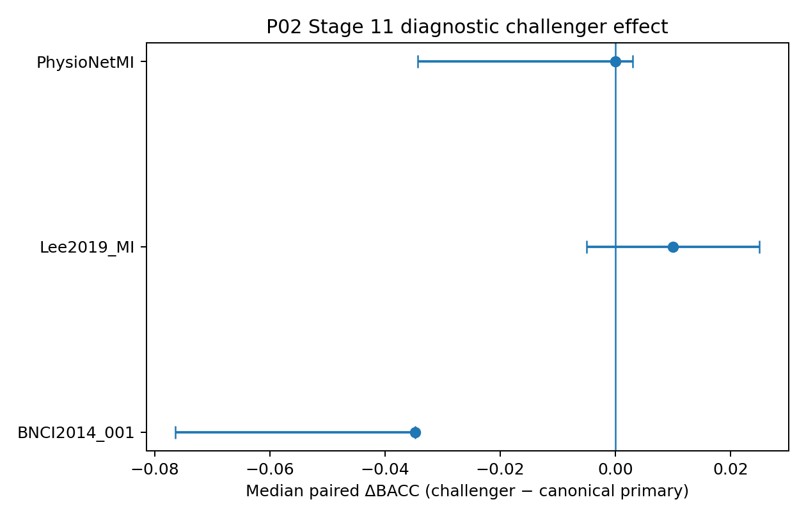

#### 5.3 Stage 12 - source/author-centered external models

Stage 12 underwent a scientifically material source-centered amendment. The canonical accepted recipes include, among other details, FBCNet batch size 16, Adam lr=0.001, max 1500 epochs and patience/no-decrease window 200; DBConformer batch 32, Adam lr=0.001, max 150 and patience 40; and CBraMod with AdamW, separate body/head learning rates, governed scaling, max 150 and patience 40. Test data were excluded from hyperparameter selection.

A preserved validation-only A/B/C diagnostic subset demonstrates exactly why the correction mattered and exactly where its evidentiary boundary lies:

| Dataset      | Branch      |   A BACC | A collapsed   |   B BACC | B collapsed   |    ΔBACC |   Δ percentage points |   C confirm mean BACC |   C confirm SD |   C collapsed |   C n |
|:-------------|:------------|---------:|:--------------|---------:|:--------------|---------:|----------------------:|----------------------:|---------------:|--------------:|------:|
| BNCI2014_001 | DNN-FBCNET  | 0.500000 | True          | 0.722222 | False         | 0.222222 |             22.222222 |              0.500000 |       0.000000 |             5 |     5 |
| PhysioNetMI  | DNN-FBCNET  | 0.639509 | False         | 0.660104 | False         | 0.020595 |              2.059457 |              0.652615 |       0.028169 |             0 |     5 |
| PhysioNetMI  | DNN-SEQ     | 0.698550 | False         | 0.716794 | False         | 0.018244 |              1.824371 |              0.713248 |       0.010908 |             0 |     5 |
| PhysioNetMI  | SSL-CBRAMOD | 0.500000 | True          | 0.638407 | False         | 0.138407 |             13.840729 |              0.646753 |       0.004518 |             0 |     5 |

The **A→B validation changes** were +0.222222 BACC (+22.222222 percentage points) for BNCI2014_001 FBCNet, +0.020595 (+2.059457 points) for PhysioNetMI FBCNet, +0.018244 (+1.824371 points) for PhysioNetMI DBConformer, and +0.138407 (+13.840729 points) for PhysioNetMI CBraMod. The A configuration was collapsed at BACC=0.500000 for BNCI FBCNet and PhysioNet CBraMod; the B configuration was not collapsed in either case. The five-run C confirmation then exposed an important asymmetry: BNCI FBCNet returned to an exact mean BACC of 0.500000 with 5/5 collapsed confirmation runs, whereas PhysioNet FBCNet, DBConformer, and CBraMod had 0/5 collapsed confirmation runs with mean BACC 0.652615, 0.713248, and 0.646753 respectively.

These are **validation-only, non-claim-bearing diagnostics** (`test_role_loaded=false`, `claim_bearing=false` in all four job summaries). They demonstrate that training/optimization choices can materially alter apparent viability, not that the B candidate is a universal test-set improvement. The scientifically defensible conclusion is therefore architecture- and dataset-dependent optimization sensitivity: a generic training policy can make a viable architecture appear collapsed, while source-centered settings do not guarantee stability or superiority. Canonical model effectiveness remains governed by A0.

The exact source-preserving values are in `table_source_data/p02/P02_Table_Stage12_validation_before_after_exact.csv`.

#### 5.4 Canonical downstream closure

Stages 13-17 consolidated low-label, participant/session, A0, and analysis-input evidence. Stage 18 executed A4 under the authorized resource deviation; Stage 18U and the separate Stage 18S family provided closure/supplementary evidence without changing canonical G18. Stages 19-24 preserved negative evidence, readiness, figure/table sources, protocol/analysis handoffs, downstream bundles, and release/finalization. All governed gates through final closure passed with no unresolved blocker.

### 6. A0 - Full Scientific Analysis

#### 6.1 Completion and terminal outcomes

A0 completed **678/678** planned cells. Terminal accounting was:

| Terminal status | Count |
|---|---:|
| SUCCESS | 657 |
| FAILED | 3 |
| CONDITIONAL_SKIP | 15 |
| DEPENDENCY_BLOCKED | 3 |

The three FAILED cells are the one-label/class CSP-LDA low-label cells, one in each dataset. The 15 conditional skips correspond to the E-GTC fallback branch; the three dependency blocks belong to SSL-REVE. Their explicit preservation matters because a benchmark that silently drops unsupported or failed methods can create a misleading impression of universal executability.

#### 6.2 Full-training model performance

Participant-first full-training summary:

| Dataset              | Model       |   participants |   BACC_mean |   BACC_median | BACC_sd   |   F1_mean |   ACC_mean |   ROC_AUC_mean |
|:---------------------|:------------|---------------:|------------:|--------------:|:----------|----------:|-----------:|---------------:|
| BNCI2014_001         | CSP-LDA     |              1 |       0.639 |         0.639 | NA        |     0.639 |      0.639 |          0.678 |
| BNCI2014_001         | FBCSP-LR    |              1 |       0.628 |         0.628 | NA        |     0.628 |      0.628 |          0.677 |
| BNCI2014_001         | EEGNet      |              1 |       0.609 |         0.609 | NA        |     0.598 |      0.609 |          0.645 |
| BNCI2014_001         | FBCNet      |              1 |       0.481 |         0.481 | NA        |     0.478 |      0.481 |          0.474 |
| BNCI2014_001         | DBConformer |              1 |       0.528 |         0.528 | NA        |     0.523 |      0.528 |          0.553 |
| BNCI2014_001         | EA-TS       |              1 |       0.611 |         0.611 | NA        |     0.584 |      0.611 |          0.699 |
| BNCI2014_001         | TS-LR       |              1 |       0.615 |         0.615 | NA        |     0.587 |      0.615 |          0.699 |
| BNCI2014_001         | CBraMod     |              1 |       0.551 |         0.551 | NA        |     0.534 |      0.551 |          0.572 |
| Lee2019_MI / OpenBMI | CSP-LDA     |              6 |       0.715 |         0.7   | 0.183     |     0.663 |      0.715 |          0.807 |
| Lee2019_MI / OpenBMI | FBCSP-LR    |              6 |       0.653 |         0.66  | 0.135     |     0.606 |      0.653 |          0.8   |
| Lee2019_MI / OpenBMI | EEGNet      |              6 |       0.742 |         0.725 | 0.176     |     0.723 |      0.742 |          0.806 |
| Lee2019_MI / OpenBMI | FBCNet      |              6 |       0.719 |         0.691 | 0.167     |     0.695 |      0.719 |          0.816 |
| Lee2019_MI / OpenBMI | DBConformer |              6 |       0.795 |         0.743 | 0.129     |     0.785 |      0.795 |          0.883 |
| Lee2019_MI / OpenBMI | EA-TS       |              6 |       0.752 |         0.78  | 0.198     |     0.709 |      0.752 |          0.853 |
| Lee2019_MI / OpenBMI | TS-LR       |              6 |       0.747 |         0.78  | 0.202     |     0.7   |      0.747 |          0.853 |
| Lee2019_MI / OpenBMI | CBraMod     |              6 |       0.668 |         0.643 | 0.163     |     0.646 |      0.668 |          0.729 |
| PhysioNetMI          | CSP-LDA     |             11 |       0.596 |         0.542 | 0.148     |     0.545 |      0.586 |          0.637 |
| PhysioNetMI          | FBCSP-LR    |             11 |       0.564 |         0.548 | 0.122     |     0.532 |      0.56  |          0.63  |
| PhysioNetMI          | EEGNet      |             11 |       0.628 |         0.579 | 0.124     |     0.613 |      0.63  |          0.691 |
| PhysioNetMI          | FBCNet      |             11 |       0.618 |         0.562 | 0.128     |     0.592 |      0.617 |          0.701 |
| PhysioNetMI          | DBConformer |             11 |       0.65  |         0.598 | 0.135     |     0.642 |      0.654 |          0.695 |
| PhysioNetMI          | EA-TS       |             11 |       0.618 |         0.561 | 0.116     |     0.594 |      0.618 |          0.694 |
| PhysioNetMI          | TS-LR       |             11 |       0.613 |         0.562 | 0.118     |     0.587 |      0.614 |          0.697 |
| PhysioNetMI          | CBraMod     |             11 |       0.545 |         0.493 | 0.092     |     0.54  |      0.544 |          0.557 |

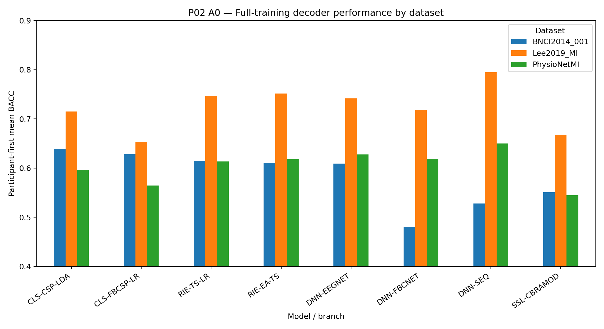

Three patterns dominate.

First, **the ranking is not stable across datasets**. CSP-LDA is descriptively strongest on BNCI2014_001, while DBConformer is strongest by participant-first mean BACC on Lee2019_MI and PhysioNetMI. EEGNet, Riemannian tangent-space variants, and FBCNet form a relatively competitive middle tier on the two multi-participant datasets, but the exact order changes.

Second, the numeric spread is not negligible. On Lee2019_MI, participant-first mean BACC ranges from 0.795 for DBConformer to 0.653 for FBCSP-LR among the principal successful branches shown above; on PhysioNetMI it ranges from 0.650 for DBConformer to 0.545 for CBraMod. Yet these mean differences coexist with substantial participant variability and multiplicity-adjusted pairwise uncertainty.

Third, CBraMod does not automatically dominate because it is pretrained/foundation-scale. Under this P02 task and adaptation protocol, its participant-first mean BACC was 0.668 on Lee2019_MI and 0.545 on PhysioNetMI, below several task-specific and classical/Riemannian branches. This is not evidence against foundation models generally; it is evidence that **pretraining scale does not remove task-, adaptation-, and protocol-dependence**.

#### 6.3 Governed statistical comparison

| Dataset              |   n | Status           | Friedman   | p        | Kendall W   |
|:---------------------|----:|:-----------------|:-----------|:---------|:------------|
| BNCI2014_001         |   1 | DESCRIPTIVE_ONLY | NA         | NA       | NA          |
| Lee2019_MI / OpenBMI |   6 | PASS             | 10.781     | 0.1485   | 0.257       |
| PhysioNetMI          |  11 | PASS             | 20.544     | 0.004507 | 0.267       |

PhysioNetMI shows a statistically detectable global model effect (p=0.00451), with Kendall W=0.267 indicating a modest-to-moderate rank-consistency effect rather than overwhelming dominance. Lee2019_MI's omnibus p=0.148 does not support rejecting equal model ranks under the governed test. BNCI2014_001 has one test participant and is correctly descriptive-only.

The paired alternative-versus-CSP-LDA post-hoc results are:

| Dataset              | Alternative   |   Median ΔBACC |   raw p |   Holm p |   Rank-biserial |   95% CI low |   95% CI high |
|:---------------------|:--------------|---------------:|--------:|---------:|----------------:|-------------:|--------------:|
| Lee2019_MI / OpenBMI | FBCSP-LR      |         -0.035 | 0.4688  |        1 |          -0.381 |       -0.36  |         0.06  |
| Lee2019_MI / OpenBMI | EEGNet        |          0.025 | 0.1875  |        1 |           0.733 |       -0.005 |         0.056 |
| Lee2019_MI / OpenBMI | FBCNet        |          0.004 | 0.8438  |        1 |           0.143 |       -0.042 |         0.034 |
| Lee2019_MI / OpenBMI | DBConformer   |          0.129 | 0.1562  |        1 |           0.714 |       -0.043 |         0.151 |
| Lee2019_MI / OpenBMI | EA-TS         |          0.04  | 0.3438  |        1 |           0.476 |       -0.065 |         0.1   |
| Lee2019_MI / OpenBMI | TS-LR         |          0.04  | 0.5625  |        1 |           0.333 |       -0.075 |         0.1   |
| Lee2019_MI / OpenBMI | CBraMod       |         -0.062 | 0.09375 |        1 |          -0.81  |       -0.098 |        -0.012 |
| PhysioNetMI          | FBCSP-LR      |         -0.042 | 0.2783  |        1 |          -0.394 |       -0.113 |         0.02  |
| PhysioNetMI          | EEGNet        |          0.035 | 0.123   |        1 |           0.545 |       -0.033 |         0.056 |
| PhysioNetMI          | FBCNet        |          0.053 | 0.3203  |        1 |           0.364 |       -0.066 |         0.062 |
| PhysioNetMI          | DBConformer   |          0.062 | 0.06738 |        1 |           0.636 |       -0.019 |         0.081 |
| PhysioNetMI          | EA-TS         |          0.063 | 0.2783  |        1 |           0.394 |       -0.119 |         0.098 |
| PhysioNetMI          | TS-LR         |          0.063 | 0.3652  |        1 |           0.333 |       -0.143 |         0.099 |
| PhysioNetMI          | CBraMod       |         -0.012 | 0.2402  |        1 |          -0.424 |       -0.176 |         0.013 |

No Holm-adjusted pairwise comparison is significant. This is not a contradiction with the PhysioNet omnibus result: an omnibus test can detect overall rank heterogeneity while the individual reference contrasts lack multiplicity-adjusted evidence. It is therefore scientifically inappropriate to turn the descriptive DBConformer lead into a confirmatory claim that DBConformer is superior to CSP-LDA.

#### 6.4 Participant heterogeneity

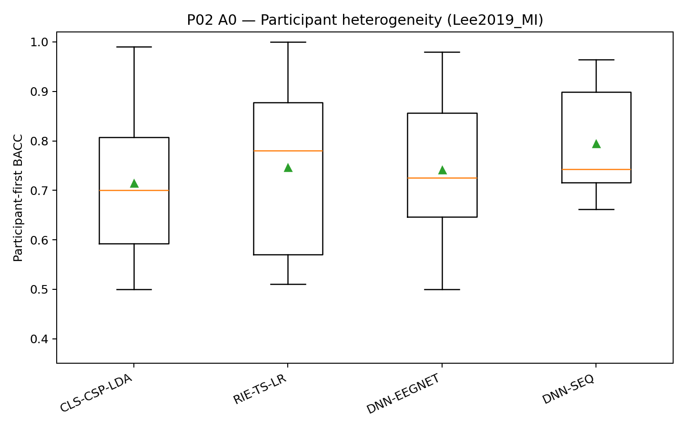

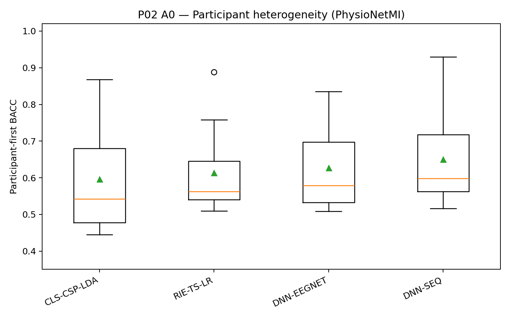

Participant variation is large enough to change the interpretation of mean rankings. On Lee2019_MI, DBConformer spans **0.662000-0.964000** across six test participants (SD 0.129050), while CSP-LDA spans **0.500000-0.990000** (SD 0.182729) and TS-LR spans **0.510000-1.000000** (SD 0.201660). On PhysioNetMI, DBConformer spans **0.516071-0.929447** across eleven participants (SD 0.135274), CSP-LDA spans **0.444664-0.867589** (SD 0.147744), and TS-LR spans **0.509881-0.888340** (SD 0.117579). Thus, a branch that has the best participant-first mean can still be substantially weaker for particular individuals.

A complementary descriptive difficulty summary averages BACC across the nine main full-training branches **within each participant**; it is not a personalization-policy test and it does not choose a model from the participant's test result. Selected low/high participants are:

| Dataset     |   Participant ID |   Branches |   Mean BACC across main branches |      Min |      Max |
|:------------|-----------------:|-----------:|---------------------------------:|---------:|---------:|
| Lee2019_MI  |                6 |          9 |                         0.574667 | 0.490000 | 0.746000 |
| Lee2019_MI  |               15 |          9 |                         0.596667 | 0.490000 | 0.760000 |
| Lee2019_MI  |               30 |          9 |                         0.598000 | 0.514000 | 0.708000 |
| Lee2019_MI  |               19 |          9 |                         0.774222 | 0.650000 | 0.870000 |
| Lee2019_MI  |                3 |          9 |                         0.829333 | 0.610000 | 0.950000 |
| Lee2019_MI  |               36 |          9 |                         0.896222 | 0.630000 | 1.000000 |
| PhysioNetMI |                6 |          9 |                         0.505820 | 0.431548 | 0.559524 |
| PhysioNetMI |               98 |          9 |                         0.521871 | 0.444664 | 0.567589 |
| PhysioNetMI |               39 |          9 |                         0.524352 | 0.420949 | 0.629447 |
| PhysioNetMI |               48 |          9 |                         0.703469 | 0.500000 | 0.807115 |
| PhysioNetMI |               71 |          9 |                         0.740580 | 0.608696 | 0.929447 |
| PhysioNetMI |               93 |          9 |                         0.791634 | 0.545455 | 0.888340 |

For Lee2019_MI, the across-branch participant mean ranges from **0.574667** to **0.896222**; for PhysioNetMI it ranges from **0.505820** to **0.791634**. This confirms that heterogeneity is not merely a small change in branch ordering: some held-out participants are systematically difficult across many representation families. P02 therefore supports a heterogeneity finding and a motivation for future participant-aware work, but **does not validate personalization or model routing**.

Exact participant/model dispersion and participant difficulty summaries are preserved in `table_source_data/p02/P02_Table_participant_heterogeneity_summary.csv` and `table_source_data/p02/P02_Table_participant_difficulty_summary.csv`.

### 7. Low-Label / Budget Analysis

The governed low-label surface contains **216 metric-source rows**: three datasets × four eligible branches × six budgets × three metrics (BACC, macro-F1, ACC). At the run-cell level, **213/216 succeeded and 3/216 failed**; the three failures are CSP-LDA at 1 label/class, one per dataset. The curve artifact retains all legal budgets without interpolation. Every budget uses the same exact inherited single frozen subset identity, so these trajectories are reproducible but do not estimate variation over alternative subset draws.

#### 7.1 BNCI2014_001

| Model   | 1        |        2 |        4 |        8 |       16 |       32 |
|:--------|:---------|---------:|---------:|---------:|---------:|---------:|
| CBraMod | 0.497917 | 0.506944 | 0.508333 | 0.520833 | 0.527778 | 0.516667 |
| CSP-LDA | NA       | 0.527778 | 0.604167 | 0.486111 | 0.527778 | 0.496528 |
| EEGNet  | 0.524306 | 0.525000 | 0.535417 | 0.541667 | 0.568750 | 0.507639 |
| TS-LR   | 0.541667 | 0.562500 | 0.590278 | 0.486111 | 0.520833 | 0.520833 |

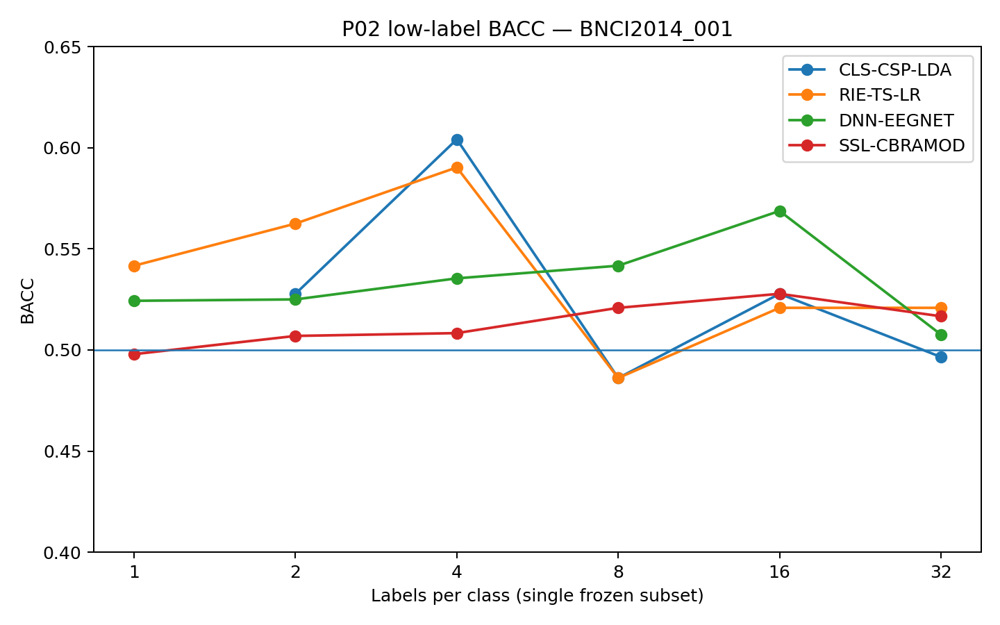

The exact BACC leader changes from TS-LR at 1/class (0.541667) and 2/class (0.562500), to CSP-LDA at 4/class (0.604167), to EEGNet at 8/class (0.541667) and 16/class (0.568750), and back to TS-LR at 32/class (0.520833). This sequence alone rules out a stable model ranking over the frozen budget path. The one held-out BNCI participant also makes all such changes descriptive-only.

#### 7.2 Lee2019_MI

| Model   | 1        |        2 |        4 |        8 |       16 |       32 |
|:--------|:---------|---------:|---------:|---------:|---------:|---------:|
| CBraMod | 0.502667 | 0.484000 | 0.495667 | 0.510667 | 0.488000 | 0.492667 |
| CSP-LDA | NA       | 0.500000 | 0.496667 | 0.461667 | 0.566667 | 0.518333 |
| EEGNet  | 0.527333 | 0.498333 | 0.524333 | 0.522667 | 0.498000 | 0.522667 |
| TS-LR   | 0.501667 | 0.493333 | 0.498333 | 0.535000 | 0.570000 | 0.528333 |

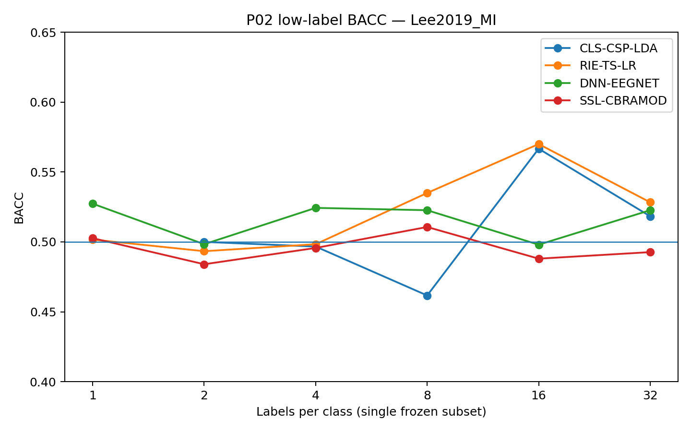

The leader changes from EEGNet at 1/class (0.527333), to CSP-LDA at 2/class (0.500000), back to EEGNet at 4/class (0.524333), then to TS-LR at 8, 16 and 32/class (0.535000, 0.570000 and 0.528333). Even the 32/class values remain far below the corresponding full-training participant-first means: for example, TS-LR is 0.528333 at 32/class versus 0.746667 full training (Δ=-0.218333), while EEGNet is 0.522667 versus 0.741667 (Δ=-0.219000).

#### 7.3 PhysioNetMI

| Model   | 1        |        2 |        4 |        8 |       16 |       32 |
|:--------|:---------|---------:|---------:|---------:|---------:|---------:|
| CBraMod | 0.494341 | 0.503863 | 0.493245 | 0.505408 | 0.506486 | 0.485537 |
| CSP-LDA | NA       | 0.545814 | 0.501886 | 0.515990 | 0.527848 | 0.503863 |
| EEGNet  | 0.491736 | 0.496982 | 0.498419 | 0.497054 | 0.525530 | 0.526249 |
| TS-LR   | 0.513026 | 0.500000 | 0.511498 | 0.502066 | 0.548239 | 0.521559 |

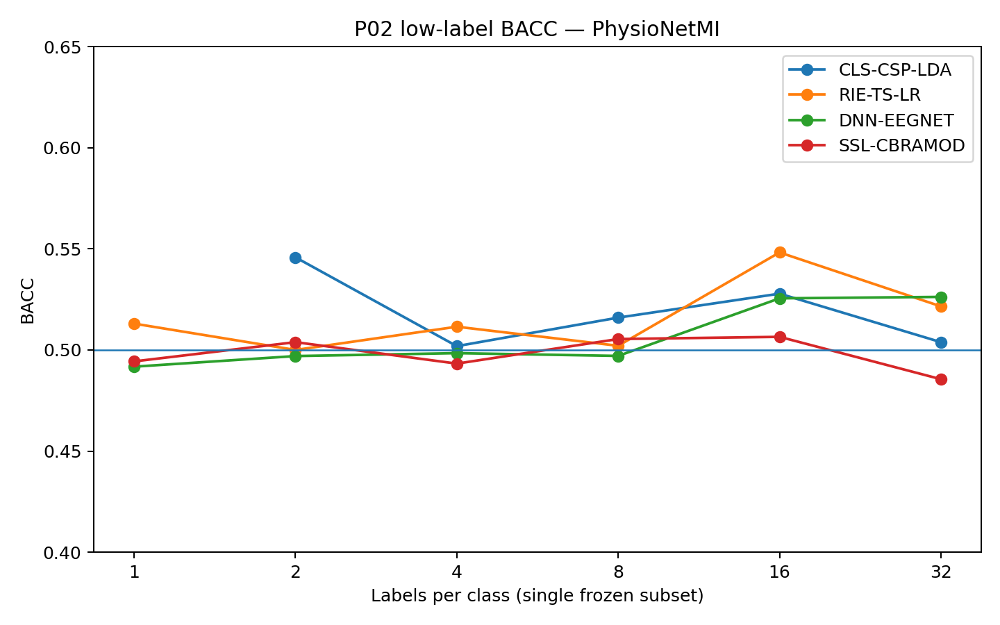

The leader alternates repeatedly: TS-LR at 1/class (0.513026), CSP-LDA at 2/class (0.545814), TS-LR at 4/class (0.511498), CSP-LDA at 8/class (0.515990), TS-LR at 16/class (0.548239), and EEGNet at 32/class (0.526249). At 32/class, EEGNet is still 0.101262 BACC below its full-training mean (0.627511); TS-LR is 0.091669 below full training (0.613228).

#### 7.4 Exact interval changes and rank reversals

The budget leaders are:

- **BNCI2014_001:** 1:TS-LR (0.541667), 2:TS-LR (0.562500), 4:CSP-LDA (0.604167), 8:EEGNet (0.541667), 16:EEGNet (0.568750), 32:TS-LR (0.520833).
- **Lee2019_MI:** 1:EEGNet (0.527333), 2:CSP-LDA (0.500000), 4:EEGNet (0.524333), 8:TS-LR (0.535000), 16:TS-LR (0.570000), 32:TS-LR (0.528333).
- **PhysioNetMI:** 1:TS-LR (0.513026), 2:CSP-LDA (0.545814), 4:TS-LR (0.511498), 8:CSP-LDA (0.515990), 16:TS-LR (0.548239), 32:EEGNet (0.526249).

The largest adjacent change for each branch/dataset is preserved rather than smoothed away:

- BNCI2014_001 / CSP-LDA: largest adjacent change ending at 8/class = -0.118056 BACC.
- BNCI2014_001 / EEGNet: largest adjacent change ending at 32/class = -0.061111 BACC.
- BNCI2014_001 / TS-LR: largest adjacent change ending at 8/class = -0.104167 BACC.
- BNCI2014_001 / CBraMod: largest adjacent change ending at 8/class = +0.012500 BACC.
- Lee2019_MI / CSP-LDA: largest adjacent change ending at 16/class = +0.105000 BACC.
- Lee2019_MI / EEGNet: largest adjacent change ending at 2/class = -0.029000 BACC.
- Lee2019_MI / TS-LR: largest adjacent change ending at 32/class = -0.041667 BACC.
- Lee2019_MI / CBraMod: largest adjacent change ending at 16/class = -0.022667 BACC.
- PhysioNetMI / CSP-LDA: largest adjacent change ending at 4/class = -0.043927 BACC.
- PhysioNetMI / EEGNet: largest adjacent change ending at 16/class = +0.028476 BACC.
- PhysioNetMI / TS-LR: largest adjacent change ending at 16/class = +0.046173 BACC.
- PhysioNetMI / CBraMod: largest adjacent change ending at 32/class = -0.020949 BACC.

These exact changes demonstrate why terms such as *sample efficiency*, *saturation*, or *diminishing returns* would be too strong here. Curves frequently reverse direction. Because P02 has only one frozen subset at each budget, the observed reversals cannot be cleanly partitioned into model response versus subset-composition effects.

#### 7.5 Interpretation and claim ceiling

The strongest defensible conclusion is negative/qualified: **extreme label scarcity remains difficult and the frozen P02 design does not establish a stable universal sample-efficiency ordering among CSP-LDA, tangent-space LR, EEGNet and CBraMod.** The evidence does not support statements such as “EEGNet is more label-efficient than Riemannian methods,” “foundation-model pretraining solves low-label MI,” or “performance improves monotonically with labels.” A prospective repeated-subset experiment is required to estimate subset variance and a stable budget-response relationship.

Exact point values, full-training deltas, ranks, adjacent increments, leaders, and rank changes are preserved in `table_source_data/p02/P02_Table_low_label_exact_deltas_and_ranks.csv`, `P02_Table_low_label_interval_deltas.csv`, and `P02_Table_low_label_budget_leaders_and_rank_changes.csv`.

### 8. Secondary Metrics and Class-Wise Evidence

The governed metric hierarchy prevents a secondary score from silently replacing BACC. Macro-F1 is complementary, ACC is secondary, and ROC-AUC is conditional on valid score semantics. At full training the main BACC pattern is largely corroborated by macro-F1 and ACC, but AUC can rank score-producing branches differently:

| Dataset | BACC leader | Macro-F1 leader | ACC leader | Conditional ROC-AUC leader |
|---|---|---|---|---|
| BNCI2014_001 | CSP-LDA (0.639) | CSP-LDA (0.639) | CSP-LDA (0.639) | EA-TS (0.699) |
| Lee2019_MI | DBConformer (0.795) | DBConformer (0.785) | DBConformer (0.795) | DBConformer (0.883) |
| PhysioNetMI | DBConformer (0.650) | DBConformer (0.642) | DBConformer (0.654) | FBCNet (0.701) |

The first three metrics therefore support the main dataset-dependent BACC narrative without creating a separate winner-selection rule. The PhysioNet AUC ordering is a useful reminder that discrimination ranking based on continuous scores need not match the hard-decision BACC ordering. Because ROC-AUC is unavailable or semantically inapplicable for some branches, it is not used to produce a universal cross-family leaderboard.

The canonical 38-input Phase Analysis contract does **not** include a standalone confusion-matrix or class-wise error-summary artifact. Prediction records and score semantics are preserved in the execution substrate, but computing a new confusion-analysis family here would exceed the frozen Phase Analysis input contract. Accordingly, this report does not invent class-wise claims. A later governed analysis may use the preserved predictions if its own Protocol authorizes that computation.

`table_source_data/p02/P02_Table_A0_secondary_metric_leaders.csv` preserves the exact metric-leader values used in this section.

### 9. Model- and Family-Level Interpretation

#### 9.1 Classical and Riemannian baselines

CSP-LDA remains a strong baseline: it leads BNCI descriptively and provides the governed reference for A0 post-hoc tests. Riemannian tangent-space/alignment variants are competitive on Lee and PhysioNet and sometimes exceed CSP-LDA descriptively. This is consistent with the broader BCI literature in which covariance/Riemannian representations can be competitive and data-efficient, but P02's exact task/split makes direct numerical comparison to older Riemannian papers inappropriate.

#### 9.2 EEGNet

EEGNet is competitive on Lee/PhysioNet and remains a scientifically valuable compact neural baseline. Its Stage 11 history shows, however, that training-rule provenance is part of the result: the primary surface is mixed across grandfathered recipes. The diagnostic challenger does not provide a consistent improvement, so the final report separates **recipe-history correctness** from **performance superiority**.

#### 9.3 FBCNet

FBCNet performs strongly on PhysioNet and reasonably on Lee but poorly on the single BNCI test participant. Stage12 diagnostics show both the value and limitation of author-centered optimization: a source-centered candidate can rescue a collapsed diagnostic configuration, yet confirmation may still fail. This fits the architecture's filter-bank/variance motivation while underscoring dataset-specific optimization sensitivity.

#### 9.4 DBConformer

DBConformer is the descriptive full-training leader on Lee and PhysioNet. The original DBConformer paper emphasizes separate long-range temporal and inter-channel modeling and reports broad performance gains across several EEG paradigms. P02 is consistent with the possibility that such a dual representation is useful, but the current evidence does not isolate which architectural component caused the advantage, and Holm-adjusted reference comparisons do not establish confirmatory superiority.

#### 9.5 CBraMod

CBraMod's weaker P02 A0 results relative to several smaller task-specific models are scientifically informative. The original model is a large pretrained criss-cross foundation architecture designed to generalize across diverse tasks and formats. P02 exercises a narrower binary MI transfer setting with governed model-local adaptation. The gap illustrates why “foundation model” should not be treated as a synonym for “automatically superior under every downstream supervision regime.” Mechanistic explanations remain hypotheses because P02 did not ablate pretraining, adapter design, or representation mismatch separately.

### 10. A4 - Full Scientific Analysis

#### 10.1 Scientific purpose and conditions

A4 asks whether ordinary input/view/ensemble manipulations alter Layer-2 decoder evidence under controlled matched comparisons. The six official conditions are:

- C0: core reference;
- C1: longer 3.5 s window;
- C2: multi-view hard vote;
- C3: multi-view probability average;
- C4: model hard-vote ensemble;
- C5: model probability-average ensemble.

C1-C3 are compared against C0 within governed model-family roles. C4/C5 are compared against the validation-selected strongest constituent; test outcomes are prohibited from choosing that constituent.

#### 10.2 Resource-constrained canonical design

The executed Stage18 design differs from the original high-cost Build Book surface:

| Design element | Original plan | Canonical Stage 18 |
|---|---|---|
| Refit repeat indices | 0,1,2,3,4 | 0 only |
| Deep refit budgets | full frozen budget grid | 1/class, 8/class, FULL_TRAIN anchors |
| Conditions | C0-C5 | C0-C5 preserved |
| Datasets | 3 | all 3 preserved |
| Refit roles | classical, neural, Riemannian, SSL | all preserved |
| Estimated unique deep member fits | 840 | 72 |
| Claim of full Build Book equivalence | intended target | explicitly **false** |

The 91.4% estimated reduction in unique deep member fits was a compute decision, not a change to the per-fit scientific recipe, representative-selection logic, test isolation, checkpoint round-trip rule, or statistical comparison definition.

A4 terminal accounting:

| Terminal status | Count |
|---|---:|
| SUCCESS | 591 |
| CONDITIONAL_SKIP | 576 |
| INPUT_INCOMPATIBLE | 9 |
| NOT_APPLICABLE_REPEAT_SLOT | 42 |

The distinction between **planned slots** and **executable canonical cells** is important: conditional skips represent declared reduction, not missing unexplained evidence.

#### 10.3 C1-C3 role-control results

| Dataset              | role_id    | Condition          |   evaluable_effect_cells |   median_cell_effect |   positive_cells |   negative_cells |   zero_cells | min_raw_p   | min_holm_p   |
|:---------------------|:-----------|:-------------------|-------------------------:|---------------------:|-----------------:|-----------------:|-------------:|:------------|:-------------|
| BNCI2014_001         | CLASSICAL  | C1-LONG-3P5S       |                        6 |                0.009 |                4 |                2 |            0 | NA          | NA           |
| BNCI2014_001         | CLASSICAL  | C2-MULTI-HARD-VOTE |                        6 |                0.007 |                3 |                3 |            0 | NA          | NA           |
| BNCI2014_001         | CLASSICAL  | C3-MULTI-PROB-AVG  |                        6 |               -0.005 |                2 |                3 |            1 | NA          | NA           |
| BNCI2014_001         | NEURAL     | C1-LONG-3P5S       |                        3 |               -0.003 |                1 |                2 |            0 | NA          | NA           |
| BNCI2014_001         | NEURAL     | C2-MULTI-HARD-VOTE |                        3 |               -0.003 |                1 |                2 |            0 | NA          | NA           |
| BNCI2014_001         | NEURAL     | C3-MULTI-PROB-AVG  |                        3 |               -0.021 |                1 |                2 |            0 | NA          | NA           |
| BNCI2014_001         | RIEMANNIAN | C1-LONG-3P5S       |                        7 |                0.003 |                4 |                3 |            0 | NA          | NA           |
| BNCI2014_001         | RIEMANNIAN | C2-MULTI-HARD-VOTE |                        7 |                0.014 |                7 |                0 |            0 | NA          | NA           |
| BNCI2014_001         | RIEMANNIAN | C3-MULTI-PROB-AVG  |                        7 |                0.021 |                6 |                1 |            0 | NA          | NA           |
| BNCI2014_001         | SSL        | C2-MULTI-HARD-VOTE |                        3 |                0.052 |                3 |                0 |            0 | NA          | NA           |
| BNCI2014_001         | SSL        | C3-MULTI-PROB-AVG  |                        3 |                0.024 |                2 |                1 |            0 | NA          | NA           |
| Lee2019_MI / OpenBMI | CLASSICAL  | C1-LONG-3P5S       |                        6 |                0     |                1 |                1 |            4 | 0.125       | 0.375        |
| Lee2019_MI / OpenBMI | CLASSICAL  | C2-MULTI-HARD-VOTE |                        6 |                0     |                2 |                2 |            2 | 0.0625      | 0.375        |
| Lee2019_MI / OpenBMI | CLASSICAL  | C3-MULTI-PROB-AVG  |                        6 |                0     |                2 |                2 |            2 | 0.0625      | 0.375        |
| Lee2019_MI / OpenBMI | NEURAL     | C1-LONG-3P5S       |                        3 |               -0.005 |                1 |                2 |            0 | 0.125       | 0.375        |
| Lee2019_MI / OpenBMI | NEURAL     | C2-MULTI-HARD-VOTE |                        3 |               -0.005 |                1 |                2 |            0 | 0.4375      | 0.875        |
| Lee2019_MI / OpenBMI | NEURAL     | C3-MULTI-PROB-AVG  |                        3 |                0     |                1 |                1 |            1 | 0.3125      | 0.875        |
| Lee2019_MI / OpenBMI | RIEMANNIAN | C1-LONG-3P5S       |                        7 |                0     |                1 |                2 |            4 | 0.5         | 1            |
| Lee2019_MI / OpenBMI | RIEMANNIAN | C2-MULTI-HARD-VOTE |                        7 |                0     |                1 |                1 |            5 | 0.25        | 1            |
| Lee2019_MI / OpenBMI | RIEMANNIAN | C3-MULTI-PROB-AVG  |                        7 |                0     |                1 |                2 |            4 | 0.1875      | 1            |
| Lee2019_MI / OpenBMI | SSL        | C2-MULTI-HARD-VOTE |                        3 |               -0.005 |                1 |                2 |            0 | 0.2812      | 0.5625       |
| Lee2019_MI / OpenBMI | SSL        | C3-MULTI-PROB-AVG  |                        3 |                0.025 |                2 |                1 |            0 | 0.1875      | 0.5625       |
| PhysioNetMI          | CLASSICAL  | C1-LONG-3P5S       |                        6 |                0     |                1 |                1 |            4 | 0.07812     | 0.2344       |
| PhysioNetMI          | CLASSICAL  | C2-MULTI-HARD-VOTE |                        6 |                0     |                1 |                1 |            4 | 0.4609      | 1            |
| PhysioNetMI          | CLASSICAL  | C3-MULTI-PROB-AVG  |                        6 |                0     |                1 |                0 |            5 | 0.4258      | 1            |
| PhysioNetMI          | NEURAL     | C1-LONG-3P5S       |                        3 |                0     |                1 |                0 |            2 | 0.4648      | 1            |
| PhysioNetMI          | NEURAL     | C2-MULTI-HARD-VOTE |                        3 |                0     |                1 |                0 |            2 | 0.6523      | 1            |
| PhysioNetMI          | NEURAL     | C3-MULTI-PROB-AVG  |                        3 |                0     |                1 |                0 |            2 | 0.6836      | 1            |
| PhysioNetMI          | RIEMANNIAN | C1-LONG-3P5S       |                        7 |                0     |                2 |                0 |            5 | 0.1934      | 0.5801       |
| PhysioNetMI          | RIEMANNIAN | C2-MULTI-HARD-VOTE |                        7 |                0     |                1 |                2 |            4 | 0.1953      | 0.7188       |
| PhysioNetMI          | RIEMANNIAN | C3-MULTI-PROB-AVG  |                        7 |                0     |                2 |                0 |            5 | 0.25        | 0.7188       |
| PhysioNetMI          | SSL        | C2-MULTI-HARD-VOTE |                        3 |               -0.003 |                1 |                2 |            0 | 0.1641      | 0.3281       |
| PhysioNetMI          | SSL        | C3-MULTI-PROB-AVG  |                        3 |                0     |                1 |                1 |            1 | 0.6377      | 0.6377       |

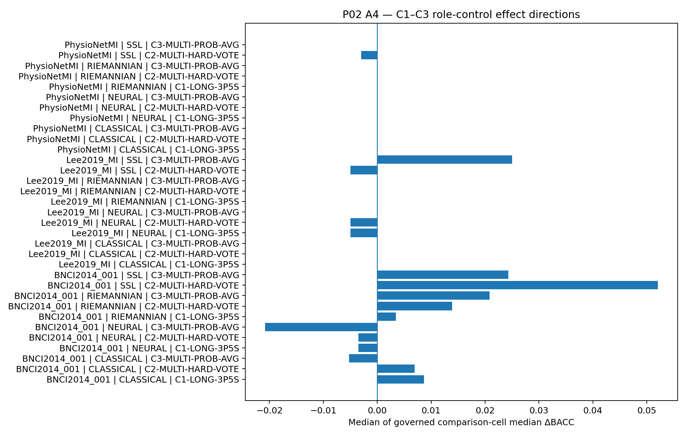

Across all 756 statistical rows, **zero** produced raw p<=0.05. Several groups have positive or negative median cell effects, but signs vary by dataset, role and budget. The data therefore do not support a simple claim that longer windows, hard-voted views, or probability-averaged views systematically improve decoder performance.

The absence of significance should not be interpreted as proof of no effect. The canonical deep surface is deliberately reduced; some role/budget rows are non-evaluable due to participant-count or compatibility rules; and Stage18S later shows repeat/budget sensitivity. The correct scientific statement is that **no statistically detectable C1-C3 improvement emerged under the frozen canonical A4 tests**.

#### 10.4 C4/C5 ensemble controls

Only one governed C4/C5 row survives Holm correction:

| Dataset     | Condition          | budget_id   |   repeat | Strongest constituent   |   n |   median_delta_BACC |   p_value |   holm_adjusted_p |   rank_biserial |   ci_low |   ci_high |
|:------------|:-------------------|:------------|---------:|:------------------------|----:|--------------------:|----------:|------------------:|----------------:|---------:|----------:|
| PhysioNetMI | C4-MODEL-HARD-VOTE | FULL_TRAIN  |        4 | EEGNet                  |  11 |              -0.043 |   0.01855 |           0.03711 |          -0.788 |    -0.13 |    -0.012 |

This result is negative for the ensemble: on PhysioNetMI full training at ensemble repeat 4, hard voting reduced participant-level BACC relative to validation-selected EEGNet. Several other C4/C5 rows have raw p<=0.05 but do not survive the family correction and therefore are not promoted to confirmatory findings.

The practical implication is that aggregation complexity carries no automatic accuracy entitlement. An ensemble can combine complementary errors, but it can also dilute the strongest constituent or amplify correlated weaknesses.

#### 10.5 Burden and practical significance

A4 performance must be interpreted together with evidence-acquisition and computation burden. The canonical burden source shows that C1 lengthens the observation horizon from **3.0 s to 3.5 s**. C2/C3 evaluate three views/members, while C4/C5 evaluate four model members; these conditions therefore add inference and aggregation work before any accuracy benefit is considered.

Across successful burden rows, the descriptive batch-1/model-evaluation latency medians are approximately **0.003007 s (C0)**, **0.006025 s (C1)**, **0.026557 s (C2/C3)**, and **0.021292 s (C4/C5)**. Median aggregation latency is about **0.003456 s for C2 hard vote**, **0.001812 s for C3 probability averaging**, **0.002756 s for C4 hard vote**, and **0.000242 s for C5 probability averaging**. These are execution-environment descriptive burdens, **not deployment latency benchmarks**.

This burden matters because the governed efficacy results do not show a consistent compensating advantage: the 756 C1-C3 role-control comparisons contain zero raw p-values <=0.05, and the only Holm-significant C4/C5 comparison is negative. P02 therefore does not justify additional ordinary view/ensemble complexity on the premise of a reliable accuracy gain. The proper conclusion is a **performance-burden trade-off under the tested P02 environment**, not a universal deployment recommendation.

The exact condition-level burden summary is preserved in `table_source_data/p02/P02_Table_A4_burden_summary.csv`.

### 11. Stage 18S - Supplemental Sensitivity Analysis

Stage 18S is **post-hoc descriptive**. It was introduced after canonical Stage18 to examine whether the resource-constrained conclusions were sensitive to additional repeats and intermediate-budget probes. It does not change G18, does not turn three repeats into the originally intended five-repeat confirmatory design, and does not establish full Build Book equivalence.

| Dataset              |   ALL_NEGATIVE |   MIXED |   ALL_POSITIVE |   Median repeat SD ΔBACC |
|:---------------------|---------------:|--------:|---------------:|-------------------------:|
| BNCI2014_001         |              2 |       9 |              4 |                    0.032 |
| Lee2019_MI / OpenBMI |              1 |       7 |              7 |                    0.015 |
| PhysioNetMI          |              4 |       6 |              5 |                    0.011 |

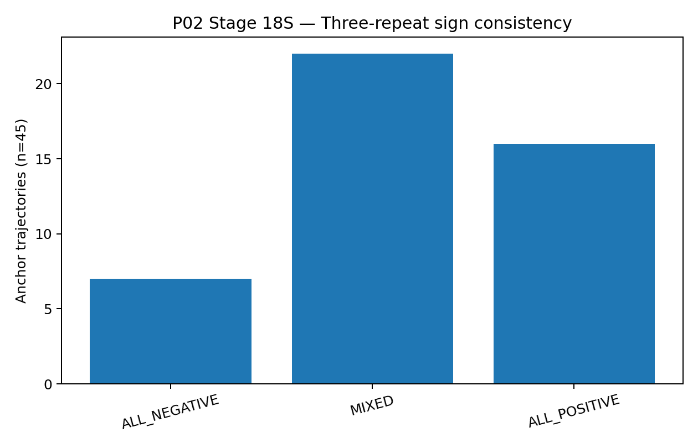

Of 45 anchor trajectories, 22 are MIXED, 16 ALL_POSITIVE, and 7 ALL_NEGATIVE. The overall median repeat SD of delta BACC is 0.0159 and the 90th percentile is 0.0369. Dataset medians are highest on BNCI (~0.0323), lower on Lee (~0.0155), and lower again on PhysioNet (~0.0111).

The six-budget MR00 probe is even more cautionary: **15/15 trajectories contain at least one sign flip** across the six evaluated budgets (1,4,8,16,32,FULL; budget 2 was intentionally absent from this supplement). This means that an A4 manipulation can appear helpful at one supervision level and harmful at another. The supplement therefore **qualifies** any temptation to generalize an anchor-budget sign across the entire label regime.

### 12. Failure, Negative Results, and Diagnostics

Failure and non-success evidence is part of the scientific record, but the record families have different semantics and must not be summed as if they were one failure count.

The canonical aggregation reports **648 FailureCaseIndex records, 340 NegativeResultNote records, and 309 DiagnosticOnlyFlag records**. Within `FailureCaseIndex`, the exact governed terminal-state breakdown is:

| FailureCaseIndex code      |   Count |   Denominator |   Fraction |
|:---------------------------|--------:|--------------:|-----------:|
| CONDITIONAL_SKIP           |     591 |           648 |   0.912037 |
| NOT_APPLICABLE_REPEAT_SLOT |      42 |           648 |   0.064815 |
| INPUT_INCOMPATIBLE         |       9 |           648 |   0.013889 |
| FAILED                     |       3 |           648 |   0.004630 |
| DEPENDENCY_BLOCKED         |       3 |           648 |   0.004630 |

The branch/role distribution is:

| Code                       | Branch / role                 |   Count |
|:---------------------------|:------------------------------|--------:|
| CONDITIONAL_SKIP           | NEURAL_VALIDATION_SELECTED    |     288 |
| CONDITIONAL_SKIP           | SSL_VALIDATION_SELECTED       |     288 |
| CONDITIONAL_SKIP           | DNN-EGTC                      |      15 |
| DEPENDENCY_BLOCKED         | SSL-REVE                      |       3 |
| FAILED                     | CLS-CSP-LDA                   |       3 |
| INPUT_INCOMPATIBLE         | SSL_VALIDATION_SELECTED       |       9 |
| NOT_APPLICABLE_REPEAT_SLOT | PRE_RESULT_ROLE_MEMBERSHIP    |      30 |
| NOT_APPLICABLE_REPEAT_SLOT | CLASSICAL_VALIDATION_SELECTED |      12 |

The three `FAILED` records are exactly the CSP-LDA 1-label/class low-label cells, one in each dataset. The three `DEPENDENCY_BLOCKED` records belong to SSL-REVE. The 15 A0 `CONDITIONAL_SKIP` records belong to the DNN-EGTC fallback branch, while the much larger A4 conditional-skip volume records scientifically governed non-execution of expensive/refit cells under the authorized design. The nine `INPUT_INCOMPATIBLE` A4 cases are preserved rather than coerced into scores, and the 42 `NOT_APPLICABLE_REPEAT_SLOT` records explicitly encode repeat slots made inapplicable by the authorized resource deviation.

All **340 NegativeResultNote** records are `NO_CONFIRMED_POSITIVE_EFFECT` evidence from A4 comparisons. Their preservation does **not** prove equivalence or zero effect; it prevents null/non-positive comparisons from disappearing. All **309 DiagnosticOnlyFlag** records have reason `DIAGNOSTIC_BRANCH`: 300 permutation-sanity records plus three each from prior sanity, log-variance diagnostic, and Riemannian MDM diagnostic branches. These records cannot silently become claim-bearing evidence.

The scientifically useful lesson is that P02 distinguishes at least four different phenomena: (1) true attempted-cell failure, (2) planned/conditional non-execution, (3) input/semantic incompatibility, and (4) deliberately diagnostic evidence. This prevents both survivorship bias and the opposite error of describing every non-success state as a runtime crash.

Exact failure-code/branch tables are preserved in `table_source_data/p02/P02_Table_failure_category_breakdown.csv` and `P02_Table_failure_code_summary.csv`; the final failure coverage matrix is `machine_readable/P02_failure_coverage_matrix.csv`.

### 13. Cross-Dataset Synthesis

Three cross-dataset conclusions are supported.

**First, no model family is universally first.** BNCI descriptively favors CSP-LDA; Lee and PhysioNet favor DBConformer by mean BACC. Recent benchmark work likewise emphasizes dataset/participant dependence in EEG decoding, but P02's own evidence is sufficient to make the bounded statement without relying on external papers.

**Second, low-label difficulty generalizes more clearly than low-label ordering.** Across all three datasets, most 1-32/class points are close to chance and no model follows a universal monotonic curve. The exact best point changes.

**Third, A4 effects are heterogeneous rather than uniformly beneficial.** The canonical C1-C3 tests are null under the governed family, while Stage18S reveals sign instability across repeat and budget. This is a stronger scientific result than selecting isolated positive cells.

### 14. Comparison With Original Model Papers and Authoritative Sources

**Fresh verification for Final R2.** Model/dataset provenance and training-context statements in this section were rechecked on 2026-08-14 against primary or author-controlled sources: the original EEGNet paper and ARL EEGModels repository; the FBCNet author repository/publication lineage; the DBConformer PubMed record and author repository; the ICLR CBraMod paper and author repository; the OpenBMI/GigaScience paper; the official PhysioNet EEG Motor Movement/Imagery dataset page; the official BCI Competition IV dataset description; and original Riemannian-geometry BCI literature. These sources are used to explain architecture and evaluation differences. Their headline performance values are **not treated as direct IHARQ benchmarks** unless dataset, split, preprocessing, participant regime, supervision, task and metric are sufficiently aligned. `literature/P02_literature_fresh_verification.json` records the verification metadata and comparability class.

The literature table is intentionally comparability-aware:

| Study                  | Model/topic                        | Original setting                                                                                                               | IHARQ relation                                                                                                                                                      | Comparability                                                   | Key use                                                                                                                                                |
|:-----------------------|:-----------------------------------|:-------------------------------------------------------------------------------------------------------------------------------|:--------------------------------------------------------------------------------------------------------------------------------------------------------------------|:----------------------------------------------------------------|:-------------------------------------------------------------------------------------------------------------------------------------------------------|
| Lawhern et al. 2018    | EEGNet                             | Four BCI paradigms; within- and cross-subject; compact depthwise/separable CNN; limited-data emphasis                          | EEGNet is one P02 neural decoder; IHARQ uses frozen P01 binary left/right task, subject-group split, 160 Hz 8-32 Hz 3 s windows, governed validation/test isolation | methodological reference only / partial architecture comparison | Motivates compact EEG-specific architecture and source-centered training recipe; not a direct performance benchmark.                                   |
| Mane et al. 2020/2021  | FBCNet                             | Filter-bank multi-view MI decoder with variance layer; subject-specific/cross-validation settings including OpenBMI/BCIC-IV-2a | P02 uses author-centered model construction but IHARQ split, binary task, preprocessing, low-label budgets and test isolation differ                                | methodological reference only                                   | Supports use of filter-bank/variance inductive bias; source diagnostics informed Stage12 author-centered horizon.                                      |
| Wang et al. 2026       | DBConformer                        | Dual temporal/spatial Conformer across MI, seizure and SSVEP under four evaluation settings                                    | P02 DNN-SEQ resolves to DBConformer with P01-compatibility patch and IHARQ-specific binary subject-group protocol                                                   | methodological reference only                                   | Context for strong descriptive full-training performance on two IHARQ datasets; headline paper results are not numerically comparable.                 |
| Wang et al. 2025       | CBraMod                            | Criss-cross EEG foundation model; masked pretraining; 10 downstream tasks across 12 public datasets                            | P02 fine-tunes/uses governed CBraMod branch under P01 binary MI substrate and P02 model-local adaptation                                                            | methodological reference only                                   | Context for foundation-model branch and the difficulty of transferring generic pretrained representations under constrained task-specific supervision. |
| Barachant et al. 2013  | Riemannian covariance methods      | Covariance-matrix classification with Riemannian kernel for MI BCI                                                             | P02 includes Riemannian tangent-space and alignment variants under a common subject-grouped test protocol                                                           | methodological reference only                                   | Context for competitive classical/Riemannian baselines and covariance geometry.                                                                        |
| Chevallier et al. 2024 | MOABB reproducibility benchmark    | 30 pipelines, 36 public datasets; standardized benchmark spanning raw, Riemannian and deep pipelines                           | P02 similarly values multi-family, multi-dataset comparison but uses its own frozen P01 split/budget/ablation contract                                              | contextual benchmark only                                       | Supports interpretation that model-family performance is evaluation-regime dependent and reproducible benchmarking matters.                            |
| Wang et al. 2024       | EEGPT                              | 10M-parameter pretrained transformer; multi-task EEG pretraining and linear probing                                            | Not executed in P02; contextualizes contemporary foundation-model direction and challenges of inter-subject/channel heterogeneity                                   | methodological reference only                                   | Broader literature positioning only; not an IHARQ comparator.                                                                                          |
| Lee et al. 2019        | OpenBMI / Lee2019_MI dataset       | Large EEG dataset/toolbox spanning MI and other BCI paradigms                                                                  | Source dataset for Lee2019_MI; P01 imposes IHARQ binary labels, preprocessing and subject-group roles                                                               | dataset provenance; protocol differs                            | Dataset provenance and external context.                                                                                                               |
| Schalk 2009            | EEG Motor Movement/Imagery Dataset | 64-channel BCI2000 motor execution/imagery recordings                                                                          | Source dataset for PhysioNetMI; P01 freezes legal left/right MI subset, preprocessing and subject-group split                                                       | dataset provenance; protocol differs                            | Dataset provenance.                                                                                                                                    |
| Tangermann et al. 2012 | BCI Competition IV dataset 2a      | 22 EEG channels; four-class MI; competition train/test sessions                                                                | Source family underlying BNCI2014_001; IHARQ uses binary left/right task and own frozen subject-group roles                                                         | dataset provenance / contextual only                            | Dataset provenance and warning against direct comparison to four-class competition scores.                                                             |

#### 14.1 EEGNet

Lawhern et al. (2018) introduced EEGNet as a compact EEG-specific CNN using depthwise and separable convolutions and evaluated it across multiple BCI paradigms, including sensory-motor rhythms, in within- and cross-subject settings. The authors explicitly emphasized compactness and limited-data performance. P02's use is conceptually aligned with that architecture, but IHARQ changes the dataset roles, task labels, sampling/window identity, validation rule, and training continuation. Consequently, the original paper is a **methodological reference**, not a directly comparable performance target.

#### 14.2 FBCNet

Mane et al. designed FBCNet around multi-view filter-bank features, learned spatial filters, and a variance aggregation layer, motivated partly by limited training data in MI. P02's author-centered FBCNet diagnostics explicitly consulted source implementation horizons. Yet the original subject-specific/cross-validation settings and IHARQ's subject-grouped held-out participants are not equivalent. P02's BNCI result, for example, must not be compared naively with the published four-class BCI Competition score.

#### 14.3 DBConformer

The DBConformer paper describes parallel temporal and spatial Conformer branches with channel attention and reports strong results across multiple EEG paradigms. P02's descriptive lead on Lee/PhysioNet is directionally compatible with the possibility that such spatiotemporal modeling is useful, but P02 does not isolate the branches or reproduce the original evaluation settings. Thus the paper supports architectural interpretation, not causal attribution or numeric equivalence.

#### 14.4 CBraMod

CBraMod was presented at ICLR 2025 as a pretrained criss-cross EEG foundation model that separates spatial and temporal dependency modeling and was evaluated across numerous downstream tasks/datasets. P02's weaker results under binary MI do not conflict with that paper because downstream adaptation, split, data volume and metric regime differ. They instead illustrate the general transfer-learning point that a pretrained representation can remain sensitive to downstream alignment and fine-tuning.

#### 14.5 Classical/Riemannian context

Barachant et al. and subsequent Riemannian BCI work provide methodological precedent for covariance-based representations that avoid or complement conventional spatial filtering. P02's competitive RIE-TS-LR/RIE-EA-TS behavior on Lee/PhysioNet is consistent with that family remaining a serious baseline. MOABB-style reproducibility studies further reinforce the value of comparing classical, Riemannian and deep pipelines under standardized protocols rather than assuming neural dominance.

### 15. Broader Literature Positioning

The current literature increasingly emphasizes three issues that are directly relevant to P02 interpretation:

1. **Reproducibility and evaluation protocol matter.** MOABB's broad open benchmark exists precisely because results can change materially with dataset and evaluation regime. P02 contributes a project-specific version of that principle by freezing all branches onto the same P01 substrate and preserving negative results.
2. **Participant heterogeneity remains a central BCI problem.** Recent large-scale benchmarking continues to show that aggregate rankings can hide subject-level optimum variation. P02's broad participant ranges on Lee/PhysioNet are consistent with that concern, although P02 does not validate personalization.
3. **Pretraining/foundation models are promising but not a substitute for downstream evaluation.** EEGPT and CBraMod exemplify large-scale self-supervised/foundation approaches. P02 adds a controlled counterpoint: under one concrete binary MI regime, smaller task-specific and classical/Riemannian models can remain competitive or superior.

Two recent directions further sharpen the interpretation without changing the P02 evidence itself. A 2025 few-shot cross-subject MI study (TCPL) explicitly treats scarce labels and inter-subject variability as a specialized adaptation problem, which is consistent with P02's observation that a generic single-subset low-label curve is not enough to establish stable sample efficiency. Recent EEG foundation-model benchmarking also emphasizes standardized downstream evaluation; this is directly relevant to the fact that CBraMod does not automatically dominate the smaller P02 decoders. A June 2026 MOABB-oriented preprint likewise reports substantial participant-specific variation in decoder optimality, but because its within-participant evaluation regime differs from IHARQ's frozen subject-grouped held-out roles, it is used only as contextual support for the importance of heterogeneity, not as a numerical comparator.

No novelty claim is made on the basis of this literature scan alone. A cautious future formulation is that **the combination of frozen subject-group evaluation, plural decoder families, explicit low-label budgets, controlled A4 roles, preserved failure evidence, and source-aware amendment history appears unusually audit-oriented**, but a formal novelty claim would require a dedicated systematic review.

### 16. Direct Phase 02 Findings

| Finding      | Evidence-bounded statement                                                                                                                                                                                                                                                                                                                                                         | Scope                                                | Key limitation                                                                                           |
|:-------------|:-----------------------------------------------------------------------------------------------------------------------------------------------------------------------------------------------------------------------------------------------------------------------------------------------------------------------------------------------------------------------------------|:-----------------------------------------------------|:---------------------------------------------------------------------------------------------------------|
| P02-FIND-001 | P02 closed the first governed Layer-2 decoder/baseline measurement spine over the frozen P01 data substrate: A0 reached 678/678 terminal cells and preserved raw prediction, score, checkpoint, failure, and participant-level evidence.                                                                                                                                           | Layer-2 raw accept-all measurement spine.            | Non-clinical; no calibration/threshold/abstention claims.                                                |
| P02-FIND-002 | Full-training decoder ordering was dataset-dependent. CSP-LDA led BNCI2014_001 descriptively (BACC 0.639; one held-out participant), whereas DBConformer/DNN-SEQ had the highest participant-first mean BACC on Lee2019_MI (0.795) and PhysioNetMI (0.650).                                                                                                                        | Full-training A0 test evidence.                      | Ranking is descriptive and heterogeneous across datasets.                                                |
| P02-FIND-003 | The governed A0 omnibus test detected model-family heterogeneity on PhysioNetMI (Friedman statistic 20.544, p=0.00451, Kendall W=0.267) but not on Lee2019_MI (p=0.148); no pairwise alternative-versus-CSP-LDA comparison survived Holm correction on Lee2019_MI or PhysioNetMI.                                                                                                  | Governed A0 model comparison.                        | Does not establish a universal winning decoder.                                                          |
| P02-FIND-004 | Participant heterogeneity was substantial in the multi-participant datasets: several leading full-training branches spanned near-chance to very high participant BACC, so pooled means conceal materially different individual outcomes.                                                                                                                                           | Participant heterogeneity.                           | P02 does not test a personalization policy.                                                              |
| P02-FIND-005 | The frozen low-label analysis did not show a smooth universal sample-efficiency curve. At 1-32 labels/class most aggregate BACC points remained near chance, model ranking changed with budget and dataset, and CSP-LDA at 1/class was explicitly non-success on all three datasets.                                                                                               | Low-label A0 surface.                                | One frozen subset; no repeated subset sampling; no interpolation.                                        |
| P02-FIND-006 | Stage 11 required an explicit prospective stopping-rule correction: previously sealed EEGNet fits were grandfathered, while only remaining/unsealed fits adopted TRUE_P120/FLOOR1. The canonical primary lineage therefore remains mixed (101 P500, 4 R6 P120/FLOOR500); 15 R7 TRUE_P120/FLOOR1 fits belong to a diagnostic challenger and do not replace the primary A0 evidence. | Stage11 historical/canonical identity.               | Mixed recipe lineage prevents a false all-R7 primary interpretation.                                     |
| P02-FIND-007 | The Stage 11 diagnostic S&R challenger did not provide evidence of a consistent test-set advantage over the canonical primary EEGNet: median paired ΔBACC was -0.0347 on BNCI2014_001, +0.010 on Lee2019_MI, and 0.000 on PhysioNetMI, with Wilcoxon p values 0.125, 0.231 and 0.455 respectively.                                                                                 | Diagnostic challenger only.                          | Does not rewrite primary A0 or enter A4 selection.                                                       |
| P02-FIND-008 | Stage 12 diagnostics demonstrate architecture-specific optimization sensitivity rather than a universal training recipe: source/author-centered candidate B removed targeted A-collapse for BNCI FBCNet and PhysioNet CBraMod in validation diagnostics, but BNCI FBCNet C-confirmation still collapsed in 5/5 confirmation seeds.                                                 | Methodological interpretation of Stage12 correction. | Claim-bearing test inference comes from canonical A0, not the A/B/C diagnostic search.                   |
| P02-FIND-009 | A4 completed all six governed condition identities across all three datasets, but under an explicit resource-constrained single-repeat/deep-anchor deviation: 1,218 terminal cells comprised 591 SUCCESS, 576 CONDITIONAL_SKIP, 9 INPUT_INCOMPATIBLE and 42 NOT_APPLICABLE_REPEAT_SLOT.                                                                                            | Resource-constrained canonical Stage18.              | No five-repeat stability; reduced deep budget grid; not full Build Book equivalence.                     |
| P02-FIND-010 | Across the 756 governed C1-C3 role-control statistical rows, no comparison reached raw p<=0.05; condition effects were generally small, heterogeneous in sign, and dependent on dataset/role/budget.                                                                                                                                                                               | Ordinary A4 C1-C3 controls.                          | Deep roles restricted to anchor budgets/repeat0 in canonical Stage18.                                    |
| P02-FIND-011 | Within the governed C4/C5 ensemble-versus-strongest-constituent family, one comparison survived Holm correction: on PhysioNetMI full training at ensemble repeat 4, the hard-vote ensemble underperformed validation-selected EEGNet by median ΔBACC -0.0435 (raw p=0.0186; Holm p=0.0371; rank-biserial -0.788; 95% bootstrap CI -0.1304 to -0.0119).                             | One governed C4 comparison identity.                 | Does not imply ensembles are generally inferior across datasets/budgets/repeats.                         |
| P02-FIND-012 | Stage 18S shows that A4 effect direction is sensitive to repeat and supervision budget: 22/45 three-repeat anchor trajectories were MIXED and all 15 six-budget MR00 trajectories changed sign at least once.                                                                                                                                                                      | Stage18S sensitivity supplement.                     | Not confirmatory; does not modify G18 or create five-repeat evidence.                                    |
| P02-FIND-013 | Negative evidence is a first-class P02 result: the release preserves 648 failure/non-success records, 340 NegativeResultNotes and 309 DiagnosticOnlyFlags, including branch dependency blocks, conditional skips, input incompatibilities and not-applicable repeat slots.                                                                                                         | Failure and negative-result accounting.              | Counts include governed non-success states that should not be conflated with unexpected runtime crashes. |
| P02-FIND-014 | P02 is evidence-sufficient for its governed Layer-2 scope and downstream handoff, but its evidence ceiling remains a measurement ceiling: it supports decoder/baseline, low-label descriptive, ordinary A4 control and readiness claims, not calibrated uncertainty, threshold/abstention policy, clinical safety, temporal robustness, stress robustness or embodiment claims.    | Downstream readiness.                                | Downstream layers must carry P02 limitations forward.                                                    |

### 17. Supported Interpretations

#### P02-FIND-002/003 - No universal decoder winner

The measured full-training rankings and governed tests support **dataset-dependent decoder suitability**, not universal model dominance. The PhysioNet omnibus establishes model heterogeneity while corrected pairwise tests leave the identity of a superior reference alternative unresolved.

#### P02-FIND-004 - Participant variability is scientifically material

Wide participant distributions indicate that a dataset mean is an incomplete summary of decoder behavior. This supports carrying subject-profile evidence into later analysis and motivates, but does not validate, future participant-aware selection.

#### P02-FIND-005 - Label scarcity remains an unresolved stressor

The low-label surface shows that severe supervision reduction pushes many models toward chance and creates non-monotonic model/dataset behavior. Because subset repeats were not executed, the evidence supports a **difficulty/heterogeneity** interpretation rather than a stable sample-efficiency ordering.

#### P02-FIND-006/008 - Training fidelity is part of fair architecture evaluation

Stage11/12 history demonstrates that an implementation can be structurally correct while a stopping horizon, optimizer schedule, input scale, or model-local recipe remains scientifically consequential. This supports the methodological principle that failed optimization should be diagnosed before concluding that the architecture lacks capacity.

#### P02-FIND-010/011/012 - A4 does not justify a generic “more views/ensembles help” story

The canonical C1-C3 family is null under governed tests; one C4 ensemble is significantly worse than its strongest constituent; and Stage18S reveals sign instability. The joint interpretation is **conditionality**: longer context and aggregation can help or hurt depending on dataset, model role, repeat and supervision budget.

### 18. Candidate Claims for Layer 0 Review

| Claim              | Candidate wording                                                                                                                                                                                                                                                            | Ceiling                      | Required qualification                                                                                                     | Manuscript role                             |
|:-------------------|:-----------------------------------------------------------------------------------------------------------------------------------------------------------------------------------------------------------------------------------------------------------------------------|:-----------------------------|:---------------------------------------------------------------------------------------------------------------------------|:--------------------------------------------|
| P02-CLAIM-CAND-001 | Under the frozen P01 subject-grouped binary motor-imagery protocol, P02 established a complete multi-family raw decoder/baseline measurement spine across three public EEG datasets.                                                                                         | SUPPORTED                    | Raw accept-all decoder evidence only; not clinical or safety evidence.                                                     | Methods / empirical foundation              |
| P02-CLAIM-CAND-002 | Decoder-family performance was dataset-dependent rather than universally ordered: DBConformer was descriptively strongest at full training on Lee2019_MI and PhysioNetMI, while CSP-LDA led the single-participant BNCI2014_001 test split.                                  | SUPPORTED_WITH_QUALIFICATION | Descriptive rankings; no universal winner; BNCI inferential n=1.                                                           | Main/secondary result                       |
| P02-CLAIM-CAND-003 | PhysioNetMI exhibited statistically detectable overall decoder heterogeneity under the governed A0 comparison, but no individual alternative-versus-CSP-LDA contrast survived Holm correction.                                                                               | SUPPORTED_WITH_QUALIFICATION | Global omnibus heterogeneity is not evidence that a specific decoder is superior.                                          | Main result / discussion                    |
| P02-CLAIM-CAND-004 | Extreme low-label decoding remained difficult and non-monotonic under the single frozen subset design; P02 does not support a universal sample-efficiency ordering among CSP-LDA, tangent-space, EEGNet and CBraMod.                                                         | SUPPORTED_WITH_QUALIFICATION | One frozen subset per budget; descriptive only.                                                                            | Secondary result / limitation               |
| P02-CLAIM-CAND-005 | The Phase-02 training-correction history demonstrates that optimization/training-policy fidelity can materially affect whether an EEG architecture appears collapsed or viable, so optimization failure should not automatically be interpreted as architectural incapacity. | SUPPORTED_WITH_QUALIFICATION | Mechanistic interpretation; source diagnostics are not a direct claim of test-set performance improvement for every model. | Discussion / reproducibility observation    |
| P02-CLAIM-CAND-006 | The Stage-11 S&R diagnostic challenger did not yield a consistent participant-level BACC improvement over the canonical primary EEGNet across the three datasets.                                                                                                            | SUPPORTED                    | Not an A-number and not a replacement for primary A0.                                                                      | Negative methodological result / supplement |
| P02-CLAIM-CAND-007 | Within the canonical resource-constrained A4 execution, the C1-C3 longer/multi-view role controls did not produce statistically detectable improvements after the governed paired testing procedure.                                                                         | SUPPORTED_WITH_QUALIFICATION | Absence of detected effects is not proof of zero effect; canonical deep scope is reduced.                                  | Ablation result / negative result           |
| P02-CLAIM-CAND-008 | A hard-vote model ensemble was not uniformly beneficial: one governed PhysioNetMI full-training comparison showed a Holm-significant disadvantage relative to the validation-selected strongest constituent.                                                                 | SUPPORTED_WITH_QUALIFICATION | Do not generalize from one corrected comparison to all ensembles.                                                          | Negative ablation result / discussion       |
| P02-CLAIM-CAND-009 | Post-hoc Stage18S sensitivity evidence indicates that A4 effect direction can change across repeats and budgets, reinforcing the Protocol restriction against five-repeat stability or dense-budget response claims from canonical Stage18.                                  | POST_HOC_ONLY                | Descriptive/post-hoc only; does not modify canonical G18.                                                                  | Supplement / limitation justification       |
| P02-CLAIM-CAND-010 | P02 provides a fail-closed, provenance-rich Layer-2 evidence substrate for downstream phases while preserving unsuccessful, incompatible, skipped and diagnostic outcomes rather than retaining successful models only.                                                      | SUPPORTED                    | Technical readiness is not deployment readiness.                                                                           | Methods / reproducibility / supplement      |

No claim in this table is Layer-0 approved by virtue of appearing here.

### 19. Mechanism Hypotheses

| Hypothesis   | Observed pattern                                                                                                 | Proposed mechanism (not measured)                                                                                                                                                         | Future test                                                                                           |
|:-------------|:-----------------------------------------------------------------------------------------------------------------|:------------------------------------------------------------------------------------------------------------------------------------------------------------------------------------------|:------------------------------------------------------------------------------------------------------|
| P02-HYP-001  | Strong full-training model ordering changed across datasets and participants.                                    | Differences in channel montage, sample volume, participant heterogeneity and architecture inductive biases may change which representations are most useful.                              | Factorial/standardized cross-dataset representation study or participant-aware model selection study. |
| P02-HYP-002  | Stage12 source-centered diagnostics rescued some collapsed configurations but not every confirmation trajectory. | Architectures have materially different optimization and scaling requirements; a uniform training horizon can confound optimization failure with model capacity.                          | Prospectively frozen model-specific vs uniform training-policy ablation.                              |
| P02-HYP-003  | Low-label curves were near chance and non-monotonic for many model/dataset combinations.                         | With very small fixed calibration subsets, subset composition and participant shift may dominate architecture-level sample-efficiency differences.                                        | Repeated low-label subset sampling under a prospective protocol.                                      |
| P02-HYP-004  | A4 C1-C3 effects were small/heterogeneous and Stage18S showed frequent sign changes.                             | Longer windows and multi-view aggregation trade additional signal/context against model mismatch, noise and participant-specific variability; net effect can change with budget and seed. | Full prospective five-repeat A4 replication with dense deep-budget grid.                              |

These are explicitly hypotheses. P02 does not isolate the proposed mechanisms causally.

### 20. Expectation Versus Observation

| Pre-execution expectation / responsibility | Observation | Classification |
|---|---|---|
| Establish plural decoder/baseline measurement spine | A0 complete with all planned terminal states and prediction/checkpoint substrate | SUPPORTED |
| Evaluate meaningful model-family differences | Overall heterogeneity present on PhysioNet; descriptive ranking differences across datasets | PARTIALLY_SUPPORTED / DATASET_DEPENDENT |
| Obtain interpretable low-label curves | Curves produced, but often near chance/non-monotonic under one frozen subset | PARTIALLY_SUPPORTED |
| Execute A4 longer/multi-view/ensemble controls | All six conditions closed under resource-constrained design | SUPPORTED_WITH_DESIGN_DEVIATION |
| Expect A4 improvements | No C1-C3 raw p<=0.05; one negative C4 corrected effect | NOT_SUPPORTED_AS_GENERAL_CLAIM |
| Preserve reproducibility and failures | Failure/negative/diagnostic states and release provenance preserved | SUPPORTED |

### 21. Limitations and Claim Ceilings

#### 21.1 A4 compute limitation

Canonical Stage18 executes one refit repeat and deep anchor budgets only. This is the largest analytical limitation because it prevents repeat-stability and dense-budget claims. What remains valid are the observed anchor/single-repeat comparisons and their governed statistics.

#### 21.2 Low-label single-subset limitation

Each budget corresponds to one frozen P01 subset. The design supports exact reproducibility but not a sampling distribution over possible calibration subsets. Non-monotonic curves may therefore reflect both model behavior and subset composition.

#### 21.3 Dataset/test-participant scope

BNCI has only one held-out participant, Lee six, PhysioNet eleven. Cross-dataset pooled meta-analysis is prohibited, and P02 should not characterize its three sources as universal EEG populations.

#### 21.4 Post-hoc Stage18S

Stage18S is valuable precisely because it exposes sensitivity, but it is post-hoc. Its descriptive repeat/budget patterns may qualify claims; they cannot manufacture confirmatory evidence absent from Stage18.

#### 21.5 Model adaptation and original-paper comparability

P02 deliberately preserves IHARQ data/split/test-isolation rules while adapting heterogeneous model implementations. This improves within-project fairness but means headline numbers from original publications are rarely directly comparable.

#### 21.6 Non-clinical measurement boundary

All sources are public research EEG datasets. P02 provides decoder measurement and downstream technical readiness, not clinical efficacy, safety, real-time deployment, calibrated trust, or embodied-system validation.

### 22. Relation to Project-Wide Objectives and P03

P02's durable output is a **canonical prediction/evidence substrate**. P03 and later layers may consume accepted checkpoints, predictions, score semantics, participant profiles, A0 reference evidence, A4 controls, and failure records. They must preserve P02's identities and limitations. In particular, later calibration/threshold work must not treat raw P02 scores as already calibrated, and later policy/readiness work must not use P02 decoder ranking as a safety decision.

### 23. Paper/Thesis Reuse Guide

| Manuscript section | P02 analytical material | Preferred evidence | Important qualification |
|---|---|---|---|
| Methods | Frozen P01 substrate + plural L2 decoder families + participant-first statistics | Sections 1-5; Protocol identities | Keep P02 measurement boundary explicit |
| Results - baseline | Full-training A0 ranking and statistics | P02-FIND-002/003; Figure 1; A0 tables | No universal winner |
| Results - heterogeneity | Participant distributions | P02-FIND-004; Figure 2 | No personalization claim |
| Results - low label | Budget curves | P02-FIND-005; Figure 3 series | Single frozen subset |
| Results/Discussion - training | Stage11/12 history | P02-FIND-006/007/008; Figure 4; Stage12 table | Distinguish diagnostic vs claim-bearing evidence |
| Ablation Study | A4 C1-C5 | P02-FIND-009/010/011; Figure 5 | Single-repeat/deep-anchor claim ceiling |
| Supplement | Stage18S | P02-FIND-012; Figure 6 | POST_HOC_ONLY |
| Negative Results | Failed/blocked/skipped branches and null A4 controls | P02-FIND-007/010/011/013 | Preserve terminal semantics |
| Discussion | Literature positioning, optimization sensitivity, heterogeneity | Sections 14-19 | Mechanisms remain hypotheses |
| Limitations | A4, low-label, participant scope, post-hoc supplement | Section 21 | Do not overstate into invalidation |

#### 23.1 Candidate paper narrative - subject to later project-wide synthesis

A defensible P02 contribution to a future manuscript is not a conventional "new model wins" story. The evidence supports a more useful sequence:

1. **Motivation:** reliable downstream uncertainty/policy work requires a frozen, plural decoder measurement spine rather than one arbitrarily chosen baseline.
2. **Design:** P02 evaluates classical, Riemannian, compact/deep neural, and pretrained branches across three public EEG sources under a common subject-grouped contract, while explicitly probing scarce-label behavior.
3. **Result 1 - heterogeneous baseline landscape:** several decoder families are viable, but rankings vary by dataset and participant; the full-training descriptive leader is not universally confirmatory after multiplicity control.
4. **Result 2 - low-label difficulty:** severe supervision scarcity remains near-chance and non-monotonic for many branch/dataset combinations under the single frozen-subset design.
5. **Methodological result - training fidelity:** Stage 11/12 show that architecture-specific source/author training rules can matter enough to change collapse/viability diagnostics, while not guaranteeing universal test gains.
6. **Ablation result - ordinary A4 controls:** longer/multi-view/ensemble manipulations are not uniformly beneficial; the canonical C1-C3 family is null under its governed tests and one hard-vote ensemble comparison is significantly worse than its strongest constituent.
7. **Limitation/sensitivity:** compute constraints restrict canonical A4 to a single repeat/deep anchor budgets; Stage18S indicates sign instability and therefore reinforces, rather than removes, the claim ceiling.
8. **Implication:** P02 provides the auditable raw decoder substrate against which later calibration, uncertainty, thresholding, abstention, temporal robustness, and safety-governance layers must demonstrate added value.

This narrative remains a **candidate manuscript organization**, not a final publication claim set. Layer 0 and later cross-phase synthesis retain claim-governance authority.

### 24. Layer 0 Handoff

Layer 0 should review the ten candidate claims in `machine_readable/P02_candidate_claims.yaml`. Priority review issues are:

- wording around DBConformer's descriptive lead versus non-significant corrected reference contrasts;
- whether the methodological training-fidelity claim is sufficiently bounded to diagnostic evidence;
- explicit A4 language that prevents five-repeat/dense-budget/full-grid overclaiming;
- Stage18S's POST_HOC_ONLY designation;
- prohibition of clinical, safety, calibration, threshold, abstention, robustness and embodiment claims.

### 25. Evidence Map Handoff

`machine_readable/P02_results_to_claims.yaml` maps each finding to canonical analysis sources, the accepted run ID, candidate claims and limitations. The Evidence Map should preserve exact source paths and later add Layer-0 disposition IDs, manuscript locations, figure/table IDs and release assets rather than rediscovering evidence from narrative prose.

### 26. Layer 10 Handoff

The strongest Phase-02 visualization candidates are the full-training multi-model comparison, participant-distribution figures, low-label curves, the training-policy challenger effect plot, A4 role-control effect view and Stage18S sign-consistency view. Layer 10 should treat these as analytical sources only: it may render/provenance-link them but may not recompute or strengthen the evidence.

### 27. Results-to-Claim Traceability

| Finding      | Candidate claim(s)                     | Primary source                                                                                     | Limitation                                                                                               |
|:-------------|:---------------------------------------|:---------------------------------------------------------------------------------------------------|:---------------------------------------------------------------------------------------------------------|
| P02-FIND-001 | P02-CLAIM-CAND-001                     | analysis_inputs/a0_completion.json                                                                 | Non-clinical; no calibration/threshold/abstention claims.                                                |
| P02-FIND-002 | P02-CLAIM-CAND-002                     | table_source_data/p02/P02_Table_A0_fulltrain_branch_summary.csv                                            | Ranking is descriptive and heterogeneous across datasets.                                                |
| P02-FIND-003 | P02-CLAIM-CAND-002, P02-CLAIM-CAND-003 | analysis_inputs/a0_statistics.json                                                                 | Does not establish a universal winning decoder.                                                          |
| P02-FIND-004 | —                                      | analysis_inputs/subject_profile_metric_source.csv                                                  | P02 does not test a personalization policy.                                                              |
| P02-FIND-005 | P02-CLAIM-CAND-004                     | analysis_inputs/low_label_curve_summary.json                                                       | One frozen subset; no repeated subset sampling; no interpolation.                                        |
| P02-FIND-006 | P02-CLAIM-CAND-005                     | runtime/diagnostics/runtime_successor/stage11_maximum_analysis/stage11_source_centered_recipe.json | Mixed recipe lineage prevents a false all-R7 primary interpretation.                                     |
| P02-FIND-007 | P02-CLAIM-CAND-006                     | analysis_inputs/training_policy_challenger_statistics.json                                         | Does not rewrite primary A0 or enter A4 selection.                                                       |
| P02-FIND-008 | P02-CLAIM-CAND-005                     | runtime/diagnostics/stage12_R6_ABC_author_adaptive_R1/job_summaries/*.json                         | Claim-bearing test inference comes from canonical A0, not the A/B/C diagnostic search.                   |
| P02-FIND-009 | P02-CLAIM-CAND-007                     | analysis_inputs/a4_completion.json                                                                 | No five-repeat stability; reduced deep budget grid; not full Build Book equivalence.                     |
| P02-FIND-010 | P02-CLAIM-CAND-007                     | analysis_inputs/a4_role_control_statistics.json                                                    | Deep roles restricted to anchor budgets/repeat0 in canonical Stage18.                                    |
| P02-FIND-011 | P02-CLAIM-CAND-008                     | analysis_inputs/a4_c4_c5_statistics.json                                                           | Does not imply ensembles are generally inferior across datasets/budgets/repeats.                         |
| P02-FIND-012 | P02-CLAIM-CAND-009                     | analysis_inputs/stage18S_R1_decision_support_summary.json                                          | Not confirmatory; does not modify G18 or create five-repeat evidence.                                    |
| P02-FIND-013 | P02-CLAIM-CAND-010                     | analysis_inputs/failure_negative_summary.json                                                      | Counts include governed non-success states that should not be conflated with unexpected runtime crashes. |
| P02-FIND-014 | P02-CLAIM-CAND-010                     | Protocol v1.0 analysis contract                                                                    | Downstream layers must carry P02 limitations forward.                                                    |

### 28. Final Scientific Synthesis

Phase 02 succeeds scientifically not because every advanced model or every A4 manipulation improved performance, but because it produces a controlled, auditable **measurement landscape**.

The landscape has four major properties. First, full-training decoder performance is meaningfully above chance for several families but **dataset- and participant-dependent**. Second, severe label scarcity remains difficult and does not yield a stable universal model ordering. Third, training-policy fidelity matters enough that optimization failure must be separated from architectural failure, yet source-centered settings do not guarantee a consistent challenger gain. Fourth, ordinary longer-window/multi-view/ensemble A4 changes are not uniformly beneficial; the canonical tests are predominantly null/heterogeneous and supplemental sensitivity reveals substantial sign instability.

These are paper-worthy outcomes precisely because they resist a simplistic winner narrative. P02 establishes what later IHARQ layers need: exact raw decoder evidence, failure semantics, participant and budget profiles, ordinary ablation controls, and a clear claim ceiling. The strongest future scientific use of P02 is therefore as the **governed baseline against which later calibration, uncertainty, policy and robustness layers must demonstrate additional value**.

### 29. Final Evidence-Closure Matrices

The Final R2 closure pass explicitly checks the chain **expected by authorities -> executed -> produced -> analyzed**. Detailed machine-readable matrices are delivered with the report; the closure summary is:

| Matrix                    |   Rows | Closure                                                                                         |
|:--------------------------|-------:|:------------------------------------------------------------------------------------------------|
| Expected evidence         |    104 | All upstream P02/L2 requirements dispositioned; analytical vs operational roles separated       |
| Actual evidence inventory |     46 | 38 canonical analysis inputs + material supporting Stage11/12/raw negative-evidence sources     |
| Stage coverage            |     27 | 26 canonical stages + Stage18S supplement dispositioned                                         |
| Ablation coverage         |     15 | A0-A13 plus rejected A14 dispositioned                                                          |
| Model coverage            |     16 | 16 branches dispositioned                                                                       |
| Dataset coverage          |      3 | 3 datasets individually and cross-dataset analyzed                                              |
| Metric coverage           |      6 | BACC primary; F1/ACC secondary; ROC-AUC conditional; classwise not invented; burden descriptive |
| Failure coverage          |      7 | FailureCaseIndex/NegativeResultNote/DiagnosticOnlyFlag semantics separated                      |

No scientifically material P02 responsibility is left as `MISSING_FROM_ANALYSIS` or `PRESENT_BUT_SHALLOW`. Requirements that are workflow/serialization/packaging responsibilities rather than scientific analytical questions are marked `NOT_APPLICABLE` to analytical depth rather than being falsely expanded into scientific findings.

#### 29.1 Stage coverage

All 26 canonical Stage/Gate pairs and the Stage18S supplement are dispositioned in `machine_readable/P02_stage_coverage_matrix.csv`. Engineering-only stages are treated concisely; Stages 11, 12, 15-19 and Stage18S receive the scientific depth appropriate to the evidence they produced.

#### 29.2 Ablation coverage

`machine_readable/P02_ablation_coverage_matrix.csv` explicitly dispositions A0-A13 and preserves A14 as rejected/prohibited. Only A0 and A4 are P02 analytical executions; downstream ablations remain downstream responsibilities and are not inferred from raw P02 decoder evidence.

#### 29.3 Model, dataset, metric, and failure coverage

The final model matrix dispositions all 16 branches, including sanity/diagnostic, failed, conditional-skip, dependency-blocked and successful families. The dataset matrix covers BNCI2014_001, Lee2019_MI and PhysioNetMI individually and in cross-dataset synthesis. The metric matrix separates BACC, macro-F1, ACC and conditional ROC-AUC from unexecuted class-wise analyses. The failure matrix preserves exact count/denominator/reason/canonical-impact semantics.

### 30. Final Candidate-Claim Readiness and Prohibited Stronger Wording

Candidate claims remain **pending Layer 0 review**. Final R2 adds an explicit safety surface so the next governance step does not need to infer the boundary from prose:

| candidate_claim_id   | claim_text                                                                                                                                                                                                                                                                   | claim_ceiling                | prohibited_stronger_wording                                                                                       | layer0_readiness              |
|:---------------------|:-----------------------------------------------------------------------------------------------------------------------------------------------------------------------------------------------------------------------------------------------------------------------------|:-----------------------------|:------------------------------------------------------------------------------------------------------------------|:------------------------------|
| P02-CLAIM-CAND-001   | Under the frozen P01 subject-grouped binary motor-imagery protocol, P02 established a complete multi-family raw decoder/baseline measurement spine across three public EEG datasets.                                                                                         | SUPPORTED                    | Do not call P02 calibration-, threshold-, abstention-, safety-, or deployment-ready.                              | READY_FOR_REVIEW_NOT_APPROVED |
| P02-CLAIM-CAND-002   | Decoder-family performance was dataset-dependent rather than universally ordered: DBConformer was descriptively strongest at full training on Lee2019_MI and PhysioNetMI, while CSP-LDA led the single-participant BNCI2014_001 test split.                                  | SUPPORTED_WITH_QUALIFICATION | Do not claim one decoder is universally best across datasets or participants.                                     | READY_FOR_REVIEW_NOT_APPROVED |
| P02-CLAIM-CAND-003   | PhysioNetMI exhibited statistically detectable overall decoder heterogeneity under the governed A0 comparison, but no individual alternative-versus-CSP-LDA contrast survived Holm correction.                                                                               | SUPPORTED_WITH_QUALIFICATION | Do not convert omnibus heterogeneity into a significant pairwise winner claim.                                    | READY_FOR_REVIEW_NOT_APPROVED |
| P02-CLAIM-CAND-004   | Extreme low-label decoding remained difficult and non-monotonic under the single frozen subset design; P02 does not support a universal sample-efficiency ordering among CSP-LDA, tangent-space, EEGNet and CBraMod.                                                         | SUPPORTED_WITH_QUALIFICATION | Do not claim stable sample-efficiency ordering or subset-robust low-label behavior.                               | READY_FOR_REVIEW_NOT_APPROVED |
| P02-CLAIM-CAND-005   | The Phase-02 training-correction history demonstrates that optimization/training-policy fidelity can materially affect whether an EEG architecture appears collapsed or viable, so optimization failure should not automatically be interpreted as architectural incapacity. | SUPPORTED_WITH_QUALIFICATION | Do not claim architecture superiority or theoretical invalidity of the original uniform policy.                   | READY_FOR_REVIEW_NOT_APPROVED |
| P02-CLAIM-CAND-006   | The Stage-11 S&R diagnostic challenger did not yield a consistent participant-level BACC improvement over the canonical primary EEGNet across the three datasets.                                                                                                            | SUPPORTED                    | Do not claim the Stage11 challenger improved EEGNet generally.                                                    | READY_FOR_REVIEW_NOT_APPROVED |
| P02-CLAIM-CAND-007   | Within the canonical resource-constrained A4 execution, the C1-C3 longer/multi-view role controls did not produce statistically detectable improvements after the governed paired testing procedure.                                                                         | SUPPORTED_WITH_QUALIFICATION | Do not claim zero A4 effect, five-repeat stability, dense deep-budget characterization, or full-grid equivalence. | READY_FOR_REVIEW_NOT_APPROVED |
| P02-CLAIM-CAND-008   | A hard-vote model ensemble was not uniformly beneficial: one governed PhysioNetMI full-training comparison showed a Holm-significant disadvantage relative to the validation-selected strongest constituent.                                                                 | SUPPORTED_WITH_QUALIFICATION | Do not claim ensembles are generally inferior; one corrected comparison was negative.                             | READY_FOR_REVIEW_NOT_APPROVED |
| P02-CLAIM-CAND-009   | Post-hoc Stage18S sensitivity evidence indicates that A4 effect direction can change across repeats and budgets, reinforcing the Protocol restriction against five-repeat stability or dense-budget response claims from canonical Stage18.                                  | POST_HOC_ONLY                | Do not present Stage18S as confirmatory or as modifying G18.                                                      | READY_FOR_REVIEW_NOT_APPROVED |
| P02-CLAIM-CAND-010   | P02 provides a fail-closed, provenance-rich Layer-2 evidence substrate for downstream phases while preserving unsuccessful, incompatible, skipped and diagnostic outcomes rather than retaining successful models only.                                                      | SUPPORTED                    | Do not equate technical evidence readiness with deployment readiness.                                             | READY_FOR_REVIEW_NOT_APPROVED |

The complete machine-readable version is `machine_readable/P02_claim_readiness.csv`. Nothing in this table constitutes approval.

### 31. Final Unresolved-Question Register

The analysis closes without manufacturing answers to questions the executed design cannot settle:

1. **Low-label subset stability:** would repeated independent subsets produce stable sample-efficiency rankings?
2. **A4 repeat stability:** would effect directions stabilize under the originally envisioned five repeats?
3. **Dense deep-budget response:** what happens between the executed 1/class, 8/class and FULL_TRAIN anchors?
4. **Participant-aware selection:** would a prospective participant-aware selector outperform a fixed decoder family?
5. **Training-policy mechanism:** which specific optimization component causes the Stage11/12 architecture-dependent sensitivity?

These are preserved in `machine_readable/P02_unresolved_questions.yaml`; none is silently answered by post-hoc reinterpretation.

### 32. Final Scientific Closure Statement

After the final evidence-completeness, numerical-depth, interpretive-depth, claim-safety, paper-reuse and coherence passes, Phase 02 supports the following bounded scientific memory:

- P02 established a complete, provenance-preserving Layer-2 decoder measurement substrate with A0 fully closed and unsuccessful states retained.
- Full-training model performance is **dataset- and participant-dependent**; descriptive leaders differ by dataset, and multiplicity-adjusted A0 comparisons do not support a universal pairwise winner.
- The full governed low-label trajectory is difficult, non-monotonic and rank-reversing under one frozen subset per budget; stable sample-efficiency ordering is not established.
- Stage11/12 demonstrate that source/author training fidelity can materially change apparent collapse/viability, but diagnostic rescue does not establish universal test superiority.
- Canonical A4 is scientifically usable for its authorized single-repeat/anchor-budget scope, but C1-C3 provide no statistically detected positive effect under the governed family and the only Holm-significant C4/C5 result is a negative hard-vote comparison.
- Stage18S strengthens the **limitation**, not the confirmatory claim: repeat/budget effect signs are often unstable and all 15 MR00 budget trajectories change sign somewhere in the descriptive probe.
- Failure, null and diagnostic evidence is preserved with exact semantics instead of being sanitized away.
- The literature supports using these results as a controlled project-specific measurement study; it does not justify naive cross-paper leaderboard claims.
- Ten candidate claims are ready for Layer 0 review with explicit prohibited stronger wording; four mechanism hypotheses remain clearly non-causal hypotheses.

The analytical document is therefore complete. Its remaining limitations are genuine properties of the executed scientific design - especially A4 repeat/budget contraction, the single-subset low-label design, BNCI's one held-out test participant, Stage18S's post-hoc status, and external-study comparability - rather than missing Phase Analysis work.

**P02_PHASE_ANALYSIS_STATUS = FINALIZED_WITH_EXPLICIT_NONBLOCKING_LIMITATIONS**

### Appendices

#### Appendix A - Canonical identities

- Phase: `P02`
- Layer: `L2`
- Run: `P02-L2-OFFICIAL-RUN-R4DYN-9e181d2e935d`
- Run configuration SHA-256: `9e181d2e935d2e9674ca6e05572f49520ad0306a3761362b770f8bee8c78ce13`
- Scientific freeze: `P02-PLANNED-SCIENTIFIC-EXECUTION-FREEZE-R5`
- Scientific freeze SHA-256: `7449216c988eec14191ba85300d720547f06fbc6ac7020e9e142bf12a4b0a598`
- Logical notebook ID: `IHARQ-P02-COMPLETE-EXECUTION-AND-ANALYSIS-R4`
- Runtime source fingerprint: `a54bfa816acc6763c1d1042b8c65cf54ae04ec774c57ec50de86014a6730c5fa`
- Runtime revision config SHA-256: `d82334535e397c681d6172694da96d3fff0143ffb1b63a18876ee1f7778f60a1`
- Stage-plan SHA-256: `043eb30e008af910d37c563e8be8c719ef881cf009aec3e34687dc97bdc34aad`
- Analysis release: `P02-PHASE-ANALYSIS-FINAL-R2`

#### Appendix B - A0 numeric source

See `table_source_data/p02/P02_Table_A0_fulltrain_branch_summary.csv`, `P02_Table_A0_participant_first_fulltrain_source.csv`, and canonical `analysis_inputs/a0_statistics.json`.

#### Appendix C - A4 numeric source

See `table_source_data/p02/P02_Table_A4_role_control_statistics.csv`, `P02_Table_A4_C4_C5_statistics.csv`, and canonical A4 analysis inputs.

#### Appendix D - Literature references

1. Lawhern VJ et al. **EEGNet: a compact convolutional neural network for EEG-based brain-computer interfaces.** Journal of Neural Engineering. 2018;15(5):056013. DOI: 10.1088/1741-2552/aace8c. https://pubmed.ncbi.nlm.nih.gov/29932424/
2. Mane R et al. **A Multi-view CNN with Novel Variance Layer for Motor Imagery Brain Computer Interface.** IEEE EMBC 2020; FBCNet extended work/toolbox: arXiv:2104.01233. https://pubmed.ncbi.nlm.nih.gov/33018625/
3. Wang Z et al. **DBConformer: Dual-Branch Convolutional Transformer for EEG Decoding.** IEEE Journal of Biomedical and Health Informatics. 2026;30(5):4134-4147. DOI: 10.1109/JBHI.2025.3622725. https://pubmed.ncbi.nlm.nih.gov/41129442/
4. Wang J et al. **CBraMod: A Criss-Cross Brain Foundation Model for EEG Decoding.** ICLR 2025. https://proceedings.iclr.cc/paper_files/paper/2025/hash/bbbd6d915cb90be21c1254a82d45cedd-Abstract-Conference.html
5. Barachant A et al. **Classification of covariance matrices using a Riemannian-based kernel for BCI applications.** Neurocomputing. 2013;112:172-178. DOI: 10.1016/j.neucom.2012.12.039.
6. Chevallier S et al. **The largest EEG-based BCI reproducibility study for open science: the MOABB benchmark.** arXiv:2404.15319 (2024).
7. Wang G et al. **EEGPT: Pretrained Transformer for Universal and Reliable Representation of EEG Signals.** NeurIPS 2024. DOI: 10.52202/079017-1239.
8. Lee M-H et al. **EEG dataset and OpenBMI toolbox for three BCI paradigms: an investigation into BCI illiteracy.** GigaScience. 2019;8(5):giz002. DOI: 10.1093/gigascience/giz002.
9. Schalk G. **EEG Motor Movement/Imagery Dataset v1.0.0.** PhysioNet. 2009. DOI: 10.13026/C28G6P.
10. Tangermann M et al. **Review of the BCI Competition IV.** Frontiers in Neuroscience. 2012;6:55. DOI: 10.3389/fnins.2012.00055.
11. Wang P, Xie T, Zhou Y, Gong P, Chan RHM. **TCPL: task-conditioned prompt learning for few-shot cross-subject motor imagery EEG decoding.** Frontiers in Neuroscience. 2025;19:1689286. DOI: 10.3389/fnins.2025.1689286. https://www.frontiersin.org/journals/neuroscience/articles/10.3389/fnins.2025.1689286/full
12. Xiong W et al. **EEG-FM-Bench: A Comprehensive Benchmark for the Systematic Evaluation of EEG Foundation Models.** arXiv:2508.17742 (2025). https://arxiv.org/abs/2508.17742
13. Vasques X, Barbaste P, Oullier O. **Average Rankings Mask Per-Subject Optimality: A Friedman-Nemenyi Benchmark of EEG Motor-Imagery BCI Decoders.** arXiv:2606.24394 (2026 preprint). https://arxiv.org/abs/2606.24394

#### Appendix E - Machine-readable analytical package

- `machine_readable/P02_findings.yaml`
- `machine_readable/P02_candidate_claims.yaml`
- `machine_readable/P02_results_to_claims.yaml`
- `machine_readable/P02_mechanism_hypotheses.yaml`
- `machine_readable/P02_ablation_analysis.yaml`
- `machine_readable/P02_failure_negative_result_summary.yaml`
- `machine_readable/P02_paper_evidence_index.yaml`
- `machine_readable/P02_downstream_handoff.yaml`
- `machine_readable/P02_analysis_index.yaml`
- `machine_readable/P02_literature_comparison.csv`
- `machine_readable/P02_literature_references.json`
- `machine_readable/P02_canonical_analysis_inputs.yaml`
- `machine_readable/P02_stage_result_index.csv`
- `machine_readable/P02_statistical_summary.csv`
- `machine_readable/P02_figure_table_traceability.yaml`
- `machine_readable/P02_analysis_source_inventory.yaml`

#### Appendix F - Frozen canonical Phase Analysis input contract

The finalized P02 Protocol authorizes exactly **38 canonical Phase Analysis inputs**. This report uses that contract as a hard analytical boundary:

1. `runtime/analysis_inputs/a0_completion.json`
2. `runtime/analysis_inputs/a0_closure_source_manifest.json`
3. `runtime/analysis_inputs/a0_participant_metrics.csv`
4. `runtime/analysis_inputs/a0_statistics.json`
5. `runtime/analysis_inputs/a4_completion.json`
6. `runtime/analysis_inputs/a4_participant_metrics.csv`
7. `runtime/analysis_inputs/a4_role_control_statistics.json`
8. `runtime/analysis_inputs/a4_role_control_participant_comparisons.csv`
9. `runtime/analysis_inputs/a4_c4_c5_statistics.json`
10. `runtime/analysis_inputs/a4_c4_c5_comparison_artifacts.jsonl`
11. `runtime/analysis_inputs/a4_c4_c5_participant_comparisons.csv`
12. `runtime/analysis_inputs/a4_burden_source.csv`
13. `runtime/analysis_inputs/low_label_curve_summary.json`
14. `runtime/analysis_inputs/low_label_metric_source.csv`
15. `runtime/analysis_inputs/subject_profile_summary.json`
16. `runtime/analysis_inputs/subject_profile_metric_source.csv`
17. `runtime/analysis_inputs/session_profile_metric_source.csv`
18. `runtime/analysis_inputs/failure_negative_summary.json`
19. `runtime/analysis_inputs/figure_table_source_manifest.json`
20. `runtime/analysis_inputs/training_policy_challenger_completion.json`
21. `runtime/analysis_inputs/training_policy_challenger_statistics.json`
22. `runtime/analysis_inputs/training_policy_challenger_participant_comparisons.jsonl`
23. `runtime/analysis_inputs/training_policy_challenger_seed_comparisons.jsonl`
24. `runtime/analysis_inputs/training_policy_challenger_terminal_states.jsonl`
25. `runtime/analysis_inputs/training_policy_sr_probability_calibration_candidates.jsonl`
26. `runtime/analysis_inputs/training_policy_sr_probability_selection.json`
27. `runtime/analysis_inputs/stage18_resource_constrained_anchor_budget_deviation.json`
28. `runtime/analysis_inputs/stage18S_balanced_sensitivity_R1_preexecution_freeze.json`
29. `runtime/analysis_inputs/stage18S_R1_combined_cell_effects.csv`
30. `runtime/analysis_inputs/stage18S_R1_participant_paired_effects.csv`
31. `runtime/analysis_inputs/stage18S_R1_three_repeat_anchor_stability.csv`
32. `runtime/analysis_inputs/stage18S_R1_six_budget_mr00_sensitivity.csv`
33. `runtime/analysis_inputs/stage18S_R1_member_training_provenance.csv`
34. `runtime/analysis_inputs/stage18S_R1_training_provenance_summary.csv`
35. `runtime/protocol_change_required/P02_PREEXECUTION_TRAINING_POLICY_AMENDMENT_R2.yaml`
36. `runtime/handoffs/stage18S_R1_sensitivity_evidence.json`
37. `runtime/manifests/stage_artifacts/20_readiness.json`
38. `runtime/manifests/record_partitions/Layer2ReadinessReport/P02-L2-READINESS-P03.json`

All 38 paths are locally present in the accepted P02 light runtime state and are checksum-indexed in `machine_readable/P02_canonical_analysis_inputs.yaml`.

#### Appendix G - Stage-result index

The main narrative expands only scientifically consequential stages; this index preserves the complete canonical stage progression plus the distinct Stage18S supplement.

| record_type     | stage_or_supplement_id   | attempt_id   | status   | observability_status   | purpose                                                                            | runtime_successor_id                                                                    | evidentiary_role                                           |
|:----------------|:-------------------------|:-------------|:---------|:-----------------------|:-----------------------------------------------------------------------------------|:----------------------------------------------------------------------------------------|:-----------------------------------------------------------|
| CANONICAL_STAGE | 00                       | 634837763ab9 | SUCCESS  | PASS                   | authority identity and notebook/build-book/freeze preflight                        | nan                                                                                     | CANONICAL_EXECUTION_HISTORY                                |
| CANONICAL_STAGE | 01                       | d4ab0101ea08 | SUCCESS  | PASS                   | environment, resource, and credential interface preflight                          | nan                                                                                     | CANONICAL_EXECUTION_HISTORY                                |
| CANONICAL_STAGE | 02                       | c87fadef7bcd | SUCCESS  | PASS                   | cumulative prior-state resolution                                                  | nan                                                                                     | CANONICAL_EXECUTION_HISTORY                                |
| CANONICAL_STAGE | 03                       | 5b6834384730 | SUCCESS  | PASS                   | external/local pointer resolution                                                  | nan                                                                                     | CANONICAL_EXECUTION_HISTORY                                |
| CANONICAL_STAGE | 04                       | 3ec63b778b7d | SUCCESS  | PASS                   | P01 frozen-input validation and immutability checks                                | nan                                                                                     | CANONICAL_EXECUTION_HISTORY                                |
| CANONICAL_STAGE | 05                       | 39df114163ce | SUCCESS  | PASS                   | scientific freeze, run-cell routing, and training-policy declarations              | nan                                                                                     | CANONICAL_EXECUTION_HISTORY                                |
| CANONICAL_STAGE | 06                       | 879c816b6a5b | SUCCESS  | PASS                   | schema/config import and clean-process validation                                  | nan                                                                                     | CANONICAL_EXECUTION_HISTORY                                |
| CANONICAL_STAGE | 07                       | f96233a7477e | SUCCESS  | PASS                   | data-loader, label, denominator, split, and leakage contract validation            | nan                                                                                     | CANONICAL_EXECUTION_HISTORY                                |
| CANONICAL_STAGE | 08                       | 83b1345dfb42 | SUCCESS  | PASS                   | sanity and diagnostic family execution                                             | P02-RUNTIME-SUCCESSOR-R1-CLASS-WEIGHT-APPLICABILITY-LIVE-CONTINUATION                   | CANONICAL_EXECUTION_HISTORY                                |
| CANONICAL_STAGE | 09                       | c31206f11c83 | SUCCESS  | PASS                   | classical decoder family execution (CSP-LDA, FBCSP-LR)                             | P02-RUNTIME-SUCCESSOR-R2-CANONICAL-LOW-CAL-BUDGET-ID-PARSER-LIVE-CONTINUATION           | CANONICAL_EXECUTION_HISTORY                                |
| CANONICAL_STAGE | 10                       | 8e4ca693efde | SUCCESS  | PASS                   | Riemannian family execution (TS-LR, EA-TS, MDM diagnostic)                         | P02-RUNTIME-SUCCESSOR-R2-CANONICAL-LOW-CAL-BUDGET-ID-PARSER-LIVE-CONTINUATION           | CANONICAL_EXECUTION_HISTORY                                |
| CANONICAL_STAGE | 11                       | 77533b224dad | SUCCESS  | PASS                   | EEGNet neural family execution and training-policy amendment/challenger history    | nan                                                                                     | CANONICAL_EXECUTION_HISTORY                                |
| CANONICAL_STAGE | 12                       | b9d3bbee230b | SUCCESS  | PASS                   | conditional external/deep/foundation families and source-centered training recipes | P02-RUNTIME-SUCCESSOR-R6R5-STAGE12-FBCNET-AUTHOR-HORIZON-1500-200                       | CANONICAL_EXECUTION_HISTORY                                |
| CANONICAL_STAGE | 13                       | 01b2fde44053 | SUCCESS  | PASS                   | checkpoint closure and round-trip validation                                       | P02-RUNTIME-SUCCESSOR-R7H7-STAGE11-EEGNET-AUTHOR-CENTERED-10000E-TRUE-P120-CONTINUATION | CANONICAL_EXECUTION_HISTORY                                |
| CANONICAL_STAGE | 14                       | 6f67192684bf | SUCCESS  | PASS                   | prediction/score-semantics closure                                                 | P02-RUNTIME-SUCCESSOR-R7H7-STAGE11-EEGNET-AUTHOR-CENTERED-10000E-TRUE-P120-CONTINUATION | CANONICAL_EXECUTION_HISTORY                                |
| CANONICAL_STAGE | 15                       | 0cedb7522386 | SUCCESS  | PASS                   | A0 and training-policy challenger analytical closure                               | P02-RUNTIME-SUCCESSOR-R7H7-STAGE11-EEGNET-AUTHOR-CENTERED-10000E-TRUE-P120-CONTINUATION | CANONICAL_EXECUTION_HISTORY                                |
| CANONICAL_STAGE | 16                       | bb462cca110e | SUCCESS  | PASS                   | low-label analytical materialization and inherited-budget identity repair          | P02-RUNTIME-SUCCESSOR-R7H7-STAGE11-EEGNET-AUTHOR-CENTERED-10000E-TRUE-P120-CONTINUATION | CANONICAL_EXECUTION_HISTORY                                |
| CANONICAL_STAGE | 17                       | 785dd4d86f13 | SUCCESS  | PASS                   | participant/session profile materialization                                        | P02-RUNTIME-SUCCESSOR-R7H7-STAGE11-EEGNET-AUTHOR-CENTERED-10000E-TRUE-P120-CONTINUATION | CANONICAL_EXECUTION_HISTORY                                |
| CANONICAL_STAGE | 18                       | a91f9d90814c | SUCCESS  | PASS                   | A4 canonical resource-constrained execution and statistics                         | P02-RUNTIME-SUCCESSOR-R10-STAGE18-A4-ANCHOR-BUDGET-SINGLE-REPEAT-R1                     | CANONICAL_EXECUTION_HISTORY                                |
| CANONICAL_STAGE | 18U                      | 6c35912e38f7 | SUCCESS  | PASS                   | A4 unlock/authority-contract closure                                               | P02-RUNTIME-SUCCESSOR-R10-STAGE18-A4-ANCHOR-BUDGET-SINGLE-REPEAT-R1                     | CANONICAL_EXECUTION_HISTORY                                |
| CANONICAL_STAGE | 19                       | 243091602665 | SUCCESS  | PASS                   | failure, negative-result, and diagnostic evidence aggregation                      | P02-RUNTIME-SUCCESSOR-R10-STAGE18-A4-ANCHOR-BUDGET-SINGLE-REPEAT-R1                     | CANONICAL_EXECUTION_HISTORY                                |
| CANONICAL_STAGE | 20                       | b5a19c3412a2 | SUCCESS  | PASS                   | Layer-2 readiness and P03 substrate decision                                       | P02-RUNTIME-SUCCESSOR-R10-STAGE18-A4-ANCHOR-BUDGET-SINGLE-REPEAT-R1                     | CANONICAL_EXECUTION_HISTORY                                |
| CANONICAL_STAGE | 21                       | 3d6646e74d1e | SUCCESS  | PASS                   | figure/table source-family closure                                                 | P02-RUNTIME-SUCCESSOR-R10-STAGE18-A4-ANCHOR-BUDGET-SINGLE-REPEAT-R1                     | CANONICAL_EXECUTION_HISTORY                                |
| CANONICAL_STAGE | 22                       | 6bad6ea9c5ff | SUCCESS  | PASS                   | Protocol/Phase Analysis/Layer0/EvidenceMap/Layer10/P03 handoffs                    | P02-RUNTIME-SUCCESSOR-R10-STAGE18-A4-ANCHOR-BUDGET-SINGLE-REPEAT-R1                     | CANONICAL_EXECUTION_HISTORY                                |
| CANONICAL_STAGE | 23                       | 0e3f7416ac5e | SUCCESS  | PASS                   | evidence-sufficiency closure                                                       | P02-RUNTIME-SUCCESSOR-R10-STAGE18-A4-ANCHOR-BUDGET-SINGLE-REPEAT-R1                     | CANONICAL_EXECUTION_HISTORY                                |
| CANONICAL_STAGE | 24                       | 5027e6f7359e | SUCCESS  | PASS                   | final bundle/release and external-preservation finalization                        | P02-RUNTIME-SUCCESSOR-R10-STAGE18-A4-ANCHOR-BUDGET-SINGLE-REPEAT-R1                     | CANONICAL_EXECUTION_HISTORY                                |
| SUPPLEMENT      | 18S                      | nan          | PASS     | PASS                   | post-hoc balanced sensitivity supplement for repeat/budget stability diagnosis     | nan                                                                                     | POST_HOC_DESCRIPTIVE_ONLY; canonical Stage18/G18 unchanged |

The canonical run matrix contains 26 stage records (00-24 plus 18U). Stage18S is deliberately listed as a **supplement**, not as a replacement canonical stage or a new G18.

#### Appendix H - Analytical source and figure/table traceability

- `machine_readable/P02_analysis_source_inventory.yaml` records the authority/execution/prior-analysis/literature source families used to construct this report.
- `machine_readable/P02_figure_table_traceability.yaml` maps every generated figure and numeric table-source file to the canonical execution source from which it was derived.
- `machine_readable/P02_statistical_summary.csv` collects existing governed statistical outputs for navigation; it does not add a new test family.
- `table_source_data/p02/P02_Table_low_label_budget_deltas.csv` contains descriptive adjacent-budget deltas only; no inferential or monotonicity test was added.

**Phase Analysis status: COMPLETE_FOR_LAYER0_EVIDENCE_MAP_LAYER10_HANDOFF**

These external headline performance values are not directly comparable to the IHARQ results because the datasets, labels, split regimes, supervision levels, preprocessing pipelines, and metric definitions differ materially across studies.

#### Appendix I - Finalization closure artifacts

The following closure artifacts are authoritative companions to this Final R2 analysis:

- `machine_readable/P02_expected_evidence_matrix.csv`
- `machine_readable/P02_actual_evidence_inventory.csv`
- `machine_readable/P02_phase_completeness_matrix.csv`
- `machine_readable/P02_stage_coverage_matrix.csv`
- `machine_readable/P02_ablation_coverage_matrix.csv`
- `machine_readable/P02_model_coverage_matrix.csv`
- `machine_readable/P02_dataset_coverage_matrix.csv`
- `machine_readable/P02_metric_coverage_matrix.csv`
- `machine_readable/P02_failure_coverage_matrix.csv`
- `machine_readable/P02_claim_readiness.csv`
- `machine_readable/P02_unresolved_questions.yaml`
- `literature/P02_literature_fresh_verification.json`
- `validation/P02_Phase_Analysis_Final_R2_Validation.json`

These artifacts make the expected/actual/analyzed triangulation and downstream claim boundaries machine-readable.

# Part V — Inter-Phase Scientific Synthesis

## 38. P00 → P01 Scientific Evolution

P00 establishes *whether the project can represent and validate governed state*; P01 establishes *which empirical data state is actually valid for the binary MI branch*. The transition therefore converts abstract reusable surfaces into a concrete population. The P00 `11/11` layer-interface and contract-readiness findings do not themselves prove that the three EEG datasets are valid; P01 separately supplies that evidence through checksum-bound source records, whole-subject role assignment, denominator conservation, quality annotation and leakage checks.

This distinction matters scientifically because it prevents a circular argument. P01 does not say “the data are valid because the framework says so.” It uses the framework to **record and test** data-specific provenance and validity. In turn, P01's successful execution provides empirical evidence that P00's foundation was operationally usable, while leaving P00's own evidence ceiling unchanged.

## 39. P01 → P02 Scientific Evolution

P01 ends with readiness statements; P02 converts selected readiness into effects and measurements. This transition yields several non-trivial changes in understanding:

- `P01-FIND-007` establishes low-label populations, but says nothing about their performance. `P02-FIND-005` shows that these populations are difficult, non-monotonic and rank-changing under the tested decoders.
- `P01-FIND-008` establishes A0–A13 foundations. P02 activates **A0 and A4 only**, leaving the other ablations downstream and keeping A14 prohibited.
- `P01-FIND-009` establishes A4 R2 matched data readiness. P02 shows that readiness does not translate into a generic performance advantage: the governed C1–C3 role controls show no raw p≤0.05 across 756 rows, and Stage18S exposes sign sensitivity.
- `P01-FIND-014` states that P02 can consume the frozen technical contract. `P02-FIND-001` demonstrates that it actually did so and produced a complete Layer-2 raw measurement spine.

Thus P02 both **confirms the usability** of P01's handoff and **qualifies the scientific expectations** that might otherwise be attached to readiness.

## 40. P00 → P02 Longitudinal Evolution

The indirect P00→P02 relationship is primarily one of traceability and fault localization. Because the P00/P01 layers fix schemas, record semantics, dataset/split/window identities and leakage boundaries before P02 trains models, the Stage 11/12 corrections can be localized to P02 model-training policy rather than forcing retrospective doubt about the entire upstream data pipeline. This does not prove that upstream data are physiologically perfect; it means the registered identity chain is sufficiently stable to interpret the observed model-training failures as model/execution phenomena under the governed contract.

## 41. Cross-Phase Methodology Evolution

The methodology evolves by addition and refinement rather than wholesale replacement:

- **Data handling:** P00 defines record/interface surfaces → P01 fixes source identities, split and preprocessing/window policies → P02 reuses them unchanged for model evaluation.
- **Validation:** P00 emphasizes fixtures and deterministic structural validation → P01 adds data-integrity/leakage/denominator validation → P02 adds model evidence, statistical comparison, checkpoint/prediction roundtrip and failure preservation.
- **Model evaluation:** absent in P00/P01 effectiveness terms → activated in P02 under A0/A4.
- **Training policy:** not a scientific issue in P00/P01 → becomes a P02-local correction problem, with explicit grandfathering/amendment provenance.
- **Resource governance:** P01 records runtime/disk amendments without changing the scientific data contract → P02 records A4 compute reduction and correspondingly lowers the claim ceiling rather than pretending the original grid was executed.

The key methodological lesson is that reproducibility is not one frozen software environment; it is a chain of **identity-preserving, explicitly amended decisions** whose scientific implications remain phase-specific.

## 42. Cross-Phase Evidence Evolution

The evidence does not simply become “stronger” in one scalar sense. It becomes broader in role. P00 has strong engineering-validation evidence but no empirical decoder evidence. P01 has strong data-integrity/readiness evidence but deliberately no decoder-effectiveness evidence. P02 adds empirical decoder/A4 evidence but still carries weaker evidence on repeat stability, cross-session generalization, calibration and deployment. The cumulative state is therefore best represented as **complementary layers of evidence**, not a single maturity score.

## 43. Cross-Phase Dataset Synthesis

The three activated P01 datasets become the P02 empirical comparison substrate. P01 establishes their source/provenance identities and a unified binary MI role; P02 demonstrates that harmonized task/preprocessing/split semantics do not erase dataset heterogeneity. This is scientifically important: a common pipeline improves fairness of comparison but does not imply that datasets are interchangeable replications.

P02's ranking reversals therefore reinforce, rather than contradict, the purpose of P01's multi-dataset design. The project can distinguish *protocol variation* from *dataset-dependent behavior* more cleanly because P01 has already controlled a substantial portion of the protocol surface.

## 44. Cross-Phase Model Synthesis

No model family is evaluated for scientific effectiveness before P02. Accordingly, no cross-phase performance delta is valid between P01 and P02. What evolves is the **role** of model-related evidence: P00 creates model/record hooks; P01 creates matching data/ablation substrate; P02 executes the actual classical, Riemannian, neural, sequence and SSL branches.

The strongest cumulative model-level lesson is negative to simplistic ranking: P02 full-training ordering differs by dataset, participant variance is broad, low-label rank order changes with supervision, and Stage 11/12 shows that training-policy fidelity can materially affect viability. The project therefore reaches P02 with a **conditional model-selection problem**, not a universal winner.

## 45. Cross-Phase Metric Synthesis

P00's core quantities are engineering denominators and validation counts; P01's are provenance/integrity/readiness denominators; P02 introduces governed decoder metrics (BACC primary, macro-F1 complementary, ACC secondary, conditional ROC-AUC) and paired participant-level statistics. Identical numeric formats such as percentages or pass rates therefore do not imply identical scientific meaning across phases.

For P02 specifically, secondary metrics primarily corroborate or qualify BACC rather than replacing it, while the participant-first statistical contract prevents pseudo-replication across run cells. Cross-phase synthesis does not pool these unrelated metric families.

## 46. Cross-Phase Ablation Synthesis

| Ablation | Official identity | P00 | P01 | P02 | Current cumulative status |
| --- | --- | --- | --- | --- | --- |
| A0 | Raw Decoder / Accept-All Raw Decoder Reference | FOUNDATION_READY | FOUNDATION_READY | EXECUTED_COMPLETE | EXECUTED_COMPLETE |
| A1 | Calibrated Decoder / Calibration Visibility | FOUNDATION_READY | FOUNDATION_READY | NOT_APPLICABLE_TO_P02 / DOWNSTREAM | FOUNDATION_READY_FOR_DOWNSTREAM |
| A2 | Simple Registered Threshold / Confidence-Threshold Baseline | FOUNDATION_READY | FOUNDATION_READY | NOT_APPLICABLE_TO_P02 / DOWNSTREAM | FOUNDATION_READY_FOR_DOWNSTREAM |
| A3 | Uncertainty and Selective Prediction | FOUNDATION_READY | FOUNDATION_READY | NOT_APPLICABLE_TO_P02 / DOWNSTREAM | FOUNDATION_READY_FOR_DOWNSTREAM |
| A4 | Longer-Window, Multi-Window Voting/Averaging and Ordinary Ensemble Controls | FOUNDATION_READY | FOUNDATION_READY + MATCHED_R2_SUBSTRATE | EXECUTED_RESOURCE_CONSTRAINED + STAGE18S_POST_HOC | EXECUTED_WITH_EXPLICIT_LIMITATIONS |
| A5 | IHARQ-lite / Rule-Based Evidence Verification | FOUNDATION_READY | FOUNDATION_READY | NOT_APPLICABLE_TO_P02 / DOWNSTREAM | FOUNDATION_READY_FOR_DOWNSTREAM |
| A6 | IHARQ + Evidence-Quality Estimator | FOUNDATION_READY | FOUNDATION_READY | NOT_APPLICABLE_TO_P02 / DOWNSTREAM | FOUNDATION_READY_FOR_DOWNSTREAM |
| A7 | IHARQ + RegimeRisk Temporal Trust | FOUNDATION_READY | FOUNDATION_READY | NOT_APPLICABLE_TO_P02 / DOWNSTREAM | FOUNDATION_READY_FOR_DOWNSTREAM |
| A8 | Learning-to-defer / Deferral Comparison | FOUNDATION_READY | FOUNDATION_READY | NOT_APPLICABLE_TO_P02 / DOWNSTREAM | FOUNDATION_READY_FOR_DOWNSTREAM |
| A9 | Supervised Adaptive-IHARQ / Adaptive Readiness Policy | FOUNDATION_READY | FOUNDATION_READY | NOT_APPLICABLE_TO_P02 / DOWNSTREAM | FOUNDATION_READY_FOR_DOWNSTREAM |
| A10 | Contextual Bandit / Simulation-Bounded Immediate-Reward Adaptation | FOUNDATION_READY | FOUNDATION_READY | NOT_APPLICABLE_TO_P02 / DOWNSTREAM | FOUNDATION_READY_FOR_DOWNSTREAM |
| A11 | Reinforcement-Learning Policy / Simulation-Bounded Sequential Policy Learning | FOUNDATION_READY | FOUNDATION_READY | NOT_APPLICABLE_TO_P02 / DOWNSTREAM | FOUNDATION_READY_FOR_DOWNSTREAM |
| A12 | StressForge Stress Tests / Controlled Stress Robustness | FOUNDATION_READY | FOUNDATION_READY | NOT_APPLICABLE_TO_P02 / DOWNSTREAM | FOUNDATION_READY_FOR_DOWNSTREAM |
| A13 | Layer 9 MyoSuite/OpenSim/static-replay Embodiment Demo | FOUNDATION_READY | FOUNDATION_READY | NOT_APPLICABLE_TO_P02 / DOWNSTREAM | FOUNDATION_READY_FOR_DOWNSTREAM |
| A14 | Rejected / prohibited | REJECTED/PROHIBITED | ABSENT/PROHIBITED | ABSENT/PROHIBITED | PROHIBITED |

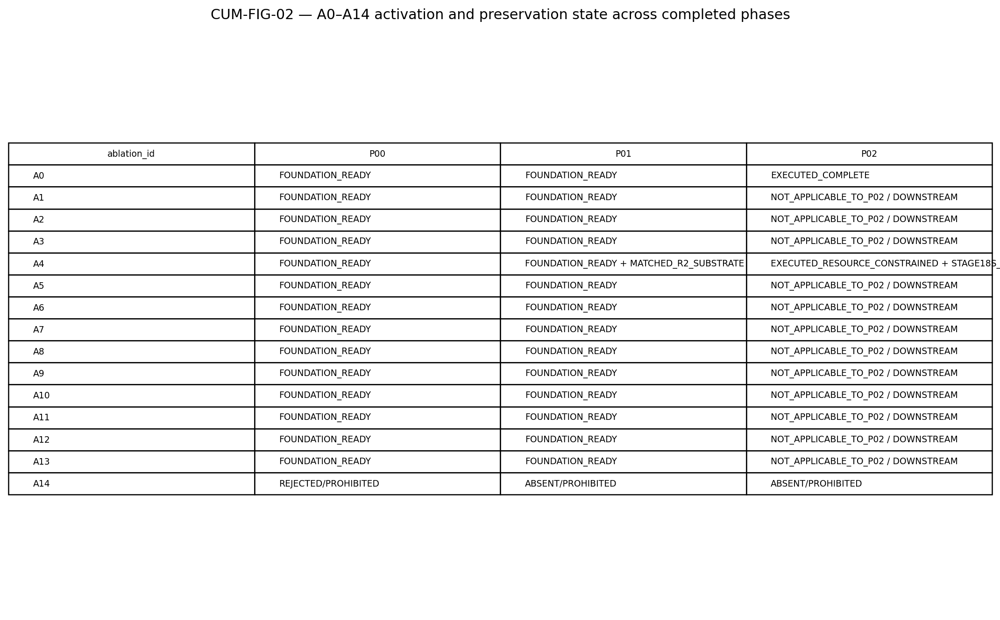

The most important ablation evolution is A4. P00 provides only readiness hooks. P01 turns those hooks into a matched data substrate and produces a **negative feasibility finding** against the original +4.0 s proposal. P02 then executes the revised A4 design. Consequently, the final cumulative interpretation is neither “A4 was ready” nor “A4 works.” It is: **A4 R2 is the valid matched substrate, the governed P02 C1–C3 comparisons did not detect generic improvement under the constrained scope, one specific hard-vote ensemble comparison was significantly worse, and post-hoc sensitivity indicates effect direction can vary across repeat/budget context.**

## 47. Cross-Phase Failure and Correction Synthesis

Failure evidence evolves in scientific relevance:

- In **P00**, malformed-fixture rejection demonstrates validator behavior.
- In **P01**, Stage 07/18/26 failures and the +4.0 s A4 boundary problem show that execution and design can fail closed and be repaired without silently losing the earlier valid denominator.
- In **P02**, Stage 11/12 training-policy corrections, explicit failed model cells, dependency blocks, input incompatibilities and conditional skips become part of the scientific interpretation of model viability and comparison scope.

These evidence classes must remain distinct. A rejected synthetic fixture is not a failed participant or a negative model result. Their cumulative scientific value lies in the common **fail-closed provenance discipline**, not in a pooled failure count.

## 48. Cross-Phase Reproducibility Evolution

P00 demonstrates bounded local reproduction under its exact snapshot. P01 adds immutable dataset identities, 172 HDF5 shards, frozen split/window records, environment amendments and final checksum/gate closure. P02 adds model recipes, stage successors, superseded attempts, prediction/checkpoint semantics, analysis-input freezes and immutable external workspace/release revisions.

This trajectory supports a reproducibility contribution centered on **traceable evolution**: when execution changes, the project records what changed and what did not. It does not support the stronger claim that all environments or external-access conditions are universally reproducible without credentials or equivalence validation.

## 49. Cross-Phase Limitation Lifecycle

| ID | Theme | Introduced | Status after P02 | Current claim impact |
| --- | --- | --- | --- | --- |
| CLIM-01 | Environment portability | P00 | PERSISTING_AS_ENVIRONMENT_SPECIFIC_REPRODUCIBILITY | Reproduction must use recorded environment identities or validate equivalence; no universal portability claim. |
| CLIM-02 | Public/non-clinical EEG scope | P01 | PERSISTING | No clinical effectiveness, patient benefit, deployment safety or medical-device readiness claim. |
| CLIM-03 | External artifact access | P01 | PERSISTING_BUT_RETRIEVAL_ARCHITECTURE_EXTENDED | Scientific content remains available to authorized consumers, but independent retrieval requires credentials and exact revision/hash verification. |
| CLIM-04 | A4 +4.0 s feasibility boundary | P01 | RESOLVED_AS_DATA_FEASIBILITY_PROBLEM | The original +4.0 s proposal remains historically invalid for full-denominator matched execution; R2 is the governed substrate. |
| CLIM-05 | A4 effectiveness untested in P01 | P01 | RESOLVED_AS_UNTESTED_QUESTION_BUT_REPLACED_BY_STRONGER_SCOPE_LIMITATION | Effectiveness is now empirically addressed only within P02 constrained single-repeat/deep-anchor scope. |
| CLIM-06 | A4 repeat and deep-budget coverage | P02 | PERSISTING | No five-repeat stability, dense deep-budget curve or full Build Book replication-equivalence claim. |
| CLIM-07 | Low-label single-subset design | P02 | PERSISTING | Low-label curves are descriptive; no subset-robust sample-efficiency ordering. |
| CLIM-08 | BNCI2014_001 held-out participant count | P02 | PERSISTING | No participant-level inferential generalization from BNCI P02 test result. |
| CLIM-09 | Stage18S post-hoc status | P02 | PHASE_SPECIFIC_PERSISTING_CLAIM_BOUNDARY | Cannot be presented as confirmatory or as retroactively changing G18. |

A key distinction is between **resolved historical limitation** and **scientific limitation that merely changes form**. The P01 +4.0 s A4 feasibility failure is resolved by the matched R2 design. The P01 absence of A4-effectiveness evidence is also resolved in the sense that P02 now supplies effectiveness evidence—but the resulting evidence introduces a new, narrower limitation: single canonical refit repeat and deep anchor budgets. The project therefore learns more while still carrying a claim ceiling.

## 50. Cross-Phase Finding Relationships

| Source finding | Target finding | Relationship | Rationale |
| --- | --- | --- | --- |
| P00-F-006 | P01-FIND-001 | ENABLES | P00 foundation interfaces and records permit P01 to instantiate governed dataset provenance. |
| P00-F-007 | P01-FIND-014 | EXTENDS | P00 reusable phase-contract surfaces are concretized by P01 as a P02-consumable Layer-1 contract. |
| P00-F-009 | P01-FIND-008 | EXTENDS | P00 A0-A13 hooks become explicit Layer-1 readiness records while A14 remains rejected. |
| P01-FIND-002 | P02-FIND-001 | DEPENDS_ON | P02 A0 uses the frozen subject-grouped split rather than inventing a new evaluation population. |
| P01-FIND-003 | P02-FIND-001 | DEPENDS_ON | P02 decoder evidence is measured on the denominator-conserving core materialization established in P01. |
| P01-FIND-006 | P02-FIND-001 | DEPENDS_ON | P02 interpretation inherits the registered split/leakage checks and test-visibility boundary. |
| P01-FIND-007 | P02-FIND-005 | ACTIVATES | P01 frozen low-label population identities become the P02 empirical low-label stress test. |
| P01-FIND-008 | P02-FIND-001 | ACTIVATES_A0 | P01 A0 readiness becomes actual A0 decoder execution in P02. |
| P01-FIND-009 | P02-FIND-009 | ACTIVATES_A4 | The fully matched P01 A4 R2 substrate becomes the canonical P02 A4 execution substrate. |
| P01-FIND-010 | P02-FIND-009 | CONTEXTUALIZES | The P01 +4.0 s feasibility failure explains why the P02 A4 R2 condition family uses the matched +3.5 s substrate. |
| P01-FIND-014 | P02-FIND-014 | FULFILLS_HANDOFF | P02 consumes the frozen Layer-1 contract and produces the Layer-2 evidence/readiness handoff. |
| P01-FIND-009 | P02-FIND-010 | QUALIFIED_BY | P01 established A4 readiness but no effectiveness; P02 finds no generic C1-C3 statistically detectable improvement under the governed constrained scope. |
| P01-FIND-009 | P02-FIND-012 | QUALIFIED_BY | Stage 18S indicates repeat/budget sign sensitivity, limiting stability claims about the previously prepared A4 substrate. |
| P01-FIND-013 | P02-FIND-013 | EXTENDS | P01 fail-closed repair/reentry evolves into P02 preservation of failed, skipped, incompatible and diagnostic evidence. |
| P00-F-008 | P01-FIND-012 | EXTENDS | Local bounded reproduction matures into closed P01 execution/gates/tests and immutable data identities. |
| P01-FIND-012 | P02-FIND-013 | EXTENDS | P02 extends deterministic closure into model-level provenance, failure ledgers, checkpoints/predictions and immutable external storage. |

The relationship graph shows why later phases must not be read as independent experiments. P02 findings often **depend on** P01 integrity findings, while some P02 findings **qualify** P01 readiness expectations. The strongest example is A4: `P01-FIND-009` is a readiness finding; `P02-FIND-010/012` do not contradict the readiness, but they prevent readiness from being misread as performance advantage or repeat stability.

## 51. Cross-Phase Claim Evolution

| Claim theme | P00 | P01 | P02 | Current cumulative state |
| --- | --- | --- | --- | --- |
| Foundation / contract readiness | Approved qualified foundation/readiness claims; non-empirical. | Converted reusable contracts into concrete three-dataset Layer-1 data/split/window readiness and P02 handoff. | Inherited as fixed inputs and produced Layer-2 empirical evidence. | CC-01 / CC-02 |
| A0-A13 readiness and activation | Readiness hooks A0-A13; A14 rejected. | Layer-1 foundation readiness A0-A13; none executed in P01. | A0 and A4 executed; other ablations remain downstream; A14 prohibited. | CC-01 plus phase-specific P02 claims |
| A4 effectiveness | Readiness only. | Matched R2 substrate ready; effectiveness claim P01-CLM-011/v1 deferred. | Governed constrained A4 executed; C1-C3 no raw p<=0.05; one specific negative C4 effect; Stage18S post-hoc sensitivity. | CC-05 |
| Low-label evidence | No empirical low-label evidence. | Exact deterministic budget populations frozen; no performance experiment. | Descriptive low-label performance shows near-chance/non-monotonic/rank-changing behavior. | CC-04 |
| Clinical/deployment readiness | Not established. | P01-CLM-012/v1 rejected. | Measurement ceiling explicitly excludes clinical/deployment/calibration/safety claims. | No positive project-level clinical/deployment claim. |

P00 and P01 already have Layer 0-governed claim histories. P02 candidate claims remain pending Layer 0. The cumulative claims introduced below are **new analytical candidates**, not approvals. They intentionally preserve prior claim ceilings rather than averaging them upward merely because more phases exist.

## 52. Contradictions, Qualifications, and Resolutions

No material cross-phase contradiction requires invalidating an earlier completed phase. The most important apparent contradictions are instead **scope transitions**:

- P01 says A4 is ready; P02 says generic A4 improvement is not detected. These are compatible because readiness and effectiveness are different propositions.
- P01 establishes split/leakage integrity; P02 shows participant/model heterogeneity. These are compatible because data integrity does not imply physiological homogeneity or decoder success.
- P00/P01 reproducibility closure coexists with P02 training-policy correction. This is compatible because reproducible infrastructure does not guarantee that a generic training recipe is scientifically adequate for every architecture.

The cumulative analysis therefore narrows claims without rewriting earlier evidence.

# Part VI — Literature and Scientific Positioning

## 53. Cumulative Comparison With Prior Work

The individual P02 analysis already verifies the original EEGNet, FBCNet, DBConformer, CBraMod, Riemannian and dataset sources. The cumulative synthesis adds only literature that materially clarifies the longitudinal project story. Jayaram and Barachant's original MOABB work is particularly relevant because it identifies small samples and reproducibility as central BCI benchmarking problems and reports that identical pipelines can behave differently across datasets. The larger MOABB benchmark extends this multi-dataset reproducibility perspective across many pipelines and datasets. These studies are **methodological context**, not numerical leaderboards for IHARQ, because evaluation regimes, splits, tasks and supervision differ.

Recent real-world MI decoder evaluation likewise reports ranking shifts and increased inter-subject variability under a different online/short-window regime. This supports caution about universal decoder ranking, but IHARQ's frozen offline subject-grouped P02 protocol is not directly comparable. Cross-session MI data also show that session variability can materially degrade decoding, reinforcing why P02's participant heterogeneity should be treated as an unresolved generalization problem rather than explained away.

| ID | Study | Role in cumulative interpretation | Comparability |
| --- | --- | --- | --- |
| LIT-EEGNET | Lawhern et al. 2018 | Motivates compact EEG-specific architecture and source-centered training recipe; not a direct performance benchmark. | methodological reference only / partial architecture comparison |
| LIT-FBCNET | Mane et al. 2020/2021 | Supports use of filter-bank/variance inductive bias; source diagnostics informed Stage12 author-centered horizon. | methodological reference only |
| LIT-DBCONF | Wang et al. 2026 | Context for strong descriptive full-training performance on two IHARQ datasets; headline paper results are not numerically comparable. | methodological reference only |
| LIT-CBRAMOD | Wang et al. 2025 | Context for foundation-model branch and the difficulty of transferring generic pretrained representations under constrained task-specific supervision. | methodological reference only |
| LIT-RIEMANN | Barachant et al. 2013 | Context for competitive classical/Riemannian baselines and covariance geometry. | methodological reference only |
| LIT-MOABB | Chevallier et al. 2024 | Supports interpretation that model-family performance is evaluation-regime dependent and reproducible benchmarking matters. | contextual benchmark only |
| LIT-EEGPT | Wang et al. 2024 | Broader literature positioning only; not an IHARQ comparator. | methodological reference only |
| LIT-OPENBMI | Lee et al. 2019 | Dataset provenance and external context. | dataset provenance; protocol differs |
| LIT-PHYSIONET | Schalk 2009 | Dataset provenance. | dataset provenance; protocol differs |
| LIT-BCIIV | Tangermann et al. 2012 | Dataset provenance and warning against direct comparison to four-class competition scores. | dataset provenance / contextual only |
| LIT-TCPL2025 | Wang et al. 2025 | Recent evidence that low-label/cross-subject adaptation is an active specialized research problem rather than a solved property of generic decoders. | methodological context only |
| LIT-EEGFMBENCH2025 | Xiong et al. 2025 | Supports the need for standardized downstream evaluation rather than assuming foundation-model superiority from pretraining scale. | contextual benchmark only |
| LIT-MOABB2026PREPRINT | Vasques et al. 2026 preprint | Supports discussion that average rankings can obscure participant-specific decoder behavior; not used as proof of P02 personalization value. | recent preprint; contextual only |
| LIT-MOABB-ORIGINAL | Jayaram & Barachant 2018 | Cross-phase reproducibility and dataset-heterogeneity context. | methodological reference only |
| LIT-REALWORLD-MI-2025 | Nzakuna et al. 2025 | External-validity and participant-heterogeneity discussion. | contextual only |
| LIT-CROSSSESSION-2022 | Ma et al. 2022 | Cross-phase external-validity and unresolved-question context. | contextual only |

## 54. Methodological Differences From External Literature

IHARQ's distinctive analytical emphasis through P02 is not a claim of higher raw performance. It is the combination of: exact upstream data-contract freezing; subject-grouped role isolation; explicit low-label populations; multi-family decoder comparison; governed ablation/control identities; preserved failed/superseded attempts; post-observation amendment disclosure; participant-first statistical inference; and immutable analysis-input/provenance surfaces. Because original model papers often use different datasets, within-subject/cross-validation regimes, preprocessing, training volumes and metrics, external performance values remain contextual unless comparability is explicitly established.

## 55. Contribution / Novelty Assessment

The cumulative evidence supports cautious contribution language around **controlled multi-phase evidence lineage, reproducible multi-family/multi-dataset evaluation, explicit low-label and A4 stress testing, and negative-result preservation**. It does not justify “first,” “state-of-the-art,” “unprecedented,” or a universal decoder-superiority claim. The literature already contains broad reproducibility benchmarks and multi-dataset BCI comparisons; IHARQ's contribution must therefore be framed in terms of its governed evidence architecture and the specific controlled questions it answers, not novelty by mere combination.

# Part VII — Current Project Evidence State

## 56. Cumulative Findings

| ID | Cumulative finding | Supporting phases | Supporting phase findings | Key limitation |
| --- | --- | --- | --- | --- |
| CF-01 | Across P00-P02, IHARQ progressed from validated non-empirical engineering contracts to a provenance-locked Layer-1 EEG substrate and then to a governed Layer-2 empirical decoder/baseline evidence spine without silently redefining phase identities or upstream data contracts. | P00, P01, P02 | P00-F-006, P00-F-007, P01-FIND-014, P02-FIND-001, P02-FIND-014 | Technical/evidence-chain closure is not clinical or deployment validation. |
| CF-02 | The P02 empirical results are interpretable against a stable upstream substrate because P01 froze a subject-grouped disjoint split, conserved all 12,910 accepted events into 12,910 valid core windows, and handed those identities forward; P02 did not require silent relabeling, rewindowing or denominator substitution. | P01, P02 | P01-FIND-002, P01-FIND-003, P01-FIND-006, P01-FIND-014, P02-FIND-001 | The implemented leakage checks are bounded; they do not prove every conceivable leakage mechanism impossible. |
| CF-03 | The transition from a three-dataset Layer-1 foundation to P02 decoder evaluation exposed dataset-dependent model ordering rather than a universal decoder hierarchy; full-training leaders and inferential strength differed materially across BNCI2014_001, Lee2019_MI and PhysioNetMI. | P01, P02 | P01-FIND-001, P02-FIND-002, P02-FIND-003, P02-FIND-004 | BNCI2014_001 has one held-out P02 test participant; no universal rank claim is authorized. |
| CF-04 | P01 low-label readiness became an empirical P02 stress test: the exact frozen 1/2/4/8/16/32-per-class populations were usable downstream, but P02 observed near-chance, non-monotonic and rank-changing low-label behavior rather than a stable universal sample-efficiency ordering. | P01, P02 | P01-FIND-007, P02-FIND-005 | One frozen subset per budget; repeated-subset stability is not established. |
| CF-05 | A4 evolved in two scientifically distinct steps: P01 discovered that the original +4.0 s proposal could not preserve the full parent-event denominator and froze a matched +3.5 s R2 substrate; P02 then evaluated the resulting A4 family and found no generic statistically detectable C1-C3 improvement under its governed resource-constrained scope. | P01, P02 | P01-FIND-009, P01-FIND-010, P02-FIND-009, P02-FIND-010 | P02 canonical A4 uses one refit repeat and deep anchor budgets; absence of detected effects is not proof of zero effect. |
| CF-06 | The P01-deferred question of whether A4 R2 itself improves decoder performance is no longer simply untested after P02; instead it is qualified by predominantly null/heterogeneous control evidence, one specific negative hard-vote ensemble result, and post-hoc Stage 18S sign sensitivity. | P01, P02 | P01-FIND-009, P02-FIND-010, P02-FIND-011, P02-FIND-012 | No five-repeat stability or dense deep-budget response claim; Stage 18S is post-hoc. |
| CF-07 | Because P00/P01 stabilized schemas, data identities, splits and windows before P02 model execution, the Stage 11/12 correction history is best interpreted as a P02-local training/optimization fidelity issue rather than evidence that upstream data foundations were invalid. | P00, P01, P02 | P00-F-005, P01-FIND-003, P01-FIND-014, P02-FIND-006, P02-FIND-008 | Stage 12 before/after diagnostics are validation-only and do not establish universal test-set improvement. |
| CF-08 | Fail-closed behavior is a cumulative methodological property rather than a single-phase anecdote: P00 rejected malformed fixtures, P01 blocked and repaired material stage failures, and P02 preserved failed, skipped, incompatible, superseded and diagnostic outcomes alongside successes. | P00, P01, P02 | P00-F-004, P01-FIND-013, P02-FIND-013 | Engineering rejection evidence and scientific negative results are different evidence classes and must not be numerically pooled. |
| CF-09 | Reproducibility matured from exact local-snapshot foundation evidence in P00, through immutable dataset/split/window identities and execution closure in P01, to model/run/checkpoint/prediction provenance and preserved external P02 workspace/release identities. | P00, P01, P02 | P00-F-008, P01-FIND-004, P01-FIND-011, P01-FIND-012, P02-FIND-013, P02-FIND-014 | Cross-environment portability and private external-artifact access remain bounded rather than universally solved. |
| CF-10 | The scientific evidence ceiling expanded phase by phase—from P00 engineering/readiness evidence, to P01 data-integrity/readiness evidence, to P02 empirical decoder and governed A4 evidence—but later empirical breadth did not erase the project-wide public-benchmark, non-clinical and non-deployment boundary. | P00, P01, P02 | P00-F-009, P01-FIND-008, P02-FIND-001, P02-FIND-014 | No clinical effectiveness, deployment safety, calibrated decision policy, stress robustness or embodiment claim is supported through P02. |
| CF-11 | Participant and dataset heterogeneity become scientifically visible only once the project reaches P02 empirical decoding: upstream integrity enables fair measurement, but does not make individual EEG decoding outcomes homogeneous. | P01, P02 | P01-FIND-002, P01-FIND-003, P02-FIND-002, P02-FIND-004 | P02 does not test a personalization policy or cross-session adaptation mechanism. |
| CF-12 | At the end of P02 the project has a traceable technical continuation point for P03: frozen upstream data identities, canonical P02 predictions/checkpoints/failure semantics and explicit claim restrictions can be inherited without treating technical readiness as downstream scientific success. | P01, P02 | P01-FIND-014, P02-FIND-013, P02-FIND-014 | P03 and later scientific outcomes are not part of the completed evidence through P02. |

## 57. Cumulative Candidate Claims — Pending Layer 0

| ID | Candidate cumulative claim | Support | Ceiling | Mandatory qualification / prohibited stronger wording |
| --- | --- | --- | --- | --- |
| CC-01 | IHARQ P00-P02 forms a governed evidence chain in which validated foundation contracts, a frozen provenance-traceable EEG substrate, and Layer-2 decoder evidence remain linked by explicit identities and handoffs. | P00, P01, P02 | SUPPORTED_WITH_QUALIFICATION | Technical traceability is not scientific/clinical effectiveness by itself. **Prohibited:** Do not state that the complete project is deployment-ready or clinically validated. |
| CC-02 | The P02 decoder results are evaluated on the frozen P01 subject-grouped, denominator-conserving binary motor-imagery data contract rather than on a phase-local redefinition of labels, split or core windows. | P01, P02 | SUPPORTED | Bounded to the implemented registered leakage/disjointness checks. **Prohibited:** Do not claim that every conceivable leakage mechanism is impossible. |
| CC-03 | Across the three governed P02 datasets, decoder-family performance is context-dependent rather than universally ordered, and participant-level heterogeneity further limits global winner claims. | P01, P02 | SUPPORTED_WITH_QUALIFICATION | BNCI held-out test participant n=1; no universal rank claim. **Prohibited:** Do not claim DBConformer, CSP-LDA or any other decoder is universally best. |
| CC-04 | The deterministic low-label populations prepared in P01 exposed difficult, non-monotonic and rank-changing P02 low-label behavior; the completed evidence does not support a universal sample-efficiency ordering. | P01, P02 | SUPPORTED_WITH_QUALIFICATION | Single frozen subset per budget; no repeated-subset stability. **Prohibited:** Do not claim stable low-label resilience or universal sample-efficiency superiority. |
| CC-05 | P01 resolved the A4 data-feasibility problem by freezing a fully matched R2 substrate, while P02 found no generic statistically detectable C1-C3 improvement under the accepted constrained A4 execution and observed additional repeat/budget sign sensitivity post hoc. | P01, P02 | SUPPORTED_WITH_QUALIFICATION | Single canonical refit repeat, deep anchor budgets, Stage18S post-hoc. **Prohibited:** Do not claim A4 has zero effect, is five-repeat stable, or is fully equivalent to the originally planned dense grid. |
| CC-06 | The P02 correction history indicates that architecture-specific training-policy fidelity can materially affect whether a decoder appears collapsed or viable, while upstream P00/P01 data and identity foundations remained stable. | P00, P01, P02 | SUPPORTED_WITH_QUALIFICATION | Diagnostic/validation evidence does not establish universal test-set gains or architecture superiority. **Prohibited:** Do not claim the original uniform policy was theoretically invalid or that source-aligned settings universally improve every model. |
| CC-07 | Across P00-P02, fail-closed validation and explicit preservation of negative/superseded evidence materially improve the interpretability and reproducibility of the project history. | P00, P01, P02 | SUPPORTED_WITH_QUALIFICATION | Different negative-evidence classes are not quantitatively interchangeable. **Prohibited:** Do not claim that fail-closed process guarantees scientific correctness or deployment safety. |
| CC-08 | At the end of P02, the project is technically ready to hand canonical Layer-2 evidence into P03 and downstream governance while carrying forward explicit scope, stability, access and non-clinical limitations. | P01, P02 | SUPPORTED | Downstream science is not yet executed. **Prohibited:** Do not equate technical handoff readiness with future scientific success. |

## 58. Cross-Phase Mechanism Hypotheses

**CH-01 — Dataset/participant interaction hypothesis.** The P02 ranking reversals and participant spread may arise from interactions among recording characteristics, participant neurophysiology, session variability and model inductive bias. The completed phases do not isolate those mechanisms; a future personalization/cross-session design is required.

**CH-02 — Low-label variance hypothesis.** Non-monotonic low-label curves may partly reflect sensitivity to the single frozen subset and architecture-specific inductive bias. Repeated-subset evaluation would be required to separate subset variance from stable sample-efficiency differences.

**CH-03 — Optimization-sensitivity hypothesis.** Stage 11/12 behavior is consistent with architecture-specific optimization landscapes in which a uniform horizon/stopping policy can make viable architectures appear collapsed. The current diagnostics support this as a plausible explanation but do not establish a universal causal law.

**CH-04 — A4 interaction hypothesis.** Stage18/18S sign heterogeneity is consistent with A4 effects interacting with dataset, model role, supervision budget and repeat. The constrained canonical design does not isolate a single dominant mechanism.

## 59. Current Claim Ceilings

Through P02 the project may support engineering/reproducibility, data-integrity/readiness, raw decoder/baseline, bounded low-label descriptive, and governed A4/control claims. It must not claim: universal model superiority; subset-robust sample efficiency; five-repeat A4 stability; dense deep-budget response; full originally planned A4-grid equivalence; calibrated uncertainty/threshold/abstention effectiveness; temporal/stress robustness; embodiment effectiveness; clinical benefit; deployment safety; or medical-device readiness.

## 60. Persistent Limitations

The persistent limitations are summarized in the limitation lifecycle above and machine-readable `limitation_lifecycle.yaml`. The most consequential current limitations are P02 A4 repeat/budget reduction, single-subset low-label design, BNCI held-out participant n=1 for participant-level inference, Stage18S post-hoc status, private/credentialed artifact retrieval, and the public/non-clinical scope.

## 61. Resolved Historical Limitations

Two resolutions are scientifically important. First, the P01 +4.0 s A4 feasibility failure is resolved by the fully matched +3.5 s R2 substrate rather than by padding/clipping/dropping parents. Second, “A4 effectiveness was not executed in P01” is no longer the current project state: P02 has executed A4. However, that resolution does **not** turn into a positive A4-effectiveness claim; P02's actual result is constrained and largely null/heterogeneous.

## 62. Unresolved Scientific Questions

| ID | Question | Why unresolved | Claim impact |
| --- | --- | --- | --- |
| CUQ-01 | How stable are A4 effects across the full five-repeat plan and dense deep-budget surface? | Canonical A4 reduced repeats/deep budgets; Stage18S is post-hoc descriptive only. | Blocks five-repeat stability and dense-budget claims. |
| CUQ-02 | How stable are low-label model rankings to alternative calibration-subset draws? | One frozen subset per budget. | Blocks subset-robust sample-efficiency ranking. |
| CUQ-03 | Which mechanisms drive participant-specific decoder rank reversals and difficult-subject behavior? | P02 measures heterogeneity but does not isolate physiological/session/representation causes. | Blocks causal explanation and personalization claim. |
| CUQ-04 | Do source/author-aligned training corrections generalize as a principled architecture-specific optimization rule? | Corrections were architecture-specific and partly post-observation; diagnostics are validation-only. | Blocks universal optimization-policy claims. |
| CUQ-05 | How do P02 raw decoder outputs behave under calibrated uncertainty, thresholding, abstention, temporal stress and downstream safety policies? | Those responsibilities belong to later layers/phases. | Blocks calibration, selective-risk, stress-robustness, clinical and deployment claims. |

## 63. What the Project Knows at the End of P02

The project now knows that its upstream data/identity pipeline can support a closed Layer-2 decoder evaluation without silent substrate mutation; that full-training model rankings are dataset-dependent; that participant heterogeneity is material; that extreme low-label decoding is difficult and not smoothly ordered under the frozen single-subset design; that source-informed training policy can change apparent model viability; that A4 longer/multi-view controls do not show a generic statistically detectable improvement under the accepted constrained scope; that ordinary hard-vote ensembling can sometimes be worse than a selected constituent; and that post-hoc A4 sensitivity changes effect direction across repeats/budgets.

The project also knows what those findings **do not** establish: stable personalization, five-repeat A4 robustness, universal sample-efficiency ordering, calibrated uncertainty, abstention policy, clinical benefit or deployment safety.

## 64. Downstream Readiness

P03 and later consumers can inherit the P01 data contract and P02 prediction/checkpoint/failure/score semantics through explicit handoffs and immutable external artifact references. They must also inherit the limitations. Later phases should not silently re-open P02 model selection or treat post-hoc sensitivity as confirmatory evidence unless a new governed protocol explicitly does so.

# Part VIII — Paper/Thesis Reuse and Governance Handoffs

## 65. Cumulative Results-to-Claim Traceability

| Cumulative finding | Supporting phase findings | Candidate claims | Paper role |
| --- | --- | --- | --- |
| CF-01 | P00-F-006, P00-F-007, P01-FIND-014, P02-FIND-001, P02-FIND-014 | CC-01 | Methods, reproducibility and project architecture. |
| CF-02 | P01-FIND-002, P01-FIND-003, P01-FIND-006, P01-FIND-014, P02-FIND-001 | CC-01, CC-02 | Methods and validity. |
| CF-03 | P01-FIND-001, P02-FIND-002, P02-FIND-003, P02-FIND-004 | CC-03 | Main Results and Discussion. |
| CF-04 | P01-FIND-007, P02-FIND-005 | CC-04 | Low-label Results and Limitations. |
| CF-05 | P01-FIND-009, P01-FIND-010, P02-FIND-009, P02-FIND-010 | CC-05 | Ablation Study and Discussion. |
| CF-06 | P01-FIND-009, P02-FIND-010, P02-FIND-011, P02-FIND-012 | CC-05 | Ablation negative-result narrative. |
| CF-07 | P00-F-005, P01-FIND-003, P01-FIND-014, P02-FIND-006, P02-FIND-008 | CC-06 | Reproducibility and methodological Discussion. |
| CF-08 | P00-F-004, P01-FIND-013, P02-FIND-013 | CC-07 | Methods, reproducibility and negative-results Discussion. |
| CF-09 | P00-F-008, P01-FIND-004, P01-FIND-011, P01-FIND-012, P02-FIND-013, P02-FIND-014 | CC-01, CC-07 | Reproducibility contribution. |
| CF-10 | P00-F-009, P01-FIND-008, P02-FIND-001, P02-FIND-014 |  | Scope and Limitations. |
| CF-11 | P01-FIND-002, P01-FIND-003, P02-FIND-002, P02-FIND-004 | CC-03 | Discussion and future work. |
| CF-12 | P01-FIND-014, P02-FIND-013, P02-FIND-014 | CC-08 | Handoff and future Methods. |

## 66. Paper Evidence Index

**Main-paper evidence:** dataset-dependent P02 decoder ordering; PhysioNet omnibus heterogeneity with no Holm-significant pairwise winner; exact low-label trajectories/rank changes; P01→P02 A4 feasibility-to-effectiveness story; Stage11/12 training-fidelity lesson.  
**Supplement:** Stage18S sensitivity, diagnostic challenger results, detailed participant distributions, full failure ledgers.  
**Negative-results material:** P01 +4.0 s feasibility failure; P02 null C1–C3 A4 controls; one negative C4 ensemble cell; no consistent Stage11 challenger improvement.  
**Methods/reproducibility material:** P00 contract foundation, P01 exact split/window/denominator and P02 immutable model/run evidence chain.

## 67. Manuscript Methods Reuse

A future Methods section can use P00 for project-governance/reproducibility foundations, P01 for dataset/split/preprocessing/window/budget identities, and P02 for model families, training policy, metrics/statistics and A0/A4 execution. The cumulative report should be cited internally alongside the finalized Protocol for exact execution authority.

## 68. Manuscript Results Reuse

Results should prioritize P02 empirical findings while using P01 numbers to establish denominator/provenance rather than pretending P01 measured decoder performance. Exact P02 numeric source tables are preserved under `table_source_data/p02/` and the full P02 analytical source is preserved under `phase_sources/P02/`.

## 69. Manuscript Discussion Reuse

Discussion themes supported through P02 include multi-dataset/participant heterogeneity; low-label difficulty; training-policy fidelity; the distinction between data readiness and model effectiveness; negative/null A4 results; the value of fail-closed correction; and the difference between reproducible evidence lineage and universal environment/deployment generalization.

## 70. Layer 0 Handoff

P00 and P01 historical Layer 0 dispositions remain governed and are not reopened. P02's 10 candidate claims and the 8 new cumulative candidate claims remain **pending review**. Layer 0 should use the candidate-claim files together with `finding_relationships.yaml`, `results_to_claims.yaml`, `limitation_lifecycle.yaml`, the exact P02 tables, and the finalized Protocol.

## 71. Evidence Map Handoff

The intended chain is: **cumulative claim → cumulative finding → phase finding → Protocol analysis/run identity → analysis source → figure/table → limitation**. All cumulative findings use a separate `CF-*` namespace so phase-local IDs remain stable.

## 72. Layer 10 Handoff

The strongest visualization candidates are the phase dependency figure, ablation-evolution figure, P02 full-training model-by-dataset figure, P02 low-label curves, P02 A4 role-control effect figure and Stage18S sign-consistency figure. Any visualization of A4 must display the single-repeat/deep-anchor and post-hoc limitations proximally.

## 73. Final Scientific Synthesis

The completed P00→P02 sequence demonstrates a disciplined shift from **can the project represent and validate its governed state?** to **is the empirical data substrate exact and reusable?** to **what do decoder families and controls actually do on that substrate?** That progression is scientifically useful because later empirical ambiguity is not allowed to rewrite earlier infrastructure, and earlier infrastructure readiness is not mistaken for later effectiveness.

At P02, the empirical picture is deliberately not simplified into a single winner or positive ablation story. The project observes dataset- and participant-dependent decoder behavior, difficult low-label regimes, architecture-specific optimization sensitivity, predominantly null/heterogeneous A4 role-control effects, one specific negative ensemble comparison, and post-hoc evidence that A4 effect direction can change across repeats/budgets. These results are more informative because P01 already fixed the population and comparison substrate and P00 established the traceability machinery that preserves amendments and failures.

The strongest cumulative scientific lesson is therefore **conditionality with traceability**: valid data foundations are necessary but do not guarantee strong or homogeneous decoder performance; model rankings depend on dataset and participant context; training-policy fidelity can affect whether architectures appear viable; and ablation readiness does not imply ablation benefit. The project has become more empirically informative while its claim boundaries have become more precise.

No completed phase through P02 establishes clinical benefit, deployment safety or the downstream calibrated/abstention/stress/embodiment responsibilities assigned to later layers. The proper continuation is therefore not to strengthen P02 wording, but to carry its exact evidence and limitations into Layer 0, Evidence Map, Layer 10 and P03.

# Appendices

## Appendix A — Cumulative Phase Progression

| Phase | Scientific objective | Inherited evidence | New work | Primary output | Downstream consequence |
| --- | --- | --- | --- | --- | --- |
| P00 | Foundation conformance and reproducibility | None | Engineering/fixture/contract validation | Validated reusable document/schema/record/interface foundation | Makes governed P01 execution possible |
| P01 | Layer-1 public EEG data/split/window contract | P00 foundation | Provenance, split/leakage, preprocessing/window materialization, low-label identities, A4 R2 substrate | Frozen P02-consumable data contract | Makes controlled P02 decoder/A4 evaluation possible |
| P02 | Layer-2 decoder and baseline measurement | P00/P01 contracts and P01 data substrate | Multi-family A0, low-label, A4 controls, training-policy correction, failure/statistical evidence | Canonical predictions/checkpoints/metrics/failure states and downstream readiness | Supports Layer0/Evidence Map/Layer10/P03 handoff |

## Appendix B — Inter-Phase Evidence Evolution

| Theme | P00 | P01 | P02 | Evolution |
| --- | --- | --- | --- | --- |
| Foundation validity | P00 validates schemas/configs/interfaces/fixtures and local reproduction. | P01 instantiates governed EEG dataset/split/window records. | P02 relies on frozen inputs rather than redefining them. | STRENGTHENED: foundation becomes empirically consequential without being reinterpreted as effectiveness. |
| Data provenance and denominator | Readiness contracts only. | 3 datasets; 172 subject groups; 12,910 accepted events -> 12,910 core windows; split/leakage checks PASS. | Same frozen substrate underlies A0/A4 decoder evidence. | STRENGTHENED and ACTIVATED. |
| Low-label | No empirical evidence. | 18 exact budget rows frozen (3 datasets x 6 budgets). | Low-label decoding near chance/non-monotonic with rank changes. | READINESS -> EMPIRICAL STRESS RESULT; universal efficiency claim not supported. |
| Ablation | A0-A13 hooks; A14 rejected. | A0-A13 foundations; A4 R2 matched substrate after +4.0 s infeasibility. | A0 and A4 executed; others downstream; A14 prohibited. | READINESS -> SELECTIVE ACTIVATION; A4 generic benefit not supported. |
| Training/reproduction | Local foundation reproduction. | Actual runtime amendments recorded while data contract preserved. | Stage11/12 source-informed training corrections expose architecture-specific optimization sensitivity. | REFINED: reproducibility must include model-specific training policy, not just data/code identity. |
| Failure evidence | Malformed fixtures rejected. | Material stage failures block and reenter only after repair. | Failed/skipped/incompatible/diagnostic model evidence preserved. | EXTENDED: fail-closed process becomes part of scientific interpretation. |
| Evidence ceiling | Engineering/readiness only. | Data integrity/readiness only; no decoder/clinical claims. | Decoder/A4 empirical evidence, still no clinical/deployment/calibration/safety claims. | EXPANDED but bounded. |

## Appendix C — Cumulative Ablation State

| Ablation | Official identity | P00 | P01 | P02 | Current cumulative status |
| --- | --- | --- | --- | --- | --- |
| A0 | Raw Decoder / Accept-All Raw Decoder Reference | FOUNDATION_READY | FOUNDATION_READY | EXECUTED_COMPLETE | EXECUTED_COMPLETE |
| A1 | Calibrated Decoder / Calibration Visibility | FOUNDATION_READY | FOUNDATION_READY | NOT_APPLICABLE_TO_P02 / DOWNSTREAM | FOUNDATION_READY_FOR_DOWNSTREAM |
| A2 | Simple Registered Threshold / Confidence-Threshold Baseline | FOUNDATION_READY | FOUNDATION_READY | NOT_APPLICABLE_TO_P02 / DOWNSTREAM | FOUNDATION_READY_FOR_DOWNSTREAM |
| A3 | Uncertainty and Selective Prediction | FOUNDATION_READY | FOUNDATION_READY | NOT_APPLICABLE_TO_P02 / DOWNSTREAM | FOUNDATION_READY_FOR_DOWNSTREAM |
| A4 | Longer-Window, Multi-Window Voting/Averaging and Ordinary Ensemble Controls | FOUNDATION_READY | FOUNDATION_READY + MATCHED_R2_SUBSTRATE | EXECUTED_RESOURCE_CONSTRAINED + STAGE18S_POST_HOC | EXECUTED_WITH_EXPLICIT_LIMITATIONS |
| A5 | IHARQ-lite / Rule-Based Evidence Verification | FOUNDATION_READY | FOUNDATION_READY | NOT_APPLICABLE_TO_P02 / DOWNSTREAM | FOUNDATION_READY_FOR_DOWNSTREAM |
| A6 | IHARQ + Evidence-Quality Estimator | FOUNDATION_READY | FOUNDATION_READY | NOT_APPLICABLE_TO_P02 / DOWNSTREAM | FOUNDATION_READY_FOR_DOWNSTREAM |
| A7 | IHARQ + RegimeRisk Temporal Trust | FOUNDATION_READY | FOUNDATION_READY | NOT_APPLICABLE_TO_P02 / DOWNSTREAM | FOUNDATION_READY_FOR_DOWNSTREAM |
| A8 | Learning-to-defer / Deferral Comparison | FOUNDATION_READY | FOUNDATION_READY | NOT_APPLICABLE_TO_P02 / DOWNSTREAM | FOUNDATION_READY_FOR_DOWNSTREAM |
| A9 | Supervised Adaptive-IHARQ / Adaptive Readiness Policy | FOUNDATION_READY | FOUNDATION_READY | NOT_APPLICABLE_TO_P02 / DOWNSTREAM | FOUNDATION_READY_FOR_DOWNSTREAM |
| A10 | Contextual Bandit / Simulation-Bounded Immediate-Reward Adaptation | FOUNDATION_READY | FOUNDATION_READY | NOT_APPLICABLE_TO_P02 / DOWNSTREAM | FOUNDATION_READY_FOR_DOWNSTREAM |
| A11 | Reinforcement-Learning Policy / Simulation-Bounded Sequential Policy Learning | FOUNDATION_READY | FOUNDATION_READY | NOT_APPLICABLE_TO_P02 / DOWNSTREAM | FOUNDATION_READY_FOR_DOWNSTREAM |
| A12 | StressForge Stress Tests / Controlled Stress Robustness | FOUNDATION_READY | FOUNDATION_READY | NOT_APPLICABLE_TO_P02 / DOWNSTREAM | FOUNDATION_READY_FOR_DOWNSTREAM |
| A13 | Layer 9 MyoSuite/OpenSim/static-replay Embodiment Demo | FOUNDATION_READY | FOUNDATION_READY | NOT_APPLICABLE_TO_P02 / DOWNSTREAM | FOUNDATION_READY_FOR_DOWNSTREAM |
| A14 | Rejected / prohibited | REJECTED/PROHIBITED | ABSENT/PROHIBITED | ABSENT/PROHIBITED | PROHIBITED |

## Appendix D — Finding Relationship Graph

| Source finding | Target finding | Relationship | Rationale |
| --- | --- | --- | --- |
| P00-F-006 | P01-FIND-001 | ENABLES | P00 foundation interfaces and records permit P01 to instantiate governed dataset provenance. |
| P00-F-007 | P01-FIND-014 | EXTENDS | P00 reusable phase-contract surfaces are concretized by P01 as a P02-consumable Layer-1 contract. |
| P00-F-009 | P01-FIND-008 | EXTENDS | P00 A0-A13 hooks become explicit Layer-1 readiness records while A14 remains rejected. |
| P01-FIND-002 | P02-FIND-001 | DEPENDS_ON | P02 A0 uses the frozen subject-grouped split rather than inventing a new evaluation population. |
| P01-FIND-003 | P02-FIND-001 | DEPENDS_ON | P02 decoder evidence is measured on the denominator-conserving core materialization established in P01. |
| P01-FIND-006 | P02-FIND-001 | DEPENDS_ON | P02 interpretation inherits the registered split/leakage checks and test-visibility boundary. |
| P01-FIND-007 | P02-FIND-005 | ACTIVATES | P01 frozen low-label population identities become the P02 empirical low-label stress test. |
| P01-FIND-008 | P02-FIND-001 | ACTIVATES_A0 | P01 A0 readiness becomes actual A0 decoder execution in P02. |
| P01-FIND-009 | P02-FIND-009 | ACTIVATES_A4 | The fully matched P01 A4 R2 substrate becomes the canonical P02 A4 execution substrate. |
| P01-FIND-010 | P02-FIND-009 | CONTEXTUALIZES | The P01 +4.0 s feasibility failure explains why the P02 A4 R2 condition family uses the matched +3.5 s substrate. |
| P01-FIND-014 | P02-FIND-014 | FULFILLS_HANDOFF | P02 consumes the frozen Layer-1 contract and produces the Layer-2 evidence/readiness handoff. |
| P01-FIND-009 | P02-FIND-010 | QUALIFIED_BY | P01 established A4 readiness but no effectiveness; P02 finds no generic C1-C3 statistically detectable improvement under the governed constrained scope. |
| P01-FIND-009 | P02-FIND-012 | QUALIFIED_BY | Stage 18S indicates repeat/budget sign sensitivity, limiting stability claims about the previously prepared A4 substrate. |
| P01-FIND-013 | P02-FIND-013 | EXTENDS | P01 fail-closed repair/reentry evolves into P02 preservation of failed, skipped, incompatible and diagnostic evidence. |
| P00-F-008 | P01-FIND-012 | EXTENDS | Local bounded reproduction matures into closed P01 execution/gates/tests and immutable data identities. |
| P01-FIND-012 | P02-FIND-013 | EXTENDS | P02 extends deterministic closure into model-level provenance, failure ledgers, checkpoints/predictions and immutable external storage. |

## Appendix E — Claim Evolution

| Claim theme | P00 | P01 | P02 | Current cumulative state |
| --- | --- | --- | --- | --- |
| Foundation / contract readiness | Approved qualified foundation/readiness claims; non-empirical. | Converted reusable contracts into concrete three-dataset Layer-1 data/split/window readiness and P02 handoff. | Inherited as fixed inputs and produced Layer-2 empirical evidence. | CC-01 / CC-02 |
| A0-A13 readiness and activation | Readiness hooks A0-A13; A14 rejected. | Layer-1 foundation readiness A0-A13; none executed in P01. | A0 and A4 executed; other ablations remain downstream; A14 prohibited. | CC-01 plus phase-specific P02 claims |
| A4 effectiveness | Readiness only. | Matched R2 substrate ready; effectiveness claim P01-CLM-011/v1 deferred. | Governed constrained A4 executed; C1-C3 no raw p<=0.05; one specific negative C4 effect; Stage18S post-hoc sensitivity. | CC-05 |
| Low-label evidence | No empirical low-label evidence. | Exact deterministic budget populations frozen; no performance experiment. | Descriptive low-label performance shows near-chance/non-monotonic/rank-changing behavior. | CC-04 |
| Clinical/deployment readiness | Not established. | P01-CLM-012/v1 rejected. | Measurement ceiling explicitly excludes clinical/deployment/calibration/safety claims. | No positive project-level clinical/deployment claim. |

## Appendix F — Limitation Lifecycle

| ID | Theme | Introduced | Status after P02 | Current claim impact |
| --- | --- | --- | --- | --- |
| CLIM-01 | Environment portability | P00 | PERSISTING_AS_ENVIRONMENT_SPECIFIC_REPRODUCIBILITY | Reproduction must use recorded environment identities or validate equivalence; no universal portability claim. |
| CLIM-02 | Public/non-clinical EEG scope | P01 | PERSISTING | No clinical effectiveness, patient benefit, deployment safety or medical-device readiness claim. |
| CLIM-03 | External artifact access | P01 | PERSISTING_BUT_RETRIEVAL_ARCHITECTURE_EXTENDED | Scientific content remains available to authorized consumers, but independent retrieval requires credentials and exact revision/hash verification. |
| CLIM-04 | A4 +4.0 s feasibility boundary | P01 | RESOLVED_AS_DATA_FEASIBILITY_PROBLEM | The original +4.0 s proposal remains historically invalid for full-denominator matched execution; R2 is the governed substrate. |
| CLIM-05 | A4 effectiveness untested in P01 | P01 | RESOLVED_AS_UNTESTED_QUESTION_BUT_REPLACED_BY_STRONGER_SCOPE_LIMITATION | Effectiveness is now empirically addressed only within P02 constrained single-repeat/deep-anchor scope. |
| CLIM-06 | A4 repeat and deep-budget coverage | P02 | PERSISTING | No five-repeat stability, dense deep-budget curve or full Build Book replication-equivalence claim. |
| CLIM-07 | Low-label single-subset design | P02 | PERSISTING | Low-label curves are descriptive; no subset-robust sample-efficiency ordering. |
| CLIM-08 | BNCI2014_001 held-out participant count | P02 | PERSISTING | No participant-level inferential generalization from BNCI P02 test result. |
| CLIM-09 | Stage18S post-hoc status | P02 | PHASE_SPECIFIC_PERSISTING_CLAIM_BOUNDARY | Cannot be presented as confirmatory or as retroactively changing G18. |

## Appendix G — P02 Completeness and Preservation Declaration

- Expected-evidence requirements dispositioned: **104**.
- Actual P02 evidence-family inventory rows: **46**.
- P02 datasets dispositioned: **3**.
- P02 model/branch dispositions: **16**.
- P02 metric coverage rows: **6**.
- P02 final standalone semantic validation: **431/431 PASS**.
- P02 report preservation result: **NO MATERIAL P02 SCIENTIFIC CONTENT WOULD BE LOST**.
- Cumulative report adds inter-phase analysis without introducing a new confirmatory statistical test family.

## Appendix H — Literature Comparison Index

| ID | Study | Role in cumulative interpretation | Comparability |
| --- | --- | --- | --- |
| LIT-EEGNET | Lawhern et al. 2018 | Motivates compact EEG-specific architecture and source-centered training recipe; not a direct performance benchmark. | methodological reference only / partial architecture comparison |
| LIT-FBCNET | Mane et al. 2020/2021 | Supports use of filter-bank/variance inductive bias; source diagnostics informed Stage12 author-centered horizon. | methodological reference only |
| LIT-DBCONF | Wang et al. 2026 | Context for strong descriptive full-training performance on two IHARQ datasets; headline paper results are not numerically comparable. | methodological reference only |
| LIT-CBRAMOD | Wang et al. 2025 | Context for foundation-model branch and the difficulty of transferring generic pretrained representations under constrained task-specific supervision. | methodological reference only |
| LIT-RIEMANN | Barachant et al. 2013 | Context for competitive classical/Riemannian baselines and covariance geometry. | methodological reference only |
| LIT-MOABB | Chevallier et al. 2024 | Supports interpretation that model-family performance is evaluation-regime dependent and reproducible benchmarking matters. | contextual benchmark only |
| LIT-EEGPT | Wang et al. 2024 | Broader literature positioning only; not an IHARQ comparator. | methodological reference only |
| LIT-OPENBMI | Lee et al. 2019 | Dataset provenance and external context. | dataset provenance; protocol differs |
| LIT-PHYSIONET | Schalk 2009 | Dataset provenance. | dataset provenance; protocol differs |
| LIT-BCIIV | Tangermann et al. 2012 | Dataset provenance and warning against direct comparison to four-class competition scores. | dataset provenance / contextual only |
| LIT-TCPL2025 | Wang et al. 2025 | Recent evidence that low-label/cross-subject adaptation is an active specialized research problem rather than a solved property of generic decoders. | methodological context only |
| LIT-EEGFMBENCH2025 | Xiong et al. 2025 | Supports the need for standardized downstream evaluation rather than assuming foundation-model superiority from pretraining scale. | contextual benchmark only |
| LIT-MOABB2026PREPRINT | Vasques et al. 2026 preprint | Supports discussion that average rankings can obscure participant-specific decoder behavior; not used as proof of P02 personalization value. | recent preprint; contextual only |
| LIT-MOABB-ORIGINAL | Jayaram & Barachant 2018 | Cross-phase reproducibility and dataset-heterogeneity context. | methodological reference only |
| LIT-REALWORLD-MI-2025 | Nzakuna et al. 2025 | External-validity and participant-heterogeneity discussion. | contextual only |
| LIT-CROSSSESSION-2022 | Ma et al. 2022 | Cross-phase external-validity and unresolved-question context. | contextual only |

## Appendix I — Machine-Readable Analytical Package

The cumulative package includes `cumulative_findings.yaml`, `phase_evolution.yaml`, `finding_relationships.yaml`, `cumulative_candidate_claims.yaml`, `claim_evolution.yaml`, `limitation_lifecycle.yaml`, `results_to_claims.yaml`, `cumulative_ablation_analysis.yaml`, `P02_analysis_completeness.yaml`, `paper_evidence_index.yaml`, `downstream_handoff.yaml`, `unresolved_questions.yaml`, `literature_index.yaml`, source-preservation projections, figure/table source data, validation records and checksums.

**CUMULATIVE_PHASE_ANALYSIS_THROUGH_P02_STATUS = FINALIZED_WITH_EXPLICIT_NONBLOCKING_LIMITATIONS**
